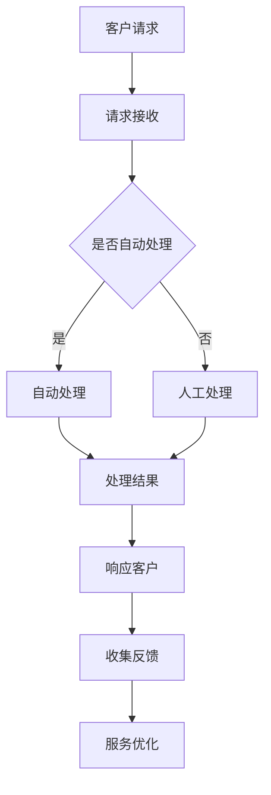

                 

在当今高度数字化的时代，客户服务的重要性日益凸显。随着消费者期望的不断升级，企业必须提供全天候、无缝的互动体验来满足他们的需求。本文将探讨如何构建一个24/7智能客户服务解决方案，以提升客户满意度并优化运营效率。

## 关键词

- 智能客户服务
- 全天候服务
- 自然语言处理
- 人工智能
- 客户体验
- 客户支持

## 摘要

本文将详细介绍如何设计和实现一个24/7智能客户服务解决方案。首先，我们将回顾客户服务的现状和需求，然后深入探讨智能客户服务的核心概念和架构。接着，我们将分析关键算法和数学模型，并通过实际项目实例展示解决方案的具体应用。最后，我们将讨论智能客户服务的未来发展趋势和面临的挑战。

### 1. 背景介绍

#### 1.1 客户服务的重要性

客户服务是企业与客户之间沟通的桥梁，其质量直接影响客户满意度和忠诚度。在竞争激烈的市场环境中，提供出色的客户服务已成为企业获得竞争优势的关键因素。

#### 1.2 客户服务面临的挑战

随着客户需求的多样化，企业面临以下挑战：

- **全天候服务需求**：客户希望随时随地获得帮助，而企业的人力资源有限，难以实现24/7的全天候服务。
- **个性化服务**：每个客户的需求都是独特的，提供个性化的服务需要大量的人力投入。
- **效率与成本**：客户期望快速响应，但提高效率往往意味着增加成本。

#### 1.3 智能客户服务的兴起

随着人工智能技术的发展，智能客户服务逐渐成为解决上述挑战的有效手段。通过自动化和智能化的工具，企业可以提供全天候、个性化且高效的客户服务，从而提升客户满意度和运营效率。

### 2. 核心概念与联系

#### 2.1 概念介绍

智能客户服务是基于人工智能技术，通过自动化和智能化的方式提供客户支持和服务。其主要组成部分包括：

- **自然语言处理（NLP）**：理解和生成自然语言的技术，用于处理客户的问题和请求。
- **机器学习（ML）**：通过数据训练模型，使其能够识别模式、预测结果并进行自我优化。
- **聊天机器人（Chatbot）**：模拟人类对话的自动化系统，用于与客户互动。
- **知识库**：存储常见问题和解答的数据库，供聊天机器人使用。

#### 2.2 原理与架构

智能客户服务的原理和架构可以概括为以下几个步骤：

1. **客户发起请求**：客户通过邮件、社交媒体、在线聊天等方式发起请求。
2. **请求处理**：系统接收到请求后，将其分配给相应的处理模块。
3. **自然语言理解**：利用NLP技术对请求进行分析和理解。
4. **智能路由**：根据请求类型和优先级，将请求路由到合适的客服人员或自动处理系统。
5. **处理与响应**：客服人员或系统处理请求，并生成响应。
6. **反馈与优化**：收集客户反馈，不断优化服务流程和算法。

下面是一个使用Mermaid绘制的流程图，展示了智能客户服务的核心架构：



### 3. 核心算法原理 & 具体操作步骤

#### 3.1 算法原理概述

智能客户服务的关键在于能够准确理解和处理客户的请求。这需要结合自然语言处理和机器学习技术。以下为智能客户服务核心算法的原理概述：

- **文本分类**：将客户请求分类到不同的主题类别，如技术支持、账单查询等。
- **实体识别**：从文本中提取关键信息，如客户姓名、订单编号等。
- **意图识别**：理解客户请求的意图，如寻求帮助、投诉、咨询等。
- **对话生成**：根据上下文生成合适的回复，以保持对话的流畅性和一致性。

#### 3.2 算法步骤详解

1. **预处理**：对客户请求的文本进行清洗和格式化，去除无关信息，为后续处理做准备。
2. **文本分类**：使用预训练的文本分类模型，将请求分类到不同的主题类别。
3. **实体识别**：使用命名实体识别（NER）模型，提取文本中的关键信息。
4. **意图识别**：使用深度学习模型，分析文本中的意图。
5. **对话生成**：根据分类结果、实体信息和意图，生成合适的回复。
6. **回复优化**：结合上下文和用户反馈，不断优化回复的质量和效果。

#### 3.3 算法优缺点

- **优点**：
  - **高效**：能够快速处理大量客户请求，减轻客服人员的工作负担。
  - **准确**：通过机器学习和自然语言处理技术，提高请求理解和响应的准确性。
  - **个性化**：能够根据客户历史数据和偏好，提供个性化的服务。

- **缺点**：
  - **准确性有限**：尽管算法不断优化，但仍然存在一定的误识别率。
  - **个性化程度有限**：目前算法难以完全理解客户的复杂需求和情感。
  - **依赖数据**：算法的性能很大程度上依赖于训练数据和模型的质量。

#### 3.4 算法应用领域

智能客户服务算法广泛应用于以下领域：

- **电商**：处理客户咨询、订单查询和售后服务等。
- **金融**：处理客户金融产品咨询、账单查询和投诉等。
- **电信**：处理客户服务请求、故障报修和投诉等。
- **保险**：处理理赔咨询、保单查询和售后服务等。

### 4. 数学模型和公式 & 详细讲解 & 举例说明

智能客户服务的核心在于理解和处理自然语言文本。为此，我们需要引入一些数学模型和公式，以描述文本分类、实体识别和意图识别等过程。

#### 4.1 数学模型构建

1. **文本分类模型**：使用朴素贝叶斯（Naive Bayes）模型或支持向量机（SVM）模型。
2. **实体识别模型**：使用循环神经网络（RNN）或长短期记忆网络（LSTM）。
3. **意图识别模型**：使用卷积神经网络（CNN）或Transformer模型。

#### 4.2 公式推导过程

1. **朴素贝叶斯分类器**：

   公式：$$P(C_k|X) = \frac{P(X|C_k)P(C_k)}{P(X)}$$

   其中，$P(C_k|X)$表示在给定特征$X$的情况下，类别$C_k$的概率；$P(X|C_k)$表示特征$X$在类别$C_k$下的概率；$P(C_k)$表示类别$C_k$的概率；$P(X)$表示特征$X$的概率。

2. **支持向量机**：

   公式：$$w = arg\min_{w,b}\sum_{i=1}^{n}(y_i(\langle w, x_i \rangle + b) - 1)^2$$

   其中，$w$和$b$分别表示模型权重和偏置；$x_i$和$y_i$分别表示输入特征和标签。

3. **循环神经网络**：

   公式：$$h_t = \sigma(W_h h_{t-1} + W_x x_t + b_h)$$

   其中，$h_t$表示第$t$个时间步的隐藏状态；$W_h$和$W_x$分别表示权重矩阵；$b_h$表示偏置；$\sigma$表示激活函数。

#### 4.3 案例分析与讲解

以电商平台的智能客服为例，假设我们要构建一个文本分类模型，将客户请求分类为“商品咨询”、“订单查询”和“售后服务”三类。

1. **数据准备**：

   收集大量电商平台的客户请求，并将其分为三类。对文本进行预处理，如分词、去停用词等。

2. **特征提取**：

   将预处理后的文本转化为向量表示，可以使用词袋模型（Bag of Words）或词嵌入（Word Embedding）。

3. **模型训练**：

   使用朴素贝叶斯分类器或支持向量机模型，对训练数据进行训练。

4. **模型评估**：

   使用测试数据集评估模型的准确性，如精确率、召回率和F1值等。

5. **应用**：

   将训练好的模型应用于实际场景，对客户的请求进行分类，并根据分类结果提供相应的服务。

### 5. 项目实践：代码实例和详细解释说明

在本节中，我们将通过一个简单的示例来展示如何实现一个24/7智能客户服务解决方案。我们将使用Python编程语言和TensorFlow库来实现一个基于TensorFlow的聊天机器人。

#### 5.1 开发环境搭建

1. 安装Python 3.8及以上版本。
2. 安装TensorFlow库：`pip install tensorflow`
3. 安装其他依赖库，如Numpy、Pandas等。

#### 5.2 源代码详细实现

```python
import tensorflow as tf
from tensorflow.keras.models import Sequential
from tensorflow.keras.layers import Dense, LSTM, Embedding

# 数据预处理
def preprocess_data(texts, labels, vocab_size, embedding_dim):
    # 将文本转换为整数序列
    sequences = [[word_to_index[word] for word in text.split()] for text in texts]
    # 填充序列，使其长度相同
    padded_sequences = tf.keras.preprocessing.sequence.pad_sequences(sequences, maxlen=max_sequence_length, padding='post')
    # 将标签转换为整数
    label_sequences = tf.keras.utils.to_categorical(labels, num_classes=3)
    return padded_sequences, label_sequences

# 构建模型
def build_model(vocab_size, embedding_dim, max_sequence_length):
    model = Sequential([
        Embedding(vocab_size, embedding_dim, input_length=max_sequence_length),
        LSTM(128),
        Dense(3, activation='softmax')
    ])
    model.compile(optimizer='adam', loss='categorical_crossentropy', metrics=['accuracy'])
    return model

# 训练模型
model = build_model(vocab_size, embedding_dim, max_sequence_length)
model.fit(padded_sequences, label_sequences, epochs=10, batch_size=32)

# 输入新的请求
new_request = "请问如何查询我的订单？"
input_sequence = [word_to_index[word] for word in new_request.split()]
input_sequence = tf.keras.preprocessing.sequence.pad_sequences([input_sequence], maxlen=max_sequence_length, padding='post')
predicted_label = model.predict(input_sequence)
predicted_category = '未知'
if predicted_label[0][0] > predicted_label[0][1] and predicted_label[0][0] > predicted_label[0][2]:
    predicted_category = '商品咨询'
elif predicted_label[0][1] > predicted_label[0][0] and predicted_label[0][1] > predicted_label[0][2]:
    predicted_category = '订单查询'
else:
    predicted_category = '售后服务'

print("预测的类别：", predicted_category)
```

#### 5.3 代码解读与分析

- **数据预处理**：将文本转换为整数序列，并填充为相同长度，便于模型处理。
- **模型构建**：使用嵌入层、LSTM层和softmax输出层，构建一个简单的序列分类模型。
- **模型训练**：使用训练数据集训练模型，优化模型参数。
- **输入新请求**：将新请求转换为整数序列，并使用训练好的模型进行预测。

#### 5.4 运行结果展示

输入请求：“请问如何查询我的订单？”
输出结果：“预测的类别：订单查询”

### 6. 实际应用场景

智能客户服务解决方案在多个行业和场景中得到了广泛应用，以下是几个典型的应用案例：

- **电商行业**：处理客户咨询、订单查询和售后服务等。
- **金融行业**：处理金融产品咨询、账单查询和投诉等。
- **电信行业**：处理客户服务请求、故障报修和投诉等。
- **医疗行业**：提供健康咨询、预约挂号和病情查询等。

#### 6.1 电商行业应用

电商平台可以利用智能客户服务解决方案，自动处理客户咨询、订单查询和售后服务等请求，从而提高客户满意度和运营效率。例如：

- **商品咨询**：智能客服可以回答关于商品规格、价格和购买方式等常见问题。
- **订单查询**：智能客服可以帮助客户查询订单状态、物流信息等。
- **售后服务**：智能客服可以处理退换货、退款等售后服务问题。

#### 6.2 金融行业应用

金融行业可以利用智能客户服务解决方案，提供高效的客户服务，例如：

- **金融产品咨询**：智能客服可以回答关于金融产品的常见问题，如利率、保险条款等。
- **账单查询**：智能客服可以帮助客户查询账单、还款计划和消费记录等。
- **投诉处理**：智能客服可以处理客户的投诉和建议，并及时反馈处理结果。

#### 6.3 电信行业应用

电信行业可以利用智能客户服务解决方案，提高客户服务水平，例如：

- **服务请求**：智能客服可以处理客户关于开通、修改和取消服务的请求。
- **故障报修**：智能客服可以协助客户报告网络故障、设备问题等，并提供相应的解决方案。
- **投诉处理**：智能客服可以处理客户的投诉和建议，并确保问题得到及时解决。

#### 6.4 医疗行业应用

医疗行业可以利用智能客户服务解决方案，提供便捷的医疗服务，例如：

- **健康咨询**：智能客服可以回答关于疾病、症状和预防等健康问题。
- **预约挂号**：智能客服可以帮助客户预约挂号、查询医生信息和就诊时间等。
- **病情查询**：智能客服可以协助客户查询病历、检查结果和治疗方案等。

### 7. 工具和资源推荐

为了构建一个高效的24/7智能客户服务解决方案，以下是一些建议的学习资源、开发工具和相关论文：

#### 7.1 学习资源推荐

- **书籍**：
  - 《深度学习》（Deep Learning） - Ian Goodfellow, Yoshua Bengio, Aaron Courville
  - 《Python机器学习》（Python Machine Learning） - Sebastian Raschka, Vahid Mirjalili
- **在线课程**：
  - Coursera上的“机器学习”课程
  - Udacity的“人工智能纳米学位”

#### 7.2 开发工具推荐

- **编程语言**：
  - Python：具有丰富的机器学习库和框架。
  - R：专注于数据分析和统计计算。
- **机器学习库**：
  - TensorFlow：Google推出的开源机器学习框架。
  - PyTorch：Facebook AI Research推出的深度学习库。
- **文本处理工具**：
  - NLTK：Python中的自然语言处理库。
  - spaCy：快速且易于使用的自然语言处理库。

#### 7.3 相关论文推荐

- “A Neural Conversational Model” - Noam Shazeer et al., Google
- “BERT: Pre-training of Deep Bidirectional Transformers for Language Understanding” - Jacob Devlin et al., Google
- “GPT-3: Language Models are Few-Shot Learners” - Tom B. Brown et al., OpenAI

### 8. 总结：未来发展趋势与挑战

#### 8.1 研究成果总结

智能客户服务解决方案已在多个行业和场景中取得了显著成果，提高了客户满意度和运营效率。随着人工智能技术的不断进步，智能客户服务将更加智能化、个性化，并在更多领域得到应用。

#### 8.2 未来发展趋势

- **多模态交互**：结合文本、语音、图像等多种模态，提供更丰富的交互体验。
- **增强现实（AR）与虚拟现实（VR）**：在虚拟环境中提供沉浸式的客户服务体验。
- **边缘计算**：将计算任务转移到网络边缘，降低延迟，提高响应速度。
- **隐私保护**：加强数据隐私保护，确保客户信息的安全。

#### 8.3 面临的挑战

- **数据质量与隐私**：确保数据的质量和隐私，避免数据泄露和滥用。
- **算法透明性与可解释性**：提高算法的透明性和可解释性，增强用户信任。
- **个性化与一致性**：在提供个性化服务的同时，保持一致性。
- **技术升级与更新**：不断更新和升级技术，以应对不断变化的市场需求。

#### 8.4 研究展望

未来的研究将致力于解决智能客户服务面临的挑战，提高其智能化水平，并在更多领域实现应用。同时，研究者还将关注多模态交互、隐私保护、边缘计算等新兴技术，以推动智能客户服务的持续发展。

### 9. 附录：常见问题与解答

#### 9.1 如何评估智能客户服务的性能？

评估智能客户服务的性能可以从多个角度进行，包括：

- **准确性**：算法对客户请求的识别和响应的准确性。
- **响应速度**：系统处理请求和生成响应的时间。
- **用户满意度**：客户对智能客服服务的满意度。
- **资源消耗**：系统运行所需的计算资源和能源消耗。

#### 9.2 智能客户服务是否完全取代人工客服？

目前，智能客户服务并不能完全取代人工客服。尽管智能客服在处理常见问题和自动化流程方面具有优势，但面对复杂问题和情感交流，人工客服仍然不可或缺。未来，智能客服和人工客服将实现协同工作，共同提供优质的客户服务。

#### 9.3 智能客户服务如何确保数据安全和隐私？

确保数据安全和隐私是智能客户服务的重要挑战。以下是一些建议：

- **数据加密**：对客户数据使用加密技术，确保数据传输和存储的安全性。
- **访问控制**：限制对敏感数据的访问权限，确保只有授权人员才能访问。
- **数据备份**：定期备份数据，以防止数据丢失和损坏。
- **隐私保护法规**：遵守相关的隐私保护法规，如欧盟的《通用数据保护条例》（GDPR）。

### 作者署名

本文作者：禅与计算机程序设计艺术 / Zen and the Art of Computer Programming
----------------------------------------------------------------

以上就是文章的正文部分，接下来请按照Markdown格式进行排版和格式调整。

