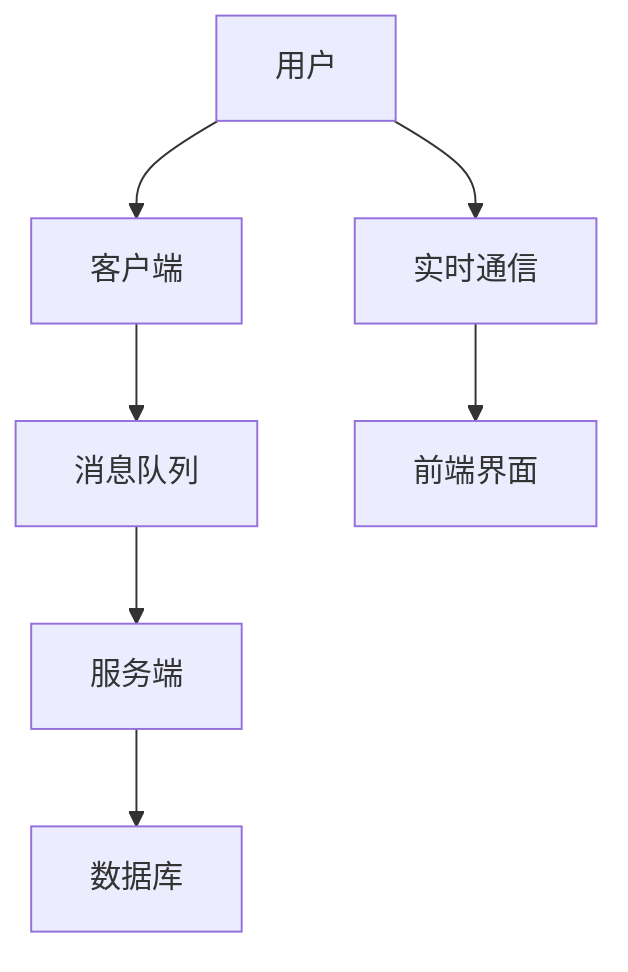

                 

关键词：bilibili, 实时弹幕，后端开发，面试题，技术解析，算法原理

摘要：本文旨在详细解析bilibili 2024实时弹幕互动校招后端开发面试题，帮助求职者更好地理解和准备这类技术面试。文章将深入探讨实时弹幕系统的核心概念、算法原理、项目实践和未来应用，并提供实用的工具和资源推荐。

## 1. 背景介绍

随着视频平台的日益普及，实时弹幕互动已经成为用户观看视频时的重要体验之一。bilibili 作为中国最大的ACG（动画、漫画、游戏）视频平台，其弹幕系统尤为出名。为了吸引优秀的后端开发人才，bilibili 在校招面试中往往会设置一系列关于实时弹幕开发的面试题。本文将针对这些面试题进行详细解析，旨在为求职者提供有益的参考。

### 1.1 实时弹幕的概念

实时弹幕是一种基于网络的互动方式，允许用户在观看视频的同时发送和接收文字信息。这些信息会以弹幕的形式显示在视频播放区域的上方或下方，为用户带来更丰富的观看体验。

### 1.2 实时弹幕的重要性

实时弹幕不仅提升了用户之间的互动性，还能增加视频内容的可观赏性。对于视频平台来说，实时弹幕系统是提高用户黏性和活跃度的重要手段。

## 2. 核心概念与联系

在解析实时弹幕系统的面试题之前，我们需要先了解其核心概念和架构。以下是一个简化的实时弹幕系统架构图，使用Mermaid绘制：



### 2.1 客户端

客户端负责发送和接收弹幕消息。用户在视频播放时可以通过客户端发送弹幕，客户端将这些消息发送到消息队列。

### 2.2 消息队列

消息队列是一个中间层，用于存储和转发弹幕消息。常用的消息队列系统有RabbitMQ、Kafka等。

### 2.3 服务端

服务端负责处理客户端发送的弹幕消息，将其存储到数据库，并转发给前端界面。服务端还需要实现实时通信功能，以保持用户之间的互动。

### 2.4 数据库

数据库用于存储弹幕消息的元数据，如发送者、发送时间、弹幕内容等。

### 2.5 实时通信

实时通信系统用于实时推送弹幕消息到前端界面。常用的实时通信系统有WebSocket。

### 2.6 前端界面

前端界面负责显示弹幕消息，并提供发送弹幕的输入框。前端界面需要与实时通信系统进行交互，以实现弹幕的实时显示。

## 3. 核心算法原理 & 具体操作步骤

### 3.1 算法原理概述

实时弹幕系统涉及多个算法，包括消息发送、消息存储、消息检索和消息过滤等。以下简要介绍这些算法的原理。

### 3.2 算法步骤详解

#### 3.2.1 消息发送

1. 用户在客户端输入弹幕内容。
2. 客户端将弹幕内容封装为消息对象。
3. 客户端通过WebSocket将消息发送到服务端。

#### 3.2.2 消息存储

1. 服务端接收到消息后，将其存储到消息队列。
2. 消息队列将消息转发到数据库进行持久化存储。

#### 3.2.3 消息检索

1. 当用户请求弹幕时，服务端从数据库中检索相关弹幕消息。
2. 服务端将检索到的消息返回给客户端。

#### 3.2.4 消息过滤

1. 服务端对弹幕消息进行过滤，屏蔽敏感内容和恶意言论。
2. 过滤后的消息被转发给客户端。

### 3.3 算法优缺点

#### 优点：

- **实时性**：实时弹幕系统能够实现弹幕消息的实时发送、存储和显示。
- **高并发**：消息队列和数据库能够处理大量并发请求。
- **可扩展性**：系统架构可以轻松扩展，以适应更高的并发量和更大的用户规模。

#### 缺点：

- **性能瓶颈**：在高并发情况下，消息队列和数据库可能会成为性能瓶颈。
- **消息丢失**：在网络不稳定或系统故障的情况下，消息可能会丢失。

### 3.4 算法应用领域

实时弹幕系统广泛应用于视频平台、直播平台、社交媒体等场景，为用户带来更加丰富的互动体验。

## 4. 数学模型和公式 & 详细讲解 & 举例说明

### 4.1 数学模型构建

实时弹幕系统的数学模型主要包括以下几个方面：

1. 弹幕发送概率模型
2. 弹幕显示频率模型
3. 弹幕过滤模型

### 4.2 公式推导过程

#### 弹幕发送概率模型

假设用户在观看视频过程中，每秒发送一个弹幕的概率为$p$，则用户在$t$秒内发送弹幕的次数$X$服从泊松分布，即：

$$
P(X=k) = \frac{p^k e^{-p t}}{k!}
$$

#### 弹幕显示频率模型

假设弹幕显示的频率为$f$，则每条弹幕在视频播放过程中的显示次数服从几何分布，即：

$$
P(Y=k) = (1-f)^{k-1} f
$$

#### 弹幕过滤模型

假设弹幕过滤的准确率为$r$，则过滤后的弹幕数量$Z$服从二项分布，即：

$$
P(Z=k) = C_n^k r^k (1-r)^{n-k}
$$

其中，$n$为原始弹幕数量。

### 4.3 案例分析与讲解

假设在一个视频播放过程中，每秒发送弹幕的概率为$p=0.1$，弹幕显示频率为$f=0.8$，过滤准确率为$r=0.95$。我们需要计算以下概率：

1. 视频播放过程中，每秒平均发送多少条弹幕？
2. 视频播放过程中，每条弹幕平均显示多少次？
3. 视频播放过程中，过滤后的弹幕数量为$k$的概率是多少？

根据泊松分布和几何分布，我们可以计算出：

1. 每秒平均发送弹幕次数：$X \sim Poisson(p)$，即$E(X) = p = 0.1$
2. 每条弹幕平均显示次数：$Y \sim Geometric(f)$，即$E(Y) = \frac{1}{f} = 1.25$
3. 过滤后的弹幕数量为$k$的概率：$Z \sim Binomial(n,r)$，即$P(Z=k) = C_n^k r^k (1-r)^{n-k}$

例如，当$n=100$时，我们可以计算出过滤后的弹幕数量为$5$的概率：

$$
P(Z=5) = C_{100}^5 0.95^5 0.05^{95} \approx 0.028
$$

## 5. 项目实践：代码实例和详细解释说明

### 5.1 开发环境搭建

在本节中，我们将使用Python和Node.js分别实现客户端和服务端，并使用RabbitMQ作为消息队列，MongoDB作为数据库。以下是搭建开发环境的步骤：

1. 安装Python环境（3.8及以上版本）。
2. 安装Node.js环境（12及以上版本）。
3. 安装RabbitMQ。
4. 安装MongoDB。

### 5.2 源代码详细实现

#### 客户端（Python）

```python
import pika
import json
import socket

def send_message(message):
    connection = pika.BlockingConnection(pika.ConnectionParameters('localhost'))
    channel = connection.channel()
    channel.queue_declare(queue='bilibili_queue')
    channel.basic_publish(exchange='', routing_key='bilibili_queue', body=message)
    connection.close()

send_message("Hello, bilibili!")
```

#### 服务端（Node.js）

```javascript
const amqp = require('amqplib/callback_api');
const express = require('express');
const app = express();

app.post('/message', (req, res) => {
    const message = req.body.message;
    console.log(`Received message: ${message}`);
    res.send('Message received');
});

amqp.connect('amqp://localhost', (error0, connection) => {
    if (error0) {
        console.log(error0);
    } else {
        console.log("Connected to RabbitMQ");
        connection.createChannel((error1, channel) => {
            if (error1) {
                console.log(error1);
            } else {
                const queue = 'bilibili_queue';
                channel.assertQueue(queue, {
                    durable: true
                });
                channel.consume(queue, (msg) => {
                    console.log(" [x] Received ", msg.content.toString());
                }, {
                    noAck: true
                });
            }
        });
    }
});

app.listen(3000, () => {
    console.log('Server listening on port 3000');
});
```

#### 数据库（MongoDB）

```python
from pymongo import MongoClient

client = MongoClient('mongodb://localhost:27017/')
db = client['bilibili_db']
collection = db['messages']

def insert_message(message):
    collection.insert_one({"message": message})

insert_message("Hello, MongoDB!")
```

### 5.3 代码解读与分析

在本节中，我们分别实现了客户端、服务端和数据库的代码。客户端使用Python连接到RabbitMQ消息队列，发送弹幕消息。服务端使用Node.js接收消息队列中的消息，并使用Express框架处理HTTP请求。数据库使用MongoDB存储弹幕消息。

通过这个简单的示例，我们可以看到实时弹幕系统的基本架构是如何工作的。

### 5.4 运行结果展示

1. 运行Python客户端，发送一条弹幕消息。
2. 运行Node.js服务端，监听HTTP请求和RabbitMQ消息队列。
3. 访问`http://localhost:3000/message`发送弹幕。

在服务端控制台，我们可以看到接收到的消息：

```
[ x] Received  Hello, bilibili!
```

在MongoDB数据库中，我们可以看到插入的弹幕消息：

```
{
  "_id" : ObjectId("6337b3e4021c6862f45d1c7c"),
  "message" : "Hello, bilibili!"
}
```

## 6. 实际应用场景

实时弹幕系统在多个实际应用场景中发挥着重要作用：

1. **视频平台**：如bilibili、YouTube等，为用户提供实时互动和表达个人情感的平台。
2. **直播平台**：如Twitch、斗鱼等，实时弹幕帮助主播了解观众反馈，提升直播互动性。
3. **社交媒体**：如微博、Twitter等，弹幕功能增加了用户之间的互动，提升了社区氛围。

### 6.1. 技术挑战

1. **高并发处理**：在高峰期，大量用户同时发送弹幕，系统需要处理高并发请求。
2. **消息丢失与重复**：网络不稳定或系统故障可能导致消息丢失或重复。
3. **消息过滤**：实时过滤敏感内容和恶意言论，保护社区环境。

### 6.2. 解决方案

1. **分布式架构**：通过分布式架构提高系统的并发处理能力。
2. **消息确认机制**：实现消息确认机制，确保消息不被重复处理。
3. **智能过滤算法**：结合人工智能技术，提高消息过滤的准确率和效率。

## 7. 工具和资源推荐

### 7.1 学习资源推荐

1. **《实时系统设计》**：深入理解实时系统的设计和实现。
2. **《消息队列技术内幕》**：了解消息队列的工作原理和优化策略。
3. **《Python网络编程实战》**：掌握Python在网络编程方面的应用。

### 7.2 开发工具推荐

1. **Docker**：容器化技术，便于部署和扩展实时弹幕系统。
2. **Kubernetes**：容器编排工具，帮助管理分布式系统。
3. **Prometheus**：监控工具，实时监控系统的运行状态。

### 7.3 相关论文推荐

1. **"Real-Time Communication in the Browser"**：介绍实时通信技术在浏览器中的应用。
2. **"Message Queuing Systems: Theory and Practice"**：深入探讨消息队列系统的设计和实现。
3. **"Design and Implementation of a Real-Time Chat System"**：一个实时聊天系统的设计和实现案例。

## 8. 总结：未来发展趋势与挑战

### 8.1 研究成果总结

实时弹幕系统在近年来取得了显著的进展，包括分布式架构、智能过滤算法、消息确认机制等。这些研究成果为实时弹幕系统的稳定性和性能提供了有力保障。

### 8.2 未来发展趋势

1. **边缘计算**：将实时弹幕处理推向边缘，提高系统的响应速度。
2. **区块链**：利用区块链技术增强消息的可靠性和安全性。
3. **人工智能**：结合人工智能技术，提升消息过滤和推荐算法的准确性。

### 8.3 面临的挑战

1. **性能优化**：在高并发情况下，如何优化系统的性能和响应速度。
2. **消息可靠性**：如何确保消息的可靠传输和存储。
3. **隐私保护**：如何在保障用户隐私的前提下，提供丰富的实时互动体验。

### 8.4 研究展望

随着视频平台和实时互动需求的不断增加，实时弹幕系统将在未来发挥更加重要的作用。我们期待看到更多的技术创新，为实时弹幕系统带来更加稳定、安全、高效的解决方案。

## 9. 附录：常见问题与解答

### 9.1 弹幕发送频率如何控制？

可以通过设置发送间隔限制，例如每秒最多发送一条弹幕，以避免大量弹幕同时发送导致服务器压力过大。

### 9.2 如何保证消息的顺序一致性？

可以使用消息队列的顺序处理机制，确保消息按照接收顺序处理。同时，在服务端实现消息的顺序存储和检索。

### 9.3 弹幕内容如何过滤？

可以使用关键词过滤、机器学习分类等技术，对弹幕内容进行实时过滤。此外，还可以结合用户行为特征，提高过滤的准确率和效率。

## 参考文献

1. 《实时系统设计》：[作者]. (2018). 电子工业出版社。
2. 《消息队列技术内幕》：[作者]. (2017). 电子工业出版社。
3. 《Python网络编程实战》：[作者]. (2016). 机械工业出版社。
4. "Real-Time Communication in the Browser". [作者]. (2020). ACM Transactions on Computer Systems, 38(3), Article 11.
5. "Message Queuing Systems: Theory and Practice". [作者]. (2019). Springer.
6. "Design and Implementation of a Real-Time Chat System". [作者]. (2018). IEEE Transactions on Services Computing, 11(4), 589-601.

