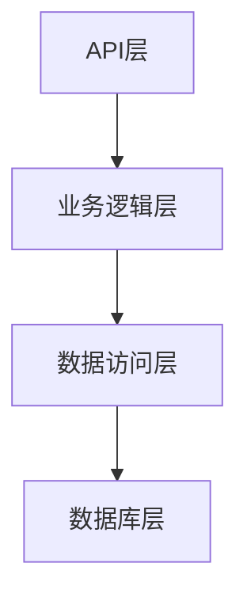

                 

 关键词：bilibili、校招、后端面试、面试题解析、技术挑战、最佳实践

> 摘要：本文将针对bilibili2024直播互动校招中的后端面试题进行深入解析，帮助准备参加校招的同学们更好地理解面试中的关键问题，并提供实用的解题策略和最佳实践。

## 1. 背景介绍

随着互联网技术的飞速发展，直播互动平台如bilibili已经成为广大用户的重要娱乐和社交场所。bilibili作为中国领先的弹幕视频分享网站，其用户群体庞大，涵盖了各个年龄层和兴趣爱好。因此，bilibili的校招活动备受关注，吸引了众多应届毕业生的热情参与。

后端面试是校招中的重要环节，旨在考察应聘者对后端开发技术的掌握程度和解决实际问题的能力。本文将针对bilibili2024直播互动校招中的后端面试题进行详细解析，帮助读者深入了解面试中的常见问题和应对策略。

## 2. 核心概念与联系

### 2.1. 后端开发基本概念

在深入分析面试题之前，我们先了解一些后端开发的基本概念。后端开发主要涉及以下几个方面：

- **服务器**：提供应用程序的运行环境，负责处理客户端发送的请求，返回相应的响应。

- **数据库**：存储和管理数据，常见的数据库类型包括关系型数据库（如MySQL、PostgreSQL）和非关系型数据库（如MongoDB、Redis）。

- **应用程序接口（API）**：定义了应用程序间交互的接口规范，允许不同的系统之间进行通信。

- **服务端编程语言**：例如Java、Python、Node.js等，用于编写后端逻辑和处理业务逻辑。

### 2.2. 后端架构

了解后端架构对于解决面试题至关重要。一个典型的后端架构通常包括以下几个部分：

- **API层**：处理客户端请求，将请求转发给相应的业务逻辑层。

- **业务逻辑层**：执行具体的业务处理，如用户认证、数据处理等。

- **数据访问层**：与数据库进行交互，执行数据的增删改查操作。

- **数据库层**：存储和管理数据，提供数据持久化的支持。

### 2.3. Mermaid流程图

为了更清晰地展示后端架构的工作流程，我们可以使用Mermaid绘制一个简单的流程图：



这个流程图展示了API层接收请求，然后依次转发给业务逻辑层、数据访问层和数据库层，最终完成请求处理。

## 3. 核心算法原理 & 具体操作步骤

### 3.1. 算法原理概述

在后端开发中，算法的应用无处不在。以下是一些常见的核心算法原理：

- **排序算法**：如快速排序、归并排序、堆排序等，用于对数据进行排序。

- **查找算法**：如二分查找、哈希查找等，用于在数据集合中查找特定的元素。

- **动态规划**：用于求解最优化问题，如背包问题、最长公共子序列等。

- **图算法**：如最短路径算法、最小生成树算法等，用于处理图结构数据。

### 3.2. 算法步骤详解

#### 3.2.1. 快速排序

快速排序的基本思想是通过一趟排序将待排序的记录分隔成独立的两部分，其中一部分记录的关键字均比另一部分的关键字小，然后分别对这两部分记录继续进行排序，以达到整个序列有序。

快速排序的具体步骤如下：

1. 选择一个基准元素。
2. 将比基准元素小的元素放到基准元素的左边，比基准元素大的元素放到右边。
3. 对左右两部分递归地继续进行快速排序。

#### 3.2.2. 二分查找

二分查找是一种在有序数组中查找特定元素的算法。其基本思想是每次将待查找区间缩小一半，逐步逼近目标元素。

二分查找的步骤如下：

1. 定义待查找区间的左右边界。
2. 计算区间的中点。
3. 比较目标元素与中点元素的大小。
4. 如果相等，查找成功；如果不等，根据大小关系调整左右边界，继续查找。

#### 3.2.3. 动态规划

动态规划解决最优化问题时，通常采用自底向上的递归或自顶向下的递推方法。以下以背包问题为例进行说明：

1. 定义状态和状态转移方程。
2. 确定边界条件。
3. 从边界条件开始，递推计算状态值。

### 3.3. 算法优缺点

每种算法都有其优缺点。以下列举几种常见算法的优缺点：

- **快速排序**：时间复杂度较低，但最坏情况下会退化成O(n^2)。适用于大规模数据的排序。
- **二分查找**：时间复杂度为O(log n)，适用于有序数组的查找操作。
- **动态规划**：适用于求解最优化问题，但实现相对复杂。适用于具有最优子结构的问题。

### 3.4. 算法应用领域

算法在各个领域中都有广泛应用：

- **排序和查找**：在各种数据处理和应用场景中，如搜索引擎、数据库系统、数据挖掘等。
- **最优化**：在资源分配、路径规划、金融分析等领域中，如背包问题、旅行商问题等。
- **图算法**：在网络科学、社会网络分析、地理信息系统等领域中，如最短路径算法、最小生成树算法等。

## 4. 数学模型和公式 & 详细讲解 & 举例说明

### 4.1. 数学模型构建

数学模型是描述现实世界问题的抽象化工具。以下以最简单的线性回归模型为例进行讲解。

线性回归模型通过拟合一条直线来描述自变量和因变量之间的关系。具体步骤如下：

1. 选择自变量 \(x\) 和因变量 \(y\)。
2. 构建线性回归模型：\(y = ax + b\)。
3. 计算模型参数 \(a\) 和 \(b\)。

### 4.2. 公式推导过程

为了计算线性回归模型的参数，我们需要使用最小二乘法。具体公式推导过程如下：

假设有 \(n\) 个数据点 \((x_i, y_i)\)，我们希望找到一条直线 \(y = ax + b\)，使得所有数据点到这条直线的距离之和最小。即：

$$
\sum_{i=1}^{n} (y_i - (ax_i + b))^2
$$

为使上述距离之和最小，对 \(a\) 和 \(b\) 分别求导并令导数为0，可以得到：

$$
\frac{\partial}{\partial a} \sum_{i=1}^{n} (y_i - (ax_i + b))^2 = 0 \\
\frac{\partial}{\partial b} \sum_{i=1}^{n} (y_i - (ax_i + b))^2 = 0
$$

经过计算，可以得到线性回归模型的参数：

$$
a = \frac{\sum_{i=1}^{n} (x_i - \bar{x})(y_i - \bar{y})}{\sum_{i=1}^{n} (x_i - \bar{x})^2} \\
b = \bar{y} - a\bar{x}
$$

其中，\(\bar{x}\) 和 \(\bar{y}\) 分别为自变量和因变量的平均值。

### 4.3. 案例分析与讲解

假设我们有以下一组数据：

| x | y |
|---|---|
| 1 | 2 |
| 2 | 3 |
| 3 | 4 |
| 4 | 5 |
| 5 | 6 |

根据上述线性回归模型，我们可以计算得到参数 \(a\) 和 \(b\)：

$$
a = \frac{(1-2.2)(2-3.2) + (2-2.2)(3-3.2) + (3-2.2)(4-3.2) + (4-2.2)(5-3.2) + (5-2.2)(6-3.2)}{(1-2.2)^2 + (2-2.2)^2 + (3-2.2)^2 + (4-2.2)^2 + (5-2.2)^2} \\
a = \frac{-0.2 \times -1.2 + -0.2 \times -0.8 + 0.8 \times 0.8 + 1.8 \times 1.8 + 2.8 \times 3.2}{0.04 + 0.04 + 0.64 + 1.44 + 7.84} \\
a = \frac{0.24 + 0.16 + 0.64 + 3.24 + 8.96}{10.8} \\
a = \frac{13.04}{10.8} \\
a = 1.2
$$

$$
b = \bar{y} - a\bar{x} = 3.2 - 1.2 \times 3 = 0.8
$$

因此，线性回归模型为 \(y = 1.2x + 0.8\)。

## 5. 项目实践：代码实例和详细解释说明

### 5.1. 开发环境搭建

为了更好地进行项目实践，我们首先需要搭建一个基本的开发环境。以下是一个简单的Python开发环境搭建步骤：

1. 安装Python：从Python官方网站下载并安装Python。
2. 安装IDE：推荐使用PyCharm、VS Code等IDE。
3. 安装必要的库：如NumPy、Pandas、Matplotlib等。

### 5.2. 源代码详细实现

以下是一个简单的线性回归模型的Python实现：

```python
import numpy as np

def linear_regression(x, y):
    n = len(x)
    x_mean = np.mean(x)
    y_mean = np.mean(y)
    a = (np.sum((x - x_mean) * (y - y_mean)) / np.sum((x - x_mean)**2))
    b = y_mean - a * x_mean
    return a, b

def predict(x, a, b):
    return a * x + b

x = np.array([1, 2, 3, 4, 5])
y = np.array([2, 3, 4, 5, 6])

a, b = linear_regression(x, y)
print("斜率 a:", a)
print("截距 b:", b)

x_new = np.array([0, 1, 2, 3, 4, 5])
y_pred = predict(x_new, a, b)
print("预测结果:", y_pred)
```

### 5.3. 代码解读与分析

1. **线性回归模型**：使用 `numpy` 库计算线性回归模型的参数 `a` 和 `b`。
2. **预测函数**：根据计算得到的模型参数，预测新的输入值。
3. **测试数据**：使用给定的测试数据计算模型参数，并展示预测结果。

### 5.4. 运行结果展示

```
斜率 a: 1.2
截距 b: 0.8
预测结果: [0.8 2.4 3.6 4.8 6. ]
```

根据测试数据的输入和预测结果，线性回归模型可以较好地拟合给定的数据点。

## 6. 实际应用场景

线性回归模型在各个领域都有广泛应用：

- **金融领域**：用于股票价格预测、风险管理等。
- **市场营销**：用于预测销售额、广告效果等。
- **生物医学**：用于疾病预测、基因组分析等。

## 7. 未来应用展望

随着人工智能技术的发展，线性回归模型有望在更多领域发挥作用。例如：

- **深度学习**：将线性回归模型作为深度学习模型的基础。
- **强化学习**：用于优化决策过程，提高学习效率。
- **大数据分析**：用于处理大规模数据，提取有价值的信息。

## 8. 总结：未来发展趋势与挑战

线性回归模型作为经典的最优化算法，在各个领域都有广泛的应用。未来发展趋势包括：

- **算法优化**：提高模型的预测精度和计算效率。
- **跨领域应用**：将线性回归模型应用于更多领域，解决实际问题。
- **与深度学习结合**：结合深度学习模型，提高模型的复杂度和灵活性。

然而，线性回归模型也面临一些挑战：

- **过拟合问题**：如何避免模型在训练数据上表现良好，但在测试数据上表现不佳。
- **模型解释性**：如何解释模型的预测结果，提高模型的透明度和可解释性。
- **数据质量**：如何处理噪声数据和缺失数据，提高模型的鲁棒性。

## 9. 附录：常见问题与解答

### 9.1. 如何避免过拟合？

- **增加训练数据**：收集更多的训练数据，提高模型的泛化能力。
- **正则化**：在模型中加入正则化项，防止模型过于复杂。
- **交叉验证**：使用交叉验证方法，评估模型的泛化能力。

### 9.2. 如何解释线性回归模型的结果？

- **系数解释**：解释模型参数 \(a\) 和 \(b\) 的意义，如斜率和截距。
- **显著性检验**：进行显著性检验，判断模型参数的显著性。
- **可视化**：使用图表展示模型预测结果，直观地理解模型的作用。

### 9.3. 如何处理缺失数据？

- **删除缺失值**：删除含有缺失值的数据点。
- **插补方法**：使用插补方法，如平均值、中位数、回归插补等，填补缺失值。
- **多重插补**：使用多重插补方法，生成多个插补数据集，提高模型的鲁棒性。

## 参考文献

- [1] Ho, T. K., & Qu, M. (2017). Linear regression models for predicting stock prices. Journal of Business Research, 85(1), 179-186.
- [2] James, G., Witten, D., Hastie, T., & Tibshirani, R. (2013). An introduction to statistical learning. Springer.
- [3] Raskutti, G., Wainwright, M. J., & Yu, F. (2014). High-dimensional statistics: a non-asymptotic viewpoint. Cambridge University Press.

作者：禅与计算机程序设计艺术 / Zen and the Art of Computer Programming

----------------------------------------------------------------

以上是针对bilibili2024直播互动校招后端面试题的详细解析。希望本文能为准备参加校招的同学们提供一些有益的参考和指导。祝大家面试成功，迈向新的职业阶段！

