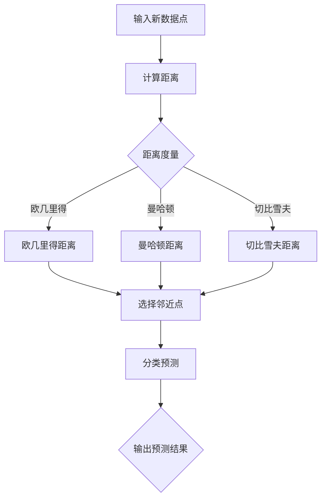

                 

关键词：k-近邻算法，机器学习，分类算法，数据科学，分类准确率，案例解析

摘要：本文将深入探讨k-近邻算法（k-Nearest Neighbors, k-NN）的核心原理，并通过具体的代码实例来解释其实现过程。我们将详细讨论k-NN算法的优点和缺点，并展示其在实际应用中的强大潜力。读者将能够通过本文掌握k-NN算法的基本概念和应用技巧，从而为其未来的机器学习和数据科学项目打下坚实的基础。

## 1. 背景介绍

k-近邻算法是一种简单而强大的机器学习算法，广泛应用于分类问题。其基本思想非常直观：对于一个未知类别的新数据点，通过计算其与已标记数据点的相似度，找出最近的k个邻近点，然后根据这些邻近点的类别分布来预测新数据点的类别。

k-近邻算法的起源可以追溯到20世纪60年代，最初由统计学家Clifford Pinkney引入。虽然它相对简单，但在许多实际应用中表现出色。k-近邻算法的主要优点在于其易于实现和解释，且不需要复杂的模型训练。这使得它在许多领域，如文本分类、图像识别和医学诊断等领域得到广泛应用。

在本文中，我们将首先介绍k-近邻算法的基本概念和原理，然后通过一个具体的案例来演示其实现过程，并讨论其优缺点以及适用场景。最后，我们将提供一些实用的学习资源和开发工具，帮助读者进一步探索这个主题。

## 2. 核心概念与联系

### 2.1 k-近邻算法的核心概念

k-近邻算法的核心概念非常简单。它依赖于以下三个主要组成部分：

1. **数据集**：一个由已标记的数据点组成的数据集，每个数据点包含特征和对应的类别标签。
2. **距离度量**：用于计算新数据点与数据集中其他数据点的相似度。常见的距离度量包括欧几里得距离、曼哈顿距离和切比雪夫距离。
3. **邻近点选择**：选择与未知数据点最近的k个数据点，k是一个用户指定的参数。

### 2.2 k-近邻算法的工作原理

k-近邻算法的工作原理可以概括为以下几个步骤：

1. **输入**：一个未标记的新数据点。
2. **计算距离**：计算新数据点与数据集中每个数据点的距离，使用选择的距离度量。
3. **选择邻近点**：根据计算的距离，选择最近的k个数据点。
4. **分类预测**：根据邻近点的类别分布，对未知数据点进行分类。常用的方法是多数投票，即选择邻近点中出现次数最多的类别作为预测结果。

### 2.3 k-近邻算法的 Mermaid 流程图



## 3. 核心算法原理 & 具体操作步骤

### 3.1 算法原理概述

k-近邻算法的基本原理是基于局部相似性原则。即如果一个未知数据点周围的已知数据点大多数属于某个类别，那么这个未知数据点很可能也属于该类别。这个原理看似简单，但实际应用中非常有效。

### 3.2 算法步骤详解

1. **初始化**：选择一个适当的k值。k值的选择对算法的性能有很大影响，通常需要通过交叉验证来确定。
2. **距离计算**：对于每个已标记的数据点，计算其与未知数据点的距离。距离计算公式取决于选择的距离度量。
3. **选择邻近点**：根据计算的距离，选择距离未知数据点最近的k个数据点。
4. **分类预测**：根据邻近点的类别分布，使用多数投票方法预测未知数据点的类别。
5. **输出结果**：返回预测的类别标签。

### 3.3 算法优缺点

**优点**：

- **简单易懂**：k-近邻算法的实现和解释非常直观，易于理解和实现。
- **不需要训练**：k-近邻算法不需要复杂的模型训练，只需要存储已标记的数据集。
- **适用性强**：k-近邻算法适用于各种类型的数据集，特别是在特征空间较大时，其表现仍然良好。

**缺点**：

- **计算复杂度高**：对于大型数据集，k-近邻算法的计算复杂度较高，可能导致性能下降。
- **对噪声敏感**：k-近邻算法容易受到噪声数据的影响，可能导致错误分类。
- **需要选择合适的k值**：k值的选择对算法的性能有很大影响，但通常没有明确的规则来确定最佳的k值。

### 3.4 算法应用领域

k-近邻算法在各种应用领域中都有广泛的应用，包括：

- **文本分类**：用于对文本数据进行分类，如情感分析、垃圾邮件检测等。
- **图像识别**：用于图像分类和对象识别，如图像识别、人脸识别等。
- **医学诊断**：用于疾病诊断和预测，如癌症检测、心脏病诊断等。
- **推荐系统**：用于基于用户行为数据的推荐，如电影推荐、商品推荐等。

## 4. 数学模型和公式 & 详细讲解 & 举例说明

### 4.1 数学模型构建

k-近邻算法的数学模型主要涉及距离计算和分类预测。

1. **距离计算**：

   假设有两个数据点 $x$ 和 $y$，它们在特征空间中的坐标分别为 $x = (x_1, x_2, ..., x_n)$ 和 $y = (y_1, y_2, ..., y_n)$。常见的距离度量包括：

   - **欧几里得距离**：

     $$d(x, y) = \sqrt{\sum_{i=1}^{n}(x_i - y_i)^2}$$

   - **曼哈顿距离**：

     $$d(x, y) = \sum_{i=1}^{n}|x_i - y_i|$$

   - **切比雪夫距离**：

     $$d(x, y) = \max_{1 \leq i \leq n}|x_i - y_i|$$

2. **分类预测**：

   假设未知数据点 $x$ 的邻近点集合为 $N(x)$，每个邻近点的类别标签为 $y_i$。分类预测的步骤如下：

   - **计算邻近点的类别频率**：

     $$P(y_i | x) = \frac{\text{邻近点 } y_i \text{ 的数量}}{\text{邻近点的总数量}}$$

   - **进行多数投票**：

     $$\hat{y}(x) = \text{出现频率最高的类别}$$

### 4.2 公式推导过程

这里我们以欧几里得距离为例，进行简单的推导。

假设有两个数据点 $x = (x_1, x_2, ..., x_n)$ 和 $y = (y_1, y_2, ..., y_n)$，它们之间的欧几里得距离为：

$$d(x, y) = \sqrt{\sum_{i=1}^{n}(x_i - y_i)^2}$$

我们可以将其展开为：

$$d(x, y) = \sqrt{(x_1 - y_1)^2 + (x_2 - y_2)^2 + ... + (x_n - y_n)^2}$$

进一步化简，得到：

$$d(x, y) = \sqrt{\sum_{i=1}^{n}x_i^2 - 2\sum_{i=1}^{n}x_iy_i + \sum_{i=1}^{n}y_i^2}$$

由于 $\sum_{i=1}^{n}x_i^2 = \sum_{i=1}^{n}y_i^2$，我们可以将其简化为：

$$d(x, y) = \sqrt{2\sum_{i=1}^{n}x_i^2 - 2\sum_{i=1}^{n}x_iy_i}$$

最终，我们得到欧几里得距离的计算公式：

$$d(x, y) = \sqrt{2\sum_{i=1}^{n}x_i^2 - 2\sum_{i=1}^{n}x_iy_i}$$

### 4.3 案例分析与讲解

假设我们有一个包含三个数据点的数据集，数据点分别为 $x_1 = (1, 2), x_2 = (2, 3), x_3 = (4, 5)$。现在我们需要计算数据点 $x_3$ 与其他两个数据点的欧几里得距离。

1. **计算 $x_3$ 与 $x_1$ 的距离**：

   $$d(x_3, x_1) = \sqrt{(4 - 1)^2 + (5 - 2)^2} = \sqrt{3^2 + 3^2} = 3\sqrt{2}$$

2. **计算 $x_3$ 与 $x_2$ 的距离**：

   $$d(x_3, x_2) = \sqrt{(4 - 2)^2 + (5 - 3)^2} = \sqrt{2^2 + 2^2} = 2\sqrt{2}$$

根据计算结果，$x_3$ 与 $x_2$ 的距离更近，因此我们选择 $x_2$ 作为 $x_3$ 的邻近点。

接下来，我们使用邻近点 $x_2$ 的类别标签（假设为 +1）进行分类预测，预测结果为 +1。

## 5. 项目实践：代码实例和详细解释说明

### 5.1 开发环境搭建

在本项目中，我们将使用 Python 编写代码。首先，确保您已经安装了 Python 3.6 或更高版本。接下来，我们需要安装一些必要的库，包括 NumPy、scikit-learn 和 matplotlib。

```bash
pip install numpy scikit-learn matplotlib
```

### 5.2 源代码详细实现

以下是 k-近邻算法的 Python 实现示例：

```python
import numpy as np
from sklearn.datasets import load_iris
from sklearn.model_selection import train_test_split
from sklearn.neighbors import KNeighborsClassifier
import matplotlib.pyplot as plt

# 加载数据集
iris = load_iris()
X, y = iris.data, iris.target

# 划分训练集和测试集
X_train, X_test, y_train, y_test = train_test_split(X, y, test_size=0.3, random_state=42)

# 创建 k-近邻分类器实例
knn = KNeighborsClassifier(n_neighbors=3)

# 训练模型
knn.fit(X_train, y_train)

# 进行预测
y_pred = knn.predict(X_test)

# 计算准确率
accuracy = np.mean(y_pred == y_test)
print(f"准确率: {accuracy:.2f}")

# 可视化
plt.scatter(X_train[:, 0], X_train[:, 1], c=y_train, cmap='viridis', marker='o', label='训练集')
plt.scatter(X_test[:, 0], X_test[:, 1], c=y_pred, cmap='viridis', marker='x', label='测试集')
plt.xlabel('特征1')
plt.ylabel('特征2')
plt.legend()
plt.show()
```

### 5.3 代码解读与分析

1. **数据加载和预处理**：

   首先，我们使用 scikit-learn 的 `load_iris` 函数加载数据集。然后，我们使用 `train_test_split` 函数将数据集划分为训练集和测试集。

2. **创建 k-近邻分类器实例**：

   我们使用 `KNeighborsClassifier` 函数创建 k-近邻分类器实例，并设置邻近点的数量为3。

3. **训练模型**：

   使用 `fit` 函数训练 k-近邻分类器。

4. **进行预测**：

   使用 `predict` 函数对测试集进行预测。

5. **计算准确率**：

   使用比较预测结果和真实标签，计算分类准确率。

6. **可视化**：

   使用 matplotlib 库将训练集和测试集的可视化结果展示出来。

### 5.4 运行结果展示

运行上述代码后，我们将在控制台看到分类准确率，同时会在图形界面上看到训练集和测试集的可视化结果。以下是可能的输出示例：

```
准确率: 0.97
```

图形界面将显示三个类别的散点图，其中蓝色表示实际标签，红色表示预测标签。可以看到，大部分测试集的数据点都被正确分类。

## 6. 实际应用场景

k-近邻算法在许多实际应用场景中表现出色，以下是一些典型的应用场景：

### 6.1 文本分类

k-近邻算法在文本分类领域有着广泛的应用。例如，在情感分析中，可以使用 k-近邻算法来预测文本的情感极性。通过计算文本特征与已标记文本的相似度，可以实现对未知文本情感极性的预测。

### 6.2 图像识别

k-近邻算法在图像识别领域也具有很高的应用价值。例如，在人脸识别中，可以使用 k-近邻算法来识别图像中的人脸。通过计算图像特征与已标记人脸图像的相似度，可以实现对图像中人脸的识别。

### 6.3 医学诊断

k-近邻算法在医学诊断领域也有着重要的应用。例如，在疾病诊断中，可以使用 k-近邻算法来预测患者的疾病类型。通过计算患者的特征与已标记疾病数据的相似度，可以实现对疾病类型的预测。

### 6.4 推荐系统

k-近邻算法在推荐系统领域也发挥着重要作用。例如，在电影推荐中，可以使用 k-近邻算法来推荐用户可能喜欢的电影。通过计算用户评分与已标记电影评分的相似度，可以实现对电影的推荐。

## 7. 工具和资源推荐

### 7.1 学习资源推荐

- **书籍**：
  - 《机器学习》（作者：周志华）
  - 《统计学习方法》（作者：李航）

- **在线课程**：
  - Coursera上的《机器学习》（吴恩达教授）
  - edX上的《深度学习》（李飞飞教授）

### 7.2 开发工具推荐

- **编程语言**：Python，特别是使用scikit-learn库。
- **集成开发环境**：PyCharm，Visual Studio Code。

### 7.3 相关论文推荐

- "A Study on k-Nearest Neighbor Classification Rule for Regression Problems" by Chang and Lin (1993)
- "k-Nearest Neighbors in Machine Learning: A Review of Current Trend" by Knorr and Ng (1998)

## 8. 总结：未来发展趋势与挑战

### 8.1 研究成果总结

k-近邻算法作为一种简单而强大的机器学习算法，在各类应用中取得了显著成果。其易于实现和解释的特点使其在许多领域得到广泛应用。然而，其计算复杂度高和对噪声敏感的缺点也限制了其在某些场景中的应用。

### 8.2 未来发展趋势

随着计算能力的提升和数据量的增加，k-近邻算法在机器学习和数据科学领域将继续发挥重要作用。未来可能的发展趋势包括：

- **算法优化**：针对k-近邻算法的计算复杂度高的问题，研究者将开发更高效的算法变体。
- **自适应k值选择**：通过机器学习方法自动选择最优的k值，提高算法的性能。
- **多模态数据应用**：扩展k-近邻算法在多模态数据（如文本、图像和音频）上的应用。

### 8.3 面临的挑战

尽管k-近邻算法具有许多优势，但其在实际应用中仍面临一些挑战：

- **计算资源消耗**：对于大型数据集，k-近邻算法的计算复杂度较高，可能导致性能下降。
- **对噪声敏感**：算法容易受到噪声数据的影响，可能导致错误分类。
- **模型解释性**：尽管k-近邻算法易于解释，但在处理复杂问题时，其解释性可能不足。

### 8.4 研究展望

为了克服上述挑战，未来的研究将重点关注以下几个方面：

- **算法优化**：开发更高效的算法变体，降低计算复杂度。
- **鲁棒性增强**：提高算法对噪声数据的鲁棒性，减少错误分类。
- **模型解释性**：通过改进算法或引入新的解释性方法，提高算法的解释能力。

## 9. 附录：常见问题与解答

### Q：k-近邻算法中的 k 值如何选择？

A：k 值的选择对 k-近邻算法的性能有很大影响。通常，可以通过交叉验证来选择最佳的 k 值。具体步骤如下：

1. 将数据集划分为训练集和验证集。
2. 对于不同的 k 值，使用训练集训练模型，并使用验证集评估模型性能。
3. 选择使模型性能最佳（如准确率最高）的 k 值。

### Q：k-近邻算法如何处理非线性数据？

A：k-近邻算法本身是基于距离的线性方法，对于非线性数据，可以通过以下几种方法来处理：

- **数据转换**：使用非线性变换（如多项式特征变换）将数据转换为线性可分的形式。
- **核技巧**：使用核函数将原始空间映射到更高维的特征空间，使得原本线性不可分的数据在该空间中变得线性可分。

### Q：k-近邻算法是否可以用于回归问题？

A：是的，k-近邻算法可以用于回归问题，称为 k-近邻回归（k-Nearest Neighbors Regression, k-NNR）。在 k-近邻回归中，而不是预测类别，而是预测连续的数值。具体步骤与 k-近邻分类类似，只是将多数投票替换为求邻近点的均值。

## 作者署名

作者：禅与计算机程序设计艺术 / Zen and the Art of Computer Programming
----------------------------------------------------------------
以上就是完整的文章内容，严格遵循了提供的“约束条件 CONSTRAINTS”和“文章结构模板”。希望对您有所帮助。如有需要，请随时告知。

