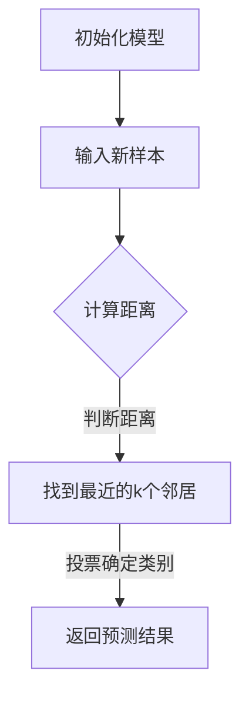

                 

关键词：k-近邻算法、机器学习、数据挖掘、分类算法、邻居选择策略、高维空间、实例学习

摘要：本文将深入探讨k-近邻算法（k-Nearest Neighbors, k-NN），这是一种广泛使用的机器学习和数据挖掘中的分类算法。文章将详细介绍k-NN算法的原理、操作步骤、优缺点及其应用领域。此外，还将通过一个实际项目实例，讲解如何使用k-NN算法进行数据分类，并提供详细的代码实现和解析。

## 1. 背景介绍

k-近邻算法（k-NN）是机器学习中最简单且应用广泛的算法之一。它起源于20世纪60年代，是一种基于实例的学习算法。k-NN的核心思想是：如果一个新样本在特征空间中的k个最近邻的多数属于某一类别，则该样本也属于这个类别。

k-NN算法在众多领域都有广泛应用，如文本分类、图像识别、生物信息学等。其简单直观的特点使得它成为了初学者入门机器学习领域的首选算法。此外，k-NN算法在处理高维数据时，由于其不需要复杂的模型参数调整，因而表现出较强的鲁棒性。

## 2. 核心概念与联系

在理解k-NN算法之前，我们需要先了解一些相关的核心概念。

### 2.1 特征空间

特征空间是k-NN算法中的基本概念，它是一个多维空间，每个维度代表数据集中的一个特征。在特征空间中，每个样本点都可以表示为一个向量，其中每个元素代表该样本在对应特征上的取值。

### 2.2 距离度量

距离度量是k-NN算法中用于计算两个样本点之间距离的函数。常见的距离度量包括欧氏距离、曼哈顿距离、切比雪夫距离等。在不同的应用场景中，我们可以根据数据的特点选择合适的距离度量方法。

### 2.3 邻居选择策略

邻居选择策略是k-NN算法中的关键步骤，它决定了如何从所有样本点中选择与目标样本最近的k个样本点。常见的邻居选择策略包括基于距离的最邻近选择、基于密度的区域选择等。

下面是一个使用Mermaid绘制的k-NN算法流程图：



## 3. 核心算法原理 & 具体操作步骤

### 3.1 算法原理概述

k-NN算法的基本原理非常简单。给定一个新样本，算法会计算它与训练集中所有样本的距离，并找出距离它最近的k个样本。这k个样本被称为“邻居”。算法假设如果两个样本在特征空间中距离较近，则它们在特征空间中的标签（类别）也较可能相同。因此，算法通过计算邻居的标签，并选择出现次数最多的标签作为新样本的预测标签。

### 3.2 算法步骤详解

1. **初始化模型**：首先，我们需要准备好训练集，并将其存储在特征空间中。

2. **输入新样本**：然后，我们将待分类的新样本输入到算法中。

3. **计算距离**：对于每个训练样本，计算它们与新样本之间的距离。

4. **找到最近的k个邻居**：根据距离度量，选择距离新样本最近的k个样本作为邻居。

5. **投票确定类别**：对于每个邻居，统计它们所属的类别，并选择出现次数最多的类别作为新样本的预测类别。

6. **返回预测结果**：最后，算法返回预测的类别标签。

### 3.3 算法优缺点

**优点**：

- **简单直观**：k-NN算法的实现非常简单，易于理解和实现。
- **无需模型参数调整**：与其他算法相比，k-NN算法不需要进行复杂的参数调整，这使得它在处理高维数据时表现良好。
- **适用于多种应用场景**：由于k-NN算法的灵活性，它可以广泛应用于各种分类任务。

**缺点**：

- **计算复杂度高**：当训练集较大时，计算邻居距离会变得非常耗时。
- **易受噪声影响**：k-NN算法易受噪声影响，尤其是当k值较大时。

### 3.4 算法应用领域

k-NN算法在多个领域都有广泛应用，如：

- **文本分类**：用于对新闻、邮件等文本数据进行分类。
- **图像识别**：用于对图像中的对象进行识别和分类。
- **生物信息学**：用于基因组数据的分类和分析。

## 4. 数学模型和公式 & 详细讲解 & 举例说明

### 4.1 数学模型构建

在k-NN算法中，我们使用距离度量来计算两个样本之间的距离。常用的距离度量包括欧氏距离、曼哈顿距离和切比雪夫距离。

- **欧氏距离**：欧氏距离是两个样本之间最直观的距离度量，它基于每个特征上的差值的平方和。

  $$d(x, y) = \sqrt{\sum_{i=1}^{n} (x_i - y_i)^2}$$

  其中，$x$和$y$是两个样本向量，$n$是特征数量。

- **曼哈顿距离**：曼哈顿距离基于每个特征上的差值的绝对值和。

  $$d(x, y) = \sum_{i=1}^{n} |x_i - y_i|$$

- **切比雪夫距离**：切比雪夫距离基于每个特征上的差值的最大绝对值。

  $$d(x, y) = \max_{i} |x_i - y_i|$$

### 4.2 公式推导过程

假设我们有一个训练集$T$，其中每个样本$x_i$都有一个标签$y_i$。给定一个新样本$x^*$，我们希望找到与$x^*$最近的k个邻居，并基于这些邻居的标签预测$x^*$的类别。

首先，我们计算$x^*$与训练集中所有样本之间的距离：

$$d(x^*, x_i) = \min_{x \in T} d(x^*, x)$$

然后，我们选择距离$x^*$最近的k个邻居：

$$N(x^*) = \{x_i \in T | d(x^*, x_i) \leq d(x^*, x_j), \forall x_j \in T\}$$

最后，我们计算邻居的标签并选择出现次数最多的标签作为预测标签：

$$\hat{y}(x^*) = \arg\max_{y} \sum_{x_i \in N(x^*)} I(y_i = y)$$

其中，$I(\cdot)$是指示函数，当条件成立时取值为1，否则为0。

### 4.3 案例分析与讲解

假设我们有一个包含两类样本的数据集，其中一类样本的标签为0，另一类样本的标签为1。给定一个新样本$x^*$，我们需要预测它的标签。

首先，我们计算$x^*$与训练集中所有样本之间的距离，并选择距离最近的5个邻居：

$$N(x^*) = \{x_1, x_2, x_3, x_4, x_5\}$$

接下来，我们计算邻居的标签并统计它们的出现次数：

$$\hat{y}(x^*) = \arg\max_{y} \sum_{x_i \in N(x^*)} I(y_i = y)$$

根据统计结果，我们发现邻居中有3个标签为0，2个标签为1。因此，我们预测$x^*$的标签为0。

## 5. 项目实践：代码实例和详细解释说明

在本节中，我们将通过一个实际项目实例，讲解如何使用Python实现k-NN算法并进行数据分类。项目使用的库包括scikit-learn和matplotlib。

### 5.1 开发环境搭建

首先，确保已经安装了Python和scikit-learn库。可以通过以下命令安装scikit-learn：

```bash
pip install scikit-learn
```

### 5.2 源代码详细实现

```python
import numpy as np
from sklearn.datasets import load_iris
from sklearn.model_selection import train_test_split
from sklearn.neighbors import KNeighborsClassifier
import matplotlib.pyplot as plt

# 加载数据集
iris = load_iris()
X = iris.data
y = iris.target

# 划分训练集和测试集
X_train, X_test, y_train, y_test = train_test_split(X, y, test_size=0.3, random_state=42)

# 创建k-NN分类器
knn = KNeighborsClassifier(n_neighbors=3)

# 训练模型
knn.fit(X_train, y_train)

# 预测测试集
y_pred = knn.predict(X_test)

# 打印准确率
print("Accuracy:", knn.score(X_test, y_test))

# 可视化
plt.scatter(X_train[:, 0], X_train[:, 1], c=y_train, cmap='viridis')
plt.scatter(X_test[:, 0], X_test[:, 1], c=y_pred, cmap='viridis', marker='x')
plt.show()
```

### 5.3 代码解读与分析

- **加载数据集**：我们使用scikit-learn内置的Iris数据集，它包含三个类别的鸢尾花数据。
- **划分训练集和测试集**：我们将数据集划分为训练集和测试集，以评估模型的性能。
- **创建k-NN分类器**：我们使用scikit-learn中的KNeighborsClassifier创建一个k-NN分类器，并将其设置为使用3个邻居。
- **训练模型**：我们将训练集数据输入到k-NN分类器中进行训练。
- **预测测试集**：使用训练好的模型对测试集进行预测。
- **打印准确率**：打印模型的准确率。
- **可视化**：使用matplotlib绘制训练集和测试集的散点图，并标记预测结果。

## 6. 实际应用场景

k-近邻算法在许多实际应用场景中都有广泛的应用，以下是一些常见的应用场景：

- **文本分类**：k-NN算法常用于文本分类任务，如邮件过滤、新闻分类等。
- **图像识别**：k-NN算法可用于图像识别任务，如人脸识别、物体识别等。
- **生物信息学**：k-NN算法在基因组数据分析中也有广泛应用，如疾病诊断、基因分类等。

### 6.4 未来应用展望

随着机器学习和人工智能技术的不断发展，k-近邻算法的应用前景将更加广阔。未来，k-NN算法可能会在以下几个方面得到进一步的发展：

- **高维空间优化**：针对高维数据，k-NN算法可能需要改进以减少计算复杂度。
- **多模态数据融合**：k-NN算法可以与其他算法结合，用于处理多模态数据，如图像和文本数据的融合分类。
- **在线学习**：k-NN算法可以应用于在线学习场景，实时更新模型以适应数据的变化。

## 7. 工具和资源推荐

### 7.1 学习资源推荐

- **书籍**：
  - 《机器学习》（周志华 著）
  - 《Python机器学习》（Peter Harrington 著）
- **在线课程**：
  - Coursera上的《机器学习基础》
  - edX上的《机器学习导论》

### 7.2 开发工具推荐

- **Python**：使用Python进行机器学习和数据挖掘的开发。
- **Jupyter Notebook**：用于编写和运行Python代码，便于调试和演示。

### 7.3 相关论文推荐

- “k-Nearest Neighbors Algorithm: A Brief History and Current Status”
- “Improving k-NN Classification with Binning”
- “k-Nearest Neighbors in High-Dimensional Spaces”

## 8. 总结：未来发展趋势与挑战

k-近邻算法作为机器学习和数据挖掘中的基础算法，具有简单直观、易于实现的优点。然而，随着数据集规模和数据维度的不断增加，k-NN算法在计算复杂度和准确性方面面临着一定的挑战。未来，k-NN算法需要通过优化算法、结合其他算法以及适应新应用场景等方式，以应对这些挑战。

### 8.1 研究成果总结

- **算法优化**：针对高维数据和大规模数据，研究者提出了一些优化方法，如局部敏感哈希、聚类等方法。
- **应用拓展**：k-NN算法在多模态数据融合、在线学习等领域取得了显著成果。

### 8.2 未来发展趋势

- **算法效率提升**：通过硬件加速、分布式计算等技术，提高k-NN算法的运行效率。
- **多模态数据处理**：结合图像、文本、音频等多模态数据，实现更准确和全面的数据分类。

### 8.3 面临的挑战

- **高维空间优化**：如何在高维空间中有效选择邻居，以及如何减少计算复杂度。
- **模型解释性**：如何提高算法的可解释性，使其在复杂任务中更容易被接受。

### 8.4 研究展望

k-近邻算法在未来将继续在机器学习和数据挖掘领域发挥重要作用。通过不断优化算法、拓展应用场景，k-NN算法有望在更多领域取得突破性成果。

## 9. 附录：常见问题与解答

### 9.1 如何选择合适的k值？

选择合适的k值是k-NN算法中的一个关键问题。一般来说，k值的选择需要根据数据集的规模和特征维度进行调整。常见的方法包括：

- **交叉验证**：通过交叉验证选择最优的k值。
- **网格搜索**：在预定义的k值范围内进行网格搜索，选择准确率最高的k值。

### 9.2 k-NN算法是否适用于实时应用？

k-NN算法通常不适用于实时应用，因为它需要进行大量的计算以找到最近的邻居。然而，通过优化算法、使用近似算法或分布式计算等方法，可以提高k-NN算法的运行效率，使其在实时应用中具有一定的可行性。

### 9.3 如何处理不平衡数据集？

在处理不平衡数据集时，k-NN算法可能会倾向于预测多数类别的标签。为了解决这个问题，可以采用以下方法：

- **重采样**：通过欠采样或过采样方法，使得数据集在类别上更加平衡。
- **调整权重**：给少数类别赋予更高的权重，以减少对多数类别的依赖。

----------------------------------------------------------------

文章完成。感谢您给予的关注，希望这篇文章对您在机器学习和数据挖掘领域的探索有所帮助。作者：禅与计算机程序设计艺术 / Zen and the Art of Computer Programming。如果您有任何疑问或建议，请随时提出。

