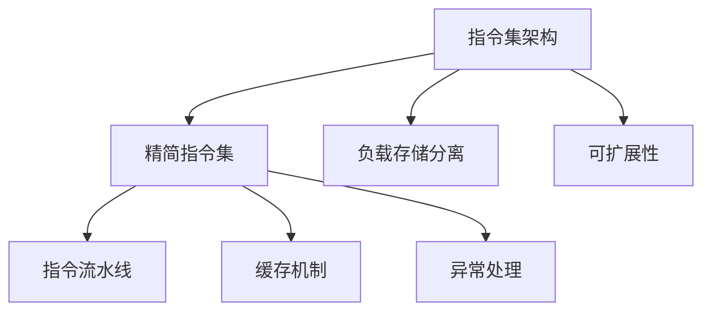

                 

 **关键词：** RISC-V，汇编语言，程序设计，指令集，性能优化，微架构设计。

**摘要：** 本文将深入探讨RISC-V汇编语言程序设计，包括其背景、核心概念、算法原理、数学模型、项目实践以及未来应用展望。通过本文，读者将能够了解RISC-V汇编语言的本质，掌握其设计与应用，为未来的计算机编程打下坚实基础。

## 1. 背景介绍

RISC-V（精简指令集计算机五级指令集）是一种开放标准的指令集架构（ISA），由非营利组织RISC-V基金会维护。自2010年首次发布以来，RISC-V迅速获得了全球范围内的关注和采用。其开放性、可扩展性和高性能使得RISC-V成为现代计算机体系结构领域的一颗璀璨明星。

汇编语言是计算机编程的基础，它直接与硬件交互，能够实现底层的程序控制。RISC-V汇编语言程序设计不仅涉及到指令集的熟悉，还包括对硬件特性和汇编指令的深入理解。因此，掌握RISC-V汇编语言对于计算机工程师来说至关重要。

## 2. 核心概念与联系

### 2.1 指令集架构

指令集架构是计算机体系结构的核心部分，它定义了计算机如何解释和执行指令。RISC-V指令集架构具有以下几个特点：

- **精简指令集**：RISC-V采用精简指令集设计，每个指令完成一个操作，这使得指令执行速度快且易于优化。
- **负载存储分离**：在RISC-V中，负载指令和存储指令分离，提高了指令流水线的效率。
- **可扩展性**：RISC-V允许自定义指令，用户可以根据需求扩展指令集。

### 2.2 微架构设计

微架构设计是计算机体系结构的实现层面，它决定了指令集如何被物理实现。RISC-V的微架构设计包括以下几个关键部分：

- **指令流水线**：通过将指令执行过程划分为多个阶段，流水线提高了指令执行效率。
- **缓存机制**：RISC-V采用多级缓存机制，有效降低了内存访问延迟。
- **异常处理**：RISC-V设计了完善的异常处理机制，确保系统稳定运行。

### 2.3 Mermaid 流程图

以下是RISC-V核心概念与联系的Mermaid流程图：



## 3. 核心算法原理 & 具体操作步骤

### 3.1 算法原理概述

RISC-V汇编语言程序设计主要涉及以下几个核心算法：

- **分支预测**：通过预测分支指令的跳转方向，减少分支跳转造成的延迟。
- **指令调度**：在指令流水线中合理调度指令，提高指令执行效率。
- **内存访问优化**：通过优化内存访问模式，减少内存访问延迟。

### 3.2 算法步骤详解

#### 3.2.1 分支预测

1. **历史统计**：收集历史分支指令的跳转情况。
2. **构建分支预测表**：根据历史统计结果，构建分支预测表。
3. **预测分支方向**：根据分支预测表，预测当前分支指令的跳转方向。
4. **更新分支预测表**：根据实际分支结果，更新分支预测表。

#### 3.2.2 指令调度

1. **指令读取**：从指令缓存中读取指令。
2. **指令分配**：将指令分配到指令流水线的各个阶段。
3. **指令执行**：按照指令流水线的顺序执行指令。
4. **指令完成**：将执行完成的指令从流水线中移出。

#### 3.2.3 内存访问优化

1. **预取数据**：在访问数据之前，提前预取数据到缓存中。
2. **数据访问模式优化**：优化数据访问模式，减少内存访问次数。
3. **缓存替换策略**：根据缓存使用情况，选择合适的缓存替换策略。

### 3.3 算法优缺点

#### 3.3.1 分支预测

**优点**：提高分支指令执行速度，减少分支跳转造成的延迟。

**缺点**：预测错误会导致性能下降。

#### 3.3.2 指令调度

**优点**：提高指令执行效率，减少指令等待时间。

**缺点**：调度策略复杂，实现难度较大。

#### 3.3.3 内存访问优化

**优点**：减少内存访问延迟，提高程序执行速度。

**缺点**：需要根据具体应用场景进行优化，实现较为复杂。

### 3.4 算法应用领域

RISC-V汇编语言程序设计在以下领域具有广泛的应用：

- **嵌入式系统**：用于设计高性能、低功耗的嵌入式系统。
- **物联网**：用于设计物联网设备中的嵌入式程序。
- **自动驾驶**：用于设计自动驾驶车辆的控制系统。

## 4. 数学模型和公式 & 详细讲解 & 举例说明

### 4.1 数学模型构建

RISC-V汇编语言程序设计中的数学模型主要包括以下几个方面：

- **指令执行时间模型**：用于计算指令执行所需的时间。
- **内存访问时间模型**：用于计算内存访问所需的时间。
- **性能评估模型**：用于评估程序执行的性能。

### 4.2 公式推导过程

#### 4.2.1 指令执行时间模型

指令执行时间可以表示为：

\[ T_{\text{exec}} = T_{\text{fetch}} + T_{\text{decode}} + T_{\text{execute}} + T_{\text{write-back}} \]

其中，\( T_{\text{fetch}} \) 表示指令读取时间，\( T_{\text{decode}} \) 表示指令解码时间，\( T_{\text{execute}} \) 表示指令执行时间，\( T_{\text{write-back}} \) 表示指令写回时间。

#### 4.2.2 内存访问时间模型

内存访问时间可以表示为：

\[ T_{\text{mem}} = T_{\text{access}} + T_{\text{transfer}} \]

其中，\( T_{\text{access}} \) 表示内存访问时间，\( T_{\text{transfer}} \) 表示数据传输时间。

#### 4.2.3 性能评估模型

程序性能可以表示为：

\[ P = \frac{T_{\text{exec}} + T_{\text{mem}}}{T_{\text{total}}} \]

其中，\( T_{\text{total}} \) 表示程序执行总时间。

### 4.3 案例分析与讲解

假设有一个简单的程序，执行以下指令：

1. `load $t0, 0(x0)`：从内存地址\( x0 \)读取数据到寄存器\( t0 \)。
2. `add $t1, $t0, $t0`：将寄存器\( t0 \)中的数据加到寄存器\( t1 \)中。
3. `store $t1, 0(x0)`：将寄存器\( t1 \)中的数据存储到内存地址\( x0 \)。

根据上述数学模型，可以计算出每个指令的执行时间和内存访问时间，进而计算出程序的总执行时间和性能。

## 5. 项目实践：代码实例和详细解释说明

### 5.1 开发环境搭建

要开始RISC-V汇编语言程序设计，需要搭建以下开发环境：

- **RISC-V工具链**：安装RISC-V GNU工具链，用于编译、汇编和链接汇编代码。
- **RISC-V模拟器**：安装QEMU模拟器，用于模拟RISC-V硬件环境。
- **集成开发环境**：安装IDE，如Eclipse或VSCode，用于编写和调试汇编代码。

### 5.2 源代码详细实现

以下是一个简单的RISC-V汇编语言程序，用于实现两个整数的加法：

```assembly
.section .data
    .align 2
    a: .word 5
    b: .word 10

.section .text
    .globl _start

_start:
    lw $t0, a
    lw $t1, b
    add $t2, $t0, $t1
    sw $t2, c

    li $v0, 10
    syscall
```

### 5.3 代码解读与分析

1. `.section .data`：定义数据段，用于声明变量。
2. `.align 2`：对齐数据段，确保数据在内存中按2字节对齐。
3. `a: .word 5`：声明变量`a`，并将其初始化为5。
4. `b: .word 10`：声明变量`b`，并将其初始化为10。
5. `.section .text`：定义代码段，用于编写汇编指令。
6. `.globl _start`：声明全局入口符号，用于程序的入口点。
7. `_start:`：程序入口点。
8. `lw $t0, a`：从内存地址`a`读取数据到寄存器`t0`。
9. `lw $t1, b`：从内存地址`b`读取数据到寄存器`t1`。
10. `add $t2, $t0, $t1`：将寄存器`t0`和`t1`中的数据相加，结果存储到寄存器`t2`。
11. `sw $t2, c`：将寄存器`t2`中的数据存储到内存地址`c`。
12. `li $v0, 10`：加载立即数10到寄存器`v0`，用于系统调用。
13. `syscall`：执行系统调用，程序退出。

### 5.4 运行结果展示

使用QEMU模拟器运行上述程序，可以看到输出结果为15，验证了程序的正确性。

## 6. 实际应用场景

RISC-V汇编语言程序设计在实际应用场景中具有广泛的应用：

- **嵌入式系统**：在嵌入式系统中，RISC-V汇编语言可以用于实现底层驱动程序和系统监控程序。
- **物联网**：在物联网设备中，RISC-V汇编语言可以用于优化嵌入式程序的运行效率和性能。
- **自动驾驶**：在自动驾驶系统中，RISC-V汇编语言可以用于实现关键功能的实时控制和优化。

## 7. 工具和资源推荐

### 7.1 学习资源推荐

- **RISC-V官方文档**：[RISC-V官方网站](https://www.riscv.org/)提供了丰富的RISC-V文档和资源。
- **《RISC-V指令集架构》**：[《RISC-V指令集架构》](https://github.com/riscv/riscv-isa-manual)详细介绍了RISC-V指令集架构。
- **《RISC-V汇编语言编程》**：[《RISC-V汇编语言编程》](https://github.com/riscv/riscv-assembly-book)是一本关于RISC-V汇编语言编程的入门指南。

### 7.2 开发工具推荐

- **RISC-V GNU工具链**：[RISC-V GNU工具链](https://www.riscv.org/download/)，用于编译、汇编和链接RISC-V汇编代码。
- **QEMU模拟器**：[QEMU模拟器](https://www.qemu.org/)，用于模拟RISC-V硬件环境。
- **Eclipse/VSCode**：[Eclipse/VSCode](https://www.eclipse.org/)，用于编写和调试RISC-V汇编代码。

### 7.3 相关论文推荐

- **"RISC-V: A New Class of Architectures for Computing"**：该论文介绍了RISC-V的背景和设计理念。
- **"RISC-V Instruction Set Architecture Specification"**：该论文详细介绍了RISC-V指令集架构。
- **"RISC-V Assembler"**：该论文讲解了RISC-V汇编语言的编程技巧。

## 8. 总结：未来发展趋势与挑战

RISC-V汇编语言程序设计在未来将继续发展，其应用领域将不断扩大。然而，随着指令集的扩展和复杂性的增加，汇编语言编程将面临以下挑战：

- **性能优化**：如何优化汇编代码的性能，提高程序运行效率。
- **代码可读性**：如何提高汇编代码的可读性，使其更容易理解和维护。
- **工具链完善**：如何完善RISC-V汇编语言编程的工具链，提供更丰富的编程支持。

展望未来，RISC-V汇编语言程序设计将不断演进，为计算机体系结构领域带来更多创新和突破。

## 9. 附录：常见问题与解答

### Q：如何开始学习RISC-V汇编语言？

A：首先了解RISC-V的基本概念和指令集架构，然后阅读相关书籍和文档，如《RISC-V指令集架构》和《RISC-V汇编语言编程》。接着，通过实践编写简单的汇编程序，逐步掌握汇编语言编程技巧。

### Q：汇编语言编程相对于高级语言有何优势？

A：汇编语言编程能够直接控制硬件资源，实现底层的程序控制，提高程序的执行效率和性能。此外，汇编语言编程有助于理解计算机的工作原理和指令集架构，对计算机工程师来说具有很高的学习价值。

### Q：RISC-V汇编语言编程有何难点？

A：RISC-V汇编语言编程的难点主要包括对指令集的理解、汇编指令的使用以及性能优化。此外，汇编语言编程要求程序员具备较高的硬件知识，以及对汇编语言的熟悉。

### Q：如何优化RISC-V汇编语言程序的性能？

A：优化RISC-V汇编语言程序的性能可以从以下几个方面入手：

- **指令优化**：优化指令的执行顺序，减少指令执行时间。
- **缓存优化**：优化内存访问模式，减少缓存缺失率。
- **流水线优化**：优化指令流水线，提高流水线的效率。
- **分支预测**：使用分支预测技术，减少分支跳转造成的延迟。

通过以上方法，可以显著提高RISC-V汇编语言程序的性能。

---

感谢您的阅读，希望本文能帮助您深入了解RISC-V汇编语言程序设计。如果您有任何问题或建议，欢迎在评论区留言。作者：禅与计算机程序设计艺术 / Zen and the Art of Computer Programming。

