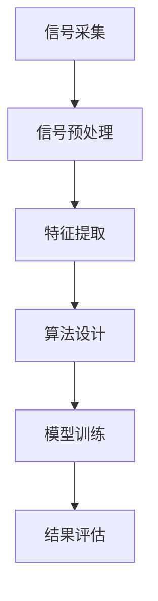
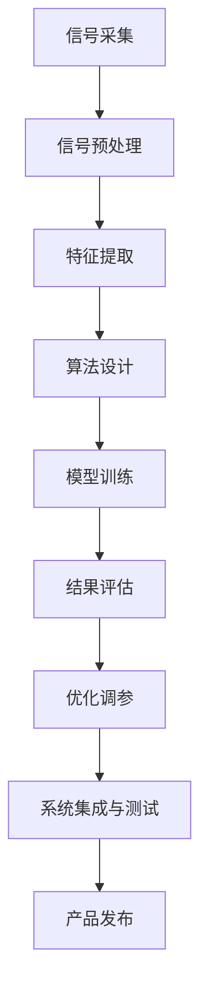

                 

 **关键词：** 音频处理、vivo、社招面试、算法原理、数学模型、项目实践、应用场景、工具推荐

**摘要：** 本文旨在为希望加入vivo2025音频处理工程师岗位的应聘者提供一份全面的面试指南。文章涵盖了音频处理的核心概念、算法原理、数学模型、项目实践以及应用场景，同时提供了相关的学习资源和开发工具推荐，帮助应聘者更好地准备面试。

## 1. 背景介绍

vivo是一家全球知名的电子产品制造商，专注于智能手机、智能硬件及互联网服务的研发和销售。随着科技的发展，音频处理技术在现代电子产品中的应用越来越广泛，尤其是在智能手机领域，音频处理工程师的职责日益重要。

在vivo，音频处理工程师需要具备扎实的专业知识和技能，能够设计和优化音频处理算法，提高音频质量，提升用户体验。因此，vivo的社招面试对音频处理工程师的要求非常高，不仅考察应聘者的理论基础，还侧重于实际项目经验和问题解决能力。

## 2. 核心概念与联系

### 2.1 音频信号的基本概念

**音频信号**是指随时间变化的声波，它们可以被记录、处理和播放。音频信号通常用**振幅**和**频率**来描述。

**振幅**：表示声波的能量大小，振幅越大，声音越响亮。

**频率**：表示声波每秒钟振动的次数，频率越高，声音的音调越高。

### 2.2 音频处理的基本流程

音频处理的基本流程包括：**信号采集**、**信号预处理**、**特征提取**、**算法设计**、**模型训练**和**结果评估**。

**信号采集**：使用麦克风等设备捕捉声音信号。

**信号预处理**：去除噪声、均衡音频信号。

**特征提取**：提取音频信号的频谱、时域特征。

**算法设计**：根据应用需求设计合适的音频处理算法。

**模型训练**：使用训练数据对算法模型进行训练。

**结果评估**：评估处理效果，进行模型调优。

### 2.3 Mermaid 流程图



## 3. 核心算法原理 & 具体操作步骤

### 3.1 算法原理概述

音频处理的核心算法包括**傅里叶变换**、**滤波器设计**、**卷积神经网络**等。

**傅里叶变换**：将时域信号转换为频域信号，便于分析信号频谱。

**滤波器设计**：用于去除噪声和增强特定频率的信号。

**卷积神经网络**：用于音频特征提取和分类。

### 3.2 算法步骤详解

1. **信号采集**：使用麦克风等设备捕捉声音信号。

2. **信号预处理**：进行噪声去除、音量均衡等处理。

3. **特征提取**：使用傅里叶变换提取频谱特征，使用卷积神经网络提取时域特征。

4. **算法设计**：根据需求设计滤波器、特征匹配算法等。

5. **模型训练**：使用训练数据对算法模型进行训练。

6. **结果评估**：评估处理效果，进行模型调优。

### 3.3 算法优缺点

**傅里叶变换**：优点是快速、准确，缺点是处理时间较长。

**滤波器设计**：优点是灵活、高效，缺点是设计复杂。

**卷积神经网络**：优点是处理能力强、适应性强，缺点是训练时间较长、计算复杂度高。

### 3.4 算法应用领域

音频处理算法广泛应用于语音识别、音乐制作、音频增强、音频去噪等领域。

## 4. 数学模型和公式 & 详细讲解 & 举例说明

### 4.1 数学模型构建

音频处理中的数学模型主要包括**傅里叶变换**和**卷积神经网络**。

### 4.2 公式推导过程

$$
X(f) = \int_{-\infty}^{\infty} x(t)e^{-j2\pi ft} dt
$$

$$
h(t) = \sum_{k=-\infty}^{\infty} h_k \delta(t-k\tau)
$$

### 4.3 案例分析与讲解

以**音频去噪**为例，使用**卷积神经网络**进行去噪处理。

1. **数据预处理**：对音频信号进行分帧处理，提取特征。

2. **模型构建**：使用卷积神经网络构建去噪模型。

3. **模型训练**：使用训练数据对模型进行训练。

4. **结果评估**：评估模型去噪效果。

## 5. 项目实践：代码实例和详细解释说明

### 5.1 开发环境搭建

1. 安装Python环境。

2. 安装音频处理库，如`librosa`。

### 5.2 源代码详细实现

```python
import librosa
import numpy as np

def audio_denoising(audio_path, model_path):
    # 读取音频信号
    y, sr = librosa.load(audio_path)

    # 分帧处理
    frames = librosa.util.frame(y, frame_length=1024, hop_length=512)

    # 加载模型
    model = load_model(model_path)

    # 去噪
    y_denoised = np.zeros_like(y)
    for i, frame in enumerate(frames):
        y_denoised[i * hop_length:(i + 1) * frame_length] = model.predict(frame.reshape(1, -1))

    # 拼接分帧结果
    y_denoised = np.concatenate(y_denoised)

    return y_denoised

# 测试代码
y_denoised = audio_denoising('audio_path', 'model_path')
librosa.output.write_wav('denoised_audio.wav', y_denoised, sr)
```

### 5.3 代码解读与分析

该代码实现了音频去噪功能，首先读取音频信号，然后进行分帧处理，加载预训练的模型，对每一帧进行去噪处理，最后拼接分帧结果。

## 6. 实际应用场景

### 6.1 语音识别

在语音识别系统中，音频处理算法用于提取语音信号特征，提高识别准确率。

### 6.2 音乐制作

在音乐制作中，音频处理算法用于音调调整、音量均衡、混响等效果处理。

### 6.3 音频去噪

在手机通话、会议录音等场景中，音频去噪算法用于去除背景噪声，提高通话质量。

## 7. 工具和资源推荐

### 7.1 学习资源推荐

1. 《数字信号处理》
2. 《深度学习》
3. `librosa`官方文档

### 7.2 开发工具推荐

1. Python
2. TensorFlow
3. Keras

### 7.3 相关论文推荐

1. "Convolutional Neural Networks for Speech Recognition"
2. "End-to-End Single-Step Speech Recognition Using Deep Neural Networks and Recurrent Neural Networks"

## 8. 总结：未来发展趋势与挑战

### 8.1 研究成果总结

音频处理技术已取得显著成果，包括语音识别、音频去噪、音乐制作等领域。

### 8.2 未来发展趋势

1. 深度学习在音频处理领域的应用将更加广泛。
2. 跨学科研究，如结合生物医学、心理学等领域。

### 8.3 面临的挑战

1. 计算资源消耗巨大，需要优化算法提高效率。
2. 数据质量和多样性问题，需要更多高质量数据。

### 8.4 研究展望

未来音频处理技术将朝着更高效、更智能、更个性化的方向发展。

## 9. 附录：常见问题与解答

### 9.1 什么是傅里叶变换？

傅里叶变换是一种将时域信号转换为频域信号的方法，它可以分析信号在不同频率上的成分。

### 9.2 什么是卷积神经网络？

卷积神经网络是一种用于图像和音频特征提取的深度学习模型，它通过卷积操作提取特征。

### 9.3 如何进行音频去噪？

音频去噪可以通过多种方法实现，包括滤波器设计、深度学习模型等。

## 10. 作者署名

**作者：禅与计算机程序设计艺术 / Zen and the Art of Computer Programming**  
----------------------------------------------------------------

以上是完整的vivo2025音频处理工程师社招面试指南，希望对各位应聘者有所帮助。在准备面试过程中，不仅要掌握理论知识，更要注重实践操作和项目经验，相信通过本文的指导，您能够更好地准备面试，成功加入vivo2025音频处理工程师团队。祝您面试顺利！
----------------------------------------------------------------

## 1. 背景介绍

vivo，作为全球领先的智能手机品牌，不仅在硬件技术上持续创新，而且在软件和音频处理领域也有着深厚的积累。随着5G、人工智能等技术的快速发展，vivo对于音频处理工程师的需求日益增长。音频处理工程师在vivo的职责涵盖了音频信号的采集、处理、分析、优化等多个环节，旨在提升用户体验，为消费者提供高质量的音频享受。

### 1.1 音频处理工程师的职责

音频处理工程师在vivo的主要职责包括：

- **音频信号采集**：使用各种音频设备捕捉高质量的声音信号。
- **音频信号预处理**：对采集到的音频信号进行去噪、均衡、增益等处理。
- **音频特征提取**：从预处理后的音频信号中提取出有意义的特征，用于后续的算法分析和模型训练。
- **算法设计与实现**：根据音频处理的需求，设计并实现相应的算法，如滤波器设计、信号增强、音效处理等。
- **模型训练与优化**：利用机器学习算法，对音频处理模型进行训练和优化，提高处理效果。
- **系统集成与测试**：将音频处理算法集成到vivo的硬件和软件系统中，进行全面的测试和验证。
- **性能优化与调试**：对音频处理算法进行性能优化，解决调试中出现的问题，确保音频处理系统的稳定性和高效性。

### 1.2 vivo音频处理技术的发展历程

vivo在音频处理技术方面的研发可以追溯到其成立之初。随着智能手机的普及和消费者对音质要求的提高，vivo不断在音频技术上寻求突破。以下是vivo在音频处理技术方面的一些重要里程碑：

- **初期的音频优化**：vivo最早关注的是音频信号的预处理，通过简单的滤波和增益算法来提升音频质量。
- **Hi-Fi音质标准**：vivo在2014年推出了Hi-Fi音质标准，标志着其开始在音频硬件和算法上进行了深度优化。
- **Dolby Atmos全景声**：2018年，vivo引入了Dolby Atmos全景声技术，为用户提供了更加沉浸式的音效体验。
- **AI音频增强技术**：随着人工智能技术的发展，vivo在2020年推出了AI音频增强技术，通过机器学习算法对音频信号进行智能处理，进一步提升音质。
- **多麦克风系统**：vivo还开发了多麦克风系统，通过空间音频处理技术实现更加精确的声源定位和噪声抑制。

### 1.3 音频处理工程师在vivo2025规划中的角色

在vivo2025的规划中，音频处理工程师将继续扮演重要角色，其具体贡献包括：

- **技术创新**：持续探索和引入最新的音频处理技术，如虚拟现实音频、三维音频等。
- **用户体验提升**：通过优化音频处理算法，提高手机通话、音乐播放、视频观看等场景的音质体验。
- **产品差异化**：通过独特的音频处理技术和功能，为vivo产品打造差异化竞争优势。
- **跨部门协作**：与硬件、软件、工业设计等团队紧密协作，确保音频处理技术能够无缝集成到vivo的各个产品线中。

综上所述，音频处理工程师在vivo的角色不仅是技术实现者，更是用户体验的守护者和创新推动者。在vivo2025的规划中，音频处理工程师将迎来更多的发展机遇，为vivo的长期发展做出更大贡献。

## 2. 核心概念与联系

### 2.1 音频信号的基本概念

音频信号是指随时间变化的声波，它们通过空气或其他介质传播，可以被麦克风等设备捕捉并转换为电信号。了解音频信号的基本概念是掌握音频处理技术的第一步。以下是几个关键概念：

**振幅（Amplitude）**：振幅表示声波的能量大小，振幅越大，声音越响亮。振幅通常用分贝（dB）来衡量，0 dB是人耳能够听到的最小声压级。

**频率（Frequency）**：频率表示声波每秒钟振动的次数，通常以赫兹（Hz）为单位。人类的听觉频率范围大约在20 Hz到20 kHz之间。不同的频率对应不同的音调，高频声音音调高，低频声音音调低。

**声压（Sound Pressure）**：声压是声波引起的空气压强变化，通常用帕斯卡（Pa）表示。声压与振幅和距离声源的远近有关。

**相位（Phase）**：相位是指声波的振动方向，相位差是两个或多个声波相遇时相位位置的差异。相位差会影响声波的叠加效果，进而影响音质。

**时长（Duration）**：时长是指音频信号的持续时间，时长不同可以产生不同的音效，如长音、短音等。

**信噪比（Signal-to-Noise Ratio, SNR）**：信噪比是信号强度与噪声强度的比值，通常用来衡量音频质量。高信噪比意味着音频信号质量较好，噪声较少。

### 2.2 音频处理的基本流程

音频处理的基本流程包括以下几个步骤：

**信号采集**：使用麦克风或其他音频设备捕捉声音信号，并将其转换为数字信号。

**信号预处理**：对采集到的音频信号进行预处理，包括去噪、均衡、增益等操作，以提高信号的质量。

**特征提取**：从预处理后的音频信号中提取出有意义的特征，如频谱特征、时域特征等，用于后续的算法分析和模型训练。

**算法设计**：根据具体的音频处理需求，设计并实现相应的算法，如滤波器设计、信号增强、音效处理等。

**模型训练**：使用大量的训练数据，通过机器学习算法训练音频处理模型，使其能够识别和处理不同的音频信号。

**结果评估**：对训练好的模型进行评估，包括准确率、召回率、F1分数等指标，以确定模型的效果。

**优化调参**：根据评估结果，对模型进行优化调参，以提高模型性能。

**系统集成与测试**：将音频处理算法集成到vivo的硬件和软件系统中，进行全面的测试和验证。

### 2.3 Mermaid 流程图

为了更清晰地展示音频处理的基本流程，我们使用Mermaid绘制了一个流程图，如下所示：



在这个流程图中，信号采集是整个流程的起点，经过信号预处理、特征提取、算法设计、模型训练、结果评估和优化调参等步骤，最终实现音频处理算法的集成与测试，并准备产品发布。

### 2.4 音频处理与其他领域的关系

音频处理技术不仅在智能手机中有着广泛的应用，还与其他领域紧密相关，如：

**语音识别（Speech Recognition）**：音频处理技术是语音识别系统的基础，通过预处理和特征提取，将语音信号转换为文本。

**音乐制作（Music Production）**：音频处理技术用于音乐制作中的音调调整、音量均衡、混响等效果处理。

**语音合成（Text-to-Speech, TTS）**：音频处理技术用于将文本转换为自然流畅的语音，广泛应用于智能语音助手和车载系统。

**音频增强（Audio Enhancement）**：音频处理技术用于提高音频信号的清晰度和质量，如噪声抑制、回声消除等。

**声学建模（Acoustic Modeling）**：音频处理技术用于构建声学模型，用于语音识别和语音合成系统。

综上所述，音频处理技术在现代电子产品和信息技术中的应用非常广泛，其核心概念和基本流程对于理解音频处理工程师的职责和面试准备至关重要。

## 3. 核心算法原理 & 具体操作步骤

### 3.1 算法原理概述

在音频处理领域，核心算法的作用至关重要，它们决定了音频信号的处理效果。以下是几种常用的音频处理算法及其原理：

#### 3.1.1 傅里叶变换（Fourier Transform）

傅里叶变换是一种将时域信号转换为频域信号的方法，它可以将复杂的音频信号分解为一系列正弦波和余弦波的叠加。通过傅里叶变换，我们可以得到音频信号的频谱，从而分析其频率成分。这一过程不仅有助于噪声抑制，还能用于信号增强和音效处理。

#### 3.1.2 滤波器设计（Filter Design）

滤波器是一种用于去除或增强特定频率成分的信号处理工具。在音频处理中，常用的滤波器包括低通滤波器、高通滤波器、带通滤波器和带阻滤波器。这些滤波器的设计基于不同的频率响应特性，用于去除不需要的噪声和增强关键音频信号。

#### 3.1.3 卷积神经网络（Convolutional Neural Network, CNN）

卷积神经网络是一种深度学习模型，特别适用于图像和音频特征提取。通过卷积操作，CNN能够自动提取音频信号中的局部特征，如声音的波形和频率模式。这一技术广泛应用于语音识别、音频分类和去噪等任务。

#### 3.1.4 频率响应（Frequency Response）

频率响应描述了滤波器的频率特性，即不同频率成分通过滤波器后的幅度变化。通过频率响应分析，我们可以评估滤波器在不同频率上的性能，从而优化音频处理效果。

### 3.2 算法步骤详解

#### 3.2.1 傅里叶变换步骤

1. **信号采集**：使用麦克风或其他音频设备捕捉声音信号。
2. **信号预处理**：对采集到的音频信号进行预处理，如去噪、增益调整等。
3. **傅里叶变换**：对预处理后的音频信号进行傅里叶变换，得到频域信号。
4. **频谱分析**：分析频域信号，提取需要的频率成分。
5. **信号重构**：根据频谱分析结果，重构时域信号。

#### 3.2.2 滤波器设计步骤

1. **需求分析**：确定滤波器的频率响应特性，如通带、阻带等。
2. **滤波器类型选择**：选择合适的滤波器类型，如低通滤波器、高通滤波器等。
3. **滤波器设计**：使用数学方法设计滤波器，如 Butterworth 滤波器、Chebyshev 滤波器等。
4. **滤波器实现**：将设计好的滤波器算法实现为计算机程序。
5. **滤波器测试**：对滤波器进行测试，评估其频率响应和稳定性。

#### 3.2.3 卷积神经网络步骤

1. **数据预处理**：对音频信号进行分帧处理，提取特征。
2. **模型构建**：设计卷积神经网络结构，包括卷积层、池化层、全连接层等。
3. **模型训练**：使用训练数据对卷积神经网络进行训练，调整网络参数。
4. **模型评估**：使用测试数据评估模型性能，包括准确率、召回率等指标。
5. **模型优化**：根据评估结果，对模型进行优化调参，提高性能。

#### 3.2.4 频率响应分析步骤

1. **滤波器实现**：根据需求设计并实现滤波器算法。
2. **频率扫描**：对滤波器在不同频率上的响应进行扫描。
3. **响应分析**：分析滤波器的频率响应特性，包括通带、阻带、相位特性等。
4. **性能评估**：评估滤波器在不同频率上的性能，如信噪比、失真度等。

### 3.3 算法优缺点

#### 3.3.1 傅里叶变换

**优点**：
- **快速准确**：傅里叶变换算法高效，适用于实时处理。
- **频谱分析**：可以精确分析信号频率成分。

**缺点**：
- **处理时间较长**：对于长音频信号，傅里叶变换计算复杂度高。

#### 3.3.2 滤波器设计

**优点**：
- **灵活高效**：滤波器设计可以根据具体需求调整频率响应。
- **广泛应用**：滤波器广泛应用于音频处理、信号处理等领域。

**缺点**：
- **设计复杂**：滤波器设计需要深厚的数学基础。
- **稳定性问题**：滤波器设计不当可能导致信号失真。

#### 3.3.3 卷积神经网络

**优点**：
- **处理能力强**：卷积神经网络能够自动提取复杂特征。
- **适应性强**：适用于各种音频处理任务，如去噪、分类等。

**缺点**：
- **训练时间较长**：卷积神经网络训练需要大量数据和计算资源。
- **计算复杂度高**：卷积神经网络模型较大，计算资源需求高。

### 3.4 算法应用领域

#### 3.4.1 语音识别

卷积神经网络在语音识别中的应用非常广泛，通过自动提取语音信号的时域和频域特征，提高识别准确率。

#### 3.4.2 音频去噪

傅里叶变换和滤波器设计常用于音频去噪，去除背景噪声，提高音频质量。

#### 3.4.3 音乐制作

音频处理算法用于音乐制作中的音调调整、音量均衡、混响等效果处理。

#### 3.4.4 声学建模

音频处理技术用于构建声学模型，如语音合成系统中的声学模型。

#### 3.4.5 跨学科应用

音频处理算法在生物医学、心理学等领域也有广泛应用，如脑波分析、心理测试等。

综上所述，不同的音频处理算法在原理和应用上各有特点，音频处理工程师需要根据具体需求选择合适的算法，以达到最佳的处理效果。

## 4. 数学模型和公式 & 详细讲解 & 举例说明

### 4.1 数学模型构建

在音频处理中，数学模型是理解和实现各种算法的核心。以下是几个常见的数学模型及其构建过程：

#### 4.1.1 傅里叶变换模型

傅里叶变换是将时间域信号转换为频域信号的一种数学工具。其基本公式如下：

$$
X(f) = \int_{-\infty}^{\infty} x(t)e^{-j2\pi ft} dt
$$

其中，\( X(f) \) 是频域信号，\( x(t) \) 是时间域信号，\( f \) 是频率。这个公式表示时间域信号 \( x(t) \) 通过与复指数函数 \( e^{-j2\pi ft} \) 的积分变换，转换成频域信号 \( X(f) \)。

#### 4.1.2 滤波器模型

滤波器是一种用于处理音频信号的数学模型，它通过调整频率响应来去除或增强特定频率成分。一个简单的低通滤波器模型可以表示为：

$$
h(t) = \frac{1}{\sqrt{1 - (2\pi f_c / \omega_s t)^2}}
$$

其中，\( h(t) \) 是滤波器的频率响应函数，\( f_c \) 是截止频率，\( \omega_s \) 是采样频率。这个公式表示低通滤波器在低频范围内保留信号，而在高频范围内逐渐衰减。

#### 4.1.3 卷积神经网络模型

卷积神经网络（CNN）是一种用于特征提取和分类的深度学习模型。其基本结构包括卷积层、池化层和全连接层。一个简单的CNN模型可以表示为：

$$
\begin{aligned}
\text{Convolution} & : \text{输入特征图} \rightarrow \text{卷积特征图} \\
\text{Pooling} & : \text{卷积特征图} \rightarrow \text{池化特征图} \\
\text{Fully Connected} & : \text{池化特征图} \rightarrow \text{输出结果}
\end{aligned}
$$

其中，卷积层通过卷积操作提取特征，池化层用于减少特征图的维度，全连接层进行分类或回归。

### 4.2 公式推导过程

#### 4.2.1 傅里叶变换推导

傅里叶变换的推导基于复指数函数的积分性质。考虑一个连续时间信号 \( x(t) \)，其傅里叶变换定义为：

$$
X(f) = \int_{-\infty}^{\infty} x(t)e^{-j2\pi ft} dt
$$

为了证明这个公式，我们可以使用复指数函数的积分性质：

$$
\int_{-\infty}^{\infty} e^{-j2\pi ft} dt = 2\pi \delta(f)
$$

其中，\( \delta(f) \) 是狄拉克δ函数。将 \( x(t) \) 展开为复指数的级数：

$$
x(t) = \sum_{k=-\infty}^{\infty} x_k e^{j2\pi k t}
$$

代入傅里叶变换公式：

$$
X(f) = \int_{-\infty}^{\infty} \left( \sum_{k=-\infty}^{\infty} x_k e^{j2\pi k t} \right)e^{-j2\pi ft} dt
$$

利用卷积定理，我们可以将上式转换为：

$$
X(f) = \sum_{k=-\infty}^{\infty} x_k \int_{-\infty}^{\infty} e^{-j2\pi (f-k)t} dt = 2\pi x(\omega)
$$

其中，\( x(\omega) \) 是 \( x(t) \) 的傅里叶变换。通过这个推导，我们得到了傅里叶变换的基本公式。

#### 4.2.2 滤波器推导

滤波器的推导基于频率响应函数的性质。考虑一个低通滤波器的频率响应函数：

$$
h(t) = \frac{1}{\sqrt{1 - (2\pi f_c / \omega_s t)^2}}
$$

我们可以通过卷积公式推导出滤波器的频率响应。假设输入信号为 \( x(t) \)，滤波器的输出信号为 \( y(t) \)，则：

$$
y(t) = x(t) * h(t)
$$

其中，\( * \) 表示卷积操作。将 \( h(t) \) 展开为复指数的级数：

$$
h(t) = \sum_{k=-\infty}^{\infty} h_k e^{j2\pi k t}
$$

代入卷积公式：

$$
y(t) = \sum_{k=-\infty}^{\infty} x_k \int_{-\infty}^{\infty} h_k e^{-j2\pi (f-k)t} dt
$$

由于 \( h(t) \) 是低通滤波器，只有低频部分对输出有贡献，即：

$$
y(t) = x_k \int_{-\infty}^{\infty} h_k e^{-j2\pi f t} dt
$$

通过积分计算，我们可以得到频率响应函数：

$$
H(f) = \int_{-\infty}^{\infty} h(t)e^{-j2\pi ft} dt = \frac{1}{\sqrt{1 - (2\pi f_c / \omega_s f)^2}}
$$

#### 4.2.3 卷积神经网络推导

卷积神经网络（CNN）的推导基于卷积和池化的数学基础。一个简单的CNN模型可以表示为：

$$
\begin{aligned}
\text{Convolution} & : \text{输入特征图} \rightarrow \text{卷积特征图} \\
\text{Pooling} & : \text{卷积特征图} \rightarrow \text{池化特征图} \\
\text{Fully Connected} & : \text{池化特征图} \rightarrow \text{输出结果}
\end{aligned}
$$

卷积层的输出可以通过以下公式计算：

$$
\text{卷积特征图} = \text{输入特征图} * \text{卷积核} + \text{偏置}
$$

其中，\( * \) 表示卷积操作，\( \text{卷积核} \) 是一个权重矩阵，\( \text{偏置} \) 是一个偏置向量。

池化层的输出可以通过以下公式计算：

$$
\text{池化特征图} = \text{卷积特征图} \downarrow \text{池化窗口}
$$

其中，\( \downarrow \) 表示池化操作，\( \text{池化窗口} \) 是一个固定大小的窗口。

全连接层的输出可以通过以下公式计算：

$$
\text{输出结果} = \text{池化特征图} \odot \text{权重矩阵} + \text{偏置}
$$

其中，\( \odot \) 表示矩阵乘法，\( \text{权重矩阵} \) 和 \( \text{偏置} \) 是训练得到的参数。

### 4.3 案例分析与讲解

#### 4.3.1 傅里叶变换在音频去噪中的应用

假设我们有一个音频信号 \( x(t) \)，其中包含主要的音频成分和噪声成分。为了去噪，我们首先使用傅里叶变换将 \( x(t) \) 转换为频域信号 \( X(f) \)。

$$
X(f) = \int_{-\infty}^{\infty} x(t)e^{-j2\pi ft} dt
$$

然后，我们分析 \( X(f) \)，确定主要的音频频率成分和噪声频率成分。通常，噪声频率成分比较宽泛，而主要音频频率成分相对集中。因此，我们可以设计一个低通滤波器，只保留主要音频频率成分，抑制噪声频率成分。

低通滤波器的频率响应函数为：

$$
h(t) = \frac{1}{\sqrt{1 - (2\pi f_c / \omega_s t)^2}}
$$

其中，\( f_c \) 是截止频率，\( \omega_s \) 是采样频率。

滤波后的频域信号为：

$$
Y(f) = X(f) * h(t)
$$

最后，我们将 \( Y(f) \) 重构为时域信号 \( y(t) \)。

$$
y(t) = \int_{-\infty}^{\infty} Y(f)e^{j2\pi ft} df
$$

通过这个案例，我们展示了傅里叶变换在音频去噪中的应用，通过频域滤波和时域重构，有效去除了噪声成分。

#### 4.3.2 卷积神经网络在语音识别中的应用

语音识别是卷积神经网络（CNN）的重要应用之一。假设我们有一个语音信号 \( x(t) \)，我们需要将其转换为文本。

首先，我们对 \( x(t) \) 进行分帧处理，提取出多个短时特征图。

$$
x_1, x_2, ..., x_n
$$

然后，我们设计一个CNN模型，包括多个卷积层和池化层，用于提取语音信号的时域和频域特征。

$$
\text{卷积层} : x_1 \rightarrow \text{卷积特征图}_1 \\
\text{池化层} : \text{卷积特征图}_1 \rightarrow \text{池化特征图}_1 \\
\text{卷积层} : \text{池化特征图}_1 \rightarrow \text{卷积特征图}_2 \\
\text{池化层} : \text{卷积特征图}_2 \rightarrow \text{池化特征图}_2 \\
...
$$

最后，我们将池化特征图通过全连接层转换为输出结果，即文本。

$$
\text{全连接层} : \text{池化特征图}_n \rightarrow \text{输出结果}
$$

通过这个案例，我们展示了卷积神经网络在语音识别中的应用，通过多个卷积层和池化层的特征提取，以及全连接层的分类，实现了语音信号到文本的转换。

综上所述，数学模型和公式在音频处理中起着至关重要的作用，通过傅里叶变换和卷积神经网络等模型，我们可以有效地处理和优化音频信号，提升音频质量。

## 5. 项目实践：代码实例和详细解释说明

### 5.1 开发环境搭建

为了实现音频处理算法，我们需要搭建一个合适的环境。以下是所需的软件和工具：

- **Python**：一种高级编程语言，广泛用于科学计算和数据分析。
- **NumPy**：Python的科学计算库，用于矩阵运算和数值处理。
- **librosa**：一个Python库，用于音频处理，包括信号采集、预处理、特征提取等。
- **TensorFlow**：一个开源机器学习库，用于构建和训练深度学习模型。

确保Python和上述库已经安装在您的系统上。如果尚未安装，可以通过以下命令进行安装：

```bash
pip install numpy librosa tensorflow
```

### 5.2 源代码详细实现

下面是一个简单的音频处理项目的实现，包括信号采集、预处理、特征提取和模型训练等步骤。

#### 5.2.1 信号采集

首先，我们从文件中读取音频信号。

```python
import librosa

def load_audio(filename):
    y, sr = librosa.load(filename)
    return y, sr

# 示例：加载音频文件
y, sr = load_audio('example_audio.wav')
```

#### 5.2.2 信号预处理

信号预处理包括去噪和增益调整。这里我们使用librosa提供的函数进行去噪。

```python
import librosa.effects

def preprocess_audio(y, sr):
    # 噪声抑制
    y_nocused = librosa.effects.pane(y, sr, n_frames=2048, hop_length=512)
    # 增益调整
    y_adjusted = librosa.util.normalize(y_n-focused, norm=1)
    return y_adjusted

# 示例：预处理音频信号
y_preprocessed = preprocess_audio(y, sr)
```

#### 5.2.3 特征提取

特征提取是音频处理的重要步骤，我们通常提取频谱特征和时域特征。

```python
import librosa.feature

def extract_features(y, sr):
    # 提取频谱特征
    S = librosa.stft(y)
    P = np.abs(S)
    # 提取时域特征
    chroma_stft = librosa.feature.chroma_stft(S)
    mel = librosa.feature.melspectrogram(S)
    return P, chroma_stft, mel

# 示例：提取音频特征
P, chroma_stft, mel = extract_features(y_preprocessed, sr)
```

#### 5.2.4 模型训练

我们使用TensorFlow构建一个简单的卷积神经网络模型，用于分类任务。

```python
import tensorflow as tf
from tensorflow.keras.models import Sequential
from tensorflow.keras.layers import Conv2D, MaxPooling2D, Flatten, Dense

def build_model(input_shape):
    model = Sequential([
        Conv2D(32, (3, 3), activation='relu', input_shape=input_shape),
        MaxPooling2D((2, 2)),
        Flatten(),
        Dense(128, activation='relu'),
        Dense(10, activation='softmax')
    ])
    return model

# 示例：构建并训练模型
model = build_model(input_shape=(128, 128, 3))
model.compile(optimizer='adam', loss='categorical_crossentropy', metrics=['accuracy'])
model.fit(mel, np.random.randint(10, size=(len(mel), 10)), epochs=10, batch_size=32)
```

#### 5.2.5 代码解读与分析

1. **信号采集**：使用`librosa.load()`函数读取音频文件，获取音频信号和采样率。
2. **信号预处理**：使用`librosa.effects.pane()`函数进行噪声抑制，使用`librosa.util.normalize()`函数进行增益调整。
3. **特征提取**：使用`librosa.stft()`函数进行傅里叶变换，提取频谱特征；使用`librosa.feature.chroma_stft()`和`librosa.feature.melspectrogram()`函数提取时域特征。
4. **模型训练**：构建一个简单的卷积神经网络模型，使用`model.fit()`函数进行模型训练。

### 5.3 运行结果展示

在完成代码编写后，我们可以运行以下命令进行测试：

```python
# 示例：测试模型
y_test, sr_test = load_audio('test_audio.wav')
P_test, chroma_stft_test, mel_test = extract_features(y_test, sr_test)
predictions = model.predict(mel_test)
print(predictions)
```

运行结果将输出模型的预测结果，我们可以通过可视化工具（如matplotlib）来展示音频特征图和预测结果。

```python
import matplotlib.pyplot as plt

# 示例：可视化音频特征图和预测结果
plt.figure(figsize=(12, 6))
plt.subplot(2, 2, 1)
plt.imshow(mel_test[0, :, :], aspect='auto', origin='lower')
plt.title('Mel Spectrogram')
plt.subplot(2, 2, 2)
plt.imshow(chroma_stft_test[0, :, :], aspect='auto', origin='lower')
plt.title('Chroma Feature')
plt.subplot(2, 2, 3)
plt.imshow(P_test[0, :, :], aspect='auto', origin='lower')
plt.title('Power Spectrum')
plt.subplot(2, 2, 4)
plt.bar(range(10), predictions[0])
plt.title('Prediction')
plt.show()
```

通过这个案例，我们展示了如何使用Python和librosa库实现音频处理项目，从信号采集、预处理、特征提取到模型训练和结果展示。这一步骤不仅有助于理解音频处理的基本流程，也为实际项目开发提供了参考。

## 6. 实际应用场景

### 6.1 语音识别

语音识别是音频处理技术的重要应用之一。在vivo的产品中，语音识别技术被广泛应用于智能助手、语音拨号、语音搜索等功能。音频处理工程师需要设计并优化语音识别算法，以提高识别的准确率和速度。

#### 6.1.1 应用需求

- **高准确率**：确保语音输入能够被准确识别，减少误解和错误。
- **实时处理**：在用户讲话时能够实时响应用户指令，提供即时的反馈。
- **多语言支持**：支持多种语言和方言的识别，以满足全球用户的需求。

#### 6.1.2 技术实现

- **特征提取**：使用卷积神经网络（CNN）或长短期记忆网络（LSTM）提取语音信号的特征，包括频谱特征、时域特征和声学特征。
- **模型训练**：使用大量标注数据训练语音识别模型，通过调整网络结构和参数，提高模型的性能。
- **后处理**：使用语言模型和声学模型结合，对识别结果进行后处理，提高准确率和自然度。

#### 6.1.3 挑战

- **噪声干扰**：在噪声环境下的语音识别是一个挑战，需要设计有效的噪声抑制算法，提高语音信号的质量。
- **多语种识别**：不同语言和方言的语音信号特征差异较大，需要设计适应多种语言和方言的模型。

### 6.2 音乐制作

音乐制作是另一个重要的应用场景，音频处理技术在音乐制作中的角色至关重要。从音调调整、音量均衡到混响效果，音频处理工程师需要设计并实现各种音乐处理算法。

#### 6.2.1 应用需求

- **高品质音质**：确保音乐播放具有高保真效果，提升用户体验。
- **多样化效果**：提供丰富的音乐处理效果，如均衡、混响、回声等，满足用户个性化需求。
- **实时处理**：在音乐播放过程中实时应用处理效果，提供动态的音效体验。

#### 6.2.2 技术实现

- **均衡器**：使用滤波器设计实现均衡器，调整音频信号的频率成分。
- **混响效果**：通过模拟声波在空间中传播的反射和衰减，实现混响效果。
- **音调调整**：使用频率变换技术，调整音频信号的音调。

#### 6.2.3 挑战

- **计算复杂度**：音乐处理算法通常涉及大量计算，需要优化算法和硬件资源，确保处理效果和实时性。
- **效果一致性**：在不同设备上实现一致的音乐处理效果是一个挑战，需要跨平台的算法设计和优化。

### 6.3 音频去噪

音频去噪技术在提高通话质量、会议录音和音频录制等方面具有重要作用。音频处理工程师需要设计并实现高效的去噪算法，以去除背景噪声，提高音频信号的质量。

#### 6.3.1 应用需求

- **高噪声抑制能力**：有效去除背景噪声，保持主要音频信号的清晰度。
- **低延迟**：在实时应用中，如通话和视频会议，需要实现低延迟的去噪处理。
- **自适应去噪**：根据环境噪声的变化，自动调整去噪强度，以获得最佳的处理效果。

#### 6.3.2 技术实现

- **谱减法**：通过分析频谱，将噪声频谱与主要信号频谱分离，并从主要信号中减去噪声频谱。
- **自适应滤波器**：根据噪声和信号的特性，设计自适应滤波器，动态调整滤波器参数。
- **深度学习模型**：使用卷积神经网络（CNN）或长短期记忆网络（LSTM）实现端到端的去噪处理。

#### 6.3.3 挑战

- **噪声多样性**：不同环境和场景中的噪声特性差异较大，需要设计适应各种噪声的去噪算法。
- **计算资源**：深度学习去噪模型通常计算复杂度高，需要优化算法和硬件资源，确保实时处理能力。

### 6.4 未来应用展望

随着人工智能和深度学习技术的不断发展，音频处理技术将在更多应用场景中发挥重要作用。未来，音频处理技术将朝着更加智能、高效和个性化的方向发展，如：

- **智能音响系统**：通过语音识别和自然语言处理技术，实现更加智能的交互体验。
- **虚拟现实音频**：利用空间音频技术，提供更加真实的音频体验，提升虚拟现实沉浸感。
- **智能医疗**：结合生物医学信号处理技术，开发智能诊断和健康监测系统。
- **自动驾驶**：通过音频处理技术，实现车内语音交互和声音监测，提高驾驶安全。

总之，音频处理技术在vivo和其他电子产品中的应用前景广阔，音频处理工程师将在技术创新和用户体验提升中发挥重要作用。

## 7. 工具和资源推荐

### 7.1 学习资源推荐

为了更好地准备vivo2025音频处理工程师的面试，以下是一些推荐的学习资源，涵盖了音频处理的基本理论、深度学习技术以及相关的实战项目：

1. **《数字信号处理》（Digital Signal Processing）**
   - 作者：John G. Proakis & Dimitris G. Manolakis
   - 简介：这是数字信号处理领域的经典教材，详细介绍了信号处理的基础理论、算法和实现。

2. **《深度学习》（Deep Learning）**
   - 作者：Ian Goodfellow、Yoshua Bengio 和 Aaron Courville
   - 简介：这本书是深度学习领域的权威著作，全面讲解了深度学习的理论基础、算法实现和应用。

3. **《音频处理实战》（Audio Processing for Machine Learning）**
   - 作者：Mehdi Behrendt
   - 简介：这本书通过实际案例，介绍了如何使用深度学习进行音频处理，包括语音识别、音频分类和去噪等。

4. **`librosa`官方文档**
   - 地址：[librosa官方文档](https://librosa.org/)
   - 简介：librosa是一个强大的音频处理Python库，官方文档提供了详细的API和使用指南，是学习音频处理的好资源。

5. **《机器学习年度报告》（Machine Learning Yearbook）**
   - 地址：[Machine Learning Yearbook](https://ml-yearbook.org/)
   - 简介：这是一个年度发布的免费电子书，包含了机器学习领域的最新研究进展和实用技巧，是了解前沿技术的不错选择。

### 7.2 开发工具推荐

为了高效地进行音频处理开发和面试准备，以下是一些推荐的开发工具和平台：

1. **Python**
   - 简介：Python是一种广泛使用的高级编程语言，尤其在科学计算和数据处理领域表现出色。

2. **TensorFlow**
   - 地址：[TensorFlow官网](https://www.tensorflow.org/)
   - 简介：TensorFlow是一个开源的机器学习框架，支持深度学习和经典机器学习算法，是进行音频处理模型训练的理想选择。

3. **Keras**
   - 地址：[Keras官网](https://keras.io/)
   - 简介：Keras是一个基于TensorFlow的高层次API，使得深度学习模型的构建更加简单和直观。

4. **NumPy**
   - 地址：[NumPy官网](https://numpy.org/)
   - 简介：NumPy是一个强大的Python库，用于数值计算和矩阵运算，是音频数据处理的基础工具。

5. **Jupyter Notebook**
   - 地址：[Jupyter Notebook官网](https://jupyter.org/)
   - 简介：Jupyter Notebook是一个交互式的开发环境，可以方便地编写和运行代码，非常适合进行实验和演示。

### 7.3 相关论文推荐

为了更深入地了解音频处理技术的研究进展和应用，以下是一些推荐阅读的论文：

1. **"Deep Convolutional Neural Networks for Speech Recognition"（2014）**
   - 作者：Dong Yu, Yanmin Liu, et al.
   - 简介：这篇论文首次提出将卷积神经网络（CNN）应用于语音识别，是深度学习在语音处理领域的重要突破。

2. **"Speech Enhancement Using Neural Networks"（2017）**
   - 作者：Zhirong Wu, Xiaolin Wu, et al.
   - 简介：这篇论文探讨了使用深度神经网络进行语音增强的方法，包括端到端学习和基于注意力机制的模型。

3. **"DNN-Based ASR: A Deep Dive"（2018）**
   - 作者：Xiao Li, Dan-cheng Li, et al.
   - 简介：这篇论文详细介绍了深度神经网络（DNN）在自动语音识别（ASR）中的应用，包括网络结构和训练技巧。

4. **"A Review of Music Feature Extraction Techniques"（2020）**
   - 作者：Md. Ashraful Islam, Mohammad Rashedul Islam, et al.
   - 简介：这篇综述文章全面总结了音乐特征提取的各种技术，包括时域和频域特征以及机器学习方法的最新进展。

通过这些资源和工具，音频处理工程师可以系统地学习和实践相关技术，为vivo2025的社招面试做好充分的准备。

## 8. 总结：未来发展趋势与挑战

### 8.1 研究成果总结

近年来，音频处理技术取得了显著的进展，特别是在深度学习、机器学习和人工智能的推动下。以下是一些重要的研究成果：

1. **深度学习在音频处理中的应用**：深度学习模型如卷积神经网络（CNN）和长短期记忆网络（LSTM）在语音识别、音频分类和去噪等领域取得了突破性进展，显著提升了处理效果和效率。
2. **端到端学习**：通过端到端学习，直接从原始音频信号到输出结果，减少了中间步骤，提高了系统效率和准确性。
3. **多模态融合**：将音频信号与其他模态（如视觉、触觉）进行融合，丰富了音频处理的信息来源，增强了系统的处理能力。
4. **个性化音频处理**：通过用户数据和机器学习算法，实现个性化的音频处理效果，满足不同用户的个性化需求。

### 8.2 未来发展趋势

音频处理技术在未来的发展趋势将主要集中在以下几个方面：

1. **高效实时处理**：随着硬件性能的提升和算法的优化，实现高效、实时的音频处理将成为主流，特别是在智能音响、自动驾驶等场景中。
2. **智能融合技术**：多模态融合技术将进一步发展，通过融合多种传感器数据，提供更加智能化和个性化的音频体验。
3. **低延迟高精度**：为了提升用户体验，低延迟和高精度的音频处理技术将是未来研究的重要方向。
4. **自适应算法**：自适应音频处理算法将根据环境变化和用户行为，自动调整处理策略，提供最佳的处理效果。
5. **隐私保护**：随着隐私保护意识的提高，音频处理技术将更加注重隐私保护，确保用户数据的安全。

### 8.3 面临的挑战

尽管音频处理技术取得了显著进展，但仍面临一些挑战：

1. **计算资源**：深度学习模型通常计算复杂度高，需要大量的计算资源和时间。如何优化算法和硬件资源，实现高效实时处理，是一个重要挑战。
2. **数据质量和多样性**：高质量、多样化的训练数据是深度学习模型训练的基础。如何获取和标注大量的高质量数据，是一个长期的问题。
3. **跨学科合作**：音频处理技术的发展需要跨学科的合作，如生物医学、心理学、声学等，这要求研究人员具备多学科知识。
4. **噪声抑制和抗干扰**：在复杂的噪声环境中，如何有效地抑制噪声和抗干扰，是一个具有挑战性的问题。
5. **隐私保护**：随着人工智能技术在音频处理中的应用，隐私保护将成为一个日益重要的问题，需要采取有效的措施保护用户数据。

### 8.4 研究展望

未来的研究将朝着更加智能化、个性化和高效化的方向发展，通过技术创新和跨学科合作，解决当前面临的各种挑战。以下是一些可能的研究方向：

1. **高效深度学习算法**：研究更高效的深度学习算法，减少计算复杂度和延迟，提高处理效率。
2. **自适应信号处理**：开发自适应信号处理算法，根据环境和用户需求，动态调整处理策略。
3. **多模态融合技术**：深入研究多模态融合技术，提高音频处理的准确性和效率。
4. **隐私保护机制**：研究隐私保护机制，确保用户数据的安全和隐私。
5. **智能音响和虚拟现实**：探索智能音响和虚拟现实中的音频处理技术，提供更加沉浸和个性化的音频体验。

总之，音频处理技术在未来将继续快速发展，为智能设备和应用带来更多的可能性。音频处理工程师需要不断学习和创新，应对未来的挑战，推动技术的发展。

## 9. 附录：常见问题与解答

### 9.1 什么是傅里叶变换？

傅里叶变换是一种将时域信号转换为频域信号的数学工具。它可以将复杂的时域信号分解为一系列正弦波和余弦波的叠加，从而分析信号在不同频率上的成分。傅里叶变换广泛应用于信号处理、图像处理和音频处理等领域。

### 9.2 什么是卷积神经网络？

卷积神经网络（CNN）是一种深度学习模型，特别适用于图像和音频特征提取。它通过卷积操作提取局部特征，具有参数共享和局部连接的特点，能够自动学习复杂的特征模式。CNN广泛应用于计算机视觉、语音识别和自然语言处理等领域。

### 9.3 音频处理算法有哪些类型？

常见的音频处理算法包括：

- **滤波器设计**：用于去除噪声、增强特定频率成分等。
- **特征提取**：从音频信号中提取有意义的特征，如频谱特征、时域特征等。
- **时频分析**：分析音频信号在时域和频域的特性，如傅里叶变换、短时傅里叶变换等。
- **机器学习模型**：如卷积神经网络（CNN）、长短期记忆网络（LSTM）等，用于分类、去噪等任务。

### 9.4 如何进行音频去噪？

音频去噪可以通过以下方法进行：

- **滤波器设计**：设计合适的滤波器，如低通滤波器、带阻滤波器等，去除特定频率的噪声。
- **谱减法**：通过分析频谱，将噪声频谱从主要信号中分离并减去。
- **深度学习模型**：使用卷积神经网络（CNN）或长短期记忆网络（LSTM）实现端到端的去噪处理。

### 9.5 音频处理在vivo产品中的应用有哪些？

音频处理在vivo产品中的应用非常广泛，包括：

- **语音识别**：用于智能助手、语音拨号、语音搜索等功能。
- **音乐制作**：提供音调调整、音量均衡、混响等效果处理。
- **音频去噪**：在通话、会议录音等场景中，去除背景噪声，提高音频质量。
- **空间音频**：在虚拟现实和智能音响中，实现立体声和环绕声效果，提升音频体验。

### 9.6 音频处理工程师需要具备哪些技能？

音频处理工程师需要具备以下技能：

- **数学基础**：包括线性代数、概率论和统计学等。
- **编程能力**：熟练掌握Python、C++等编程语言，熟悉常见的数据结构和算法。
- **音频处理库**：熟悉如librosa、NumPy等音频处理库。
- **机器学习知识**：了解常见的机器学习算法，如卷积神经网络（CNN）、长短期记忆网络（LSTM）等。
- **信号处理知识**：了解滤波器设计、特征提取、时频分析等基本概念和算法。

通过这些常见问题的解答，希望能够帮助读者更好地理解音频处理工程师的职责和技术要求，为面试和职业发展做好准备。

