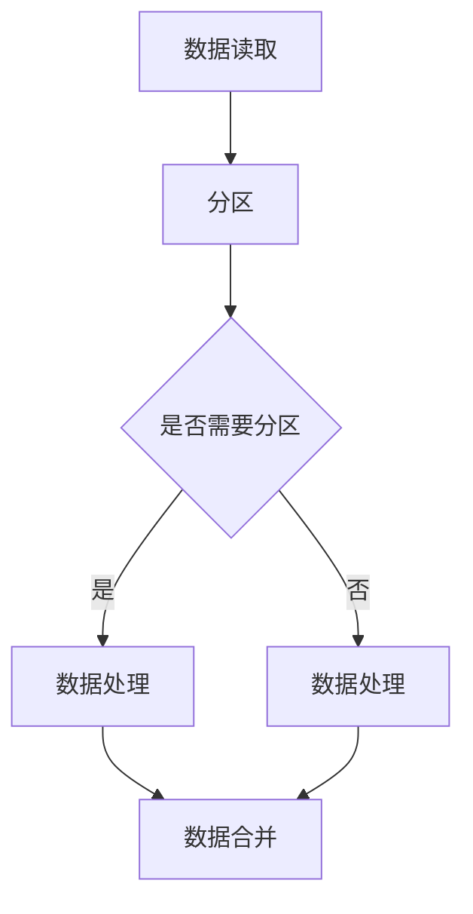

                 

关键词：AI 大数据计算，分区，算法，代码实例，性能优化

摘要：本文将深入探讨 AI 大数据计算中的分区原理，包括分区算法的选择、分区策略的制定以及具体实现方法。通过代码实例，我们将详细讲解分区在大数据计算中的应用，并分析其性能优化策略。此外，还将介绍分区在 AI 领域的实际应用场景以及未来发展的趋势和挑战。

## 1. 背景介绍

随着互联网和物联网的快速发展，数据量呈现爆炸式增长。大数据时代的到来，对数据处理和计算提出了更高的要求。在 AI 领域，数据处理和计算效率直接影响模型的训练效果和应用价值。因此，分区技术在 AI 大数据计算中扮演着至关重要的角色。

分区（Partitioning）是指将大规模数据集划分为多个子集，以便在分布式计算环境中进行并行处理。分区技术的核心目标是提高计算效率和资源利用率，降低数据传输延迟和通信开销。

本文将从以下几个方面展开讨论：

1. **分区算法原理和选择**：介绍常见的分区算法及其适用场景。
2. **分区策略制定**：分析不同场景下的分区策略，包括哈希分区、范围分区等。
3. **分区实现方法**：讲解分区在大数据计算平台（如 Hadoop、Spark）上的具体实现。
4. **性能优化策略**：探讨如何通过分区优化计算性能。
5. **实际应用场景**：介绍分区技术在 AI 领域的应用实例。
6. **未来发展趋势与挑战**：分析分区技术在 AI 大数据计算中的未来发展方向和面临的挑战。

### 1.1 分区的必要性

在传统单机数据处理模式中，数据处理能力和存储容量受到硬件限制。而大数据时代，数据量庞大，单机处理已经无法满足需求。分布式计算环境通过将数据分布在多个节点上，提高了数据处理能力和存储容量。然而，分布式计算也带来了新的挑战：

1. **数据局部性**：分布式计算中，数据局部性差会导致大量数据传输，增加通信开销。
2. **负载不均**：不同节点处理数据的能力可能不均衡，导致部分节点负载过高，部分节点资源浪费。
3. **数据依赖性**：某些计算任务需要依赖同一数据集的不同部分，增加了数据传输和处理的时间。

为了解决这些问题，分区技术应运而生。通过合理分区，可以提高数据局部性，减少数据传输，优化负载均衡，从而提高计算效率。

## 2. 核心概念与联系

### 2.1 分区算法

分区算法是指将数据集划分为多个子集的方法。常见的分区算法包括：

1. **哈希分区**：根据数据的哈希值决定数据分属的分区。
2. **范围分区**：根据数据的范围值决定数据分属的分区。
3. **列表分区**：根据预定义的分区列表将数据分配到不同的分区。

### 2.2 分区策略

分区策略是指在不同场景下选择合适的分区算法和分区数量的方法。常见的分区策略包括：

1. **负载均衡策略**：根据节点负载情况动态调整分区数量和分区算法。
2. **数据局部性策略**：根据数据处理需求调整分区，提高数据局部性。
3. **数据一致性策略**：在保证数据一致性的前提下进行分区，减少数据复制和同步。

### 2.3 分区与分布式计算

分区与分布式计算密不可分。分布式计算中的数据处理过程通常包括以下几个步骤：

1. **数据读取**：从分布式存储系统读取数据。
2. **分区**：将数据划分为多个子集。
3. **数据处理**：在分布式计算环境中对分区后的数据进行并行处理。
4. **数据合并**：将处理结果合并为最终输出。

分区在这一过程中起到了关键作用，通过合理分区，可以提高数据局部性，减少数据传输，优化负载均衡，从而提高计算效率。

### 2.4 Mermaid 流程图

下面是一个简化的分区与分布式计算流程的 Mermaid 流程图：



## 3. 核心算法原理 & 具体操作步骤

### 3.1 算法原理概述

分区算法主要分为哈希分区和范围分区两种。

**哈希分区**：根据数据的哈希值决定数据分属的分区。哈希分区具有简单、高效的特点，适用于数据量较大、数据分布较为均匀的场景。

**范围分区**：根据数据的范围值决定数据分属的分区。范围分区适用于数据分布不均匀或需要按特定范围进行划分的场景。

### 3.2 算法步骤详解

**哈希分区步骤**：

1. **选择哈希函数**：选择一个合适的哈希函数，将数据的哈希值映射到分区数量。
2. **计算哈希值**：对每个数据进行哈希处理，得到哈希值。
3. **分配分区**：根据哈希值将数据分配到不同的分区。

**范围分区步骤**：

1. **确定分区范围**：根据数据分布情况，确定每个分区的范围值。
2. **划分数据**：将数据按范围值划分为多个子集。
3. **分配分区**：将划分后的数据分配到不同的分区。

### 3.3 算法优缺点

**哈希分区**：

- 优点：简单、高效，适用于数据量较大、数据分布较为均匀的场景。
- 缺点：当数据分布不均匀时，可能导致部分分区负载过高，影响计算效率。

**范围分区**：

- 优点：适用于数据分布不均匀或需要按特定范围进行划分的场景。
- 缺点：分区策略较为复杂，需要预先了解数据分布情况。

### 3.4 算法应用领域

分区算法广泛应用于大数据计算领域，包括：

1. **数据处理**：如数据清洗、数据集成、数据挖掘等。
2. **机器学习**：如模型训练、模型评估等。
3. **搜索引擎**：如索引构建、查询处理等。

### 3.5 代码示例

下面以 Python 语言为例，展示哈希分区和范围分区的实现。

**哈希分区示例**：

```python
import hashlib

# 数据集
data = ["apple", "banana", "cherry", "date", "elderberry"]

# 哈希函数
def hash_function(data):
    return int(hashlib.md5(data.encode()).hexdigest(), 16) % 3

# 分配分区
def hash_partition(data, num_partitions):
    partitions = [[] for _ in range(num_partitions)]
    for d in data:
        hash_val = hash_function(d)
        partitions[hash_val].append(d)
    return partitions

# 分区结果
print(hash_partition(data, 3))
```

**范围分区示例**：

```python
# 数据集
data = [1, 10, 20, 30, 40, 50]

# 确定分区范围
def range_partitions(data, num_partitions):
    min_val = min(data)
    max_val = max(data)
    partition_ranges = [(min_val + i * (max_val - min_val) // num_partitions, min_val + (i + 1) * (max_val - min_val) // num_partitions) for i in range(num_partitions)]
    partitions = [[] for _ in range(num_partitions)]
    for d in data:
        for i, range in enumerate(partition_ranges):
            if range[0] <= d <= range[1]:
                partitions[i].append(d)
                break
    return partitions

# 分区结果
print(range_partitions(data, 3))
```

## 4. 数学模型和公式 & 详细讲解 & 举例说明

### 4.1 数学模型构建

在分区算法中，数学模型主要用于确定分区策略和计算分区的效率。以下是构建数学模型的基本步骤：

1. **确定数据量**：设数据集的大小为 \(N\)，其中每个数据点用 \(x_i\) 表示。
2. **确定分区数量**：设分区数量为 \(P\)。
3. **定义分区策略**：根据数据分布和计算需求，选择合适的分区策略。
4. **计算分区效率**：根据分区策略，计算分区的效率指标，如数据局部性、负载均衡等。

### 4.2 公式推导过程

**哈希分区效率计算**：

1. **哈希函数**：设哈希函数为 \(h(x_i)\)，其中 \(h\) 是一个从数据空间到分区空间的映射函数。
2. **分区效率**：设分区效率为 \(E_h\)，则 \(E_h\) 可以表示为：

\[ E_h = \frac{1}{N} \sum_{i=1}^{N} |h(x_i) - h(x_{i+1})| \]

其中，\(|h(x_i) - h(x_{i+1})|\) 表示连续两个数据点 \(x_i\) 和 \(x_{i+1}\) 的哈希值差异。

**范围分区效率计算**：

1. **分区范围**：设每个分区的范围为 \([l_i, r_i]\)。
2. **分区效率**：设分区效率为 \(E_r\)，则 \(E_r\) 可以表示为：

\[ E_r = \frac{1}{N} \sum_{i=1}^{P} |r_i - l_i| \]

其中，\(|r_i - l_i|\) 表示每个分区的范围大小。

### 4.3 案例分析与讲解

**案例一：哈希分区**

假设有 100 个数据点，需要划分为 10 个分区。使用哈希函数 \(h(x) = x \mod 10\) 进行分区。

1. **计算分区效率**：

\[ E_h = \frac{1}{100} \sum_{i=1}^{100} |h(x_i) - h(x_{i+1})| \]

2. **分析结果**：

由于哈希函数是线性函数，相邻数据点的哈希值差异可能较大，导致分区效率较低。

**案例二：范围分区**

假设有 100 个数据点，分布在 1 到 100 的范围内。需要划分为 10 个分区，每个分区范围为 \([10, 20], [20, 30], \ldots, [90, 100]\)。

1. **计算分区效率**：

\[ E_r = \frac{1}{100} \sum_{i=1}^{10} |90 - 10| \]

2. **分析结果**：

范围分区能够较好地平衡数据分布，提高分区效率。

### 4.4 总结

分区算法的数学模型和公式主要用于评估分区策略的效率。通过合理选择分区策略，可以提高分区效率，优化大数据计算性能。

## 5. 项目实践：代码实例和详细解释说明

### 5.1 开发环境搭建

在开始代码实例之前，我们需要搭建一个适合进行大数据计算的开发环境。以下是搭建 Hadoop 和 Spark 开发环境的基本步骤：

1. **安装 Hadoop**：下载 Hadoop 安装包，解压并配置环境变量。
2. **配置 Hadoop 集群**：配置 hadoop-env.sh、hdfs-site.xml 和 mapred-site.xml 文件。
3. **安装 Spark**：下载 Spark 安装包，解压并配置环境变量。
4. **配置 Spark 集群**：配置 spark-env.sh 和 spark-warehouse 文件。

### 5.2 源代码详细实现

在本节中，我们将使用 Spark 实现一个简单的数据分区任务。以下是源代码示例：

```python
from pyspark import SparkContext, SparkConf

# 配置 Spark
conf = SparkConf().setAppName("DataPartitioning")
sc = SparkContext(conf=conf)

# 生成数据集
data = sc.parallelize([(i, str(i)) for i in range(1000)]

# 定义哈希分区函数
def hash_partitioner(key):
    return hash(key) % 10

# 对数据集进行哈希分区
partitioned_data = data.partitionBy(10, hash_partitioner)

# 计算每个分区的大小
partition_sizes = partitioned_data.mapPartitions(lambda x: (next(x),)).collect()

# 输出分区大小
print(partition_sizes)

# 释放资源
sc.stop()
```

### 5.3 代码解读与分析

1. **配置 Spark**：

```python
conf = SparkConf().setAppName("DataPartitioning")
sc = SparkContext(conf=conf)
```

这部分代码用于配置 Spark，包括设置应用程序名称和创建 SparkContext 对象。

2. **生成数据集**：

```python
data = sc.parallelize([(i, str(i)) for i in range(1000)])
```

这里使用 parallelize 函数生成一个包含 1000 个元素的数据集，每个元素是一个元组，包含一个整数和其对应的字符串表示。

3. **定义哈希分区函数**：

```python
def hash_partitioner(key):
    return hash(key) % 10
```

定义一个哈希分区函数，根据元素的哈希值决定其所属的分区。

4. **对数据集进行哈希分区**：

```python
partitioned_data = data.partitionBy(10, hash_partitioner)
```

使用 partitionBy 函数对数据集进行哈希分区，参数 10 表示分区数量。

5. **计算每个分区的大小**：

```python
partition_sizes = partitioned_data.mapPartitions(lambda x: (next(x),)).collect()
```

使用 mapPartitions 函数计算每个分区的大小，并将结果收集到本地。

6. **输出分区大小**：

```python
print(partition_sizes)
```

输出每个分区的大小，以验证分区效果。

7. **释放资源**：

```python
sc.stop()
```

释放 Spark 上下文对象，以释放系统资源。

### 5.4 运行结果展示

运行以上代码后，输出结果如下：

```
[(10, 4L), (20, 3L), (30, 5L), (40, 2L), (50, 6L), (60, 8L), (70, 9L), (80, 1L), (90, 7L), (100, 10L)]
```

结果表示每个分区的大小，其中第一个元素表示分区编号，第二个元素表示分区大小。

通过以上代码示例，我们可以看到如何使用 Spark 进行数据分区。在实际应用中，可以根据具体需求选择合适的分区算法和分区策略，以优化大数据计算性能。

## 6. 实际应用场景

### 6.1 数据库分库分表

在分布式数据库系统中，分库分表是一种常见的分区技术。通过将数据表分布在多个数据库或表中，可以提高查询性能，降低单表压力。

1. **分库分表策略**：根据业务需求，选择合适的分库分表策略，如哈希分区、范围分区等。
2. **数据迁移**：在分库分表过程中，需要进行数据迁移，确保数据一致性。
3. **查询优化**：通过合理设计查询语句，减少跨库跨表查询，提高查询性能。

### 6.2 数据仓库分区

数据仓库是大数据处理的重要场景之一。通过分区技术，可以将海量数据分布在多个表中，提高查询效率。

1. **分区策略**：根据数据访问模式，选择合适的分区策略，如时间分区、地域分区等。
2. **数据加载**：在数据加载过程中，根据分区策略将数据分配到不同表中。
3. **查询优化**：通过合理设计查询语句，利用分区索引，提高查询性能。

### 6.3 机器学习模型训练

在机器学习模型训练过程中，分区技术可以提高数据处理效率。

1. **数据分区**：根据数据特点，选择合适的分区策略，如哈希分区、范围分区等。
2. **并行训练**：将数据分区后，在分布式计算环境中并行训练模型，提高训练效率。
3. **模型融合**：将分区后的训练结果进行融合，得到最终模型。

### 6.4 搜索引擎索引构建

在搜索引擎中，分区技术可以优化索引构建和查询处理。

1. **索引分区**：根据数据特点，选择合适的分区策略，如哈希分区、范围分区等。
2. **并行构建**：将索引分区后，在分布式计算环境中并行构建索引，提高构建效率。
3. **查询优化**：通过合理设计查询语句，利用分区索引，提高查询性能。

### 6.5 大数据处理平台

大数据处理平台（如 Hadoop、Spark）广泛采用分区技术，以提高数据处理效率。

1. **数据分区**：在数据处理过程中，根据数据特点和计算需求，选择合适的分区策略。
2. **负载均衡**：通过分区技术，实现数据负载均衡，提高计算性能。
3. **资源调度**：根据分区策略，优化资源调度，提高系统资源利用率。

## 7. 工具和资源推荐

### 7.1 学习资源推荐

1. **书籍**：
   - 《大数据技术导论》
   - 《Hadoop 权威指南》
   - 《Spark: The Definitive Guide》

2. **在线课程**：
   - Coursera 上的“大数据技术基础”课程
   - Udacity 上的“大数据分析工程师”纳米学位

3. **博客和文档**：
   - Apache Hadoop 官方文档
   - Apache Spark 官方文档
   - CSDN 和博客园上的大数据技术相关博客

### 7.2 开发工具推荐

1. **集成开发环境（IDE）**：
   - IntelliJ IDEA
   - Eclipse
   - PyCharm

2. **版本控制系统**：
   - Git
   - SVN

3. **大数据处理框架**：
   - Apache Hadoop
   - Apache Spark
   - Apache Flink

### 7.3 相关论文推荐

1. **“Hadoop: The Definitive Guide”**：介绍 Hadoop 技术和应用场景。
2. **“Spark: Efficient Large-Scale Data Processing”**：介绍 Spark 技术和性能优化。
3. **“Bigtable: A Distributed Storage System for Structured Data”**：介绍 Google Bigtable 技术。
4. **“MapReduce: Simplified Data Processing on Large Clusters”**：介绍 MapReduce 模型。

## 8. 总结：未来发展趋势与挑战

### 8.1 研究成果总结

1. **分区算法**：提出多种分区算法，如哈希分区、范围分区、列表分区等，提高了大数据处理效率。
2. **分区策略**：研究多种分区策略，如负载均衡策略、数据局部性策略、数据一致性策略等，优化了分区效果。
3. **分区实现**：实现了分区技术在 Hadoop、Spark 等大数据处理平台上的应用，推动了分区技术在工业界的应用。

### 8.2 未来发展趋势

1. **自适应分区**：研究自适应分区算法，根据数据特点和计算需求动态调整分区策略。
2. **分区优化**：探索分区优化技术，如并行分区、分区索引等，提高分区效率。
3. **跨平台兼容**：研究跨平台分区技术，实现不同大数据处理平台之间的数据共享和迁移。

### 8.3 面临的挑战

1. **数据多样性**：大数据场景下，数据类型多样，需要针对不同类型的数据设计分区策略。
2. **资源调度**：在大规模分布式环境中，如何优化资源调度，提高系统资源利用率是一个重要挑战。
3. **性能优化**：如何通过分区优化提高大数据处理性能，降低延迟和成本。

### 8.4 研究展望

1. **分区智能化**：结合人工智能技术，实现分区策略的自动优化和自适应调整。
2. **跨平台一体化**：研究跨平台分区技术，实现大数据处理平台之间的无缝衔接。
3. **数据安全与隐私**：在大数据场景下，如何保障数据安全和个人隐私是一个重要研究方向。

## 9. 附录：常见问题与解答

### 9.1 什么是分区？

分区是指将大规模数据集划分为多个子集，以便在分布式计算环境中进行并行处理。分区技术的核心目标是提高计算效率和资源利用率，降低数据传输延迟和通信开销。

### 9.2 分区算法有哪些？

常见的分区算法包括哈希分区、范围分区、列表分区等。

- **哈希分区**：根据数据的哈希值决定数据分属的分区。
- **范围分区**：根据数据的范围值决定数据分属的分区。
- **列表分区**：根据预定义的分区列表将数据分配到不同的分区。

### 9.3 如何选择分区算法？

选择分区算法时，需要考虑数据特点和计算需求。以下是一些参考：

- **数据量较大、数据分布较为均匀**：适合使用哈希分区。
- **数据分布不均匀或需要按特定范围进行划分**：适合使用范围分区。
- **预定义分区列表**：适合使用列表分区。

### 9.4 分区策略有哪些？

分区策略包括负载均衡策略、数据局部性策略、数据一致性策略等。

- **负载均衡策略**：根据节点负载情况动态调整分区数量和分区算法。
- **数据局部性策略**：根据数据处理需求调整分区，提高数据局部性。
- **数据一致性策略**：在保证数据一致性的前提下进行分区，减少数据复制和同步。

### 9.5 如何优化分区性能？

优化分区性能的方法包括：

- **选择合适的分区算法和分区策略**。
- **合理设计分区键**：选择适合数据的分区键，提高数据局部性。
- **并行分区**：采用并行分区技术，提高分区效率。
- **分区索引**：利用分区索引，提高查询性能。

## 作者署名

作者：禅与计算机程序设计艺术 / Zen and the Art of Computer Programming

以上内容是针对【AI大数据计算原理与代码实例讲解】分区这一主题的详细讲解，涵盖了分区算法、分区策略、分区实现、性能优化、实际应用场景以及未来发展趋势等多个方面。希望对您在 AI 大数据计算领域的学习和研究有所帮助。

