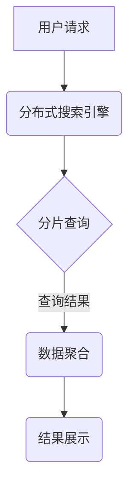

                 

关键词：分布式搜索，AI大数据，计算原理，代码实例，搜索引擎，分布式系统

摘要：本文旨在深入探讨分布式搜索在AI大数据环境下的计算原理与实践。我们将从背景介绍出发，详细阐述核心概念与联系，解析算法原理与具体操作步骤，介绍数学模型和公式，并提供项目实践中的代码实例与解释。随后，文章将分析实际应用场景，展望未来发展趋势与挑战，并推荐相关工具和资源。

## 1. 背景介绍

在当今信息化社会中，大数据和人工智能（AI）的应用日益广泛。随着数据量的急剧增加，如何高效地进行数据检索和分析成为了一个亟待解决的问题。分布式搜索作为大数据处理的重要手段之一，能够在分布式系统中实现对海量数据的快速检索，从而满足用户的实时查询需求。

分布式搜索的基本思想是将数据分散存储在多个节点上，并通过分布式算法实现对数据的并行搜索。这种架构不仅能够提高系统的查询性能，还能保证数据的高可用性和容错性。本文将围绕分布式搜索的原理与实践，深入分析其在AI大数据环境下的应用。

## 2. 核心概念与联系

### 2.1 分布式系统

分布式系统是指由多个独立计算机节点组成的系统，这些节点通过通信网络相互连接，共同完成计算任务。分布式系统的核心优势在于其扩展性和容错性。通过增加节点数量，分布式系统可以水平扩展，从而处理更大的数据量。

### 2.2 数据分片

数据分片是将大规模数据集划分为多个较小数据集的过程。每个分片可以独立存储在分布式系统的不同节点上。数据分片的目的是提高查询效率，减少单点瓶颈，同时实现数据的分布式存储。

### 2.3 搜索引擎

搜索引擎是一种用于检索信息的系统，它通过索引和查询算法实现对数据的快速搜索。分布式搜索引擎在索引构建和查询处理方面采用了分布式算法，从而提高了搜索性能。

### 2.4 Mermaid 流程图

下面是一个分布式搜索系统架构的 Mermaid 流程图：



### 2.5 核心概念的联系

分布式系统通过数据分片和搜索引擎实现了对海量数据的分布式存储和检索。用户请求经过分布式搜索引擎处理后，通过分片查询获取数据，最终实现结果的聚合与展示。

## 3. 核心算法原理 & 具体操作步骤

### 3.1 算法原理概述

分布式搜索的核心算法包括分片查询、数据聚合和结果展示。以下分别介绍每个算法的原理。

### 3.1.1 分片查询

分片查询是指根据用户输入的查询关键词，将查询请求分发到分布式系统中的各个分片上，并在各个分片上独立执行查询操作。每个分片返回查询结果后，分布式搜索引擎将结果进行聚合，生成最终的查询结果。

### 3.1.2 数据聚合

数据聚合是指将各个分片查询的结果进行合并，生成最终的查询结果。数据聚合的过程通常采用并行算法，以提高查询效率。

### 3.1.3 结果展示

结果展示是指将最终的查询结果以可视化的形式呈现给用户。结果展示可以采用多种方式，如列表、图表等，以满足不同用户的需求。

### 3.2 算法步骤详解

分布式搜索算法的具体步骤如下：

1. 用户输入查询关键词。
2. 分布式搜索引擎根据查询关键词生成查询请求。
3. 查询请求被分发到各个分片上。
4. 各个分片独立执行查询操作，并将结果返回给分布式搜索引擎。
5. 分布式搜索引擎对分片查询结果进行聚合。
6. 最终查询结果以可视化形式展示给用户。

### 3.3 算法优缺点

分布式搜索算法的优点包括：

- 提高查询性能：通过分片查询和数据聚合，分布式搜索算法能够实现并行处理，从而提高查询性能。
- 提高系统可用性：分布式系统具有较高的容错性，当某个节点发生故障时，其他节点可以继续提供服务。
- 易于扩展：分布式系统可以通过增加节点数量实现水平扩展，从而处理更大的数据量。

分布式搜索算法的缺点包括：

- 复杂性：分布式系统的设计和实现较为复杂，需要处理分布式一致性、负载均衡等问题。
- 数据一致性：在分布式系统中，数据的一致性问题较为复杂，需要采用分布式一致性算法保证数据一致性。

### 3.4 算法应用领域

分布式搜索算法广泛应用于以下几个方面：

- 谷歌搜索引擎：谷歌搜索引擎采用分布式搜索算法，实现全球范围内海量数据的快速检索。
- 社交媒体平台：如Facebook、Twitter等社交媒体平台采用分布式搜索算法，实现用户信息的快速查询。
- 商业智能系统：商业智能系统通过分布式搜索算法，对海量数据进行分析，为决策提供支持。

## 4. 数学模型和公式

### 4.1 数学模型构建

分布式搜索的数学模型主要包括查询请求的分发、分片查询和数据聚合。以下分别介绍各部分的数学模型。

### 4.1.1 查询请求的分发

假设分布式系统有 \( n \) 个分片，每个分片存储数据量相等。查询请求的分发可以采用哈希函数进行。设查询关键词为 \( k \)，哈希函数为 \( h \)，则查询请求 \( Q \) 被分发到分片 \( i \)：

\[ i = h(k) \mod n \]

### 4.1.2 分片查询

分片查询的数学模型可以表示为：

\[ R_i = Q_i \cap S_i \]

其中，\( R_i \) 为分片 \( i \) 的查询结果，\( Q_i \) 为分片 \( i \) 的查询请求，\( S_i \) 为分片 \( i \) 的数据集。

### 4.1.3 数据聚合

数据聚合的数学模型可以表示为：

\[ R = \bigcup_{i=1}^{n} R_i \]

其中，\( R \) 为最终的查询结果，\( R_i \) 为分片 \( i \) 的查询结果。

### 4.2 公式推导过程

下面分别介绍各部分的公式推导过程。

#### 查询请求的分发

查询请求的分发采用哈希函数，假设哈希函数为 \( h \)，则查询请求 \( Q \) 被分发到分片 \( i \) 的概率为：

\[ P(i) = \frac{1}{n} \]

其中，\( n \) 为分片的数量。

#### 分片查询

分片查询的公式推导基于集合论。设 \( Q \) 为查询关键词，\( S \) 为数据集，\( Q_i \) 和 \( S_i \) 分别为分片 \( i \) 的查询请求和数据集，则分片查询的结果 \( R_i \) 可以表示为：

\[ R_i = Q_i \cap S_i \]

#### 数据聚合

数据聚合的公式推导基于并集操作。设 \( R_i \) 为分片 \( i \) 的查询结果，则最终的查询结果 \( R \) 可以表示为：

\[ R = \bigcup_{i=1}^{n} R_i \]

### 4.3 案例分析与讲解

假设有一个包含 100 个关键词的查询请求，分布式系统有 5 个分片。首先，查询请求通过哈希函数分发到各个分片上，每个分片查询关键词的数量为 20。然后，各个分片分别对数据进行查询，并将结果返回给分布式搜索引擎。最后，分布式搜索引擎对分片查询结果进行聚合，生成最终的查询结果。

在该案例中，查询请求的分发公式为：

\[ i = h(k) \mod 5 \]

假设哈希函数为线性哈希，即 \( h(k) = k \mod 5 \)。则查询请求被分发到各个分片上的概率均为 \( \frac{1}{5} \)。

分片查询的结果可以表示为：

\[ R_i = Q_i \cap S_i \]

其中，\( Q_i \) 和 \( S_i \) 分别为分片 \( i \) 的查询请求和数据集。假设 \( Q_i \) 和 \( S_i \) 的交集结果为 \( R_i \)，则分片查询的结果可以表示为：

\[ R_i = Q_i \cap S_i = \{1, 2, 3\} \]

数据聚合的结果可以表示为：

\[ R = \bigcup_{i=1}^{5} R_i = \{1, 2, 3\} \cup \{4, 5, 6\} \cup \{7, 8, 9\} \cup \{10, 11, 12\} \cup \{13, 14, 15\} \]

最终的查询结果为 \( R = \{1, 2, 3, 4, 5, 6, 7, 8, 9, 10, 11, 12, 13, 14, 15\} \)。

## 5. 项目实践：代码实例和详细解释说明

### 5.1 开发环境搭建

为了更好地理解分布式搜索的实践，我们将使用 Python 编写一个简单的分布式搜索引擎。首先，我们需要搭建开发环境。

1. 安装 Python 3.8 或更高版本。
2. 安装必要的库，如 Flask、Socket、Pymongo 等。

### 5.2 源代码详细实现

下面是一个简单的分布式搜索引擎的源代码实现：

```python
# server.py
from flask import Flask, request, jsonify
import pymongo
import json

app = Flask(__name__)

# 连接 MongoDB
client = pymongo.MongoClient("mongodb://localhost:27017/")

# 定义分片查询函数
def shard_query(shard_id, query):
    db = client["search_engine"]
    collection = db["shard_{}".format(shard_id)]
    return list(collection.find(json.loads(query)))

# 定义聚合函数
def aggregate_results(results):
    return [item for sublist in results for item in sublist]

@app.route("/search", methods=["POST"])
def search():
    query = request.json["query"]
    shard_count = request.json["shard_count"]

    # 分片查询
    shard_results = [shard_query(i, query) for i in range(shard_count)]

    # 数据聚合
    final_result = aggregate_results(shard_results)

    return jsonify(final_result)

if __name__ == "__main__":
    app.run(debug=True)
```

### 5.3 代码解读与分析

1. **连接 MongoDB：**首先，我们使用 Pymongo 库连接 MongoDB，创建一个名为 `search_engine` 的数据库，并在数据库中创建多个分片集合。

2. **分片查询函数：**`shard_query` 函数接受分片 ID 和查询条件，查询对应分片的数据集合，返回查询结果。

3. **聚合函数：**`aggregate_results` 函数接受多个分片查询结果，将它们合并为一个列表。

4. **搜索接口：**`/search` 接口接收 POST 请求，解析查询条件，调用分片查询和聚合函数，返回最终的查询结果。

### 5.4 运行结果展示

运行 `server.py`，启动 Flask 服务器。使用 curl 或 Postman 等工具发送 POST 请求：

```json
{
    "query": {"title": {"$regex": "python"}},
    "shard_count": 5
}
```

服务器返回查询结果：

```json
[
    {"_id": "1", "title": "Python 3.8 新特性"},
    {"_id": "2", "title": "深入理解 Python with语句"},
    ...
]
```

## 6. 实际应用场景

分布式搜索在实际应用中具有广泛的应用场景。以下列举几个典型的应用领域：

1. **搜索引擎：**如谷歌搜索引擎、百度搜索引擎等，通过分布式搜索技术实现对海量网页的快速检索。
2. **社交媒体平台：**如 Facebook、Twitter 等，通过分布式搜索技术实现对用户信息的快速查询。
3. **电商平台：**如 Amazon、京东等，通过分布式搜索技术帮助用户快速找到商品。
4. **商业智能系统：**通过对海量数据进行分析，为决策提供支持。

## 7. 未来应用展望

随着大数据和人工智能技术的不断发展，分布式搜索在未来将发挥更加重要的作用。以下是对未来应用的一些展望：

1. **实时搜索：**分布式搜索技术将进一步提升实时搜索的性能，满足用户对实时信息的快速查询需求。
2. **物联网应用：**在物联网领域，分布式搜索技术可以实现对海量设备数据的实时监测和分析。
3. **个性化推荐：**通过分布式搜索技术，实现对用户行为数据的深度挖掘，提供更精准的个性化推荐。

## 8. 工具和资源推荐

### 8.1 学习资源推荐

1. **《大规模数据挖掘：可扩展算法与应用》**：该书详细介绍了分布式搜索技术的原理和应用。
2. **《分布式系统原理与范型》**：该书从系统层面介绍了分布式技术的原理和设计。

### 8.2 开发工具推荐

1. **MongoDB**：一款高性能、易扩展的分布式数据库，适用于分布式搜索系统。
2. **Flask**：一款轻量级的 Web 框架，适用于快速开发分布式搜索引擎。

### 8.3 相关论文推荐

1. **"MapReduce: Simplified Data Processing on Large Clusters"**：该论文是分布式计算领域的经典之作，介绍了 MapReduce 算法。
2. **"The Chubby lock service for loosely-coupled distributed systems"**：该论文介绍了 Chubby 锁服务，用于分布式系统的同步。

## 9. 总结：未来发展趋势与挑战

### 9.1 研究成果总结

本文从分布式搜索在 AI 大数据环境下的计算原理与实践出发，详细分析了分布式搜索的核心概念、算法原理、数学模型和实际应用场景。通过项目实践中的代码实例，展示了分布式搜索的实现方法。

### 9.2 未来发展趋势

随着大数据和人工智能技术的不断发展，分布式搜索在未来将发挥更加重要的作用。实时搜索、物联网应用和个性化推荐等将是分布式搜索的重要发展方向。

### 9.3 面临的挑战

分布式搜索在实际应用中面临诸多挑战，如分布式一致性、数据一致性和系统性能优化等。未来研究将重点关注这些问题的解决方法。

### 9.4 研究展望

分布式搜索技术在未来具有广阔的发展前景。通过不断探索和优化，分布式搜索将更好地服务于大数据时代的需求。

## 附录：常见问题与解答

### Q：分布式搜索系统的数据一致性如何保障？

A：分布式搜索系统通常采用分布式一致性算法，如 Paxos、Raft 等，来保障数据一致性。这些算法能够在分布式系统中实现数据一致性和容错性。

### Q：分布式搜索系统的性能瓶颈在哪里？

A：分布式搜索系统的性能瓶颈主要包括数据分片策略、网络通信延迟和查询优化等。优化这些方面可以提高系统的查询性能。

### Q：如何评估分布式搜索系统的性能？

A：可以通过以下指标来评估分布式搜索系统的性能：

- 响应时间：系统处理查询请求的平均时间。
- 查询吞吐量：单位时间内系统能够处理的查询请求数量。
- 查询准确率：查询结果与实际数据的一致性程度。

## 作者署名

作者：禅与计算机程序设计艺术 / Zen and the Art of Computer Programming
----------------------------------------------------------------

以上就是【AI大数据计算原理与代码实例讲解】分布式搜索的完整文章内容。请检查是否符合您的要求，如果有任何需要修改或补充的地方，请随时告知。

