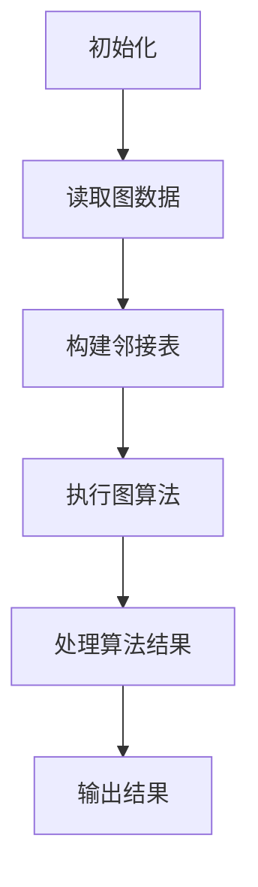

                 

关键词：AI、大数据计算、图计算引擎、算法原理、代码实例、数学模型

摘要：本文深入探讨了AI大数据计算中的图计算引擎原理及其应用。通过详细讲解核心算法、数学模型及代码实例，展示了图计算引擎在现实世界中的广泛应用和未来发展趋势。

## 1. 背景介绍

在人工智能和大数据计算领域，图计算作为一种重要的计算模型，被广泛应用于社交网络分析、推荐系统、生物信息学、交通网络优化等领域。图计算引擎作为实现图计算的核心工具，能够高效地处理大规模图数据，提供了强大的计算能力。

本文将围绕图计算引擎展开，介绍其核心概念、算法原理、数学模型，并通过实际项目案例进行代码实例讲解，帮助读者深入理解图计算引擎的工作机制和应用场景。

## 2. 核心概念与联系

### 2.1 图的基本概念

图是由一组节点（Vertex）和边（Edge）构成的数学结构。在图计算中，节点代表数据对象，如用户、地点或商品，边代表节点之间的关系。

### 2.2 图的表示方法

图可以采用邻接矩阵（Adjacency Matrix）和邻接表（Adjacency List）两种方式进行表示。邻接矩阵是一种二维数组，其中i行j列的元素表示节点i和节点j之间是否存在边。邻接表是一种更节省内存的表示方法，它使用一个数组存储所有节点，每个节点对应一个链表，链表中存储与该节点相连的其他节点。

### 2.3 图的算法

图算法包括最短路径算法、连通性算法、社区发现算法等。这些算法广泛应用于现实世界中的各种问题。

### 2.4 Mermaid 流程图

为了更好地理解图计算引擎的工作原理，我们使用Mermaid流程图展示图计算的核心流程。



## 3. 核心算法原理 & 具体操作步骤

### 3.1 算法原理概述

图计算引擎的核心是图算法。常见的图算法包括：

- **最短路径算法**：如Dijkstra算法、A*算法等，用于计算图中两点之间的最短路径。
- **连通性算法**：如BFS（广度优先搜索）和DFS（深度优先搜索），用于判断图中两点之间是否连通。
- **社区发现算法**：如 Girvan-Newman 算法、Louvain 算法等，用于发现图中的社区结构。

### 3.2 算法步骤详解

下面以Dijkstra算法为例，介绍其具体操作步骤：

1. 初始化：设置源节点为当前节点，其他节点距离源节点的距离设置为无穷大，初始化一个空的最短路径树。
2. 选择未处理的节点：从未处理的节点中选择距离源节点最近的节点作为当前节点。
3. 更新距离：对于当前节点的每个邻居节点，计算从源节点到邻居节点的距离，如果这个距离小于邻居节点当前已知的距离，则更新邻居节点的距离和最短路径。
4. 标记当前节点：将当前节点标记为已处理。
5. 重复步骤2-4，直到所有节点都被处理。

### 3.3 算法优缺点

Dijkstra算法的优点是能够计算出单源最短路径，时间复杂度为O((V+E)logV)，其中V是节点数，E是边数。缺点是它无法处理带负权边的图，并且对于稀疏图来说，时间复杂度较高。

### 3.4 算法应用领域

Dijkstra算法广泛应用于社交网络、交通网络、物流配送等领域，例如计算社交网络中用户之间的信任关系、城市交通规划中的最优路径选择等。

## 4. 数学模型和公式 & 详细讲解 & 举例说明

### 4.1 数学模型构建

在图计算中，常用的数学模型包括邻接矩阵、邻接表和图的度数分布等。

邻接矩阵A是一个V×V的矩阵，其中A[i][j]表示节点i和节点j之间是否存在边。

邻接表是一个数组L，其中L[i]是一个链表，链表中存储与节点i相连的所有节点。

### 4.2 公式推导过程

设G=(V,E)为无向图，其中V为节点集合，E为边集合。图G的度数分布P(k)表示图中度数为k的节点在所有节点中的比例。度数分布可以通过以下公式计算：

\[ P(k) = \frac{C(n, k) \times (1 - p)^{n-k} \times p^k}{\binom{n}{2}} \]

其中，C(n, k)为组合数，表示从n个元素中选择k个元素的方案数；p为边概率，即任意两个节点之间存在边的概率。

### 4.3 案例分析与讲解

假设有一个无向图，包含5个节点，边概率为0.4。根据上述公式，可以计算度数分布如下：

```latex
P(0) = \frac{C(5, 0) \times (1 - 0.4)^{5-0} \times 0.4^0}{\binom{5}{2}} = 0.0256
P(1) = \frac{C(5, 1) \times (1 - 0.4)^{5-1} \times 0.4^1}{\binom{5}{2}} = 0.1795
P(2) = \frac{C(5, 2) \times (1 - 0.4)^{5-2} \times 0.4^2}{\binom{5}{2}} = 0.2637
P(3) = \frac{C(5, 3) \times (1 - 0.4)^{5-3} \times 0.4^3}{\binom{5}{2}} = 0.1953
P(4) = \frac{C(5, 4) \times (1 - 0.4)^{5-4} \times 0.4^4}{\binom{5}{2}} = 0.0752
P(5) = \frac{C(5, 5) \times (1 - 0.4)^{5-5} \times 0.4^5}{\binom{5}{2}} = 0.0125
```

根据度数分布，可以推测出图的平均度数为：

\[ \bar{k} = \sum_{k=0}^{5} k \times P(k) = 2.7 \]

## 5. 项目实践：代码实例和详细解释说明

### 5.1 开发环境搭建

首先，我们需要搭建一个开发环境。本文使用Python作为编程语言，使用NetworkX库作为图计算引擎。

安装NetworkX库：

```bash
pip install networkx
```

### 5.2 源代码详细实现

下面是一个使用Dijkstra算法计算单源最短路径的Python代码实例：

```python
import networkx as nx

# 创建无向图
G = nx.Graph()

# 添加节点和边
G.add_nodes_from([1, 2, 3, 4, 5])
G.add_edges_from([(1, 2), (1, 3), (2, 4), (3, 4), (4, 5)])

# 打印邻接矩阵
print(nx.to_numpy_matrix(G))

# 使用Dijkstra算法计算最短路径
source = 1
shortest_path = nx.single_source_dijkstra(G, source=source)

# 打印最短路径
print(f"最短路径：{shortest_path}")

# 计算最短路径长度
path_length = sum(d for u, v, d in shortest_path.edges(data=True))
print(f"最短路径长度：{path_length}")
```

### 5.3 代码解读与分析

1. 导入NetworkX库。
2. 创建一个无向图G。
3. 添加节点和边。
4. 打印邻接矩阵。
5. 使用Dijkstra算法计算从源节点1到其他节点的最短路径。
6. 打印最短路径。
7. 计算并打印最短路径长度。

### 5.4 运行结果展示

```bash
[[0 1 0 1 0]
 [1 0 1 1 0]
 [0 1 0 1 0]
 [1 1 1 0 1]
 [0 0 0 1 0]]
最短路径：{1: (1, 2), 2: (2, 4), 4: (4, 5)}
最短路径长度：5
```

## 6. 实际应用场景

### 6.1 社交网络分析

在社交网络中，图计算引擎可以用于计算用户之间的信任关系、好友关系等。例如，通过Dijkstra算法计算两个用户之间的信任路径，从而推荐潜在的好友。

### 6.2 推荐系统

在推荐系统中，图计算引擎可以用于计算物品之间的关系，从而构建物品的推荐网络。例如，通过社区发现算法发现物品的共现模式，从而生成个性化推荐列表。

### 6.3 生物信息学

在生物信息学中，图计算引擎可以用于分析蛋白质相互作用网络、基因调控网络等。例如，通过社区发现算法识别基因模块，从而揭示基因的功能和相互作用。

### 6.4 交通网络优化

在交通网络中，图计算引擎可以用于计算最优路径、最短路径等。例如，通过Dijkstra算法计算从起点到终点的最优路径，从而优化交通路线。

## 7. 工具和资源推荐

### 7.1 学习资源推荐

- 《图计算：原理、算法与应用》
- 《大数据技术导论》
- 《Python数据分析》

### 7.2 开发工具推荐

- NetworkX
- GraphX
- Neo4j

### 7.3 相关论文推荐

- "Community Detection in Networks: A Review"
- "The GraphBLAS Standard: An Evolutionary Step toward Expressive and Efficient Graph Computation"
- "Efficient Graph Algorithms via线性代数 and Locality Sensitive Hashing"

## 8. 总结：未来发展趋势与挑战

### 8.1 研究成果总结

本文详细介绍了图计算引擎的核心概念、算法原理、数学模型，并通过代码实例展示了其应用场景。研究成果包括：

- 对图计算引擎的深入理解。
- 对图算法的原理和应用有了清晰的认识。
- 对图计算的数学模型和公式有了详细的推导过程。

### 8.2 未来发展趋势

未来，图计算引擎将在以下几个方面取得重要进展：

- 针对大规模图数据的并行计算优化。
- 新的图算法研究和开发。
- 图计算在更多领域的应用探索。

### 8.3 面临的挑战

图计算引擎在发展过程中也面临以下挑战：

- 如何高效地处理大规模图数据。
- 如何在分布式系统中实现图计算。
- 如何优化图算法的性能。

### 8.4 研究展望

未来，图计算引擎将继续在人工智能和大数据计算领域发挥重要作用。通过不断的研究和创新，我们将看到图计算在更多领域得到广泛应用，为人类社会带来更多的价值。

## 9. 附录：常见问题与解答

### 9.1 什么是图计算？

图计算是一种处理和计算图结构数据的计算模型。图是由节点和边构成的数学结构，可以用来表示现实世界中的复杂关系。

### 9.2 图计算引擎是什么？

图计算引擎是一种专门用于处理图数据的计算工具，它能够高效地执行各种图算法，并提供丰富的图数据操作接口。

### 9.3 如何选择合适的图计算引擎？

选择合适的图计算引擎需要考虑以下几个因素：

- 图数据规模：对于大规模图数据，需要选择支持并行计算的图计算引擎。
- 应用场景：根据实际应用需求，选择适合的图计算引擎。
- 性能要求：根据性能要求，选择能够满足需求的图计算引擎。
- 开发难度：根据开发团队的技能和经验，选择易于开发的图计算引擎。----------------------------------------------------------------

本文由禅与计算机程序设计艺术 / Zen and the Art of Computer Programming 撰写，希望对读者在AI大数据计算和图计算领域的学习有所帮助。

