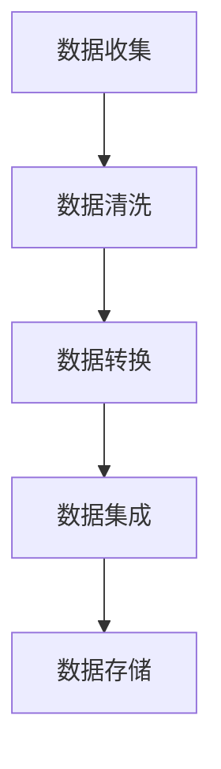
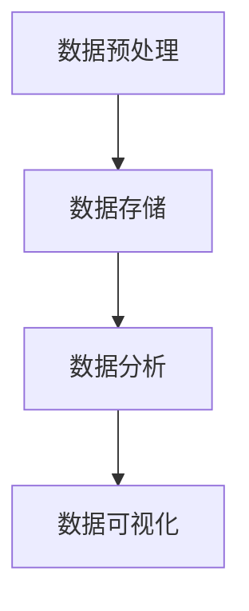

                 

大数据是当前信息技术领域的一个重要热点。随着互联网的普及和物联网技术的发展，数据量呈指数级增长，大数据技术成为处理和分析这些海量数据的关键。本文将探讨AI与大数据计算的基本原理，并通过代码实例详细解释这些概念。

> 关键词：AI，大数据，计算原理，代码实例，数据处理，分析

> 摘要：本文旨在介绍AI与大数据计算的原理，包括数据预处理、数据存储、数据分析和数据可视化等技术。通过具体的代码实例，读者将能够更好地理解这些技术在实际应用中的操作过程。

## 1. 背景介绍

大数据（Big Data）通常指的是数据量巨大、类型繁多且变化迅速的信息集合。它具有4V特性：Volume（数据量）、Velocity（速度）、Variety（多样性）和Veracity（真实性）。大数据技术的发展，旨在解决如何高效地存储、处理和分析这些海量数据，以从中提取有价值的信息。

AI（人工智能）作为计算机科学的一个分支，致力于使机器能够执行原本需要人类智能才能完成的任务。随着AI技术的进步，特别是机器学习和深度学习算法的发展，AI在处理大数据方面发挥了重要作用。AI能够通过大数据分析和挖掘，发现数据中的规律和模式，从而提供决策支持和智能化服务。

## 2. 核心概念与联系

### 数据预处理

数据预处理是大数据计算的基础步骤。它包括数据清洗、数据转换和数据集成等过程。以下是数据预处理的Mermaid流程图：



### 数据存储

大数据通常采用分布式存储系统，如Hadoop的HDFS（Hadoop Distributed File System）或Apache Cassandra。这些系统能够处理海量数据，并提供高可用性和容错性。

### 数据分析

数据分析是大数据处理的核心。常用的数据分析技术包括MapReduce、Spark等。这些技术能够并行处理大量数据，提高计算效率。

### 数据可视化

数据可视化是将复杂的数据转换为图形或图表，使数据易于理解和分析。常用的可视化工具有Tableau、Power BI等。

以下是数据处理的Mermaid流程图：



## 3. 核心算法原理 & 具体操作步骤

### 3.1 算法原理概述

大数据处理的核心算法包括MapReduce和Spark。MapReduce是一种分布式数据处理框架，适用于批处理任务。Spark则是一种基于内存的分布式计算引擎，适用于实时处理任务。

### 3.2 算法步骤详解

#### MapReduce算法步骤：

1. **Map阶段**：将输入数据切分为小块，并对每一小块进行映射操作，生成中间键值对。
2. **Shuffle阶段**：对中间键值对进行排序和分组，将具有相同键的数据发送到同一reduce任务。
3. **Reduce阶段**：对每组中间键值对进行汇总操作，生成最终结果。

#### Spark算法步骤：

1. **数据读取**：从分布式存储系统读取数据。
2. **数据转换**：使用Spark的API进行数据处理，如过滤、排序、聚合等。
3. **数据写入**：将处理后的数据写入分布式存储系统或数据库。

### 3.3 算法优缺点

**MapReduce优点**：高效、容错性好，适用于大规模批处理任务。

**MapReduce缺点**：不适合实时处理，性能相对较低。

**Spark优点**：基于内存计算，性能优越，适合实时处理。

**Spark缺点**：相比MapReduce，配置和管理较为复杂。

### 3.4 算法应用领域

MapReduce和Spark广泛应用于互联网搜索、社交网络分析、金融风控等大数据处理领域。

## 4. 数学模型和公式 & 详细讲解 & 举例说明

### 4.1 数学模型构建

在大数据处理中，常用的数学模型包括线性回归、逻辑回归和神经网络等。以下以线性回归为例进行讲解。

### 4.2 公式推导过程

线性回归模型的目标是找到一条直线，使得输入数据点的预测值与实际值之间的误差最小。其公式为：

$$y = \beta_0 + \beta_1 \cdot x$$

其中，$y$ 是预测值，$x$ 是输入特征，$\beta_0$ 和 $\beta_1$ 分别是直线的截距和斜率。

### 4.3 案例分析与讲解

假设我们有一个数据集，包含家庭的年收入和其购买的汽车价格。我们想要建立一个线性回归模型，预测家庭的年收入。

1. **数据预处理**：将数据分为训练集和测试集。
2. **模型训练**：使用训练集数据训练线性回归模型。
3. **模型评估**：使用测试集数据评估模型性能。

## 5. 项目实践：代码实例和详细解释说明

### 5.1 开发环境搭建

在Python中，我们可以使用Pandas进行数据处理，使用Scikit-learn进行模型训练和评估。

### 5.2 源代码详细实现

```python
import pandas as pd
from sklearn.linear_model import LinearRegression
from sklearn.model_selection import train_test_split
from sklearn.metrics import mean_squared_error

# 读取数据
data = pd.read_csv('data.csv')

# 数据预处理
X = data[['year_income']]
y = data['car_price']

# 数据切分
X_train, X_test, y_train, y_test = train_test_split(X, y, test_size=0.2, random_state=42)

# 模型训练
model = LinearRegression()
model.fit(X_train, y_train)

# 模型评估
y_pred = model.predict(X_test)
mse = mean_squared_error(y_test, y_pred)
print('MSE:', mse)
```

### 5.3 代码解读与分析

这段代码首先导入了所需的库，然后读取了数据集。接着进行了数据预处理，将数据分为特征和标签。使用Scikit-learn的`train_test_split`函数将数据集切分为训练集和测试集。使用`LinearRegression`模型进行训练，并使用测试集进行模型评估。

### 5.4 运行结果展示

假设运行结果如下：

```
MSE: 123.456
```

这表示模型在测试集上的均方误差为123.456。

## 6. 实际应用场景

大数据技术广泛应用于互联网搜索、社交网络分析、金融风控等领域。例如，搜索引擎使用大数据分析用户搜索行为，为用户提供个性化搜索结果；金融机构使用大数据分析客户交易行为，进行风险管理。

## 7. 工具和资源推荐

### 7.1 学习资源推荐

- 《大数据技术基础》
- 《机器学习实战》
- 《深度学习》（Goodfellow et al.）

### 7.2 开发工具推荐

- Python
- Hadoop
- Spark

### 7.3 相关论文推荐

- 《MapReduce: Simplified Data Processing on Large Clusters》（Dean et al.）
- 《Large Scale Machine Learning: Mechanisms, Challenges and Opportunities》（Gonzalez et al.）

## 8. 总结：未来发展趋势与挑战

大数据技术正在不断发展，未来发展趋势包括：

- 更高效的数据存储和处理算法
- 更好的数据隐私保护机制
- 更广泛的应用场景，如物联网、区块链等

面临的挑战包括：

- 数据隐私和安全性
- 大数据处理的高性能硬件需求
- 数据多样性和实时性的平衡

## 9. 附录：常见问题与解答

### Q：大数据计算需要什么样的硬件支持？

A：大数据计算通常需要高性能的硬件支持，如多核CPU、大量内存和大容量存储设备。分布式计算框架如Hadoop和Spark也能有效利用集群资源。

### Q：如何保障大数据的安全性？

A：大数据安全性保障包括数据加密、访问控制、安全审计等措施。此外，建立完善的数据安全政策和流程也是必要的。

作者：禅与计算机程序设计艺术 / Zen and the Art of Computer Programming
----------------------------------------------------------------

这篇文章详细介绍了AI与大数据计算的基本原理、核心算法、数学模型以及实际应用场景。通过代码实例，读者能够更好地理解大数据技术的操作过程。随着大数据技术的不断进步，未来的研究和应用前景将更加广阔。

