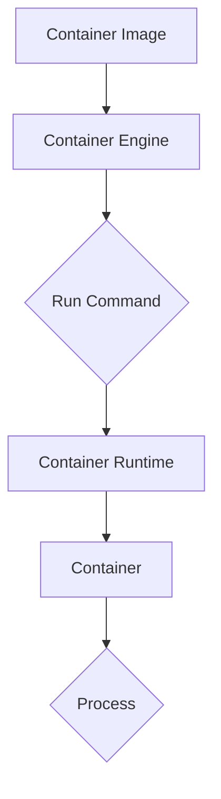

                 

关键词：AI，大数据，容器，计算原理，代码实例，技术博客

摘要：本文将深入探讨AI与大数据计算中的关键组件——容器。从基础概念到应用实例，我们将一步步解析容器的工作原理、优点、应用场景及其在实际开发中的重要性。通过代码实例展示，读者将更好地理解容器技术在AI大数据计算中的作用。

## 1. 背景介绍

随着人工智能（AI）和大数据技术的快速发展，计算能力的需求日益增长。为了满足这种需求，容器技术应运而生。容器提供了一种轻量级的虚拟化解决方案，使得应用程序可以在不同的环境中独立运行，不受宿主机环境的干扰。容器技术的普及极大地提高了软件开发和部署的效率。

### 容器与虚拟机的区别

容器与传统的虚拟机（VM）相比，具有显著的差异。虚拟机通过模拟硬件环境，为每个虚拟机提供独立的操作系统和资源。而容器则是基于操作系统的用户空间进行隔离，不需要额外的操作系统层，从而使得容器更加轻量级、启动速度快。

### 容器技术的发展历程

容器技术的起源可以追溯到Linux容器（LXC），随后Docker的出现极大地推动了容器技术的普及。Docker利用了Linux的cgroup和namespace功能，提供了一种简单、高效的容器化解决方案。随着Kubernetes等容器编排工具的发展，容器技术逐渐成为现代应用开发和运维的核心。

## 2. 核心概念与联系

### 容器基础概念

容器是一个运行时环境，它包含应用程序、库、环境变量和其他必需的组件。容器通过以下方式实现隔离：

- **Namespace**: 容器通过Namespace实现进程间的隔离，使得容器内的进程无法访问其他容器或宿主机的进程。
- **Cgroups**: Cgroups通过资源控制，实现对容器资源（如CPU、内存）的限定，保证容器间的资源隔离。
- **容器镜像**: 容器镜像是一个静态的文件系统，包含了应用程序及其依赖项，用于创建容器。

### 容器架构

以下是容器架构的Mermaid流程图：



### 容器的工作流程

1. **构建容器镜像**：通过Dockerfile或其他工具构建容器镜像。
2. **运行容器**：使用容器引擎（如Docker）运行容器镜像，启动容器。
3. **容器管理**：通过容器编排工具（如Kubernetes）对容器进行部署、扩展和管理。

## 3. 核心算法原理 & 具体操作步骤

### 3.1 算法原理概述

容器技术的核心算法包括Namespace和Cgroups。Namespace用于实现进程间的隔离，Cgroups用于资源控制。

### 3.2 算法步骤详解

1. **构建容器镜像**：编写Dockerfile，定义容器镜像的构建过程。
2. **运行容器**：使用Docker命令运行容器镜像，启动容器。
3. **容器管理**：使用Kubernetes等工具进行容器部署、扩展和管理。

### 3.3 算法优缺点

**优点**：

- **轻量级**：容器不需要额外的操作系统层，相比虚拟机更加轻量。
- **快速启动**：容器启动速度快，可以快速部署和扩展应用程序。
- **资源隔离**：通过Namespace和Cgroups实现进程间和资源间的隔离。

**缺点**：

- **安全性**：容器隔离性不如虚拟机，存在一定的安全隐患。
- **依赖性**：容器依赖宿主机的操作系统和内核版本，存在兼容性问题。

### 3.4 算法应用领域

容器技术在以下领域具有广泛应用：

- **Web应用部署**：容器化Web应用，提高部署和扩展效率。
- **大数据处理**：容器化大数据处理框架，如Hadoop、Spark等。
- **人工智能应用**：容器化AI模型训练和推理，提高计算效率。

## 4. 数学模型和公式 & 详细讲解 & 举例说明

### 4.1 数学模型构建

容器技术的核心算法涉及到以下数学模型：

- **Namespace**: 通过PID、Net、IPC、User、Mount等Namespace实现进程、网络、IPC、用户和挂载隔离。
- **Cgroups**: 通过cgroup实现进程和资源的分组和管理。

### 4.2 公式推导过程

$$
Cgroups = \sum_{i=1}^{n} (Resource_i \times Constraint_i)
$$

其中，$Resource_i$ 表示第 $i$ 个资源的数量，$Constraint_i$ 表示第 $i$ 个资源的限制。

### 4.3 案例分析与讲解

假设我们要为一个容器设置CPU和内存限制，可以使用以下命令：

```bash
# 设置CPU限制
cgroup adm -r "cpus:1-2"
# 设置内存限制
cgroup adm -r "memory:2G"
```

这样，容器将只能使用两个CPU核心和2GB内存。

## 5. 项目实践：代码实例和详细解释说明

### 5.1 开发环境搭建

1. 安装Docker：在Ubuntu系统上，可以通过以下命令安装Docker：

```bash
sudo apt-get update
sudo apt-get install docker.io
```

2. 启动Docker服务：

```bash
sudo systemctl start docker
```

### 5.2 源代码详细实现

以下是一个简单的Dockerfile示例：

```dockerfile
# 指定基础镜像
FROM ubuntu:20.04

# 设置工作目录
WORKDIR /app

# 安装依赖
RUN apt-get update && apt-get install -y python3-pip

# 拷贝应用程序到容器
COPY . /app

# 运行应用程序
CMD ["python3", "app.py"]
```

### 5.3 代码解读与分析

1. **FROM**：指定基础镜像，这里是Ubuntu 20.04。
2. **WORKDIR**：设置工作目录为/app。
3. **RUN**：安装Python 3和pip。
4. **COPY**：将当前目录下的应用程序文件拷贝到容器的/app目录。
5. **CMD**：指定容器的启动命令，这里是运行应用程序app.py。

### 5.4 运行结果展示

1. 编译Docker镜像：

```bash
docker build -t my-app .
```

2. 运行容器：

```bash
docker run -d -p 8080:8080 my-app
```

3. 访问容器内的应用程序：

```bash
http://localhost:8080
```

## 6. 实际应用场景

容器技术广泛应用于以下场景：

- **Web应用部署**：容器化Web应用，提高部署和扩展效率。
- **大数据处理**：容器化大数据处理框架，如Hadoop、Spark等。
- **人工智能应用**：容器化AI模型训练和推理，提高计算效率。
- **持续集成和持续部署（CI/CD）**：容器化测试和部署流程，提高开发效率。

## 7. 工具和资源推荐

### 7.1 学习资源推荐

- **《Docker实战》**：Docker官方推荐的学习资料，涵盖了Docker的各个方面。
- **《容器与云计算》**：详细介绍了容器技术和云计算的关系。

### 7.2 开发工具推荐

- **Docker**：最受欢迎的容器化解决方案。
- **Kubernetes**：用于容器编排和管理的开源平台。

### 7.3 相关论文推荐

- **"Docker: Lightweight Linux Containers for Developing, Deploying, and Running Applications"**：Docker的官方论文。
- **"Kubernetes: System Architecture"**：Kubernetes的系统架构介绍。

## 8. 总结：未来发展趋势与挑战

### 8.1 研究成果总结

容器技术已经成为现代应用开发和部署的核心，其在提高开发效率和部署灵活性方面具有显著优势。

### 8.2 未来发展趋势

- **容器安全**：随着容器应用的增加，容器安全将成为重要研究方向。
- **容器网络**：容器网络的优化和可靠性将是未来研究的重点。
- **容器编排**：容器编排工具将继续发展和完善，以适应更复杂的部署场景。

### 8.3 面临的挑战

- **兼容性问题**：容器在不同操作系统和硬件平台之间的兼容性需要进一步解决。
- **安全性**：容器隔离性不如虚拟机，需要提高容器安全性。

### 8.4 研究展望

容器技术将继续发展，并在人工智能和大数据计算等领域的应用中发挥重要作用。

## 9. 附录：常见问题与解答

### 9.1 Q：容器与虚拟机有什么区别？

A：容器与虚拟机相比，更加轻量级、启动速度快，但隔离性不如虚拟机。

### 9.2 Q：如何保证容器之间的安全性？

A：通过限制容器之间的网络通信和资源访问，以及使用安全沙箱技术，可以提高容器之间的安全性。

### 9.3 Q：容器技术适用于哪些场景？

A：容器技术适用于Web应用部署、大数据处理、人工智能应用等多个场景。

---

作者：禅与计算机程序设计艺术 / Zen and the Art of Computer Programming
----------------------------------------------------------------


