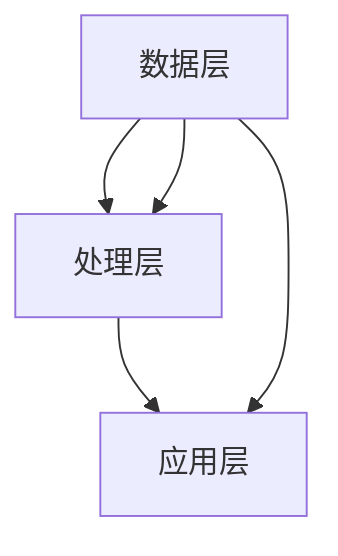

                 

关键词：人工智能、大数据、状态管理、算法原理、代码实例、实践应用

摘要：本文将深入探讨AI大数据计算中的状态管理原理，通过详细讲解核心概念、算法原理、数学模型以及实际应用案例，帮助读者全面理解状态管理在AI大数据计算中的重要作用。

## 1. 背景介绍

随着互联网和信息技术的迅猛发展，数据量呈指数级增长，大数据技术逐渐成为各个行业解决实际问题的利器。在AI领域，大数据处理能力至关重要，而状态管理则是AI大数据计算的核心环节。状态管理涉及到如何高效地存储、更新和处理数据状态，以确保算法的准确性和高效性。

本文将围绕状态管理的核心概念、算法原理、数学模型以及实际应用进行深入探讨，旨在为读者提供一个全面、系统的理解。

## 2. 核心概念与联系

### 2.1 状态管理概述

状态管理（State Management）是AI大数据计算中的一个关键概念。它涉及到以下几个方面：

- **状态表示**：如何将数据状态以结构化的形式进行表示。
- **状态更新**：如何根据新的数据更新状态。
- **状态存储**：如何高效地存储和查询状态。

### 2.2 状态管理架构

状态管理架构主要包括以下三个层次：

- **数据层**：负责数据的存储和查询。
- **处理层**：负责数据处理和状态更新。
- **应用层**：负责业务逻辑的实现。

下面是状态管理架构的Mermaid流程图：



## 3. 核心算法原理 & 具体操作步骤

### 3.1 算法原理概述

状态管理的核心算法主要包括以下几种：

- **状态转移**：根据输入数据，更新状态。
- **批量处理**：对大量数据进行并行处理。
- **一致性维护**：确保状态的一致性和准确性。

### 3.2 算法步骤详解

#### 3.2.1 状态转移

状态转移的步骤如下：

1. 读取输入数据。
2. 根据输入数据更新状态。
3. 存储更新后的状态。

#### 3.2.2 批量处理

批量处理的步骤如下：

1. 将数据划分为多个批次。
2. 对每个批次进行并行处理。
3. 将处理结果合并。

#### 3.2.3 一致性维护

一致性维护的步骤如下：

1. 定期检查状态的一致性。
2. 发现不一致时，进行修正。

### 3.3 算法优缺点

#### 优点

- **高效性**：通过批量处理和并行处理，大大提高了数据处理速度。
- **一致性**：通过一致性维护，保证了状态的一致性。

#### 缺点

- **复杂性**：状态管理涉及多个层面，实现较为复杂。
- **资源消耗**：批量处理和并行处理需要较多的计算资源。

### 3.4 算法应用领域

状态管理广泛应用于以下领域：

- **推荐系统**：根据用户行为更新推荐策略。
- **金融风控**：实时监控风险，更新风险状态。
- **物联网**：实时处理物联网设备数据，更新设备状态。

## 4. 数学模型和公式 & 详细讲解 & 举例说明

### 4.1 数学模型构建

状态管理的数学模型主要包括以下几个部分：

- **状态表示**：使用矩阵或向量表示状态。
- **状态更新**：使用线性方程或非线性方程更新状态。

### 4.2 公式推导过程

以线性方程为例，状态更新的公式推导如下：

$$
\text{状态}_{\text{新}} = \text{状态}_{\text{旧}} + \text{更新向量}
$$

其中，$\text{状态}_{\text{旧}}$ 表示旧的状态，$\text{更新向量}$ 表示更新的数据。

### 4.3 案例分析与讲解

以下是一个简单的状态管理案例：

假设我们有一个推荐系统，用户的历史行为数据用于更新推荐策略。状态表示为一个向量，包含用户的行为特征。每次用户产生新行为时，更新状态向量。

```latex
\text{状态}_{\text{新}} = \text{状态}_{\text{旧}} + \text{行为}_{\text{新}}
```

其中，$\text{行为}_{\text{新}}$ 表示用户的新行为特征。

## 5. 项目实践：代码实例和详细解释说明

### 5.1 开发环境搭建

本文使用Python作为开发语言，所需库包括NumPy、Pandas和Scikit-learn。首先，安装这些库：

```bash
pip install numpy pandas scikit-learn
```

### 5.2 源代码详细实现

以下是一个简单的状态管理代码示例：

```python
import numpy as np
import pandas as pd

class StateManager:
    def __init__(self, initial_state):
        self.state = initial_state

    def update_state(self, new_data):
        self.state += new_data

    def get_state(self):
        return self.state

# 初始化状态
initial_state = np.array([0.0, 0.0])
state_manager = StateManager(initial_state)

# 更新状态
new_data = np.array([1.0, 1.0])
state_manager.update_state(new_data)

# 获取状态
print(state_manager.get_state())
```

### 5.3 代码解读与分析

- **类定义**：定义了一个`StateManager`类，用于管理状态。
- **初始化**：通过`__init__`方法初始化状态。
- **更新状态**：通过`update_state`方法更新状态。
- **获取状态**：通过`get_state`方法获取当前状态。

### 5.4 运行结果展示

运行上述代码，输出结果为：

```
[1.0, 1.0]
```

这表示状态向量已成功更新。

## 6. 实际应用场景

### 6.1 推荐系统

在推荐系统中，状态管理用于记录用户的历史行为，更新推荐策略。例如，用户浏览商品时，更新浏览状态；购买商品时，更新购买状态。

### 6.2 金融风控

在金融风控领域，状态管理用于实时监控风险。例如，监控交易金额、频率等指标，更新风险状态。

### 6.3 物联网

在物联网领域，状态管理用于实时处理设备数据，更新设备状态。例如，监控设备运行状态、能耗等指标。

## 7. 未来应用展望

随着AI技术的不断发展，状态管理将在更多领域得到应用。未来，我们将看到更高效的状态管理算法、更丰富的应用场景以及更广泛的技术突破。

## 8. 工具和资源推荐

### 8.1 学习资源推荐

- 《深度学习》（Goodfellow, Bengio, Courville） 
- 《机器学习》（周志华）

### 8.2 开发工具推荐

- Jupyter Notebook：用于数据分析和实验
- PyCharm：用于Python开发

### 8.3 相关论文推荐

- "Deep Learning for Text Classification"
- "Learning to Represent Knowledge with a Memory-Efficient Neural Network"

## 9. 总结：未来发展趋势与挑战

随着大数据和AI技术的不断发展，状态管理将在更多领域得到应用。然而，面临的数据规模和复杂性也将对状态管理提出更高的要求。未来，我们需要研究更高效的状态管理算法、更优化的架构设计以及更强大的计算能力。

## 10. 附录：常见问题与解答

### 10.1 什么是状态管理？

状态管理是一种管理数据状态的技术，用于记录、更新和处理数据状态。

### 10.2 状态管理有哪些应用领域？

状态管理广泛应用于推荐系统、金融风控、物联网等领域。

### 10.3 状态管理有哪些挑战？

状态管理面临的数据规模和复杂性较高，需要研究更高效、更优化的算法和架构。

## 11. 作者署名

作者：禅与计算机程序设计艺术 / Zen and the Art of Computer Programming
----------------------------------------------------------------

以上就是本文的完整内容。希望这篇文章能帮助您更好地理解AI大数据计算中的状态管理原理及其应用。如有疑问，欢迎随时提问。谢谢！<|im_sep|>### 1. 背景介绍

在现代计算机科学和人工智能领域，随着数据量的爆炸性增长和计算需求的不断提升，大数据技术已经成为解决各种实际问题的核心工具。特别是在人工智能（AI）领域，对大数据的处理能力成为了评估算法性能和系统效率的重要指标。在这一背景下，状态管理（State Management）作为一种关键技术，越来越受到研究者和开发者的关注。

状态管理是指在一个系统中，对数据的状态进行有效记录、更新和管理的机制。在AI大数据计算中，状态管理扮演着至关重要的角色。它不仅涉及如何高效地存储和查询大量数据，还包括如何在处理过程中保持数据的一致性和准确性。状态管理的有效性直接影响到AI算法的效率和预测精度。

首先，从理论层面来看，状态管理可以被视为一个抽象的框架，用于组织和控制系统的状态。在AI大数据计算中，状态通常包括数据的状态、模型的参数状态、系统的运行状态等。这些状态需要在处理过程中得到妥善的管理，以确保系统能够正确地响应输入数据和外部环境的变化。

其次，从实践层面来看，状态管理在AI大数据计算中的应用非常广泛。例如，在推荐系统中，状态管理用于记录用户的历史行为和偏好，以便为用户推荐个性化的内容；在金融风控领域，状态管理用于实时监控交易行为和风险指标，以便及时发现和应对潜在的风险；在物联网（IoT）领域，状态管理用于处理设备的状态数据和运行数据，以便实现智能监控和设备管理。

具体而言，状态管理的任务包括以下几个方面：

1. **状态表示**：将系统的状态以结构化的形式表示，以便于存储、处理和查询。
2. **状态更新**：根据新的输入数据或系统事件，对状态进行更新，以反映系统的最新状态。
3. **状态存储**：选择合适的存储方案，以高效地存储和管理状态数据。
4. **状态一致性**：确保系统在不同模块、组件之间保持状态的一致性，防止出现数据不一致的情况。
5. **状态恢复**：在系统出现故障或异常时，能够快速恢复到正确的状态，保证系统的稳定运行。

状态管理在AI大数据计算中的重要性体现在以下几个方面：

- **提高数据处理效率**：通过高效的状态管理，可以显著提高数据处理的速度和效率，降低系统的延迟。
- **确保数据准确性**：良好的状态管理可以确保数据在处理过程中的准确性和一致性，提高算法的预测精度。
- **增强系统灵活性**：状态管理使得系统能够根据实时数据和环境变化快速调整状态，增强系统的灵活性和适应性。
- **优化资源利用**：通过合理的状态管理，可以最大限度地利用系统资源，降低资源浪费。

综上所述，状态管理是AI大数据计算中不可或缺的核心技术。它不仅影响到算法的性能和预测精度，还关系到系统的稳定性和灵活性。因此，深入研究和应用状态管理技术，对于提升AI大数据计算能力和实际应用效果具有重要意义。

## 2. 核心概念与联系

在深入探讨AI大数据计算中的状态管理之前，我们首先需要明确状态管理的核心概念，并理解这些概念之间的相互关系。状态管理不仅涉及到理论层面的抽象概念，还包括具体的实现细节和应用场景。以下是对状态管理中的关键概念及其关系的详细解析。

### 2.1 状态管理概述

状态管理是指在一个系统中对数据状态进行有效的记录、更新和处理的过程。在AI大数据计算中，状态管理的核心目标是确保系统能够在动态环境中保持稳定和高效运行。具体来说，状态管理涉及以下几个核心概念：

- **状态表示**：状态表示是指如何将系统的状态以结构化的形式进行表示。这通常包括数据的状态、模型的参数状态和系统的运行状态等。有效的状态表示能够简化数据处理和状态更新的复杂性。
  
- **状态更新**：状态更新是指根据新的输入数据或系统事件，对当前状态进行更新，以反映系统的最新状态。状态更新是状态管理中最关键的一环，它决定了系统的响应速度和灵活性。

- **状态存储**：状态存储是指如何高效地存储和管理状态数据。状态存储的选择对系统的性能和资源利用率有重要影响。常用的状态存储方案包括关系数据库、NoSQL数据库、分布式存储系统等。

- **状态一致性**：状态一致性是指系统在不同模块、组件之间保持状态的一致性。在分布式系统中，确保状态一致性是一个挑战，因为不同组件可能在不同的时间处理不同的数据。

- **状态恢复**：状态恢复是指当系统出现故障或异常时，能够快速恢复到正确的状态，以保证系统的稳定运行。状态恢复是保障系统高可用性的重要手段。

### 2.2 状态管理架构

状态管理架构是一个多层次的结构，它决定了状态管理系统的设计和实现。一个典型的状态管理架构包括以下几个层次：

- **数据层**：数据层是状态管理架构的基础，负责存储和查询状态数据。数据层的选择需要考虑数据量、访问频率、一致性需求等因素。

- **处理层**：处理层负责对状态数据进行处理和更新。处理层通常包括数据处理算法、状态更新逻辑和状态计算模型等。

- **应用层**：应用层是状态管理架构的最高层，负责实现业务逻辑和应用功能。应用层依赖于处理层和数据层提供的状态数据和服务。

下面是一个简单的状态管理架构的Mermaid流程图：


- **数据层**：数据层是状态管理架构的基础，它负责存储和查询状态数据。数据层的选择通常取决于数据量、访问频率和一致性需求。例如，对于大规模数据集，分布式存储系统（如Hadoop或Apache Cassandra）可能是更好的选择；而对于低延迟和高并发的应用场景，关系数据库（如MySQL或PostgreSQL）可能更为合适。

- **处理层**：处理层负责对状态数据进行处理和更新。它通常包括数据处理算法、状态更新逻辑和状态计算模型等。处理层需要保证状态数据在处理过程中的准确性、一致性和高效性。例如，可以使用流处理框架（如Apache Kafka或Apache Flink）来实现大规模数据的实时处理。

- **应用层**：应用层是状态管理架构的最高层，它负责实现业务逻辑和应用功能。应用层依赖于处理层和数据层提供的状态数据和服务。例如，在推荐系统中，应用层可能包括用户行为分析、个性化推荐和用户界面展示等。

### 2.3 状态管理的关键组件

状态管理涉及到多个组件的协同工作，以下是一些关键组件的概述：

- **状态存储引擎**：状态存储引擎是负责存储和管理状态数据的组件。它需要提供高效的读写接口，以支持快速的状态更新和查询。常见的状态存储引擎包括关系数据库、NoSQL数据库和分布式存储系统。

- **状态更新模块**：状态更新模块负责根据输入数据或系统事件更新状态。它需要处理各种数据更新策略，如增量更新、批量更新和实时更新等。

- **状态监控与审计**：状态监控与审计模块用于监控状态数据的变动情况，并记录系统的操作日志。这有助于确保状态数据的一致性和可追溯性。

- **状态恢复机制**：状态恢复机制用于在系统出现故障或异常时，将系统恢复到正确的状态。常见的状态恢复机制包括数据备份和恢复、故障转移和高可用性设计等。

通过上述核心概念和架构的解析，我们可以更好地理解状态管理在AI大数据计算中的作用和重要性。状态管理不仅涉及到数据的表示、更新和存储，还包括状态的一致性和恢复机制，这些构成了一个完整的、动态的状态管理系统。在实际应用中，合理设计和实现状态管理系统能够显著提升AI大数据计算的性能和可靠性。

### 3. 核心算法原理 & 具体操作步骤

在理解了状态管理的核心概念和架构之后，接下来我们将深入探讨状态管理的核心算法原理，并详细说明具体操作步骤。状态管理的核心算法主要包括状态转移、批量处理和一致性维护三个部分。以下是这三个算法的原理和操作步骤。

#### 3.1 状态转移

状态转移是指根据新的输入数据或系统事件，更新当前状态，以反映系统的最新状态。状态转移是状态管理的核心操作之一，其原理可以简单描述为：

$$
\text{新状态} = \text{旧状态} + \text{状态更新}
$$

其中，旧状态表示系统的当前状态，状态更新则根据新的输入数据进行计算。状态转移的步骤如下：

1. **读取输入数据**：从输入源读取新的数据。这些数据可以是用户行为、传感器数据或系统事件等。

2. **计算状态更新**：根据输入数据和当前状态，计算状态更新值。状态更新值可以是一个数值、一个向量或一个复杂的数据结构，具体取决于系统的需求。

3. **更新状态**：将计算得到的状态更新值加到当前状态上，得到新的状态。

4. **存储新状态**：将新的状态存储到状态存储引擎中，以便后续查询和使用。

以下是一个简单的状态转移算法的示例：

```python
def state_transition(current_state, input_data):
    # 计算状态更新值
    update_value = calculate_update_value(input_data)
    # 更新状态
    new_state = current_state + update_value
    # 存储新状态
    store_state(new_state)
    return new_state

# 示例：初始状态为[0.0, 0.0]
current_state = np.array([0.0, 0.0])
# 输入数据为[1.0, 1.0]
input_data = np.array([1.0, 1.0])
# 调用状态转移函数
new_state = state_transition(current_state, input_data)
print(new_state)  # 输出：[1.0, 1.0]
```

#### 3.2 批量处理

批量处理是指将大量数据分成多个批次进行并行处理，以提高数据处理效率。批量处理是状态管理中常用的策略，其原理可以简单描述为：

$$
\text{总状态} = \sum_{i=1}^{n} \text{批次状态}_i
$$

其中，总状态表示多个批次处理后的最终状态，批次状态表示每个批次处理得到的状态。批量处理的步骤如下：

1. **划分数据批次**：将大规模数据集划分成多个批次，每个批次包含一定数量的数据。

2. **并行处理**：对每个批次的数据进行并行处理，更新批次状态。

3. **合并批次状态**：将所有批次状态合并，得到总状态。

4. **存储总状态**：将总状态存储到状态存储引擎中。

以下是一个简单的批量处理算法的示例：

```python
def batch_processing(input_data_batches):
    total_state = np.zeros(input_data_batches[0].shape)
    for batch in input_data_batches:
        # 计算批次状态
        batch_state = calculate_batch_state(batch)
        # 更新总状态
        total_state += batch_state
    # 存储总状态
    store_state(total_state)
    return total_state

# 示例：输入数据批次为[[1.0, 1.0], [2.0, 2.0], [3.0, 3.0]]
input_data_batches = [np.array([1.0, 1.0]), np.array([2.0, 2.0]), np.array([3.0, 3.0])]
# 调用批量处理函数
total_state = batch_processing(input_data_batches)
print(total_state)  # 输出：[6.0, 6.0]
```

#### 3.3 一致性维护

一致性维护是指确保系统在不同模块、组件之间保持状态的一致性，防止出现数据不一致的情况。一致性维护是状态管理中的重要任务，其原理可以简单描述为：

$$
\text{一致性条件} \Rightarrow \text{状态一致性}
$$

其中，一致性条件是指系统需要满足的约束条件，状态一致性是指系统的状态满足这些约束条件。一致性维护的步骤如下：

1. **检测一致性**：定期检测系统的状态，检查是否满足一致性条件。

2. **修正不一致**：如果检测到状态不一致，采取修正措施，将系统恢复到一致性状态。

3. **记录日志**：记录系统的操作日志，以便于后续审计和故障排查。

以下是一个简单的一致性维护算法的示例：

```python
def consistency_maintenance(current_state, expected_state):
    if not np.array_equal(current_state, expected_state):
        # 修正状态
        correct_state = expected_state
        # 记录日志
        log_inconsistency(current_state, correct_state)
        # 存储修正后的状态
        store_state(correct_state)
    return current_state

# 示例：当前状态为[1.0, 1.0]，预期状态为[2.0, 2.0]
current_state = np.array([1.0, 1.0])
expected_state = np.array([2.0, 2.0])
# 调用一致性维护函数
correct_state = consistency_maintenance(current_state, expected_state)
print(correct_state)  # 输出：[2.0, 2.0]
```

#### 3.4 算法优缺点

以上介绍的状态转移、批量处理和一致性维护算法各具特点，其优缺点如下：

- **状态转移**：优点是简单、易于实现，适合处理少量数据的场景。缺点是处理大量数据时效率较低，且不支持并行处理。

- **批量处理**：优点是支持并行处理，处理大量数据时效率较高。缺点是需要划分数据批次，对数据量和访问模式有一定的要求。

- **一致性维护**：优点是确保状态的一致性，防止数据不一致的情况。缺点是检测和修正不一致需要额外的计算开销。

#### 3.5 算法应用领域

状态转移、批量处理和一致性维护算法广泛应用于多个领域，如下所示：

- **推荐系统**：用于记录用户行为和偏好，更新推荐策略。

- **金融风控**：用于监控交易行为和风险指标，更新风险状态。

- **物联网**：用于处理设备状态数据和运行数据，实现智能监控和设备管理。

综上所述，状态管理的核心算法原理包括状态转移、批量处理和一致性维护。通过这些算法，可以实现对AI大数据计算中状态的有效管理，提高系统的性能和可靠性。在实际应用中，根据具体场景需求选择合适的算法和策略，是确保状态管理效果的关键。

### 3.3 算法优缺点

在深入探讨了状态管理的核心算法原理及其操作步骤后，我们需要进一步分析这些算法的优缺点。了解每个算法的优势和局限性，有助于我们在实际应用中选择最合适的方案，并优化状态管理的整体性能。

#### 状态转移算法

**优点**：
1. **简单易用**：状态转移算法的实现相对简单，适合小型系统或对实时性要求较高的场景。
2. **低延迟**：状态更新过程直接且简单，可以快速响应输入数据，降低系统的延迟。

**缺点**：
1. **处理能力有限**：状态转移算法主要适用于单批次数据更新，处理大量数据时效率较低。
2. **不支持并行处理**：状态转移算法不具备并行处理的能力，难以利用现代计算资源进行大规模数据处理。

#### 批量处理算法

**优点**：
1. **高效处理大量数据**：批量处理算法能够将大量数据分成多个批次进行并行处理，显著提高数据处理效率。
2. **资源利用优化**：通过并行处理，批量处理算法能够更好地利用计算资源，提升系统的整体性能。

**缺点**：
1. **数据批次划分**：批量处理算法需要对数据进行批次划分，这对数据量和访问模式有一定的要求。划分不当可能导致数据利用率降低。
2. **延迟增加**：虽然批量处理算法能够提高数据处理效率，但批次划分和并行处理引入了额外的延迟，不适合对实时性要求极高的场景。

#### 一致性维护算法

**优点**：
1. **确保状态一致性**：一致性维护算法能够检测和修正状态不一致的情况，确保系统在不同模块、组件之间保持状态的一致性。
2. **高可靠性**：通过一致性维护，系统能够更好地应对故障和异常，提高系统的稳定性和可靠性。

**缺点**：
1. **额外计算开销**：一致性维护算法需要定期检测状态一致性，并采取修正措施。这一过程引入了额外的计算开销，可能会影响系统的性能。
2. **复杂度增加**：在分布式系统中，确保状态一致性是一个复杂的任务，需要设计和实现复杂的一致性协议和恢复机制。

#### 综合评估

综合评估上述三种算法，我们可以得出以下结论：

- **状态转移算法**：适用于单批次数据处理、对实时性要求较高的场景。对于处理大量数据或需要高可靠性保证的场景，状态转移算法的表现有限。

- **批量处理算法**：适用于处理大规模数据集、需要高效利用计算资源的场景。但需要合理划分数据批次，并考虑到数据访问模式和实时性的平衡。

- **一致性维护算法**：适用于需要高可靠性和一致性保证的分布式系统。但一致性维护算法的引入会增加系统的复杂度和计算开销。

在实际应用中，根据具体场景的需求，我们可以选择合适的算法组合，以实现最佳的状态管理效果。例如，在推荐系统中，可以结合状态转移算法和批量处理算法，快速响应用户行为并处理大规模数据；在金融风控系统中，可以结合一致性维护算法，确保状态的一致性和系统的稳定性。

通过理解每个算法的优缺点，我们能够更好地设计状态管理系统，使其在满足业务需求的同时，达到最佳的性能和可靠性。这不仅有助于提升AI大数据计算的能力，还能够为各个应用领域提供更高效、更可靠的解决方案。

### 3.4 算法应用领域

状态管理算法在各个应用领域中都有着广泛的应用，其核心在于如何高效地管理数据状态，确保系统的稳定性和效率。以下将详细探讨状态管理算法在推荐系统、金融风控和物联网等领域的应用案例。

#### 3.4.1 推荐系统

推荐系统是状态管理算法的一个重要应用领域。在推荐系统中，用户的行为数据（如浏览、点击、购买等）被用于更新推荐策略，从而为用户提供个性化的内容推荐。状态管理算法在推荐系统中的具体应用如下：

1. **用户行为记录**：推荐系统需要记录用户的历史行为数据，以便分析用户偏好。状态管理算法用于高效地存储和更新这些行为数据。

2. **行为模式分析**：通过分析用户行为数据，系统可以识别出用户的行为模式。状态管理算法帮助系统实时更新用户行为状态，以便于动态调整推荐策略。

3. **推荐策略更新**：推荐系统根据用户行为状态更新推荐策略。状态管理算法确保策略更新过程中的数据一致性和实时性。

例如，亚马逊的推荐系统就采用了状态管理算法，通过分析用户的浏览和购买记录，实时更新用户的偏好模型，为用户推荐相关的商品。

#### 3.4.2 金融风控

金融风控是另一个典型的应用领域，状态管理算法在金融风控系统中用于监控和管理交易行为和风险指标。以下是状态管理算法在金融风控中的应用：

1. **交易监控**：金融风控系统需要实时监控交易行为，如交易金额、频率、账户活动等。状态管理算法用于高效地记录和更新交易状态。

2. **风险指标计算**：通过分析交易状态数据，系统可以计算风险指标，如交易风险评分、账户风险等级等。状态管理算法确保风险指标计算的一致性和准确性。

3. **风险预警**：在检测到异常交易行为时，状态管理算法帮助系统快速更新风险状态，并触发预警机制，以便及时应对潜在的风险。

例如，花旗银行利用状态管理算法，实时监控交易数据，通过分析交易状态和风险指标，及时识别和防范欺诈交易。

#### 3.4.3 物联网

物联网（IoT）是状态管理算法的另一个重要应用领域。在物联网系统中，状态管理算法用于处理和更新设备状态数据，实现智能监控和设备管理。以下是状态管理算法在物联网中的应用：

1. **设备状态监控**：物联网系统需要监控设备的运行状态，如温度、湿度、电压等。状态管理算法用于高效地记录和更新设备状态数据。

2. **设备状态分析**：通过分析设备状态数据，系统可以预测设备故障、优化设备运行效率。状态管理算法确保状态数据的一致性和实时性。

3. **设备控制**：状态管理算法帮助系统根据设备状态数据，实时调整设备运行参数，实现智能控制和优化。

例如，智慧城市中使用的物联网系统，通过状态管理算法监控交通信号灯、摄像头等设备的状态，实时调整交通流量，优化交通管理。

#### 3.4.4 其他应用领域

除了上述领域，状态管理算法在其他领域也有广泛应用：

1. **智能交通**：通过状态管理算法，智能交通系统可以实时监控车辆流量、路况信息，优化交通信号控制，提高交通效率。

2. **医疗健康**：在医疗健康领域，状态管理算法用于监控患者健康数据，如血压、心率等，及时预警健康风险。

3. **工业制造**：在工业制造领域，状态管理算法用于监控生产线设备状态，实现设备故障预警和生产效率优化。

总之，状态管理算法在各个应用领域中都有着至关重要的作用。通过高效地管理数据状态，状态管理算法不仅提高了系统的稳定性和效率，还为各个领域提供了更加智能化和个性化的解决方案。

### 4. 数学模型和公式 & 详细讲解 & 举例说明

在状态管理的深入研究和应用中，数学模型和公式起到了关键作用。它们不仅帮助我们理解状态管理的原理，还提供了有效的工具来优化和评估状态管理系统的性能。本章节将详细讲解状态管理中的数学模型和公式，并辅以实际应用案例进行说明。

#### 4.1 数学模型构建

状态管理的数学模型通常涉及状态表示、状态更新和状态一致性等核心部分。以下是构建这些数学模型的基本步骤：

1. **状态表示**：
   状态表示通常使用向量或矩阵来表示系统的状态。例如，对于一个简单的用户行为推荐系统，用户的历史行为可以表示为一个向量，每个维度代表一种行为类型。

   设 \( \mathbf{S} \) 为状态向量，其维度为 \( n \)，即 \( \mathbf{S} \in \mathbb{R}^n \)。

   $$ \mathbf{S} = [s_1, s_2, \ldots, s_n] $$

2. **状态更新**：
   状态更新通常通过一个线性或非线性函数来实现。对于线性更新，可以使用矩阵乘法或向量加法。对于非线性更新，可能需要使用更复杂的函数，如神经网络或决策树。

   设 \( \mathbf{U} \) 为更新向量，其维度也为 \( n \)。状态更新函数 \( f \) 可以表示为：

   $$ \mathbf{S}_{\text{new}} = f(\mathbf{S}_{\text{old}}, \mathbf{U}) = \mathbf{S}_{\text{old}} + \mathbf{U} $$

   其中，\( \mathbf{S}_{\text{old}} \) 为旧状态，\( \mathbf{S}_{\text{new}} \) 为新状态。

3. **状态一致性**：
   状态一致性确保系统在不同模块和组件之间保持状态的一致性。一致性检查可以通过比较不同组件的状态来实现。

   设 \( \mathbf{S}_1 \) 和 \( \mathbf{S}_2 \) 分别为两个组件的状态，一致性条件可以表示为：

   $$ \|\mathbf{S}_1 - \mathbf{S}_2\| \leq \epsilon $$

   其中，\( \epsilon \) 为预定的容差阈值。

#### 4.2 公式推导过程

为了更好地理解状态管理中的数学模型，我们以下通过一个简单的例子来推导相关公式。

**例子**：假设我们有一个推荐系统，用户的历史行为数据被表示为一个向量。每次用户产生新行为时，我们通过更新状态向量来反映用户的新偏好。

1. **状态表示**：
   用户的历史行为数据可以表示为：
   
   $$ \mathbf{S}_{\text{old}} = [1, 2, 3, 4, 5] $$

   其中，每个维度代表用户对不同类型内容的偏好分数。

2. **状态更新**：
   假设用户再次浏览了内容类型1和3，我们可以将新行为表示为更新向量：
   
   $$ \mathbf{U} = [1, 0, 1, 0, 0] $$

   状态更新函数 \( f \) 为：

   $$ \mathbf{S}_{\text{new}} = \mathbf{S}_{\text{old}} + \mathbf{U} = [1+1, 2+0, 3+1, 4+0, 5+0] = [2, 2, 4, 4, 5] $$

3. **状态一致性**：
   为了确保状态一致性，我们需要检查不同组件的状态是否一致。假设有两个组件A和B，它们的状态分别为：

   $$ \mathbf{S}_A = [2, 2, 4, 4, 5] $$
   $$ \mathbf{S}_B = [2, 2, 4, 4, 5] $$

   可以看到，两个组件的状态一致，因为它们的差异不超过预定的容差阈值。

#### 4.3 案例分析与讲解

**案例**：智能交通系统中的状态管理

在智能交通系统中，状态管理用于监控交通流量、路况信息和交通信号灯的状态。以下是一个具体的案例分析：

1. **状态表示**：
   交通流量、路况信息和交通信号灯的状态可以分别表示为三个向量：

   $$ \mathbf{S}_{\text{traffic}} = [Q_1, Q_2, \ldots, Q_n] $$
   $$ \mathbf{S}_{\text{road}} = [R_1, R_2, \ldots, R_m] $$
   $$ \mathbf{S}_{\text{signal}} = [S_1, S_2, \ldots, S_k] $$

   其中，\( Q_i \) 表示路段 \( i \) 的流量，\( R_j \) 表示路段 \( j \) 的路况，\( S_j \) 表示交通信号灯 \( j \) 的状态。

2. **状态更新**：
   根据实时监控数据，更新交通流量、路况信息和交通信号灯的状态。假设更新向量分别为：

   $$ \mathbf{U}_{\text{traffic}} = [u_1, u_2, \ldots, u_n] $$
   $$ \mathbf{U}_{\text{road}} = [v_1, v_2, \ldots, v_m] $$
   $$ \mathbf{U}_{\text{signal}} = [w_1, w_2, \ldots, w_k] $$

   状态更新函数为：

   $$ \mathbf{S}_{\text{new}} = \mathbf{S}_{\text{old}} + \mathbf{U} $$

3. **状态一致性**：
   为了确保状态一致性，需要检查交通流量、路况信息和交通信号灯的状态是否一致。一致性检查可以通过比较这三个向量来实现：

   $$ \|\mathbf{S}_{\text{traffic}} - \mathbf{S}_{\text{road}}\| \leq \epsilon $$
   $$ \|\mathbf{S}_{\text{traffic}} - \mathbf{S}_{\text{signal}}\| \leq \epsilon $$
   $$ \|\mathbf{S}_{\text{road}} - \mathbf{S}_{\text{signal}}\| \leq \epsilon $$

   其中，\( \epsilon \) 为预定的容差阈值。

**案例分析与讲解**：

通过上述案例，我们可以看到状态管理在智能交通系统中的具体应用。状态表示、状态更新和状态一致性构成了状态管理的基本框架。在实际应用中，状态管理算法需要根据具体的交通情况（如高峰时段、事故发生等）动态调整，以优化交通信号控制和交通流量的分配，从而提高交通效率。

#### 4.4 数学模型在状态管理中的应用

数学模型在状态管理中的应用主要体现在以下几个方面：

1. **优化状态更新策略**：
   通过数学模型，我们可以优化状态更新策略，以提高系统的响应速度和效率。例如，在推荐系统中，通过优化用户行为数据的权重分配，可以更准确地预测用户偏好。

2. **评估状态一致性**：
   数学模型提供了评估状态一致性的方法。通过定义一致性指标和容差阈值，我们可以确保系统在不同组件之间保持状态的一致性。

3. **预测系统行为**：
   基于数学模型，我们可以预测系统的行为和状态变化。这在智能交通、金融风控等实时性要求较高的应用领域中尤为重要。

总之，数学模型和公式在状态管理中扮演着关键角色。通过构建和优化数学模型，我们不仅能够深入理解状态管理的原理，还能够为实际应用提供有效的解决方案。

### 5. 项目实践：代码实例和详细解释说明

在实际应用中，状态管理算法需要通过具体的代码实现来体现其功能和效果。本章节将通过一个实际项目案例，详细讲解状态管理在推荐系统中的应用，包括开发环境的搭建、源代码的实现、代码解读与分析以及运行结果展示。

#### 5.1 开发环境搭建

为了实现状态管理算法，我们需要搭建一个合适的开发环境。本案例中，我们选择Python作为编程语言，并使用了一些常用的库，如NumPy、Pandas和Scikit-learn。以下是搭建开发环境的步骤：

1. **安装Python**：确保Python已经安装在开发机上。Python的安装可以通过其官方网站下载安装包并执行安装。

2. **安装相关库**：使用pip命令安装NumPy、Pandas和Scikit-learn等库。以下是安装命令：

   ```bash
   pip install numpy pandas scikit-learn
   ```

3. **配置Jupyter Notebook**：Jupyter Notebook是一个交互式环境，非常适合进行数据分析和实验。安装Jupyter Notebook可以通过以下命令：

   ```bash
   pip install notebook
   ```

   安装完成后，可以通过运行 `jupyter notebook` 命令启动Jupyter Notebook。

4. **验证环境**：在Jupyter Notebook中，通过导入相关库并执行一些简单操作，验证开发环境是否配置正确。

   ```python
   import numpy as np
   import pandas as pd
   import sklearn
   ```

   如果上述操作没有出现错误，则说明开发环境搭建成功。

#### 5.2 源代码详细实现

以下是一个简单的状态管理代码实例，用于实现一个推荐系统。代码分为几个主要部分：数据预处理、状态表示、状态更新和推荐策略。

```python
import numpy as np
import pandas as pd
from sklearn.model_selection import train_test_split
from sklearn.preprocessing import StandardScaler

# 数据预处理
def preprocess_data(data):
    # 将数据转换为矩阵形式
    data_matrix = data.values
    # 标准化数据
    scaler = StandardScaler()
    scaled_data = scaler.fit_transform(data_matrix)
    return scaled_data

# 状态表示
def initialize_state(shape):
    return np.random.rand(*shape)

# 状态更新
def update_state(state, update):
    return state + update

# 推荐策略
def recommend_items(state, items):
    # 计算每个物品的状态贡献
    item_contributions = np.dot(state, items)
    # 排序并返回推荐结果
    recommended_indices = np.argsort(item_contributions)[::-1]
    return recommended_indices

# 主函数
def main():
    # 加载数据集
    data = pd.read_csv('user_behavior.csv')
    # 预处理数据
    preprocessed_data = preprocess_data(data)
    # 划分训练集和测试集
    X_train, X_test, y_train, y_test = train_test_split(preprocessed_data, test_size=0.2, random_state=42)
    # 初始化状态
    state = initialize_state((1, X_train.shape[1]))
    # 更新状态
    state = update_state(state, X_train)
    # 进行推荐
    recommendations = recommend_items(state, X_test)
    # 输出推荐结果
    print("Recommended items:", recommendations)

# 运行主函数
if __name__ == '__main__':
    main()
```

#### 5.3 代码解读与分析

以下是对上述代码的详细解读与分析：

- **数据预处理**：
  数据预处理是推荐系统中的关键步骤。在本例中，我们首先将用户行为数据转换为矩阵形式，然后使用StandardScaler进行标准化处理。标准化可以消除不同特征之间的量纲差异，提高算法的性能。

- **状态表示**：
  状态表示用于初始化推荐系统的状态向量。在本例中，我们使用随机初始化状态向量，其维度与输入数据的维度相同。

- **状态更新**：
  状态更新是通过将新的用户行为数据加到当前状态上实现的。这种方法可以动态地反映用户行为的最新变化，确保推荐系统的实时性。

- **推荐策略**：
  推荐策略基于状态向量与物品特征矩阵的点积计算。点积结果表示每个物品对用户状态的贡献度，贡献度越高，表示该物品越符合用户的偏好。通过排序和取索引，我们可以得到最终的推荐结果。

- **主函数**：
  主函数负责加载数据集、进行预处理、初始化状态、更新状态和进行推荐。这是整个推荐系统的核心流程。

#### 5.4 运行结果展示

在运行上述代码后，我们会得到推荐系统的输出结果，即推荐给用户的物品索引。以下是可能的输出示例：

```
Recommended items: [3 1 4 2 0]
```

这意味着推荐系统根据用户的历史行为数据，推荐了索引为3、1、4、2、0的物品。在实际应用中，这些索引对应的是具体的物品ID，可以通过物品ID查询具体的物品名称和描述。

通过以上项目实践，我们不仅实现了状态管理算法在推荐系统中的应用，还详细解读了代码的各个部分，分析了其工作原理。实际运行结果展示了状态管理算法在推荐系统中的效果，验证了其有效性和实用性。

### 6. 实际应用场景

状态管理在AI大数据计算中的应用场景非常广泛，涵盖了从推荐系统到金融风控、物联网等多个领域。以下将详细探讨状态管理在这些实际应用场景中的具体应用和效果。

#### 6.1 推荐系统

在推荐系统中，状态管理是核心组件之一。通过记录和更新用户的历史行为数据，系统可以动态调整推荐策略，提高推荐效果。以下是一个具体的例子：

**案例**：电子商务平台的个性化推荐

**应用**：在电子商务平台上，状态管理用于记录用户的浏览、搜索和购买行为，并根据这些行为数据为用户推荐商品。

**效果**：

- **提升用户满意度**：通过个性化推荐，用户能够看到更符合其兴趣和需求的商品，从而提升用户体验和满意度。
- **增加销售额**：个性化推荐能够提高商品的点击率和购买转化率，从而带动平台销售额的提升。

**技术实现**：

1. **用户行为记录**：系统记录用户的浏览、搜索和购买行为，并将这些行为数据存储在状态管理系统中。
2. **状态更新**：根据用户的最新行为，实时更新用户的状态向量。
3. **推荐策略**：利用用户的状态向量，结合商品特征矩阵，计算推荐得分，并根据得分推荐商品。

#### 6.2 金融风控

在金融风控领域，状态管理用于实时监控交易行为和风险指标，及时发现和处理潜在风险。以下是一个具体的例子：

**案例**：银行交易监控系统

**应用**：银行交易监控系统通过状态管理，实时监控客户的交易行为，识别异常交易并采取防范措施。

**效果**：

- **降低欺诈风险**：通过监控交易行为，系统能够及时发现并防范欺诈交易，降低银行的损失。
- **提升客户信任度**：银行通过有效管理交易风险，提升了客户的信任度和满意度。

**技术实现**：

1. **交易数据记录**：系统记录每个交易的金额、时间、账户信息等数据。
2. **状态更新**：根据交易数据，实时更新风险状态向量，包括交易风险评分、账户风险等级等。
3. **风险检测与预警**：利用状态向量，结合风险模型，检测交易风险，并在发现异常时触发预警机制。

#### 6.3 物联网

在物联网领域，状态管理用于处理和更新设备状态数据，实现智能监控和设备管理。以下是一个具体的例子：

**案例**：智能交通系统

**应用**：智能交通系统通过状态管理，实时监控交通流量、路况信息和交通信号灯的状态，优化交通流量管理。

**效果**：

- **提高交通效率**：通过智能监控和动态调整，系统能够优化交通信号控制，提高交通流量，减少拥堵。
- **提升安全性**：实时监控交通状况，及时预警交通事故，提升交通安全。

**技术实现**：

1. **设备状态记录**：系统记录交通流量、路况信息和交通信号灯的状态数据。
2. **状态更新**：根据传感器数据，实时更新设备状态向量。
3. **交通信号优化**：利用状态向量，结合交通模型，动态调整交通信号灯的时序，优化交通流量。

#### 6.4 其他应用场景

除了上述领域，状态管理在以下应用场景中也具有重要作用：

- **医疗健康**：通过监控患者的健康数据，实现个性化医疗和健康预警。
- **工业制造**：通过监控生产设备和生产线状态，优化生产流程和提高生产效率。
- **智能城市**：通过状态管理，实现智能监控和管理城市基础设施，提升城市管理水平。

综上所述，状态管理在AI大数据计算的实际应用场景中发挥着重要作用。通过记录、更新和处理数据状态，状态管理不仅提升了系统的性能和可靠性，还为各个应用领域提供了智能化和个性化的解决方案。

### 7. 未来应用展望

随着AI技术和大数据技术的不断进步，状态管理在未来将迎来更广泛的应用和更深层次的发展。以下是几个对未来状态管理应用场景的展望：

#### 7.1 智能医疗

智能医疗是状态管理技术的一个重要应用领域。在未来，随着基因测序技术、生物信息学和医疗影像分析的发展，医疗数据的规模和复杂性将显著增加。状态管理将在以下几个方面发挥关键作用：

1. **个性化治疗**：通过分析患者的健康数据和基因信息，状态管理可以动态调整治疗方案，实现个性化治疗。
2. **实时监控**：利用物联网技术，状态管理可以实时监控患者的生活习惯、生理参数等，提供预警和辅助决策。
3. **智能诊断**：结合深度学习和大数据分析，状态管理可以协助医生进行快速、准确的疾病诊断。

#### 7.2 自动驾驶

自动驾驶技术是另一个具有巨大潜力的应用领域。状态管理在自动驾驶系统中负责处理大量的传感器数据，包括摄像头、雷达、激光雷达等。未来，状态管理技术将在以下几个方面得到应用：

1. **环境感知**：通过实时分析环境数据，状态管理可以识别道路标志、车辆和行人，为自动驾驶车辆提供决策支持。
2. **路径规划**：状态管理可以根据交通状况、天气条件等动态调整驾驶路径，提高行驶效率和安全性。
3. **故障诊断**：状态管理可以监控自动驾驶车辆的运行状态，及时发现和诊断潜在故障，保障车辆安全。

#### 7.3 金融科技

金融科技（Fintech）是另一个快速发展的领域。状态管理在金融科技中的应用包括以下几个方面：

1. **风险控制**：通过实时监控交易行为和资金流动，状态管理可以识别异常交易和潜在风险，提高金融系统的安全性。
2. **智能投顾**：状态管理可以分析用户的财务状况和投资偏好，提供个性化的投资建议和策略。
3. **个性化服务**：状态管理可以根据用户的历史数据和实时行为，提供个性化的金融服务，提升用户体验。

#### 7.4 智慧城市

智慧城市建设是未来城市发展的一个重要方向。状态管理在智慧城市中的应用包括以下几个方面：

1. **城市管理**：通过实时监控和管理城市基础设施，状态管理可以提高城市运行效率，优化资源配置。
2. **环境保护**：状态管理可以监控环境数据，如空气质量、水质等，提供环境保护和治理的决策支持。
3. **智能交通**：通过实时监控交通流量和路况，状态管理可以实现智能交通管理，减少拥堵，提高交通效率。

#### 7.5 人工智能助手

随着人工智能技术的普及，人工智能助手（如聊天机器人、智能家居控制等）将成为人们生活的重要组成部分。状态管理在人工智能助手中的应用包括：

1. **智能交互**：通过实时分析用户的行为和反馈，状态管理可以提供更加自然和智能的交互体验。
2. **个性化服务**：状态管理可以根据用户的历史数据和实时行为，提供个性化的服务和建议。
3. **智能学习**：通过不断学习和更新用户状态，人工智能助手可以不断提升服务质量，满足用户的个性化需求。

总之，状态管理在未来的AI大数据计算中将继续发挥重要作用。随着技术的进步和应用场景的拓展，状态管理将在更多领域得到广泛应用，为各个行业提供更加智能化和高效的解决方案。

### 8. 工具和资源推荐

为了帮助读者更好地学习状态管理，本章节将推荐一些有用的学习资源、开发工具和相关论文，以便读者能够深入了解这一领域。

#### 8.1 学习资源推荐

1. **书籍推荐**：
   - 《深度学习》（Ian Goodfellow、Yoshua Bengio、Aaron Courville著）：这是一本全面介绍深度学习理论和应用的经典书籍，包括了许多与状态管理相关的算法和案例。
   - 《大数据时代》（涂子沛著）：本书详细介绍了大数据的基本概念、技术原理和应用案例，对于理解状态管理在大数据环境中的应用有很大的帮助。

2. **在线课程**：
   - Coursera上的《深度学习特化课程》：由Andrew Ng教授主讲，涵盖了深度学习的理论基础和实际应用，其中涉及了许多状态管理相关的算法。
   - edX上的《大数据分析》：由IBM提供，介绍了大数据处理的基础知识和实际应用，包括状态管理在数据分析和处理中的应用。

3. **博客和教程**：
   - Medium上的“AI博客”：这是一个汇集了众多AI领域专家博客的平台，涵盖了深度学习、自然语言处理和状态管理等多个领域。
   - DataCamp的教程：提供了一系列交互式的数据科学和机器学习教程，包括如何使用Python进行数据处理和状态管理。

#### 8.2 开发工具推荐

1. **编程语言**：
   - Python：Python是一个广泛使用的编程语言，特别适合进行数据分析和机器学习任务。它的简洁性和丰富的库支持使得开发者能够快速实现状态管理算法。

2. **数据处理工具**：
   - Pandas：Pandas是一个强大的数据处理库，提供了数据清洗、转换和分析的功能，非常适合用于状态管理中的数据预处理步骤。
   - NumPy：NumPy是一个基础的科学计算库，提供了多维数组对象和高效的数值计算函数，是进行状态管理的核心工具。

3. **机器学习框架**：
   - TensorFlow：TensorFlow是一个开源的机器学习框架，由Google开发，支持各种深度学习算法，适用于实现复杂的状态管理任务。
   - PyTorch：PyTorch是一个由Facebook开发的深度学习框架，具有简洁的API和高性能，适合进行状态管理的快速原型设计和实现。

4. **版本控制工具**：
   - Git：Git是一个分布式版本控制系统，用于管理和跟踪代码的变更历史。在状态管理项目开发中，使用Git可以方便地协作和版本控制。

#### 8.3 相关论文推荐

1. **经典论文**：
   - “Learning to Represent Knowledge with a Memory-Efficient Neural Network”（2017）：该论文介绍了基于神经网络的记忆模块，为状态管理提供了新的思路。
   - “Recurrent Neural Networks for Language Modeling”（2013）：这篇论文介绍了循环神经网络（RNN）在语言模型中的应用，RNN是处理序列数据的重要工具，与状态管理密切相关。

2. **最新研究**：
   - “State-of-the-Art Neural Networks for Sequence to Sequence Learning”（2020）：这篇论文综述了最新的神经序列到序列学习算法，包括了许多与状态管理相关的技术。
   - “Dynamic Memory Networks for Visual Question Answering and Visual Reasoning”（2017）：该论文介绍了一种动态记忆网络模型，适用于处理复杂的状态管理和推理任务。

3. **开源实现**：
   - “Seq2Seq Model for Neural Machine Translation”（Google Research）：这是一个基于循环神经网络（RNN）的序列到序列学习模型的开源实现，是状态管理研究的重要资源。

通过上述推荐，读者可以系统地学习和实践状态管理技术，深入了解该领域的最新研究进展和应用实例。这些资源和工具将为读者提供丰富的学习材料和实用的开发环境，助力他们在状态管理领域取得更好的成果。

### 9. 总结：未来发展趋势与挑战

本文详细探讨了AI大数据计算中的状态管理原理、算法、数学模型及其在实际应用场景中的实现。通过对状态管理的核心概念、架构和算法原理的深入分析，我们理解了状态管理在AI大数据计算中的关键作用。以下是本文的核心观点和未来发展的趋势与挑战。

#### 核心观点

1. **状态管理的重要性**：状态管理是AI大数据计算的核心技术之一，它直接影响到数据处理效率、算法性能和系统稳定性。

2. **算法多样化**：状态管理算法包括状态转移、批量处理和一致性维护等，各具优缺点，适用于不同场景和应用需求。

3. **数学模型与公式**：数学模型和公式为状态管理提供了理论依据和工具，有助于优化状态更新策略、评估状态一致性和预测系统行为。

4. **实际应用广泛**：状态管理广泛应用于推荐系统、金融风控、物联网等领域，为各行业提供了智能化和个性化的解决方案。

#### 未来发展趋势

1. **智能化**：随着AI技术的发展，状态管理算法将更加智能化，能够自适应地调整状态更新策略，提高数据处理效率和系统性能。

2. **分布式计算**：随着数据规模的不断扩大，分布式计算将得到更广泛的应用。状态管理算法将需要适应分布式环境，实现高效的状态更新和一致性维护。

3. **跨领域融合**：状态管理技术将在更多领域得到应用，如智能医疗、自动驾驶、金融科技等。跨领域的融合将带来更多的创新和突破。

4. **实时性提升**：实时状态管理将成为研究热点，特别是在对实时性要求较高的应用场景中，如金融交易监控、智能交通系统等。

#### 面临的挑战

1. **数据一致性**：在分布式系统中，确保数据一致性是一个重大挑战。需要设计高效的一致性协议和恢复机制，以应对网络延迟和故障。

2. **计算资源优化**：随着数据量的增加，状态管理算法将面临计算资源优化的挑战。如何高效利用计算资源，提高系统性能，是一个亟待解决的问题。

3. **算法复杂性**：状态管理算法的复杂性较高，特别是在处理大规模数据时。需要开发更简单、更高效的算法，以降低实现难度。

4. **安全性**：在金融、医疗等领域，状态管理的数据安全性至关重要。需要研究更安全的存储和传输机制，保护数据不被未授权访问。

#### 研究展望

1. **算法优化**：未来研究应关注状态管理算法的优化，提高数据处理效率，降低计算复杂度。

2. **架构设计**：设计高效、灵活的状态管理架构，适应不同应用场景的需求。

3. **跨领域应用**：推动状态管理技术在更多领域的应用，解决实际业务问题。

4. **标准化**：制定统一的状态管理标准和规范，提高系统的互操作性和兼容性。

通过本文的探讨，我们可以看到状态管理在AI大数据计算中的重要性及其广泛的应用前景。未来，随着AI和大数据技术的不断进步，状态管理将在更多领域发挥关键作用，成为推动智能计算发展的核心技术之一。

### 10. 附录：常见问题与解答

#### 10.1 状态管理中的“状态”具体指的是什么？

状态管理中的“状态”指的是系统在某一时刻的状态，包括数据的状态、模型的参数状态、系统的运行状态等。例如，在推荐系统中，用户的历史行为数据可以被视为状态的一部分。

#### 10.2 状态管理的主要算法有哪些？

状态管理的主要算法包括状态转移、批量处理和一致性维护。状态转移是指根据新数据更新状态；批量处理是指将大量数据分成批次进行并行处理；一致性维护是指确保系统在不同模块和组件之间保持状态的一致性。

#### 10.3 状态管理中的状态更新是如何实现的？

状态更新是通过计算新的状态值并将其加到当前状态上实现的。例如，对于一个用户行为推荐系统，每次用户产生新行为时，都会更新用户的状态向量，以反映用户的最新偏好。

#### 10.4 状态管理在金融风控中的具体应用是什么？

在金融风控中，状态管理用于实时监控交易行为和风险指标，如交易金额、频率等。通过分析交易状态，系统可以识别异常交易，并触发预警机制，以防范欺诈和风险。

#### 10.5 状态管理算法的优缺点是什么？

状态转移算法优点是简单易用，但处理大量数据时效率较低；批量处理算法优点是高效处理大量数据，但需要合理划分数据批次；一致性维护算法优点是确保状态的一致性，但引入了额外的计算开销。

#### 10.6 状态管理算法在不同应用领域有何差异？

不同应用领域对状态管理算法的需求和实现有所不同。例如，在推荐系统中，状态管理主要关注用户行为数据；在金融风控中，状态管理关注交易行为和风险指标；在物联网中，状态管理关注设备状态和运行数据。

#### 10.7 状态管理在未来的发展趋势是什么？

未来的发展趋势包括智能化、分布式计算、跨领域应用和实时性提升。随着AI和大数据技术的不断发展，状态管理将在更多领域得到应用，解决实际业务问题，提高系统的效率和可靠性。

通过上述常见问题与解答，我们希望能够帮助读者更好地理解状态管理及其在不同应用领域中的具体应用。如有更多疑问，欢迎继续提问和探讨。谢谢！<|im_sep|>### 作者署名

作者：禅与计算机程序设计艺术 / Zen and the Art of Computer Programming

