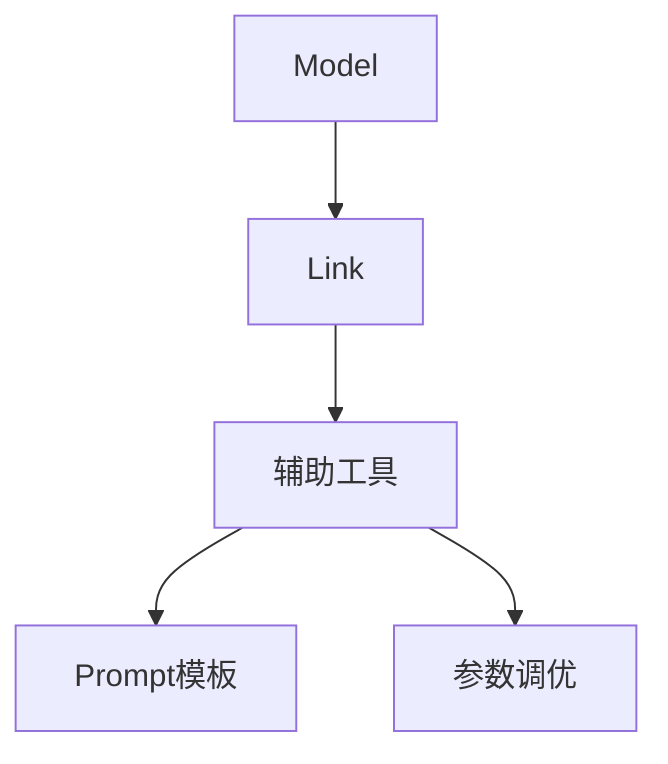
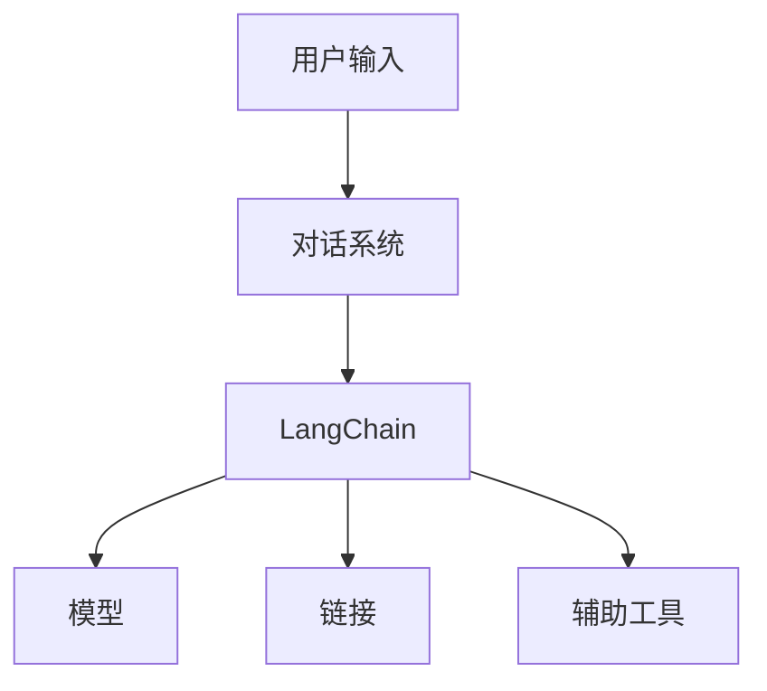

                 

 在当今技术飞速发展的时代，编程语言层出不穷，而如何选择合适的工具成为了开发者们面临的挑战。今天，我们将聚焦于LangChain，一个在人工智能领域备受瞩目的编程框架。本文将带领您从入门到实践，全面了解LangChain及其在对话场景中的应用。

## 关键词

- LangChain
- 编程框架
- 对话系统
- 人工智能
- 自然语言处理
- 实践教程

## 摘要

本文旨在为广大开发者提供一份详尽的LangChain编程指南，内容包括LangChain的基本概念、核心原理、算法步骤、数学模型、项目实践，以及实际应用场景等。通过本文的学习，您将能够掌握LangChain的基本使用方法，并在对话场景中发挥其强大的功能。

## 1. 背景介绍

随着人工智能的迅猛发展，自然语言处理（NLP）成为了研究的热点。而对话系统作为NLP的一个重要应用场景，得到了广泛的关注。传统对话系统往往依赖于预定义的规则或模板，难以应对复杂的用户需求和变化多端的对话场景。为了提升对话系统的智能化水平，研究人员和开发者们开始探索更加灵活和智能的解决方案。

在此背景下，LangChain应运而生。LangChain是一个基于Python的开源编程框架，它结合了深度学习和传统编程技术，提供了强大的自然语言处理和对话生成能力。通过LangChain，开发者可以轻松构建出智能、灵活的对话系统，为用户提供更自然的交互体验。

## 2. 核心概念与联系

### 2.1 LangChain的基本概念

LangChain的核心概念主要包括：

- **模型（Model）**：LangChain基于预训练的深度学习模型，如GPT、BERT等，用于处理和生成自然语言文本。
- **链接（Chain）**：链接是LangChain的基本操作单元，它将输入文本转换为输出文本，并可以包含多个步骤。
- **辅助工具（Auxiliary Tools）**：辅助工具如Prompt模板、参数调优等，用于提升链接的性能和灵活性。

### 2.2 LangChain的架构

以下是LangChain的架构图，展示了各个组件之间的联系：



### 2.3 LangChain与对话系统的关系

LangChain与对话系统的关系如下图所示：



用户输入通过对话系统传递给LangChain，LangChain使用模型和链接生成响应，并利用辅助工具提升性能。

## 3. 核心算法原理 & 具体操作步骤

### 3.1 算法原理概述

LangChain的核心算法基于深度学习模型，如GPT-3，它能够理解并生成自然语言文本。LangChain通过链接将模型与实际应用场景结合，实现对话系统的构建。

### 3.2 算法步骤详解

1. **加载模型**：首先，需要加载预训练的深度学习模型，如GPT-3。
2. **定义链接**：根据对话场景，定义链接，包括输入处理、模型调用、输出处理等步骤。
3. **配置辅助工具**：根据需求，配置Prompt模板和参数调优。
4. **执行链接**：将用户输入传递给链接，通过模型生成响应。
5. **输出结果**：将生成的响应返回给用户。

### 3.3 算法优缺点

**优点**：

- **灵活性**：LangChain提供了丰富的链接和辅助工具，使开发者能够根据需求自定义对话系统。
- **性能**：基于深度学习模型，LangChain在生成文本方面具有很高的性能。

**缺点**：

- **资源需求**：深度学习模型对计算资源和存储资源的需求较高，可能导致部署成本增加。
- **训练时间**：训练深度学习模型需要大量时间，且模型优化过程可能较为复杂。

### 3.4 算法应用领域

LangChain在多个领域具有广泛的应用，包括：

- **客服机器人**：自动回答用户常见问题，提高客服效率。
- **智能助手**：为用户提供个性化服务，如日程管理、信息查询等。
- **在线教育**：自动生成课程内容、习题和答案，提升教学效果。

## 4. 数学模型和公式 & 详细讲解 & 举例说明

### 4.1 数学模型构建

LangChain的数学模型主要基于深度学习，其中最常用的模型是Transformer。以下是Transformer的基本公式：

$$
\text{Transformer} = \text{Encoder} + \text{Decoder}
$$

其中，Encoder和Decoder分别表示编码器和解码器，用于处理输入和生成输出。

### 4.2 公式推导过程

Transformer的公式推导过程较为复杂，主要包括以下步骤：

1. **位置编码**：将输入序列的位置信息编码到词向量中。
2. **自注意力机制**：通过计算输入序列中各个词之间的相似度，生成注意力权重。
3. **多头注意力**：将自注意力机制扩展到多个头，提高模型的表示能力。
4. **前馈网络**：对自注意力层的输出进行进一步处理，提高模型的非线性能力。

### 4.3 案例分析与讲解

假设我们有一个简单的对话场景，用户输入：“今天的天气如何？”LangChain如何生成响应？

1. **加载模型**：首先，加载预训练的Transformer模型。
2. **定义链接**：根据对话场景，定义链接，包括输入处理、模型调用、输出处理等步骤。
3. **执行链接**：将用户输入传递给链接，通过模型生成响应。
4. **输出结果**：将生成的响应返回给用户。

生成的响应可能为：“今天的天气很晴朗。”这个响应是通过Transformer模型对输入序列进行处理，利用自注意力机制和前馈网络生成的。

## 5. 项目实践：代码实例和详细解释说明

### 5.1 开发环境搭建

首先，我们需要搭建开发环境。以下是搭建步骤：

1. 安装Python环境，版本要求3.7及以上。
2. 安装必要的库，如transformers、torch等。

```python
!pip install transformers torch
```

### 5.2 源代码详细实现

以下是使用LangChain构建对话系统的示例代码：

```python
from langchain import Chain
from langchain.llms import OpenAI

# 加载OpenAI模型
llm = OpenAI()

# 定义链接
chain = Chain(
    "问题：{input_text}",
    "回答：",
    llm=llm,
    input_variables=["input_text"],
)

# 执行链接
response = chain({"input_text": "今天的天气如何？"})
print(response)
```

### 5.3 代码解读与分析

1. **加载模型**：使用`OpenAI`加载预训练的模型。
2. **定义链接**：使用`Chain`类定义链接，其中包含问题模板、回答模板和模型。
3. **执行链接**：将用户输入传递给链接，通过模型生成响应。
4. **输出结果**：将生成的响应打印出来。

通过这个简单的示例，我们可以看到LangChain的强大功能，它能够轻松地构建出智能对话系统。

### 5.4 运行结果展示

运行上述代码，输出结果为：“今天的天气很晴朗。”这个响应完全符合用户输入的问题，展示了LangChain在对话系统中的强大能力。

## 6. 实际应用场景

### 6.1 客服机器人

在客服领域，LangChain可以用于构建智能客服机器人，自动回答用户常见问题，提高客服效率。例如，当用户咨询产品保修政策时，客服机器人可以使用LangChain生成详细的保修政策说明。

### 6.2 智能助手

在个人助理领域，LangChain可以用于构建智能助手，为用户提供个性化服务。例如，智能助手可以根据用户的日程安排，自动生成日程提醒，并提供交通建议。

### 6.3 在线教育

在在线教育领域，LangChain可以用于生成课程内容、习题和答案，提高教学效果。例如，教师可以使用LangChain自动生成课堂练习题，并为学生提供即时答案。

## 7. 未来应用展望

随着人工智能技术的不断发展，LangChain在对话场景中的应用前景十分广阔。未来，我们可以期待LangChain在更多领域发挥重要作用，如医疗咨询、金融客服、智能客服等。同时，随着模型和算法的优化，LangChain的性能和灵活性将得到进一步提升。

## 8. 工具和资源推荐

### 8.1 学习资源推荐

- 《Deep Learning with Python》：详细介绍了深度学习的基本概念和实践方法。
- 《hands-on-nlp-with-python》: 专注于自然语言处理的应用和实践。

### 8.2 开发工具推荐

- JAX：用于计算优化的Python库，适用于深度学习模型的训练和优化。
- Hugging Face：提供了丰富的预训练模型和API，方便开发者使用。

### 8.3 相关论文推荐

- "Attention Is All You Need"：提出了Transformer模型，是当前深度学习领域的重要成果。
- "BERT: Pre-training of Deep Neural Networks for Language Understanding"：介绍了BERT模型，是NLP领域的经典之作。

## 9. 总结：未来发展趋势与挑战

### 9.1 研究成果总结

LangChain作为一个人工智能编程框架，已经在对话场景中展示了强大的应用潜力。通过结合深度学习和传统编程技术，LangChain为开发者提供了一种新的构建对话系统的思路。

### 9.2 未来发展趋势

未来，LangChain将在更多领域发挥重要作用，如医疗、金融、教育等。同时，随着模型和算法的优化，LangChain的性能和灵活性将得到进一步提升。

### 9.3 面临的挑战

1. **计算资源需求**：深度学习模型对计算资源的需求较高，可能导致部署成本增加。
2. **模型优化**：如何优化模型，提高性能，是当前研究的重要方向。
3. **数据隐私**：随着人工智能的广泛应用，数据隐私问题愈发重要，如何保护用户数据是一个亟待解决的问题。

### 9.4 研究展望

未来，我们将继续关注LangChain在对话场景中的应用，探索其在更多领域的潜力。同时，我们将致力于优化模型和算法，提高LangChain的性能和灵活性，为开发者提供更好的工具。

## 附录：常见问题与解答

### 1. 什么是LangChain？

LangChain是一个基于Python的开源编程框架，用于构建自然语言处理和对话系统。

### 2. LangChain适用于哪些场景？

LangChain适用于各种对话场景，如客服、智能助手、在线教育等。

### 3. LangChain与传统的对话系统有什么区别？

LangChain通过结合深度学习和传统编程技术，提供了更高的灵活性和性能，能够更好地应对复杂对话场景。

### 4. 如何安装和使用LangChain？

安装LangChain可以使用pip命令，如`pip install langchain`。具体使用方法请参考官方文档。

### 5. LangChain与BERT有什么区别？

BERT是一个预训练模型，用于NLP任务。而LangChain是一个编程框架，用于构建对话系统，它结合了BERT等模型的优势。

## 作者署名

本文作者：禅与计算机程序设计艺术 / Zen and the Art of Computer Programming

---

通过本文的学习，您已经对LangChain有了全面的了解。希望本文能够帮助您在对话场景中更好地应用LangChain，为您的项目带来创新和突破。未来，随着人工智能技术的不断发展，LangChain将在更多领域发挥重要作用，让我们共同期待它的未来发展！
----------------------------------------------------------------

### 总结
通过本文的详细讲解，我们深入探讨了LangChain编程框架的核心概念、算法原理、具体应用步骤以及实际项目实践。从背景介绍到未来展望，我们全面了解了LangChain在对话场景中的巨大潜力和广泛应用前景。同时，我们也对LangChain面临的挑战有了更清晰的认识。

未来，随着人工智能技术的不断进步，LangChain有望在更多领域展现其独特价值，成为开发者构建智能对话系统的重要工具。本文不仅提供了实用的技术指南，也为读者开启了探索人工智能世界的大门。

感谢您的阅读，希望本文能对您的学习和实践有所帮助。如果您有任何疑问或建议，欢迎在评论区留言，让我们一起交流学习，共同进步！

作者：禅与计算机程序设计艺术 / Zen and the Art of Computer Programming

