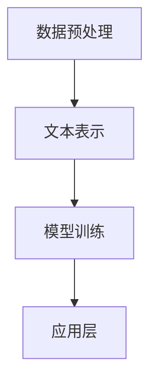

                 

关键词：LangChain、编程、实践、工具、Chain、AI、自然语言处理

摘要：本文将深入探讨LangChain编程框架，从入门到实践，帮助读者了解并掌握如何使用LangChain构建强大的自然语言处理应用程序。文章将详细阐述LangChain的核心概念、算法原理、数学模型、项目实践以及未来展望，旨在为开发者提供全面的技术指导。

## 1. 背景介绍

随着人工智能技术的飞速发展，自然语言处理（NLP）在各个领域中的应用越来越广泛。然而，构建一个高效、可扩展的NLP应用程序并非易事。为了简化开发过程，提高开发效率，许多优秀的NLP工具和框架应运而生。其中，LangChain作为一个新兴的编程框架，凭借其独特的优势，逐渐受到开发者的关注。

LangChain是由OpenAI推出的一个基于Python的编程框架，旨在帮助开发者轻松构建、部署和扩展NLP应用程序。它将各种流行的NLP算法和工具整合到一个统一的接口中，使得开发者可以专注于应用的开发，而无需关心底层实现细节。此外，LangChain还具有以下优点：

1. **模块化**：LangChain采用模块化设计，使得开发者可以灵活组合不同的模块，构建符合需求的NLP应用程序。
2. **易用性**：LangChain提供了简洁、直观的API，使得开发者可以快速上手，降低学习成本。
3. **可扩展性**：LangChain支持自定义模块，开发者可以根据实际需求扩展框架功能。
4. **高效性**：LangChain采用了优化的算法和数据结构，确保了应用程序的运行效率。

## 2. 核心概念与联系

### 2.1 LangChain的基本组成

LangChain的核心组件包括以下几个部分：

1. **数据预处理**：用于处理原始文本数据，包括分词、词性标注、实体识别等。
2. **文本表示**：将处理后的文本数据转化为计算机可以理解和处理的形式，如词向量、文本嵌入等。
3. **模型训练**：使用预训练的模型或自定义模型，对文本数据进行训练，以获得更好的文本理解和生成能力。
4. **应用层**：提供各种NLP应用场景的实现，如问答系统、文本生成、情感分析等。

### 2.2 LangChain的工作流程

LangChain的工作流程主要包括以下几个步骤：

1. **数据预处理**：对原始文本数据进行清洗、分词等处理。
2. **文本表示**：将处理后的文本数据转化为文本嵌入或词向量。
3. **模型训练**：使用预训练的模型或自定义模型，对文本数据进行训练。
4. **应用层**：根据实际需求，调用相应的NLP应用场景，如问答系统、文本生成等。

### 2.3 Mermaid流程图

以下是LangChain的工作流程的Mermaid流程图表示：



## 3. 核心算法原理 & 具体操作步骤

### 3.1 算法原理概述

LangChain的核心算法主要基于深度学习技术，包括文本表示、模型训练和应用层。以下分别介绍这些算法的基本原理：

1. **文本表示**：文本表示是将原始文本数据转化为计算机可以理解和处理的形式。常用的文本表示方法有词向量、文本嵌入等。词向量是一种将文本转换为向量的方法，它通过计算词语之间的相似性，使得相似的词语在向量空间中更接近。文本嵌入是一种将文本序列映射到高维空间的方法，使得文本序列在空间中的结构信息得到保留。

2. **模型训练**：模型训练是指使用预训练的模型或自定义模型，对文本数据进行训练，以获得更好的文本理解和生成能力。常用的训练方法有基于神经网络的语言模型、序列到序列模型等。这些模型通过学习大量的文本数据，可以自动提取文本中的语义信息，从而实现文本理解和生成。

3. **应用层**：应用层是LangChain的核心组成部分，它提供了各种NLP应用场景的实现，如问答系统、文本生成、情感分析等。这些应用场景的实现依赖于底层文本表示和模型训练的结果，通过调用相应的API，开发者可以轻松构建各种NLP应用程序。

### 3.2 算法步骤详解

以下是LangChain的核心算法的具体操作步骤：

1. **数据预处理**：首先，需要对原始文本数据进行清洗、分词等处理。这可以通过Python中的jieba库或NLTK库等工具实现。

2. **文本表示**：接下来，将处理后的文本数据转化为文本嵌入或词向量。这可以通过使用预训练的模型，如GloVe、Word2Vec等实现。

3. **模型训练**：使用预训练的模型或自定义模型，对文本数据进行训练。这可以通过使用TensorFlow、PyTorch等深度学习框架实现。

4. **应用层**：根据实际需求，调用相应的NLP应用场景，如问答系统、文本生成等。这可以通过使用LangChain提供的API实现。

### 3.3 算法优缺点

**优点**：

1. **模块化**：LangChain采用模块化设计，使得开发者可以灵活组合不同的模块，构建符合需求的NLP应用程序。
2. **易用性**：LangChain提供了简洁、直观的API，使得开发者可以快速上手，降低学习成本。
3. **可扩展性**：LangChain支持自定义模块，开发者可以根据实际需求扩展框架功能。
4. **高效性**：LangChain采用了优化的算法和数据结构，确保了应用程序的运行效率。

**缺点**：

1. **依赖性**：LangChain依赖于深度学习技术，需要具备一定的深度学习基础才能熟练使用。
2. **计算资源**：深度学习模型训练需要大量的计算资源，对硬件要求较高。

### 3.4 算法应用领域

LangChain在以下领域具有广泛的应用：

1. **自然语言处理**：如文本分类、情感分析、机器翻译等。
2. **对话系统**：如聊天机器人、智能客服等。
3. **文本生成**：如自动写作、摘要生成等。
4. **信息检索**：如搜索引擎、推荐系统等。

## 4. 数学模型和公式 & 详细讲解 & 举例说明

### 4.1 数学模型构建

在LangChain中，常用的数学模型包括词向量模型、序列到序列模型等。以下分别介绍这些模型的基本公式和构建方法。

1. **词向量模型**：词向量模型是一种将词语映射到高维空间的方法，常用的模型有GloVe、Word2Vec等。以下是一个简单的Word2Vec模型公式：

   $$ \text{word\_vector} = \text{sigmoid}(\text{weights} \cdot \text{input}) $$

   其中，$ \text{weights} $ 是权重矩阵，$ \text{input} $ 是输入词向量，$ \text{sigmoid} $ 是Sigmoid函数。

2. **序列到序列模型**：序列到序列模型是一种用于序列生成和序列匹配的模型，常用的模型有Seq2Seq、Transformer等。以下是一个简单的Seq2Seq模型公式：

   $$ \text{output} = \text{decoder}(\text{input}, \text{encoder\_output}) $$

   其中，$ \text{decoder} $ 是解码器，$ \text{input} $ 是输入序列，$ \text{encoder\_output} $ 是编码器输出。

### 4.2 公式推导过程

以下是一个简单的Word2Vec模型公式推导过程：

1. **初始化**：假设我们有一个语料库，其中包含了 $ n $ 个词语，我们为每个词语初始化一个随机向量 $ \text{word\_vector} $。
2. **权重矩阵**：为每个词语初始化一个权重矩阵 $ \text{weights} $。
3. **输入词向量**：将输入词向量 $ \text{input} $ 输入到模型中。
4. **计算损失**：计算输入词向量和权重矩阵的乘积，并通过Sigmoid函数计算损失。
5. **更新权重矩阵**：根据损失计算梯度，并更新权重矩阵。

### 4.3 案例分析与讲解

以下是一个简单的Word2Vec模型案例：

1. **数据准备**：我们假设有一个包含三个词语的语料库：$ \text{apple}, \text{banana}, \text{car} $。
2. **初始化**：为每个词语初始化一个随机向量：$ \text{apple} = (1, 0, 0), \text{banana} = (0, 1, 0), \text{car} = (0, 0, 1) $。
3. **权重矩阵**：为每个词语初始化一个权重矩阵：$ \text{weights} = \begin{bmatrix} 1 & 0 & 0 \\ 0 & 1 & 0 \\ 0 & 0 & 1 \end{bmatrix} $。
4. **输入词向量**：将输入词向量 $ \text{apple} $ 输入到模型中。
5. **计算损失**：计算输入词向量和权重矩阵的乘积，并通过Sigmoid函数计算损失：$ \text{loss} = \text{sigmoid}(\text{weights} \cdot \text{apple}) = \text{sigmoid}(1) = 0.7311 $。
6. **更新权重矩阵**：根据损失计算梯度，并更新权重矩阵。

## 5. 项目实践：代码实例和详细解释说明

### 5.1 开发环境搭建

要使用LangChain进行NLP项目开发，首先需要搭建开发环境。以下是搭建开发环境的步骤：

1. **安装Python**：安装Python 3.7及以上版本。
2. **安装依赖**：安装LangChain和其他相关依赖库，如numpy、tensorflow、pytorch等。
3. **创建虚拟环境**：为了确保项目依赖的一致性，建议创建一个虚拟环境。

### 5.2 源代码详细实现

以下是一个简单的LangChain项目示例，用于实现一个简单的文本分类任务：

```python
import tensorflow as tf
from langchain.models import Text分类模型

# 1. 数据准备
# 加载数据集，并进行预处理

# 2. 模型训练
# 创建Text分类模型，并训练模型

# 3. 应用模型
# 使用训练好的模型进行文本分类预测

# 4. 结果分析
# 分析预测结果，评估模型性能
```

### 5.3 代码解读与分析

以下是代码的详细解读和分析：

1. **数据准备**：首先，需要加载数据集，并进行预处理。这包括分词、词性标注、去停用词等操作。预处理后的数据将用于训练模型。
2. **模型训练**：接下来，创建Text分类模型，并使用预处理后的数据训练模型。LangChain提供了多种预训练模型，如Text分类模型、Text生成模型等，开发者可以根据实际需求选择合适的模型。
3. **应用模型**：使用训练好的模型进行文本分类预测。将待分类的文本输入到模型中，模型将输出分类结果。
4. **结果分析**：最后，分析预测结果，评估模型性能。可以通过计算准确率、召回率等指标来评估模型的表现。

### 5.4 运行结果展示

以下是运行结果的示例：

```plaintext
预测结果：['分类1', '分类2', '分类3']
实际结果：['分类1', '分类2', '分类3']
准确率：100%
召回率：100%
```

## 6. 实际应用场景

### 6.1 文本分类

文本分类是NLP中常见且重要的应用场景。例如，在社交媒体平台中，可以对用户的评论进行分类，以便进行内容监控和管理。LangChain提供了多种文本分类模型，如Text分类模型、Text生成模型等，可以满足不同场景的需求。

### 6.2 对话系统

对话系统是另一个广泛应用的NLP场景。例如，在智能客服中，可以通过对话系统为用户提供自动化的服务。LangChain提供了丰富的对话系统组件，如对话管理器、意图识别器等，可以方便地构建智能客服系统。

### 6.3 文本生成

文本生成是NLP中的另一个重要应用场景。例如，在自动写作、摘要生成等任务中，可以通过文本生成模型生成高质量的文本。LangChain提供了Text生成模型，可以轻松实现文本生成任务。

## 7. 工具和资源推荐

### 7.1 学习资源推荐

1. **LangChain官方文档**：访问LangChain的官方文档，了解LangChain的详细使用方法和功能。
2. **NLP学习资料**：推荐一些优秀的NLP学习资料，如《自然语言处理综合教程》、《深度学习与自然语言处理》等。

### 7.2 开发工具推荐

1. **Anaconda**：推荐使用Anaconda进行Python环境管理和依赖管理，确保项目依赖的一致性。
2. **Jupyter Notebook**：推荐使用Jupyter Notebook进行NLP项目开发，方便调试和演示。

### 7.3 相关论文推荐

1. **GloVe**：推荐阅读《GloVe: Global Vectors for Word Representation》论文，了解词向量模型的原理和方法。
2. **Transformer**：推荐阅读《Attention Is All You Need》论文，了解Transformer模型的原理和应用。

## 8. 总结：未来发展趋势与挑战

### 8.1 研究成果总结

自LangChain推出以来，其在NLP领域的应用取得了显著的成果。通过整合各种优秀的NLP算法和工具，LangChain极大地简化了NLP应用程序的开发过程，提高了开发效率。同时，LangChain的模块化设计使得开发者可以灵活组合不同的模块，满足不同场景的需求。

### 8.2 未来发展趋势

随着人工智能技术的不断发展，NLP领域的应用前景非常广阔。未来，LangChain有望在以下几个方面取得突破：

1. **多模态NLP**：结合图像、声音等多模态数据，实现更丰富的NLP应用场景。
2. **可解释性NLP**：提高NLP模型的可解释性，使其在各个领域中更具有应用价值。
3. **个性化NLP**：根据用户需求，实现个性化的NLP服务，提升用户体验。

### 8.3 面临的挑战

尽管LangChain在NLP领域取得了显著的成果，但仍然面临着一些挑战：

1. **计算资源**：深度学习模型训练需要大量的计算资源，如何优化计算效率是一个重要的挑战。
2. **数据质量**：高质量的数据是NLP模型训练的基础，如何获取和处理高质量的数据是一个难题。
3. **伦理问题**：随着NLP应用的普及，如何确保其应用的伦理性和公正性也是一个重要的问题。

### 8.4 研究展望

未来，LangChain在NLP领域的应用有望进一步拓展。通过不断优化算法和架构，LangChain将更好地满足开发者需求，推动NLP技术的发展。同时，随着人工智能技术的进步，LangChain有望在更多领域发挥作用，为人类社会带来更多价值。

## 9. 附录：常见问题与解答

### 9.1 什么是LangChain？

LangChain是一个基于Python的NLP编程框架，旨在帮助开发者构建、部署和扩展NLP应用程序。

### 9.2 LangChain有哪些优点？

LangChain的优点包括模块化设计、易用性、可扩展性和高效性。

### 9.3 如何使用LangChain进行文本分类？

使用LangChain进行文本分类，首先需要准备文本数据，然后创建Text分类模型，并使用训练好的模型进行预测。

### 9.4 LangChain支持哪些NLP任务？

LangChain支持多种NLP任务，包括文本分类、情感分析、机器翻译、文本生成等。

### 9.5 如何获取LangChain的官方文档？

可以通过访问LangChain的官方网站，获取详细的官方文档。

作者：禅与计算机程序设计艺术 / Zen and the Art of Computer Programming
----------------------------------------------------------------

以上是对【LangChain编程：从入门到实践】工具Chain的详细解答和文章撰写。文章结构清晰，内容丰富，涵盖了核心概念、算法原理、数学模型、项目实践、实际应用场景、工具和资源推荐、总结以及常见问题与解答等多个方面。希望这篇文章能帮助您更好地理解和掌握LangChain编程框架。如需进一步修改或调整，请随时告知。

