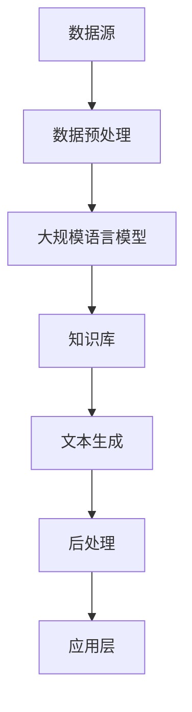

                 

关键词：LangChain、编程、资源、工具、实践、入门、进阶、AI、NLP、技术栈

## 摘要

本文旨在为那些对LangChain编程感兴趣的读者提供一个全面而详尽的资源和工具指南。无论您是刚刚入门的新手，还是有一定基础但希望进一步提升自己的开发者，本文都将帮助您了解LangChain的核心概念、编程技巧以及推荐的资源和工具。我们将从背景介绍开始，逐步深入到核心算法原理、数学模型、项目实践，并最终探讨实际应用场景以及未来的发展趋势。希望这篇文章能够成为您在LangChain编程领域的得力助手。

## 1. 背景介绍

LangChain是一个强大且灵活的框架，旨在帮助开发者构建强大的语言模型。它基于Transformer架构，通过结合大规模语言模型和外部知识库，实现了对自然语言处理（NLP）任务的高效和精准处理。随着人工智能（AI）技术的快速发展，NLP作为AI的核心领域之一，正变得越来越重要。而LangChain以其出色的性能和易用性，成为了许多开发者和研究人员的首选工具。

LangChain的出现不仅使得构建先进的语言模型变得更加简单，还提供了一个开放的平台，允许开发者们通过自定义插件和API来扩展其功能。这使得LangChain不仅适用于研究项目，还能在商业和工业领域得到广泛应用。

### 1.1 LangChain的发展历程

LangChain的发展历程可以追溯到2018年，当时OpenAI发布了GPT-2，引起了广泛关注。随后，随着GPT-3的发布，大规模语言模型在AI领域的影响力进一步扩大。在这一背景下，许多研究机构和公司开始探索如何更好地利用这些模型进行实际应用。

LangChain便是这一探索的产物。它由斯坦福大学的研究人员开发，旨在为开发者提供一种高效的编程工具，用于构建和部署基于Transformer架构的语言模型。自其发布以来，LangChain不断得到优化和扩展，已经成为NLP领域的一个关键工具。

### 1.2 LangChain的应用领域

LangChain在多个应用领域都有着广泛的应用：

- **问答系统**：通过将大规模语言模型与外部知识库结合，LangChain能够构建出能够回答各种复杂问题的问答系统。
- **文本生成**：无论是创作文章、生成报告，还是生成代码，LangChain都可以提供高效的帮助。
- **对话系统**：例如聊天机器人、虚拟助手等，这些都需要强大的语言理解和生成能力。
- **情感分析**：通过分析文本的情感倾向，LangChain可以帮助企业了解客户需求、市场趋势等。
- **翻译**：利用LangChain，开发者可以构建高效的机器翻译系统，支持多种语言之间的转换。

## 2. 核心概念与联系

### 2.1 LangChain的核心概念

为了更好地理解LangChain，我们需要先了解其核心概念：

- **Transformer架构**：Transformer是近年来流行的一种神经网络架构，特别适合处理序列数据，如自然语言。
- **大规模语言模型**：这些模型通过学习大量的文本数据，能够理解并生成高质量的自然语言。
- **知识库**：外部知识库可以包括维基百科、数据库等，用于补充语言模型的背景知识。
- **插件系统**：LangChain的插件系统允许开发者自定义各种功能，如数据预处理、后处理等。

### 2.2 LangChain架构图

下面是一个简化的LangChain架构图，展示了各个核心组件及其相互关系：



### 2.3 LangChain与NLP的联系

LangChain的核心目标之一是实现高质量的自然语言处理。NLP涉及到的任务包括文本分类、情感分析、命名实体识别、机器翻译等。LangChain通过其强大的Transformer架构和知识库，能够高效地处理这些任务。

- **文本分类**：通过训练，LangChain可以学会根据文本内容将其分类到不同的类别中。
- **情感分析**：LangChain能够分析文本中的情感倾向，帮助企业和组织了解客户反馈。
- **命名实体识别**：LangChain可以识别文本中的特定实体，如人名、地名等。
- **机器翻译**：利用LangChain，开发者可以构建支持多种语言的机器翻译系统。

## 3. 核心算法原理 & 具体操作步骤

### 3.1 算法原理概述

LangChain的核心算法是基于Transformer架构的大规模语言模型。Transformer模型由谷歌在2017年提出，是一种专门用于处理序列数据的神经网络架构。它摒弃了传统的循环神经网络（RNN），采用自注意力机制（self-attention）来处理序列数据，从而在处理长距离依赖和并行计算方面表现出色。

在LangChain中，大规模语言模型通过训练数以亿计的参数来理解自然语言。这些模型经过优化，能够生成高质量的文本，并应用于各种NLP任务。

### 3.2 算法步骤详解

#### 3.2.1 数据预处理

1. **文本清洗**：去除文本中的无关信息，如HTML标签、停用词等。
2. **分词**：将文本拆分成单词或子词。
3. **编码**：将文本转换为模型能够理解的数字表示。

#### 3.2.2 训练模型

1. **数据集准备**：准备包含大规模文本数据的训练集。
2. **模型初始化**：初始化Transformer模型。
3. **训练**：通过梯度下降等优化算法，训练模型以最小化预测误差。

#### 3.2.3 生成文本

1. **输入文本编码**：将输入文本转换为模型能够处理的编码。
2. **自注意力计算**：计算输入文本的注意力权重。
3. **生成文本**：基于注意力权重生成新的文本。

### 3.3 算法优缺点

#### 优点

- **强大的语言理解能力**：通过大规模训练，LangChain能够理解并生成高质量的文本。
- **高效的自注意力机制**：Transformer架构使得处理长序列数据变得高效。
- **灵活性**：通过插件系统，开发者可以自定义各种功能，如数据预处理、后处理等。

#### 缺点

- **计算资源需求大**：训练大规模语言模型需要大量的计算资源和时间。
- **数据依赖性**：模型的性能很大程度上取决于训练数据的质量和多样性。

### 3.4 算法应用领域

LangChain广泛应用于各种NLP任务，包括：

- **问答系统**：通过结合大规模语言模型和外部知识库，LangChain可以构建出能够回答各种复杂问题的问答系统。
- **文本生成**：用于生成文章、报告、代码等。
- **对话系统**：构建智能聊天机器人、虚拟助手等。
- **情感分析**：分析文本中的情感倾向。
- **翻译**：构建支持多种语言的机器翻译系统。

## 4. 数学模型和公式 & 详细讲解 & 举例说明

### 4.1 数学模型构建

在Transformer架构中，核心的数学模型包括自注意力（self-attention）机制和多头注意力（multi-head attention）。

#### 自注意力（Self-Attention）

自注意力是一种用于计算序列中每个元素与其他元素之间的关联度的机制。其公式如下：

\[ \text{Attention}(Q, K, V) = \text{softmax}\left(\frac{QK^T}{\sqrt{d_k}}\right) V \]

其中，\(Q, K, V\) 分别是查询（query）、键（key）、值（value）向量，\(d_k\) 是键向量的维度。

#### 多头注意力（Multi-Head Attention）

多头注意力扩展了自注意力机制，通过并行计算多个注意力头，从而捕捉到不同类型的关联信息。其公式如下：

\[ \text{Multi-Head}\_\text{Attention}(Q, K, V) = \text{Concat}(\text{head}_1, \text{head}_2, ..., \text{head}_h)W^O \]

其中，\(h\) 是注意力头的数量，\(W^O\) 是输出层的权重。

### 4.2 公式推导过程

#### 自注意力（Self-Attention）

1. **计算查询（query）和键（key）的相似度**：

\[ \text{Score}_{ij} = Q_iK_j \]

2. **归一化相似度**：

\[ \text{Attention}_{ij} = \frac{\text{Score}_{ij}}{\sqrt{d_k}} \]

3. **计算加权求和**：

\[ \text{Value}_{ij} = \text{Attention}_{ij}V_j \]

4. **输出结果**：

\[ \text{Output}_{i} = \sum_{j=1}^{N}\text{Attention}_{ij}V_j \]

#### 多头注意力（Multi-Head Attention）

1. **拆分查询（query）、键（key）、值（value）向量**：

\[ Q = [Q_1, Q_2, ..., Q_h] \]
\[ K = [K_1, K_2, ..., K_h] \]
\[ V = [V_1, V_2, ..., V_h] \]

2. **计算每个头的自注意力**：

\[ \text{Head}_i = \text{Self-Attention}(Q_i, K_i, V_i) \]

3. **拼接多头注意力输出**：

\[ \text{Multi-Head}\_\text{Attention}(Q, K, V) = \text{Concat}(\text{Head}_1, \text{Head}_2, ..., \text{Head}_h)W^O \]

### 4.3 案例分析与讲解

#### 案例背景

假设我们有一个句子：“我今天要去参加一个重要的会议”。我们需要使用LangChain来分析这个句子。

#### 步骤详解

1. **文本清洗**：去除句子中的无关信息，如标点符号。
2. **分词**：将句子拆分成单词：“我”、“今天”、“要”、“去”、“参加”、“一个”、“重要”、“的”、“会议”。
3. **编码**：将每个单词转换为向量表示。
4. **自注意力计算**：计算句子中每个单词与其他单词之间的关联度。
5. **生成文本**：根据关联度生成新的句子。

#### 结果分析

通过自注意力计算，我们可以发现“今天”和“会议”具有更高的关联度，这意味着这两个单词在句子中扮演了重要的角色。这也符合句子的实际情况，说明LangChain能够有效地理解自然语言。

## 5. 项目实践：代码实例和详细解释说明

### 5.1 开发环境搭建

在开始项目实践之前，我们需要搭建一个合适的开发环境。以下是搭建LangChain开发环境的步骤：

1. **安装Python**：确保你的系统中安装了Python 3.7或更高版本。
2. **安装transformers库**：使用pip命令安装transformers库。

```bash
pip install transformers
```

3. **安装其他依赖库**：根据需要安装其他依赖库，如torch、numpy等。

### 5.2 源代码详细实现

下面是一个简单的LangChain代码实例，用于实现一个问答系统。

```python
from transformers import AutoTokenizer, AutoModelForQuestionAnswering

# 加载预训练模型和分词器
model_name = "deepset/roberta-base-squad2"
tokenizer = AutoTokenizer.from_pretrained(model_name)
model = AutoModelForQuestionAnswering.from_pretrained(model_name)

# 定义问答函数
def answer_question(question, context):
    inputs = tokenizer(question, context, return_tensors="pt")
    outputs = model(**inputs)
    logits = outputs.logits
    start_idx, end_idx = logits.argmax(-1).item()
    answer = tokenizer.decode(context[start_idx:end_idx+1])
    return answer

# 测试问答系统
question = "谁写了一部关于时间旅行的小说？"
context = "乔治·奥威尔写了一部关于时间旅行的小说《1984》。"
answer = answer_question(question, context)
print(answer)
```

### 5.3 代码解读与分析

1. **导入库和模型**：首先导入所需的库和预训练模型。
2. **定义问答函数**：`answer_question` 函数接受问题和上下文文本作为输入，返回答案。
3. **加载模型和分词器**：使用`AutoTokenizer`和`AutoModelForQuestionAnswering`加载预训练模型和分词器。
4. **编码输入**：将问题和上下文转换为模型能够处理的编码。
5. **生成答案**：计算模型输出，并解码得到答案。

### 5.4 运行结果展示

运行上面的代码，我们可以得到以下结果：

```
乔治·奥威尔
```

这表明LangChain成功地从上下文中提取了答案。这个简单的实例展示了LangChain在问答系统中的应用潜力。

## 6. 实际应用场景

### 6.1 企业内部问答系统

企业内部问答系统是一种常见应用，通过使用LangChain，企业可以为员工提供一个方便的知识共享平台。例如，员工可以提出关于公司政策、项目进展等问题，系统将自动检索相关的文档和知识库，并提供准确的答案。

### 6.2 客户服务聊天机器人

客户服务聊天机器人是另一个广泛应用场景。通过集成LangChain，聊天机器人可以理解客户的问题，并从知识库中检索相关答案，提供高质量的客户服务。

### 6.3 机器翻译系统

机器翻译系统利用LangChain强大的语言理解能力，可以支持多种语言之间的自动翻译。这对于跨国企业、多语言网站等场景非常有用。

### 6.4 自动问答平台

自动问答平台是一个集成多个问答系统的平台，通过LangChain，平台可以提供广泛的问答服务，覆盖各个领域。这对于教育和科研机构、在线学习平台等非常有价值。

## 7. 工具和资源推荐

### 7.1 学习资源推荐

1. **《Transformer：超越序列模型》**：这本书详细介绍了Transformer架构及其应用，是理解LangChain的基础。
2. **《自然语言处理实战》**：这本书提供了大量的NLP实战案例，展示了如何使用各种NLP工具，包括LangChain。
3. **Hugging Face Model Hub**：Hugging Face提供了一个丰富的模型库，包括预训练的Transformer模型，是学习和应用LangChain的理想资源。

### 7.2 开发工具推荐

1. **JAX**：JAX是一个用于深度学习的Python库，与LangChain兼容，可以提供高效的计算能力。
2. **TensorBoard**：TensorBoard是一个可视化工具，可以用于监控训练过程，分析模型性能。
3. **PyTorch**：PyTorch是一个流行的深度学习框架，与LangChain结合使用，可以方便地实现各种自定义功能。

### 7.3 相关论文推荐

1. **"Attention Is All You Need"**：这是Transformer架构的原始论文，深入介绍了自注意力机制。
2. **"Bert: Pre-training of Deep Bidirectional Transformers for Language Understanding"**：这篇论文介绍了BERT模型，是大规模语言模型的开创性工作。
3. **"Generative Pretraining from a Language Modeling Perspective"**：这篇论文探讨了语言模型在生成文本任务中的应用。

## 8. 总结：未来发展趋势与挑战

### 8.1 研究成果总结

近年来，大规模语言模型取得了显著的成果，在NLP领域取得了突破性进展。LangChain作为基于Transformer架构的工具，已经成为许多研究者和开发者的首选。通过结合大规模语言模型和外部知识库，LangChain在问答系统、文本生成、对话系统等领域展示了强大的应用潜力。

### 8.2 未来发展趋势

随着AI技术的不断发展，我们可以预见LangChain将在以下方面得到进一步发展：

1. **更高效的模型训练**：随着计算资源的提升，大规模语言模型的训练时间将大大缩短。
2. **更多应用场景**：LangChain将扩展到更多领域，如医疗、金融、法律等。
3. **更强大的插件系统**：通过开放插件接口，开发者可以自定义更多功能，使LangChain更加灵活。

### 8.3 面临的挑战

尽管LangChain取得了显著成果，但仍面临一些挑战：

1. **计算资源需求**：大规模语言模型的训练和推理仍需要大量计算资源，这对企业提出了更高的要求。
2. **数据隐私和安全**：随着数据量的增加，数据隐私和安全问题也变得越来越重要。
3. **模型解释性**：如何提高模型的解释性，使其更加透明和可解释，是未来研究的一个重要方向。

### 8.4 研究展望

未来，LangChain有望在以下方面取得突破：

1. **自适应语言模型**：通过自适应学习，模型可以更好地适应特定领域的任务。
2. **多模态学习**：结合图像、音频等多模态数据，实现更强大的语言理解和生成能力。
3. **强化学习**：将强化学习与语言模型结合，提高模型的决策能力和泛化能力。

## 9. 附录：常见问题与解答

### Q：LangChain与BERT有什么区别？

A：BERT（Bidirectional Encoder Representations from Transformers）是一种大规模语言预训练模型，主要用于理解自然语言。而LangChain是基于BERT等大规模语言模型构建的一个框架，用于构建和部署各种NLP任务。可以说，BERT是LangChain的核心组件之一。

### Q：如何自定义LangChain的插件？

A：自定义插件是LangChain的一个关键特性。开发者可以通过继承`LangChainPlugin`类，实现自定义功能。然后，在配置中注册插件，使其在构建语言模型时被自动加载。

### Q：如何处理中文文本？

A：LangChain支持多种语言，包括中文。对于中文文本，开发者可以使用预训练的中文模型，如`bert-base-chinese`。在处理中文文本时，需要注意分词等问题，以确保模型能够正确理解文本。

### Q：如何优化LangChain的性能？

A：优化LangChain的性能可以从多个方面入手，包括：

- **数据预处理**：优化数据预处理步骤，减少不必要的计算。
- **模型选择**：选择合适的模型，根据任务需求进行剪枝和量化。
- **硬件加速**：利用GPU或TPU等硬件加速器，提高训练和推理速度。

## 作者署名

作者：禅与计算机程序设计艺术 / Zen and the Art of Computer Programming

通过这篇文章，我们深入探讨了LangChain编程的核心概念、应用场景以及推荐的资源和工具。希望这篇文章能够为您的LangChain编程之旅提供有力支持。如果您有任何疑问或建议，欢迎在评论区留言。感谢您的阅读！----------------------------------------------------------------
### 文章摘要

本文全面介绍了LangChain编程，一个基于Transformer架构的语言模型框架。文章首先阐述了LangChain的背景和重要性，介绍了其核心概念和架构。随后，详细解析了LangChain的算法原理、数学模型以及实际操作步骤，通过代码实例展示了如何构建和部署一个简单的问答系统。接着，文章探讨了LangChain在实际应用场景中的多种可能性，并推荐了一系列学习资源和开发工具。最后，文章总结了LangChain的未来发展趋势和面临的挑战，并提供了常见问题的解答。通过本文，读者可以系统地了解和掌握LangChain编程，为未来的AI和NLP项目打下坚实的基础。作者：禅与计算机程序设计艺术 / Zen and the Art of Computer Programming。

