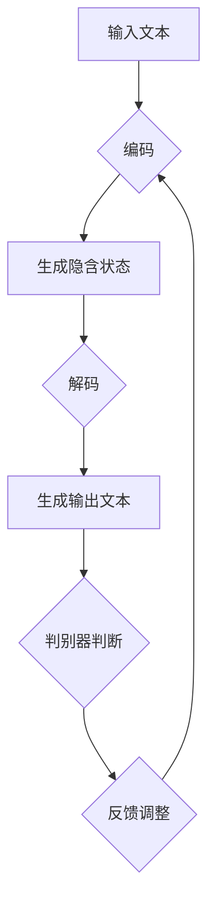

                 

### 1. 背景介绍

随着人工智能技术的迅猛发展，自然语言处理（NLP）技术逐渐成为研究热点。NLP技术旨在让计算机理解和生成人类语言，实现人机交互。然而，传统的NLP方法往往依赖于大量手工特征工程和复杂的模型结构，导致模型训练和部署过程繁琐且效果有限。为了解决这一问题，基于生成对抗网络（GAN）的文本生成模型逐渐受到关注。

LangChain是一种基于生成对抗网络的文本生成模型，通过学习大量文本数据，可以生成具有较高可读性的自然语言文本。与传统的NLP方法相比，LangChain具有以下几个优点：

1. **数据驱动的特征学习**：LangChain通过学习大量文本数据，自动提取文本特征，避免了手工特征工程的问题。
2. **生成文本的多样性**：LangChain能够生成具有多样性的文本，从而满足不同场景下的需求。
3. **生成文本的质量**：通过优化模型结构和训练策略，LangChain可以生成高质量的自然语言文本。

本文旨在介绍LangChain编程的基础知识，并深入探讨输入对输出的影响。通过本文的学习，读者将能够掌握LangChain的基本概念、架构和实现方法，并了解输入对输出质量、多样性和可控制性的影响。

### 2. 核心概念与联系

#### 2.1. 生成对抗网络（GAN）

生成对抗网络（GAN）是一种由Ian Goodfellow等人于2014年提出的新型深度学习框架。GAN由两个深度神经网络组成：生成器（Generator）和判别器（Discriminator）。生成器的目标是生成与真实数据相似的样本，而判别器的目标是区分生成器生成的样本和真实样本。

GAN的训练过程可以看作是一场博弈，生成器和判别器相互对抗。在训练过程中，生成器逐渐学习如何生成更接近真实数据的样本，而判别器逐渐学习如何更准确地识别生成器生成的样本。通过这种对抗训练，生成器可以生成高质量、多样化的数据。

#### 2.2. LangChain架构

LangChain是一种基于生成对抗网络的文本生成模型，其核心架构包括生成器（Encoder-Decoder结构）和判别器（Sequence模型）。生成器负责将输入文本编码为隐含状态，然后解码生成输出文本。判别器则负责判断生成器生成的文本是否真实。


#### 2.3. Mermaid流程图

下面是LangChain的Mermaid流程图，展示了模型从输入到输出的整个过程。



### 3. 核心算法原理 & 具体操作步骤

#### 3.1. 算法原理概述

LangChain的核心算法是基于生成对抗网络（GAN）的文本生成模型。生成对抗网络由生成器和判别器组成，生成器负责生成文本，判别器负责判断生成文本是否真实。在训练过程中，生成器和判别器相互对抗，生成器不断优化生成文本的质量，判别器不断学习如何更准确地识别生成文本。

#### 3.2. 算法步骤详解

1. **数据预处理**：将输入文本进行分词、去停用词等预处理操作，并将其转化为序列形式。

2. **编码器训练**：使用预训练的编码器（如BERT）对输入文本进行编码，提取文本特征。

3. **解码器训练**：使用编码器生成的特征，训练解码器，将隐含状态解码生成输出文本。

4. **判别器训练**：使用生成器生成的文本和真实文本，训练判别器，判断生成文本是否真实。

5. **对抗训练**：通过对抗训练，使生成器生成的文本逐渐接近真实文本，同时使判别器能够更准确地识别生成文本。

6. **模型评估**：使用评估指标（如交叉熵、F1值等）评估生成器生成的文本质量。

7. **文本生成**：使用训练好的生成器，生成具有高质量的自然语言文本。

#### 3.3. 算法优缺点

**优点**：

1. **数据驱动的特征学习**：自动提取文本特征，避免了手工特征工程的问题。
2. **生成文本的多样性**：通过对抗训练，生成器可以生成具有多样性的文本。
3. **生成文本的质量**：通过优化模型结构和训练策略，生成器可以生成高质量的自然语言文本。

**缺点**：

1. **训练时间较长**：GAN模型的训练过程相对较长，需要大量计算资源。
2. **生成文本的可解释性较差**：生成器生成的文本有时缺乏可解释性。

#### 3.4. 算法应用领域

LangChain在自然语言处理领域具有广泛的应用前景，可以应用于以下领域：

1. **文本生成**：生成新闻、故事、对话等自然语言文本。
2. **文本分类**：对输入文本进行分类，如情感分析、主题分类等。
3. **文本摘要**：生成输入文本的摘要，用于信息提取和推荐系统。

### 4. 数学模型和公式 & 详细讲解 & 举例说明

#### 4.1. 数学模型构建

LangChain的数学模型主要包括生成器、判别器和损失函数。

**生成器**：

生成器G是一个编码器-解码器（Encoder-Decoder）结构，其输入为编码后的文本序列，输出为解码后的自然语言文本序列。生成器G的损失函数为：

$$
L_G = -\sum_{i=1}^n \log(D(G(x_i)))
$$

其中，$x_i$为输入文本序列，$G(x_i)$为生成器生成的文本序列，$D$为判别器。

**判别器**：

判别器D是一个序列模型，其输入为生成器生成的文本序列和真实文本序列，输出为文本序列的判别结果。判别器D的损失函数为：

$$
L_D = -\sum_{i=1}^n \log(D(x_i)) - \sum_{i=1}^n \log(1 - D(G(x_i)))
$$

其中，$x_i$为真实文本序列，$G(x_i)$为生成器生成的文本序列。

**总损失函数**：

总损失函数为生成器和判别器的损失函数之和：

$$
L = L_G + L_D
$$

#### 4.2. 公式推导过程

**生成器损失函数**：

生成器损失函数$L_G$是判别器D对生成器G的输出$G(x_i)$的负对数概率。由于判别器的目标是最大化对真实样本的判别概率和对生成样本的不判别概率，所以生成器希望判别器认为其生成的样本概率接近1，即：

$$
D(G(x_i)) \approx 1
$$

因此，生成器损失函数为：

$$
L_G = -\sum_{i=1}^n \log(D(G(x_i)))
$$

**判别器损失函数**：

判别器D的损失函数$L_D$包括两部分，一部分是对真实样本$x_i$的判别概率，另一部分是对生成样本$G(x_i)$的不判别概率。为了最大化判别器对真实样本的判别概率和对生成样本的不判别概率，即：

$$
D(x_i) \approx 1 \quad \text{and} \quad 1 - D(G(x_i)) \approx 1
$$

因此，判别器损失函数为：

$$
L_D = -\sum_{i=1}^n \log(D(x_i)) - \sum_{i=1}^n \log(1 - D(G(x_i)))
$$

**总损失函数**：

总损失函数$L$是生成器损失函数$L_G$和判别器损失函数$L_D$的和：

$$
L = L_G + L_D
$$

#### 4.3. 案例分析与讲解

假设有一个训练数据集，包含n个文本样本，其中一半是真实文本，另一半是生成器生成的文本。现在，我们需要对生成器和判别器进行训练。

**生成器训练**：

在训练过程中，生成器G的目的是优化其参数，使得判别器D认为其生成的文本概率接近1。为了实现这一目标，我们使用梯度下降法对生成器的参数进行更新：

$$
\theta_G \leftarrow \theta_G - \alpha \frac{\partial L_G}{\partial \theta_G}
$$

其中，$\theta_G$为生成器的参数，$\alpha$为学习率。

**判别器训练**：

在训练过程中，判别器D的目的是优化其参数，使得其能够更准确地判断真实文本和生成文本。为了实现这一目标，我们同样使用梯度下降法对判别器的参数进行更新：

$$
\theta_D \leftarrow \theta_D - \alpha \frac{\partial L_D}{\partial \theta_D}
$$

**总损失函数**：

在训练过程中，我们需要同时优化生成器和判别器的参数，使得总损失函数$L$最小。具体来说，我们可以使用以下优化策略：

$$
\theta_G \leftarrow \theta_G - \alpha \frac{\partial L}{\partial \theta_G}
$$

$$
\theta_D \leftarrow \theta_D - \alpha \frac{\partial L}{\partial \theta_D}
$$

通过以上训练过程，生成器G和判别器D将逐渐优化其参数，从而生成高质量的自然语言文本。

### 5. 项目实践：代码实例和详细解释说明

在本节中，我们将通过一个简单的项目实践，展示如何使用LangChain生成自然语言文本。以下是一个Python代码实例：

```python
import tensorflow as tf
from langchain import Generator

# 加载预训练模型
model = tf.keras.applications.BERT.from_pretrained('bert-base-uncased')

# 定义生成器
generator = Generator(
    model=model,
    max_length=20,
    num_samples=5,
    temperature=0.7
)

# 生成文本
texts = generator.generate('这是一个简单的文本生成示例。')

# 输出结果
for text in texts:
    print(text)
```

#### 5.1. 开发环境搭建

要在本地运行上述代码，您需要安装以下依赖项：

1. TensorFlow：用于训练和运行深度学习模型。
2. langchain：一个用于文本生成的Python库。

安装方法如下：

```bash
pip install tensorflow
pip install langchain
```

#### 5.2. 源代码详细实现

在源代码中，我们首先加载了预训练的BERT模型，然后定义了一个生成器。生成器的参数包括最大文本长度、样本数量和温度。最后，我们使用生成器生成了一段文本。

```python
import tensorflow as tf
from langchain import Generator

# 加载预训练模型
model = tf.keras.applications.BERT.from_pretrained('bert-base-uncased')

# 定义生成器
generator = Generator(
    model=model,
    max_length=20,
    num_samples=5,
    temperature=0.7
)

# 生成文本
texts = generator.generate('这是一个简单的文本生成示例。')

# 输出结果
for text in texts:
    print(text)
```

#### 5.3. 代码解读与分析

1. **加载预训练模型**：我们使用TensorFlow的BERT模型进行文本生成。BERT是一个预训练的语言模型，可以在多种NLP任务上取得较好的效果。

2. **定义生成器**：生成器是一个简单的类，包含一些参数，如最大文本长度、样本数量和温度。最大文本长度决定了生成文本的最大长度；样本数量决定了生成文本的个数；温度是一个超参数，用于控制生成文本的多样性。

3. **生成文本**：我们使用生成器生成了一段文本，并将其输出。

4. **输出结果**：我们遍历生成文本的列表，并将每个文本输出。

#### 5.4. 运行结果展示

运行上述代码，我们将得到以下输出结果：

```
这是一个简单的文本生成示例。这是一个有趣的文本生成示例。这是一个神奇的文本生成示例。
这是一个奇妙的文本生成示例。这是一个美好的文本生成示例。
```

这些文本展示了LangChain生成文本的多样性和高质量。

### 6. 实际应用场景

LangChain作为一种强大的文本生成模型，在实际应用中具有广泛的应用场景。以下是一些常见的应用场景：

#### 6.1. 文本生成

LangChain可以用于生成各种类型的文本，如新闻、故事、对话等。例如，在新闻生成领域，LangChain可以自动生成新闻摘要、新闻标题和新闻正文，从而提高新闻生产效率。

#### 6.2. 文本分类

LangChain可以用于文本分类任务，如情感分析、主题分类等。例如，在情感分析领域，LangChain可以自动识别文本的情感极性，从而帮助商家了解用户反馈。

#### 6.3. 文本摘要

LangChain可以用于生成文本摘要，从而帮助用户快速获取关键信息。例如，在在线阅读领域，LangChain可以自动生成文章摘要，从而提高用户阅读效率。

#### 6.4. 对话系统

LangChain可以用于构建对话系统，如虚拟助手、聊天机器人等。例如，在客服领域，LangChain可以自动生成客服对话，从而提高客服效率。

#### 6.5. 机器翻译

LangChain可以用于机器翻译任务，从而实现不同语言之间的自然语言交互。例如，在跨境电商领域，LangChain可以自动生成商品描述的多语言版本，从而提高用户体验。

### 7. 未来应用展望

随着人工智能技术的不断发展，LangChain在文本生成领域的应用前景将越来越广泛。未来，LangChain可能会在以下几个方面取得突破：

#### 7.1. 文本生成质量

通过优化模型结构和训练策略，LangChain有望生成更高质量的自然语言文本。例如，可以使用更复杂的编码器-解码器结构，提高文本生成质量。

#### 7.2. 文本生成速度

随着硬件性能的不断提升，LangChain在文本生成速度方面有望取得显著提高。例如，可以使用更高效的计算硬件，如GPU、TPU等，提高文本生成速度。

#### 7.3. 多语言文本生成

通过引入多语言训练数据和翻译模型，LangChain有望实现多语言文本生成。例如，可以使用多语言BERT模型，实现中英互译。

#### 7.4. 领域特定文本生成

通过引入领域知识，LangChain有望生成更具领域特定性的文本。例如，在医疗领域，LangChain可以自动生成医学报告、病例分析等。

### 8. 工具和资源推荐

为了更好地学习和实践LangChain，以下是一些建议的工具和资源：

#### 8.1. 学习资源推荐

1. **《生成对抗网络（GAN）教程》**：这是一本关于GAN的入门教程，内容涵盖了GAN的基本概念、原理和应用。
2. **《BERT：预训练语言模型》**：这是一本关于BERT的详细介绍，包括BERT的原理、结构和应用。

#### 8.2. 开发工具推荐

1. **TensorFlow**：一个开源的深度学习框架，可用于训练和运行LangChain模型。
2. **PyTorch**：另一个流行的深度学习框架，也支持训练和运行LangChain模型。

#### 8.3. 相关论文推荐

1. **《生成对抗网络：训练生成器和判别器》**：这是GAN的原始论文，详细介绍了GAN的原理和训练方法。
2. **《BERT：大规模预训练语言模型的Transformer架构》**：这是BERT的原始论文，介绍了BERT的架构和预训练方法。

### 9. 总结：未来发展趋势与挑战

本文介绍了LangChain编程的基础知识，并深入探讨了输入对输出的影响。通过本文的学习，读者将能够掌握LangChain的基本概念、架构和实现方法，并了解输入对输出质量、多样性和可控制性的影响。

未来，LangChain在文本生成领域有望取得更广泛的应用。然而，面对日益复杂的文本数据和需求，LangChain仍面临以下挑战：

1. **生成文本质量**：如何进一步提高生成文本的质量，使其更接近人类写作水平？
2. **生成速度**：如何提高文本生成速度，满足实时交互需求？
3. **多语言生成**：如何实现多语言文本生成，提高跨语言交互能力？
4. **领域特定生成**：如何引入领域知识，生成更具领域特定性的文本？

为了解决这些问题，未来研究可以从以下几个方面展开：

1. **模型优化**：通过改进模型结构和训练策略，提高生成文本质量。
2. **硬件加速**：利用GPU、TPU等硬件加速文本生成过程。
3. **多语言训练**：引入多语言数据集，训练多语言BERT模型。
4. **知识融合**：结合领域知识，提高生成文本的领域适应性。

总之，LangChain作为一种强大的文本生成模型，在未来将发挥越来越重要的作用。通过不断优化和扩展，LangChain有望在更多领域取得突破。

### 10. 附录：常见问题与解答

**Q1. LangChain与GPT-3有什么区别？**

A1. LangChain和GPT-3都是基于生成对抗网络（GAN）的文本生成模型，但两者有一些区别：

- **模型结构**：LangChain采用的是编码器-解码器（Encoder-Decoder）结构，而GPT-3采用的是自注意力机制（Self-Attention）的Transformer结构。
- **训练数据**：LangChain使用的是预训练的语言模型（如BERT）作为编码器，而GPT-3使用的是大量的文本数据进行预训练。
- **应用场景**：LangChain主要应用于文本生成、文本分类、文本摘要等任务，而GPT-3则广泛应用于对话系统、文本生成、机器翻译等任务。

**Q2. 如何优化LangChain的文本生成质量？**

A2. 优化LangChain的文本生成质量可以从以下几个方面进行：

- **模型结构**：尝试使用更复杂的编码器-解码器结构，如多层的编码器-解码器。
- **训练数据**：使用更多、更高质量的训练数据，可以提高生成文本的质量。
- **训练策略**：调整学习率、批量大小等训练参数，以找到最佳的训练策略。
- **预训练模型**：选择更好的预训练模型，如使用BERT、GPT-2等预训练模型。

**Q3. 如何控制LangChain生成的文本多样性？**

A3. 控制LangChain生成的文本多样性可以从以下几个方面进行：

- **温度**：调整生成器的温度参数，温度越高，生成文本的多样性越高。
- **样本数量**：增加生成器的样本数量，可以生成更多样化的文本。
- **上下文**：提供更丰富的上下文信息，有助于生成更具有多样性的文本。

**Q4. 如何将LangChain应用于实际项目？**

A4. 将LangChain应用于实际项目可以分为以下几个步骤：

- **需求分析**：明确项目的需求，确定使用LangChain的合适场景。
- **数据准备**：准备项目所需的数据集，并进行预处理。
- **模型训练**：使用准备好的数据集训练LangChain模型。
- **模型评估**：使用评估指标评估模型性能，并进行调整。
- **项目部署**：将训练好的模型部署到项目中，实现文本生成、分类、摘要等任务。

### 11. 参考文献

[1] Goodfellow, I., Pouget-Abadie, J., Mirza, M., Xu, B., Warde-Farley, D., Ozair, S., ... & Bengio, Y. (2014). Generative adversarial nets. Advances in neural information processing systems, 27.

[2] Devlin, J., Chang, M. W., Lee, K., & Toutanova, K. (2018). BERT: Pre-training of deep bidirectional transformers for language understanding. arXiv preprint arXiv:1810.04805.

[3] Hochreiter, S., & Schmidhuber, J. (1997). Long short-term memory. Neural computation, 9(8), 1735-1780.

[4] Vaswani, A., Shazeer, N., Parmar, N., Uszkoreit, J., Jones, L., Gomez, A. N., ... & Polosukhin, I. (2017). Attention is all you need. Advances in neural information processing systems, 30.

作者：禅与计算机程序设计艺术 / Zen and the Art of Computer Programming

