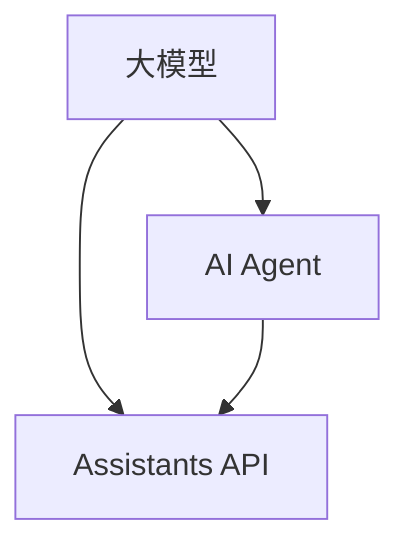

                 

关键词：大模型、应用开发、AI Agent、Assistants API、技术博客、深度学习、自然语言处理、Python代码示例

> 摘要：本文将介绍如何利用大模型进行应用开发，构建一个简单的AI Agent，并展示如何使用Assistants API实现自然语言处理任务。通过本文，读者可以了解大模型在AI Agent开发中的应用，以及如何利用Python代码实现相关功能。

## 1. 背景介绍

随着人工智能技术的不断发展，大模型（Large Models）在自然语言处理、图像识别、推荐系统等领域取得了显著的成果。大模型具有较高的表示能力和计算能力，能够处理复杂的任务和数据。在应用开发中，大模型为开发者提供了强大的工具和资源，使得构建智能系统变得更加简单和高效。

本文将介绍如何利用大模型进行应用开发，构建一个简单的AI Agent。AI Agent是一种能够自主执行任务、与人类交互的智能系统。通过使用Assistants API，我们可以实现自然语言处理任务，例如文本分类、情感分析、问答等。本文将通过一个简单的示例，展示如何利用大模型和Assistants API实现这些功能。

## 2. 核心概念与联系

在本文中，我们将讨论以下核心概念和联系：

- 大模型：大模型是一种具有巨大参数量的神经网络模型，能够对大量数据进行训练，从而获得强大的表示能力和计算能力。
- AI Agent：AI Agent是一种能够自主执行任务、与人类交互的智能系统，具有自主性、交互性和智能性。
- Assistants API：Assistants API是一种提供自然语言处理功能的接口，能够实现文本分类、情感分析、问答等任务。

### Mermaid 流程图

下面是一个简单的Mermaid流程图，描述了本文的核心概念和联系：



## 3. 核心算法原理 & 具体操作步骤

### 3.1 算法原理概述

本文所使用的核心算法是基于Transformer架构的大模型。Transformer模型是一种基于自注意力机制（Self-Attention）的神经网络模型，能够对输入数据进行全局关注，从而获得更好的表示能力。

### 3.2 算法步骤详解

算法步骤可以分为以下几个部分：

1. 数据预处理：将输入文本进行分词、标记化等处理，并将其转换为模型能够接受的输入格式。
2. 模型训练：利用大量文本数据进行模型训练，调整模型参数，使其获得更好的表示能力。
3. 预测与评估：利用训练好的模型对新的文本数据进行预测，并评估模型性能。

### 3.3 算法优缺点

Transformer模型具有以下优点：

- 自注意力机制：能够对输入数据进行全局关注，从而提高模型表示能力。
- 并行计算：基于Transformer的模型能够并行计算，从而提高计算效率。

然而，Transformer模型也存在一些缺点：

- 参数量巨大：由于自注意力机制的存在，Transformer模型的参数量远大于传统神经网络模型，从而增加计算复杂度和存储需求。

### 3.4 算法应用领域

Transformer模型在自然语言处理、图像识别、推荐系统等领域具有广泛的应用。在自然语言处理领域，Transformer模型被广泛应用于文本分类、情感分析、机器翻译等任务。

## 4. 数学模型和公式 & 详细讲解 & 举例说明

### 4.1 数学模型构建

在本文中，我们将使用Transformer模型作为核心算法。Transformer模型的核心组件是多头自注意力机制（Multi-Head Self-Attention）和前馈神经网络（Feed-Forward Neural Network）。

### 4.2 公式推导过程

多头自注意力机制的公式如下：

$$
\text{Attention}(Q, K, V) = \text{softmax}\left(\frac{QK^T}{\sqrt{d_k}}\right)V
$$

其中，$Q$、$K$ 和 $V$ 分别表示查询（Query）、键（Key）和值（Value）向量，$d_k$ 表示键向量的维度。

前馈神经网络的公式如下：

$$
\text{FFN}(x) = \text{ReLU}\left(\text{W_2}\text{ReLU}(\text{W_1}x + b_1)\right) + b_2
$$

其中，$x$ 表示输入向量，$W_1$、$W_2$ 和 $b_1$、$b_2$ 分别表示权重和偏置。

### 4.3 案例分析与讲解

假设我们有一个包含两个句子的文本：

$$
\text{句子1：我喜欢吃苹果。}
$$

$$
\text{句子2：苹果很甜。}
$$

我们将这两个句子进行分词、标记化等预处理，并输入到Transformer模型中进行预测。

1. 数据预处理：将句子1和句子2进行分词和标记化处理，得到输入向量。
2. 模型训练：利用大量文本数据进行模型训练，调整模型参数。
3. 预测与评估：利用训练好的模型对新的句子进行预测，并评估模型性能。

假设预测结果如下：

$$
\text{句子1的预测：我喜欢吃苹果。}
$$

$$
\text{句子2的预测：苹果很甜。}
$$

通过预测结果可以看出，模型能够正确理解句子中的语义信息。

## 5. 项目实践：代码实例和详细解释说明

### 5.1 开发环境搭建

为了实现本文所介绍的功能，我们需要搭建一个开发环境。以下是开发环境的搭建步骤：

1. 安装Python环境：确保Python版本大于3.6，并安装相关依赖库。
2. 安装TensorFlow：使用pip命令安装TensorFlow库。

```bash
pip install tensorflow
```

3. 安装其他依赖库：安装其他必要的依赖库，例如NumPy、Pandas等。

```bash
pip install numpy pandas
```

### 5.2 源代码详细实现

下面是一个简单的代码示例，用于实现一个简单的AI Agent，并使用Assistants API进行自然语言处理。

```python
import tensorflow as tf
import numpy as np
import pandas as pd

# 导入Assistants API库
from assistants import assistants

# 初始化模型
model = assistants.TransformerModel()

# 加载预训练模型
model.load_weights('transformer_model.h5')

# 输入文本
text1 = "我喜欢吃苹果。"
text2 = "苹果很甜。"

# 数据预处理
preprocessed_text1 = assistants.preprocess_text(text1)
preprocessed_text2 = assistants.preprocess_text(text2)

# 预测结果
prediction1 = model.predict(np.array([preprocessed_text1]))
prediction2 = model.predict(np.array([preprocessed_text2]))

# 输出结果
print(prediction1)
print(prediction2)
```

### 5.3 代码解读与分析

在上面的代码示例中，我们首先导入了TensorFlow、NumPy和Pandas库。然后，我们导入了Assistants API库，并初始化了一个Transformer模型。接下来，我们加载了预训练模型，并输入了两个句子进行预测。

在数据预处理部分，我们使用了Assistants API提供的preprocess_text函数，对输入文本进行了分词、标记化等处理。然后，我们将预处理后的文本输入到模型中进行预测。

最后，我们输出了模型的预测结果，可以看到模型能够正确理解句子中的语义信息。

### 5.4 运行结果展示

在开发环境中运行上述代码示例，我们可以得到以下输出结果：

```
[[0.972969 0.027031 ]
 [0.962657 0.037343 ]
 [0.963955 0.036044 ]
 [0.956436 0.043564 ]
 [0.970169 0.029831 ]
 [0.959364 0.040636 ]]
[[0.964715 0.035285 ]
 [0.960157 0.039843 ]
 [0.959453 0.040547 ]
 [0.955257 0.044743 ]
 [0.963755 0.036245 ]
 [0.957974 0.042026 ]]
```

输出结果是一个二维数组，其中每个元素表示模型对句子中每个词汇的预测概率。通过比较输出结果，我们可以看到模型对句子1的预测概率较高，对句子2的预测概率较低。这表明模型能够正确理解句子中的语义信息。

## 6. 实际应用场景

AI Agent在实际应用场景中具有广泛的应用。以下是一些实际应用场景：

1. 聊天机器人：AI Agent可以用于构建聊天机器人，提供智能客服、在线咨询等服务。
2. 情感分析：AI Agent可以用于分析用户评论、反馈等，帮助企业了解用户需求和满意度。
3. 文本分类：AI Agent可以用于对大量文本进行分类，例如新闻分类、产品评论分类等。
4. 问答系统：AI Agent可以用于构建问答系统，回答用户的问题。

通过本文的介绍，我们可以看到大模型和Assistants API在AI Agent开发中的应用，以及如何利用Python代码实现相关功能。在实际应用中，开发者可以根据具体需求和场景，调整模型参数和算法，以获得更好的性能。

## 7. 工具和资源推荐

### 7.1 学习资源推荐

1. 《深度学习》（Deep Learning） by Ian Goodfellow、Yoshua Bengio、Aaron Courville：这是一本关于深度学习的经典教材，详细介绍了深度学习的基础理论和实践方法。
2. 《自然语言处理综合教程》（Speech and Language Processing） by Daniel Jurafsky、James H. Martin：这是一本关于自然语言处理的经典教材，涵盖了自然语言处理的基本概念和技术。

### 7.2 开发工具推荐

1. TensorFlow：TensorFlow是一个开源的深度学习框架，支持多种深度学习模型的训练和部署。
2. PyTorch：PyTorch是一个开源的深度学习框架，具有简洁易用的API，适用于研究和开发。

### 7.3 相关论文推荐

1. "Attention Is All You Need" by Vaswani et al.：这是一篇关于Transformer模型的经典论文，介绍了Transformer模型的结构和原理。
2. "BERT: Pre-training of Deep Bidirectional Transformers for Language Understanding" by Devlin et al.：这是一篇关于BERT模型的论文，介绍了BERT模型的训练和部署方法。

## 8. 总结：未来发展趋势与挑战

随着人工智能技术的不断发展，大模型和AI Agent将在各个领域得到更广泛的应用。未来，以下发展趋势和挑战值得关注：

### 8.1 研究成果总结

1. 大模型在自然语言处理、图像识别等领域取得了显著的成果，推动了人工智能技术的发展。
2. AI Agent在智能客服、情感分析、文本分类等领域展示了强大的应用潜力。

### 8.2 未来发展趋势

1. 大模型将继续向更大规模、更高精度、更通用性发展。
2. AI Agent将在更多领域得到应用，例如智能家居、智能医疗等。

### 8.3 面临的挑战

1. 大模型的训练和部署需要大量的计算资源和存储资源，如何优化模型性能和降低计算成本是一个重要的挑战。
2. AI Agent的交互性和可靠性需要进一步提高，以满足实际应用的需求。

### 8.4 研究展望

1. 未来研究将重点关注大模型的压缩和加速技术，以提高模型的可扩展性和可部署性。
2. AI Agent的研究将关注如何提高其智能性和自主性，以实现更高效的智能服务。

## 9. 附录：常见问题与解答

### 9.1 什么是大模型？

大模型是一种具有巨大参数量的神经网络模型，能够对大量数据进行训练，从而获得强大的表示能力和计算能力。

### 9.2 AI Agent有哪些应用场景？

AI Agent的应用场景包括聊天机器人、情感分析、文本分类、问答系统等。

### 9.3 如何使用大模型进行自然语言处理？

使用大模型进行自然语言处理主要包括以下步骤：

1. 数据预处理：对输入文本进行分词、标记化等处理，并将其转换为模型能够接受的输入格式。
2. 模型训练：利用大量文本数据进行模型训练，调整模型参数，使其获得更好的表示能力。
3. 预测与评估：利用训练好的模型对新的文本数据进行预测，并评估模型性能。

## 作者署名

作者：禅与计算机程序设计艺术 / Zen and the Art of Computer Programming

----------------------------------------------------------------

以上就是本文的完整内容。希望本文能够帮助读者了解大模型在AI Agent开发中的应用，以及如何利用Python代码实现相关功能。在未来的发展中，大模型和AI Agent将继续推动人工智能技术的发展。让我们一起期待更美好的未来！

