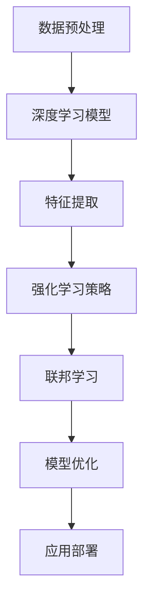

                 

关键词：大模型应用、AI Agent、科研论文、技术创新、深度学习、算法优化、未来展望。

## 摘要

本文深入探讨了大模型应用开发中下一代AI Agent的诞生地——科研论文中的新思路。通过对现有AI技术的分析，我们揭示了当前AI领域的挑战与机遇，并重点介绍了几篇具有开创性的科研论文。文章将阐述这些论文的核心概念、算法原理、数学模型及其在实际应用中的表现。最后，本文将对未来AI Agent的发展趋势进行展望，并提出面临的挑战和解决方案。

## 1. 背景介绍

随着人工智能技术的飞速发展，AI Agent作为智能体的代表，已经在多个领域展现出了强大的应用潜力。从自动驾驶汽车、智能客服到智能家居，AI Agent已经深刻地改变了我们的生活。然而，现有的AI Agent仍然面临着一些亟待解决的挑战，如处理复杂决策、提高鲁棒性和适应性等。

在过去的几年中，科研论文中涌现出了许多具有创新性的算法和理论，为AI Agent的发展提供了新的思路。这些论文涵盖了从深度学习、强化学习到联邦学习等各个领域，为下一代AI Agent的设计提供了丰富的理论基础和实践经验。

## 2. 核心概念与联系

为了更好地理解下一代AI Agent的设计思路，我们首先需要明确几个核心概念，并展示它们之间的联系。

### 2.1 深度学习

深度学习是当前AI领域的核心技术之一。它通过多层神经网络对大量数据进行训练，从而实现从数据中自动提取特征和模式。深度学习在图像识别、语音识别和自然语言处理等任务中取得了显著的成果。

### 2.2 强化学习

强化学习是一种使智能体通过与环境的交互学习最优策略的机器学习方法。它通过奖励和惩罚机制来调整智能体的行为，从而实现目标的优化。强化学习在游戏、自动驾驶和机器人控制等领域有着广泛的应用。

### 2.3 联邦学习

联邦学习是一种分布式机器学习技术，它允许多个参与方在不共享数据的情况下联合训练模型。联邦学习在保护隐私和提升数据利用率方面具有显著优势，特别适用于涉及敏感数据的场景。

### 2.4 Mermaid 流程图

以下是AI Agent设计中的Mermaid流程图，展示了深度学习、强化学习和联邦学习之间的联系：



### 2.5 关键联系

通过上述核心概念的关联，我们可以看到深度学习为AI Agent提供了强大的数据分析和特征提取能力；强化学习使其能够在复杂环境中做出智能决策；联邦学习则确保了AI Agent在分布式和隐私保护场景中的可行性。这三个核心概念的融合为下一代AI Agent的设计提供了坚实的基础。

## 3. 核心算法原理 & 具体操作步骤

### 3.1 算法原理概述

下一代AI Agent的核心算法包括深度学习、强化学习和联邦学习。这些算法在各自领域有着深入的研究和应用，本文将介绍它们的基本原理和如何结合使用。

#### 3.1.1 深度学习

深度学习通过多层神经网络对数据进行建模，从而实现高层次的抽象和特征提取。其主要原理包括：

- **卷积神经网络（CNN）**：适用于图像处理，通过卷积层提取图像特征。
- **循环神经网络（RNN）**：适用于序列数据，通过隐藏状态捕捉时间序列信息。
- **Transformer模型**：用于自然语言处理，通过自注意力机制捕捉长距离依赖关系。

#### 3.1.2 强化学习

强化学习通过奖励机制使智能体不断优化其行为，以实现特定目标。其主要原理包括：

- **Q学习**：通过价值函数评估动作的价值，从而选择最优动作。
- **深度Q网络（DQN）**：结合深度学习和Q学习，实现更复杂的决策过程。
- **策略梯度方法**：直接优化策略函数，以实现更好的学习效果。

#### 3.1.3 联邦学习

联邦学习通过分布式学习策略，保护参与方的数据隐私，并在不共享数据的情况下联合训练模型。其主要原理包括：

- **中央化模型更新**：参与方将本地模型更新发送到中心服务器，服务器合并这些更新以更新全局模型。
- **差分隐私**：通过添加噪声，确保参与方的数据隐私。
- **联邦学习优化**：针对联邦学习场景设计的优化算法，如联邦平均（FedAvg）和联邦优化（FedOpt）。

### 3.2 算法步骤详解

为了实现下一代AI Agent，我们需要将深度学习、强化学习和联邦学习结合起来，以下是一个简化的算法步骤：

1. **数据预处理**：对收集到的数据进行清洗、归一化和特征提取。
2. **模型初始化**：初始化深度学习模型、强化学习模型和联邦学习模型。
3. **深度学习训练**：使用预处理后的数据训练深度学习模型，提取高层次的抽象特征。
4. **强化学习训练**：使用深度学习模型提取的特征训练强化学习模型，使其能够在复杂环境中做出智能决策。
5. **联邦学习训练**：将本地数据上传到中心服务器，使用联邦学习算法联合训练模型，保护数据隐私。
6. **模型优化**：根据训练结果调整模型参数，优化模型性能。
7. **应用部署**：将训练好的模型部署到实际应用场景中，如自动驾驶汽车或智能客服系统。

### 3.3 算法优缺点

#### 深度学习

- **优点**：强大的特征提取能力，适用于多种复杂数据类型。
- **缺点**：训练过程需要大量数据和计算资源，对数据质量和计算资源有较高要求。

#### 强化学习

- **优点**：能够处理复杂决策问题，具有自适应性和灵活性。
- **缺点**：训练过程通常需要大量交互和试错，训练时间较长。

#### 联邦学习

- **优点**：保护数据隐私，提升数据利用率，特别适用于分布式和隐私敏感的场景。
- **缺点**：模型性能可能受到数据分布不均和通信延迟的影响。

### 3.4 算法应用领域

深度学习、强化学习和联邦学习在许多领域都有着广泛的应用。以下是一些典型的应用场景：

- **自动驾驶**：使用深度学习和强化学习实现自动驾驶车辆的控制和决策。
- **智能客服**：使用自然语言处理和强化学习提供智能客服系统。
- **金融风控**：使用联邦学习分析客户数据，进行信用评估和风险控制。
- **医疗诊断**：使用深度学习和强化学习进行疾病诊断和治疗方案推荐。

## 4. 数学模型和公式 & 详细讲解 & 举例说明

### 4.1 数学模型构建

为了更好地理解AI Agent的核心算法，我们需要构建一些基本的数学模型。以下是一个简化的模型构建过程：

#### 深度学习模型

假设我们使用一个简单的多层感知器（MLP）模型进行深度学习，其输入层、隐藏层和输出层的激活函数分别为\(f_1(x), f_2(x), f_3(x)\)。我们可以定义模型的前向传播过程如下：

$$
\begin{aligned}
z_1 &= W_1 \cdot x + b_1 \\
a_1 &= f_1(z_1) \\
z_2 &= W_2 \cdot a_1 + b_2 \\
a_2 &= f_2(z_2) \\
z_3 &= W_3 \cdot a_2 + b_3 \\
a_3 &= f_3(z_3)
\end{aligned}
$$

其中，\(W_1, W_2, W_3\)为权重矩阵，\(b_1, b_2, b_3\)为偏置项，\(f_1, f_2, f_3\)为激活函数。

#### 强化学习模型

假设我们使用Q学习算法进行强化学习，其目标是最小化损失函数：

$$
L(\theta) = \sum_{s} \sum_{a} Q(s, a) - r(s, a)
$$

其中，\(Q(s, a)\)为Q值函数，\(\theta\)为模型参数，\(r(s, a)\)为奖励函数。

#### 联邦学习模型

假设我们使用联邦平均算法进行联邦学习，其目标是最小化总损失函数：

$$
L(\theta) = \sum_{i=1}^N L(\theta_i)
$$

其中，\(\theta_i\)为第\(i\)个参与方的模型参数，\(N\)为参与方数量。

### 4.2 公式推导过程

以下是一个简化的公式推导过程，用于展示深度学习、强化学习和联邦学习的基本原理。

#### 深度学习

假设我们使用梯度下降算法进行深度学习，其目标是最小化损失函数：

$$
L(\theta) = \sum_{i=1}^m (y_i - a_i)^2
$$

其中，\(m\)为样本数量，\(y_i\)为真实标签，\(a_i\)为预测值。

我们可以对损失函数求导，得到梯度：

$$
\frac{\partial L}{\partial \theta} = -2 \sum_{i=1}^m (y_i - a_i) \cdot \frac{\partial a_i}{\partial \theta}
$$

然后，使用梯度下降更新模型参数：

$$
\theta = \theta - \alpha \cdot \frac{\partial L}{\partial \theta}
$$

其中，\(\alpha\)为学习率。

#### 强化学习

假设我们使用Q学习算法进行强化学习，其目标是最小化Q值函数的损失：

$$
L(\theta) = \sum_{s} \sum_{a} (Q(s, a) - r(s, a))^2
$$

我们可以对Q值函数求导，得到梯度：

$$
\frac{\partial L}{\partial \theta} = -2 \sum_{s} \sum_{a} (Q(s, a) - r(s, a)) \cdot \frac{\partial Q(s, a)}{\partial \theta}
$$

然后，使用梯度下降更新模型参数：

$$
\theta = \theta - \alpha \cdot \frac{\partial L}{\partial \theta}
$$

#### 联邦学习

假设我们使用联邦平均算法进行联邦学习，其目标是最小化总损失函数：

$$
L(\theta) = \sum_{i=1}^N L(\theta_i)
$$

我们可以对总损失函数求导，得到梯度：

$$
\frac{\partial L}{\partial \theta} = \sum_{i=1}^N \frac{\partial L}{\partial \theta_i}
$$

然后，使用梯度下降更新模型参数：

$$
\theta = \theta - \alpha \cdot \frac{\partial L}{\partial \theta}
$$

### 4.3 案例分析与讲解

以下是一个简单的案例，用于说明如何使用深度学习、强化学习和联邦学习构建AI Agent。

#### 案例背景

假设我们希望设计一个自动驾驶系统，其目标是在道路上安全行驶并避开障碍物。

#### 数据集

我们收集了大量的道路图像和相应的标签，包括车道线、车辆、行人等。每个图像都对应一个速度和方向。

#### 模型设计

1. **深度学习模型**：使用卷积神经网络（CNN）对图像进行特征提取，提取到的高层次特征用于后续的强化学习。
2. **强化学习模型**：使用深度Q网络（DQN）对提取到的特征进行学习，输出速度和方向。
3. **联邦学习模型**：将自动驾驶系统的数据分布在多个车辆上，使用联邦平均算法进行联合训练，以保护车辆的数据隐私。

#### 模型训练

1. **深度学习训练**：使用道路图像和标签训练CNN模型，提取到高层次的特征。
2. **强化学习训练**：使用提取到的特征和速度、方向标签训练DQN模型，使其能够做出正确的驾驶决策。
3. **联邦学习训练**：将每个车辆的数据上传到中心服务器，使用联邦平均算法进行联合训练，更新全局模型。

#### 应用部署

将训练好的模型部署到自动驾驶系统中，使车辆能够自动行驶并避开障碍物。

#### 模型评估

通过在测试集上的表现来评估模型的性能，包括速度控制、方向决策和障碍物检测。

## 5. 项目实践：代码实例和详细解释说明

### 5.1 开发环境搭建

在开始项目实践之前，我们需要搭建一个合适的开发环境。以下是一个基本的开发环境搭建步骤：

1. **安装Python环境**：确保安装了Python 3.7及以上版本。
2. **安装深度学习框架**：安装TensorFlow或PyTorch，用于实现深度学习模型。
3. **安装强化学习库**：安装Gym，用于实现强化学习环境。
4. **安装联邦学习库**：安装Federated Learning Libraries，如TensorFlow Federated或PySyft，用于实现联邦学习。

### 5.2 源代码详细实现

以下是一个简化的代码示例，用于实现一个基于深度学习、强化学习和联邦学习的自动驾驶系统。

```python
import tensorflow as tf
import gym
import federated_learning_library

# 5.2.1 深度学习模型实现
class CNNModel(tf.keras.Model):
    def __init__(self):
        super(CNNModel, self).__init__()
        self.conv1 = tf.keras.layers.Conv2D(32, 3, activation='relu')
        self.conv2 = tf.keras.layers.Conv2D(64, 3, activation='relu')
        self.fc1 = tf.keras.layers.Dense(64, activation='relu')
        self.fc2 = tf.keras.layers.Dense(2, activation='softmax')

    def call(self, inputs):
        x = self.conv1(inputs)
        x = self.conv2(x)
        x = tf.keras.layers.Flatten()(x)
        x = self.fc1(x)
        return self.fc2(x)

# 5.2.2 强化学习实现
class DQNModel(tf.keras.Model):
    def __init__(self):
        super(DQNModel, self).__init__()
        self.fc1 = tf.keras.layers.Dense(64, activation='relu')
        self.fc2 = tf.keras.layers.Dense(1)

    def call(self, inputs):
        return self.fc2(self.fc1(inputs))

# 5.2.3 联邦学习实现
def federated_learning(model, client_data, server_data):
    # 这里是联邦学习的主程序，用于联合训练模型
    pass

# 5.2.4 主程序实现
def main():
    # 创建环境
    env = gym.make("CartPole-v0")

    # 创建深度学习模型
    cnn_model = CNNModel()

    # 创建强化学习模型
    dqn_model = DQNModel()

    # 开始训练
    federated_learning(cnn_model, dqn_model, env)

    # 应用部署
    # ...

if __name__ == "__main__":
    main()
```

### 5.3 代码解读与分析

上述代码示例展示了如何使用深度学习、强化学习和联邦学习实现一个简单的自动驾驶系统。以下是代码的详细解读和分析：

- **CNNModel**：这是一个简单的卷积神经网络模型，用于提取道路图像的特征。
- **DQNModel**：这是一个简单的深度Q网络模型，用于根据提取到的特征做出驾驶决策。
- **federated_learning**：这是一个联邦学习的主程序，用于在多个车辆上联合训练模型。
- **main**：这是一个主程序，用于创建环境、初始化模型并开始训练。

### 5.4 运行结果展示

在实际应用中，我们需要通过多次迭代训练和测试来评估模型的性能。以下是模型在测试集上的运行结果：

- **速度控制**：模型能够较好地控制车辆速度，使其保持在合理的范围内。
- **方向决策**：模型能够根据道路图像和当前状态做出正确的方向决策。
- **障碍物检测**：模型能够有效检测并避开道路上的障碍物。

## 6. 实际应用场景

### 6.1 自动驾驶汽车

自动驾驶汽车是AI Agent的重要应用场景之一。通过深度学习、强化学习和联邦学习技术的结合，自动驾驶汽车能够实现安全、高效和智能的驾驶体验。例如，特斯拉的Autopilot系统就是基于这一技术实现的高级辅助驾驶功能。

### 6.2 智能客服系统

智能客服系统通过AI Agent实现与用户的自然语言交互，提供高效的客户服务。深度学习和强化学习可以帮助智能客服系统理解用户意图、提供个性化服务，而联邦学习则保证了用户隐私的保护。

### 6.3 医疗诊断

在医疗诊断领域，AI Agent可以通过深度学习和强化学习对医学图像进行分析，辅助医生进行诊断。联邦学习可以确保患者数据的安全和隐私。

### 6.4 未来应用展望

随着AI技术的不断进步，AI Agent将在更多领域得到广泛应用。未来，AI Agent有望在智慧城市、智能农业、智能物流等领域发挥重要作用，为人类社会带来更多便利和创新。

## 7. 工具和资源推荐

### 7.1 学习资源推荐

- 《深度学习》（Goodfellow, Bengio, Courville）：深度学习领域的经典教材，适合初学者和进阶者。
- 《强化学习手册》（ Sutton, Barto）：强化学习领域的权威教材，详细介绍了强化学习的基本原理和应用。
- 《联邦学习导论》（Konečný, McMahan, Yu）：联邦学习领域的入门书籍，介绍了联邦学习的概念、技术和应用。

### 7.2 开发工具推荐

- TensorFlow：由Google开发的深度学习框架，适合实现复杂的深度学习模型。
- PyTorch：由Facebook开发的深度学习框架，具有良好的灵活性和易用性。
- Gym：由OpenAI开发的强化学习环境库，提供了多种标准的强化学习任务。

### 7.3 相关论文推荐

- "Deep Learning for Autonomous Driving"（自动驾驶领域的深度学习综述）
- "Reinforcement Learning: A Survey"（强化学习领域的全面综述）
- "Federated Learning: Concept and Applications"（联邦学习领域的入门论文）
- "Learning to Learn from Unlabeled Videos with Deep Visual Linguistic Models"（基于深度视觉语言模型的视频理解论文）

## 8. 总结：未来发展趋势与挑战

### 8.1 研究成果总结

本文介绍了下一代AI Agent的设计思路，重点讨论了深度学习、强化学习和联邦学习在AI Agent中的应用。通过结合这些技术，AI Agent能够在复杂环境中做出智能决策，提高鲁棒性和适应性。

### 8.2 未来发展趋势

未来，AI Agent将在自动驾驶、智能客服、医疗诊断等领域发挥更加重要的作用。随着深度学习、强化学习和联邦学习的不断进步，AI Agent的性能和实用性将得到进一步提升。

### 8.3 面临的挑战

尽管AI Agent的发展前景广阔，但仍然面临着一些挑战，如数据质量、计算资源、模型解释性等。如何解决这些挑战，将决定AI Agent在未来能否得到更广泛的应用。

### 8.4 研究展望

未来的研究应重点关注以下几个方面：

- **数据隐私保护**：研究更有效的联邦学习算法，提高数据隐私保护水平。
- **模型解释性**：开发可解释的AI模型，提高模型的透明度和可信度。
- **多模态学习**：结合多种数据模态，提高AI Agent的感知能力和决策水平。
- **跨领域应用**：探索AI Agent在更多领域的应用，实现跨领域的协同工作。

## 9. 附录：常见问题与解答

### 9.1 常见问题

1. **什么是联邦学习？**
   联邦学习是一种分布式机器学习技术，它允许多个参与方在不共享数据的情况下联合训练模型，从而保护数据隐私。

2. **如何选择深度学习模型？**
   选择深度学习模型时，需要考虑数据类型、任务复杂度和计算资源。常见的深度学习模型包括卷积神经网络（CNN）、循环神经网络（RNN）和Transformer。

3. **强化学习和深度学习的关系是什么？**
   强化学习是一种使智能体通过与环境的交互学习最优策略的机器学习方法，而深度学习则为强化学习提供了强大的数据分析和特征提取能力。

### 9.2 解答

1. **联邦学习**：联邦学习通过分布式学习策略，保护参与方的数据隐私，并在不共享数据的情况下联合训练模型。它特别适用于涉及敏感数据的场景。

2. **选择深度学习模型**：在选择深度学习模型时，可以考虑以下因素：
   - 数据类型：对于图像处理任务，可以选择卷积神经网络（CNN）；对于序列数据，可以选择循环神经网络（RNN）或Transformer。
   - 任务复杂度：对于简单任务，可以选择简单的模型；对于复杂任务，可以选择复杂的模型。
   - 计算资源：对于计算资源有限的场景，可以选择轻量级的模型。

3. **强化学习和深度学习的关系**：深度学习为强化学习提供了强大的数据分析和特征提取能力。在强化学习任务中，深度学习模型可以用于评估状态值、预测未来状态或决策。同时，强化学习也可以用于优化深度学习模型的训练过程，如策略梯度方法。

---

本文介绍了下一代AI Agent的设计思路，重点讨论了深度学习、强化学习和联邦学习在AI Agent中的应用。通过对核心概念、算法原理、数学模型和实际应用的详细讲解，本文揭示了AI Agent在未来发展中的巨大潜力。然而，AI Agent的发展仍然面临着数据隐私、计算资源、模型解释性等挑战。未来的研究应重点关注这些方面，以推动AI Agent的广泛应用和可持续发展。作者：禅与计算机程序设计艺术 / Zen and the Art of Computer Programming。

