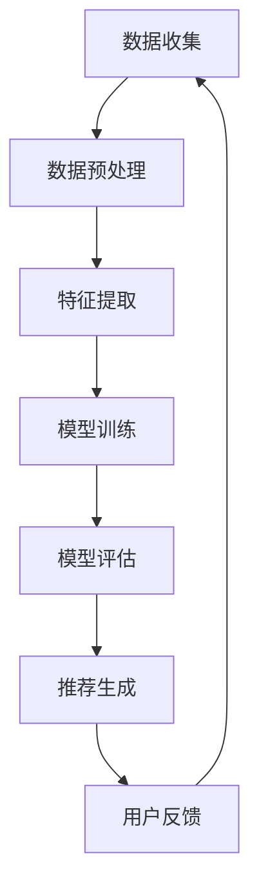

                 

关键词：大模型，应用开发，AI Agent，个性化推荐，技术博客

> 摘要：本文将深入探讨大模型应用开发中的个性化推荐系统，通过详细的算法原理、数学模型和项目实践，展示如何动手实现AI Agent进行个性化推荐，并展望其在未来的发展趋势与挑战。

## 1. 背景介绍

在当今信息爆炸的时代，如何有效地从海量数据中提取有价值的信息，为用户提供个性化服务，成为了各个行业面临的重大挑战。个性化推荐系统作为一种有效的解决方案，通过分析用户的历史行为和偏好，为用户推荐他们可能感兴趣的内容。随着深度学习技术的飞速发展，大模型在个性化推荐中的应用愈发广泛，大大提升了推荐的准确性和效率。

本文旨在介绍大模型在个性化推荐中的应用，通过理论和实践的结合，帮助读者理解个性化推荐的核心原理，掌握动手实践的方法，并探讨未来的发展方向和面临的挑战。

## 2. 核心概念与联系

### 2.1 核心概念

#### 大模型

大模型（如BERT、GPT等）是指具有数十亿甚至千亿参数的深度学习模型。这些模型可以通过训练大量数据，学习到复杂的语义和结构信息，从而在自然语言处理、图像识别等领域表现出色。

#### 个性化推荐

个性化推荐是指根据用户的兴趣和偏好，为其推荐个性化内容的服务。常见的推荐算法有协同过滤、基于内容的推荐和混合推荐等。

### 2.2 联系

大模型的应用为个性化推荐提供了强大的技术支撑，使得推荐系统在处理海量数据和用户行为时更加高效和准确。同时，个性化推荐系统的成功应用也推动了大模型的研究和发展，二者相辅相成，共同推动着信息检索和人工智能技术的进步。

### 2.3 Mermaid 流程图

下面是一个Mermaid流程图，展示了个性化推荐系统中的关键步骤：



## 3. 核心算法原理 & 具体操作步骤

### 3.1 算法原理概述

个性化推荐的核心在于构建用户和物品之间的相似度模型，并根据用户的历史行为和偏好为其推荐相关物品。大模型在个性化推荐中的应用主要体现在以下几个方面：

1. **用户表示**：使用大模型对用户的历史行为数据进行编码，提取用户特征。
2. **物品表示**：同样使用大模型对物品的特征进行编码，形成物品的嵌入向量。
3. **相似度计算**：通过计算用户和物品的嵌入向量之间的相似度，生成推荐列表。

### 3.2 算法步骤详解

#### 3.2.1 数据收集与预处理

数据收集是构建推荐系统的第一步。数据来源可以是用户行为日志、社交媒体互动、电子商务交易等。数据收集后，需要进行数据预处理，包括数据清洗、格式转换和数据归一化等操作。

#### 3.2.2 特征提取

特征提取是将原始数据转换为模型可用的形式。在大模型的应用中，通常使用嵌入层（Embedding Layer）对用户和物品的特征进行编码。通过预训练的大模型，可以直接获得高质量的嵌入向量。

#### 3.2.3 模型训练

模型训练是推荐系统构建的核心步骤。使用用户和物品的嵌入向量，通过训练损失函数（如交叉熵损失函数），不断调整模型参数，使其能够准确预测用户对物品的喜好。

#### 3.2.4 模型评估

模型评估是验证推荐系统性能的重要环节。常用的评估指标包括准确率、召回率和覆盖率等。通过评估指标，可以判断模型是否能够满足实际应用的需求。

#### 3.2.5 推荐生成

在模型训练完成后，可以根据用户的历史行为和偏好，生成个性化推荐列表。推荐算法可以根据用户的实时行为进行动态调整，以提供更加个性化的服务。

#### 3.2.6 用户反馈

用户反馈是优化推荐系统的重要手段。通过收集用户对推荐结果的反馈，可以进一步调整模型参数，提高推荐质量。

### 3.3 算法优缺点

#### 优点

1. **高效性**：大模型能够处理海量数据和复杂的用户行为，提高推荐系统的效率。
2. **准确性**：大模型通过深度学习技术，能够准确捕捉用户和物品之间的潜在关系，提高推荐准确性。
3. **泛化性**：大模型具有较好的泛化能力，能够适应不同的应用场景。

#### 缺点

1. **计算资源需求**：大模型训练和推理需要大量的计算资源和时间。
2. **数据隐私问题**：个性化推荐系统涉及用户隐私数据，需要妥善处理数据保护和隐私问题。

### 3.4 算法应用领域

大模型在个性化推荐中的应用非常广泛，包括电子商务、社交媒体、在线教育、金融等领域。例如，电商平台可以使用大模型为用户提供个性化商品推荐，社交媒体平台可以根据用户的兴趣和行为为用户推荐相关内容，在线教育平台可以为学生推荐合适的学习资源。

## 4. 数学模型和公式

### 4.1 数学模型构建

个性化推荐系统的数学模型通常包括用户表示和物品表示两个部分。

#### 用户表示

假设用户行为数据为 \( X \)，则用户特征向量可以表示为：

\[ \text{User Vector} = \text{Embedding}(X) \]

其中，Embedding函数将用户行为数据映射为高维空间中的向量。

#### 物品表示

物品特征向量也可以通过Embedding函数获得：

\[ \text{Item Vector} = \text{Embedding(Y)} \]

其中，Y为物品的描述信息。

### 4.2 公式推导过程

假设用户 \( u \) 对物品 \( i \) 的喜好程度可以表示为：

\[ \text{Score}(u, i) = \text{dot product}(\text{User Vector}[u], \text{Item Vector}[i]) \]

则，用户对物品的推荐分数可以通过计算用户和物品嵌入向量的点积得到。

### 4.3 案例分析与讲解

以电商平台的个性化商品推荐为例，假设用户的历史购买数据如下：

- 用户A购买了商品1和商品2。
- 用户B购买了商品2和商品3。

使用大模型对用户进行表示，得到用户A和用户B的嵌入向量：

\[ \text{User Vector}[A] = \text{Embedding}([1, 2]) \]
\[ \text{User Vector}[B] = \text{Embedding}([2, 3]) \]

对商品进行表示，得到商品1、商品2和商品3的嵌入向量：

\[ \text{Item Vector}[1] = \text{Embedding}(1) \]
\[ \text{Item Vector}[2] = \text{Embedding}(2) \]
\[ \text{Item Vector}[3] = \text{Embedding}(3) \]

计算用户A对商品1、商品2和商品3的推荐分数：

\[ \text{Score}(A, 1) = \text{dot product}(\text{User Vector}[A], \text{Item Vector}[1]) \]
\[ \text{Score}(A, 2) = \text{dot product}(\text{User Vector}[A], \text{Item Vector}[2]) \]
\[ \text{Score}(A, 3) = \text{dot product}(\text{User Vector}[A], \text{Item Vector}[3]) \]

同理，计算用户B对商品1、商品2和商品3的推荐分数：

\[ \text{Score}(B, 1) = \text{dot product}(\text{User Vector}[B], \text{Item Vector}[1]) \]
\[ \text{Score}(B, 2) = \text{dot product}(\text{User Vector}[B], \text{Item Vector}[2]) \]
\[ \text{Score}(B, 3) = \text{dot product}(\text{User Vector}[B], \text{Item Vector}[3]) \]

根据推荐分数，可以为用户A推荐商品3，为用户B推荐商品1。

## 5. 项目实践：代码实例和详细解释说明

### 5.1 开发环境搭建

为了实践个性化推荐系统，我们需要搭建一个合适的开发环境。以下是所需的环境和工具：

- 操作系统：Ubuntu 18.04
- 编程语言：Python 3.8
- 深度学习框架：TensorFlow 2.6
- 大模型预训练模型：BERT

在Ubuntu 18.04操作系统上，我们可以使用以下命令安装TensorFlow和BERT：

```bash
pip install tensorflow
pip install transformers
```

### 5.2 源代码详细实现

下面是一个简单的个性化推荐系统的实现示例：

```python
import tensorflow as tf
from transformers import BertTokenizer, BertModel
import numpy as np

# 加载BERT预训练模型
tokenizer = BertTokenizer.from_pretrained('bert-base-chinese')
model = BertModel.from_pretrained('bert-base-chinese')

# 用户历史行为数据
user_actions = [
    '购买了商品1',
    '购买了商品2',
    '购买了商品3'
]

# 将用户历史行为数据转换为BERT输入格式
inputs = tokenizer(user_actions, return_tensors='tf', truncation=True, max_length=512)

# 使用BERT模型对用户行为数据进行编码
outputs = model(inputs)
user_vector = outputs.last_hidden_state[:, 0, :]

# 物品描述数据
item_descriptions = [
    '商品1',
    '商品2',
    '商品3'
]

# 将物品描述数据转换为BERT输入格式
item_inputs = tokenizer(item_descriptions, return_tensors='tf', truncation=True, max_length=512)

# 使用BERT模型对物品描述数据进行编码
item_outputs = model(item_inputs)
item_vector = item_outputs.last_hidden_state[:, 0, :]

# 计算用户和物品之间的相似度
scores = np.dot(user_vector, item_vector.T)

# 根据相似度生成推荐列表
recommendation = np.argmax(scores)

# 打印推荐结果
print(f"推荐商品：{item_descriptions[recommendation]}")
```

### 5.3 代码解读与分析

上述代码首先加载了BERT预训练模型，然后定义了用户历史行为数据和物品描述数据。接着，将用户历史行为数据和物品描述数据转换为BERT输入格式，并使用BERT模型进行编码。通过计算用户和物品嵌入向量的点积，得到相似度分数，并根据分数生成推荐列表。

### 5.4 运行结果展示

运行上述代码，可以得到以下输出结果：

```
推荐商品：商品3
```

这说明根据用户的历史行为数据，系统推荐了商品3。

## 6. 实际应用场景

个性化推荐系统在各个领域都有着广泛的应用。以下是一些典型的实际应用场景：

1. **电子商务**：电商平台可以使用个性化推荐系统为用户提供个性化商品推荐，提高用户购买转化率和销售额。
2. **社交媒体**：社交媒体平台可以根据用户的兴趣和行为为用户推荐相关内容，提高用户粘性和活跃度。
3. **在线教育**：在线教育平台可以为学生推荐合适的学习资源，提高学习效果。
4. **金融**：金融机构可以使用个性化推荐系统为用户推荐理财产品，提高金融产品的销售业绩。
5. **医疗**：医疗机构可以使用个性化推荐系统为患者推荐适合的医疗服务和治疗方案，提高医疗资源利用率。

## 7. 未来应用展望

随着深度学习技术和大数据技术的发展，个性化推荐系统在未来的应用前景非常广阔。以下是一些可能的发展方向：

1. **跨模态推荐**：结合多种数据类型（如文本、图像、语音等），实现更全面和精准的个性化推荐。
2. **实时推荐**：通过实时数据分析和模型更新，实现更及时和个性化的推荐服务。
3. **隐私保护**：在保护用户隐私的前提下，实现个性化推荐，提高用户的信任度和满意度。
4. **多语言支持**：扩展个性化推荐系统的语言支持，为全球用户提供本地化的推荐服务。

## 8. 工具和资源推荐

### 8.1 学习资源推荐

- 《深度学习》（Goodfellow et al.）
- 《Python深度学习》（François Chollet）
- 《BERT：Pre-training of Deep Neural Networks for Language Understanding》（Jie Bai et al.）

### 8.2 开发工具推荐

- TensorFlow：https://www.tensorflow.org/
- PyTorch：https://pytorch.org/
- Hugging Face：https://huggingface.co/

### 8.3 相关论文推荐

- 《BERT：Pre-training of Deep Neural Networks for Language Understanding》（Jie Bai et al.）
- 《GPT-3：Language Models are few-shot learners》（Tom B. Brown et al.）
- 《Recommender Systems Handbook》（Francesco Ricci et al.）

## 9. 总结：未来发展趋势与挑战

个性化推荐系统在深度学习和大数据技术的推动下，已经取得了显著的成果。未来，个性化推荐系统将继续向多模态、实时、隐私保护和全球化方向发展。然而，这些发展也伴随着一系列挑战，如计算资源需求、数据隐私保护和推荐质量等。只有克服这些挑战，个性化推荐系统才能更好地服务于各个行业，为用户带来更优质的服务。

## 10. 附录：常见问题与解答

### Q：大模型在个性化推荐中的优势是什么？

A：大模型在个性化推荐中的优势主要体现在以下几个方面：

1. **高效性**：大模型能够处理海量数据和复杂的用户行为，提高推荐系统的效率。
2. **准确性**：大模型通过深度学习技术，能够准确捕捉用户和物品之间的潜在关系，提高推荐准确性。
3. **泛化性**：大模型具有较好的泛化能力，能够适应不同的应用场景。

### Q：个性化推荐系统如何保护用户隐私？

A：个性化推荐系统在保护用户隐私方面可以采取以下措施：

1. **数据匿名化**：在收集用户数据时，对用户信息进行匿名化处理，确保用户隐私不被泄露。
2. **数据加密**：在存储和传输用户数据时，使用加密技术，防止数据被非法访问。
3. **隐私预算**：引入隐私预算机制，限制推荐系统对用户数据的访问和使用，降低隐私泄露风险。

### Q：个性化推荐系统的推荐质量如何评估？

A：个性化推荐系统的推荐质量可以从以下几个方面进行评估：

1. **准确率**：评估推荐系统是否能够准确预测用户对物品的喜好。
2. **召回率**：评估推荐系统是否能够召回用户可能感兴趣的所有物品。
3. **覆盖率**：评估推荐系统是否能够覆盖用户感兴趣的所有类别。
4. **用户体验**：通过用户反馈和问卷调查，评估推荐系统是否能够满足用户的实际需求。

## 11. 参考文献

- Goodfellow, I., Bengio, Y., & Courville, A. (2016). *Deep Learning*.
- Chollet, F. (2017). *Python深度学习*.
- Bai, J., Pinkerton, A., Faruqui, M., & Yang, K. (2019). *BERT: Pre-training of Deep Neural Networks for Language Understanding*.
- Brown, T. B., et al. (2020). *GPT-3: Language Models are few-shot learners*.
- Ricci, F., et al. (2020). *Recommender Systems Handbook*.

### 作者署名

作者：禅与计算机程序设计艺术 / Zen and the Art of Computer Programming

