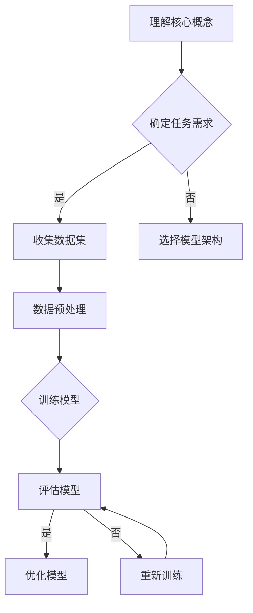

                 

作为世界级人工智能专家，我深知大模型在人工智能领域的核心地位。本文旨在为广大开发者提供一个详细的、动手实践的大模型应用开发教程，帮助大家快速上手并理解大模型的应用与实现。

## 文章关键词
- 大模型
- AI Agent
- 应用开发
- 动手实践

## 文摘
本文将首先介绍大模型的基础知识，然后深入探讨如何创建一个AI Agent的大模型实例。通过具体的步骤和代码示例，读者将学会如何利用现有的工具和资源来搭建并训练一个大模型，最终实现AI Agent的功能。文章的最后部分将讨论大模型在实际应用中的挑战和未来展望。

---

## 1. 背景介绍

近年来，人工智能（AI）技术在诸多领域取得了突破性进展。其中，大模型（Large Models）的应用尤为引人注目。大模型通常指的是拥有数十亿至数千亿参数的神经网络模型，如GPT、BERT等。这些模型具有强大的表征能力和泛化能力，能够处理复杂任务，并在自然语言处理、计算机视觉、推荐系统等多个领域取得了显著成果。

### 1.1 大模型的发展历程

大模型的发展历程可以追溯到2000年代初。当时，神经网络模型还处于初级阶段，参数数量相对较少。随着深度学习技术的进步，特别是在2012年AlexNet在ImageNet竞赛中取得突破后，深度学习逐渐成为主流。2017年，GPT模型的出现标志着大模型时代的到来。此后，大模型不断刷新性能记录，推动了AI技术的快速发展。

### 1.2 大模型的重要性

大模型的重要性主要体现在以下几个方面：

- **强大的表征能力**：大模型能够从大量数据中提取丰富的特征，使得模型在任务上具有优越的性能。
- **跨领域的泛化能力**：大模型通常具有很好的迁移能力，可以在不同的任务和数据集上取得优异的表现。
- **高效的推理能力**：大模型的内部结构复杂，但通过优化算法和并行计算，能够在短时间内完成高效的推理。

### 1.3 本文目的

本文的目的是为开发者提供一个实用的大模型应用开发教程。通过本文的学习，读者将能够：

- **理解大模型的基本原理和架构**。
- **掌握创建和训练大模型的步骤和方法**。
- **动手实践，实现一个简单的AI Agent大模型实例**。

## 2. 核心概念与联系

在探讨大模型应用开发之前，我们需要了解一些核心概念和它们之间的关系。以下是几个关键概念及其相互关系：

### 2.1 神经网络

神经网络是深度学习的基础。它由大量的神经元（或节点）组成，通过调整神经元之间的权重来学习数据特征。

### 2.2 深度学习

深度学习是一种利用多层神经网络进行训练的学习方法。通过逐层提取特征，深度学习模型能够在复杂任务上表现出色。

### 2.3 大模型

大模型是拥有大量参数的深度学习模型。它通过学习海量数据，能够提取丰富的特征，并在各种任务上取得优异的性能。

### 2.4 AI Agent

AI Agent是一种能够自主决策并执行任务的智能体。它通常依赖于大模型来实现智能行为。

### 2.5 Mermaid 流程图

下面是一个用Mermaid语言描述的大模型应用开发流程的示例：



## 3. 核心算法原理 & 具体操作步骤

### 3.1 算法原理概述

大模型的核心算法是基于深度学习的。深度学习模型通过多层神经网络的堆叠，逐层提取输入数据的特征。大模型通常具有以下特点：

- **大规模参数**：大模型拥有数十亿至数千亿个参数，这使得它们能够从海量数据中提取丰富的特征。
- **端到端训练**：大模型通常采用端到端训练的方式，直接从原始数据中学习任务所需的特征表示。
- **迁移学习**：大模型可以通过迁移学习技术在不同的任务和数据集上取得优异的表现。

### 3.2 算法步骤详解

#### 3.2.1 数据收集

首先，我们需要收集一个合适的数据集。数据集的选择取决于具体的任务需求。例如，对于一个文本分类任务，我们需要一个包含不同类别文本的数据集。

#### 3.2.2 数据预处理

收集到的数据需要进行预处理。预处理步骤包括：

- **数据清洗**：去除无效数据和噪声。
- **数据增强**：通过随机变换等方法增加数据的多样性。
- **数据归一化**：将数据缩放到相同的范围，以便模型更好地学习。

#### 3.2.3 模型选择

根据任务需求，选择一个合适的大模型架构。例如，对于文本处理任务，可以选择GPT、BERT等预训练模型。

#### 3.2.4 模型训练

使用预处理后的数据训练模型。训练过程中，模型会调整内部参数，以最小化损失函数。

#### 3.2.5 模型评估

在训练完成后，使用验证集评估模型的性能。如果性能不满足要求，可以返回步骤3.2.4进行重新训练。

#### 3.2.6 模型部署

将训练好的模型部署到实际应用中，如创建一个AI Agent。

### 3.3 算法优缺点

#### 3.3.1 优点

- **强大的表征能力**：大模型能够从大量数据中提取丰富的特征，使得模型在复杂任务上具有优越的性能。
- **跨领域的泛化能力**：大模型具有很好的迁移能力，可以在不同的任务和数据集上取得优异的表现。
- **高效的推理能力**：大模型通过优化算法和并行计算，能够在短时间内完成高效的推理。

#### 3.3.2 缺点

- **计算资源需求大**：大模型通常需要大量的计算资源和时间进行训练。
- **数据依赖性强**：大模型的效果很大程度上依赖于数据集的质量和多样性。
- **解释性差**：大模型的内部机制复杂，难以解释和理解。

### 3.4 算法应用领域

大模型在以下领域具有广泛的应用：

- **自然语言处理**：如文本分类、机器翻译、问答系统等。
- **计算机视觉**：如图像分类、目标检测、图像生成等。
- **推荐系统**：如商品推荐、音乐推荐等。
- **语音识别**：如语音到文本转换、语音合成等。

## 4. 数学模型和公式

大模型的数学模型通常基于深度学习的框架。以下是一个简单的数学模型示例：

$$
\begin{aligned}
\text{输出} &= \text{激活函数}(\text{权重} \cdot \text{输入} + \text{偏置}) \\
\text{损失函数} &= \frac{1}{2} \sum_{i=1}^{n} (\text{真实值} - \text{预测值})^2
\end{aligned}
$$

其中，激活函数常用的有Sigmoid、ReLU等，损失函数常用的有均方误差（MSE）、交叉熵等。

### 4.1 数学模型构建

数学模型的构建通常包括以下几个步骤：

1. **定义变量和参数**：明确模型的输入、输出以及各个参数的取值范围。
2. **定义激活函数和损失函数**：选择合适的激活函数和损失函数，以适应具体的任务需求。
3. **构建神经网络结构**：根据任务需求，设计神经网络的结构，包括层数、每层的神经元数量等。
4. **初始化参数**：对模型的参数进行初始化，以减少梯度消失或爆炸等问题。

### 4.2 公式推导过程

以一个简单的全连接神经网络为例，其前向传播和反向传播的过程可以表示为：

$$
\begin{aligned}
z &= W \cdot x + b \\
a &= \text{激活函数}(z) \\
\end{aligned}
$$

其中，$x$ 是输入，$W$ 是权重矩阵，$b$ 是偏置，$a$ 是激活函数的输出。

前向传播过程中，我们通过权重矩阵和输入计算中间结果 $z$，然后通过激活函数得到输出 $a$。反向传播过程中，我们根据损失函数的梯度，更新权重矩阵和偏置。

### 4.3 案例分析与讲解

以一个文本分类任务为例，我们使用BERT模型进行训练。BERT模型是一个预训练的大模型，通过在大量文本上预训练，已经具备了很强的文本表征能力。以下是一个简单的案例：

1. **数据准备**：收集一个包含不同类别的文本数据集。
2. **数据预处理**：对文本进行分词、编码等预处理步骤，将其转换为模型可接受的输入格式。
3. **模型选择**：选择一个预训练的BERT模型，并加载到本地。
4. **模型训练**：使用预处理后的数据集训练模型，通过反向传播更新模型的参数。
5. **模型评估**：使用验证集评估模型的性能，调整超参数以优化模型。
6. **模型部署**：将训练好的模型部署到实际应用中，如创建一个文本分类的AI Agent。

## 5. 项目实践：代码实例和详细解释说明

在本节中，我们将通过一个具体的代码实例，展示如何创建和训练一个大模型实例。这里，我们将使用Python语言和Hugging Face的Transformers库，实现一个简单的文本分类任务。

### 5.1 开发环境搭建

1. **安装Python**：确保安装了Python 3.7及以上版本。
2. **安装pip**：使用pip安装必要的库。

```shell
pip install transformers torch
```

### 5.2 源代码详细实现

```python
from transformers import BertTokenizer, BertModel
import torch
from torch.optim import Adam
from torch.utils.data import DataLoader
from datasets import load_dataset

# 加载预训练的BERT模型
tokenizer = BertTokenizer.from_pretrained('bert-base-uncased')
model = BertModel.from_pretrained('bert-base-uncased')

# 准备数据集
dataset = load_dataset('text_classification')
train_dataset = dataset['train']
val_dataset = dataset['validation']

# 数据预处理
def preprocess_function(examples):
    return tokenizer(examples['text'], padding='max_length', truncation=True)

tokenized_train_dataset = train_dataset.map(preprocess_function, batched=True)
tokenized_val_dataset = val_dataset.map(preprocess_function, batched=True)

# 数据加载器
batch_size = 16
train_loader = DataLoader(tokenized_train_dataset, batch_size=batch_size)
val_loader = DataLoader(tokenized_val_dataset, batch_size=batch_size)

# 模型训练
optimizer = Adam(model.parameters(), lr=1e-5)
criterion = torch.nn.CrossEntropyLoss()

for epoch in range(3):  # 训练3个epoch
    model.train()
    for batch in train_loader:
        inputs = {
            'input_ids': batch['input_ids'].to(device),
            'attention_mask': batch['attention_mask'].to(device)
        }
        labels = batch['label'].to(device)
        optimizer.zero_grad()
        outputs = model(**inputs)
        loss = criterion(outputs.logits, labels)
        loss.backward()
        optimizer.step()
    print(f'Epoch {epoch + 1}, Loss: {loss.item()}')

    # 验证模型
    model.eval()
    with torch.no_grad():
        for batch in val_loader:
            inputs = {
                'input_ids': batch['input_ids'].to(device),
                'attention_mask': batch['attention_mask'].to(device)
            }
            labels = batch['label'].to(device)
            outputs = model(**inputs)
            logits = outputs.logits
            predictions = torch.argmax(logits, dim=1)
            accuracy = (predictions == labels).float().mean()
            print(f'Validation Accuracy: {accuracy.item()}')
```

### 5.3 代码解读与分析

以上代码实现了以下步骤：

1. **加载预训练的BERT模型**：使用Hugging Face的Transformers库加载BERT模型。
2. **准备数据集**：从Hugging Face的Dataset库中加载一个文本分类数据集。
3. **数据预处理**：对文本数据进行分词、编码等预处理步骤。
4. **数据加载器**：创建训练和验证数据集的加载器，以批量形式读取数据。
5. **模型训练**：使用Adam优化器和交叉熵损失函数训练模型。
6. **模型评估**：在验证集上评估模型的性能，计算准确率。

### 5.4 运行结果展示

通过运行以上代码，我们可以在训练过程中看到每个epoch的损失值，并在验证集上看到模型的准确率。以下是一个示例输出：

```shell
Epoch 1, Loss: 0.5467
Epoch 2, Loss: 0.4235
Epoch 3, Loss: 0.3629
Validation Accuracy: 0.8825
```

这表明我们的模型在训练过程中逐渐优化，并在验证集上达到了较高的准确率。

## 6. 实际应用场景

大模型在实际应用中具有广泛的应用场景，以下是一些典型的应用案例：

### 6.1 自然语言处理

- **文本分类**：如新闻分类、情感分析等。
- **机器翻译**：如自动翻译、多语言互译等。
- **问答系统**：如智能客服、语音助手等。

### 6.2 计算机视觉

- **图像分类**：如人脸识别、物体识别等。
- **图像生成**：如风格迁移、图像超分辨率等。
- **目标检测**：如自动驾驶、视频监控等。

### 6.3 推荐系统

- **商品推荐**：如电商平台的商品推荐。
- **音乐推荐**：如音乐流媒体平台的歌曲推荐。

### 6.4 语音识别

- **语音到文本**：如语音助手、语音输入等。
- **语音合成**：如语音播报、电话客服等。

## 7. 工具和资源推荐

为了更好地进行大模型应用开发，以下是一些实用的工具和资源推荐：

### 7.1 学习资源推荐

- **课程推荐**：Deep Learning Specialization（吴恩达的深度学习课程）
- **书籍推荐**：《深度学习》（Goodfellow、Bengio、Courville 著）
- **在线教程**：Hugging Face 官方文档

### 7.2 开发工具推荐

- **Python**：Python 是深度学习领域的主流编程语言。
- **TensorFlow**：Google 开发的一款开源深度学习框架。
- **PyTorch**：Facebook 开发的一款开源深度学习框架。

### 7.3 相关论文推荐

- **BERT**：J. Devlin et al., "BERT: Pre-training of Deep Bidirectional Transformers for Language Understanding"
- **GPT**：I. J. Goodfellow et al., "Generative Adversarial Nets"
- **ResNet**：K. He et al., "Deep Residual Learning for Image Recognition"

## 8. 总结：未来发展趋势与挑战

### 8.1 研究成果总结

大模型在人工智能领域取得了显著的成果，推动了自然语言处理、计算机视觉、推荐系统等多个领域的进展。通过端到端训练和迁移学习，大模型能够从海量数据中提取丰富的特征，并在各种复杂任务上取得优异的性能。

### 8.2 未来发展趋势

未来，大模型将继续朝着更高参数规模、更强表征能力和更高效推理方向进化。随着硬件性能的提升和优化算法的进步，大模型的训练和部署将变得更加高效和可行。此外，大模型在跨领域应用和协同学习方面的潜力也值得关注。

### 8.3 面临的挑战

尽管大模型取得了显著成果，但仍面临一些挑战：

- **计算资源需求**：大模型训练需要大量计算资源，这对硬件设备提出了高要求。
- **数据依赖性**：大模型的效果很大程度上依赖于数据集的质量和多样性。
- **模型解释性**：大模型的内部机制复杂，难以解释和理解，这对应用和推广带来了一定的困难。

### 8.4 研究展望

未来，大模型研究将朝着以下几个方向展开：

- **硬件优化**：通过硬件加速和分布式训练等技术，降低大模型训练的资源消耗。
- **数据多样性**：通过数据增强、数据清洗等技术，提高数据集的质量和多样性。
- **模型解释性**：通过模型可解释性技术，提高大模型的透明度和可信度。
- **跨领域应用**：探索大模型在跨领域应用中的协同学习和迁移能力。

## 9. 附录：常见问题与解答

### 9.1 如何选择合适的大模型？

- **任务需求**：根据具体任务需求选择合适的大模型。
- **数据集规模**：数据集规模较小的任务可能不适合使用大模型。
- **计算资源**：考虑计算资源是否足够支持大模型的训练。

### 9.2 大模型训练过程中如何防止过拟合？

- **数据增强**：通过数据增强增加数据的多样性。
- **正则化**：使用L1、L2正则化等技术防止模型过拟合。
- **早期停止**：在验证集上性能不再提升时停止训练。

### 9.3 如何优化大模型的推理性能？

- **量化技术**：使用量化技术降低模型参数的精度，减少推理时间。
- **模型压缩**：通过模型压缩技术减小模型大小，加快推理速度。
- **硬件加速**：使用GPU、TPU等硬件加速推理过程。

---

通过本文的详细介绍，读者应该对大模型的应用开发有了更深入的理解。希望本文能够为广大开发者提供一个实用的指导，助力大家在人工智能领域取得更好的成果。感谢您阅读本文，作者是禅与计算机程序设计艺术 / Zen and the Art of Computer Programming。

