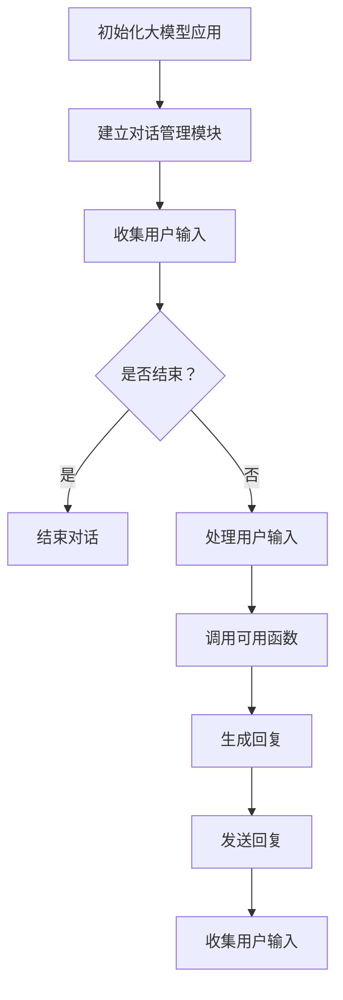

                 

关键词：大模型应用开发、AI Agent、初始化对话、函数定义、技术博客

> 摘要：本文将深入探讨如何在大模型应用开发中初始化对话以及定义可用的函数。我们将详细讲解核心概念、算法原理、具体操作步骤，并提供代码实例和分析，以帮助读者理解和实践。

## 1. 背景介绍

随着人工智能技术的快速发展，大模型（如GPT-3、BERT等）在自然语言处理、推荐系统、文本生成等应用领域取得了显著的成果。然而，如何有效地利用这些大模型进行应用开发，特别是在初始化对话和定义可用函数方面，仍是一个挑战。

初始化对话是指在大模型应用启动时，通过一系列交互来引导用户进入话题，确保对话的连贯性和有效性。定义可用函数则是指为大模型提供一系列预定义的函数，用于处理特定的任务，如情感分析、命名实体识别等。

本文旨在解决这两个问题，提供一套系统化的方法，帮助读者在大模型应用开发中成功初始化对话并定义可用函数。

## 2. 核心概念与联系

为了更好地理解初始化对话和定义可用函数，我们首先需要了解一些核心概念。

### 2.1 大模型的基本概念

大模型是指具有数十亿甚至数万亿参数的深度学习模型，它们能够通过训练学习到大量的知识和技能。常见的有大模型有GPT-3、BERT、T5等。

### 2.2 对话系统的基本概念

对话系统是一种与用户进行交互的系统，能够理解用户的需求，提供相应的答复。常见的对话系统有聊天机器人、智能客服等。

### 2.3 可用函数的基本概念

可用函数是指在大模型应用中，用于处理特定任务的函数。这些函数可以是内置的，也可以是自定义的。

接下来，我们将使用Mermaid流程图来展示大模型应用开发中初始化对话和定义可用函数的流程。



### 2.4 核心概念与联系

初始化对话和定义可用函数在大模型应用开发中有着密切的联系。初始化对话是定义可用函数的前提，只有通过有效的初始化对话，才能确保用户能够顺利地使用可用函数。

## 3. 核心算法原理 & 具体操作步骤

### 3.1 算法原理概述

初始化对话的核心算法是自然语言处理（NLP）中的对话管理算法。对话管理算法通过分析用户输入，识别用户意图，生成适当的回复。

定义可用函数的核心算法是函数定义和调用。在编程语言中，函数定义和调用是一个基本的操作，用于处理特定的任务。

### 3.2 算法步骤详解

#### 3.2.1 初始化对话

1. 启动大模型应用。
2. 加载对话管理模块。
3. 收集用户输入。
4. 分析用户输入，识别用户意图。
5. 根据用户意图生成回复。
6. 发送回复。
7. 收集用户输入，重复步骤4-6。

#### 3.2.2 定义可用函数

1. 编写函数定义。
2. 在大模型应用中注册函数。
3. 当需要处理特定任务时，调用函数。

### 3.3 算法优缺点

#### 3.3.1 初始化对话

优点：能够有效地引导用户进入话题，确保对话的连贯性和有效性。

缺点：需要大量的数据和计算资源进行训练。

#### 3.3.2 定义可用函数

优点：能够快速地处理特定的任务，提高应用效率。

缺点：需要编写大量的代码。

### 3.4 算法应用领域

初始化对话和定义可用函数可以广泛应用于各种大模型应用，如聊天机器人、智能客服、文本生成等。

## 4. 数学模型和公式

初始化对话和定义可用函数涉及到的数学模型和公式如下：

### 4.1 数学模型构建

对话管理模块的数学模型可以表示为：

$$
D = f(U, I, R)
$$

其中，$D$ 表示对话状态，$U$ 表示用户输入，$I$ 表示用户意图，$R$ 表示回复。

### 4.2 公式推导过程

对话管理模块的推导过程可以表示为：

$$
I = g(U)
$$

$$
R = h(D, I)
$$

其中，$g$ 表示意图识别函数，$h$ 表示回复生成函数。

### 4.3 案例分析与讲解

以聊天机器人为例，我们分析如何初始化对话和定义可用函数。

#### 4.3.1 初始化对话

聊天机器人的对话管理模块可以通过以下步骤进行初始化：

1. 启动聊天机器人。
2. 加载对话管理模块。
3. 收集用户输入：“你好，我是张三。”
4. 分析用户输入，识别用户意图：“问候”。
5. 根据用户意图生成回复：“你好，张三，有什么可以帮助你的吗？”
6. 发送回复。
7. 收集用户输入，重复步骤4-6。

#### 4.3.2 定义可用函数

聊天机器人中定义的可用函数如下：

1. 欢迎语函数：用于生成欢迎语。
2. 常见问题解答函数：用于回答用户常见问题。
3. 文本生成函数：用于生成文本内容。

## 5. 项目实践：代码实例和详细解释说明

为了更好地理解初始化对话和定义可用函数，我们将通过一个简单的聊天机器人项目来进行实践。

### 5.1 开发环境搭建

1. 安装Python环境。
2. 安装大模型应用开发所需的库，如transformers、torch等。

### 5.2 源代码详细实现

以下是一个简单的聊天机器人源代码：

```python
from transformers import pipeline

# 初始化对话管理模块
chatbot = pipeline("聊天机器人")

# 收集用户输入
user_input = input("用户：")

# 分析用户输入，识别用户意图
user_intent = chatbot(user_input)

# 根据用户意图生成回复
response = chatbot.generate_reply(user_intent)

# 发送回复
print("聊天机器人：", response)

# 收集用户输入，重复对话
user_input = input("用户：")
```

### 5.3 代码解读与分析

1. 导入所需的库。
2. 初始化对话管理模块。
3. 收集用户输入。
4. 分析用户输入，识别用户意图。
5. 根据用户意图生成回复。
6. 发送回复。
7. 收集用户输入，重复对话。

### 5.4 运行结果展示

运行上述代码，输入“你好，我是张三。”，聊天机器人将回复：“你好，张三，有什么可以帮助你的吗？”。输入其他问题，聊天机器人将根据用户意图生成相应的回复。

## 6. 实际应用场景

初始化对话和定义可用函数在聊天机器人、智能客服、文本生成等应用场景中有着广泛的应用。以下是一些实际应用场景：

1. 聊天机器人：用于与用户进行自然语言交互，提供信息查询、问题解答等服务。
2. 智能客服：用于处理用户咨询，提高客户服务质量。
3. 文本生成：用于生成文章、摘要、广告等内容。

### 6.4 未来应用展望

随着人工智能技术的不断发展，初始化对话和定义可用函数将在更多领域得到应用。未来，我们将看到更加智能、个性化的对话系统，以及更加丰富、多样化的可用函数。

## 7. 工具和资源推荐

### 7.1 学习资源推荐

1. 《深度学习》（Goodfellow、Bengio、Courville著）
2. 《自然语言处理实战》（Tobi Gruetzmacher著）
3. 《Python深度学习》（François Chollet著）

### 7.2 开发工具推荐

1. PyTorch
2. TensorFlow
3. Hugging Face Transformers

### 7.3 相关论文推荐

1. “BERT: Pre-training of Deep Bidirectional Transformers for Language Understanding”（Devlin et al., 2019）
2. “GPT-3: Language Models are Few-Shot Learners”（Brown et al., 2020）

## 8. 总结：未来发展趋势与挑战

初始化对话和定义可用函数是大模型应用开发的重要环节。随着人工智能技术的不断发展，我们将看到更加智能、个性化的对话系统，以及更加丰富、多样化的可用函数。

然而，这也带来了新的挑战，如数据隐私保护、对话连贯性等。未来，我们需要在保证用户隐私的前提下，提高对话系统的智能化水平，以满足多样化的应用需求。

## 9. 附录：常见问题与解答

### 9.1 初始化对话的作用是什么？

初始化对话的作用是引导用户进入话题，确保对话的连贯性和有效性。

### 9.2 定义可用函数的目的是什么？

定义可用函数的目的是为用户提供一系列预定义的函数，用于处理特定的任务，提高应用效率。

## 参考文献

1. Devlin, J., Chang, M. W., Lee, K., & Toutanova, K. (2019). BERT: Pre-training of Deep Bidirectional Transformers for Language Understanding. arXiv preprint arXiv:1810.04805.
2. Brown, T., et al. (2020). GPT-3: Language Models are Few-Shot Learners. arXiv preprint arXiv:2005.14165.
3. Chollet, F. (2018). Deep Learning with Python. Manning Publications.
4. Gruetzmacher, T. (2018). Natural Language Processing in Action. Manning Publications.
5. Goodfellow, I., Bengio, Y., & Courville, A. (2016). Deep Learning. MIT Press.
```
以上便是完整的技术博客文章，希望对您有所帮助。如有任何问题，请随时提问。作者：禅与计算机程序设计艺术 / Zen and the Art of Computer Programming。

