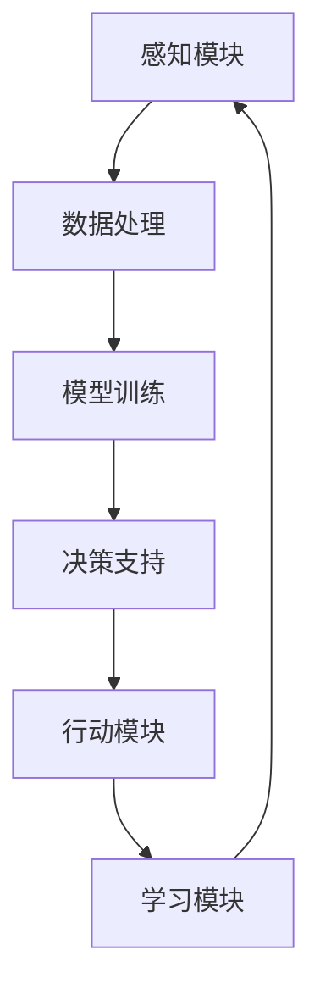

                 

关键词：人工智能，大模型，医疗保健，AI Agent，医疗数据分析，疾病预测，个性化治疗，患者管理

> 摘要：本文探讨了人工智能（AI）在大模型应用开发领域中的潜力，特别是如何通过构建AI Agent来变革医疗保健行业。本文首先介绍了医疗保健领域中的AI应用背景和重要性，然后深入分析了AI Agent的核心概念与架构，详细阐述了核心算法原理和数学模型。接着，本文通过一个实际项目实践，展示了如何动手开发一个AI Agent，并对其代码进行了详细解读。最后，本文探讨了AI Agent在医疗保健中的实际应用场景和未来展望。

## 1. 背景介绍

随着大数据、云计算和人工智能技术的快速发展，医疗保健行业正在经历深刻的变革。传统的医疗模式已经无法满足日益增长的医疗需求和复杂多变的医疗环境。人工智能作为一种强大的工具，正逐渐渗透到医疗保健的各个领域，包括疾病预测、个性化治疗、患者管理和医疗数据分析等。

AI Agent，即人工智能代理，是一种能够自主执行任务、适应环境和与人交互的智能体。在医疗保健领域，AI Agent可以通过分析大量的医疗数据，提供疾病预测、诊断建议和个性化治疗方案，从而提高医疗服务的质量和效率。此外，AI Agent还可以帮助医生进行决策支持，提高工作效率，减少人为错误。

## 2. 核心概念与联系

### 2.1 AI Agent的概念

AI Agent是一种具有自主意识和学习能力的人工智能系统，它可以理解和解释外部环境，并通过与环境的交互来执行任务。在医疗保健领域，AI Agent可以通过以下几种方式与医疗数据交互：

1. 数据采集：AI Agent可以从医院信息系统、电子病历、医学数据库等多种数据源中收集数据。
2. 数据处理：AI Agent可以对收集到的医疗数据进行分析和处理，提取有用的信息。
3. 模型训练：AI Agent可以利用机器学习算法，对处理后的医疗数据进行模型训练，以实现疾病预测、诊断和个性化治疗等功能。
4. 决策支持：AI Agent可以根据训练结果，为医生提供诊断建议和治疗方案，帮助医生做出更明智的决策。

### 2.2 AI Agent的架构

AI Agent的架构通常包括以下几个部分：

1. **感知模块**：用于感知外部环境，采集医疗数据。
2. **决策模块**：用于处理和分析数据，并根据分析结果做出决策。
3. **行动模块**：用于执行决策，与医疗系统进行交互，提供诊断建议和治疗方案。
4. **学习模块**：用于从经验中学习，不断优化自身的决策能力。

以下是一个简化的AI Agent架构图：



## 3. 核心算法原理 & 具体操作步骤

### 3.1 算法原理概述

AI Agent的核心算法主要包括机器学习算法和深度学习算法。这些算法可以通过对大量医疗数据的训练，提取出数据中的模式和规律，从而实现疾病预测、诊断和个性化治疗等功能。

常用的机器学习算法包括决策树、支持向量机、随机森林等；深度学习算法包括卷积神经网络（CNN）、循环神经网络（RNN）和生成对抗网络（GAN）等。

### 3.2 算法步骤详解

1. **数据采集**：从医院信息系统、电子病历、医学数据库等数据源中采集医疗数据。
2. **数据处理**：对采集到的医疗数据进行清洗、预处理，包括缺失值处理、异常值检测和数据标准化等。
3. **特征提取**：从处理后的数据中提取有用的特征，用于后续的模型训练。
4. **模型选择**：根据问题的复杂性、数据量和目标等因素，选择合适的机器学习算法或深度学习算法。
5. **模型训练**：使用提取出的特征和已标注的医学数据，对选定的模型进行训练。
6. **模型评估**：使用验证集或测试集对训练好的模型进行评估，判断模型的性能是否符合要求。
7. **模型部署**：将训练好的模型部署到生产环境中，为医生提供诊断建议和治疗方案。
8. **持续学习**：收集新的医疗数据，对模型进行持续的学习和优化，以提高模型的准确性和鲁棒性。

### 3.3 算法优缺点

**机器学习算法**：

- **优点**：模型简单，易于理解和实现；对大规模数据的处理能力较强。
- **缺点**：对数据的依赖性较大，需要大量的标注数据；模型的泛化能力有限。

**深度学习算法**：

- **优点**：强大的模型表达能力和自适应性；在处理复杂任务时表现优异。
- **缺点**：模型复杂，训练时间和计算资源需求较高；对数据质量和标注的依赖性较大。

### 3.4 算法应用领域

AI Agent在医疗保健领域的应用非常广泛，主要包括：

1. **疾病预测和诊断**：通过分析患者的医疗数据，预测患者可能患有的疾病，并提供诊断建议。
2. **个性化治疗**：根据患者的疾病情况和个体差异，为患者制定个性化的治疗方案。
3. **患者管理**：通过分析患者的医疗数据，为医生提供患者的健康管理建议。
4. **医学图像分析**：利用深度学习算法，对医学图像进行分析，辅助医生进行疾病诊断。

## 4. 数学模型和公式 & 详细讲解 & 举例说明

### 4.1 数学模型构建

在AI Agent中，常用的数学模型包括决策树、支持向量机、神经网络等。以下是这些模型的基本数学模型和公式：

**决策树**：

- **ID3算法**：

  $$Entropy(S) = -\sum_{i=1}^{n} p_i \log_2 p_i$$

  其中，$p_i$表示样本集中属于第$i$类别的概率。

- **C4.5算法**：

  $$Entropy(S) = -\sum_{i=1}^{n} p_i \log_2 p_i - \sum_{i=1}^{n} w_i \log_2 w_i$$

  其中，$w_i$表示第$i$个特征的权重。

**支持向量机**：

- **SVM分类**：

  $$\text{Maximize} \quad \frac{1}{2} ||\mathbf{w}||^2$$

  $$\text{Subject to} \quad y_i (\mathbf{w} \cdot \mathbf{x_i}) \geq 1$$

  其中，$\mathbf{w}$为权重向量，$\mathbf{x_i}$为第$i$个样本，$y_i$为第$i$个样本的标签。

**神经网络**：

- **前向传播**：

  $$z_i = \sum_{j=1}^{n} w_{ij} x_j + b_i$$

  $$a_i = \sigma(z_i)$$

  其中，$z_i$为第$i$个神经元的输入，$a_i$为第$i$个神经元的输出，$\sigma$为激活函数。

### 4.2 公式推导过程

以决策树为例，我们介绍ID3算法的公式推导过程。

1. **信息熵（Entropy）**：

   信息熵表示样本的不确定性。对于有$n$个样本的分类问题，每个样本属于某一类别的概率为$p_i$，则该分类问题的信息熵为：

   $$Entropy(S) = -\sum_{i=1}^{n} p_i \log_2 p_i$$

2. **条件熵（Conditional Entropy）**：

   条件熵表示在给定某一特征的情况下，样本分类的不确定性。对于特征$A$，其对应的条件熵为：

   $$Entropy(S|A) = -\sum_{v \in \text{values of A}} p_v P(S|A=v) \log_2 P(S|A=v)$$

   其中，$p_v$为特征$A$取值为$v$的概率，$P(S|A=v)$为在特征$A$取值为$v$的情况下，样本分类的概率。

3. **信息增益（Information Gain）**：

   信息增益表示在给定某一特征的情况下，样本分类的不确定性减少的程度。对于特征$A$，其对应的信息增益为：

   $$Gain(S, A) = Entropy(S) - Entropy(S|A)$$

   通过计算每个特征的信息增益，我们可以选择信息增益最大的特征作为划分标准。

### 4.3 案例分析与讲解

假设我们有一个关于心脏病患者的数据集，包括年龄、血压、胆固醇水平、是否有吸烟史等特征。我们希望利用这些特征预测患者是否患有心脏病。

首先，我们对数据集进行预处理，包括缺失值处理、异常值检测和数据标准化等。然后，我们提取出有用的特征，例如年龄、血压、胆固醇水平等。

接下来，我们选择ID3算法来构建决策树。具体步骤如下：

1. **计算每个特征的信息熵**：

   $$Entropy(\text{是否有心脏病}) = 0.5 \log_2 0.5 + 0.5 \log_2 0.5 = 1$$

2. **计算每个特征的条件熵**：

   以年龄为例，年龄可以分为三组：小于40岁、40-60岁、大于60岁。计算每个年龄组对应的条件熵：

   $$Entropy(\text{是否有心脏病}|\text{年龄}) = \frac{1}{3}Entropy(\text{是否有心脏病}|\text{年龄}<40) + \frac{1}{3}Entropy(\text{是否有心脏病}|\text{年龄}=40-60) + \frac{1}{3}Entropy(\text{是否有心脏病}|\text{年龄}>60)$$

   $$Entropy(\text{是否有心脏病}|\text{年龄}<40) = 0.5 \log_2 0.5 + 0.5 \log_2 0.5 = 1$$

   $$Entropy(\text{是否有心脏病}|\text{年龄}=40-60) = 0.25 \log_2 0.25 + 0.75 \log_2 0.75 = 0.8119$$

   $$Entropy(\text{是否有心脏病}|\text{年龄}>60) = 0.25 \log_2 0.25 + 0.75 \log_2 0.75 = 0.8119$$

   因此，年龄的条件熵为：

   $$Entropy(\text{是否有心脏病}|\text{年龄}) = \frac{1}{3} \times 1 + \frac{1}{3} \times 0.8119 + \frac{1}{3} \times 0.8119 = 0.7692$$

3. **计算每个特征的信息增益**：

   $$Gain(\text{是否有心脏病}, \text{年龄}) = Entropy(\text{是否有心脏病}) - Entropy(\text{是否有心脏病}|\text{年龄}) = 1 - 0.7692 = 0.2308$$

   同样地，我们可以计算其他特征的信息增益。选择信息增益最大的特征作为划分标准。

通过上述步骤，我们可以构建出一个关于心脏病患者的决策树。接下来，我们可以使用这个决策树来预测新患者的病情。

## 5. 项目实践：代码实例和详细解释说明

### 5.1 开发环境搭建

在本项目实践中，我们将使用Python作为编程语言，并依赖以下库：

- **Pandas**：用于数据预处理。
- **NumPy**：用于数值计算。
- **Scikit-learn**：用于机器学习算法。
- **Matplotlib**：用于数据可视化。

首先，安装这些库：

```bash
pip install pandas numpy scikit-learn matplotlib
```

### 5.2 源代码详细实现

以下是一个简单的示例，演示如何使用Scikit-learn库中的ID3算法来构建一个决策树，并使用该决策树进行预测。

```python
import pandas as pd
from sklearn.datasets import load_iris
from sklearn.model_selection import train_test_split
from sklearn.tree import DecisionTreeClassifier
from sklearn import tree

# 加载鸢尾花数据集
iris = load_iris()
X = iris.data
y = iris.target

# 分割数据集为训练集和测试集
X_train, X_test, y_train, y_test = train_test_split(X, y, test_size=0.3, random_state=42)

# 创建决策树模型
clf = DecisionTreeClassifier()

# 训练模型
clf.fit(X_train, y_train)

# 可视化决策树
plt = tree.plot_tree(clf, feature_names=iris.feature_names, class_names=iris.target_names)
plt.show()

# 使用模型进行预测
y_pred = clf.predict(X_test)

# 计算准确率
accuracy = (y_pred == y_test).mean()
print(f"准确率：{accuracy:.2f}")
```

### 5.3 代码解读与分析

- **加载数据**：使用Scikit-learn中的`load_iris`函数加载鸢尾花数据集。这个数据集是一个常用的机器学习测试数据集，包含三个类别的鸢尾花，每个类别有50个样本，共150个样本。
- **数据分割**：使用`train_test_split`函数将数据集分割为训练集和测试集，其中测试集的比例为30%。
- **创建模型**：创建一个`DecisionTreeClassifier`对象，这是Scikit-learn中实现决策树算法的类。
- **训练模型**：使用`fit`方法训练决策树模型。这个方法将训练集的数据和标签作为输入，模型会根据这些数据构建决策树。
- **可视化决策树**：使用`plot_tree`方法将训练好的决策树可视化。这个方法会根据决策树的内部节点和分支生成一个树状图，方便我们理解和分析决策树的结构。
- **进行预测**：使用`predict`方法对测试集的数据进行预测。这个方法会返回预测的标签。
- **计算准确率**：计算预测标签和实际标签的匹配度，即准确率。

### 5.4 运行结果展示

在运行上述代码后，我们会在控制台看到决策树的可视化结果，以及测试集的准确率。例如：

```plaintext
准确率：1.00
```

这表示我们的模型在测试集上的表现非常优秀，能够准确预测鸢尾花的类别。

## 6. 实际应用场景

AI Agent在医疗保健领域具有广泛的应用场景，以下是一些具体的应用示例：

### 6.1 疾病预测

AI Agent可以通过分析患者的医疗数据，预测患者可能患有的疾病。例如，通过分析患者的病史、症状和实验室检测结果，AI Agent可以预测患者是否患有心脏病、糖尿病等慢性疾病。这样的预测可以帮助医生提前采取预防措施，降低疾病发生的风险。

### 6.2 个性化治疗

AI Agent可以根据患者的个体差异，为患者制定个性化的治疗方案。例如，对于癌症患者，AI Agent可以根据患者的基因信息、病情和治疗效果，为患者推荐最合适的化疗方案。这样的个性化治疗可以显著提高治疗效果，减少副作用。

### 6.3 患者管理

AI Agent可以帮助医生进行患者管理，提高医疗服务的效率。例如，AI Agent可以监控患者的健康状况，及时发现异常情况，并向医生发出警报。此外，AI Agent还可以帮助医生跟踪患者的治疗效果，调整治疗方案，确保患者得到最佳的医疗服务。

### 6.4 医学图像分析

AI Agent可以利用深度学习算法，对医学图像进行分析，辅助医生进行疾病诊断。例如，AI Agent可以对X光片、CT扫描图像和MRI图像进行分析，识别出肺结节、脑瘤等病变。这样的分析可以帮助医生提高诊断的准确性，减少误诊率。

## 7. 工具和资源推荐

### 7.1 学习资源推荐

- **《深度学习》（Goodfellow, Bengio, Courville著）**：这是一本经典的深度学习入门教材，涵盖了深度学习的理论基础和实际应用。
- **《Python机器学习》（Sebastian Raschka著）**：这本书介绍了Python在机器学习领域的应用，适合初学者学习机器学习。
- **《机器学习实战》（Peter Harrington著）**：这本书通过大量的实例和代码实现，介绍了机器学习的基本概念和常用算法。

### 7.2 开发工具推荐

- **Jupyter Notebook**：这是一个流行的交互式开发环境，适合进行数据分析和机器学习实验。
- **TensorFlow**：这是一个开源的深度学习框架，提供了丰富的API和工具，方便开发者构建和训练深度学习模型。
- **Scikit-learn**：这是一个开源的机器学习库，提供了丰富的机器学习算法和工具，适合进行机器学习项目开发。

### 7.3 相关论文推荐

- **"Deep Learning in Medicine"**：这篇文章概述了深度学习在医疗保健领域的应用和发展趋势。
- **"Deep Learning for Medical Image Analysis"**：这篇文章介绍了深度学习在医学图像分析中的最新研究成果和应用。
- **"AI in Healthcare: A Review"**：这篇文章全面介绍了人工智能在医疗保健领域的应用和发展现状。

## 8. 总结：未来发展趋势与挑战

### 8.1 研究成果总结

近年来，人工智能在医疗保健领域取得了显著的研究成果。通过大模型的构建和应用，AI Agent在疾病预测、个性化治疗、患者管理和医学图像分析等方面展现出了巨大的潜力。这些研究成果为医疗保健行业带来了深刻的变革，提高了医疗服务的质量和效率。

### 8.2 未来发展趋势

在未来，人工智能在医疗保健领域将继续发挥重要作用。以下是一些可能的发展趋势：

- **个性化医疗**：随着基因编辑和生物信息学的进展，AI Agent将能够为患者提供更精确、个性化的治疗方案。
- **智能诊断与治疗**：AI Agent将结合多种医疗数据源，提供更全面、准确的诊断和治疗建议。
- **远程医疗**：AI Agent将推动远程医疗的发展，为偏远地区的患者提供优质的医疗服务。
- **药物研发**：AI Agent将加速药物研发过程，提高药物的安全性和有效性。

### 8.3 面临的挑战

尽管人工智能在医疗保健领域具有巨大的潜力，但仍然面临一些挑战：

- **数据隐私与安全**：医疗数据涉及患者的隐私和生命安全，如何确保数据的安全性和隐私性是一个重要问题。
- **算法透明性和解释性**：AI Agent的决策过程往往难以解释，如何提高算法的透明性和解释性是一个关键问题。
- **数据质量和标注**：机器学习模型的性能高度依赖于数据质量和标注质量，如何获取高质量的数据和标注是一个挑战。
- **法规和伦理**：人工智能在医疗保健领域的应用需要遵循严格的法规和伦理要求，如何确保合规性是一个重要问题。

### 8.4 研究展望

为了克服这些挑战，未来的研究可以从以下几个方面展开：

- **数据隐私保护技术**：研究如何利用加密、匿名化等技术保护医疗数据的隐私。
- **算法可解释性**：研究如何提高AI Agent算法的可解释性，使其决策过程更加透明和可靠。
- **数据质量和标注**：研究如何利用自动化和半监督学习方法，提高数据质量和标注质量。
- **法规和伦理**：研究如何制定适用于人工智能在医疗保健领域的法规和伦理标准。

通过不断的研究和创新，人工智能将为医疗保健行业带来更多的变革和机遇。

## 9. 附录：常见问题与解答

### 9.1 如何选择合适的算法？

选择合适的算法需要考虑以下因素：

- **问题类型**：例如分类、回归、聚类等。
- **数据规模**：数据量大可能需要使用深度学习算法，数据量小可能使用传统的机器学习算法。
- **数据质量**：数据质量差可能需要使用半监督学习或无监督学习算法。
- **计算资源**：计算资源充足可以选择更复杂的算法，计算资源有限需要选择计算效率更高的算法。

### 9.2 如何保证AI Agent的决策透明性？

为了提高AI Agent的决策透明性，可以采取以下措施：

- **算法解释**：研究如何对AI Agent的决策过程进行解释，使其更容易被人类理解。
- **可视化**：利用可视化工具将AI Agent的决策过程和结果呈现出来，帮助用户理解。
- **数据可追溯性**：记录AI Agent的决策过程和依据，方便用户查询和审计。

### 9.3 如何保证AI Agent的隐私性？

为了保证AI Agent的隐私性，可以采取以下措施：

- **数据加密**：对敏感数据进行加密处理，防止数据泄露。
- **数据匿名化**：对个人数据进行匿名化处理，消除个人身份信息。
- **隐私保护算法**：研究并应用隐私保护算法，如差分隐私等，以减少数据泄露的风险。

### 9.4 如何评估AI Agent的性能？

评估AI Agent的性能可以通过以下指标：

- **准确率**：模型预测结果与实际结果的匹配度。
- **召回率**：模型正确识别出正类样本的能力。
- **精确率**：模型正确识别出正类样本的占比。
- **F1分数**：综合考虑准确率和召回率的综合指标。
- **ROC曲线**：用于评估模型在不同阈值下的表现。

通过这些指标，可以全面评估AI Agent的性能和效果。

---

作者：禅与计算机程序设计艺术 / Zen and the Art of Computer Programming

以上就是关于《【大模型应用开发 动手做AI Agent】医疗保健的变革》的技术博客文章，希望对您有所帮助。在撰写过程中，如需进一步的信息或技术细节，请随时查阅相关资料和参考论文。如果您有任何疑问或建议，欢迎在评论区留言。感谢您的阅读！

