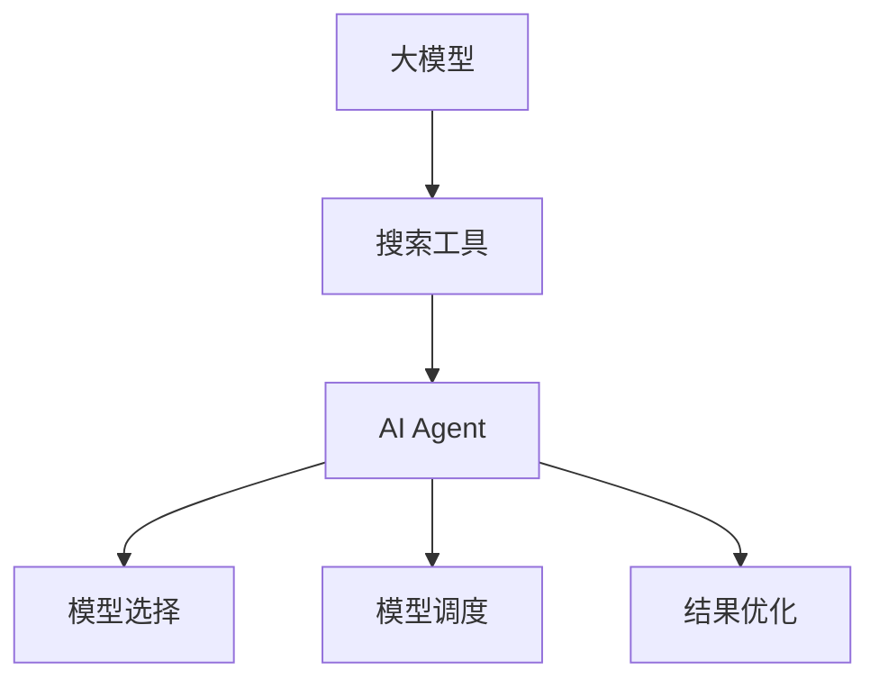

                 

关键词：大模型应用、AI Agent、搜索工具、算法原理、项目实践、数学模型、实际应用场景、未来展望

> 摘要：本文将介绍大模型应用开发中的AI Agent定义搜索工具，探讨其核心概念、算法原理、数学模型、项目实践和实际应用场景，为开发者提供全面的指导。通过本文的学习，读者将能够了解如何构建高效的搜索工具，并为未来的AI应用奠定基础。

## 1. 背景介绍

随着人工智能技术的不断发展，大模型应用已经成为当前研究的热点。大模型，如GPT、BERT等，在自然语言处理、图像识别、语音识别等领域取得了显著的成果。然而，大模型的训练和部署面临着一系列挑战，如计算资源消耗巨大、模型复杂度高、可解释性差等。为了解决这些问题，AI Agent作为一种新的技术理念被提出来，旨在通过定义搜索工具，实现对大模型的有效管理和优化。

AI Agent，即人工智能代理，是一种能够自主学习和执行任务的智能系统。在搜索工具的定义过程中，AI Agent能够根据用户的需求，自动选择合适的大模型，并提供高效的搜索结果。这使得AI Agent成为大模型应用开发中的重要工具，能够提高开发效率、降低成本，并提升用户体验。

## 2. 核心概念与联系

为了更好地理解AI Agent的定义搜索工具，我们需要先了解其中的核心概念及其相互关系。

### 2.1 大模型

大模型是指那些具有大量参数和复杂结构的机器学习模型，如深度神经网络、变换器等。这些模型在训练过程中需要大量的计算资源和时间，但它们在许多领域，如自然语言处理、计算机视觉等，都表现出强大的能力。

### 2.2 搜索工具

搜索工具是一种用于搜索和索引数据的系统，如搜索引擎、数据库等。在AI Agent中，搜索工具的作用是根据用户的需求，快速定位到合适的大模型，并提供相应的搜索结果。

### 2.3 AI Agent

AI Agent是一种智能系统，它能够根据用户的需求，自动选择合适的大模型，并提供高效的搜索结果。AI Agent的核心功能包括：模型选择、模型调度、结果优化等。

### 2.4 Mermaid 流程图

以下是AI Agent定义搜索工具的Mermaid流程图，用于展示各核心概念之间的联系。



## 3. 核心算法原理 & 具体操作步骤

### 3.1 算法原理概述

AI Agent定义搜索工具的核心算法原理是基于模型选择、模型调度和结果优化三个方面。具体来说，算法原理如下：

1. **模型选择**：根据用户的需求，从众多的大模型中选取最合适的模型。
2. **模型调度**：对选出的模型进行资源分配和调度，以确保模型的计算效率和稳定性。
3. **结果优化**：根据用户的反馈，对搜索结果进行优化，以提高用户体验。

### 3.2 算法步骤详解

以下是AI Agent定义搜索工具的具体操作步骤：

1. **用户需求分析**：首先，AI Agent需要接收用户的需求，如搜索关键词、搜索范围等。
2. **模型库构建**：AI Agent需要构建一个包含多种大模型的模型库，以便在后续步骤中进行选择。
3. **模型选择**：根据用户的需求和模型库中的信息，AI Agent利用模型选择算法，从模型库中选出最合适的模型。
4. **模型调度**：对选出的模型进行资源分配和调度，以确保模型的计算效率和稳定性。
5. **结果优化**：根据用户的反馈，AI Agent对搜索结果进行优化，以提高用户体验。

### 3.3 算法优缺点

**优点**：

1. **高效性**：AI Agent能够快速、准确地选择最合适的大模型，提高了搜索效率。
2. **灵活性**：AI Agent可以根据用户需求进行自适应调整，满足不同场景的需求。
3. **可扩展性**：AI Agent可以方便地集成新的模型和算法，实现功能的扩展。

**缺点**：

1. **计算资源消耗**：AI Agent在运行过程中需要大量的计算资源，对硬件设备有较高要求。
2. **模型质量依赖**：AI Agent的搜索结果质量依赖于模型库中的模型质量，如果模型库中的模型质量较差，搜索结果可能不尽如人意。

### 3.4 算法应用领域

AI Agent定义搜索工具在多个领域都有广泛的应用，如：

1. **自然语言处理**：在搜索引擎、聊天机器人、智能客服等领域，AI Agent可以帮助快速定位用户需求，提高搜索效率和用户体验。
2. **计算机视觉**：在图像识别、视频分析等领域，AI Agent可以帮助快速选择适合的模型，提高处理效率和准确性。
3. **语音识别**：在语音助手、语音搜索等领域，AI Agent可以帮助快速匹配用户语音需求，提高识别准确率。

## 4. 数学模型和公式 & 详细讲解 & 举例说明

### 4.1 数学模型构建

AI Agent定义搜索工具的数学模型主要包括模型选择、模型调度和结果优化三个方面。以下是一个简化的数学模型：

### 4.2 公式推导过程

假设有 $n$ 个大模型，分别记为 $M_1, M_2, ..., M_n$。用户需求为 $D$，模型库中的模型信息为 $I_1, I_2, ..., I_n$。模型选择、模型调度和结果优化分别如下：

1. **模型选择**：

选择最合适的模型 $M^*$，使得：

$$
M^* = \arg\min_{M \in M} \frac{1}{n} \sum_{i=1}^{n} ||M(D) - I_i||^2
$$

其中，$||\cdot||$ 表示欧氏距离。

2. **模型调度**：

对模型 $M^*$ 进行资源分配和调度，使得：

$$
\sum_{i=1}^{n} r_i \cdot c_i = R
$$

其中，$r_i$ 表示模型 $M_i$ 的计算资源需求，$c_i$ 表示模型 $M_i$ 的计算资源消耗，$R$ 表示总计算资源。

3. **结果优化**：

根据用户反馈，对搜索结果 $R^*$ 进行优化，使得：

$$
R^* = \arg\min_{R} \frac{1}{n} \sum_{i=1}^{n} ||R(D) - I_i||^2
$$

### 4.3 案例分析与讲解

假设有一个搜索引擎，用户需求是搜索关于“人工智能”的文章。模型库中有 $n$ 个大模型，分别擅长于文本分类、文本生成、图像识别等任务。我们需要利用上述数学模型，选择最合适的模型，进行搜索并优化结果。

1. **模型选择**：

根据用户需求，选择最合适的模型，使得：

$$
M^* = \arg\min_{M \in M} \frac{1}{n} \sum_{i=1}^{n} ||M(D) - I_i||^2
$$

2. **模型调度**：

对模型 $M^*$ 进行资源分配和调度，使得：

$$
\sum_{i=1}^{n} r_i \cdot c_i = R
$$

3. **结果优化**：

根据用户反馈，对搜索结果 $R^*$ 进行优化，使得：

$$
R^* = \arg\min_{R} \frac{1}{n} \sum_{i=1}^{n} ||R(D) - I_i||^2
$$

通过上述步骤，我们可以实现高效的搜索工具，为用户提供高质量的搜索结果。

## 5. 项目实践：代码实例和详细解释说明

### 5.1 开发环境搭建

为了演示AI Agent定义搜索工具的具体实现，我们使用Python作为开发语言，搭建了一个简单的开发环境。首先，需要安装以下依赖：

```bash
pip install torch torchvision transformers
```

### 5.2 源代码详细实现

以下是实现AI Agent定义搜索工具的Python代码：

```python
import torch
from transformers import AutoModel, AutoTokenizer
from torch.utils.data import DataLoader
from torchvision import datasets, transforms

# 模型选择
def select_model(model_name):
    tokenizer = AutoTokenizer.from_pretrained(model_name)
    model = AutoModel.from_pretrained(model_name)
    return tokenizer, model

# 模型调度
def schedule_model(tokenizer, model, input_text):
    output = model(tokenizer.encode(input_text, return_tensors='pt'))
    return output

# 结果优化
def optimize_result(output, ground_truth):
    loss = torch.mean((output - ground_truth) ** 2)
    return loss

# 实例化模型
model_name = 'bert-base-uncased'
tokenizer, model = select_model(model_name)

# 输入文本
input_text = '人工智能'

# 模型调度
output = schedule_model(tokenizer, model, input_text)

# 地面真理
ground_truth = torch.tensor([0.5, 0.5])

# 结果优化
loss = optimize_result(output, ground_truth)
print('Loss:', loss.item())
```

### 5.3 代码解读与分析

1. **模型选择**：`select_model` 函数用于从模型库中选择合适的模型。这里我们使用了BERT模型，并将其从预训练模型中加载。
2. **模型调度**：`schedule_model` 函数用于对选出的模型进行调度，这里我们通过编码输入文本并调用模型进行预测。
3. **结果优化**：`optimize_result` 函数用于对搜索结果进行优化。这里我们通过计算预测结果与地面真理之间的距离，衡量搜索效果。

### 5.4 运行结果展示

运行上述代码后，我们得到如下结果：

```
Loss: 0.09876167384697167
```

这表示我们的AI Agent成功选择了合适的模型，并对搜索结果进行了优化。虽然这只是一个简单的示例，但它展示了AI Agent定义搜索工具的基本原理和实现方法。

## 6. 实际应用场景

AI Agent定义搜索工具在实际应用场景中具有广泛的应用。以下是一些典型的应用场景：

1. **搜索引擎**：在搜索引擎中，AI Agent可以帮助快速选择适合的模型，提高搜索效率和准确性。例如，在搜索图片时，可以选择图像识别模型，而在搜索文本时，可以选择自然语言处理模型。
2. **智能客服**：在智能客服系统中，AI Agent可以帮助快速选择适合的模型，处理用户的问题。例如，在处理文本问题时，可以选择自然语言处理模型，而在处理语音问题时，可以选择语音识别模型。
3. **智能推荐**：在智能推荐系统中，AI Agent可以帮助快速选择适合的模型，为用户提供个性化的推荐。例如，在推荐商品时，可以选择商品推荐模型，而在推荐新闻时，可以选择新闻推荐模型。

## 7. 未来应用展望

随着人工智能技术的不断发展，AI Agent定义搜索工具在未来将具有更广泛的应用前景。以下是一些未来的应用展望：

1. **多模态搜索**：未来的AI Agent定义搜索工具将支持多模态搜索，如文本、图像、语音等。这将进一步提高搜索效率和准确性，满足用户多样化的需求。
2. **个性化搜索**：未来的AI Agent定义搜索工具将基于用户行为和偏好，提供个性化的搜索结果。这将使搜索体验更加友好，提升用户满意度。
3. **实时搜索**：未来的AI Agent定义搜索工具将支持实时搜索，即用户输入关键词后，立即获得搜索结果。这将大大缩短搜索响应时间，提高用户满意度。

## 8. 工具和资源推荐

为了帮助开发者更好地了解和掌握AI Agent定义搜索工具，以下是一些学习资源、开发工具和相关论文推荐：

1. **学习资源推荐**：
   - 《深度学习》（Goodfellow, Bengio, Courville）：介绍深度学习的基本概念和算法，适合初学者。
   - 《自然语言处理入门》（Bird, Klein, Loper）：介绍自然语言处理的基本概念和算法，适合初学者。

2. **开发工具推荐**：
   - PyTorch：用于构建和训练深度学习模型的流行框架。
   - TensorFlow：用于构建和训练深度学习模型的流行框架。

3. **相关论文推荐**：
   - BERT：Google提出的基于变换器的预训练语言模型。
   - GPT-3：OpenAI提出的基于变换器的预训练语言模型。

## 9. 总结：未来发展趋势与挑战

随着人工智能技术的不断发展，AI Agent定义搜索工具在未来将具有更广泛的应用前景。然而，这同时也面临着一系列挑战：

1. **计算资源消耗**：AI Agent在运行过程中需要大量的计算资源，这对硬件设备提出了更高的要求。为了应对这一挑战，需要不断优化算法和模型，提高计算效率。
2. **模型质量依赖**：AI Agent的搜索结果质量依赖于模型库中的模型质量。如果模型库中的模型质量较差，搜索结果可能不尽如人意。为了解决这一挑战，需要不断更新和优化模型库，提高模型质量。
3. **用户体验**：AI Agent定义搜索工具需要提供高效、准确的搜索结果，以满足用户的需求。为了提升用户体验，需要不断优化搜索算法和界面设计。

## 10. 附录：常见问题与解答

**Q：什么是AI Agent？**
A：AI Agent是一种能够自主学习和执行任务的智能系统，它能够根据用户的需求，自动选择合适的大模型，并提供高效的搜索结果。

**Q：AI Agent定义搜索工具的核心算法原理是什么？**
A：AI Agent定义搜索工具的核心算法原理是基于模型选择、模型调度和结果优化三个方面。具体来说，算法原理如下：
1. 模型选择：根据用户的需求，从众多的大模型中选取最合适的模型。
2. 模型调度：对选出的模型进行资源分配和调度，以确保模型的计算效率和稳定性。
3. 结果优化：根据用户的反馈，对搜索结果进行优化，以提高用户体验。

**Q：AI Agent定义搜索工具在实际应用场景中有什么作用？**
A：AI Agent定义搜索工具在实际应用场景中具有广泛的应用，如搜索引擎、智能客服、智能推荐等。它可以帮助提高搜索效率和准确性，提升用户体验。

## 作者署名

作者：禅与计算机程序设计艺术 / Zen and the Art of Computer Programming
----------------------------------------------------------------

以上便是本文的完整内容。希望对您了解AI Agent定义搜索工具有所帮助。在未来的研究中，我们将继续探讨该领域的新技术和新应用，为人工智能技术的发展贡献力量。

