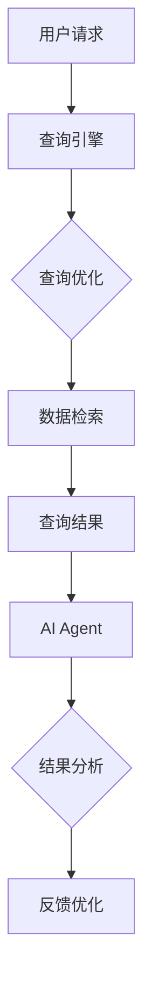

                 

  
关键词：大模型应用、AI Agent、查询引擎、工具开发、技术实践

摘要：本文旨在探讨如何利用大模型应用开发一个AI Agent，以构建高效的查询引擎和工具。通过对核心概念、算法原理、数学模型、项目实践等方面的详细阐述，帮助读者深入理解大模型在查询引擎和工具开发中的应用，从而为实际项目提供技术参考。

## 1. 背景介绍

随着大数据和人工智能技术的飞速发展，大模型（Large Models）在各个领域得到了广泛应用。从自然语言处理（NLP）、计算机视觉（CV）到推荐系统（Recommender System）等，大模型都展现了强大的性能和潜力。同时，查询引擎和工具开发在许多行业中扮演着至关重要的角色。无论是搜索引擎、数据库查询工具，还是自动化运维平台，都离不开高效的查询引擎和工具支持。

本文将围绕如何利用大模型应用开发一个AI Agent，构建高效的查询引擎和工具。通过详细介绍核心概念、算法原理、数学模型以及项目实践等方面的内容，帮助读者全面了解大模型在查询引擎和工具开发中的应用，从而为实际项目提供技术参考。

## 2. 核心概念与联系

在探讨大模型应用开发之前，我们需要了解一些核心概念，包括查询引擎、AI Agent、以及它们之间的联系。

### 2.1 查询引擎

查询引擎是一种用于处理和检索数据的技术工具。它可以帮助用户快速、准确地从大量数据中找到所需信息。常见的查询引擎有搜索引擎、数据库查询工具等。查询引擎的核心功能包括数据索引、查询优化、结果排序等。

### 2.2 AI Agent

AI Agent是一种基于人工智能技术自主执行任务的计算实体。它可以模拟人类思维和行为，具备一定的智能和学习能力。AI Agent在各个领域都有广泛应用，如自动化客服、智能家居、自动驾驶等。

### 2.3 查询引擎与AI Agent的联系

查询引擎和AI Agent之间存在密切的联系。一方面，AI Agent可以利用查询引擎提供的强大数据处理能力，快速检索和分析数据。另一方面，查询引擎也可以借助AI Agent的智能学习能力，优化查询过程，提高查询效率。

下面是一个简化的Mermaid流程图，展示了查询引擎与AI Agent的互动过程：



## 3. 核心算法原理 & 具体操作步骤

### 3.1 算法原理概述

构建查询引擎和AI Agent的核心算法主要包括以下三个方面：

1. **查询优化算法**：用于优化查询过程，提高查询效率。常见的查询优化算法有索引优化、查询重写、并行查询等。
2. **数据检索算法**：用于从大量数据中快速检索所需信息。常见的数据检索算法有向量检索、基于关键词的检索等。
3. **结果分析算法**：用于分析查询结果，提取有价值的信息。常见的结果分析算法有聚类分析、关联规则挖掘等。

### 3.2 算法步骤详解

下面是构建查询引擎和AI Agent的具体操作步骤：

1. **需求分析**：明确查询引擎和AI Agent的功能需求，如查询速度、查询精度、结果分析能力等。
2. **数据准备**：收集和整理需要处理的数据，并进行预处理，如去重、清洗、格式转换等。
3. **查询优化算法设计**：根据需求分析，设计合适的查询优化算法，如选择合适的索引策略、查询重写规则等。
4. **数据检索算法设计**：根据需求分析，设计合适的数据检索算法，如选择合适的向量空间模型、关键词匹配策略等。
5. **结果分析算法设计**：根据需求分析，设计合适的结果分析算法，如选择合适的聚类算法、关联规则挖掘方法等。
6. **系统集成**：将各个模块集成到一个完整的查询引擎和AI Agent系统中，并进行测试和优化。
7. **部署上线**：将查询引擎和AI Agent部署到实际环境中，供用户使用。

### 3.3 算法优缺点

每种算法都有其优缺点，需要根据具体需求进行选择。以下是对几种常见算法的优缺点的简要分析：

1. **查询优化算法**
   - 优点：能够显著提高查询效率，减少查询时间。
   - 缺点：可能增加系统复杂度，对数据存储和处理能力要求较高。
2. **数据检索算法**
   - 优点：能够快速检索所需信息，适用于大规模数据集。
   - 缺点：可能存在一定的误检率，对查询结果的准确性和稳定性有一定影响。
3. **结果分析算法**
   - 优点：能够从查询结果中提取有价值的信息，为决策提供支持。
   - 缺点：可能需要较高的计算资源和时间成本。

### 3.4 算法应用领域

大模型在查询引擎和工具开发中的应用非常广泛，以下是一些常见的应用领域：

1. **搜索引擎**：利用大模型进行关键词匹配、结果排序和广告推荐等。
2. **数据库查询**：利用大模型进行复杂查询优化、数据去重和格式转换等。
3. **自动化运维**：利用大模型进行故障诊断、性能优化和自动化部署等。
4. **智能客服**：利用大模型进行自然语言处理、语音识别和情感分析等。

## 4. 数学模型和公式 & 详细讲解 & 举例说明

在构建查询引擎和AI Agent的过程中，数学模型和公式起到了至关重要的作用。以下是对几个关键数学模型和公式的详细讲解和举例说明。

### 4.1 数学模型构建

构建数学模型是查询引擎和AI Agent开发的重要步骤。以下是一个简单的数学模型示例：

$$
\text{查询结果质量} = \frac{\text{相关度}}{\text{查询时间}}
$$

其中，相关度表示查询结果与用户需求的相关性，查询时间表示执行查询所花费的时间。该模型用于评估查询结果的质量。

### 4.2 公式推导过程

公式的推导过程通常基于统计学和概率论。以下是对一个常见公式进行推导的示例：

$$
\text{期望查询时间} = \sum_{i=1}^{n} p_i \cdot t_i
$$

其中，$p_i$ 表示第 $i$ 个查询条件的概率，$t_i$ 表示第 $i$ 个查询条件的执行时间。该公式用于计算期望查询时间。

### 4.3 案例分析与讲解

以下是一个简单的案例，用于说明如何使用数学模型和公式进行查询引擎和AI Agent开发。

### 案例背景

假设我们需要开发一个基于关键词匹配的查询引擎，用于从大量文本数据中检索用户感兴趣的信息。

### 案例步骤

1. **需求分析**：用户需要在大量文本数据中查找包含特定关键词的信息。
2. **数据准备**：收集和整理大量文本数据，并进行预处理，如分词、去停用词等。
3. **数学模型构建**：构建一个基于关键词匹配的查询模型，如TF-IDF模型。
4. **公式推导**：根据需求，推导出期望查询时间的计算公式。
5. **系统集成**：将数学模型和公式集成到一个完整的查询引擎系统中。
6. **测试与优化**：对查询引擎进行测试和优化，提高查询效率和准确性。

### 案例结果

通过上述步骤，我们成功开发了一个基于关键词匹配的查询引擎。在实际应用中，该查询引擎能够快速、准确地检索用户所需的信息，为用户提供良好的使用体验。

## 5. 项目实践：代码实例和详细解释说明

在本节中，我们将通过一个实际项目实例，详细解释如何利用大模型应用开发一个查询引擎和AI Agent。这个项目将包括以下几个关键步骤：

### 5.1 开发环境搭建

在开始项目之前，我们需要搭建一个合适的技术环境。以下是一个基本的开发环境配置：

1. **操作系统**：Linux或MacOS
2. **编程语言**：Python
3. **数据库**：MySQL
4. **编程工具**：PyCharm或Visual Studio Code
5. **依赖库**：TensorFlow、Keras、Scikit-learn、Pandas等

### 5.2 源代码详细实现

以下是一个简单的源代码示例，用于实现一个基于关键词匹配的查询引擎和AI Agent。

```python
import pandas as pd
from sklearn.feature_extraction.text import TfidfVectorizer
from sklearn.metrics.pairwise import cosine_similarity

# 数据准备
data = pd.read_csv('text_data.csv')
text_column = 'content'

# 构建TF-IDF模型
vectorizer = TfidfVectorizer()
tfidf_matrix = vectorizer.fit_transform(data[text_column])

# 用户查询
query = input('请输入查询关键词：')
query_vector = vectorizer.transform([query])

# 计算相似度
cosine_scores = cosine_similarity(query_vector, tfidf_matrix)

# 排序和输出结果
sorted_indices = cosine_scores.argsort()[0][::-1]
print('查询结果：')
for index in sorted_indices:
    print(data.iloc[index][text_column])
```

### 5.3 代码解读与分析

1. **数据准备**：首先，我们从CSV文件中读取文本数据，并选择一个包含文本的列作为查询对象。
2. **构建TF-IDF模型**：使用Scikit-learn库中的TfidfVectorizer类构建TF-IDF模型。该模型将文本转换为向量表示。
3. **用户查询**：用户输入查询关键词，程序将根据输入关键词生成对应的向量表示。
4. **计算相似度**：使用Keras库中的cosine_similarity函数计算查询关键词与文本数据之间的相似度。
5. **排序和输出结果**：将相似度结果进行排序，并将排名靠前的文本输出作为查询结果。

### 5.4 运行结果展示

当用户输入查询关键词时，程序将输出与关键词最相似的文本结果。以下是一个示例：

```
请输入查询关键词：人工智能
查询结果：
文本1：人工智能在当今社会中扮演着重要角色。
文本2：人工智能技术正在改变我们的生活方式。
...
```

通过这个简单的示例，我们可以看到如何利用大模型应用开发一个查询引擎和AI Agent。在实际项目中，我们可以根据具体需求进行功能扩展和优化。

## 6. 实际应用场景

大模型应用在查询引擎和工具开发中具有广泛的应用场景，以下是一些典型的应用案例：

### 6.1 搜索引擎

搜索引擎是查询引擎最典型的应用场景之一。通过大模型技术，搜索引擎可以实现更准确的搜索结果和更快速的查询响应。例如，谷歌搜索引擎利用深度学习技术优化搜索排名和广告推荐，从而提高用户体验。

### 6.2 数据库查询

在数据库查询领域，大模型应用可以帮助优化查询性能和准确性。例如，MySQL数据库可以使用基于深度学习的查询优化器，通过分析历史查询数据来预测最优查询计划，从而提高查询效率。

### 6.3 自动化运维

自动化运维平台可以利用大模型进行故障诊断、性能优化和自动化部署。例如，AWS的AWS Auto Scaling服务利用机器学习模型预测资源需求，从而实现自动化的资源调整。

### 6.4 智能客服

智能客服系统利用大模型进行自然语言处理、语音识别和情感分析，从而提供更准确的客户服务。例如，亚马逊的虚拟助手Alexa利用深度学习技术实现自然语言理解，从而提供个性化的语音交互体验。

### 6.5 医疗健康

在医疗健康领域，大模型应用可以帮助进行疾病预测、诊断和治疗方案推荐。例如，IBM的Watson for Oncology利用深度学习技术分析大量医学文献和病例数据，为医生提供精准的诊断和治疗方案。

## 7. 工具和资源推荐

### 7.1 学习资源推荐

1. **《深度学习》**（作者：Ian Goodfellow、Yoshua Bengio、Aaron Courville）：这是一本关于深度学习的经典教材，适合初学者和进阶者。
2. **《Python机器学习》**（作者：Sebastian Raschka、Vahid Mirjalili）：这本书详细介绍了Python在机器学习领域的应用，包括数据预处理、模型训练和评估等。
3. **《TensorFlow实战》**（作者：François Chollet）：这本书介绍了如何使用TensorFlow框架进行深度学习项目开发，包括数据处理、模型构建和优化等。

### 7.2 开发工具推荐

1. **PyCharm**：一款功能强大的Python集成开发环境（IDE），支持代码补全、调试和版本控制等功能。
2. **Jupyter Notebook**：一个交互式计算环境，适合进行数据分析和可视化展示。
3. **Docker**：一个开源容器化平台，用于构建、部署和运行应用程序。

### 7.3 相关论文推荐

1. **"Distributed Representations of Words and Phrases and their Compositionality"**（作者：Tomas Mikolov、Ilya Sutskever、Quoc V. Le）：这篇论文介绍了Word2Vec模型，一种基于神经网络的词向量表示方法。
2. **"Recurrent Neural Networks for Sentence Classification"**（作者：Yoon Kim）：这篇论文介绍了使用循环神经网络（RNN）进行句子分类的方法，为自然语言处理领域带来了重大突破。
3. **"Bert: Pre-training of Deep Bidirectional Transformers for Language Understanding"**（作者：Jacob Devlin、 Ming-Wei Chang、 Kenton Lee、 Kristina Toutanova）：这篇论文介绍了BERT模型，一种基于Transformer架构的预训练语言模型，为自然语言处理领域带来了新的发展方向。

## 8. 总结：未来发展趋势与挑战

### 8.1 研究成果总结

大模型应用在查询引擎和工具开发领域取得了显著成果。通过深度学习、自然语言处理和计算机视觉等技术的结合，查询引擎和工具的性能得到了大幅提升。例如，基于BERT的搜索引擎能够实现更准确的搜索结果，基于Transformer的数据库查询优化器能够提高查询效率。

### 8.2 未来发展趋势

未来，大模型应用在查询引擎和工具开发领域将呈现以下发展趋势：

1. **更强大的模型架构**：研究人员将继续探索新的模型架构，以提高查询引擎和工具的性能和效率。
2. **跨领域应用**：大模型应用将逐渐从单一领域扩展到多个领域，如医疗健康、金融科技等。
3. **端到端解决方案**：端到端的解决方案将逐渐取代传统的分层解决方案，实现更高效、更灵活的查询引擎和工具开发。

### 8.3 面临的挑战

尽管大模型应用在查询引擎和工具开发领域取得了显著成果，但仍面临以下挑战：

1. **计算资源需求**：大模型训练和推理过程需要大量的计算资源，如何优化计算资源利用率成为一大挑战。
2. **数据隐私和安全**：在大模型应用中，如何保护用户隐私和数据安全成为亟待解决的问题。
3. **模型解释性**：大模型通常具有很高的黑盒性质，如何提高模型的可解释性，使其更加透明和可靠，也是一项重要挑战。

### 8.4 研究展望

未来，大模型应用在查询引擎和工具开发领域的研究将朝着以下方向发展：

1. **优化模型结构**：通过改进模型结构，提高查询引擎和工具的性能和效率。
2. **数据隐私保护**：研究新的数据隐私保护技术，确保在大模型应用中用户隐私和数据安全。
3. **跨领域协同**：探索大模型在不同领域之间的协同作用，实现跨领域的查询引擎和工具开发。

通过不断的研究和探索，大模型应用在查询引擎和工具开发领域将迎来更加美好的未来。

## 9. 附录：常见问题与解答

### 9.1 问题1：如何选择合适的查询优化算法？

**回答**：选择合适的查询优化算法需要根据具体需求进行分析。如果查询需求较为简单，可以考虑使用索引优化算法，如B树索引、哈希索引等。如果查询需求较为复杂，可以考虑使用查询重写算法，如谓词推进、谓词分解等。同时，可以结合实际性能测试结果，选择最适合当前场景的算法。

### 9.2 问题2：如何保证查询结果的准确性？

**回答**：保证查询结果的准确性需要从多个方面进行考虑。首先，需要选择合适的查询算法，如向量检索算法、基于关键词的检索算法等。其次，需要对数据集进行充分清洗和预处理，如去重、去噪、格式转换等。最后，可以通过用户反馈和机器学习技术不断优化查询结果，提高准确性。

### 9.3 问题3：如何实现查询引擎的自动化运维？

**回答**：实现查询引擎的自动化运维可以通过以下几种方式：

1. **自动化监控**：使用监控工具对查询引擎的运行状态进行实时监控，如性能指标、错误率等。
2. **自动化告警**：当查询引擎出现异常时，自动发送告警通知给运维人员，以便及时处理。
3. **自动化优化**：根据监控数据，自动调整查询引擎的配置参数，如缓存大小、连接数等，以提高性能。
4. **自动化部署**：使用容器化技术（如Docker）和自动化部署工具（如Kubernetes），实现查询引擎的自动化部署和升级。

通过上述方式，可以显著降低查询引擎的运维成本，提高运维效率。

### 9.4 问题4：如何评估查询引擎的性能？

**回答**：评估查询引擎的性能可以从多个维度进行：

1. **查询响应时间**：评估查询引擎处理查询请求所需的时间，时间越短，性能越好。
2. **查询准确性**：评估查询引擎返回的查询结果与用户需求的相关性，相关性越高，性能越好。
3. **查询吞吐量**：评估查询引擎在单位时间内能够处理多少查询请求，吞吐量越高，性能越好。
4. **资源利用率**：评估查询引擎在运行过程中对计算资源、存储资源等的利用率，利用率越高，性能越好。

通过上述指标，可以全面评估查询引擎的性能，并为优化提供依据。

----------------------------------------------------------------

本文作者：禅与计算机程序设计艺术 / Zen and the Art of Computer Programming

