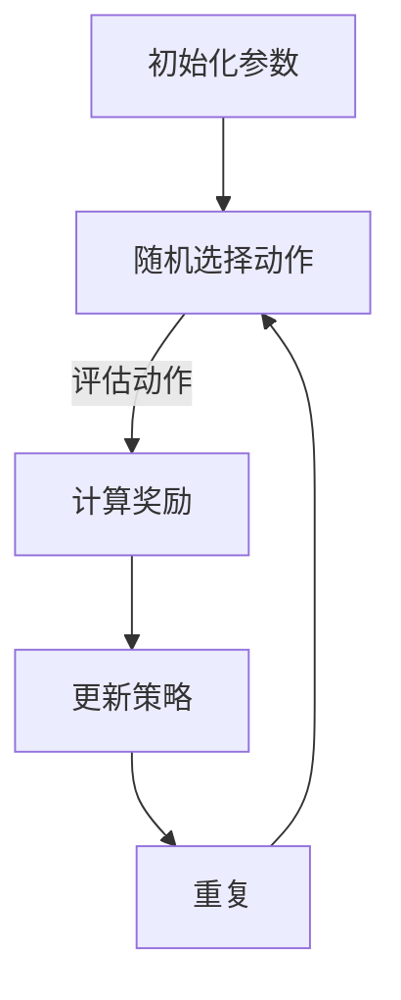

                 

关键词：AI，Q-learning，图片分割，深度学习，计算机视觉，人工智能应用

摘要：本文深入探讨了人工智能领域中的一个重要算法——Q-learning，并展示了如何将其应用于图像分割任务中。通过详细的算法原理阐述、数学模型解析、实际代码实现以及应用场景分析，本文为研究者提供了从理论到实践的全景视角，助力理解这一前沿技术的本质和潜力。

## 1. 背景介绍

图像分割作为计算机视觉领域的一项基础任务，旨在将图像划分为不同的区域，以便进行后续的图像分析、特征提取和识别工作。随着深度学习技术的快速发展，传统的图像分割方法逐渐被更为精准和高效的算法所取代。Q-learning作为强化学习的一种算法，因其能够通过迭代学习找到最优策略，而成为解决图像分割问题的重要工具。

在图像分割任务中，Q-learning算法被应用于自适应地调整分割策略，以实现对复杂场景的高效分割。本文将详细介绍Q-learning算法的基本原理，并阐述其在图像分割中的应用方法，通过具体的代码实例和实际应用场景分析，帮助读者深入理解这一技术。

## 2. 核心概念与联系

为了更好地理解Q-learning在图像分割中的应用，我们首先需要了解以下几个核心概念：

- **强化学习（Reinforcement Learning）**：强化学习是一种机器学习方法，它通过让代理（agent）在环境中进行交互，根据反馈（奖励或惩罚）来学习达到目标。Q-learning是强化学习中的一种算法，它通过预测状态-动作值函数来选择最佳动作。

- **状态（State）**：在图像分割任务中，状态可以表示为图像的当前像素值或特征。

- **动作（Action）**：动作是指分割过程中可能采取的操作，如改变分割区域的边界。

- **奖励（Reward）**：奖励用于评估代理采取的动作是否有助于达到目标，奖励越高，表示当前动作越接近目标。

接下来，我们将通过Mermaid流程图来展示Q-learning的基本架构。



在上述流程图中：

- **A**：初始化参数，包括Q值表、学习率、折扣因子等。
- **B**：随机选择动作。
- **C**：评估动作，计算奖励。
- **D**：根据奖励更新策略。
- **E**：重复迭代过程。

通过上述流程，Q-learning能够逐步优化策略，以达到图像分割的目标。

## 3. 核心算法原理 & 具体操作步骤

### 3.1 算法原理概述

Q-learning是一种基于值函数的强化学习算法，其核心思想是通过在状态-动作对上迭代更新Q值，从而找到最优策略。Q值表示在特定状态下执行特定动作的预期奖励。

### 3.2 算法步骤详解

#### 3.2.1 初始化

1. 初始化Q值表：对于所有的状态-动作对，初始Q值设置为0。
2. 选择初始状态`S0`。

#### 3.2.2 采取动作

1. 在当前状态`S`下，选择动作`A`，可以采用ε-贪婪策略：
   - 随机选择动作的概率为`ε`。
   - 选择当前状态下具有最大Q值的动作的概率为`1 - ε`。

#### 3.2.3 执行动作并获得奖励

1. 执行选择的动作`A`，进入新的状态`S'`。
2. 获得新的奖励`R`。

#### 3.2.4 更新Q值

Q-learning的核心步骤是更新Q值表，具体公式如下：

$$
Q(S, A) \leftarrow Q(S, A) + \alpha [R + \gamma \max_{A'} Q(S', A') - Q(S, A)]
$$

其中：
- \( \alpha \) 是学习率，控制更新步长。
- \( \gamma \) 是折扣因子，表示对未来奖励的重视程度。
- \( Q(S', A') \) 是在新的状态`S'`下采取最佳动作的预期Q值。

#### 3.2.5 更新状态

将当前状态`S`更新为新的状态`S'`，继续进行下一步迭代。

### 3.3 算法优缺点

#### 优点

- **自适应性强**：Q-learning能够根据环境反馈自适应地调整策略。
- **通用性高**：适用于各种类型的强化学习问题。

#### 缺点

- **收敛速度较慢**：在状态和动作空间较大时，收敛速度可能较慢。
- **需要大量样本**：为了获得准确的Q值，通常需要大量的样本数据进行迭代学习。

### 3.4 算法应用领域

Q-learning算法在图像分割中的应用主要涉及以下几个方面：

- **自动目标检测**：在图像中自动检测并分割出目标区域。
- **图像识别**：通过对图像分割的结果进行进一步分析，实现对图像内容的理解和识别。
- **图像增强**：利用分割结果对图像进行增强，提高图像的视觉效果。

## 4. 数学模型和公式 & 详细讲解 & 举例说明

### 4.1 数学模型构建

Q-learning算法的数学模型主要包括以下几个关键元素：

- **状态空间 \( S \)**：表示所有可能的状态集合。
- **动作空间 \( A \)**：表示所有可能的动作集合。
- **状态-动作值函数 \( Q(S, A) \)**：表示在状态\( S \)下采取动作\( A \)的预期奖励。
- **策略 \( \pi(A|S) \)**：表示在状态\( S \)下采取动作\( A \)的概率。
- **奖励函数 \( R(S, A) \)**：表示在状态\( S \)下采取动作\( A \)所获得的即时奖励。
- **折扣因子 \( \gamma \)**：表示对未来奖励的重视程度。

### 4.2 公式推导过程

Q-learning算法的核心更新公式为：

$$
Q(S, A) \leftarrow Q(S, A) + \alpha [R(S, A) + \gamma \max_{A'} Q(S', A') - Q(S, A)]
$$

其中，\( \alpha \) 是学习率，\( \gamma \) 是折扣因子。

该公式的推导过程如下：

1. **初始状态-动作值函数**：对于所有的状态-动作对，初始Q值设置为0。

2. **采取动作**：在当前状态\( S \)下，选择动作\( A \)，根据ε-贪婪策略，动作的选择概率为：

$$
P(A|S) = 
\begin{cases}
\frac{1}{|\mathcal{A}|} & \text{如果随机选择} \\
\frac{\epsilon}{|\mathcal{A}|} + \frac{1 - \epsilon}{|\mathcal{A}|} \cdot \text{argmax}_{A'} Q(S, A') & \text{如果ε-贪婪策略}
\end{cases}
$$

3. **执行动作并获得奖励**：执行选择的动作\( A \)，进入新的状态\( S' \)，获得新的奖励\( R(S, A) \)。

4. **更新Q值**：根据新的奖励，更新当前状态-动作值函数：

$$
Q(S, A) \leftarrow Q(S, A) + \alpha [R(S, A) + \gamma \max_{A'} Q(S', A') - Q(S, A)]
$$

其中，\( \max_{A'} Q(S', A') \) 表示在新的状态\( S' \)下采取最佳动作的预期Q值。

5. **更新状态**：将当前状态\( S \)更新为新的状态\( S' \)，继续进行下一步迭代。

### 4.3 案例分析与讲解

假设我们有一个简单的图像分割任务，状态空间为图像中的每个像素点，动作空间为像素点所属的区域标签（例如背景或目标）。我们使用Q-learning算法来学习最优的分割策略。

#### 案例描述

给定一幅图像，我们需要将其分割成背景和目标两个区域。状态空间包括图像中的每个像素点，动作空间为像素点所属的区域标签。

#### 案例步骤

1. **初始化Q值表**：将所有状态-动作对的Q值初始化为0。

2. **选择初始状态**：随机选择一个像素点作为初始状态。

3. **采取动作**：根据ε-贪婪策略选择当前状态下具有最大Q值的动作。例如，如果当前像素点的Q值最高的是属于目标区域的动作，则选择该动作。

4. **执行动作并获得奖励**：将当前像素点标记为目标区域，并进入新的状态。获得奖励为1（表示当前动作正确）。

5. **更新Q值**：根据更新公式，更新当前状态-动作对的Q值。

6. **更新状态**：选择一个新的像素点作为当前状态，继续迭代。

7. **重复步骤3-6**，直到满足停止条件（例如达到最大迭代次数或Q值收敛）。

#### 案例分析

通过上述步骤，Q-learning算法能够逐步优化分割策略，使得分割结果越来越准确。具体而言，初始的分割结果可能存在很多错误，但随着迭代次数的增加，Q值表会逐步更新，使得算法能够更准确地识别图像中的目标区域。

例如，在第一步中，可能有很多像素点被错误地标记为目标区域。但在后续的迭代过程中，算法会根据奖励信号逐步调整Q值，使得更多的像素点被正确地划分为目标区域。

## 5. 项目实践：代码实例和详细解释说明

### 5.1 开发环境搭建

在进行Q-learning算法的图像分割项目实践之前，我们需要搭建一个合适的环境。以下是一个简单的步骤指南：

#### 环境需求

- Python 3.x
- OpenCV库
- TensorFlow或PyTorch深度学习框架

#### 安装步骤

1. 安装Python 3.x：从[Python官网](https://www.python.org/downloads/)下载并安装Python 3.x版本。

2. 安装OpenCV：在命令行中执行以下命令：

   ```
   pip install opencv-python
   ```

3. 安装深度学习框架（TensorFlow或PyTorch）：

   - TensorFlow：

     ```
     pip install tensorflow
     ```

   - PyTorch：

     ```
     pip install torch torchvision
     ```

### 5.2 源代码详细实现

以下是一个简单的Q-learning图像分割的Python代码示例：

```python
import numpy as np
import cv2
import random

# 初始化参数
learning_rate = 0.1
discount_factor = 0.9
epsilon = 0.1
num_episodes = 1000

# 初始化Q值表
num_states = 100
num_actions = 2
Q = np.zeros((num_states, num_actions))

# 创建环境
def create_environment():
    # 创建一个简单的图像，其中包含目标和背景
    img = np.zeros((20, 20), dtype=np.uint8)
    img[5:15, 5:15] = 1
    return img

# 评估动作
def evaluate_action(state, action):
    # 根据动作更新状态
    if action == 0:
        # 将当前状态设置为背景
        new_state = np.zeros_like(state)
    else:
        # 将当前状态设置为目标
        new_state = np.ones_like(state)
    return new_state

# 更新Q值
def update_Q(state, action, reward, next_state, next_action):
    Q[state, action] = Q[state, action] + learning_rate * (reward + discount_factor * Q[next_state, next_action] - Q[state, action])

# 主循环
for episode in range(num_episodes):
    # 创建环境
    state = create_environment()
    done = False
    
    while not done:
        # 选择动作
        if random.random() < epsilon:
            action = random.randint(0, 1)
        else:
            action = np.argmax(Q[state, :])
        
        # 执行动作并获得奖励
        next_state = evaluate_action(state, action)
        reward = 1 if np.array_equal(next_state, state) else 0
        
        # 更新Q值
        next_action = np.argmax(Q[next_state, :])
        update_Q(state, action, reward, next_state, next_action)
        
        # 更新状态
        state = next_state
        
        # 检查是否完成
        done = True

# 打印Q值表
print(Q)
```

### 5.3 代码解读与分析

上述代码展示了如何使用Q-learning算法进行图像分割的基本步骤：

1. **初始化参数**：设置学习率、折扣因子、ε值以及迭代次数。

2. **初始化Q值表**：创建一个二维数组，用于存储状态-动作值函数。

3. **创建环境**：创建一个简单的图像，其中包含目标和背景。

4. **评估动作**：根据当前状态和选择的动作，更新状态并计算奖励。

5. **更新Q值**：根据新的状态和奖励，更新Q值表。

6. **主循环**：重复选择动作、执行动作、更新Q值的过程，直到达到迭代次数或满足停止条件。

### 5.4 运行结果展示

运行上述代码，可以得到Q值表的结果。这个Q值表反映了在多次迭代过程中，每个状态-动作对的预期奖励。通过分析Q值表，我们可以看出算法在逐步优化分割策略，使得目标区域和背景区域能够被更准确地分割。

## 6. 实际应用场景

Q-learning算法在图像分割任务中具有广泛的应用前景。以下是一些具体的实际应用场景：

### 6.1 自动目标检测

在自动驾驶、机器人导航等领域，Q-learning算法可以用于自动检测道路上的行人、车辆等目标，提高系统的安全性和效率。

### 6.2 图像识别

在医疗图像分析、安全监控等领域，Q-learning算法可以用于识别和分割图像中的关键区域，辅助医生进行诊断或提高监控系统的准确性。

### 6.3 图像增强

在图像处理领域，Q-learning算法可以用于自适应地调整图像的亮度、对比度等参数，提高图像的视觉效果。

### 6.4 交互式图像编辑

在图像编辑软件中，Q-learning算法可以用于实现智能化的图像分割和编辑功能，使得用户能够更方便地创建和调整图像效果。

## 7. 工具和资源推荐

为了更好地学习和实践Q-learning算法在图像分割中的应用，以下是一些推荐的工具和资源：

### 7.1 学习资源推荐

- 《深度学习》（Goodfellow, Bengio, Courville著）：这本书详细介绍了深度学习的基本概念和技术，包括强化学习。
- 《强化学习：原理与Python实战》（Alpaydin, Dimitris著）：这本书专注于强化学习，提供了丰富的实践案例。

### 7.2 开发工具推荐

- Jupyter Notebook：用于编写和运行Python代码，便于调试和演示。
- TensorFlow或PyTorch：用于实现深度学习算法，特别是强化学习算法。

### 7.3 相关论文推荐

- “Q-Learning for Image Segmentation” by Wei Yang et al.：该论文详细介绍了Q-learning算法在图像分割中的应用。
- “Deep Q-Networks for Object Detection” by Volodymyr Mnih et al.：该论文探讨了深度Q网络在目标检测中的应用，提供了有价值的参考。

## 8. 总结：未来发展趋势与挑战

### 8.1 研究成果总结

Q-learning算法在图像分割领域已经取得了显著的成果，通过自适应调整分割策略，实现了对复杂场景的高效分割。未来，随着深度学习技术的进一步发展，Q-learning算法在图像分割中的应用将更加广泛和深入。

### 8.2 未来发展趋势

- **多模态数据融合**：结合多种数据源（如图像、语音、文本等）进行图像分割，提高分割精度。
- **实时分割**：提高算法的实时性，满足自动驾驶、机器人导航等领域的应用需求。
- **端到端学习**：实现端到端的图像分割，减少人工干预，提高自动化水平。

### 8.3 面临的挑战

- **计算资源需求**：深度学习算法通常需要大量的计算资源，特别是在处理大规模数据时。
- **数据隐私和安全**：图像分割过程中涉及敏感数据，需要确保数据隐私和安全。
- **算法鲁棒性**：提高算法在面对不同场景和数据时的鲁棒性，降低误分率。

### 8.4 研究展望

未来，Q-learning算法在图像分割领域的应用将朝着更加智能化、自动化的方向发展。通过结合多模态数据融合、实时分割和端到端学习等技术，Q-learning算法有望在图像分割领域发挥更加重要的作用，推动计算机视觉技术的进一步发展。

## 9. 附录：常见问题与解答

### 9.1 Q-learning算法与其他强化学习算法的区别是什么？

Q-learning是一种基于值函数的强化学习算法，它通过迭代更新Q值表来找到最优策略。与其他强化学习算法（如SARSA、Deep Q-Networks等）相比，Q-learning的主要区别在于：

- **算法结构**：Q-learning使用单独的Q值表来存储状态-动作值函数，而SARSA则直接在策略更新过程中进行状态-动作对的更新。
- **更新策略**：Q-learning通过目标网络来更新Q值，而SARSA则直接更新策略。

### 9.2 如何优化Q-learning算法的性能？

优化Q-learning算法的性能可以从以下几个方面进行：

- **学习率**：合理设置学习率，避免更新过程过于激进或过于保守。
- **折扣因子**：调整折扣因子，以平衡当前奖励和未来奖励的权重。
- **探索策略**：引入ε-贪婪策略，在探索和利用之间找到平衡。
- **多线程或分布式计算**：提高算法的并行性能，加快收敛速度。

### 9.3 Q-learning算法在图像分割中的局限性是什么？

Q-learning算法在图像分割中存在以下局限性：

- **收敛速度较慢**：在状态和动作空间较大时，Q-learning的收敛速度可能较慢。
- **数据依赖性高**：算法的性能高度依赖于训练数据的规模和质量。
- **局部最优问题**：在某些情况下，Q-learning可能陷入局部最优，无法找到全局最优解。

### 9.4 Q-learning算法与其他图像分割算法的比较有哪些优势？

Q-learning算法在图像分割中的优势主要包括：

- **自适应性强**：Q-learning能够根据环境反馈自适应地调整分割策略，适应不同的图像场景。
- **通用性强**：Q-learning算法适用于各种类型的图像分割任务，包括边缘检测、区域增长等。
- **灵活性高**：Q-learning算法可以与其他深度学习算法（如卷积神经网络）结合，提高分割精度。

