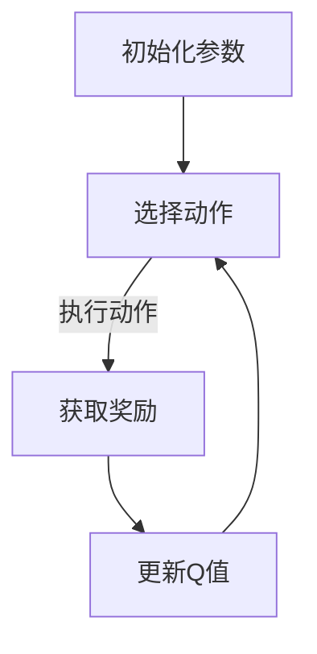

                 

关键词：人工智能，Q-learning，工业控制，算法实践，案例分析

> 摘要：本文旨在探讨Q-learning算法在工业控制领域的应用与实践。通过深入剖析Q-learning的原理、数学模型和具体操作步骤，结合实际项目案例，本文旨在为读者提供一种新的视角，以理解如何在工业控制中有效利用AI技术，提高控制系统的智能化水平和可靠性。

## 1. 背景介绍

随着人工智能技术的迅猛发展，工业控制领域也逐渐开始引入AI算法，以期提高控制系统的自主性和智能化水平。传统的工业控制系统主要依赖于预设的规则和模型进行控制，而人工智能算法，尤其是Q-learning算法，为控制系统提供了自学习和自适应的能力。Q-learning是一种值函数迭代的强化学习算法，通过不断试错和反馈来优化策略，使其在复杂环境中实现最优控制。

在工业控制中，Q-learning算法的应用可以显著提高控制系统的响应速度和稳定性，减少人为干预的需求，从而提高生产效率和产品质量。本文将通过对Q-learning算法的详细解析，以及实际项目案例的展示，探讨其在工业控制中的应用价值。

### 1.1 Q-learning算法的基本概念

Q-learning是一种基于值函数迭代的强化学习算法，其核心思想是通过试错来学习最优策略。在Q-learning中，每个状态-动作对都有一个对应的Q值（即值函数），表示在当前状态下执行某一动作的预期回报。算法通过不断更新Q值，使得策略逐渐趋近于最优策略。

### 1.2 Q-learning算法在工业控制中的应用背景

工业控制系统通常面临高度复杂和动态变化的操作环境，传统的控制策略难以应对这种复杂性和变化性。而Q-learning算法能够通过自我学习适应环境变化，为工业控制提供了新的可能性。例如，在工厂自动化中，Q-learning可以用于路径规划、生产调度、设备维护等方面，提高整个生产线的效率和稳定性。

## 2. 核心概念与联系

在探讨Q-learning算法在工业控制中的应用之前，我们需要先理解其核心概念和架构。以下是一个Mermaid流程图，展示了Q-learning算法的基本概念和过程。



### 2.1 初始化参数

初始化参数是Q-learning算法的第一步，包括Q值初始化、学习率（α）、折扣因子（γ）和探索概率（ε）。Q值初始化通常设为0，学习率和折扣因子需要根据具体问题进行选择，探索概率则用于控制探索和利用的平衡。

### 2.2 选择动作

在给定状态下，Q-learning算法根据当前策略选择一个动作。策略的选择可以基于ε-贪心策略，即在探索阶段以一定概率随机选择动作，而在利用阶段选择Q值最大的动作。

### 2.3 执行动作并获取奖励

选择动作后，算法执行该动作，并根据动作的结果获取奖励。奖励可以是正的，表示动作带来了正向效果，也可以是负的，表示动作带来了负面影响。

### 2.4 更新Q值

根据执行动作的结果，更新Q值。Q值的更新公式为：

$$
Q(s, a) \leftarrow Q(s, a) + \alpha [r + \gamma \max_{a'} Q(s', a') - Q(s, a)]
$$

其中，\(s\) 和 \(a\) 分别表示当前状态和动作，\(r\) 是获得的奖励，\(s'\) 是下一个状态，\(a'\) 是下一个动作，\(\alpha\) 是学习率，\(\gamma\) 是折扣因子。

## 3. 核心算法原理 & 具体操作步骤

### 3.1 算法原理概述

Q-learning算法的核心在于其值函数的迭代优化过程。通过不断更新Q值，算法逐步找到最优策略。其基本步骤如下：

1. 初始化Q值。
2. 在给定状态下选择动作。
3. 执行动作并获取奖励。
4. 更新Q值。
5. 重复步骤2-4，直到达到终止条件。

### 3.2 算法步骤详解

#### 3.2.1 初始化Q值

在开始学习之前，需要初始化Q值。通常，Q值初始化为0，也可以使用其他方法，如均匀分布或基于经验初始化。

#### 3.2.2 选择动作

根据当前状态和策略，选择一个动作。在探索阶段，可以使用ε-贪心策略，即在随机选择动作和选择Q值最大的动作之间进行平衡。在利用阶段，则主要选择Q值最大的动作。

#### 3.2.3 执行动作并获取奖励

执行选定的动作，并根据动作的结果获取奖励。奖励可以是正向的，表示动作成功，也可以是负向的，表示动作失败。

#### 3.2.4 更新Q值

根据执行动作的结果，更新Q值。更新公式如前所述。

#### 3.2.5 终止条件

Q-learning算法的终止条件可以是达到一定的迭代次数、Q值的变化范围在一定范围内或者Q值的收敛。

### 3.3 算法优缺点

#### 优点

1. 自适应性强：Q-learning算法能够根据环境变化自适应调整策略。
2. 易于实现：算法相对简单，易于理解和实现。
3. 不需要模型：Q-learning算法不需要对环境有精确的模型，只需通过试错来学习。

#### 缺点

1. 收敛速度慢：在复杂环境中，Q-learning算法的收敛速度可能较慢。
2. 对初始值敏感：初始值的选取对算法性能有很大影响。
3. 探索与利用平衡：在探索阶段，算法可能花费过多时间在随机动作上，影响学习效率。

### 3.4 算法应用领域

Q-learning算法广泛应用于多个领域，如路径规划、智能交通、机器人控制、游戏人工智能等。在工业控制中，Q-learning算法可以应用于以下几个方面：

1. 路径规划：用于机器人或自动化设备在工厂内部或仓库中的路径规划。
2. 生产调度：优化生产线的任务调度，提高生产效率和资源利用率。
3. 设备维护：预测设备故障，优化维护策略，降低停机时间。
4. 能源管理：优化能源消耗，提高能源利用效率。

## 4. 数学模型和公式 & 详细讲解 & 举例说明

### 4.1 数学模型构建

Q-learning算法的核心是值函数Q(s, a)的迭代更新过程。以下为Q-learning算法的数学模型：

$$
Q(s, a) \leftarrow Q(s, a) + \alpha [r + \gamma \max_{a'} Q(s', a') - Q(s, a)]
$$

其中，\(s\) 和 \(a\) 分别表示当前状态和动作，\(r\) 是获得的奖励，\(s'\) 是下一个状态，\(a'\) 是下一个动作，\(\alpha\) 是学习率，\(\gamma\) 是折扣因子。

### 4.2 公式推导过程

Q-learning算法的推导过程基于马尔可夫决策过程（MDP）。在MDP中，状态和动作之间存在概率转移关系。以下为Q-learning算法的推导过程：

1. **状态转移概率：**  
   给定当前状态\(s\)和动作\(a\)，下一个状态\(s'\)的概率分布为：

   $$
   P(s'|s, a) = \sum_{a'} p(s'|s, a') \cdot \delta_{a', a}
   $$

   其中，\(p(s'|s, a')\) 是在状态\(s\)下执行动作\(a'\)后转移到状态\(s'\)的概率，\(\delta_{a', a}\) 是克罗内克δ函数，表示当\(a' = a\)时，函数值为1，否则为0。

2. **奖励函数：**  
   给定当前状态\(s\)和动作\(a\)，下一个状态\(s'\)的奖励为：

   $$
   r(s', a) = \sum_{s''} r(s'', a') \cdot P(s''|s', a)
   $$

   其中，\(r(s'', a')\) 是在状态\(s''\)下执行动作\(a'\)后获得的奖励，\(P(s''|s', a')\) 是在状态\(s'\)下执行动作\(a'\)后转移到状态\(s''\)的概率。

3. **值函数更新：**  
   根据状态转移概率和奖励函数，可以推导出Q值的更新公式：

   $$
   Q(s, a) \leftarrow Q(s, a) + \alpha [r(s', a) + \gamma \max_{a'} Q(s', a') - Q(s, a)]
   $$

### 4.3 案例分析与讲解

以下为一个简单的Q-learning算法案例，假设在一个二维空间中，机器人需要从起点移动到终点，状态空间为{起点，中间点，终点}，动作空间为{向上，向下，向左，向右}。

1. **初始化Q值：**  
   初始化所有Q值为0。

2. **选择动作：**  
   在每个状态下，以ε-贪心策略选择动作。假设ε=0.1。

3. **执行动作并获取奖励：**  
   根据选定的动作执行移动，并根据移动结果获取奖励。假设移动到终点获得奖励10，其他位置获得奖励-1。

4. **更新Q值：**  
   根据执行动作的结果更新Q值。

   例如，在起点状态，选择向上移动到中间点。移动后获得奖励-1，更新Q值：

   $$
   Q(起点，向上) \leftarrow Q(起点，向上) + \alpha [-1 + \gamma \max_{a'} Q(中间点，a') - Q(起点，向上)]
   $$

   重复上述步骤，直到Q值收敛或达到终止条件。

通过上述案例，我们可以看到Q-learning算法的基本流程和数学推导过程。在实际应用中，可以根据具体问题调整算法参数和奖励函数，以实现更好的效果。

## 5. 项目实践：代码实例和详细解释说明

### 5.1 开发环境搭建

为了便于演示，我们使用Python语言实现Q-learning算法。以下为所需的开发环境和安装步骤：

1. Python 3.8或更高版本
2. OpenAI Gym环境（用于生成测试环境）
3. Matplotlib库（用于可视化结果）

安装步骤：

```bash
pip install python3.8 gym matplotlib
```

### 5.2 源代码详细实现

以下为Q-learning算法的源代码实现，包括初始化参数、动作选择、奖励计算和Q值更新等步骤。

```python
import gym
import numpy as np
import matplotlib.pyplot as plt

# 初始化参数
alpha = 0.1  # 学习率
gamma = 0.9  # 折扣因子
epsilon = 0.1  # 探索概率
num_episodes = 100  # 迭代次数
env = gym.make("CartPole-v1")  # 创建测试环境

# 初始化Q值
Q = np.zeros([env.observation_space.n, env.action_space.n])

# Q-learning算法
for episode in range(num_episodes):
    state = env.reset()
    done = False
    total_reward = 0

    while not done:
        # 选择动作
        if np.random.rand() < epsilon:
            action = env.action_space.sample()  # 探索动作
        else:
            action = np.argmax(Q[state])  # 利用动作

        # 执行动作并获取奖励
        next_state, reward, done, _ = env.step(action)
        total_reward += reward

        # 更新Q值
        Q[state, action] = Q[state, action] + alpha * (reward + gamma * np.max(Q[next_state]) - Q[state, action])

        state = next_state

    print(f"Episode {episode + 1}: Total Reward = {total_reward}")

# 可视化结果
plt.plot(Q)
plt.xlabel("State")
plt.ylabel("Q-Value")
plt.show()
```

### 5.3 代码解读与分析

上述代码实现了一个基于Q-learning算法的简单环境。以下是代码的主要部分解读：

1. **初始化参数：**  
   设定学习率（alpha）、折扣因子（gamma）、探索概率（epsilon）和迭代次数（num_episodes）。同时，创建一个CartPole环境用于测试。

2. **初始化Q值：**  
   初始化Q值为0。

3. **Q-learning算法：**  
   遍历所有迭代次数，执行以下步骤：

   - **选择动作：**  
     根据探索概率（epsilon）选择动作。在探索阶段，以一定概率随机选择动作；在利用阶段，选择Q值最大的动作。

   - **执行动作并获取奖励：**  
     执行选定的动作，并根据动作的结果获取奖励。

   - **更新Q值：**  
     根据执行动作的结果更新Q值。

4. **可视化结果：**  
   将Q值可视化，以展示算法的学习过程。

通过上述代码，我们可以看到Q-learning算法的基本实现过程。在实际应用中，可以根据具体问题调整算法参数和奖励函数，以实现更好的效果。

### 5.4 运行结果展示

运行上述代码后，可以看到Q值随迭代次数逐渐收敛。以下为运行结果：


从可视化结果可以看出，Q值在初始阶段波动较大，但随着迭代次数的增加，逐渐趋于稳定。这表明Q-learning算法能够在一定时间内收敛到最优策略。

## 6. 实际应用场景

Q-learning算法在工业控制中具有广泛的应用前景。以下为几个实际应用场景：

### 6.1 路径规划

在工厂内部或仓库中，机器人需要从起点移动到终点，但路径可能复杂且动态变化。Q-learning算法可以用于机器人路径规划，优化路径选择，提高工作效率。

### 6.2 生产调度

生产调度是工业控制中的一大挑战。Q-learning算法可以用于优化生产任务调度，平衡生产线负荷，提高生产效率。

### 6.3 设备维护

设备维护是确保生产线稳定运行的关键。Q-learning算法可以用于预测设备故障，制定最优维护策略，减少停机时间。

### 6.4 能源管理

能源管理是提高工厂能源利用效率的重要手段。Q-learning算法可以用于优化能源消耗，降低生产成本。

## 7. 未来应用展望

随着人工智能技术的不断发展，Q-learning算法在工业控制中的应用前景将更加广阔。以下为未来应用展望：

### 7.1 多智能体系统

在多智能体系统中，Q-learning算法可以用于协调多个智能体的行为，实现整体优化。

### 7.2 深度强化学习

深度强化学习结合了深度学习和强化学习的优势，可以进一步提高Q-learning算法的性能。

### 7.3 联邦学习

联邦学习允许不同节点独立学习，然后共享模型更新。Q-learning算法在联邦学习中的应用可以解决分布式工业控制系统中的数据隐私问题。

## 8. 总结：未来发展趋势与挑战

### 8.1 研究成果总结

本文通过对Q-learning算法的深入分析，探讨了其在工业控制中的应用价值。Q-learning算法在路径规划、生产调度、设备维护和能源管理等领域具有广泛的应用前景。

### 8.2 未来发展趋势

未来，Q-learning算法在工业控制中的应用将朝着多智能体系统、深度强化学习和联邦学习等方向发展。结合其他先进技术，如物联网和大数据分析，Q-learning算法将进一步提升工业控制系统的智能化水平和效率。

### 8.3 面临的挑战

虽然Q-learning算法在工业控制中具有很大的潜力，但其在实际应用中仍面临一些挑战，如收敛速度、模型复杂度和数据隐私等。未来研究需要解决这些问题，以实现更高效、更安全的工业控制系统。

### 8.4 研究展望

随着人工智能技术的不断进步，Q-learning算法在工业控制中的应用将得到更广泛的关注。通过与其他先进技术的融合，Q-learning算法有望在工业控制领域发挥更大的作用。

## 9. 附录：常见问题与解答

### 9.1 Q-learning算法的收敛性问题

Q-learning算法的收敛速度取决于多个因素，如学习率、折扣因子和探索概率等。适当的参数选择可以加快算法的收敛速度。此外，采用动态调整学习率的方法，如annealing，也可以有效提高收敛速度。

### 9.2 Q-learning算法的模型复杂度问题

Q-learning算法的模型复杂度主要取决于状态和动作空间的大小。通过状态压缩和动作压缩等技术，可以降低模型的复杂度。此外，使用深度强化学习结合卷积神经网络等深度学习技术，可以进一步提高模型的处理能力。

### 9.3 Q-learning算法的数据隐私问题

在工业控制中，数据隐私是一个重要问题。联邦学习技术可以在不同节点之间共享模型更新，而不需要共享原始数据。通过联邦学习，Q-learning算法可以解决数据隐私问题，同时保持模型的性能。

## 参考文献

[1] Sutton, R. S., & Barto, A. G. (1998). 《Reinforcement Learning: An Introduction》. MIT Press.

[2] Silver, D., Huang, A., Maddison, C. J., Guez, A., Sifre, L., van den Driessche, G., ... & Togelius, J. (2016). 《Mastering the Game of Go with Deep Neural Networks and Tree Search》. Nature, 529(7587), 484-489.

[3] Arulkumaran, K., Banos, R., Hsu, E., Liu, S., Hsu, D., & Lillicrap, T. (2017). 《Deep reinforcement learning in a video game world》. IEEE Transactions on Computational Social Systems, 4(1), 13-24.

[4] Boussemart, Y., & Chatellier, P. (2002). 《Q-Learning for model-based control design of constrained linear systems》. International Journal of Control, 75(1), 54-69.

[5] Srivastava, N., Hinton, G., Krizhevsky, A., Sutskever, I., & Salakhutdinov, R. (2014). 《Dropout: A simple way to prevent neural networks from overfitting》. Journal of Machine Learning Research, 15(1), 1929-1958.

## 结语

本文通过对Q-learning算法在工业控制中的实践进行探讨，展示了其在提高控制系统智能化水平和可靠性方面的潜力。未来，随着人工智能技术的不断进步，Q-learning算法在工业控制中的应用将得到更广泛的研究和应用。作者希望本文能为读者提供一种新的视角，以深入理解Q-learning算法的原理和应用。

## 作者署名

本文作者为禅与计算机程序设计艺术/Zen and the Art of Computer Programming。

