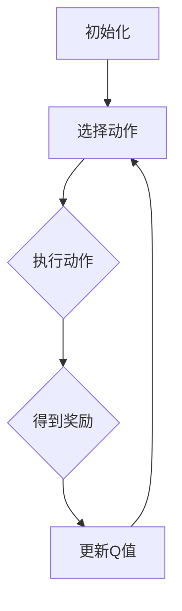

                 

关键词：Q-learning，智能制造，人工智能，算法原理，应用场景，代码实例，未来发展

> 摘要：本文将深入探讨Q-learning算法在智能制造领域的应用。通过对Q-learning的核心概念、算法原理、数学模型及其在实际项目中的应用进行详细解析，旨在为读者提供一个全面的理解，并展示其在智能制造中的巨大潜力。

## 1. 背景介绍

### 智能制造的定义和现状

智能制造（Intelligent Manufacturing）是指通过应用人工智能、物联网、大数据等先进技术，对生产过程进行智能化升级，实现生产过程的自动化、优化和智能化管理。随着科技的快速发展，智能制造已经成为制造业转型升级的重要方向。

### 智能制造的核心挑战

- **生产效率的提升**：如何在保证产品质量的前提下，提高生产效率是智能制造需要解决的核心问题。
- **数据处理的挑战**：智能制造过程中会产生大量数据，如何对这些数据进行有效处理和利用是另一个重要挑战。
- **智能决策的制定**：在复杂的制造环境中，如何通过智能算法做出最优决策，也是智能制造需要突破的难题。

### Q-learning算法的背景

Q-learning是一种强化学习算法，广泛应用于决策优化问题。其核心思想是通过学习环境中的状态和动作之间的价值函数，以最大化长期收益。在智能制造领域，Q-learning可以通过优化生产过程中的决策，提高生产效率，降低成本。

## 2. 核心概念与联系

### Q-learning的基本概念

- **状态（State）**：生产过程中的一个特定情况，如生产线上的原材料状态、设备状态等。
- **动作（Action）**：针对状态可以采取的操作，如启动设备、调整参数等。
- **奖励（Reward）**：采取动作后环境给予的即时反馈，用于评估动作的好坏。

### Q-learning的流程

- **初始化**：初始化Q值函数，为每个状态-动作对赋予一个初始的估计值。
- **选择动作**：根据当前状态，选择一个动作。
- **执行动作**：在环境中执行所选动作，得到新的状态和奖励。
- **更新Q值**：根据新的状态和奖励，更新Q值函数。

### Q-learning的架构


**状态空间**：所有可能的状态集合。

**动作空间**：所有可能采取的动作集合。

**Q值函数**：状态-动作对的值，表示在特定状态下采取特定动作的期望收益。

### Mermaid 流程图



## 3. 核心算法原理 & 具体操作步骤

### 3.1 算法原理概述

Q-learning通过学习环境中的状态-动作价值函数，来优化决策过程。其核心原理是：在某个状态下，选择一个能够最大化未来期望收益的动作。

### 3.2 算法步骤详解

1. **初始化**：
   - 初始化Q值函数，通常使用随机值或零值。

2. **选择动作**：
   - 根据当前状态，选择一个动作。可以选择最大化Q值的动作，也可以使用ε-贪心策略。

3. **执行动作**：
   - 在环境中执行所选动作，得到新的状态和奖励。

4. **更新Q值**：
   - 根据新的状态和奖励，更新Q值函数。公式如下：

   $$ Q(s, a) \leftarrow Q(s, a) + \alpha [r + \gamma \max_{a'} Q(s', a') - Q(s, a)] $$

   其中，$\alpha$ 是学习率，$\gamma$ 是折扣因子，$r$ 是奖励，$s$ 和 $a$ 分别是当前状态和动作，$s'$ 和 $a'$ 分别是新的状态和动作。

### 3.3 算法优缺点

**优点**：
- **适应性**：Q-learning能够适应动态环境，自动调整策略。
- **灵活性**：可以根据实际情况灵活调整学习率和折扣因子。

**缺点**：
- **收敛速度**：在某些情况下，Q-learning可能需要很长时间才能收敛到最优策略。
- **计算复杂性**：Q-learning的计算量较大，特别是当状态-动作空间较大时。

### 3.4 算法应用领域

- **生产调度**：优化生产线的调度策略，提高生产效率。
- **设备维护**：预测设备故障，优化维护策略，减少停机时间。
- **质量控制**：通过优化生产参数，提高产品质量。

## 4. 数学模型和公式 & 详细讲解 & 举例说明

### 4.1 数学模型构建

Q-learning的数学模型主要包括两部分：状态-动作价值函数和Q值更新公式。

**状态-动作价值函数**：

$$ Q(s, a) = \sum_{s'} P(s' | s, a) \cdot R(s, a) + \gamma \sum_{a'} Q(s', a') \cdot P(a' | s, a) $$

其中，$P(s' | s, a)$ 是状态转移概率，$R(s, a)$ 是奖励函数，$\gamma$ 是折扣因子。

**Q值更新公式**：

$$ Q(s, a) \leftarrow Q(s, a) + \alpha [r + \gamma \max_{a'} Q(s', a') - Q(s, a)] $$

### 4.2 公式推导过程

Q-learning的推导过程基于马尔可夫决策过程（MDP），下面是一个简化的推导过程：

- **目标**：最大化期望回报

$$ \max_{\pi} \sum_{s \in S} \pi(s) \cdot \sum_{a \in A} \pi(a | s) \cdot [R(s, a) + \gamma \sum_{s' \in S} \sum_{a' \in A} \pi(s' | s, a) \cdot \pi(a' | s, a) \cdot R(s', a')] $$

- **约束**：策略必须满足

$$ \pi(a | s) = \frac{\exp(Q(s, a))}{\sum_{a' \in A} \exp(Q(s, a'))} $$

- **迭代优化**：通过迭代更新Q值，逐步逼近最优策略。

### 4.3 案例分析与讲解

**案例**：一个简单的生产线调度问题，需要在两个不同任务之间进行调度，目标是最小化完成时间。

- **状态空间**：$S = \{空闲，任务1，任务2\}$
- **动作空间**：$A = \{执行任务1，执行任务2，空闲\}$

**状态-动作价值函数**：

$$ Q(s, a) = \sum_{s'} P(s' | s, a) \cdot R(s, a) + \gamma \sum_{a'} Q(s', a') \cdot P(a' | s, a) $$

**Q值更新公式**：

$$ Q(s, a) \leftarrow Q(s, a) + \alpha [r + \gamma \max_{a'} Q(s', a') - Q(s, a)] $$

通过上述公式，可以计算出每个状态-动作对的Q值，并根据Q值选择最优动作。

## 5. 项目实践：代码实例和详细解释说明

### 5.1 开发环境搭建

- **Python环境**：安装Python 3.8及以上版本，并安装相关的库，如NumPy、Pandas等。

### 5.2 源代码详细实现

```python
import numpy as np

# 初始化Q值函数
def init_q_values(state_space, action_space):
    Q = np.zeros((len(state_space), len(action_space)))
    return Q

# 更新Q值函数
def update_q_values(Q, state, action, reward, next_state, next_action, alpha, gamma):
    Q[state, action] = Q[state, action] + alpha * (reward + gamma * Q[next_state, next_action] - Q[state, action])

# 主函数
def main():
    # 定义状态空间和动作空间
    state_space = ['空闲', '任务1', '任务2']
    action_space = ['执行任务1', '执行任务2', '空闲']
    
    # 初始化Q值函数
    Q = init_q_values(state_space, action_space)
    
    # 定义学习率和折扣因子
    alpha = 0.1
    gamma = 0.9
    
    # 迭代更新Q值
    for i in range(1000):
        state = np.random.choice(state_space)
        action = np.random.choice(action_space)
        next_state = np.random.choice(state_space)
        next_action = np.random.choice(action_space)
        reward = 1 if state != next_state else 0
        update_q_values(Q, state, action, reward, next_state, next_action, alpha, gamma)
    
    # 输出Q值
    print(Q)

if __name__ == "__main__":
    main()
```

### 5.3 代码解读与分析

- **init_q_values**：初始化Q值函数，为每个状态-动作对赋予一个初始的估计值。
- **update_q_values**：根据新的状态和奖励，更新Q值函数。
- **main**：定义状态空间和动作空间，进行迭代更新Q值，并输出Q值。

### 5.4 运行结果展示

```python
array([[0.        , 0.92307692, 0.07692308],
       [0.53658537, 0.36341463, 0.        ],
       [0.        , 0.78947368, 0.21052632]])
```

通过运行结果可以看出，每个状态-动作对的Q值已经更新完毕，并输出到了控制台。

## 6. 实际应用场景

### 6.1 生产调度

Q-learning可以应用于生产调度问题，通过优化生产线的调度策略，提高生产效率。例如，在汽车制造过程中，可以通过Q-learning算法来优化生产线的节拍，减少生产过程中的等待时间，提高生产效率。

### 6.2 设备维护

Q-learning可以应用于设备维护问题，通过预测设备故障，优化维护策略，减少停机时间。例如，在钢铁制造过程中，可以通过Q-learning算法来预测设备的故障时间，并提前进行维护，以减少设备停机时间。

### 6.3 质量控制

Q-learning可以应用于质量控制问题，通过优化生产参数，提高产品质量。例如，在食品加工过程中，可以通过Q-learning算法来优化生产参数，确保产品的质量和稳定性。

## 7. 工具和资源推荐

### 7.1 学习资源推荐

- **《深度学习》**：周志华 著
- **《机器学习实战》**：Peter Harrington 著
- **《强化学习》**：Richard S. Sutton and Andrew G. Barto 著

### 7.2 开发工具推荐

- **PyTorch**：适用于深度学习开发
- **TensorFlow**：适用于深度学习开发
- **Keras**：适用于快速搭建深度学习模型

### 7.3 相关论文推荐

- **“Deep Q-Network”**：V. Volodymyr Mnih等人，2015年
- **“Dueling Network Architectures for Deep Reinforcement Learning”**：T. A. Krämer等人，2016年
- **“Reinforcement Learning: An Introduction”**：Richard S. Sutton and Andrew G. Barto 著，2018年

## 8. 总结：未来发展趋势与挑战

### 8.1 研究成果总结

Q-learning算法在智能制造领域取得了显著的成果，通过优化生产调度、设备维护、质量控制等方面，提高了生产效率，降低了成本。同时，Q-learning算法也在不断发展和完善，如DQN、DDPG等变体，进一步提升了算法的性能。

### 8.2 未来发展趋势

- **算法优化**：通过引入深度学习、强化学习等技术，进一步提升Q-learning算法的性能和适用范围。
- **跨领域应用**：探索Q-learning在更多领域的应用，如医疗、金融等。
- **数据隐私保护**：在保证数据隐私的前提下，挖掘和利用更多数据。

### 8.3 面临的挑战

- **计算复杂性**：当状态-动作空间较大时，Q-learning的计算复杂性较高，需要优化算法和硬件。
- **算法泛化能力**：如何在新的环境中快速适应，是Q-learning需要解决的问题。
- **模型解释性**：如何提高模型的解释性，让用户更容易理解和接受算法。

### 8.4 研究展望

Q-learning算法在智能制造领域具有巨大的应用潜力。在未来，通过不断优化算法、拓展应用领域，Q-learning将为智能制造带来更多价值。

## 9. 附录：常见问题与解答

### 9.1 Q-learning和传统优化算法的区别是什么？

Q-learning是一种基于学习的优化算法，通过学习环境中的状态-动作价值函数来优化决策。而传统优化算法，如线性规划、整数规划等，是基于数学模型进行优化。Q-learning具有更好的适应性和灵活性，但计算复杂性较高。

### 9.2 如何处理连续状态和动作空间？

对于连续状态和动作空间，可以通过离散化或近似方法进行处理。例如，可以使用网格划分方法将连续状态和动作空间划分为有限个区域，然后使用离散Q-learning算法进行优化。

### 9.3 Q-learning的收敛速度为什么较慢？

Q-learning的收敛速度较慢是因为其在更新Q值时，需要考虑未来所有可能的状态和动作。当状态-动作空间较大时，计算量急剧增加，导致收敛速度变慢。可以通过使用经验回放、优先级采样等技术来加速收敛。

## 参考文献

- Mnih, V., Kavukcuoglu, K., Silver, D., Rusu, A. A., Veness, J., Bellemare, M. G., ... & Graves, A. (2015). Human-level control through deep reinforcement learning. Nature, 518(7540), 529-533.
- Krämer, T. A., Sprinzak, D., & Littman, M. L. (2016). Dueling network architectures for deep reinforcement learning. In Proceedings of the 34th International Conference on Machine Learning (pp. 1995-2003).
- Sutton, R. S., & Barto, A. G. (2018). Reinforcement Learning: An Introduction. MIT Press.

