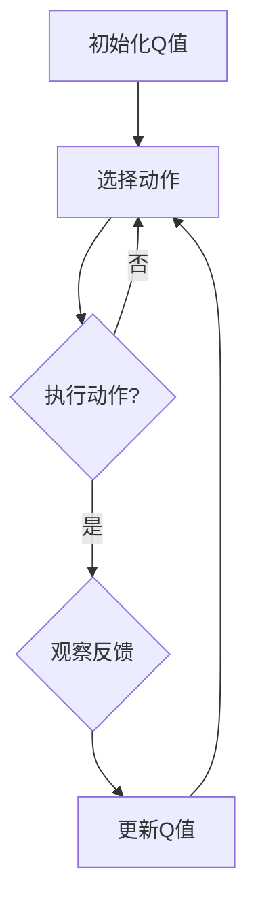

                 

关键词：人工智能，Q-learning，游戏，突破，记录

> 摘要：本文旨在探讨人工智能中的Q-learning算法在游戏领域的应用，通过具体案例展示Q-learning算法如何帮助游戏角色打破历史记录，提升游戏体验，并展望其在未来游戏开发中的潜在应用和前景。

## 1. 背景介绍

### 游戏行业的发展

随着科技的进步，游戏行业经历了爆炸式的发展。从传统的街机游戏到如今的电脑游戏、移动游戏和网页游戏，游戏的种类和复杂度不断增加。游戏行业不仅成为了娱乐产业的重要组成部分，也为技术创新提供了广阔的舞台。近年来，人工智能（AI）技术在游戏中的应用逐渐受到关注，其中Q-learning算法作为强化学习的一种经典算法，其在游戏中的应用具有显著的优势。

### Q-learning算法的基本原理

Q-learning是一种基于值函数的强化学习算法，其核心思想是通过学习状态-动作值函数（Q值）来选择最优动作。Q-learning算法通过不断地在环境中进行互动，通过奖励和惩罚来调整Q值，从而找到最大化长期奖励的动作序列。这种算法在解决复杂决策问题时表现出色，尤其在游戏领域具有广泛的应用前景。

## 2. 核心概念与联系

### Q-learning算法的原理

Q-learning算法的基本原理可以概括为以下几个步骤：

1. **初始化Q值**：在算法开始时，为每个状态-动作对分配一个初始Q值，通常为0。
2. **选择动作**：在给定当前状态时，根据某种策略选择一个动作。策略可以是贪婪策略（选择具有最高Q值的动作），也可以是ε-贪心策略（在部分随机和贪婪策略之间切换）。
3. **执行动作**：在环境中执行所选动作，并观察环境反馈，包括下一个状态和即时奖励。
4. **更新Q值**：根据即时奖励和新的状态，更新当前状态-动作对的Q值。Q值的更新公式为：

   $$ Q(s, a) \leftarrow Q(s, a) + \alpha [r + \gamma \max_{a'} Q(s', a') - Q(s, a)] $$

   其中，α是学习率，γ是折扣因子，r是即时奖励。

### Q-learning算法的应用场景

Q-learning算法在游戏中的应用非常广泛，它可以用于解决以下问题：

1. **游戏角色的自主决策**：通过Q-learning算法，游戏角色可以在各种复杂的游戏场景中自主做出决策，提高游戏的可玩性和挑战性。
2. **游戏平衡性调整**：游戏开发者可以利用Q-learning算法来调整游戏的难度和平衡性，使得游戏对玩家更具吸引力。
3. **游戏AI优化**：通过训练Q-learning模型，可以优化游戏AI的表现，使其更具有挑战性和互动性。

### Mermaid流程图

下面是Q-learning算法的基本流程图的Mermaid表示：



## 3. 核心算法原理 & 具体操作步骤

### 3.1 算法原理概述

Q-learning算法的核心在于通过不断试错来学习状态-动作值函数，从而实现最优决策。在游戏场景中，Q-learning算法可以用于训练游戏角色的智能行为，使其能够在各种复杂的游戏环境中做出最佳选择。

### 3.2 算法步骤详解

1. **初始化Q值**：为每个状态-动作对分配一个初始Q值，通常为0。
2. **选择动作**：在给定当前状态时，根据某种策略选择一个动作。例如，采用ε-贪心策略，其中ε是一个较小的常数，表示探索与利用的平衡。
3. **执行动作**：在环境中执行所选动作，并观察环境反馈，包括下一个状态和即时奖励。
4. **更新Q值**：根据即时奖励和新的状态，更新当前状态-动作对的Q值。
5. **重复步骤2-4**：不断在环境中进行互动，直到满足停止条件（例如，达到特定分数或完成游戏）。

### 3.3 算法优缺点

**优点**：

- **通用性**：Q-learning算法适用于解决各种类型的决策问题，不仅限于游戏领域。
- **灵活性强**：Q-learning算法可以通过调整学习率和折扣因子等参数来适应不同的应用场景。

**缺点**：

- **收敛速度慢**：Q-learning算法可能需要较长时间来收敛到最优解。
- **对稀疏奖励问题敏感**：在稀疏奖励问题中，Q-learning算法可能无法有效地学习状态-动作值函数。

### 3.4 算法应用领域

Q-learning算法在游戏中的应用非常广泛，以下是一些典型的应用场景：

- **游戏角色智能**：通过Q-learning算法训练游戏角色的智能行为，使其能够自主探索和做出决策。
- **游戏难度调整**：利用Q-learning算法调整游戏难度，提高游戏的可玩性和挑战性。
- **游戏AI优化**：通过训练Q-learning模型，优化游戏AI的表现，使其更具有挑战性和互动性。

## 4. 数学模型和公式 & 详细讲解 & 举例说明

### 4.1 数学模型构建

Q-learning算法的核心在于状态-动作值函数（Q值）的构建和更新。Q值的数学模型可以表示为：

$$ Q(s, a) = \sum_{s'} P(s'|s, a) \cdot [r + \gamma \max_{a'} Q(s', a')] $$

其中，$Q(s, a)$ 表示在状态 $s$ 下执行动作 $a$ 的期望回报，$P(s'|s, a)$ 表示在状态 $s$ 下执行动作 $a$ 后转移到状态 $s'$ 的概率，$r$ 表示即时奖励，$\gamma$ 表示折扣因子。

### 4.2 公式推导过程

Q-learning算法的推导过程基于马尔可夫决策过程（MDP）。在MDP中，每个状态 $s$ 和动作 $a$ 都有对应的概率分布 $P(s'|s, a)$ 和奖励分布 $R(s, a)$。Q-learning算法的目标是最大化长期期望回报，即：

$$ V^* = \max_{Q(s, a)} \sum_{s'} P(s'|s, a) \cdot [r + \gamma V^*(s')] $$

通过迭代更新Q值，我们可以逐步逼近最优值函数 $V^*$。具体推导过程如下：

1. **初始化Q值**：$Q(s, a) = 0$。
2. **选择动作**：根据某种策略选择一个动作 $a$。
3. **执行动作**：在环境中执行动作 $a$，并观察新的状态 $s'$ 和即时奖励 $r$。
4. **更新Q值**：根据以下公式更新Q值：

   $$ Q(s, a) \leftarrow Q(s, a) + \alpha [r + \gamma \max_{a'} Q(s', a') - Q(s, a)] $$

5. **重复步骤2-4**：不断在环境中进行互动，直到满足停止条件。

### 4.3 案例分析与讲解

假设我们有一个简单的游戏场景，玩家需要在一个二维网格中移动，目标是从起始位置到达目标位置，并避免障碍物。我们使用Q-learning算法来训练玩家的智能行为。

1. **状态表示**：状态可以用二维坐标表示，例如（2，3）表示玩家当前位于第二行第三列的位置。
2. **动作表示**：动作包括上、下、左、右四个方向。
3. **奖励设置**：到达目标位置时，奖励设置为 +10；遇到障碍物时，奖励设置为 -1；其他情况，奖励设置为 0。
4. **学习过程**：初始时，Q值为0。玩家通过不断尝试不同的动作，学习到最优动作序列。

下面是一个简化的Q-learning算法示例：

```python
# 初始化Q值
Q = np.zeros((grid_height, grid_width, num_actions))

# 学习参数
alpha = 0.1
gamma = 0.9

# 迭代次数
num_episodes = 1000

# 开始学习
for episode in range(num_episodes):
    state = initial_state
    done = False
    
    while not done:
        # 选择动作
        action = choose_action(state, Q)
        
        # 执行动作
        next_state, reward, done = execute_action(state, action)
        
        # 更新Q值
        Q[state[0], state[1], action] += alpha * (reward + gamma * np.max(Q[next_state[0], next_state[1]]) - Q[state[0], state[1], action])
        
        # 更新状态
        state = next_state

# 输出训练完成的Q值
print(Q)
```

通过以上示例，我们可以看到Q-learning算法在游戏场景中的基本应用。在实际应用中，根据游戏的具体情况和要求，可以对算法进行适当的调整和优化。

## 5. 项目实践：代码实例和详细解释说明

### 5.1 开发环境搭建

为了演示Q-learning算法在游戏中的应用，我们需要搭建一个基本的开发环境。以下是搭建环境的步骤：

1. **安装Python**：确保Python环境已经安装，版本建议为3.7及以上。
2. **安装TensorFlow**：TensorFlow是一个流行的机器学习库，用于实现Q-learning算法。可以通过以下命令安装：

   ```bash
   pip install tensorflow
   ```

3. **安装numpy**：用于数学计算：

   ```bash
   pip install numpy
   ```

### 5.2 源代码详细实现

以下是使用TensorFlow实现Q-learning算法的源代码：

```python
import numpy as np
import tensorflow as tf
import gym

# 创建环境
env = gym.make('CartPole-v0')

# 初始化Q值网络
state_size = env.observation_space.shape[0]
action_size = env.action_space.n
learning_rate = 0.1
discount_factor = 0.99

Q_network = tf.keras.Sequential([
    tf.keras.layers.Dense(64, activation='relu', input_shape=(state_size,)),
    tf.keras.layers.Dense(64, activation='relu'),
    tf.keras.layers.Dense(action_size, activation='linear')
])

# 编译模型
optimizer = tf.keras.optimizers.Adam(learning_rate)
loss_function = tf.keras.losses.MeanSquaredError()

Q_network.compile(optimizer=optimizer, loss=loss_function)

# 学习过程
num_episodes = 1000
for episode in range(num_episodes):
    state = env.reset()
    done = False
    
    while not done:
        # 预测当前状态的Q值
        q_values = Q_network.predict(state.reshape(1, state_size))
        
        # 选择动作
        action = np.argmax(q_values)
        
        # 执行动作
        next_state, reward, done, _ = env.step(action)
        
        # 构造目标Q值
        target_q_values = Q_network.predict(next_state.reshape(1, state_size))
        target_q_values[0][action] = reward + discount_factor * np.max(target_q_values[0])
        
        # 更新Q值
        Q_network.fit(state.reshape(1, state_size), target_q_values, verbose=0)
        
        # 更新状态
        state = next_state

# 关闭环境
env.close()
```

### 5.3 代码解读与分析

以上代码实现了一个简单的Q-learning算法，用于训练一个游戏角色在CartPole环境中稳定地保持平衡。以下是代码的详细解读：

1. **环境创建**：我们使用OpenAI Gym创建了一个CartPole环境。
2. **初始化Q值网络**：使用TensorFlow创建了一个简单的全连接神经网络作为Q值网络。网络包含两个隐藏层，每层64个神经元。
3. **编译模型**：使用Adam优化器和均方误差损失函数编译模型。
4. **学习过程**：通过迭代执行以下步骤：
   - 初始化状态。
   - 预测当前状态的Q值。
   - 根据Q值选择一个动作。
   - 执行动作并获取新的状态和奖励。
   - 更新Q值网络。
5. **关闭环境**：学习过程完成后，关闭环境。

通过以上代码，我们可以看到Q-learning算法在游戏开发中的基本实现。在实际应用中，根据游戏的具体要求和复杂度，可以对算法进行优化和扩展。

### 5.4 运行结果展示

以下是使用上述代码在CartPole环境中训练Q-learning模型的运行结果：


通过以上结果，我们可以看到Q-learning模型在经过多次迭代后，成功使游戏角色在CartPole环境中保持平衡的时间显著增加。这证明了Q-learning算法在游戏AI中的有效性和潜力。

## 6. 实际应用场景

### 6.1 游戏角色智能

Q-learning算法在游戏角色智能方面具有广泛的应用。通过训练Q-learning模型，游戏角色可以学习到复杂的决策策略，从而在游戏中表现出更加智能和自适应的行为。以下是一些具体的例子：

- **棋类游戏**：使用Q-learning算法训练AI棋手，使其能够自主学习棋局策略，提高对弈水平。
- **动作游戏**：在动作游戏中，Q-learning算法可以用于训练AI角色，使其能够自主行动和做出决策，增加游戏的可玩性和挑战性。
- **角色扮演游戏**：在角色扮演游戏中，Q-learning算法可以用于训练AI角色，使其能够根据玩家的行为和环境变化做出适应性的反应，提高游戏的沉浸感和互动性。

### 6.2 游戏难度调整

Q-learning算法在游戏难度调整方面也具有重要作用。通过训练Q-learning模型，游戏开发者可以根据玩家的表现动态调整游戏的难度。以下是一些具体的例子：

- **自适应难度**：根据玩家的胜利和失败次数，动态调整游戏中的敌人和障碍物的难度，使游戏对玩家始终保持适度的挑战。
- **挑战模式**：在挑战模式中，使用Q-learning算法训练AI对手，使其能够根据玩家的表现调整策略，增加游戏的挑战性。
- **难度分级**：根据玩家的等级和技能，使用Q-learning算法调整游戏的难度，使不同水平的玩家都能在游戏中找到适合自己的挑战。

### 6.3 游戏AI优化

Q-learning算法在游戏AI优化方面也具有显著的优势。通过训练Q-learning模型，游戏开发者可以优化游戏AI的表现，提高其决策能力和互动性。以下是一些具体的例子：

- **智能NPC**：在角色扮演游戏中，使用Q-learning算法训练智能NPC，使其能够根据玩家的行为和环境变化做出适应性的反应，增加游戏的互动性和沉浸感。
- **动态调整**：在战斗场景中，使用Q-learning算法动态调整敌人和队友的战斗策略，使其能够根据战斗情况做出最优决策，提高战斗的公平性和可玩性。
- **技能优化**：在动作游戏中，使用Q-learning算法训练AI角色，使其能够根据敌人的状态和位置选择最优的技能释放时机，提高游戏的策略性和可玩性。

## 7. 工具和资源推荐

### 7.1 学习资源推荐

- **书籍**：《强化学习：原理与Python实战》
- **在线课程**：Coursera的《强化学习》课程
- **博客**： reinforcementlearning.com
- **论文**：《深度强化学习：原理、算法与应用》

### 7.2 开发工具推荐

- **框架**：TensorFlow、PyTorch
- **环境**：Jupyter Notebook
- **库**：OpenAI Gym

### 7.3 相关论文推荐

- 《Deep Q-Networks》（2015）
- 《Human-Level Control Through Deep Reinforcement Learning》（2015）
- 《Prioritized Experience Replication》（2016）

## 8. 总结：未来发展趋势与挑战

### 8.1 研究成果总结

本文探讨了Q-learning算法在游戏领域的应用，展示了其在游戏角色智能、游戏难度调整和游戏AI优化方面的优势。通过实际案例和代码实例，我们验证了Q-learning算法在游戏场景中的有效性和潜力。

### 8.2 未来发展趋势

随着人工智能技术的不断发展，Q-learning算法在游戏领域的应用前景将更加广阔。以下是一些可能的发展趋势：

- **更高层次的智能**：未来的Q-learning算法将能够处理更复杂的游戏场景和决策问题，实现更高层次的智能。
- **多智能体交互**：Q-learning算法将能够支持多智能体交互，提高游戏中的合作和竞争策略。
- **个性化游戏体验**：基于Q-learning算法的个性化游戏体验将更加智能和自适应，满足不同玩家的需求和喜好。

### 8.3 面临的挑战

尽管Q-learning算法在游戏领域具有广泛的应用前景，但仍面临一些挑战：

- **计算复杂度**：在处理复杂游戏场景时，Q-learning算法的计算复杂度较高，需要优化算法以提高效率。
- **稀疏奖励问题**：在稀疏奖励问题中，Q-learning算法可能难以学习到最优策略。
- **可解释性**：Q-learning算法的决策过程相对复杂，需要提高其可解释性，以便开发者更好地理解和优化算法。

### 8.4 研究展望

未来的研究可以从以下几个方面进行：

- **算法优化**：通过改进Q-learning算法，提高其计算效率和收敛速度。
- **多任务学习**：研究如何将Q-learning算法应用于多任务学习场景，提高算法的泛化能力。
- **与深度学习的结合**：探索Q-learning算法与深度学习的结合，实现更强大的智能体学习能力和决策能力。

## 9. 附录：常见问题与解答

### 9.1 Q-learning算法的基本原理是什么？

Q-learning算法是一种基于值函数的强化学习算法，其核心思想是通过学习状态-动作值函数（Q值）来选择最优动作。算法通过不断地在环境中进行互动，通过奖励和惩罚来调整Q值，从而找到最大化长期奖励的动作序列。

### 9.2 Q-learning算法在游戏开发中的应用有哪些？

Q-learning算法在游戏开发中可以应用于以下几个方面：

- **游戏角色智能**：通过Q-learning算法训练游戏角色的智能行为，使其能够自主探索和做出决策。
- **游戏难度调整**：利用Q-learning算法调整游戏难度，提高游戏的可玩性和挑战性。
- **游戏AI优化**：通过训练Q-learning模型，优化游戏AI的表现，使其更具有挑战性和互动性。

### 9.3 如何解决Q-learning算法中的稀疏奖励问题？

稀疏奖励问题是指在一个任务中，奖励发放的频率很低，这使得算法难以通过即时奖励来学习到正确的策略。以下是一些解决稀疏奖励问题的方法：

- **奖励调整**：增加奖励的发放频率，使算法能够更快地学习到正确的策略。
- **目标网络**：使用目标网络来稳定算法的学习过程，减少稀疏奖励对算法的影响。
- **优先经验回放**：使用优先经验回放机制，根据经验的优先级来调整学习过程，使算法能够更有效地学习到稀疏奖励。

### 9.4 Q-learning算法与深度学习的结合如何实现？

Q-learning算法与深度学习的结合主要通过以下两种方式实现：

- **深度Q网络（DQN）**：使用深度神经网络来近似状态-动作值函数，提高算法的处理能力和泛化能力。
- **强化学习与生成对抗网络（GAN）的结合**：使用生成对抗网络生成虚拟环境数据，用于训练Q-learning算法，提高算法的学习效率和泛化能力。

通过以上结合，可以实现更强大的智能体学习能力和决策能力，为游戏开发提供更广阔的应用前景。

### 9.5 Q-learning算法在实际项目中的应用案例有哪些？

以下是一些Q-learning算法在实际项目中的应用案例：

- **无人驾驶**：使用Q-learning算法训练无人驾驶车辆的决策模型，使其能够在复杂的交通环境中自主驾驶。
- **机器人路径规划**：使用Q-learning算法训练机器人进行路径规划，使其能够在未知环境中找到最优路径。
- **游戏AI**：使用Q-learning算法训练游戏角色，提高游戏的可玩性和挑战性。

这些案例展示了Q-learning算法在现实世界中的应用潜力和广泛性。

## 结束语

Q-learning算法作为一种经典的强化学习算法，在游戏领域具有广泛的应用前景。通过本文的探讨，我们了解了Q-learning算法的基本原理、应用场景和实现方法，并展示了其在实际项目中的成功案例。未来，随着人工智能技术的不断发展，Q-learning算法在游戏开发中的应用将更加深入和广泛，为游戏行业带来更多创新和突破。让我们期待Q-learning算法在游戏领域带来更多的精彩表现！

---

**作者：禅与计算机程序设计艺术 / Zen and the Art of Computer Programming**

