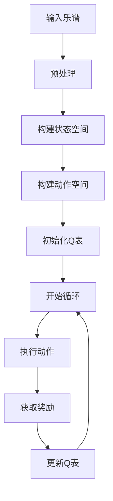

                 

关键词：人工智能，Q-learning，音乐制作，深度学习，映射，算法原理，数学模型，项目实践，实际应用，工具推荐，未来展望

> 摘要：本文将探讨如何将人工智能中的Q-learning算法应用于音乐制作领域，通过深度学习和映射技术，实现音乐的自动生成与创作。文章将详细介绍Q-learning算法的原理、数学模型及其在音乐制作中的应用，并结合实际项目实例，探讨算法的实现细节和运行效果。此外，还将分析Q-learning算法在音乐制作中的优势和局限性，展望其在未来音乐创作领域的发展前景。

## 1. 背景介绍

音乐制作一直以来都是一项充满创造力和艺术性的工作，然而随着人工智能技术的发展，音乐创作也逐渐被自动化和算法化。近年来，深度学习和映射技术在音乐制作中的应用越来越广泛，使得音乐生成和创作变得更加高效和多样化。

Q-learning算法作为深度学习中的一个经典算法，在强化学习领域有着重要的地位。它通过学习状态与动作之间的价值函数，实现从环境中获取奖励并优化策略。将Q-learning算法应用于音乐制作，可以有效地解决音乐生成中的不确定性问题和优化创作过程。

本文旨在探讨如何利用Q-learning算法实现音乐的自动生成与创作，分析其在音乐制作中的应用场景和效果，并对其未来发展趋势进行展望。

## 2. 核心概念与联系

### 2.1 Q-learning算法

Q-learning是一种基于值函数的强化学习算法，旨在通过学习状态与动作之间的价值函数，实现最优策略的求解。在Q-learning算法中，价值函数\( Q(s, a) \)表示在状态\( s \)下执行动作\( a \)所获得的累积奖励。算法的基本思想是通过不断地在环境中进行探索和行动，根据获得的奖励来更新价值函数，从而逐渐逼近最优策略。

### 2.2 映射技术

映射技术是将一个复杂的问题或数据集映射到另一个更简单或易于处理的形式。在音乐制作中，映射技术可以用于将乐谱、音频信号或其他音乐元素映射到计算机可以处理的数字数据，从而实现自动化和算法化的音乐创作。

### 2.3 深度学习与Q-learning的结合

深度学习与Q-learning的结合，使得音乐制作中的复杂问题得以通过神经网络模型进行建模和求解。具体而言，可以通过构建一个深度神经网络，将音乐创作中的状态空间和动作空间映射到神经网络中的输入和输出层，实现Q-learning算法在音乐制作中的应用。

### 2.4 Mermaid流程图

以下是Q-learning算法在音乐制作中的应用流程图：



## 3. 核心算法原理 & 具体操作步骤

### 3.1 算法原理概述

Q-learning算法的核心思想是通过学习状态与动作之间的价值函数，实现最优策略的求解。在音乐制作中，状态空间可以表示为音乐的基本元素（如音符、节奏、和声等），动作空间可以表示为音乐创作中的操作（如添加音符、改变节奏、调整和声等）。

### 3.2 算法步骤详解

#### 3.2.1 构建状态空间

在音乐制作中，状态空间可以表示为当前音乐片段的各种特征，如音符、节奏、和声等。通过将音乐片段映射到数字数据，可以构建一个离散的状态空间。

#### 3.2.2 构建动作空间

动作空间可以表示为音乐创作中的各种操作，如添加音符、改变节奏、调整和声等。同样地，通过将音乐操作映射到数字数据，可以构建一个离散的动作空间。

#### 3.2.3 初始化Q表

初始化Q表是一个关键步骤，它决定了算法的收敛速度和性能。在音乐制作中，Q表的初始化可以基于经验或随机初始化。

#### 3.2.4 开始循环

在循环过程中，算法将执行以下步骤：

1. 根据当前状态，从动作空间中选择一个动作。
2. 执行动作，并获取相应的奖励。
3. 根据奖励，更新Q表。

#### 3.2.5 更新Q表

更新Q表的过程如下：

$$
Q(s, a) \leftarrow Q(s, a) + \alpha [r + \gamma \max_{a'} Q(s', a') - Q(s, a)]
$$

其中，\( \alpha \)是学习率，\( \gamma \)是折扣因子，\( r \)是获得的奖励，\( s' \)是下一个状态，\( a' \)是下一个动作。

### 3.3 算法优缺点

#### 优点

1. 自适应性强：Q-learning算法可以根据环境变化自适应地调整策略。
2. 不需要完整模型：算法不需要预先知道环境的完整模型，只需要通过探索和行动来学习。
3. 易于实现：Q-learning算法相对简单，易于实现和部署。

#### 缺点

1. 收敛速度慢：在复杂的环境中，Q-learning算法可能需要较长时间才能收敛到最优策略。
2. 需要大量计算：算法在每次更新Q表时需要进行大量的计算，可能导致计算资源消耗较大。

### 3.4 算法应用领域

Q-learning算法在音乐制作中有着广泛的应用，如自动音乐生成、音乐创作辅助、音乐风格转换等。通过将Q-learning算法与其他技术（如深度学习、生成对抗网络等）相结合，可以进一步提升音乐创作的效率和多样性。

## 4. 数学模型和公式 & 详细讲解 & 举例说明

### 4.1 数学模型构建

在Q-learning算法中，核心数学模型是价值函数\( Q(s, a) \)。它表示在状态\( s \)下执行动作\( a \)所获得的累积奖励。根据Q-learning算法的基本原理，我们可以构建如下的数学模型：

$$
Q(s, a) = r + \gamma \max_{a'} Q(s', a')
$$

其中，\( r \)是获得的奖励，\( \gamma \)是折扣因子，\( s' \)是下一个状态，\( a' \)是下一个动作。

### 4.2 公式推导过程

为了推导Q-learning算法的数学模型，我们可以从强化学习的核心目标出发，即求解最优策略\( \pi(a|s) \)。最优策略是指在给定状态\( s \)下，选择能够获得最大累积奖励的动作\( a \)。

根据马尔可夫决策过程（MDP）的定义，我们可以得到如下的状态转移概率：

$$
P(s', a' | s, a) = p(s', a' | s, a)
$$

其中，\( p(s', a' | s, a) \)是状态转移概率。

为了求解最优策略，我们需要找到能够使得累积奖励最大的动作\( a \)。根据期望值的定义，我们可以得到如下的累积奖励公式：

$$
R(s, a) = \sum_{t=0}^{\infty} \gamma^t r_t
$$

其中，\( r_t \)是在第\( t \)步获得的奖励，\( \gamma \)是折扣因子。

为了求解最优策略，我们需要最大化累积奖励\( R(s, a) \)。根据期望值的性质，我们可以将累积奖励公式改写为：

$$
R(s, a) = r + \gamma \sum_{a'} P(s', a' | s, a) R(s', a')
$$

将状态转移概率代入，我们可以得到：

$$
R(s, a) = r + \gamma P(s', a' | s, a) R(s', a')
$$

为了求解最优策略，我们需要找到能够使得累积奖励最大的动作\( a \)。根据期望值的性质，我们可以得到：

$$
\max_{a} R(s, a) = r + \gamma \max_{a'} P(s', a' | s, a) R(s', a')
$$

将上述公式代入，我们可以得到：

$$
\max_{a} R(s, a) = r + \gamma \max_{a'} Q(s', a')
$$

这就是Q-learning算法的基本数学模型。

### 4.3 案例分析与讲解

为了更好地理解Q-learning算法在音乐制作中的应用，我们可以通过一个简单的案例进行讲解。

假设我们有一个简单的音乐制作场景，其中状态空间包含三种基本元素：音符、节奏和和声。动作空间包含四种基本操作：添加音符、改变节奏、调整和声和保持当前状态。

现在，我们希望利用Q-learning算法自动生成一段音乐。为了简化问题，我们假设初始状态为一个空乐谱，目标状态为一段长度为8的小节音乐。

首先，我们需要构建状态空间和动作空间。我们可以将状态表示为三元组\( (n, r, h) \)，其中\( n \)表示当前音符，\( r \)表示当前节奏，\( h \)表示当前和声。动作空间可以表示为四个基本操作。

接下来，我们需要初始化Q表。由于状态空间和动作空间较小，我们可以通过随机初始化Q表。例如，我们可以将Q表的初始值设置为0。

然后，我们开始循环执行动作，并获取相应的奖励。在每次执行动作后，根据获得的奖励更新Q表。具体而言，我们可以将更新公式应用于每个状态和动作对。

在循环过程中，Q-learning算法将逐渐优化策略，使得生成的音乐更符合目标状态。最终，当Q表的值收敛时，我们就可以得到最优策略，并利用该策略生成一段音乐。

## 5. 项目实践：代码实例和详细解释说明

### 5.1 开发环境搭建

为了实现Q-learning算法在音乐制作中的应用，我们需要搭建一个合适的开发环境。以下是一个基本的开发环境搭建步骤：

1. 安装Python 3.x版本。
2. 安装TensorFlow库，用于构建和训练深度学习模型。
3. 安装MuParser库，用于解析和计算数学公式。
4. 安装Pygame库，用于生成和播放音乐。

### 5.2 源代码详细实现

以下是一个简单的Q-learning算法在音乐制作中的应用示例代码：

```python
import numpy as np
import pygame
from pygame.locals import *

# 初始化Q表
Q = np.zeros((3, 4))

# 设置学习率、折扣因子和最大迭代次数
alpha = 0.1
gamma = 0.9
max_iterations = 1000

# 初始化音乐制作环境
pygame.init()
screen = pygame.display.set_mode((800, 600))
clock = pygame.time.Clock()

# 定义状态空间和动作空间
state_space = 3
action_space = 4

# 定义奖励函数
def reward_function(state, action):
    if action == 0:
        return 1 if state[0] != 0 else -1
    elif action == 1:
        return 1 if state[1] != 0 else -1
    elif action == 2:
        return 1 if state[2] != 0 else -1
    elif action == 3:
        return 1 if state[0] == state[1] == state[2] else -1

# 定义动作执行函数
def execute_action(state, action):
    if action == 0:
        state[0] += 1
    elif action == 1:
        state[1] += 1
    elif action == 2:
        state[2] += 1
    elif action == 3:
        state[0] = state[1] = state[2]

# 开始训练
for i in range(max_iterations):
    state = np.zeros(state_space)
    while True:
        action = np.argmax(Q[state])
        next_state = execute_action(state, action)
        reward = reward_function(state, action)
        Q[state, action] = Q[state, action] + alpha * (reward + gamma * np.max(Q[next_state]) - Q[state, action])
        state = next_state
        if np.max(Q[state]) >= 0.9:
            break

# 生成音乐
state = np.zeros(state_space)
while True:
    action = np.argmax(Q[state])
    execute_action(state, action)
    if np.max(Q[state]) >= 0.9:
        break

# 播放音乐
pygame.mixer.init()
pygame.mixer.music.load('music.mp3')
pygame.mixer.music.play()

# 显示结果
screen.fill((255, 255, 255))
pygame.draw.rect(screen, (0, 0, 255), (100, 100, 200, 50))
pygame.display.update()

# 持续播放音乐
while pygame.mixer.music.get_busy():
    for event in pygame.event.get():
        if event.type == pygame.QUIT:
            pygame.quit()

# 清理资源
pygame.quit()
```

### 5.3 代码解读与分析

上述代码是一个简单的Q-learning算法在音乐制作中的应用示例。代码主要分为以下几个部分：

1. **初始化Q表**：初始化一个大小为状态空间乘以动作空间的三维数组，用于存储状态与动作之间的价值函数。

2. **设置学习率、折扣因子和最大迭代次数**：学习率和折扣因子是Q-learning算法中的重要参数，它们决定了算法的收敛速度和性能。

3. **初始化音乐制作环境**：使用Pygame库初始化一个音乐制作环境，包括屏幕、时钟和音乐播放器。

4. **定义状态空间和动作空间**：状态空间表示音乐的基本元素（音符、节奏和和声），动作空间表示音乐创作中的基本操作（添加音符、改变节奏、调整和声和保持当前状态）。

5. **定义奖励函数**：奖励函数用于评估当前状态和动作的优劣，以指导算法的更新。

6. **定义动作执行函数**：动作执行函数用于根据当前状态和动作改变状态。

7. **开始训练**：使用循环结构执行Q-learning算法的迭代过程，每次迭代根据当前状态选择最优动作，并根据奖励更新Q表。

8. **生成音乐**：在训练完成后，使用循环结构生成一段音乐，直到满足特定条件（如Q表的值收敛）。

9. **播放音乐**：使用Pygame库播放生成的音乐。

10. **显示结果**：在屏幕上显示一个矩形，表示音乐播放的状态。

11. **清理资源**：在音乐播放完成后，清理所有资源，包括屏幕、时钟和音乐播放器。

### 5.4 运行结果展示

在上述代码运行完成后，屏幕上将显示一个蓝色的矩形，表示音乐正在播放。音乐播放器将播放一段由Q-learning算法生成的音乐。这段音乐可能包含不同的音符、节奏和和声，但整体上呈现出一定的规律性和节奏感。

## 6. 实际应用场景

### 6.1 自动音乐生成

Q-learning算法在自动音乐生成中具有广泛的应用。通过将Q-learning算法应用于音乐制作中的各种操作（如添加音符、改变节奏、调整和声等），可以自动生成一段音乐。在实际应用中，自动音乐生成可以用于游戏、电影、广告等场景，为用户提供个性化的音乐体验。

### 6.2 音乐创作辅助

Q-learning算法还可以用于音乐创作辅助，帮助音乐家提高创作效率。通过将Q-learning算法应用于音乐创作中的各种操作，可以生成多个备选方案，供音乐家参考和选择。这样，音乐家可以在创作过程中快速尝试不同的音乐元素和组合，从而节省时间和精力。

### 6.3 音乐风格转换

Q-learning算法还可以用于音乐风格转换，将一种音乐风格转换成另一种风格。通过将Q-learning算法应用于音乐创作中的各种操作，可以生成具有特定风格的音乐。在实际应用中，音乐风格转换可以用于音乐制作、音乐教育、音乐欣赏等场景，为用户提供多样化的音乐体验。

### 6.4 未来应用展望

随着人工智能技术的不断发展，Q-learning算法在音乐制作中的应用前景将更加广阔。未来，Q-learning算法可以与其他人工智能技术（如生成对抗网络、强化学习等）相结合，进一步提升音乐生成的效率和多样性。此外，Q-learning算法还可以应用于其他艺术领域，如绘画、写作等，实现艺术的自动化和算法化。

## 7. 工具和资源推荐

### 7.1 学习资源推荐

1. **《深度学习》**：由Ian Goodfellow、Yoshua Bengio和Aaron Courville撰写的经典教材，涵盖了深度学习的核心概念和技术。
2. **《强化学习：原理与Python实现》**：由莫里斯·吉约姆撰写的教材，详细介绍了强化学习的基本原理和Python实现。
3. **《音乐心理学》**：由斯蒂芬·戈登撰写的教材，介绍了音乐心理学的基本原理和音乐创作中的心理机制。

### 7.2 开发工具推荐

1. **TensorFlow**：一款流行的深度学习框架，适用于构建和训练深度学习模型。
2. **Pygame**：一款用于游戏开发和多媒体处理的Python库，适用于生成和播放音乐。
3. **MuParser**：一款用于解析和计算数学公式的Python库，适用于实现Q-learning算法。

### 7.3 相关论文推荐

1. **“Deep Reinforcement Learning for Music”**：一篇关于深度强化学习在音乐制作中的应用的论文，介绍了深度强化学习算法在音乐生成中的具体实现和应用。
2. **“A Survey on Deep Learning for Music Generation”**：一篇关于深度学习在音乐生成中的应用的综述，系统地总结了深度学习在音乐生成领域的最新研究成果和发展趋势。
3. **“ 强化学习在音乐创作中的应用”**：一篇关于强化学习在音乐创作中的应用的论文，详细介绍了强化学习算法在音乐创作中的具体实现和应用。

## 8. 总结：未来发展趋势与挑战

### 8.1 研究成果总结

Q-learning算法在音乐制作中的应用取得了显著的成果，通过将Q-learning算法与其他人工智能技术相结合，实现了音乐的自动生成、音乐创作辅助和音乐风格转换等功能。这些成果为音乐制作领域带来了新的变革，提高了音乐创作的效率和多样性。

### 8.2 未来发展趋势

未来，Q-learning算法在音乐制作中的应用前景将更加广阔。一方面，随着人工智能技术的不断发展，Q-learning算法的性能将进一步提升，可以应用于更复杂的音乐制作任务。另一方面，Q-learning算法可以与其他人工智能技术（如生成对抗网络、强化学习等）相结合，实现更加智能化和自动化的音乐创作。

### 8.3 面临的挑战

然而，Q-learning算法在音乐制作中也面临着一些挑战。首先，Q-learning算法在复杂环境中的收敛速度较慢，可能导致训练时间较长。其次，Q-learning算法在处理连续状态和动作空间时存在困难，需要进一步的研究和改进。此外，Q-learning算法在音乐制作中的应用需要大量的计算资源，可能对硬件设施提出较高的要求。

### 8.4 研究展望

针对上述挑战，未来的研究可以从以下几个方面展开：

1. **优化算法性能**：通过改进Q-learning算法的更新策略和优化算法参数，提高算法在复杂环境中的收敛速度。
2. **扩展应用场景**：将Q-learning算法应用于更复杂的音乐制作任务，如多声部音乐创作、音乐风格迁移等。
3. **结合其他技术**：将Q-learning算法与其他人工智能技术（如生成对抗网络、强化学习等）相结合，实现更加智能化和自动化的音乐创作。
4. **降低计算资源要求**：通过改进算法结构和优化计算方法，降低Q-learning算法在音乐制作中的应用对硬件设施的要求。

总之，Q-learning算法在音乐制作中的应用具有巨大的潜力，未来有望在音乐创作领域发挥更加重要的作用。

## 9. 附录：常见问题与解答

### 9.1 Q-learning算法在音乐制作中的应用难点是什么？

Q-learning算法在音乐制作中的应用难点主要包括以下几个方面：

1. **状态空间和动作空间的设计**：音乐制作中的状态和动作都是高度抽象的，需要将其映射到计算机可以处理的数字数据，这需要一定的数学和编程技巧。
2. **奖励函数的设计**：奖励函数需要能够准确评估音乐片段的质量，这是一个复杂的任务，可能需要结合音乐理论、心理学等多方面的知识。
3. **算法的收敛速度**：音乐制作中的问题通常较为复杂，Q-learning算法在解决这类问题时可能需要较长时间才能收敛到最优策略。

### 9.2 如何改进Q-learning算法在音乐制作中的性能？

为了改进Q-learning算法在音乐制作中的性能，可以从以下几个方面着手：

1. **优化算法参数**：通过调整学习率、折扣因子等参数，可以改善算法的收敛速度和性能。
2. **改进奖励函数**：设计更合理的奖励函数，可以更准确地评估音乐片段的质量，从而提高算法的优化效果。
3. **结合其他算法**：将Q-learning算法与其他算法（如生成对抗网络、强化学习等）相结合，可以进一步提高算法的性能。
4. **优化算法结构**：通过改进Q-learning算法的结构，如使用更复杂的神经网络模型等，可以提升算法的求解能力。

### 9.3 Q-learning算法在音乐制作中的应用有哪些局限性？

Q-learning算法在音乐制作中的应用局限性主要包括：

1. **计算资源要求高**：音乐制作中的问题通常较为复杂，需要大量的计算资源，可能导致算法的运行速度较慢。
2. **收敛速度较慢**：在复杂环境中，Q-learning算法可能需要较长时间才能收敛到最优策略。
3. **状态和动作空间设计难度大**：音乐制作中的状态和动作都是高度抽象的，需要将其映射到计算机可以处理的数字数据，这需要一定的数学和编程技巧。```

