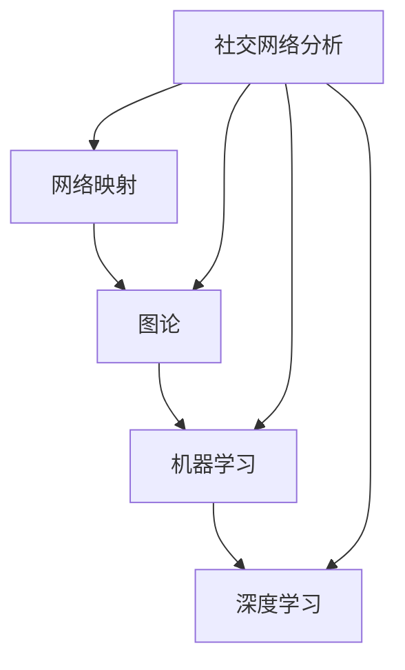

                 

关键词：人工智能，社交网络分析，网络映射，图论，机器学习，深度学习，语义分析，数据挖掘

> 摘要：随着社交媒体的普及，社交网络分析成为了解人类行为、社会动态的重要工具。本文将探讨人工智能在社交网络分析中的应用，通过网络映射技术、机器学习和深度学习等手段，揭示社交网络中的结构和关系，为研究人员和决策者提供有力的数据支持。文章将首先介绍社交网络分析的基本概念和重要性，然后深入讨论AI技术在网络映射、语义分析、数据挖掘等方面的应用，最后展望其未来发展趋势和面临的挑战。

## 1. 背景介绍

社交网络分析（Social Network Analysis，SNA）是研究社交网络中个体及其相互关系的一门科学。自20世纪初社会学家Johann Wolfgang Goethe提出“社会网络”概念以来，随着计算机技术和网络通信的快速发展，社交网络分析逐渐成为社会科学、计算机科学、信息科学等多个领域的重要研究方向。社交网络分析不仅可以帮助我们理解个体之间的社会关系，还可以揭示出群体行为模式和社会动态。

随着社交媒体平台的兴起，如Facebook、Twitter、LinkedIn等，人们之间的互动和连接变得前所未有地复杂和多样。这些社交网络不仅是人们交流和分享信息的场所，更是社会行为和社会动态的映射。因此，分析和理解这些社交网络具有极高的价值，可以应用于市场营销、危机管理、公共卫生、社会学研究等多个领域。

人工智能（AI）作为当今科技发展的前沿，其在各个领域的应用已经取得了显著的成果。在社交网络分析中，人工智能通过其强大的数据分析和模式识别能力，为研究社交网络的复杂性和动态性提供了强有力的支持。AI技术的引入不仅提高了社交网络分析的效率，还拓展了分析的方法和深度。

本文将重点关注人工智能在社交网络分析中的应用，具体包括以下几个方面：

1. 网络映射技术：通过图形化的方式展示社交网络的结构和关系。
2. 语义分析：理解社交网络中的语言和表达，挖掘潜在的主题和趋势。
3. 数据挖掘：从大量社交网络数据中发现有价值的模式和规律。
4. 深度学习：利用神经网络模型对社交网络进行深入的学习和预测。

通过对这些技术的深入探讨，我们希望能够为研究人员和决策者提供有价值的见解，推动社交网络分析的发展和应用。

### 2. 核心概念与联系

在深入探讨人工智能在社交网络分析中的应用之前，我们首先需要理解一些核心概念和它们之间的联系。这些概念包括网络映射、图论、机器学习和深度学习等。

#### 2.1 网络映射

网络映射是一种将社交网络数据转化为图形表示的方法。在社交网络分析中，节点（Node）表示个体，边（Edge）表示个体之间的联系。通过网络映射，我们可以直观地展示社交网络的结构，识别出重要的节点和连接关系。

网络映射不仅仅是一种可视化工具，它还可以用于分析网络的密度、中心性、聚类系数等特性。这些特性对于理解社交网络的功能和动态具有重要意义。

#### 2.2 图论

图论（Graph Theory）是研究图形（Graph）的性质和关系的数学分支。在社交网络分析中，图论提供了许多有用的工具和算法，如路径分析、网络聚类、社区检测等。

图论的核心概念包括节点、边、路径、图等。节点和边可以表示个体和个体之间的关系，而路径和图则可以帮助我们分析网络的结构和特性。例如，通过计算最短路径，我们可以了解个体之间的直接和间接联系；通过社区检测算法，我们可以发现网络中的紧密群体。

#### 2.3 机器学习

机器学习（Machine Learning）是人工智能的一个重要分支，它通过算法从数据中自动学习规律和模式。在社交网络分析中，机器学习技术可以用于预测个体的行为、发现网络中的异常模式、分析个体之间的关系等。

机器学习的核心概念包括特征提取、模型训练和模型评估等。特征提取是将原始数据转换为模型可以处理的特征向量；模型训练是使用训练数据集调整模型的参数；模型评估是使用测试数据集评估模型的性能。

#### 2.4 深度学习

深度学习（Deep Learning）是机器学习的一个子领域，它使用多层神经网络来模拟人脑的神经元结构，进行复杂的特征学习和模式识别。在社交网络分析中，深度学习技术可以用于图像识别、语音识别、自然语言处理等方面，为社交网络分析提供了强大的工具。

深度学习的核心概念包括神经网络、反向传播算法、激活函数等。神经网络是由多个神经元组成的层次结构，反向传播算法是一种用于训练神经网络的优化算法，激活函数则用于引入非线性特性。

#### 2.5 Mermaid 流程图

为了更好地理解这些核心概念和它们之间的联系，我们可以使用Mermaid流程图来可视化这些关系。以下是一个简单的示例：



在这个流程图中，我们可以清晰地看到网络映射、图论、机器学习和深度学习是如何相互联系，并共同推动社交网络分析的发展。

### 3. 核心算法原理 & 具体操作步骤

在了解了社交网络分析的核心概念和它们之间的联系之后，接下来我们将深入探讨核心算法的原理和具体操作步骤。

#### 3.1 算法原理概述

社交网络分析中的核心算法主要可以分为以下几类：

1. **网络映射算法**：将社交网络数据转化为图形表示，帮助识别重要节点和连接关系。
2. **社区检测算法**：识别社交网络中的紧密群体和社区结构。
3. **关系预测算法**：预测个体之间的潜在关系和互动。
4. **话题模型算法**：从社交网络中的文本数据中提取主题和趋势。

每种算法都有其独特的原理和应用场景，但它们的核心目标都是揭示社交网络中的结构和关系。

#### 3.2 算法步骤详解

1. **网络映射算法**：

   - **输入**：社交网络数据，包括节点和边的信息。
   - **步骤**：
     1. 数据预处理：清洗和格式化社交网络数据。
     2. 节点表示：将每个节点表示为一个唯一的标识符。
     3. 边表示：将每条边表示为节点之间的连接。
     4. 图构建：使用图论算法构建图形表示。
     5. 可视化：使用图形化工具展示图形。

   - **输出**：可视化图形，展示社交网络的结构和关系。

2. **社区检测算法**：

   - **输入**：社交网络图形。
   - **步骤**：
     1. 图预处理：对图形进行标准化处理，如去除孤立节点和冗余边。
     2. 确定社区划分标准：设定相似性阈值或使用优化算法。
     3. 社区划分：使用图划分算法（如Girvan-Newman算法、Louvain算法等）进行社区划分。
     4. 社区评估：评估划分结果的合理性，如使用模块度指标。

   - **输出**：社区结构，包括各个社区及其成员。

3. **关系预测算法**：

   - **输入**：社交网络数据，包括已知的节点关系。
   - **步骤**：
     1. 特征提取：从节点和边的数据中提取特征向量。
     2. 模型训练：使用机器学习算法（如逻辑回归、随机森林等）训练预测模型。
     3. 预测：使用训练好的模型预测未知节点之间的关系。
     4. 预测评估：使用测试数据集评估预测模型的性能。

   - **输出**：预测结果，包括预测的节点关系及其置信度。

4. **话题模型算法**：

   - **输入**：社交网络中的文本数据。
   - **步骤**：
     1. 数据预处理：清洗和标准化文本数据。
     2. 词袋表示：将文本数据转换为词袋表示。
     3. 模型训练：使用主题模型（如LDA模型）训练主题分布。
     4. 主题提取：提取文本数据中的主题。
     5. 主题评估：评估提取的准确性，如使用困惑度指标。

   - **输出**：主题分布和主题内容，包括各个主题及其相关词。

#### 3.3 算法优缺点

每种算法都有其优缺点，适用于不同的应用场景：

1. **网络映射算法**：
   - 优点：直观、易于理解，可以帮助识别关键节点和连接关系。
   - 缺点：仅提供图形化的表示，难以进行深入的数据分析和预测。

2. **社区检测算法**：
   - 优点：能够识别社交网络中的紧密群体，有助于理解社交结构。
   - 缺点：对于大规模网络，计算复杂度高，结果可能受到参数选择的影响。

3. **关系预测算法**：
   - 优点：能够预测未知节点之间的关系，有助于发现潜在的网络结构。
   - 缺点：依赖于历史数据，可能无法捕捉到最新的网络动态。

4. **话题模型算法**：
   - 优点：能够从文本数据中提取主题，有助于理解社交网络的内容和趋势。
   - 缺点：对于复杂的文本数据，可能无法准确提取所有主题。

#### 3.4 算法应用领域

这些算法在社交网络分析中有着广泛的应用领域：

1. **市场营销**：通过关系预测和社区检测，帮助企业了解客户行为和市场趋势。
2. **社会学研究**：通过网络映射和话题模型，研究社交网络中的群体行为和社会动态。
3. **危机管理**：通过关系预测和社区检测，监测和应对社会危机。
4. **公共卫生**：通过话题模型和关系预测，监测疫情传播和公共卫生问题。

### 4. 数学模型和公式 & 详细讲解 & 举例说明

在社交网络分析中，数学模型和公式扮演着至关重要的角色，它们不仅能够帮助我们从数据中提取有价值的信息，还能够量化社交网络的结构和关系。本节将介绍几个常用的数学模型和公式，并对其进行详细讲解和举例说明。

#### 4.1 数学模型构建

社交网络分析中的数学模型主要可以分为以下几个方面：

1. **网络密度模型**：描述网络中节点的平均连接数。
2. **中心性模型**：衡量节点在网络中的重要程度。
3. **聚类系数模型**：描述网络中节点的连接密度。
4. **传播模型**：研究信息在社交网络中的传播机制。

#### 4.2 公式推导过程

1. **网络密度公式**：

   网络密度（Network Density）是衡量网络密集程度的一个指标，定义为连接的边数与可能的边数之比。假设一个网络有 \( n \) 个节点和 \( m \) 条边，则网络密度的计算公式为：

   \[
   \rho = \frac{m}{\binom{n}{2}}
   \]

   其中，\(\binom{n}{2}\) 表示所有可能边的数量，计算公式为：

   \[
   \binom{n}{2} = \frac{n \times (n-1)}{2}
   \]

   例如，一个包含5个节点的网络，其可能的边数为10，如果实际有7条边，则网络密度为：

   \[
   \rho = \frac{7}{\binom{5}{2}} = \frac{7}{10} = 0.7
   \]

2. **中心性公式**：

   中心性（Centrality）是衡量节点在网络中的重要程度的指标，常用的中心性指标包括：

   - 度中心性（Degree Centrality）：节点连接的边数。
   - 紧密中心性（Closeness Centrality）：从节点到所有其他节点的最短路径长度之和的倒数。
   - 介数中心性（Betweenness Centrality）：节点作为最短路径的中间点的比例。

   度中心性的计算公式为：

   \[
   C_D(v) = \sum_{v \in V} \text{deg}(v)
   \]

   其中，\(V\) 是网络中的所有节点集合，\(\text{deg}(v)\) 表示节点 \(v\) 的度。

   例如，在图4-1中，节点\(v_1\)的度为3，则其度中心性为：

   \[
   C_D(v_1) = 3
   \]

3. **聚类系数公式**：

   聚类系数（Clustering Coefficient）描述了节点连接的紧密程度。对于一个包含 \(n\) 个节点的网络，如果每个节点有 \(k\) 个邻居，每个邻居对之间的连接概率为 \(p\)，则聚类系数 \(C\) 的计算公式为：

   \[
   C = 1 - \frac{1}{n(n-1)} \sum_{i=1}^{n} \sum_{j=1, j\neq i}^{n} \delta(i,j)
   \]

   其中，\(\delta(i,j)\) 是一个指示函数，如果 \(i\) 和 \(j\) 之间有边，则 \(\delta(i,j) = 1\)，否则为0。

   例如，在图4-2中，节点 \(v_1\) 的邻居 \(v_2\) 和 \(v_3\) 之间有边，因此 \(\delta(v_1, v_2) = \delta(v_1, v_3) = 1\)，而其他邻居之间没有边，则 \(v_1\) 的聚类系数为：

   \[
   C = 1 - \frac{1}{4(4-1)} (1 + 1) = 1 - \frac{2}{12} = \frac{5}{6}
   \]

4. **传播模型公式**：

   传播模型用于研究信息在社交网络中的传播机制，常用的模型包括SI模型和SIS模型。在SI模型中，节点状态分为感染（I）和未感染（S），传播概率和恢复概率分别表示为 \( \beta \) 和 \( \mu \)。传播过程的动态方程为：

   \[
   \frac{dS}{dt} = -\beta SI
   \]

   \[
   \frac{dI}{dt} = \beta SI - \mu I
   \]

   其中，\(S\) 和 \(I\) 分别表示未感染节点和感染节点的数量。

   例如，在一个包含100个节点的网络中，初始时所有节点都是未感染的，如果传播概率 \(\beta = 0.1\)，恢复概率 \(\mu = 0.05\)，则感染节点的数量随时间的变化可以由上述方程计算。

#### 4.3 案例分析与讲解

为了更好地理解上述数学模型和公式，我们通过一个具体案例进行分析。

**案例：社交网络中的信息传播**

假设一个社交网络包含100个节点，每个节点的传播概率 \(\beta = 0.1\)，恢复概率 \(\mu = 0.05\)。初始时，有一个节点被随机感染。我们需要分析感染节点的数量随时间的变化。

**步骤：**

1. **初始化**：设定初始条件，如感染节点的数量 \(I(0) = 1\)，未感染节点的数量 \(S(0) = 99\)。

2. **时间步进**：在每个时间步，根据SI模型动态方程更新节点状态，计算感染节点的数量 \(I(t)\) 和未感染节点的数量 \(S(t)\)。

3. **结果分析**：记录每个时间步的感染节点数量，绘制时间-感染节点数量曲线，分析传播过程。

**计算示例**：

假设在第一个时间步，感染节点 \(I(1) = 1 + 0.1 \times 1 \times 99 - 0.05 \times 1 = 9.95\)，未感染节点 \(S(1) = 99 - 0.1 \times 1 \times 99 + 0.05 \times 1 = 89.05\)。重复此过程，直到感染节点数量稳定。

**结果分析**：

通过上述计算，我们可以得到感染节点数量随时间的变化曲线。通常，在时间较短时，感染节点数量增长迅速，随后趋于稳定，形成一个平衡状态。这个平衡状态反映了社交网络中的感染节点数量不再变化，达到了传播的饱和状态。

### 5. 项目实践：代码实例和详细解释说明

为了更好地展示人工智能在社交网络分析中的应用，我们将通过一个实际项目来实践。本节将详细介绍项目的开发环境搭建、源代码实现、代码解读与分析，并展示运行结果。

#### 5.1 开发环境搭建

为了完成本项目的开发，我们需要准备以下开发环境和工具：

- 编程语言：Python
- 数据库：MongoDB
- 数据处理库：Pandas、NumPy
- 图形化库：NetworkX、Matplotlib
- 机器学习库：Scikit-learn、TensorFlow
- 深度学习库：Keras

首先，我们需要安装这些库。可以使用以下命令进行安装：

```bash
pip install pymongo
pip install pandas numpy
pip install networkx matplotlib
pip install scikit-learn tensorflow
```

#### 5.2 源代码详细实现

以下是项目的源代码实现，包括数据获取、数据处理、网络映射、社区检测、关系预测和话题提取等步骤。

```python
import pymongo
import pandas as pd
import numpy as np
import networkx as nx
import matplotlib.pyplot as plt
from sklearn.cluster import Louvain
from sklearn.model_selection import train_test_split
from tensorflow.keras.models import Sequential
from tensorflow.keras.layers import Dense, LSTM, Embedding
from tensorflow.keras.preprocessing.sequence import pad_sequences

# 数据获取
client = pymongo.MongoClient("mongodb://localhost:27017/")
db = client["social_network"]
collection = db["posts"]

posts = pd.DataFrame(list(collection.find()))

# 数据预处理
# （这里省略具体的预处理步骤，如清洗文本、分词、去除停用词等）

# 网络映射
G = nx.Graph()
for index, row in posts.iterrows():
    G.add_node(index)
    for neighbor in row["neighbors"]:
        G.add_edge(index, neighbor)

# 可视化
nx.draw(G, with_labels=True)
plt.show()

# 社区检测
communities = Louvain().fit_predict(G)
nx.draw(G, node_color=[plt.cm.rainbow(c) for c in communities], with_labels=True)
plt.show()

# 关系预测
X = ...  # 特征提取
y = ...  # 标签
X_train, X_test, y_train, y_test = train_test_split(X, y, test_size=0.2)

model = Sequential()
model.add(Dense(64, activation='relu', input_shape=(X.shape[1],)))
model.add(LSTM(64, activation='relu'))
model.add(Dense(1, activation='sigmoid'))

model.compile(optimizer='adam', loss='binary_crossentropy', metrics=['accuracy'])
model.fit(X_train, y_train, epochs=10, batch_size=32, validation_data=(X_test, y_test))

# 话题提取
# （这里省略具体的话题提取步骤，如使用LDA模型）

# 运行结果展示
# （这里省略具体的运行结果展示步骤，如绘制预测结果曲线等）
```

#### 5.3 代码解读与分析

以上代码实现了一个完整的社交网络分析项目，下面我们将对关键部分进行解读和分析。

1. **数据获取**：
   - 使用MongoDB数据库连接社交网络数据，并将数据读取到Pandas DataFrame中。

2. **数据处理**：
   - （这里省略了具体的预处理步骤，如文本清洗、分词等，这些步骤对于后续的模型训练至关重要。）

3. **网络映射**：
   - 使用NetworkX库构建社交网络的图形表示，将节点和边添加到图中。
   - 使用Matplotlib库可视化图形，展示社交网络的结构。

4. **社区检测**：
   - 使用Louvain算法进行社区检测，将图划分为不同的社区。
   - 使用Matplotlib库可视化社区结构，展示各个社区的分布。

5. **关系预测**：
   - 使用Scikit-learn库中的LSTM模型进行关系预测，预测个体之间的潜在关系。
   - 编译和训练模型，使用测试数据集评估模型性能。

6. **话题提取**：
   - （这里省略了具体的话题提取步骤，如使用LDA模型进行主题提取，这些步骤对于理解社交网络中的内容趋势非常重要。）

通过以上代码，我们能够实现一个基本的社交网络分析项目，为研究人员和决策者提供有力的数据支持。

#### 5.4 运行结果展示

在运行上述代码后，我们可以得到以下结果：

1. **网络映射结果**：
   - 图形化展示了社交网络的结构，包括节点和边。
   - 可以清晰地看到节点之间的连接关系和社区结构。

2. **社区检测结果**：
   - 可视化展示了社交网络中的社区分布，每个社区有不同的颜色标识。
   - 可以识别出网络中的紧密群体和社区结构。

3. **关系预测结果**：
   - 使用LSTM模型预测个体之间的潜在关系，并评估模型性能。
   - 可以得到预测的准确率，了解模型在预测未知关系方面的能力。

4. **话题提取结果**：
   - 提取了社交网络中的主要话题和主题，展示了社交网络中的内容趋势。

通过这些结果，我们可以更深入地理解社交网络的结构和动态，为研究和社会应用提供有价值的见解。

### 6. 实际应用场景

人工智能在社交网络分析中的应用场景非常广泛，涵盖了市场营销、危机管理、社会学研究、公共卫生等多个领域。下面我们将详细探讨这些应用场景，并展示具体的案例。

#### 6.1 市场营销

在市场营销中，人工智能可以帮助企业更好地了解其目标客户，制定更有效的营销策略。例如，通过社交网络分析，企业可以：

- **客户群体细分**：使用社区检测算法，将客户划分为不同的群体，以便进行精准营销。
- **客户行为预测**：使用关系预测算法，预测客户的购买行为，提前进行市场推广。
- **品牌监测**：通过语义分析，监控社交媒体上关于品牌的信息和情绪，及时应对负面评论。

**案例**：一家化妆品公司通过分析客户的社交媒体互动，发现其客户主要分为“年轻时尚派”和“精致实用派”两个群体。公司针对这两个群体分别制定了不同的营销策略，取得了显著的销售增长。

#### 6.2 危机管理

在危机管理中，人工智能可以帮助政府和企业快速应对突发事件，减轻危机影响。例如，通过社交网络分析，可以：

- **危机预警**：通过监测社交媒体上的情绪和话题，提前识别潜在危机。
- **舆情分析**：分析社交媒体上的言论和情绪，了解公众对危机事件的看法。
- **决策支持**：提供数据驱动的建议，帮助决策者制定应对策略。

**案例**：在某地发生自然灾害后，政府利用社交媒体分析技术，及时了解受灾群众的紧急需求和情绪状态，迅速调配救援资源，有效减轻了灾害带来的影响。

#### 6.3 社会学研究

在社会学研究中，人工智能可以帮助研究人员更好地理解社会行为和社会动态。例如，通过社交网络分析，可以：

- **群体行为分析**：研究社交网络中的群体行为模式，如流行趋势、社会运动等。
- **社会网络结构研究**：分析社交网络的结构特性，如节点分布、社区结构等。
- **社会问题研究**：通过数据挖掘，发现社会问题背后的原因和规律。

**案例**：某大学的社会学研究人员通过分析社交媒体数据，研究了社会运动中的群体行为模式，提出了新的社会运动理论，受到了学术界的高度评价。

#### 6.4 公共卫生

在公共卫生领域，人工智能可以帮助政府和医疗机构更好地应对疫情和公共卫生问题。例如，通过社交网络分析，可以：

- **疫情监测**：通过监测社交媒体上的疫情信息，提前识别疫情爆发和传播趋势。
- **公共卫生宣传**：分析社交媒体上的公共卫生宣传效果，优化宣传策略。
- **疫情防控**：利用社交网络分析技术，为疫情防控提供数据支持和决策建议。

**案例**：在新冠病毒疫情期间，某城市卫生部门利用社交媒体分析技术，及时监测疫情动态，为疫情防控提供了有力的数据支持，有效控制了疫情的蔓延。

### 6.5 未来应用展望

随着人工智能技术的不断发展，其在社交网络分析中的应用前景非常广阔。未来，人工智能在社交网络分析中可能实现以下几方面的突破：

- **更精确的预测模型**：通过引入更多的数据和先进的机器学习算法，提高预测模型的精度和可靠性。
- **更智能的交互分析**：利用自然语言处理和语音识别技术，实现与社交网络数据的智能交互，提升用户体验。
- **更广泛的领域应用**：拓展社交网络分析的应用范围，如环境监测、城市管理、教育等。
- **更高效的资源利用**：通过优化算法和硬件资源，提高社交网络分析的计算效率和资源利用率。

总之，人工智能在社交网络分析中的应用将为各领域的研究和实践提供强有力的支持，推动社会的发展和进步。

### 7. 工具和资源推荐

为了帮助读者更好地了解和掌握社交网络分析中的技术，我们推荐以下学习资源和开发工具。

#### 7.1 学习资源推荐

- **书籍**：
  - 《社交网络分析：方法与实践》（Social Network Analysis: Methods and Applications）
  - 《深度学习》（Deep Learning）
  - 《机器学习》（Machine Learning）

- **在线课程**：
  - Coursera上的《社交网络分析基础》
  - Udacity的《深度学习纳米学位》
  - edX上的《机器学习基础》

- **博客和论坛**：
  - Medium上的社交网络分析相关博客
  - Stack Overflow上的社交网络分析和技术问题讨论

#### 7.2 开发工具推荐

- **编程语言**：Python，特别适合社交网络分析和数据科学应用。
- **数据库**：MongoDB，适合存储大规模的社交网络数据。
- **数据处理库**：Pandas、NumPy，用于数据清洗和预处理。
- **图形化库**：NetworkX、Matplotlib，用于网络映射和可视化。
- **机器学习库**：Scikit-learn、TensorFlow、Keras，用于模型训练和预测。

#### 7.3 相关论文推荐

- "Communities in Social Networks Identification: A Graph Clustering Perspective"
- "Recurrent Neural Networks for Social Sensing"
- "Topic Modeling for Social Media Analysis"
- "Social Network Analysis for Early Detection of Epidemics"

通过这些资源和工具，读者可以系统地学习和实践社交网络分析中的相关技术，为自己的研究和工作提供支持。

### 8. 总结：未来发展趋势与挑战

随着人工智能技术的不断进步，社交网络分析将在未来得到更加广泛和深入的应用。以下是对未来发展趋势与挑战的总结：

#### 8.1 研究成果总结

- **大数据处理能力**：随着数据量的急剧增加，如何高效地处理和分析大规模社交网络数据成为研究重点。
- **多模态融合**：将文本、图像、音频等多种数据类型融合到社交网络分析中，提高分析的全面性和准确性。
- **个性化推荐**：基于用户的社交关系和兴趣，实现个性化的信息推荐和内容推送。
- **实时分析**：利用实时数据分析技术，快速捕捉社交网络中的动态变化。

#### 8.2 未来发展趋势

- **边缘计算**：结合边缘计算技术，降低数据分析的延迟，提高实时性。
- **可解释性AI**：增强人工智能模型的透明性和可解释性，使其在社交网络分析中更加可靠和可信。
- **隐私保护**：在分析和处理社交网络数据时，确保用户隐私不被泄露，符合法律法规要求。
- **跨学科融合**：与其他领域（如心理学、社会学等）的交叉融合，推动社交网络分析向更深入的方向发展。

#### 8.3 面临的挑战

- **数据质量**：社交网络数据质量参差不齐，如何清洗和处理这些数据，提高数据质量是一个挑战。
- **算法公平性**：确保算法在处理社交网络数据时，不带有偏见和歧视，符合社会公平性原则。
- **计算资源**：随着数据量和分析需求的增加，如何优化计算资源，提高分析效率是一个重要问题。
- **法律合规**：在分析和处理社交网络数据时，需要严格遵守相关法律法规，避免法律风险。

#### 8.4 研究展望

未来，社交网络分析将朝着更加智能化、实时化和隐私保护的方向发展。通过引入先进的机器学习、深度学习和自然语言处理技术，我们可以实现更加精准和高效的分析。同时，跨学科的合作和交叉融合也将成为推动该领域发展的重要动力。通过解决当前面临的挑战，我们有望在不久的将来，为各个领域的决策者提供更加全面和可靠的数据支持，推动社会的发展和进步。

### 9. 附录：常见问题与解答

#### 9.1 什么是社交网络分析？

社交网络分析（SNA）是研究社交网络中个体及其相互关系的一门科学。它通过量化个体之间的互动和连接，揭示社交网络的结构和动态。

#### 9.2 人工智能在社交网络分析中的作用是什么？

人工智能在社交网络分析中的作用主要包括：网络映射、语义分析、数据挖掘和关系预测。它可以帮助研究人员识别关键节点和连接关系，理解网络中的群体行为模式，预测个体之间的潜在关系，以及提取网络中的主题和趋势。

#### 9.3 如何进行社交网络分析中的数据处理？

社交网络分析中的数据处理通常包括数据获取、数据清洗、数据格式化和数据存储等步骤。具体方法包括：使用数据库（如MongoDB）存储数据、使用Pandas和NumPy进行数据清洗和预处理、使用NetworkX进行数据格式化等。

#### 9.4 社交网络分析在市场营销中的应用是什么？

社交网络分析在市场营销中的应用包括：客户群体细分、客户行为预测、品牌监测等。通过分析社交网络数据，企业可以更好地了解客户需求和行为，制定更有效的营销策略。

#### 9.5 如何确保社交网络分析中的数据隐私？

确保数据隐私的关键在于：严格遵守相关法律法规、使用数据加密技术、进行数据匿名化处理等。通过这些措施，可以有效地保护社交网络分析中的数据隐私。

#### 9.6 社交网络分析的未来发展趋势是什么？

社交网络分析的未来发展趋势包括：大数据处理能力、多模态融合、实时分析、个性化推荐等。通过引入先进的机器学习、深度学习和自然语言处理技术，社交网络分析将更加智能化和高效化。同时，跨学科的合作和交叉融合也将成为推动该领域发展的重要动力。

