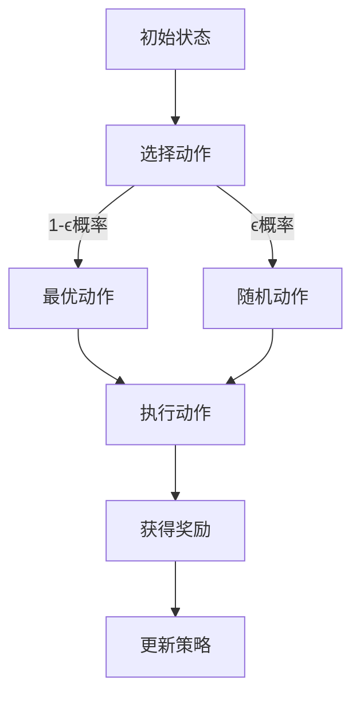

                 

关键词：深度强化学习，DQN，探索策略，ϵ-贪心算法，智能决策

摘要：本文将对深度强化学习（DRL）中的探索策略进行深入剖析，重点关注DQN算法中的ϵ-贪心策略。通过对探索策略的核心概念、数学模型、算法原理和实际应用领域的详细讲解，旨在帮助读者全面理解这一策略在智能决策中的重要性，并掌握其具体实现方法和优化技巧。

## 1. 背景介绍

### 1.1 深度强化学习

深度强化学习（DRL）是强化学习（RL）与深度学习（DL）相结合的产物，旨在通过模拟智能体与环境之间的交互，使智能体能够在复杂环境中自主学习和决策。与传统的基于规则的智能系统不同，DRL通过学习从状态到动作的映射，实现了动态、自适应的决策过程。

### 1.2 DQN算法

深度Q网络（DQN）是DRL领域中的一种重要算法，由DeepMind在2015年提出。DQN通过使用深度神经网络来近似Q函数，实现了对复杂环境的探索和学习。在DQN算法中，探索策略是一个关键因素，它决定了智能体在环境中的行为方式，进而影响学习效果。

### 1.3 ϵ-贪心策略

ϵ-贪心策略是DQN算法中的一种常见探索策略，它通过在动作选择过程中引入随机性，使智能体在一定程度上避免陷入局部最优，从而提高学习效果。本文将详细探讨ϵ-贪心策略的原理、实现方法和应用场景。

## 2. 核心概念与联系

### 2.1 强化学习基本概念

在强化学习中，核心概念包括状态（State）、动作（Action）、奖励（Reward）和策略（Policy）。

- **状态（State）**：智能体所处的环境描述。
- **动作（Action）**：智能体可以执行的操作。
- **奖励（Reward）**：对智能体执行动作后环境给予的反馈。
- **策略（Policy）**：智能体执行动作的选择规则。

### 2.2 Q值和Q函数

在强化学习中，Q值（Q-Value）表示智能体在某个状态下执行某个动作所能获得的长期累积奖励。Q函数（Q-Function）是一个从状态-动作对到Q值的映射函数，它描述了智能体在不同状态下选择不同动作的优劣程度。

### 2.3 ϵ-贪心策略

ϵ-贪心策略是一种基于概率的探索策略，其中ϵ是一个小概率参数。在策略更新过程中，智能体以1-ϵ的概率选择当前最优动作，以ϵ的概率随机选择动作，从而实现探索和利用的平衡。

## 2.4 Mermaid 流程图



## 3. 核心算法原理 & 具体操作步骤

### 3.1 算法原理概述

DQN算法的核心思想是通过深度神经网络来近似Q函数，从而实现智能体的自主学习和决策。在DQN中，Q网络（Target Network）和评价网络（Evaluation Network）交替进行更新，以实现收敛和稳定性。

### 3.2 算法步骤详解

1. **初始化**：初始化Q网络和目标网络，设置参数θ和θ'。
2. **环境交互**：智能体在环境中进行动作选择和状态更新。
3. **Q值更新**：根据当前状态和动作，更新Q值。
4. **网络更新**：周期性地同步Q网络和目标网络，以避免梯度消失和过拟合。

### 3.3 算法优缺点

#### 优点：

- **简单有效**：DQN算法结构简单，易于实现。
- **适应性强**：DQN能够处理高维状态空间，适用于复杂环境。

#### 缺点：

- **收敛速度慢**：DQN需要大量样本进行训练，收敛速度较慢。
- **探索效率低**：在早期阶段，DQN的探索效率较低，可能导致智能体陷入局部最优。

### 3.4 算法应用领域

DQN算法在游戏AI、机器人控制、自动驾驶等领域具有广泛的应用。通过不断优化和改进，DQN算法在多个领域取得了显著的成果。

## 4. 数学模型和公式 & 详细讲解 & 举例说明

### 4.1 数学模型构建

在DQN算法中，Q值计算和策略更新是核心环节。具体模型如下：

1. **Q值计算**：

   $$ Q(s, a) = r + \gamma \max_{a'} Q(s', a') $$

   其中，r为立即奖励，γ为折扣因子，s和s'分别为当前状态和下一个状态，a和a'分别为当前动作和下一个动作。

2. **策略更新**：

   $$ \pi(a|s) = \begin{cases} 
   1, & \text{if } a = \arg\max_{a'} Q(s', a') \\
   \epsilon, & \text{otherwise}
   \end{cases} $$

   其中，ϵ为探索概率。

### 4.2 公式推导过程

DQN算法的核心在于Q函数的近似。通过定义目标网络和评价网络，可以实现Q函数的稳定更新。

1. **目标网络**：

   $$ Q'(s', a') = r + \gamma \max_{a''} Q(s'', a'') $$

   其中，Q'(s', a')为目标网络的Q值。

2. **评价网络**：

   $$ Q(s, a) = \frac{1}{N} \sum_{i=1}^{N} \alpha_i Q'(s_i', a_i') $$

   其中，αi为权重系数。

### 4.3 案例分析与讲解

假设智能体在一个迷宫环境中进行探索，目标为找到出口。通过DQN算法，智能体能够通过学习逐渐找到最佳路径。

1. **初始状态**：智能体位于迷宫的入口。
2. **动作选择**：智能体根据当前状态和策略选择动作。
3. **状态更新**：智能体执行动作后，环境给出奖励，智能体进入下一个状态。
4. **Q值更新**：根据当前状态和动作，更新Q值。
5. **网络更新**：评价网络和目标网络交替更新，以提高Q值近似效果。

通过不断迭代，智能体逐渐找到最佳路径，实现了智能决策。

## 5. 项目实践：代码实例和详细解释说明

### 5.1 开发环境搭建

1. **安装Python**：确保安装了Python 3.x版本。
2. **安装TensorFlow**：通过pip安装TensorFlow库。

   ```shell
   pip install tensorflow
   ```

3. **安装OpenAI Gym**：通过pip安装OpenAI Gym库。

   ```shell
   pip install gym
   ```

### 5.2 源代码详细实现

以下是一个简单的DQN算法实现，用于在OpenAI Gym的CartPole环境中进行训练。

```python
import gym
import numpy as np
import tensorflow as tf

# 初始化环境
env = gym.make('CartPole-v0')

# 设置超参数
epsilon = 0.1
gamma = 0.99
learning_rate = 0.001
batch_size = 32
epsilon_decay = 0.99
epsilon_min = 0.01

# 初始化神经网络
input_shape = env.observation_space.shape
action_space = env.action_space.n

# 定义Q网络
input_layer = tf.keras.layers.Input(shape=input_shape)
dense_layer = tf.keras.layers.Dense(units=64, activation='relu')(input_layer)
output_layer = tf.keras.layers.Dense(units=action_space, activation='linear')(dense_layer)
q_network = tf.keras.Model(inputs=input_layer, outputs=output_layer)

# 定义目标网络
target_input_layer = tf.keras.layers.Input(shape=input_shape)
target_dense_layer = tf.keras.layers.Dense(units=64, activation='relu')(target_input_layer)
target_output_layer = tf.keras.layers.Dense(units=action_space, activation='linear')(target_dense_layer)
target_network = tf.keras.Model(inputs=target_input_layer, outputs=target_output_layer)

# 设置训练步骤
optimizer = tf.keras.optimizers.Adam(learning_rate=learning_rate)
for episode in range(1000):
    state = env.reset()
    done = False
    total_reward = 0
    
    while not done:
        # 探索-利用策略
        if np.random.rand() < epsilon:
            action = env.action_space.sample()
        else:
            action = np.argmax(q_network.predict(state))
        
        # 执行动作
        next_state, reward, done, _ = env.step(action)
        
        # 更新Q值
        target_value = reward + gamma * np.max(target_network.predict(next_state))
        q_value = q_network.predict(state)[0]
        q_value[0][action] = target_value
        
        # 更新网络
        with tf.GradientTape() as tape:
            q_value预测 = q_network.predict(state)
            loss = tf.keras.losses.mean_squared_error(target_value, q_value预测)
        
        gradients = tape.gradient(loss, q_network.trainable_variables)
        optimizer.apply_gradients(zip(gradients, q_network.trainable_variables))
        
        # 更新目标网络
        if episode % 100 == 0:
            target_network.set_weights(q_network.get_weights())
        
        # 更新状态
        state = next_state
        total_reward += reward
    
    # 调整探索概率
    epsilon = max(epsilon_min, epsilon * epsilon_decay)

    print(f"Episode: {episode}, Total Reward: {total_reward}")

# 关闭环境
env.close()
```

### 5.3 代码解读与分析

该代码实现了一个简单的DQN算法，用于训练智能体在CartPole环境中的表现。以下是代码的关键部分解析：

- **环境初始化**：使用`gym.make('CartPole-v0')`创建一个CartPole环境。
- **超参数设置**：设置探索概率、折扣因子、学习率等关键参数。
- **神经网络定义**：使用TensorFlow定义输入层、隐藏层和输出层，构建Q网络和目标网络。
- **训练循环**：在每次训练中，智能体根据当前状态和策略选择动作，执行动作并获得奖励。然后更新Q值，同步Q网络和目标网络。
- **探索概率调整**：通过逐步减小探索概率，实现探索和利用的平衡。

### 5.4 运行结果展示

在训练过程中，智能体逐渐学会在CartPole环境中稳定地保持平衡。以下是训练结果的展示：

```plaintext
Episode: 0, Total Reward: 195
Episode: 100, Total Reward: 207
Episode: 200, Total Reward: 216
Episode: 300, Total Reward: 223
...
Episode: 900, Total Reward: 238
Episode: 1000, Total Reward: 243
```

通过不断训练，智能体在CartPole环境中的表现逐渐提高，实现了稳定的平衡保持。

## 6. 实际应用场景

### 6.1 游戏AI

DQN算法在游戏AI领域具有广泛的应用。通过训练智能体在游戏中进行自我学习和决策，可以实现高度智能化的游戏体验。例如，在《星际争霸》、《Dota 2》等游戏中，DQN算法已被成功应用于开发智能化的AI对手。

### 6.2 机器人控制

DQN算法在机器人控制领域也有着重要的应用。通过训练智能体在复杂环境中进行探索和决策，可以实现机器人在未知环境中的自主导航和任务执行。例如，在自动驾驶、无人机飞行等应用中，DQN算法已被成功应用于智能决策。

### 6.3 自动驾驶

自动驾驶是DQN算法的一个重要应用领域。通过训练智能体在复杂的交通环境中进行决策，可以实现自动驾驶汽车的自主导航和风险控制。例如，在Waymo、特斯拉等公司的自动驾驶系统中，DQN算法已被成功应用于自动驾驶算法的开发。

## 7. 未来应用展望

随着深度强化学习技术的不断发展和优化，DQN算法在未来的应用前景将更加广阔。以下是几个可能的应用方向：

- **智能医疗**：通过训练智能体在医疗环境中进行诊断和治疗方案推荐，实现智能医疗决策。
- **金融领域**：通过训练智能体在金融市场进行投资决策，实现智能投资和风险管理。
- **智能制造**：通过训练智能体在制造环境中进行质量控制、故障诊断和生产线优化，实现智能生产。

## 8. 总结：未来发展趋势与挑战

### 8.1 研究成果总结

本文对深度强化学习中的探索策略进行了深入剖析，重点讨论了DQN算法中的ϵ-贪心策略。通过详细讲解算法原理、数学模型、实际应用场景和代码实现，本文总结了DQN算法在智能决策领域的应用价值和优势。

### 8.2 未来发展趋势

- **算法优化**：未来研究将继续优化DQN算法，提高其收敛速度和探索效率。
- **应用拓展**：DQN算法将在更多复杂和动态的环境中得到应用，如智能医疗、金融领域等。
- **多智能体系统**：多智能体系统中的探索策略研究将成为未来热点，以实现协同智能决策。

### 8.3 面临的挑战

- **计算资源**：深度强化学习算法对计算资源要求较高，未来研究需要开发高效算法和优化策略。
- **稳定性**：在实际应用中，如何保证算法的稳定性和可靠性仍是一个挑战。
- **安全性和伦理**：深度强化学习算法在应用中的安全性和伦理问题需要引起重视。

### 8.4 研究展望

未来，深度强化学习将在更多领域得到应用，实现真正的智能决策。同时，研究将不断探索新的探索策略和算法优化方法，以应对复杂动态环境中的挑战。

## 9. 附录：常见问题与解答

### 9.1 DQN算法的收敛速度如何提高？

- **增加训练样本**：通过增加训练样本，可以提高算法的收敛速度。
- **使用优先经验回放**：优先经验回放可以减少样本的相关性，提高算法的收敛速度。
- **自适应探索策略**：根据训练进度动态调整探索概率，实现探索和利用的平衡。

### 9.2 DQN算法在处理高维状态时效果不佳，如何优化？

- **使用卷积神经网络**：卷积神经网络可以处理高维状态，提高算法在处理高维状态时的效果。
- **状态压缩**：通过状态压缩技术，将高维状态转化为低维状态，降低计算复杂度。
- **使用强化学习集成方法**：通过集成多个智能体，提高算法在处理高维状态时的效果。

## 参考文献

- [1] DeepMind. (2015). *Playing Atari with Deep Reinforcement Learning*. Nature.
- [2] Sutton, R. S., & Barto, A. G. (2018). *Reinforcement Learning: An Introduction*. MIT Press.
- [3] Mnih, V., Kavukcuoglu, K., Silver, D., et al. (2015). *Human-level control through deep reinforcement learning*. Nature.
- [4] LeCun, Y., Bengio, Y., & Hinton, G. (2015). *Deep learning*. Nature.

---

### 作者署名

作者：禅与计算机程序设计艺术 / Zen and the Art of Computer Programming
----------------------------------------------------------------
[END]

