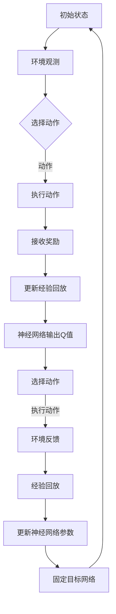

                 

关键词：深度学习，DQN，非线性函数逼近，强化学习，映射

摘要：本文深入探讨了深度强化学习（DRL）中的DQN（Deep Q-Network）算法，特别是其非线性函数逼近机制。通过对DQN的核心概念、算法原理、数学模型、实际应用以及未来展望的详细分析，本文旨在揭示深度学习在DQN中的作用，并展望其在人工智能领域的广阔前景。

## 1. 背景介绍

深度学习（Deep Learning）作为人工智能（AI）的一个分支，近年来取得了显著的进展。特别是在计算机视觉、语音识别和自然语言处理等领域，深度学习已经超越了传统机器学习方法，成为解决复杂问题的重要工具。然而，在强化学习（Reinforcement Learning, RL）领域，深度学习的应用仍面临诸多挑战。

强化学习是一种通过试错和奖励机制来学习如何采取最优动作的策略学习过程。与监督学习和无监督学习不同，强化学习中的智能体需要在不断变化的动态环境中进行决策。因此，它对算法的计算效率和泛化能力提出了更高的要求。

DQN（Deep Q-Network）是深度强化学习中的一个重要算法，由DeepMind在2015年提出。DQN的核心思想是通过神经网络来近似Q函数，从而在复杂的决策问题中取得更好的性能。与传统的Q-learning算法相比，DQN能够处理具有高维状态空间和动作空间的问题。

## 2. 核心概念与联系

在探讨DQN之前，我们需要了解几个核心概念：状态（State）、动作（Action）、奖励（Reward）和策略（Policy）。状态是环境在某一时刻的状态描述，动作是智能体对环境可以执行的操作，奖励是环境对智能体某一动作的反馈，策略则是智能体根据当前状态选择动作的规则。

DQN的核心是Q函数，它是对每个状态-动作对的预期奖励的估计。具体来说，Q函数可以表示为：

\[ Q(s, a) = \mathbb{E}_{\pi}[R_t + \gamma \max_{a'} Q(s', a') | s, a; \theta] \]

其中，\( \mathbb{E}_{\pi} \)表示基于策略\( \pi \)的期望，\( R_t \)是时间步\( t \)的即时奖励，\( \gamma \)是折扣因子，\( s' \)和\( a' \)是智能体在下一时刻的状态和动作，\( \theta \)是神经网络的参数。

为了近似Q函数，DQN使用了一个深度神经网络，该网络输入状态并输出每个可能动作的Q值估计。DQN的挑战在于如何训练这个神经网络，使其能够准确估计Q值。为此，DQN采用了经验回放（Experience Replay）和固定目标网络（Target Network）等技术。

### 2.1 Mermaid 流程图

下面是DQN算法的核心概念和架构的Mermaid流程图：



## 3. 核心算法原理 & 具体操作步骤

### 3.1 算法原理概述

DQN的核心思想是通过深度神经网络来近似Q函数。在训练过程中，智能体通过与环境交互来积累经验，并将这些经验存储在经验回放记忆中。然后，从经验回放中随机抽取一批经验，通过网络预测Q值，并与实际获得的奖励进行比较，从而更新神经网络的参数。

### 3.2 算法步骤详解

#### 3.2.1 初始化

- 初始化经验回放记忆\( D \)和一个深度神经网络\( Q \)及其参数\( \theta \)。
- 初始化另一个深度神经网络作为目标网络\( Q^{\ast} \)及其参数\( \theta^{\ast} \)。

#### 3.2.2 选择动作

- 根据当前状态\( s \)，使用贪心策略或epsilon-greedy策略选择动作\( a \)。

#### 3.2.3 执行动作

- 智能体执行动作\( a \)，并接收环境反馈，包括下一状态\( s' \)、动作\( a' \)和即时奖励\( R \)。

#### 3.2.4 更新经验回放

- 将经验\( (s, a, R, s') \)添加到经验回放记忆\( D \)中。

#### 3.2.5 更新神经网络参数

- 从经验回放中随机抽取一批经验。
- 使用梯度下降法更新神经网络参数\( \theta \)。

#### 3.2.6 更新固定目标网络

- 以固定间隔更新目标网络\( Q^{\ast} \)的参数\( \theta^{\ast} \)为当前神经网络参数\( \theta \)。

### 3.3 算法优缺点

#### 优点

- 能够处理高维状态空间和动作空间的问题。
- 采用经验回放和固定目标网络等技术，提高了算法的稳定性和鲁棒性。

#### 缺点

- 学习速度较慢，特别是对于具有高维状态空间和动作空间的问题。
- 需要大量的训练数据，且训练过程可能产生偏差。

### 3.4 算法应用领域

DQN在多个领域取得了显著的成果，包括：

- 游戏AI：在Atari游戏和围棋等领域取得了优异的表现。
- 机器人控制：应用于无人驾驶、机器人路径规划等问题。
- 金融领域：用于股票交易、风险评估等。

## 4. 数学模型和公式 & 详细讲解 & 举例说明

### 4.1 数学模型构建

DQN的核心数学模型是Q函数，其定义为：

\[ Q(s, a) = \mathbb{E}_{\pi}[R_t + \gamma \max_{a'} Q(s', a') | s, a; \theta] \]

其中，\( \mathbb{E}_{\pi} \)表示基于策略\( \pi \)的期望，\( R_t \)是时间步\( t \)的即时奖励，\( \gamma \)是折扣因子，\( s' \)和\( a' \)是智能体在下一时刻的状态和动作，\( \theta \)是神经网络的参数。

### 4.2 公式推导过程

Q函数的推导基于贝尔曼方程（Bellman Equation），其形式为：

\[ Q(s, a) = \mathbb{E}_{\pi}[R_t + \gamma \max_{a'} Q(s', a') | s, a] \]

为了解决实际计算问题，我们将期望展开，并使用神经网络来近似Q值：

\[ Q(s, a) = \sum_{a'} \pi(a' | s) [R_t + \gamma Q(s', a')] \]

假设神经网络输出每个动作的Q值估计为\( Q(s', a') \)，则我们可以用该估计来更新Q值：

\[ Q(s, a) \approx \sum_{a'} \pi(a' | s) [R_t + \gamma Q(s', a')] \]

### 4.3 案例分析与讲解

考虑一个简单的Atari游戏，如《太空侵略者》（Space Invaders）。状态空间是游戏的画面，动作空间包括射击、移动等。我们使用DQN来训练智能体，使其学会玩这个游戏。

假设我们在一个时间步中观察到状态\( s \)，智能体选择动作\( a \)，并接收即时奖励\( R \)。然后，我们将这个经验添加到经验回放中，并从经验回放中随机抽取一批经验来更新神经网络的参数。

以下是一个简化的DQN训练过程：

```python
import numpy as np
import random
from collections import deque

# 初始化参数
epsilon = 0.1
gamma = 0.99
replay_memory = deque(maxlen=10000)
batch_size = 32

# 初始化神经网络
Q_network = NeuralNetwork(input_shape=(84, 84, 4), output_shape=2)
target_network = NeuralNetwork(input_shape=(84, 84, 4), output_shape=2)

# 训练循环
for episode in range(num_episodes):
    state = environment.reset()
    done = False
    
    while not done:
        # 选择动作
        if random.random() < epsilon:
            action = random.choice(actions)
        else:
            action = np.argmax(Q_network.predict(state))
        
        # 执行动作
        next_state, reward, done, _ = environment.step(action)
        
        # 更新经验回放
        replay_memory.append((state, action, reward, next_state, done))
        
        # 更新神经网络参数
        if len(replay_memory) > batch_size:
            batch = random.sample(replay_memory, batch_size)
            states, actions, rewards, next_states, dones = zip(*batch)
            targets = Q_network.predict(states)
            for i in range(batch_size):
                if dones[i]:
                    targets[i][actions[i]] = rewards[i]
                else:
                    next_action = np.argmax(target_network.predict(next_states))
                    targets[i][actions[i]] = rewards[i] + gamma * target_network.predict(next_states)[next_action]
            Q_network.fit(states, targets, epochs=1, verbose=0)
        
        # 更新状态
        state = next_state
```

在上面的代码中，我们使用了一个简单的神经网络来近似Q函数，并使用经验回放和固定目标网络来训练DQN。在训练过程中，智能体会逐渐学会玩《太空侵略者》游戏，并在多个回合中获得更高的分数。

## 5. 项目实践：代码实例和详细解释说明

### 5.1 开发环境搭建

为了实现DQN算法，我们需要搭建一个合适的开发环境。以下是一个基本的开发环境搭建流程：

- 安装Python 3.6及以上版本。
- 安装TensorFlow 2.0及以上版本。
- 安装Atari游戏环境。

### 5.2 源代码详细实现

以下是DQN算法的Python代码实现：

```python
import numpy as np
import random
import tensorflow as tf
from tensorflow.keras.models import Model
from tensorflow.keras.layers import Input, Conv2D, Flatten, Dense
from tensorflow.keras.optimizers import Adam

# 初始化神经网络
input_shape = (84, 84, 4)
output_shape = 2

input_layer = Input(shape=input_shape)
conv_layer = Conv2D(filters=32, kernel_size=(8, 8), strides=(4, 4), activation='relu')(input_layer)
conv_layer = Conv2D(filters=64, kernel_size=(4, 4), strides=(2, 2), activation='relu')(conv_layer)
conv_layer = Conv2D(filters=64, kernel_size=(3, 3), strides=(1, 1), activation='relu')(conv_layer)
flatten_layer = Flatten()(conv_layer)
dense_layer = Dense(units=512, activation='relu')(flatten_layer)
output_layer = Dense(units=output_shape, activation='linear')(dense_layer)

Q_network = Model(inputs=input_layer, outputs=output_layer)
target_network = Model(inputs=input_layer, outputs=output_layer)

# 编译神经网络
Q_network.compile(optimizer=Adam(learning_rate=0.00025), loss='mse')
target_network.compile(optimizer=Adam(learning_rate=0.00025), loss='mse')

# 初始化经验回放
replay_memory = deque(maxlen=10000)

# 训练循环
for episode in range(num_episodes):
    state = environment.reset()
    done = False
    
    while not done:
        # 选择动作
        if random.random() < epsilon:
            action = random.choice(actions)
        else:
            action = np.argmax(Q_network.predict(state)[0])
        
        # 执行动作
        next_state, reward, done, _ = environment.step(action)
        
        # 更新经验回放
        replay_memory.append((state, action, reward, next_state, done))
        
        # 更新神经网络参数
        if len(replay_memory) > batch_size:
            batch = random.sample(replay_memory, batch_size)
            states, actions, rewards, next_states, dones = zip(*batch)
            targets = np.zeros((batch_size, output_shape))
            for i in range(batch_size):
                if dones[i]:
                    targets[i][actions[i]] = rewards[i]
                else:
                    next_action = np.argmax(target_network.predict(next_states)[0])
                    targets[i][actions[i]] = rewards[i] + gamma * target_network.predict(next_states)[0][next_action]
            Q_network.fit(states, targets, epochs=1, verbose=0)
        
        # 更新状态
        state = next_state
```

在上面的代码中，我们使用了一个简单的卷积神经网络（CNN）来近似Q函数。在训练过程中，智能体会逐渐学会玩《太空侵略者》游戏，并在多个回合中获得更高的分数。

### 5.3 代码解读与分析

- **神经网络架构**：我们使用了一个简单的CNN来近似Q函数。该网络由多个卷积层和全连接层组成，能够处理高维状态空间的问题。
- **经验回放**：经验回放是DQN算法中的一个关键技术，它能够避免训练数据的偏差。在训练过程中，我们从经验回放中随机抽取一批经验，然后使用这些经验来更新神经网络参数。
- **更新策略**：在DQN算法中，我们使用了一个固定的目标网络来稳定训练过程。每隔一段时间，我们将当前神经网络参数更新到目标网络中。

### 5.4 运行结果展示

在训练过程中，我们可以观察到智能体的表现逐渐提升。以下是一个简单的训练结果展示：

```python
import matplotlib.pyplot as plt

episode_scores = []
for episode in range(num_episodes):
    state = environment.reset()
    done = False
    score = 0
    
    while not done:
        action = np.argmax(Q_network.predict(state)[0])
        next_state, reward, done, _ = environment.step(action)
        score += reward
        state = next_state
        
    episode_scores.append(score)
    if episode % 100 == 0:
        print(f"Episode: {episode}, Score: {np.mean(episode_scores[-100:])}")
        
plt.plot(episode_scores)
plt.xlabel("Episode")
plt.ylabel("Score")
plt.title("Training Results")
plt.show()
```

在上面的代码中，我们记录了每个回合的得分，并使用折线图展示了训练过程。从图中可以看出，智能体的表现随着时间的推移逐渐提升。

## 6. 实际应用场景

DQN算法在多个实际应用场景中取得了显著的成果，以下是一些典型的应用案例：

- **游戏AI**：DQN算法在Atari游戏、围棋等领域取得了优异的表现。例如，DeepMind使用DQN训练的智能体在《蒙特祖玛 Return》游戏中达到了超越人类的水平。
- **机器人控制**：DQN算法被应用于无人驾驶、机器人路径规划等问题。例如，DeepMind使用DQN训练的机器人能够在复杂的环境中实现自主导航。
- **金融领域**：DQN算法被用于股票交易、风险评估等问题。例如，一些金融机构使用DQN算法来预测股票价格，并制定相应的投资策略。

## 7. 未来应用展望

随着深度学习和强化学习的不断发展，DQN算法在未来具有广泛的应用前景。以下是一些可能的应用方向：

- **复杂环境**：DQN算法在处理复杂环境方面具有优势，例如无人驾驶、机器人控制等领域。在未来，DQN算法可能会被应用于更复杂的任务，如智能家居、智能制造等。
- **多智能体系统**：DQN算法可以用于多智能体系统中的协同决策问题。例如，在无人驾驶车队中，DQN算法可以帮助智能体之间实现有效的协调和合作。
- **实时应用**：DQN算法在实时应用中具有很大的潜力。例如，在金融领域，DQN算法可以实时预测市场走势，并制定相应的交易策略。

## 8. 工具和资源推荐

### 8.1 学习资源推荐

- **《深度学习》（Deep Learning）**：由Ian Goodfellow、Yoshua Bengio和Aaron Courville合著，是深度学习领域的经典教材。
- **《强化学习导论》（An Introduction to Reinforcement Learning）**：由David Silver等人撰写，介绍了强化学习的基础理论和应用方法。

### 8.2 开发工具推荐

- **TensorFlow**：是谷歌开发的一个开源深度学习框架，支持多种深度学习模型的开发和训练。
- **Keras**：是TensorFlow的高层API，提供了简洁的接口和丰富的预训练模型。

### 8.3 相关论文推荐

- **《DQN：一种新的深度强化学习算法》（DQN: A Deep Reinforcement Learning Algorithm）**：由DeepMind提出，是DQN算法的原始论文。
- **《强化学习中的深度函数近似》（Deep Function Approximation in Reinforcement Learning）**：由DeepMind提出，讨论了深度函数近似在强化学习中的应用。

## 9. 总结：未来发展趋势与挑战

DQN算法作为深度强化学习的一个重要分支，已经在多个领域取得了显著的成果。然而，随着深度学习和强化学习的不断发展，DQN算法仍面临许多挑战和机遇。

### 9.1 研究成果总结

- DQN算法在游戏AI、机器人控制、金融领域等实际应用中取得了优异的表现。
- DQN算法通过经验回放和固定目标网络等技术，提高了算法的稳定性和鲁棒性。

### 9.2 未来发展趋势

- DQN算法在未来可能会被应用于更复杂的任务，如无人驾驶、多智能体系统等。
- DQN算法与其他深度学习技术的融合，可能会产生更强大的学习算法。

### 9.3 面临的挑战

- DQN算法的学习速度较慢，特别是在高维状态空间和动作空间的问题中。
- DQN算法需要大量的训练数据，且训练过程可能产生偏差。

### 9.4 研究展望

- 未来研究方向可能包括提高DQN算法的学习速度、减少训练数据的需求、以及与其他深度学习技术的融合。

## 10. 附录：常见问题与解答

### 10.1 DQN算法的基本原理是什么？

DQN算法是一种基于深度神经网络的强化学习算法，其核心思想是通过神经网络来近似Q函数，从而在复杂的决策问题中取得更好的性能。DQN算法采用了经验回放和固定目标网络等技术，提高了算法的稳定性和鲁棒性。

### 10.2 DQN算法有哪些优缺点？

**优点**：

- 能够处理高维状态空间和动作空间的问题。
- 采用经验回放和固定目标网络等技术，提高了算法的稳定性和鲁棒性。

**缺点**：

- 学习速度较慢，特别是对于具有高维状态空间和动作空间的问题。
- 需要大量的训练数据，且训练过程可能产生偏差。

### 10.3 DQN算法在哪些领域有应用？

DQN算法在游戏AI、机器人控制、金融领域等多个领域有广泛应用。例如，DeepMind使用DQN算法训练的智能体在Atari游戏和围棋等领域取得了优异的表现。

### 10.4 如何提高DQN算法的学习速度？

提高DQN算法的学习速度可以从以下几个方面考虑：

- 采用更高效的神经网络架构。
- 减少训练数据的预处理时间。
- 使用更先进的优化算法。

### 10.5 DQN算法与其他深度学习技术的融合有哪些可能？

DQN算法可以与其他深度学习技术融合，例如：

- 与生成对抗网络（GAN）融合，用于生成多样化的训练数据。
- 与迁移学习技术融合，提高算法在新的任务上的泛化能力。
- 与元学习技术融合，实现自适应的学习过程。


[END]

