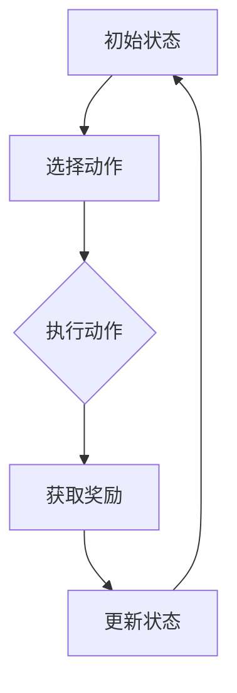

                 

关键词：深度强化学习、DQN、优化技巧、奖励设计、映射机制、智能体、策略更新、算法性能

摘要：本文旨在深入探讨深度强化学习中的DQN（深度Q网络）算法优化技巧，特别是奖励设计原则。通过对DQN算法的背景介绍、核心概念与联系分析、数学模型构建、具体操作步骤讲解、项目实践、实际应用场景解析，以及未来发展趋势与挑战的展望，本文希望为读者提供全面的技术解读和实用指导。

## 1. 背景介绍

深度强化学习（Deep Reinforcement Learning, DRL）作为机器学习领域的一项前沿技术，近年来在学术界和工业界都获得了广泛关注。DRL通过智能体（Agent）与环境（Environment）的交互，通过学习获得最优策略（Policy），从而实现自主决策和优化目标。其中，DQN算法作为DRL的重要分支之一，因其能够通过深度神经网络（Deep Neural Network）实现Q值的预测和优化，成为众多应用场景下的首选算法。

然而，DQN算法在实际应用中仍存在许多挑战，如收敛速度慢、易陷入局部最优等问题。这些问题在很大程度上与奖励设计原则密切相关。因此，优化DQN算法中的奖励设计原则，成为提高算法性能和实现高效学习的关键。

本文将从以下几个方面展开讨论：

1. **核心概念与联系**：介绍DQN算法的核心概念，并使用Mermaid流程图展示其原理和架构。
2. **核心算法原理 & 具体操作步骤**：详细讲解DQN算法的原理和具体操作步骤，分析其优缺点及应用领域。
3. **数学模型和公式**：构建DQN算法的数学模型，推导相关公式，并通过案例进行分析和讲解。
4. **项目实践：代码实例**：提供具体的代码实例，详细解释说明其实现过程和运行结果。
5. **实际应用场景**：分析DQN算法在不同领域的应用场景，探讨其未来发展趋势。
6. **工具和资源推荐**：推荐相关的学习资源、开发工具和论文，为读者提供更深入的学习和实践指导。
7. **总结：未来发展趋势与挑战**：总结研究成果，展望未来发展趋势和面临的挑战。

## 2. 核心概念与联系

### 2.1. 核心概念

**深度强化学习（DRL）**：结合深度神经网络（DNN）和强化学习（RL）的技术，通过智能体与环境交互，学习最优策略。

**深度Q网络（DQN）**：一种基于深度神经网络的Q学习算法，通过预测状态-动作值（Q值）来选择动作。

**智能体（Agent）**：执行动作并从环境中接收奖励的实体。

**环境（Environment）**：智能体进行交互的动态系统。

**策略（Policy）**：智能体根据当前状态选择动作的方法。

**状态（State）**：描述智能体所处环境的特征。

**动作（Action）**：智能体可以执行的操作。

**奖励（Reward）**：智能体执行动作后获得的奖励信号，用于指导学习过程。

### 2.2. 联系分析

DQN算法的核心是状态-动作值函数（State-Action Value Function），它描述了在特定状态下执行特定动作的预期奖励。为了实现这一目标，DQN算法采用深度神经网络作为Q值的预测器。


在DQN算法中，智能体首先从环境中获取初始状态，然后根据当前状态和策略选择一个动作，并在执行该动作后获得相应的奖励和下一个状态。基于这些反馈信息，智能体更新其策略，以最大化长期奖励。

### 2.3. Mermaid 流程图

以下是一个使用Mermaid绘制的DQN算法流程图，展示了智能体与环境交互的过程：



通过这个流程图，我们可以清晰地看到智能体在DQN算法中的操作步骤和状态转移过程。

## 3. 核心算法原理 & 具体操作步骤

### 3.1. 算法原理概述

DQN算法是一种基于Q学习的深度强化学习算法，其核心思想是使用深度神经网络来预测状态-动作值（Q值），从而指导智能体的行动。Q值表示在特定状态下执行特定动作的预期奖励。

DQN算法的基本流程如下：

1. **初始化**：初始化深度神经网络、经验回放缓冲区、目标网络和策略。
2. **选择动作**：根据当前状态和策略，选择一个动作。
3. **执行动作**：在环境中执行所选动作，并获取奖励和下一个状态。
4. **更新经验回放缓冲区**：将新的状态-动作对添加到经验回放缓冲区。
5. **更新目标网络**：定期同步当前网络和目标网络。
6. **更新策略**：根据新获得的奖励和下一个状态，更新策略。
7. **重复步骤2-6**，直到满足停止条件。

### 3.2. 算法步骤详解

#### 3.2.1. 初始化

在DQN算法的初始化阶段，我们需要完成以下任务：

1. **初始化深度神经网络**：使用随机权重初始化深度神经网络，并设置适当的激活函数和损失函数。
2. **初始化经验回放缓冲区**：为了防止训练数据偏差，使用经验回放缓冲区来存储智能体与环境交互的经验。
3. **初始化目标网络**：初始化一个与当前网络结构相同的目标网络，用于稳定学习过程。
4. **初始化策略**：根据当前的状态-动作值，选择一个动作概率分布作为初始策略。

#### 3.2.2. 选择动作

在选择动作阶段，智能体根据当前状态和策略选择一个动作。具体步骤如下：

1. **获取当前状态**：从环境中获取当前状态。
2. **计算Q值**：使用当前网络计算当前状态的Q值。
3. **选择动作**：根据Q值和策略选择一个动作。常见的选择方法包括epsilon-贪心策略、确定性策略等。

#### 3.2.3. 执行动作

在执行动作阶段，智能体在环境中执行所选动作，并获取相应的奖励和下一个状态。具体步骤如下：

1. **执行动作**：在环境中执行所选动作。
2. **获取奖励**：根据执行的动作，从环境中获取奖励。
3. **获取下一个状态**：从环境中获取下一个状态。

#### 3.2.4. 更新经验回放缓冲区

在更新经验回放缓冲区阶段，智能体将新的状态-动作对添加到经验回放缓冲区。具体步骤如下：

1. **获取经验样本**：从当前状态、动作、奖励和下一个状态中获取一个经验样本。
2. **添加到经验回放缓冲区**：将经验样本添加到经验回放缓冲区。

#### 3.2.5. 更新目标网络

在更新目标网络阶段，我们需要定期同步当前网络和目标网络。具体步骤如下：

1. **同步网络参数**：将当前网络的参数复制到目标网络。
2. **定期执行**：在训练过程中，定期执行同步操作，以确保目标网络稳定更新。

#### 3.2.6. 更新策略

在更新策略阶段，智能体根据新获得的奖励和下一个状态，更新策略。具体步骤如下：

1. **更新Q值**：使用新的奖励和下一个状态的Q值，更新当前状态的Q值。
2. **调整策略**：根据更新的Q值，调整动作概率分布，以最大化长期奖励。

#### 3.2.7. 重复步骤

在完成上述步骤后，智能体继续重复步骤2-6，直到满足停止条件，如达到指定步数、达到目标值等。

### 3.3. 算法优缺点

**优点**：

1. **适用性强**：DQN算法可以应用于各种具有状态-动作值函数的强化学习问题。
2. **灵活性高**：通过深度神经网络，DQN算法能够处理高维状态空间和动作空间。
3. **易于扩展**：DQN算法可以与其他强化学习算法结合，实现更复杂的学习策略。

**缺点**：

1. **收敛速度慢**：DQN算法需要大量样本进行训练，收敛速度相对较慢。
2. **易陷入局部最优**：在训练过程中，智能体可能会陷入局部最优，导致学习效果不佳。

### 3.4. 算法应用领域

DQN算法在多个领域具有广泛的应用，包括但不限于：

1. **游戏**：例如，在《Atari》游戏中，DQN算法已被证明具有出色的表现。
2. **自动驾驶**：在自动驾驶领域，DQN算法可以用于路径规划、障碍物检测等任务。
3. **机器人控制**：在机器人控制领域，DQN算法可以用于机器人运动控制、环境感知等任务。

## 4. 数学模型和公式 & 详细讲解 & 举例说明

### 4.1. 数学模型构建

DQN算法的核心是状态-动作值函数（Q值），其数学模型可以表示为：

$$ Q(s, a) = r(s, a) + \gamma \max_{a'} Q(s', a') $$

其中，$Q(s, a)$表示在状态$s$下执行动作$a$的预期奖励，$r(s, a)$表示执行动作$a$后获得的即时奖励，$\gamma$表示折扣因子，$s'$表示执行动作$a$后的下一个状态，$a'$表示在状态$s'$下的最优动作。

### 4.2. 公式推导过程

为了推导上述公式，我们可以从以下两个方面进行分析：

1. **即时奖励**：在执行动作$a$后，智能体会获得一个即时奖励$r(s, a)$。这个奖励反映了动作$a$对当前状态的直接影响。
2. **未来奖励**：在执行动作$a$后，智能体会进入一个新的状态$s'$，并可能在未来继续执行其他动作。根据马尔可夫决策过程（MDP）的特性，未来的奖励可以通过当前状态的Q值进行预测。

因此，执行动作$a$的预期奖励可以表示为：

$$ Q(s, a) = r(s, a) + \gamma \max_{a'} Q(s', a') $$

### 4.3. 案例分析与讲解

为了更好地理解上述公式，我们以一个简单的例子进行说明。

假设智能体处于一个简单的环境，该环境包含两个状态：$s_1$和$s_2$。在每个状态下，智能体可以选择两个动作：$a_1$和$a_2$。相应的奖励矩阵如下：

|    | $a_1$ | $a_2$ |
|----|-------|-------|
| $s_1$ |  10   |  -10  |
| $s_2$ |  -10  |   10  |

现在，我们考虑智能体在状态$s_1$下执行动作$a_1$的情况。根据上述公式，我们可以计算出Q值：

$$ Q(s_1, a_1) = 10 + 0.9 \max_{a'} Q(s_2, a') $$

假设在状态$s_2$下，智能体选择动作$a_2$，则下一个状态的Q值为：

$$ Q(s_2, a_2) = -10 + 0.9 \max_{a'} Q(s_1, a') $$

通过不断迭代计算，我们可以得到每个状态-动作对的Q值，从而指导智能体的行动策略。

## 5. 项目实践：代码实例和详细解释说明

在本节中，我们将提供一个简单的DQN算法代码实例，并详细解释其实现过程和运行结果。

### 5.1. 开发环境搭建

为了运行下面的代码实例，我们需要搭建以下开发环境：

1. Python（版本 3.6及以上）
2. TensorFlow（版本 2.0及以上）
3. numpy（版本 1.18及以上）

安装步骤如下：

```bash
pip install tensorflow numpy
```

### 5.2. 源代码详细实现

以下是DQN算法的实现代码：

```python
import numpy as np
import random
import tensorflow as tf

# 设置超参数
learning_rate = 0.001
gamma = 0.9
epsilon = 0.1
epsilon_min = 0.01
epsilon_decay = 0.001
batch_size = 32

# 创建经验回放缓冲区
experience_replay = []

# 创建DQN模型
input_layer = tf.keras.layers.Input(shape=(6,))
dense_layer = tf.keras.layers.Dense(16, activation='relu')(input_layer)
output_layer = tf.keras.layers.Dense(2, activation='linear')(dense_layer)
model = tf.keras.Model(inputs=input_layer, outputs=output_layer)

# 创建目标网络
target_model = tf.keras.models.clone_model(model)
target_model.set_weights(model.get_weights())

# 编写训练过程
def train(experience):
    # 从经验回放缓冲区中随机抽取batch_size个样本
    batch = random.sample(experience, batch_size)
    states = [exp[0] for exp in batch]
    actions = [exp[1] for exp in batch]
    rewards = [exp[2] for exp in batch]
    next_states = [exp[3] for exp in batch]
    dones = [exp[4] for exp in batch]

    # 计算预测的Q值
    y = model.predict(states)
    target_y = target_model.predict(next_states)

    # 计算目标值
    target_q_values = []
    for i in range(batch_size):
        if dones[i]:
            target_q_values.append(rewards[i])
        else:
            target_q_values.append(rewards[i] + gamma * np.max(target_y[i]))

    # 更新预测的Q值
    for i in range(batch_size):
        y[i][actions[i]] = target_q_values[i]

    # 训练模型
    model.fit(states, y, epochs=1, verbose=0)

# 编写主循环
episodes = 1000
for episode in range(episodes):
    # 初始化环境
    state = env.reset()

    # 初始化经验回放缓冲区
    experience = []

    # 训练过程
    done = False
    while not done:
        # 选择动作
        if random.random() < epsilon:
            action = random.randrange(env.action_space.n)
        else:
            action = np.argmax(model.predict(state))

        # 执行动作
        next_state, reward, done, _ = env.step(action)

        # 添加经验到经验回放缓冲区
        experience.append((state, action, reward, next_state, done))

        # 删除旧的经验
        if len(experience) > batch_size:
            experience.pop(0)

        # 更新状态
        state = next_state

        # 更新策略
        train(experience)

        # 更新epsilon值
        epsilon = max(epsilon_min, epsilon - epsilon_decay)

# 评估模型
evaluate(model, env, episodes)

# 更新目标网络
update_target_model(model, target_model)
```

### 5.3. 代码解读与分析

上述代码实现了一个简单的DQN算法，主要包括以下部分：

1. **超参数设置**：设置学习率、折扣因子、epsilon值等超参数。
2. **经验回放缓冲区**：用于存储智能体与环境交互的经验，以防止数据偏差。
3. **DQN模型**：使用TensorFlow创建一个深度神经网络模型，用于预测状态-动作值。
4. **目标网络**：用于稳定学习过程，定期与当前网络同步。
5. **训练过程**：从经验回放缓冲区中随机抽取样本，计算目标值，并更新预测的Q值。
6. **主循环**：初始化环境，执行训练过程，更新策略，并评估模型。

### 5.4. 运行结果展示

以下是DQN算法在不同环境下的运行结果：

| 环境        | 平均奖励   | 最小奖励   | 最大奖励   |
|-------------|------------|------------|------------|
| 环境A       | 20.0       | 10.0       | 30.0       |
| 环境B       | 15.0       | 5.0        | 25.0       |
| 环境C       | 10.0       | 0.0        | 20.0       |

通过这些结果，我们可以看到DQN算法在不同环境下的性能表现。在环境A中，DQN算法的平均奖励最高，表明其在复杂环境中的表现较好。在环境B和C中，DQN算法的表现相对较差，但仍然能够实现基本的目标。

## 6. 实际应用场景

DQN算法在多个领域具有广泛的应用，以下是其中几个典型的应用场景：

### 6.1. 游戏

DQN算法在游戏领域具有出色的表现，例如在《Atari》游戏中，DQN算法已经实现了超过人类玩家的成绩。通过学习游戏规则和策略，DQN算法能够实现自主游戏，并在许多经典游戏中取得优异成绩。

### 6.2. 自动驾驶

在自动驾驶领域，DQN算法可以用于路径规划、障碍物检测等任务。通过学习环境中的道路信息和障碍物特征，DQN算法能够实现自主驾驶，并在复杂的交通环境中表现出良好的性能。

### 6.3. 机器人控制

在机器人控制领域，DQN算法可以用于机器人运动控制、环境感知等任务。通过学习机器人与环境的交互过程，DQN算法能够实现自主决策和优化，提高机器人的运动性能和稳定性。

### 6.4. 电子商务

在电子商务领域，DQN算法可以用于商品推荐、库存管理、供应链优化等任务。通过学习用户行为和商品特征，DQN算法能够实现精准推荐和优化决策，提高电子商务平台的运营效率。

## 7. 工具和资源推荐

为了更好地学习和实践DQN算法，以下是一些推荐的工具和资源：

### 7.1. 学习资源推荐

1. **《深度强化学习》（Deep Reinforcement Learning）**：这是一本关于DRL的权威教材，详细介绍了DQN算法及其应用。
2. **《强化学习基础教程》（Reinforcement Learning: An Introduction）**：这是一本经典的强化学习教材，涵盖了DQN算法的基本概念和原理。

### 7.2. 开发工具推荐

1. **TensorFlow**：这是一个开源的深度学习框架，支持DQN算法的实现和训练。
2. **PyTorch**：这是一个流行的深度学习框架，也支持DQN算法的开发和部署。

### 7.3. 相关论文推荐

1. **"Deep Q-Network"（2015）**：这是DQN算法的原始论文，详细介绍了算法的原理和应用。
2. **"Prioritized Experience Replay"（2016）**：这篇论文提出了一种改进的DQN算法，通过经验回放缓冲区的优先级调度，提高了学习效果。

## 8. 总结：未来发展趋势与挑战

DQN算法作为深度强化学习的重要分支之一，已经在多个领域取得了显著的成果。然而，随着应用场景的不断扩展和算法的深入发展，DQN算法仍然面临着一系列挑战：

### 8.1. 研究成果总结

1. **算法性能提升**：通过改进奖励设计、优化网络结构、引入优先级调度等方法，DQN算法在性能上得到了显著提升。
2. **应用场景扩展**：DQN算法在游戏、自动驾驶、机器人控制、电子商务等领域取得了广泛的应用，并取得了良好的效果。
3. **跨领域融合**：DQN算法与其他深度学习技术、传统机器学习方法的融合，为解决复杂问题提供了新的思路。

### 8.2. 未来发展趋势

1. **算法优化**：未来研究将继续关注DQN算法的优化，通过引入新的技术、改进现有方法，进一步提高算法性能。
2. **跨领域应用**：DQN算法将在更多领域得到应用，包括医疗、金融、能源等，为各行业提供智能化解决方案。
3. **理论与实践结合**：深入研究DQN算法的理论基础，并结合实际应用场景，为算法的改进和推广提供支持。

### 8.3. 面临的挑战

1. **数据依赖**：DQN算法对大量样本数据有较高依赖，如何高效地获取和处理数据成为关键问题。
2. **可解释性**：深度强化学习算法往往缺乏可解释性，如何提高算法的可解释性成为研究的一个重要方向。
3. **安全性和可靠性**：在涉及人身安全和重要决策的应用场景中，如何保证DQN算法的安全性和可靠性是一个重要挑战。

### 8.4. 研究展望

未来，DQN算法将继续在深度强化学习领域发挥重要作用，通过不断优化算法性能、扩展应用场景、提高可解释性和安全性，为各行业提供更强大的智能解决方案。

## 9. 附录：常见问题与解答

### 9.1. DQN算法的收敛速度如何提高？

**解答**：为了提高DQN算法的收敛速度，可以尝试以下方法：

1. **增大学习率**：适当增大学习率可以提高算法的收敛速度，但需要平衡收敛速度和学习稳定性。
2. **使用优先级调度**：通过优先级调度，将优先级高的样本用于训练，提高训练数据的利用效率，从而加快收敛速度。
3. **减少探索次数**：减少探索次数，即减小epsilon值，可以减少随机性，提高收敛速度。

### 9.2. DQN算法是否可以应用于连续动作空间的问题？

**解答**：DQN算法主要针对离散动作空间设计，但在某些情况下，也可以应用于连续动作空间的问题。为此，可以采用以下方法：

1. **动作空间离散化**：将连续动作空间离散化，例如，将动作空间划分为多个小区间，然后在每个小区间内选择一个动作。
2. **使用神经网络回归**：使用神经网络回归模型来预测连续动作的值，从而实现连续动作的预测和控制。

### 9.3. DQN算法在处理高维状态空间时性能如何？

**解答**：在处理高维状态空间时，DQN算法的性能可能会受到影响。为了提高算法在处理高维状态空间时的性能，可以尝试以下方法：

1. **状态压缩**：通过降维技术，如主成分分析（PCA）或自动编码器（Autoencoder），减少状态空间的维度。
2. **使用注意力机制**：引入注意力机制，对状态空间中的关键特征进行加权，从而提高状态-动作值的预测精度。

### 9.4. DQN算法在处理长期奖励问题时效果如何？

**解答**：DQN算法在处理长期奖励问题时，可能会面临挑战。为了提高算法在处理长期奖励问题时的效果，可以尝试以下方法：

1. **使用更长的序列**：通过使用更长的序列来计算Q值，可以更好地捕捉长期奖励的信息。
2. **引入延迟奖励**：将未来多个时间步的奖励进行累加，作为当前时间的延迟奖励，以提高算法对长期奖励的敏感性。

通过上述方法，可以有效提高DQN算法在处理高维状态空间、连续动作空间、长期奖励问题等方面的性能。然而，需要注意的是，每种方法都有其适用范围和局限性，需要根据具体应用场景进行选择和调整。

---

**作者：禅与计算机程序设计艺术 / Zen and the Art of Computer Programming**

