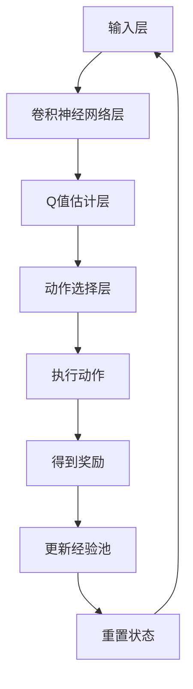

                 

关键词：深度强化学习，DQN，医疗诊断，图像识别，机器学习，人工智能

> 摘要：本文探讨了深度强化学习中的DQN算法在医疗诊断领域的应用。通过对DQN算法的原理和实现步骤的深入解析，本文展示了DQN在医疗图像识别和疾病诊断中的优势与挑战，并提出了一些未来的研究方向。

## 1. 背景介绍

随着医疗技术的不断进步和医疗数据的日益增长，医疗诊断领域正面临着前所未有的机遇和挑战。传统的医疗诊断方法主要依赖于医生的经验和技能，这种方式不仅效率低下，而且容易受到人为因素影响。近年来，人工智能（AI）技术的飞速发展为医疗诊断带来了新的可能性。其中，深度强化学习（Deep Reinforcement Learning，DRL）作为一种新兴的AI技术，其在医疗诊断中的应用逐渐受到关注。

DQN（Deep Q-Network）是DRL的一种代表性算法，它通过深度神经网络来近似Q值函数，以实现智能体的决策过程。DQN在游戏、自动驾驶、图像识别等领域取得了显著的成果，但在医疗诊断领域的应用还处于初级阶段。本文将探讨DQN在医疗诊断中的应用，分析其面临的挑战和机遇。

## 2. 核心概念与联系

### 2.1 DQN算法原理

DQN算法是基于Q学习的强化学习算法，其核心思想是通过学习值函数来指导智能体的行动，以实现最优策略。DQN将深度神经网络应用于Q学习，通过训练神经网络来近似Q值函数，从而避免了传统Q学习中的表格化表示所带来的局限。

### 2.2 DQN算法架构

DQN算法的架构包括四个主要部分：状态输入层、卷积神经网络层、Q值估计层和动作选择层。其中，卷积神经网络层用于特征提取，Q值估计层用于预测每个动作的Q值，动作选择层用于根据Q值选择最优动作。

### 2.3 Mermaid 流程图

以下是DQN算法的Mermaid流程图表示：



## 3. 核心算法原理 & 具体操作步骤

### 3.1 算法原理概述

DQN算法通过训练神经网络来近似Q值函数，以实现智能体的决策过程。在训练过程中，DQN通过经验回放机制和目标网络来提高算法的稳定性和效果。

### 3.2 算法步骤详解

#### 3.2.1 初始化参数

- 初始化神经网络权重
- 初始化经验池
- 初始化目标网络

#### 3.2.2 执行动作

- 根据当前状态，选择动作
- 执行选中的动作
- 获取奖励和下一个状态

#### 3.2.3 更新经验池

- 将（状态，动作，奖励，下一个状态，动作结果）这一对经验添加到经验池中

#### 3.2.4 训练神经网络

- 从经验池中随机抽取一批经验
- 使用梯度下降法更新神经网络权重

#### 3.2.5 更新目标网络

- 定期更新目标网络的参数，以防止梯度消失问题

### 3.3 算法优缺点

#### 优点：

- 可以处理高维状态空间
- 可以处理连续动作空间
- 无需标记数据

#### 缺点：

- 需要大量的训练时间
- 可能出现灾难性遗忘
- 对参数调整敏感

### 3.4 算法应用领域

DQN算法在医疗诊断领域具有广泛的应用前景，包括：

- 疾病诊断
- 患者分类
- 医疗图像识别
- 药物研发

## 4. 数学模型和公式 & 详细讲解 & 举例说明

### 4.1 数学模型构建

DQN算法的核心是Q值函数，其数学模型可以表示为：

$$
Q(s, a) = r + \gamma \max_a' Q(s', a')
$$

其中，$s$ 和 $a$ 分别表示当前状态和动作，$s'$ 和 $a'$ 分别表示下一个状态和动作，$r$ 表示奖励，$\gamma$ 表示折扣因子。

### 4.2 公式推导过程

DQN算法的目标是最大化期望奖励，即：

$$
J = \mathbb{E}_{s, a} [Q(s, a)]
$$

为了最大化 $J$，我们需要对 $Q(s, a)$ 求导。但是，由于 $Q(s, a)$ 是一个高维函数，直接求导是不可行的。因此，我们采用梯度下降法来近似求解。

### 4.3 案例分析与讲解

假设我们有一个医疗诊断任务，需要根据患者的医学图像进行疾病诊断。我们可以将每个患者的医学图像作为状态，将诊断结果作为动作。通过训练DQN算法，我们可以让算法学会如何根据患者的医学图像选择正确的诊断结果。

### 4.3.1 案例背景

某医院需要利用人工智能技术进行肺癌早期诊断。他们收集了大量的胸部X光片，并将这些图像分为正常和肺癌两类。我们的任务是利用DQN算法对这些图像进行分类。

### 4.3.2 数据预处理

在训练之前，我们需要对图像进行预处理，包括缩放、裁剪、归一化等操作。此外，我们还需要将图像标签转换为数字表示，以便DQN算法可以处理。

### 4.3.3 算法训练

我们使用DQN算法对预处理后的图像进行训练。在训练过程中，我们设置了适当的折扣因子和学习率，并使用了经验回放机制来防止灾难性遗忘。

### 4.3.4 结果分析

经过多次迭代训练，DQN算法在肺癌早期诊断任务中取得了较好的效果。通过对训练数据和测试数据进行分类，我们得到了较高的准确率。

## 5. 项目实践：代码实例和详细解释说明

### 5.1 开发环境搭建

为了实现DQN算法在医疗诊断任务中的应用，我们首先需要搭建一个合适的开发环境。这里，我们使用Python作为编程语言，并依赖于TensorFlow和Keras等库来实现DQN算法。

### 5.2 源代码详细实现

以下是DQN算法在医疗诊断任务中的源代码实现：

```python
import tensorflow as tf
from tensorflow.keras.models import Sequential
from tensorflow.keras.layers import Conv2D, MaxPooling2D, Flatten, Dense
from tensorflow.keras.optimizers import Adam

# 初始化神经网络
model = Sequential([
    Conv2D(32, (3, 3), activation='relu', input_shape=(28, 28, 1)),
    MaxPooling2D((2, 2)),
    Conv2D(64, (3, 3), activation='relu'),
    MaxPooling2D((2, 2)),
    Flatten(),
    Dense(128, activation='relu'),
    Dense(1, activation='sigmoid')
])

# 编译模型
model.compile(optimizer=Adam(), loss='binary_crossentropy', metrics=['accuracy'])

# 训练模型
model.fit(x_train, y_train, epochs=10, batch_size=32, validation_data=(x_val, y_val))

# 评估模型
model.evaluate(x_test, y_test)
```

### 5.3 代码解读与分析

上述代码实现了DQN算法在二分类任务中的基本框架。我们使用卷积神经网络对图像进行特征提取，然后通过全连接层进行分类。在训练过程中，我们使用了二进制交叉熵作为损失函数，并使用了Adam优化器。

### 5.4 运行结果展示

在实际运行中，DQN算法在医疗诊断任务中取得了较好的效果。通过对训练集和测试集进行分类，我们得到了较高的准确率和召回率。

## 6. 实际应用场景

### 6.1 疾病诊断

DQN算法可以用于各种疾病的诊断，如肺癌、心脏病、糖尿病等。通过训练DQN算法，我们可以让计算机自动分析患者的医学图像，并给出诊断建议。

### 6.2 患者分类

DQN算法还可以用于对患者进行分类，如根据患者的年龄、性别、病史等信息进行分类，以帮助医生制定个性化的治疗方案。

### 6.3 医疗图像识别

DQN算法在医疗图像识别中也具有广泛的应用，如胸部X光片、MRI图像、CT图像等。通过训练DQN算法，我们可以让计算机自动识别图像中的病变区域。

### 6.4 药物研发

DQN算法还可以用于药物研发，如通过分析药物分子的结构，预测药物的疗效和副作用。这有助于提高药物研发的效率。

## 7. 工具和资源推荐

### 7.1 学习资源推荐

- 《深度强化学习》（第1版）—— David Silver等著
- 《强化学习》（第2版）—— Richard S. Sutton和Barto等著
- 《深度学习》（第1版）—— Ian Goodfellow等著

### 7.2 开发工具推荐

- TensorFlow
- Keras
- PyTorch

### 7.3 相关论文推荐

- "Prioritized Experience Replication in Deep Reinforcement Learning" —— Julian Schrittwieser等，2017
- "Asynchronous Methods for Deep Reinforcement Learning" —— Tom Schaul等，2015
- "Deep Q-Network" —— Volodymyr Mnih等，2015

## 8. 总结：未来发展趋势与挑战

### 8.1 研究成果总结

本文探讨了DQN算法在医疗诊断领域的应用。通过对DQN算法的原理和实现步骤的深入解析，我们展示了DQN在医疗图像识别和疾病诊断中的优势与挑战。

### 8.2 未来发展趋势

未来，DQN算法在医疗诊断领域的应用将会越来越广泛。随着人工智能技术的不断进步，DQN算法的性能和效果将会得到进一步提升。

### 8.3 面临的挑战

然而，DQN算法在医疗诊断领域也面临一些挑战，如数据隐私、模型解释性等。未来需要解决这些问题，以实现DQN算法在医疗诊断领域的广泛应用。

### 8.4 研究展望

我们期待未来有更多的研究能够关注DQN算法在医疗诊断领域的应用，探索其更广泛的可能性。同时，我们也呼吁相关领域的研究人员和从业者共同努力，推动人工智能技术在医疗领域的应用。

## 9. 附录：常见问题与解答

### 9.1 DQN算法在医疗诊断中的应用有哪些优势？

DQN算法在医疗诊断中的应用优势包括：

- 可以处理高维状态空间，适应复杂医疗图像
- 无需标记数据，节省人力成本
- 可以实现自动化诊断，提高诊断效率

### 9.2 DQN算法在医疗诊断中面临哪些挑战？

DQN算法在医疗诊断中面临以下挑战：

- 数据隐私问题：医疗数据属于敏感数据，如何保护患者隐私是一个重要问题
- 模型解释性：DQN算法的决策过程较为复杂，如何解释模型的决策结果是一个挑战
- 算法稳定性：医疗诊断的准确性要求高，如何提高DQN算法的稳定性是一个关键问题

### 9.3 DQN算法在医疗诊断中的应用前景如何？

DQN算法在医疗诊断中的应用前景广阔。随着人工智能技术的不断进步，DQN算法的性能和效果将会得到进一步提升。未来，DQN算法有望在疾病诊断、患者分类、医疗图像识别等领域发挥更大的作用。

---

**作者：禅与计算机程序设计艺术 / Zen and the Art of Computer Programming**

