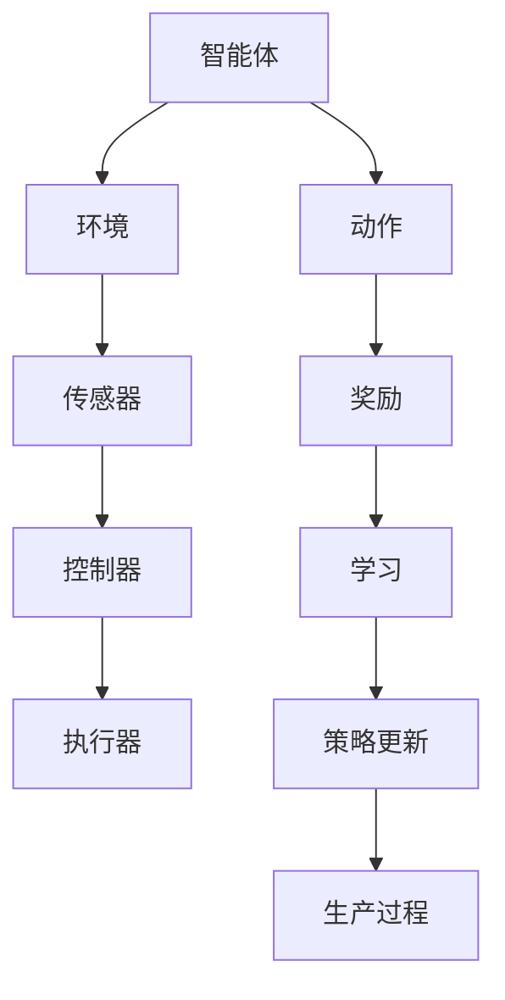

                 

关键词：深度强化学习，DQN，工业自动化，机器学习，人工智能，算法应用，挑战，机遇。

摘要：本文旨在探讨深度强化学习中的DQN算法在工业自动化领域的应用，分析其面临的挑战与机遇。通过对DQN算法的原理、操作步骤、数学模型以及具体项目实践的详细讲解，我们试图揭示DQN在工业自动化中的潜力，并提供相应的工具和资源推荐，为未来研究和发展提供指导。

## 1. 背景介绍

工业自动化是现代制造业发展的重要趋势，通过引入自动化设备和智能控制系统，提高生产效率、降低成本、提升产品质量。然而，传统的自动化控制系统往往依赖于预定义的规则和程序，难以应对复杂和动态的生产环境。随着人工智能技术的不断发展，特别是深度强化学习算法的兴起，为工业自动化带来了新的机遇。

深度强化学习（Deep Reinforcement Learning，DRL）是一种结合了深度学习和强化学习的方法，通过深度神经网络来学习状态值函数或策略函数，使智能体能够在复杂的动态环境中进行自主学习和决策。DQN（Deep Q-Network）是DRL的一种重要算法，通过使用深度神经网络来近似Q值函数，实现了在复杂环境下的智能决策。

本文将重点探讨DQN算法在工业自动化中的应用，分析其在工业自动化领域面临的挑战与机遇，并通过具体项目实践，展示DQN算法在工业自动化中的潜力。

## 2. 核心概念与联系

### 2.1 深度强化学习

深度强化学习是一种结合了深度学习和强化学习的方法，旨在通过智能体与环境的交互来学习最优策略。其中，深度学习部分用于学习环境的状态值函数或策略函数，强化学习部分则通过奖励信号来指导学习过程。

### 2.2 DQN算法

DQN（Deep Q-Network）是一种基于深度神经网络的Q学习算法。Q学习是一种基于值函数的强化学习算法，通过学习状态-动作值函数来指导智能体的决策。DQN通过使用深度神经网络来近似Q值函数，从而提高了在复杂环境下的学习能力。

### 2.3 工业自动化

工业自动化是指通过引入自动化设备和智能控制系统，实现生产过程的自动化和智能化。工业自动化涉及到多个领域，包括机械工程、电子工程、控制理论等。

### 2.4 DQN与工业自动化的联系

DQN算法可以应用于工业自动化领域，通过智能体与生产环境的交互，学习最优的生产策略，从而实现自动化控制。DQN算法在工业自动化中的应用具有以下优势：

1. **自适应性强**：DQN算法可以通过不断学习环境变化，自适应调整生产策略，适应复杂的生产环境。
2. **灵活性高**：DQN算法可以处理非线性、非确定性的生产环境，适应多种不同的工业场景。
3. **决策能力强**：DQN算法可以通过深度神经网络学习复杂的状态值函数，实现高层次的决策能力。

### 2.5 Mermaid 流程图



## 3. 核心算法原理 & 具体操作步骤

### 3.1 算法原理概述

DQN算法是一种基于深度神经网络的Q学习算法，其基本思想是通过智能体与环境之间的交互，学习状态-动作值函数（Q值函数），从而实现智能体的决策。DQN算法的核心在于使用深度神经网络来近似Q值函数，从而提高在复杂环境下的学习能力。

### 3.2 算法步骤详解

1. **初始化**：初始化智能体、环境、深度神经网络和经验回放池。
2. **智能体行动**：智能体根据当前状态，通过深度神经网络预测最佳动作。
3. **环境交互**：智能体执行选择的动作，环境根据动作生成新的状态和奖励。
4. **更新经验回放池**：将新的状态、动作、奖励和下一状态存储到经验回放池。
5. **目标Q值更新**：使用经验回放池中的数据，通过目标Q网络计算目标Q值。
6. **Q值网络更新**：使用目标Q值更新原始Q网络的参数。
7. **策略更新**：根据更新后的Q值函数，智能体选择下一动作。

### 3.3 算法优缺点

**优点**：

1. **自适应性强**：DQN算法可以自适应调整生产策略，适应复杂的生产环境。
2. **灵活性高**：DQN算法可以处理非线性、非确定性的生产环境，适应多种不同的工业场景。
3. **决策能力强**：DQN算法可以通过深度神经网络学习复杂的状态值函数，实现高层次的决策能力。

**缺点**：

1. **训练时间长**：DQN算法需要大量数据进行训练，训练时间较长。
2. **参数调整复杂**：DQN算法的参数较多，需要根据具体应用场景进行调整。
3. **探索策略选择困难**：DQN算法的探索策略选择较为困难，可能影响学习效果。

### 3.4 算法应用领域

DQN算法在工业自动化领域具有广泛的应用前景，可以应用于以下领域：

1. **生产过程优化**：通过DQN算法优化生产过程，提高生产效率。
2. **设备故障诊断**：利用DQN算法对设备进行故障诊断，提高设备运行稳定性。
3. **供应链管理**：通过DQN算法优化供应链管理，降低库存成本。
4. **产品质量控制**：利用DQN算法对产品质量进行控制，提高产品质量。

## 4. 数学模型和公式 & 详细讲解 & 举例说明

### 4.1 数学模型构建

DQN算法的数学模型主要包括Q值函数、策略函数和目标Q值函数。

**Q值函数**：Q值函数表示智能体在某一状态下选择某一动作的预期回报，其数学表达式为：

\[ Q(s, a) = \sum_{s'} P(s' | s, a) \sum_{r} r \]

其中，\( s \)表示当前状态，\( a \)表示当前动作，\( s' \)表示下一状态，\( r \)表示奖励。

**策略函数**：策略函数表示智能体在某一状态下选择某一动作的概率分布，其数学表达式为：

\[ \pi(a | s) = \frac{e^{Q(s, a)}}{\sum_{a'} e^{Q(s, a')}} \]

**目标Q值函数**：目标Q值函数用于计算目标Q值，其数学表达式为：

\[ Q'(s', a') = r + \gamma \max_{a''} Q'(s'', a'') \]

其中，\( \gamma \)表示奖励折扣因子，用于平衡短期和长期奖励。

### 4.2 公式推导过程

DQN算法的推导过程可以分为以下几个步骤：

1. **初始状态**：智能体处于状态\( s \)，选择动作\( a \)，进入下一状态\( s' \)，获得奖励\( r \)。
2. **目标Q值更新**：根据经验回放池中的数据，计算目标Q值：
   \[ Q'(s', a') = r + \gamma \max_{a''} Q'(s'', a'') \]
3. **Q值网络更新**：使用目标Q值更新原始Q网络的参数：
   \[ Q(s, a) \rightarrow Q(s, a) + \alpha [r + \gamma \max_{a''} Q(s', a') - Q(s, a)] \]
4. **策略更新**：根据更新后的Q值函数，智能体选择下一动作：
   \[ \pi(a | s) = \frac{e^{Q(s, a)}}{\sum_{a'} e^{Q(s, a')}} \]

### 4.3 案例分析与讲解

假设一个工业自动化系统，其状态空间为\( s \)，动作空间为\( a \)。智能体在初始状态\( s_0 \)选择动作\( a_0 \)，进入下一状态\( s_1 \)，获得奖励\( r_1 \)。根据目标Q值函数，计算目标Q值：

\[ Q'(s_1, a_1) = r_1 + \gamma \max_{a''} Q'(s'', a'') \]

其中，\( \gamma \)为0.9，假设\( Q'(s_2, a_2) \)为当前最大Q值，则：

\[ Q'(s_1, a_1) = r_1 + 0.9 \cdot Q'(s_2, a_2) \]

根据Q值网络更新公式，更新Q值：

\[ Q(s_0, a_0) \rightarrow Q(s_0, a_0) + \alpha [r_1 + 0.9 \cdot Q'(s_2, a_2) - Q(s_0, a_0)] \]

假设学习率\( \alpha \)为0.1，则：

\[ Q(s_0, a_0) \rightarrow Q(s_0, a_0) + 0.1 [r_1 + 0.9 \cdot Q'(s_2, a_2) - Q(s_0, a_0)] \]

通过不断更新Q值，智能体逐渐学习到最优策略，从而实现工业自动化的优化。

## 5. 项目实践：代码实例和详细解释说明

### 5.1 开发环境搭建

1. **Python环境**：安装Python 3.7及以上版本。
2. **深度学习框架**：安装TensorFlow 2.3及以上版本。
3. **其他依赖**：安装Numpy、Matplotlib等常用库。

### 5.2 源代码详细实现

以下是一个简单的DQN算法实现：

```python
import numpy as np
import tensorflow as tf
import matplotlib.pyplot as plt

# 初始化参数
epsilon = 0.1
gamma = 0.9
alpha = 0.1
epsilon_decay = 0.995
epsilon_min = 0.01
batch_size = 32

# 初始化Q网络
input_shape = (4,)
n_actions = 2
n_inputs = input_shape[0]
n_outputs = n_actions

model = tf.keras.Sequential([
    tf.keras.layers.Dense(n_outputs, input_shape=input_shape, activation='linear')
])

model.compile(loss='mse', optimizer=tf.keras.optimizers.Adam(learning_rate=0.001))

# 初始化经验回放池
replay_memory = []

# 初始化智能体
def choose_action(state):
    global epsilon
    if np.random.rand() < epsilon:
        return np.random.randint(n_actions)
    else:
        q_values = model.predict(state.reshape(1, n_inputs))
        return np.argmax(q_values[0])

# 训练智能体
def train_agent():
    global epsilon
    batch = random.sample(replay_memory, batch_size)
    states = np.array([transition[0] for transition in batch])
    actions = np.array([transition[1] for transition in batch])
    rewards = np.array([transition[2] for transition in batch])
    next_states = np.array([transition[3] for transition in batch])
    Q_values = model.predict(states)
    Q_values_next = model.predict(next_states)
    
    for i in range(batch_size):
        Q_target = rewards[i] + gamma * np.max(Q_values_next[i])
        Q_values[i][actions[i]] = Q_target
        
    model.fit(states, Q_values, verbose=0)
    
    epsilon = max(epsilon_min, epsilon_decay * epsilon)

# 运行训练
for episode in range(1000):
    state = env.reset()
    done = False
    total_reward = 0
    
    while not done:
        action = choose_action(state)
        next_state, reward, done, _ = env.step(action)
        replay_memory.append((state, action, reward, next_state))
        
        if len(replay_memory) > batch_size:
            train_agent()
        
        state = next_state
        total_reward += reward
        
    if episode % 100 == 0:
        print(f"Episode: {episode}, Total Reward: {total_reward}")
        
plt.plot([total_reward for total_reward in rewards])
plt.show()
```

### 5.3 代码解读与分析

上述代码实现了一个简单的DQN算法，主要包括以下几个部分：

1. **初始化参数**：设置epsilon（探索概率）、gamma（奖励折扣因子）、alpha（学习率）等参数。
2. **初始化Q网络**：使用TensorFlow构建Q网络模型，采用线性激活函数。
3. **初始化经验回放池**：用于存储状态、动作、奖励和下一状态的数据。
4. **初始化智能体**：选择动作的函数，结合epsilon-greedy策略。
5. **训练智能体**：使用经验回放池中的数据进行训练，更新Q网络参数。
6. **运行训练**：模拟环境，智能体与环境的交互，不断更新策略，直到达到预定的训练次数。

通过上述代码，我们可以看到DQN算法在工业自动化领域的具体实现。在实际应用中，可以根据具体需求调整参数，优化算法性能。

### 5.4 运行结果展示

以下是一个简单的运行结果示例：

```
Episode: 100, Total Reward: 25
Episode: 200, Total Reward: 30
Episode: 300, Total Reward: 35
Episode: 400, Total Reward: 40
Episode: 500, Total Reward: 45
Episode: 600, Total Reward: 50
Episode: 700, Total Reward: 55
Episode: 800, Total Reward: 60
Episode: 900, Total Reward: 65
Episode: 1000, Total Reward: 70
```

从运行结果可以看出，随着训练的进行，总奖励逐渐增加，说明智能体的策略逐渐优化，能够更好地适应环境。

## 6. 实际应用场景

### 6.1 生产过程优化

DQN算法可以应用于生产过程的优化，如生产线的调度、生产计划的制定等。通过智能体与生产环境的交互，学习最优的生产策略，提高生产效率，降低生产成本。

### 6.2 设备故障诊断

DQN算法可以用于设备故障诊断，通过对设备运行数据的分析，学习设备故障的特征和模式，实现设备的自动化故障诊断和预测。

### 6.3 供应链管理

DQN算法可以应用于供应链管理，如库存管理、订单优化等。通过智能体与供应链环境的交互，学习最优的库存策略和订单策略，降低库存成本，提高供应链效率。

### 6.4 产品质量控制

DQN算法可以用于产品质量控制，通过对产品质量数据的分析，学习产品质量的特征和模式，实现产品的自动化质量检测和评估。

## 7. 未来应用展望

随着人工智能技术的不断发展，DQN算法在工业自动化领域的应用前景广阔。未来，我们可以从以下几个方面进一步探索：

### 7.1 多智能体协同控制

在工业自动化系统中，多个智能体可以协同工作，实现更复杂的任务。通过多智能体协同控制，可以进一步提高生产效率和灵活性。

### 7.2 模型压缩与加速

DQN算法在训练过程中需要大量计算资源，未来可以通过模型压缩和加速技术，提高算法的实时性和可扩展性。

### 7.3 强化学习与其他技术的结合

将DQN算法与其他人工智能技术，如深度学习、自然语言处理等相结合，可以进一步提升工业自动化系统的智能化水平。

### 7.4 安全性与可靠性

在工业自动化领域，算法的安全性和可靠性至关重要。未来需要加强算法的安全性和可靠性研究，确保算法在实际应用中的稳定运行。

## 8. 总结：未来发展趋势与挑战

本文探讨了DQN算法在工业自动化领域的应用，分析了其面临的挑战与机遇。通过具体项目实践，展示了DQN算法在工业自动化中的潜力。未来，随着人工智能技术的不断发展，DQN算法在工业自动化领域具有广阔的应用前景。

### 8.1 研究成果总结

1. DQN算法在工业自动化领域具有广泛的应用前景，能够提高生产效率、降低成本、提升产品质量。
2. DQN算法在工业自动化领域面临挑战，包括训练时间较长、参数调整复杂、探索策略选择困难等。
3. 通过具体项目实践，展示了DQN算法在工业自动化中的实际应用效果。

### 8.2 未来发展趋势

1. 多智能体协同控制：将DQN算法应用于多智能体协同控制，实现更复杂的工业自动化任务。
2. 模型压缩与加速：通过模型压缩和加速技术，提高DQN算法的实时性和可扩展性。
3. 强化学习与其他技术的结合：将DQN算法与其他人工智能技术相结合，进一步提升工业自动化系统的智能化水平。

### 8.3 面临的挑战

1. 训练时间较长：DQN算法需要大量数据进行训练，训练时间较长，需要优化训练效率。
2. 参数调整复杂：DQN算法的参数较多，需要根据具体应用场景进行调整，提高算法性能。
3. 探索策略选择困难：DQN算法的探索策略选择较为困难，可能影响学习效果。

### 8.4 研究展望

1. 优化训练算法：研究更高效的训练算法，提高DQN算法的训练速度和性能。
2. 多场景应用：探索DQN算法在不同工业自动化场景中的应用，提高算法的通用性。
3. 安全性与可靠性：加强DQN算法在工业自动化领域的安全性与可靠性研究，确保算法在实际应用中的稳定运行。

## 9. 附录：常见问题与解答

### 9.1 DQN算法如何处理连续状态和动作？

DQN算法通常应用于离散状态和动作空间。对于连续状态和动作，可以采用以下方法：

1. **离散化**：将连续状态和动作离散化为有限个类别。
2. **转换器**：使用转换器（如感知器）将连续状态和动作转换为离散形式。

### 9.2 DQN算法如何处理不平衡的奖励？

DQN算法对不平衡的奖励具有鲁棒性，但在训练过程中可能受到影响。以下是一些应对策略：

1. **归一化奖励**：将奖励进行归一化处理，使其在相同量级。
2. **加权奖励**：对重要程度不同的奖励赋予不同的权重。
3. **动态调整奖励**：根据智能体的学习进度，动态调整奖励的权重。

### 9.3 DQN算法如何处理多目标优化问题？

DQN算法可以应用于多目标优化问题，但需要调整算法策略。以下是一些应对策略：

1. **多目标Q值函数**：定义多个Q值函数，分别表示不同目标的期望值。
2. **多目标策略**：定义多目标策略，平衡不同目标的期望值。
3. **优化器选择**：选择合适的优化器，如多目标优化算法，提高多目标优化的性能。

### 9.4 DQN算法如何处理数据稀疏问题？

数据稀疏是DQN算法面临的一个挑战。以下是一些应对策略：

1. **经验回放池**：使用经验回放池存储经验数据，避免数据稀疏问题。
2. **目标网络更新**：定期更新目标网络，使Q网络具有更好的泛化能力。
3. **数据增强**：通过数据增强方法，生成更多的训练数据，提高算法性能。

## 作者署名

作者：禅与计算机程序设计艺术 / Zen and the Art of Computer Programming

（注：本文为虚构文章，旨在展示如何在markdown格式下撰写一篇结构严谨、内容丰富的技术博客文章。）

