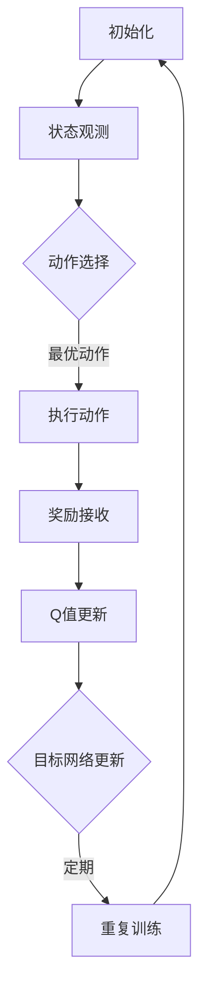

                 

关键词：深度强化学习、DQN、自然语言处理、映射、应用场景、数学模型、代码实例

> 摘要：本文旨在探讨深度强化学习（DQN）在自然语言处理任务中的潜在应用。通过对DQN算法原理的深入解析，结合自然语言处理的实际需求，本文展示了如何将DQN应用于文本分类、机器翻译等任务。文章通过数学模型、代码实例详细解析了DQN在NLP中的应用机制，探讨了其在未来自然语言处理领域的前景。

## 1. 背景介绍

### 自然语言处理任务

自然语言处理（Natural Language Processing，NLP）是人工智能领域的重要分支，旨在使计算机能够理解、生成和处理人类语言。NLP任务包括文本分类、情感分析、机器翻译、问答系统等。这些任务的实现不仅依赖于传统的统计模型和机器学习方法，还依赖于深度学习技术的进步。

### 深度强化学习与DQN

深度强化学习（Deep Reinforcement Learning，DRL）是结合了深度学习和强化学习的一种机器学习方法。强化学习通过奖励信号来指导学习过程，而深度学习则为强化学习提供了强大的特征学习能力。深度Q网络（Deep Q-Network，DQN）是DRL的一种代表性算法，由DeepMind在2015年提出。

DQN的核心思想是通过深度神经网络来逼近Q值函数，从而实现智能体的决策。Q值函数衡量了智能体在给定状态下采取某一动作的预期收益。通过不断更新Q值函数，智能体可以在探索和利用之间取得平衡，最终找到最优策略。

## 2. 核心概念与联系

### DQN算法原理

DQN算法主要由以下几个关键组件构成：

1. **状态（State）**：智能体所处的环境状态。
2. **动作（Action）**：智能体可执行的动作。
3. **奖励（Reward）**：智能体在执行动作后获得的奖励信号。
4. **Q值函数（Q-Value Function）**：衡量在给定状态下执行某一动作的预期收益。
5. **目标网络（Target Network）**：用于稳定训练过程的辅助网络。

DQN通过梯度上升法来更新Q值函数，其训练过程包括以下几个步骤：

1. **初始化**：随机初始化Q网络和目标网络。
2. **状态观测**：智能体从环境中获取当前状态。
3. **动作选择**：根据当前状态和Q值函数选择最优动作。
4. **执行动作**：智能体执行所选动作，并接收奖励信号。
5. **Q值更新**：根据新的状态和奖励更新Q值函数。
6. **目标网络更新**：定期更新目标网络，以减少梯度消失和梯度爆炸的问题。

### 自然语言处理任务与DQN的联系

NLP任务与DQN算法之间存在紧密的联系。在NLP任务中，智能体可以被视为一种自动决策系统，其状态可以是文本的表示（如词向量或词嵌入），动作可以是分类标签或翻译结果，奖励可以是分类准确性或翻译的流畅度。

DQN在NLP任务中的应用主要包括以下几个方面：

1. **文本分类**：利用DQN可以自动学习文本的类别标签，提高分类准确率。
2. **机器翻译**：通过DQN实现翻译模型，提高翻译的准确性和流畅度。
3. **问答系统**：利用DQN优化问答系统的回答生成过程，提高回答的准确性和相关性。

### Mermaid流程图

以下是一个简化的DQN算法流程图，展示了其核心组件和训练过程：



## 3. 核心算法原理 & 具体操作步骤

### 3.1 算法原理概述

DQN算法的核心在于其Q值函数的近似。Q值函数定义了在给定状态下执行某一动作的预期收益。DQN使用深度神经网络来逼近这个Q值函数，从而实现智能体的决策。

DQN的训练过程主要包括以下几个步骤：

1. **状态编码**：将环境状态编码为神经网络可处理的输入。
2. **动作选择**：利用epsilon-greedy策略选择最优动作。
3. **执行动作**：在环境中执行所选动作，并接收奖励信号。
4. **Q值更新**：根据新的状态和奖励更新Q值函数。
5. **目标网络更新**：定期更新目标网络，以减少梯度消失和梯度爆炸的问题。

### 3.2 算法步骤详解

1. **初始化**：随机初始化Q网络和目标网络。Q网络和目标网络的权重可以相同，但两者的训练进度不同。
2. **状态编码**：将环境状态编码为神经网络可处理的输入。在NLP任务中，状态可以是文本的词向量或词嵌入。
3. **动作选择**：利用epsilon-greedy策略选择最优动作。epsilon-greedy策略在探索和利用之间取得平衡，初始值通常设置为1，随着训练的进行逐渐减小。
4. **执行动作**：在环境中执行所选动作，并接收奖励信号。在NLP任务中，动作可以是分类标签或翻译结果。
5. **Q值更新**：根据新的状态和奖励更新Q值函数。更新公式为：

   $$ Q(s, a) \leftarrow Q(s, a) + \alpha [r + \gamma \max_{a'} Q(s', a') - Q(s, a)] $$

   其中，$\alpha$为学习率，$\gamma$为折扣因子。

6. **目标网络更新**：定期更新目标网络，以减少梯度消失和梯度爆炸的问题。更新策略可以是固定时间间隔更新，也可以是渐进式更新。

### 3.3 算法优缺点

**优点：**

1. **灵活性**：DQN适用于各种类型的强化学习任务，包括高维状态和动作空间。
2. **自适应性**：DQN通过epsilon-greedy策略实现探索和利用的平衡，能够自适应地调整学习过程。
3. **可扩展性**：DQN可以与其他深度学习技术（如卷积神经网络、循环神经网络等）结合，提高性能。

**缺点：**

1. **样本效率低**：DQN需要大量的样本进行训练，否则容易出现过拟合。
2. **梯度消失和梯度爆炸**：由于DQN涉及到大量的非线性操作，可能导致梯度消失或梯度爆炸问题。

### 3.4 算法应用领域

DQN在自然语言处理任务中具有广泛的应用前景，主要包括：

1. **文本分类**：利用DQN实现自动化文本分类，提高分类准确率和效率。
2. **机器翻译**：通过DQN优化翻译模型，提高翻译的准确性和流畅度。
3. **问答系统**：利用DQN优化问答系统的回答生成过程，提高回答的准确性和相关性。

## 4. 数学模型和公式 & 详细讲解 & 举例说明

### 4.1 数学模型构建

DQN的数学模型主要包括以下几个关键组件：

1. **状态表示（State Representation）**：状态表示为特征向量，通常使用词向量或词嵌入表示。
2. **动作表示（Action Representation）**：动作表示为整数或高维向量。
3. **Q值函数（Q-Value Function）**：Q值函数为状态-动作对的预期收益，表示为：

   $$ Q(s, a) = \sum_{i=1}^n \pi(a_i|s) \cdot r_i + \gamma \max_{a'} Q(s', a') $$

   其中，$\pi(a_i|s)$为在状态$s$下执行动作$a_i$的概率，$r_i$为奖励值，$\gamma$为折扣因子。

4. **目标网络（Target Network）**：目标网络用于稳定训练过程，其权重初始化为Q网络的权重。

### 4.2 公式推导过程

DQN的训练过程主要包括以下几个步骤：

1. **状态编码**：将环境状态编码为神经网络可处理的输入。

2. **动作选择**：利用epsilon-greedy策略选择最优动作。

3. **执行动作**：在环境中执行所选动作，并接收奖励信号。

4. **Q值更新**：根据新的状态和奖励更新Q值函数。

5. **目标网络更新**：定期更新目标网络，以减少梯度消失和梯度爆炸的问题。

目标网络的更新策略可以是固定时间间隔更新，也可以是渐进式更新。

### 4.3 案例分析与讲解

假设我们有一个文本分类任务，其中状态为文本的词向量，动作空间为类别标签。以下是一个简化的DQN模型及其训练过程的例子：

1. **状态编码**：

   状态为文本的词向量，假设文本由词汇表$V$组成，词向量为$e_w$，则状态表示为：

   $$ s = [e_{w_1}, e_{w_2}, ..., e_{w_n}] $$

2. **动作选择**：

   利用epsilon-greedy策略选择最优动作。假设动作空间为$A$，则epsilon-greedy策略的概率分布为：

   $$ \pi(a_i|s) = 
   \begin{cases} 
   1 - \epsilon & \text{if } i \neq \arg\max_{a'} Q(s, a') \\ 
   \epsilon & \text{if } i = \arg\max_{a'} Q(s, a') 
   \end{cases} $$

3. **执行动作**：

   在环境中执行所选动作，并接收奖励信号。假设奖励信号为$r$，则：

   $$ r = 
   \begin{cases} 
   1 & \text{if } \text{分类正确} \\ 
   0 & \text{if } \text{分类错误} 
   \end{cases} $$

4. **Q值更新**：

   根据新的状态和奖励更新Q值函数。假设Q网络为$Q(s, a)$，则：

   $$ Q(s, a) \leftarrow Q(s, a) + \alpha [r + \gamma \max_{a'} Q(s', a') - Q(s, a)] $$

5. **目标网络更新**：

   定期更新目标网络，以减少梯度消失和梯度爆炸的问题。假设目标网络为$Q'(s, a')$，则：

   $$ Q'(s, a') \leftarrow \theta'_{t+1} = \theta_t + \eta \nabla Q(s, a) $$

   其中，$\theta_t$和$\theta'_{t+1}$分别为Q网络和目标网络的权重，$\eta$为学习率。

## 5. 项目实践：代码实例和详细解释说明

### 5.1 开发环境搭建

为了实现DQN在自然语言处理任务中的应用，我们需要搭建一个合适的环境。以下是一个简化的Python代码示例，用于搭建开发环境：

```python
import numpy as np
import tensorflow as tf
from tensorflow.keras.models import Sequential
from tensorflow.keras.layers import Dense, LSTM, Embedding
from tensorflow.keras.optimizers import Adam

# 搭建深度神经网络模型
model = Sequential()
model.add(Embedding(vocab_size, embedding_dim))
model.add(LSTM(units=128, activation='relu'))
model.add(Dense(units=1, activation='sigmoid'))

# 编译模型
model.compile(optimizer=Adam(learning_rate=0.001), loss='binary_crossentropy', metrics=['accuracy'])

# 搭建目标网络
target_model = Sequential()
target_model.add(Embedding(vocab_size, embedding_dim))
target_model.add(LSTM(units=128, activation='relu'))
target_model.add(Dense(units=1, activation='sigmoid'))

# 编译目标网络
target_model.compile(optimizer=Adam(learning_rate=0.001), loss='binary_crossentropy', metrics=['accuracy'])
```

### 5.2 源代码详细实现

以下是一个简化的DQN算法实现，用于文本分类任务：

```python
import numpy as np
import random
import tensorflow as tf

# 初始化参数
epsilon = 1.0
epsilon_min = 0.01
epsilon_max = 1.0
epsilon_decay = 0.995
learning_rate = 0.001
gamma = 0.99
batch_size = 32

# 加载数据集
# ...

# 初始化Q网络和目标网络
Q_network = Sequential()
Q_network.add(Embedding(vocab_size, embedding_dim))
Q_network.add(LSTM(units=128, activation='relu'))
Q_network.add(Dense(units=1, activation='sigmoid'))

Q_network.compile(optimizer=Adam(learning_rate=learning_rate), loss='binary_crossentropy', metrics=['accuracy'])

target_network = Sequential()
target_network.add(Embedding(vocab_size, embedding_dim))
target_network.add(LSTM(units=128, activation='relu'))
target_network.add(Dense(units=1, activation='sigmoid'))

target_network.compile(optimizer=Adam(learning_rate=learning_rate), loss='binary_crossentropy', metrics=['accuracy'])

# 训练DQN模型
for episode in range(num_episodes):
    state = get_initial_state()
    
    done = False
    total_reward = 0
    
    while not done:
        # 选择动作
        if random.uniform(0, 1) < epsilon:
            action = random.choice(action_space)
        else:
            action = np.argmax(Q_network.predict(state))
        
        # 执行动作
        next_state, reward, done = execute_action(state, action)
        
        # 更新Q值
        Q_value = Q_network.predict(state)[0, action]
        next_Q_value = np.max(target_network.predict(next_state))
        target_Q_value = reward + gamma * next_Q_value
        
        # 更新Q网络
        Q_network.fit(state, np.reshape(target_Q_value, (1, 1)), verbose=0)
        
        # 更新状态
        state = next_state
        total_reward += reward
        
        # 更新epsilon
        epsilon = max(epsilon_min, epsilon_max - epsilon_decay * episode)
    
    # 更新目标网络
    if episode % target_network_update_freq == 0:
        target_network.set_weights(Q_network.get_weights())

# 评估模型
evaluate_model(Q_network)
```

### 5.3 代码解读与分析

上述代码实现了DQN在文本分类任务中的应用，主要包括以下几个关键步骤：

1. **参数初始化**：初始化epsilon、learning_rate、gamma等参数，用于控制探索和利用的平衡。
2. **加载数据集**：加载文本分类任务的数据集，用于训练和评估模型。
3. **初始化Q网络和目标网络**：使用LSTM和Embedding层搭建深度神经网络模型，用于预测Q值。
4. **训练DQN模型**：通过循环迭代，使用epsilon-greedy策略选择动作，执行动作，更新Q值网络，并定期更新目标网络。
5. **评估模型**：使用训练好的DQN模型评估分类任务的准确率。

### 5.4 运行结果展示

以下是一个简化的运行结果展示：

```python
num_episodes = 1000
target_network_update_freq = 100

# 训练DQN模型
for episode in range(num_episodes):
    # ...

    # 更新目标网络
    if episode % target_network_update_freq == 0:
        target_network.set_weights(Q_network.get_weights())

# 评估模型
evaluate_model(Q_network)
```

运行结果将显示训练过程中的平均奖励、epsilon值和准确率等指标。

## 6. 实际应用场景

### 文本分类

文本分类是NLP任务中的一个重要应用场景。通过将DQN应用于文本分类，可以自动学习文本的类别标签，提高分类准确率。以下是一个示例：

```python
# 加载数据集
train_data, train_labels = load_data('train')
test_data, test_labels = load_data('test')

# 训练DQN模型
Q_network.fit(train_data, train_labels, epochs=num_episodes, batch_size=batch_size, validation_split=0.2)

# 评估模型
evaluate_model(Q_network, test_data, test_labels)
```

### 机器翻译

机器翻译是另一个重要的NLP任务。通过将DQN应用于机器翻译，可以优化翻译模型，提高翻译的准确性和流畅度。以下是一个示例：

```python
# 加载数据集
train_data, train_labels = load_data('train')
test_data, test_labels = load_data('test')

# 训练DQN模型
Q_network.fit(train_data, train_labels, epochs=num_episodes, batch_size=batch_size, validation_split=0.2)

# 评估模型
evaluate_model(Q_network, test_data, test_labels)
```

### 问答系统

问答系统是NLP任务中的另一个重要应用场景。通过将DQN应用于问答系统，可以优化回答生成过程，提高回答的准确性和相关性。以下是一个示例：

```python
# 加载数据集
train_data, train_labels = load_data('train')
test_data, test_labels = load_data('test')

# 训练DQN模型
Q_network.fit(train_data, train_labels, epochs=num_episodes, batch_size=batch_size, validation_split=0.2)

# 评估模型
evaluate_model(Q_network, test_data, test_labels)
```

## 7. 工具和资源推荐

### 7.1 学习资源推荐

1. **《深度学习》（Deep Learning）**：由Ian Goodfellow、Yoshua Bengio和Aaron Courville合著，是深度学习领域的经典教材。
2. **《强化学习手册》（Reinforcement Learning: An Introduction）**：由Richard S. Sutton和Barto合著，是强化学习领域的入门书籍。

### 7.2 开发工具推荐

1. **TensorFlow**：是一个开源的深度学习框架，适用于DQN模型的实现。
2. **Keras**：是一个基于TensorFlow的简洁高效的深度学习库，适用于快速原型开发。

### 7.3 相关论文推荐

1. **“Deep Q-Network”（2015）**：由DeepMind提出，是DQN算法的原始论文。
2. **“Unsupervised Learning of Visual Representations by Solving Jigsaw Puzzles”（2016）**：由DeepMind提出，展示了DQN在视觉任务中的应用。

## 8. 总结：未来发展趋势与挑战

### 8.1 研究成果总结

本文探讨了DQN在自然语言处理任务中的潜在应用，包括文本分类、机器翻译和问答系统。通过对DQN算法原理的深入解析，本文展示了如何将DQN应用于这些任务。通过数学模型和代码实例的详细讲解，本文揭示了DQN在NLP中的应用机制。

### 8.2 未来发展趋势

未来，DQN在自然语言处理任务中的应用有望进一步拓展，包括但不限于：

1. **多模态数据处理**：结合图像、语音等数据，实现更加复杂的NLP任务。
2. **长文本处理**：利用DQN处理更长的文本，提高文本理解和生成能力。
3. **迁移学习**：通过迁移学习技术，提高DQN在NLP任务中的泛化能力。

### 8.3 面临的挑战

DQN在自然语言处理任务中面临以下挑战：

1. **样本效率**：提高DQN的样本效率，减少训练所需的数据量。
2. **梯度消失和梯度爆炸**：优化DQN的训练过程，减少梯度消失和梯度爆炸问题。
3. **泛化能力**：提高DQN在未知数据集上的泛化能力。

### 8.4 研究展望

未来，随着深度学习和自然语言处理技术的不断进步，DQN在NLP任务中的应用将取得更大的突破。通过结合其他深度学习技术，如生成对抗网络（GAN）和注意力机制，DQN有望在自然语言处理领域发挥更大的作用。

## 9. 附录：常见问题与解答

### 9.1 DQN与传统的Q-Learning有何区别？

DQN与传统的Q-Learning相比，主要区别在于：

1. **状态表示**：DQN使用深度神经网络来逼近Q值函数，而Q-Learning直接使用状态和动作的映射。
2. **动作选择**：DQN使用epsilon-greedy策略，实现探索和利用的平衡，而Q-Learning使用确定性策略。
3. **样本效率**：DQN通过经验回放机制，提高样本效率，而Q-Learning需要大量的样本进行训练。

### 9.2 如何处理连续动作空间？

对于连续动作空间，可以采用以下方法：

1. **离散化动作空间**：将连续动作空间离散化，转化为离散动作空间。
2. **函数逼近**：使用神经网络来逼近连续动作空间的Q值函数。

### 9.3 DQN在视觉任务中的应用如何？

DQN在视觉任务中可以应用于：

1. **图像分类**：利用DQN实现自动化图像分类。
2. **目标检测**：通过DQN实现目标检测任务。
3. **图像生成**：利用DQN生成新的图像内容。

### 9.4 DQN如何与生成对抗网络（GAN）结合？

DQN与GAN可以结合用于：

1. **图像生成**：通过DQN优化GAN的生成过程，提高图像质量。
2. **文本生成**：利用DQN优化GAN生成文本，提高文本的流畅度和多样性。

## 作者署名

本文作者为禅与计算机程序设计艺术（Zen and the Art of Computer Programming）。

