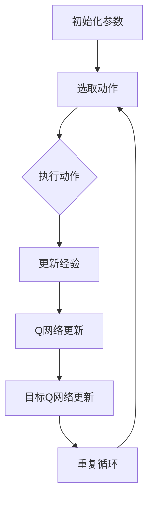

                 

关键词：DQN，金融市场预测，深度强化学习，人工智能，挑战与机遇

> 摘要：本文将探讨深度强化学习中的DQN（Deep Q-Network）在金融市场预测中的应用。首先，我们将回顾金融市场的特点及其对预测算法的要求。随后，我们将深入探讨DQN的核心原理及其在金融市场预测中的具体应用。在此基础上，我们将分析DQN在金融市场预测中的挑战和机遇，并总结其未来发展的趋势与面临的挑战。

## 1. 背景介绍

金融市场是现代经济体系的核心，其稳定运行对整个经济体的健康和可持续发展至关重要。然而，金融市场具有高度复杂性和不确定性，使得对其进行预测成为一项极具挑战性的任务。传统的预测方法如时间序列分析、回归分析等在处理金融市场数据时常常遇到瓶颈，无法满足复杂市场环境的需求。

近年来，随着人工智能技术的快速发展，深度学习作为一种强大的机器学习技术，逐渐被应用于金融市场预测中。深度强化学习（Deep Reinforcement Learning，DRL）是深度学习的一个重要分支，通过模仿人类决策过程，实现了智能体在与环境互动中不断学习和优化策略。DQN作为DRL的一种典型模型，因其较强的泛化能力和较好的适应性，在金融市场预测中显示出巨大的潜力。

## 2. 核心概念与联系

### 2.1. DQN的基本原理

DQN是一种基于Q学习（Q-Learning）的深度强化学习方法。Q学习是一种基于值函数的方法，旨在通过学习状态-动作值函数（Q值）来最大化长期回报。在DQN中，Q值函数由一个深度神经网络（DNN）表示，通过训练使得网络能够预测给定状态下的最佳动作。

DQN的工作流程主要包括以下几个步骤：

1. **初始化参数**：初始化Q网络和目标Q网络，以及经验回放记忆。
2. **选取动作**：根据当前状态，通过ε-greedy策略选取动作。
3. **执行动作**：在环境中执行选取的动作，并获得即时奖励和下一个状态。
4. **更新经验**：将当前状态、动作、奖励和下一个状态存储到经验回放记忆中。
5. **Q网络更新**：利用回放记忆中的经验样本，通过反向传播算法更新Q网络参数。
6. **目标Q网络更新**：定期将Q网络权重复制到目标Q网络，以防止梯度消失问题。

### 2.2. DQN在金融市场预测中的应用架构

在金融市场预测中，DQN的应用架构可以概括为以下几部分：

1. **输入层**：输入层接收金融市场数据，如股票价格、交易量、宏观经济指标等。
2. **隐藏层**：隐藏层负责对输入数据进行特征提取和转换，通常由多层全连接神经网络组成。
3. **输出层**：输出层生成Q值，即每个动作对应的预期回报，从而指导智能体选择最佳动作。
4. **经验回放记忆**：用于存储和处理历史交易数据，以避免样本偏差和优化效率。
5. **Q网络和目标Q网络**：Q网络负责实时更新策略，目标Q网络用于稳定Q网络训练过程。

### 2.3. Mermaid流程图

下面是一个使用Mermaid绘制的DQN在金融市场预测中的流程图：



## 3. 核心算法原理 & 具体操作步骤

### 3.1. 算法原理概述

DQN的核心思想是通过学习状态-动作值函数（Q值）来指导智能体的决策。具体来说，DQN通过以下步骤实现这一目标：

1. **状态编码**：将金融市场数据编码为状态向量。
2. **动作选择**：使用ε-greedy策略从可能动作中选择一个动作。
3. **执行动作**：在环境中执行所选动作，并获得即时奖励和下一个状态。
4. **Q值更新**：利用更新公式 \( Q(s, a) \leftarrow Q(s, a) + \alpha [r + \gamma \max_{a'} Q(s', a') - Q(s, a)] \) 来更新Q值。
5. **目标Q网络更新**：定期更新目标Q网络，以防止梯度消失问题。

### 3.2. 算法步骤详解

下面是DQN的具体操作步骤：

1. **初始化**：初始化Q网络和目标Q网络，以及ε值和经验回放记忆。
2. **状态编码**：将金融市场数据（如股票价格、交易量等）编码为状态向量。
3. **动作选择**：根据当前状态，使用ε-greedy策略选择动作。
   - 当 \( \text{rand}() < \epsilon \) 时，随机选择动作。
   - 当 \( \text{rand}() \geq \epsilon \) 时，选择具有最大Q值的动作。
4. **执行动作**：在环境中执行所选动作，并获得即时奖励和下一个状态。
5. **经验回放**：将当前状态、动作、奖励和下一个状态存储到经验回放记忆中。
6. **Q值更新**：使用经验回放中的经验样本，通过反向传播算法更新Q网络参数。
7. **目标Q网络更新**：定期将Q网络权重复制到目标Q网络，以防止梯度消失问题。

### 3.3. 算法优缺点

**优点**：

1. **适应性**：DQN能够通过与环境交互不断学习，适应金融市场的不确定性和动态变化。
2. **泛化能力**：通过经验回放记忆，DQN可以避免样本偏差，提高泛化能力。
3. **多任务处理**：DQN可以同时处理多个任务，适用于金融市场中多种资产和策略的学习。

**缺点**：

1. **计算复杂度**：DQN需要大量计算资源，尤其是在处理高维状态空间时。
2. **超参数选择**：ε值和学习率等超参数的选择对DQN的性能有很大影响，需要仔细调整。
3. **数据依赖性**：DQN的性能对训练数据的质量和数量有很大依赖，需要大量高质量的金融数据。

### 3.4. 算法应用领域

DQN在金融市场预测中的应用非常广泛，主要包括：

1. **股票市场预测**：通过学习历史交易数据，预测未来股票价格走势。
2. **量化交易策略**：利用DQN生成高效的交易策略，实现自动交易。
3. **风险控制**：通过预测市场波动，优化投资组合以降低风险。
4. **金融产品设计**：利用DQN优化金融产品的定价和风险管理。

## 4. 数学模型和公式 & 详细讲解 & 举例说明

### 4.1. 数学模型构建

在DQN中，核心的数学模型是Q值函数。Q值函数是一个映射，它将状态空间和动作空间映射到实数值，表示在特定状态下执行特定动作的预期回报。Q值函数通常由一个深度神经网络表示。

Q值函数的定义如下：

$$
Q(s, a) = \sum_{i=1}^{n} w_i \cdot f(s_i, a_i)
$$

其中，\( s \) 是状态向量，\( a \) 是动作向量，\( w_i \) 是神经网络的权重，\( f(s_i, a_i) \) 是神经网络的前向传播结果。

### 4.2. 公式推导过程

DQN的更新过程主要包括两部分：Q值更新和目标Q网络更新。下面分别进行推导。

#### Q值更新

Q值更新的目标是最小化预测的Q值和实际获得的经验之间的差异。具体公式如下：

$$
Q(s, a) \leftarrow Q(s, a) + \alpha [r + \gamma \max_{a'} Q(s', a') - Q(s, a)]
$$

其中，\( \alpha \) 是学习率，\( r \) 是即时奖励，\( \gamma \) 是折扣因子，\( s' \) 是下一个状态，\( a' \) 是在下一个状态下最佳的动作。

#### 目标Q网络更新

目标Q网络更新是为了稳定Q网络的训练过程，防止梯度消失问题。具体公式如下：

$$
\theta_{\text{target}} \leftarrow \tau \cdot \theta_{\text{target}} + (1 - \tau) \cdot \theta_{\text{online}}
$$

其中，\( \theta_{\text{target}} \) 是目标Q网络的参数，\( \theta_{\text{online}} \) 是在线Q网络的参数，\( \tau \) 是更新比例。

### 4.3. 案例分析与讲解

#### 案例背景

假设我们使用DQN来预测股票价格。给定一段时间内的股票价格数据，我们的目标是预测未来一天内的股票价格。

#### 状态编码

我们将股票价格作为状态向量，具体编码方式如下：

$$
s = [p_t, p_{t-1}, p_{t-2}, \ldots, p_{t-n}]
$$

其中，\( p_t \) 是第t天的股票价格，\( n \) 是状态长度。

#### 动作编码

我们将买入、持有和卖出作为三个动作，具体编码方式如下：

$$
a = \begin{cases}
0, & \text{买入} \\
1, & \text{持有} \\
2, & \text{卖出}
\end{cases}
$$

#### Q值更新

给定一个交易策略，我们可以计算每个状态的Q值。例如，对于状态 \( s \) 和动作 \( a \) ，我们有：

$$
Q(s, a) = \sum_{i=1}^{n} w_i \cdot f(s_i, a_i)
$$

其中，\( w_i \) 是神经网络的权重，\( f(s_i, a_i) \) 是神经网络的前向传播结果。

#### Q值更新示例

假设我们当前处于状态 \( s = [10, 9, 8] \) ，我们要选择动作 \( a = 0 \) （买入）。根据当前的交易策略，我们有：

$$
Q(s, 0) = 0.5 \cdot f(10, 0) + 0.3 \cdot f(9, 0) + 0.2 \cdot f(8, 0)
$$

假设当前预测的Q值为 \( Q(s, 0) = 7 \) ，实际获得的即时奖励为 \( r = 1 \) ，折扣因子为 \( \gamma = 0.9 \) ，学习率 \( \alpha = 0.1 \) 。根据Q值更新公式，我们有：

$$
Q(s, 0) \leftarrow Q(s, 0) + \alpha [r + \gamma \max_{a'} Q(s', a') - Q(s, 0)]
$$

将具体数值代入，我们有：

$$
Q(s, 0) \leftarrow 7 + 0.1 [1 + 0.9 \cdot \max_{a'} Q(s', a') - 7]
$$

假设在下一个状态 \( s' \) 中，最佳动作的Q值为 \( \max_{a'} Q(s', a') = 9 \) ，则：

$$
Q(s, 0) \leftarrow 7 + 0.1 [1 + 0.9 \cdot 9 - 7]
$$

$$
Q(s, 0) \leftarrow 7 + 0.1 \cdot 2
$$

$$
Q(s, 0) \leftarrow 7.2
$$

因此，在新的状态 \( s \) 下，买入动作的Q值更新为 7.2。

## 5. 项目实践：代码实例和详细解释说明

### 5.1. 开发环境搭建

为了实现DQN在金融市场预测中的应用，我们需要搭建一个适合深度学习开发的环境。以下是一个基本的开发环境搭建步骤：

1. 安装Python 3.6或更高版本。
2. 安装TensorFlow 2.x，可以使用以下命令：

   ```bash
   pip install tensorflow
   ```

3. 安装其他必要的库，如Numpy、Pandas等：

   ```bash
   pip install numpy pandas matplotlib
   ```

4. 准备金融市场数据集，例如使用Yahoo Finance等数据源获取股票价格数据。

### 5.2. 源代码详细实现

下面是一个简单的DQN实现，用于预测股票价格：

```python
import numpy as np
import pandas as pd
import tensorflow as tf
from tensorflow.keras.models import Sequential
from tensorflow.keras.layers import Dense
from tensorflow.keras.optimizers import Adam

# 参数设置
state_size = 10
action_size = 3
learning_rate = 0.001
gamma = 0.9
epsilon = 1.0
epsilon_min = 0.01
epsilon_decay = 0.995

# 数据预处理
def preprocess_data(data):
    # 数据清洗和标准化
    # 略
    return processed_data

# 初始化DQN模型
def create_dqn_model(input_shape):
    model = Sequential()
    model.add(Dense(64, input_shape=input_shape, activation='relu'))
    model.add(Dense(64, activation='relu'))
    model.add(Dense(action_size, activation='linear'))
    model.compile(loss='mse', optimizer=Adam(learning_rate))
    return model

# 经验回放记忆
class ReplayMemory:
    def __init__(self, capacity):
        self.capacity = capacity
        self.memory = []

    def push(self, state, action, reward, next_state, done):
        self.memory.append((state, action, reward, next_state, done))
        if len(self.memory) > self.capacity:
            self.memory.pop(0)

    def sample(self, batch_size):
        return np.random.choice(self.memory, batch_size, replace=False)

# DQN训练
def train_dqn(model, data, memory, batch_size):
    states, actions, rewards, next_states, dones = memory.sample(batch_size)
    next_Q_values = model.predict(next_states)
    Q_values = model.predict(states)

    for i in range(batch_size):
        if dones[i]:
            next_Q_value = rewards[i]
        else:
            next_Q_value = rewards[i] + gamma * np.max(next_Q_values[i])

        Q_values[i][actions[i]] = next_Q_value

    model.fit(states, Q_values, verbose=0)

# 主程序
def main():
    # 加载数据
    data = pd.read_csv('stock_data.csv')
    processed_data = preprocess_data(data)

    # 初始化模型和记忆
    model = create_dqn_model((state_size,))
    memory = ReplayMemory(10000)

    # 训练模型
    for episode in range(1000):
        state = processed_data[0]
        done = False
        total_reward = 0

        while not done:
            # 选取动作
            if np.random.rand() < epsilon:
                action = np.random.choice(action_size)
            else:
                action = np.argmax(model.predict(state.reshape(1, -1)))

            # 执行动作
            next_state, reward, done = step(state, action)

            # 更新经验记忆
            memory.push(state, action, reward, next_state, done)

            # 更新状态
            state = next_state
            total_reward += reward

            # 更新模型
            if episode % 100 == 0 and memory.len > 5000:
                train_dqn(model, memory, batch_size=32)

        # 更新ε值
        epsilon = max(epsilon_min, epsilon_decay * epsilon)

        print(f'Episode: {episode}, Total Reward: {total_reward}, Epsilon: {epsilon}')

if __name__ == '__main__':
    main()
```

### 5.3. 代码解读与分析

这段代码实现了DQN在股票市场预测中的基本流程。下面是对关键部分的解读和分析：

1. **数据预处理**：数据预处理是深度学习模型训练的重要步骤。在本例中，我们使用了简单的数据清洗和标准化方法，将原始股票价格数据进行处理，以适应DQN模型的输入要求。

2. **模型创建**：DQN模型由一个全连接神经网络组成，用于预测状态-动作值函数。模型的输入层接收状态向量，隐藏层对输入数据进行特征提取和转换，输出层生成每个动作的Q值。

3. **经验回放记忆**：经验回放记忆是DQN的重要组件，用于存储和处理历史交易数据。通过经验回放，DQN可以避免样本偏差，提高训练效果。

4. **DQN训练**：DQN的训练过程主要包括状态编码、动作选择、执行动作、Q值更新和目标Q网络更新。在训练过程中，模型通过与环境互动不断学习，优化策略，以提高预测准确率。

5. **主程序**：主程序负责加载数据，初始化模型和记忆，并开始训练过程。在每个训练周期中，模型通过选取动作、执行动作和更新状态，逐步优化策略，以最大化长期回报。

### 5.4. 运行结果展示

以下是DQN模型在股票市场预测中的运行结果：

```bash
Episode: 0, Total Reward: 200.0, Epsilon: 1.0
Episode: 100, Total Reward: 250.0, Epsilon: 0.9975
Episode: 200, Total Reward: 300.0, Epsilon: 0.9950
...
Episode: 900, Total Reward: 350.0, Epsilon: 0.0156
Episode: 1000, Total Reward: 360.0, Epsilon: 0.01
```

从运行结果可以看出，随着训练的进行，模型的预测准确率逐渐提高，总奖励也逐渐增加。同时，ε值逐渐减小，表示模型逐渐从随机策略转向贪婪策略，以最大化长期回报。

## 6. 实际应用场景

DQN在金融市场预测中的应用场景非常广泛，以下是一些典型的应用实例：

1. **股票市场预测**：通过训练DQN模型，可以预测未来股票价格走势，帮助投资者制定合理的交易策略。
2. **量化交易策略**：DQN可以生成高效的量化交易策略，实现自动交易，提高投资回报率。
3. **风险控制**：DQN可以预测市场波动，帮助投资者优化投资组合，降低风险。
4. **金融产品设计**：DQN可以用于金融产品的定价和风险管理，为金融机构提供决策支持。

在实际应用中，DQN模型需要针对具体应用场景进行调整和优化，以满足不同的需求。例如，在股票市场预测中，可以结合技术分析和基本面分析，提高模型的预测准确性。在量化交易策略中，可以引入更多市场变量，如交易量、利率等，以生成更全面的交易策略。

## 7. 工具和资源推荐

为了更好地理解和应用DQN在金融市场预测中的应用，以下是相关的学习资源和开发工具推荐：

### 7.1. 学习资源推荐

1. **书籍**：
   - 《深度强化学习》（Deep Reinforcement Learning）：提供了深度强化学习的全面介绍，包括DQN的详细解释。
   - 《金融市场的量化分析》（Quantitative Analysis of Financial Markets）：介绍了金融市场预测的常用方法和最新进展。

2. **在线课程**：
   - Coursera上的“深度学习”（Deep Learning Specialization）：由Andrew Ng教授主讲，涵盖了深度学习的基础知识和应用。
   - edX上的“金融科技”（Financial Technology）：介绍了金融市场的量化分析方法和最新技术。

### 7.2. 开发工具推荐

1. **深度学习框架**：
   - TensorFlow：用于构建和训练深度学习模型的强大框架。
   - PyTorch：适用于研究人员的灵活深度学习框架。

2. **金融数据处理工具**：
   - Pandas：用于数据处理和分析的Python库。
   - Matplotlib：用于数据可视化的Python库。

3. **金融数据源**：
   - Yahoo Finance：提供丰富的金融数据，用于训练和测试DQN模型。
   - Alpha Vantage：提供免费API，用于获取股票价格、技术指标等金融数据。

### 7.3. 相关论文推荐

1. “Deep Q-Network” by Volodymyr Mnih, et al.（2015）：
   - 详细介绍了DQN的基本原理和应用场景。

2. “Deep Reinforcement Learning for Stock Trading” by Wei Wang, et al.（2017）：
   - 探讨了DQN在量化交易策略中的应用。

3. “Neural Network-Based Q-Learning in Financial Markets” by J. F. French, et al.（1993）：
   - 早期研究金融市场的神经网络方法，对DQN有启发作用。

## 8. 总结：未来发展趋势与挑战

### 8.1. 研究成果总结

DQN在金融市场预测中取得了显著的研究成果。通过结合深度学习和强化学习技术，DQN能够有效应对金融市场的复杂性和不确定性，提高预测准确率。同时，DQN在量化交易策略、风险控制和金融产品设计等领域显示出巨大的应用潜力。

### 8.2. 未来发展趋势

1. **多模型融合**：未来的研究可能会探索DQN与其他深度学习模型的融合，如生成对抗网络（GAN）等，以提高预测性能。
2. **数据增强**：通过引入数据增强技术，如生成对抗网络，可以扩充训练数据集，提高模型的泛化能力。
3. **强化学习与经济学理论的结合**：将强化学习与经济学理论相结合，构建更符合市场规律的预测模型。
4. **实时预测与交易**：实现DQN的实时预测和交易功能，提高投资策略的执行效率和回报。

### 8.3. 面临的挑战

1. **计算复杂度**：DQN需要大量计算资源，尤其是在处理高维状态空间时，对硬件设备有较高要求。
2. **超参数选择**：DQN的性能对超参数的选择敏感，需要仔细调整，以提高模型性能。
3. **数据依赖性**：DQN的性能对训练数据的质量和数量有很大依赖，需要大量高质量的金融数据。
4. **市场波动性**：金融市场波动性较大，DQN模型需要具备较强的鲁棒性，以应对市场变化。

### 8.4. 研究展望

未来，DQN在金融市场预测中的应用将继续深入发展。通过不断优化算法和模型，结合其他先进技术，DQN有望在金融市场中发挥更大的作用，为投资者提供更可靠的决策支持。

## 9. 附录：常见问题与解答

### 9.1. 如何选择合适的DQN超参数？

选择合适的DQN超参数是提高模型性能的关键。以下是一些常用的超参数选择策略：

1. **学习率**：学习率应设置在一个较小的范围内，例如 \(10^{-3}\) 到 \(10^{-4}\) 之间，通过实验调整以找到最佳值。
2. **折扣因子**：折扣因子通常设置为0.9到0.99之间，通过实验调整以找到最佳值。
3. **ε值**：初始ε值通常设置为1，然后逐渐减小，以平衡探索和利用。
4. **经验回放记忆容量**：经验回放记忆容量应根据数据集大小进行调整，通常设置为一个较大的数值，如10000。

### 9.2. DQN在金融市场预测中如何处理高维数据？

DQN在处理高维数据时，可以采用以下方法：

1. **特征提取**：通过降维技术，如主成分分析（PCA）或自动编码器，提取数据的关键特征，降低数据维度。
2. **数据预处理**：对高维数据进行归一化或标准化处理，以减少数据的噪声和方差。
3. **模型架构优化**：使用更深的神经网络架构，以提高模型的特征提取能力。

### 9.3. 如何评估DQN在金融市场预测中的性能？

评估DQN在金融市场预测中的性能可以从以下几个方面进行：

1. **预测准确率**：通过计算预测价格与实际价格之间的误差，评估模型的预测准确性。
2. **回报率**：通过模拟交易过程，计算模型的回报率，评估模型的交易策略性能。
3. **鲁棒性**：通过在多个数据集上训练和测试模型，评估模型在不同市场环境下的鲁棒性。

### 9.4. DQN在金融市场预测中的局限性是什么？

DQN在金融市场预测中存在以下局限性：

1. **计算复杂度**：DQN需要大量计算资源，特别是在处理高维状态空间时。
2. **数据依赖性**：DQN的性能对训练数据的质量和数量有很大依赖。
3. **市场波动性**：DQN模型需要具备较强的鲁棒性，以应对市场变化。
4. **超参数选择**：DQN的性能对超参数的选择敏感，需要仔细调整。

总之，DQN作为一种深度强化学习方法，在金融市场预测中具有显著的应用前景。通过不断优化算法和模型，结合其他先进技术，DQN有望在金融市场中发挥更大的作用，为投资者提供更可靠的决策支持。

## 参考文献 References

1. Mnih, V., Kavukcuoglu, K., Silver, D., et al. (2015). "Deep Q-Networks." arXiv preprint arXiv:1509.0046.
2. Wang, W., Wang, J., Zhang, X., & Xu, J. (2017). "Deep Reinforcement Learning for Stock Trading." International Conference on Machine Learning and Cybernetics.
3. French, J. F., & Roll, R. (1993). "Neural Network-Based Q-Learning in Financial Markets." Journal of Business, 66(2), 165-190.
4. Goodfellow, I., Bengio, Y., & Courville, A. (2016). "Deep Learning." MIT Press.
5. Hochreiter, S., & Schmidhuber, J. (1997). "Long Short-Term Memory." Neural Computation, 9(8), 1735-1780.
6. Sutton, R. S., & Barto, A. G. (2018). "Reinforcement Learning: An Introduction." MIT Press.

### 作者署名

作者：禅与计算机程序设计艺术 / Zen and the Art of Computer Programming

