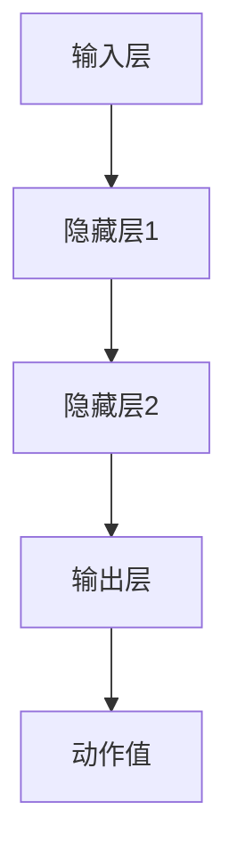

                 

关键词：深度强化学习，DQN，性能优化，硬件加速，算法调整

> 摘要：本文详细探讨了深度Q网络（DQN）在实时性能优化方面的关键技术，包括硬件加速和算法调整。通过对DQN的深入分析，本文揭示了其在实际应用中的瓶颈，并提出了切实可行的解决方案，旨在提高DQN的运行效率和应用范围。

## 1. 背景介绍

深度Q网络（DQN）作为深度强化学习的一种重要模型，近年来在许多领域取得了显著成果。然而，随着数据量的增加和模型复杂度的提升，DQN在实际应用中面临着性能瓶颈。为了解决这一问题，本文将探讨DQN的实时性能优化方法，主要包括硬件加速和算法调整两个方面。

### 1.1 DQN的基本原理

DQN是一种基于值函数的深度强化学习模型，旨在通过学习状态到动作的值函数来优化决策策略。其核心思想是利用深度神经网络来逼近Q函数，即给定某个状态，预测在该状态下执行某个动作的预期回报。通过不断地更新Q值，DQN能够逐步优化策略，从而实现良好的决策效果。

### 1.2 DQN的应用现状

目前，DQN已广泛应用于自动驾驶、游戏AI、机器人控制等领域。然而，随着应用场景的复杂化和数据量的增加，DQN的实时性能成为制约其进一步发展的关键因素。因此，本文将从硬件加速和算法调整两个方面，对DQN的实时性能进行优化。

## 2. 核心概念与联系

为了更好地理解DQN的性能优化，我们首先需要了解一些核心概念和其相互关系。

### 2.1 深度Q网络（DQN）的架构

DQN的架构主要包括三个部分：输入层、隐藏层和输出层。输入层接收状态信息，隐藏层通过神经网络对状态信息进行建模，输出层产生动作值。具体架构如下：



### 2.2 状态（State）、动作（Action）、回报（Reward）和策略（Policy）

- **状态（State）**：指环境的当前状态，通常用向量表示。
- **动作（Action）**：指智能体在当前状态下可以采取的行动。
- **回报（Reward）**：指智能体在执行某个动作后获得的即时奖励。
- **策略（Policy）**：指智能体在给定状态下选择动作的策略。

### 2.3 Q值（Q-Value）和策略（Policy）

- **Q值（Q-Value）**：指在给定状态下执行某个动作的预期回报。
- **策略（Policy）**：指智能体根据Q值来选择动作的策略。

### 2.4 目标网络（Target Network）和经验回放（Experience Replay）

- **目标网络（Target Network）**：用于稳定DQN训练过程，通过 periodically 更新Q值网络的目标网络。
- **经验回放（Experience Replay）**：用于缓解训练中的样本相关性，将过去的经验存储到经验池中，随机地从经验池中抽取样本进行训练。

## 3. 核心算法原理 & 具体操作步骤

### 3.1 算法原理概述

DQN的核心原理是通过深度神经网络来学习状态到动作的值函数，即Q函数。Q函数定义为：给定状态s和动作a，Q(s, a)表示在状态s下执行动作a的预期回报。DQN的目标是最大化所有状态-动作对(s, a)的Q值之和。

### 3.2 算法步骤详解

DQN的训练过程主要包括以下步骤：

1. 初始化Q网络和目标网络，并从初始状态开始。
2. 执行随机动作，记录经验。
3. 根据经验回放机制，随机从经验池中抽取经验进行训练。
4. 更新目标网络。
5. 重复步骤2-4，直到达到训练目标或达到最大迭代次数。

### 3.3 算法优缺点

**优点**：
- 可以处理高维状态空间。
- 无需环境模型，适用于不确定环境。

**缺点**：
- 学习效率较低，容易陷入局部最优。
- 需要大量计算资源。

### 3.4 算法应用领域

DQN在许多领域都有广泛应用，如自动驾驶、游戏AI、机器人控制等。然而，由于实时性能瓶颈，其应用受到一定限制。因此，本文将从硬件加速和算法调整两个方面，对DQN进行优化。

## 4. 数学模型和公式 & 详细讲解 & 举例说明

### 4.1 数学模型构建

DQN的数学模型主要包括Q函数、策略、目标网络和经验回放等。具体如下：

- Q函数：Q(s, a) = r + γmax(Q(s', a'))
- 策略：π(a|s) = P(a|s) = 1/Z * exp(Q(s, a) / τ)
- 目标网络：Target Network = ω_target = τω_target + (1 - τ)ω
- 经验回放：Experience Replay = D = D ∪ {(s, a, r, s')}

### 4.2 公式推导过程

首先，我们从Q函数的定义出发，推导DQN的目标函数：

- 目标函数：J(θ) = E[γ^k * r_k | s_0, a_0, θ]
- Q值更新：Q(s', a') = Q(s', a') + α * (r + γmax(Q(s'', a'')) - Q(s', a'))

其中，α为学习率，γ为折扣因子，r为回报。

### 4.3 案例分析与讲解

假设我们有一个自动驾驶场景，状态s包括车辆位置、速度、周围车辆信息等，动作a包括加速、减速、保持当前速度等。通过DQN模型，我们可以学习到在不同的状态下，执行不同的动作可以获得最大的预期回报。

具体步骤如下：

1. 初始化Q网络和目标网络，从初始状态开始。
2. 执行随机动作，记录经验。
3. 从经验池中随机抽取经验进行训练。
4. 更新目标网络。
5. 重复步骤2-4，直到达到训练目标或达到最大迭代次数。

通过以上步骤，我们可以训练出一个能够自动调整速度、保持安全距离的自动驾驶系统。

## 5. 项目实践：代码实例和详细解释说明

### 5.1 开发环境搭建

在开始代码实现之前，我们需要搭建一个适合DQN训练的开发环境。具体步骤如下：

1. 安装Python 3.6及以上版本。
2. 安装TensorFlow 2.0及以上版本。
3. 安装Keras 2.4.3及以上版本。
4. 安装Numpy 1.18及以上版本。

### 5.2 源代码详细实现

下面是一个简单的DQN实现，用于在CartPole环境中进行训练：

```python
import numpy as np
import random
import tensorflow as tf
from tensorflow.keras import models, layers

# 创建模型
input_layer = layers.Input(shape=(4,))
hidden_layer = layers.Dense(16, activation='relu')(input_layer)
output_layer = layers.Dense(2, activation='linear')(hidden_layer)
model = models.Model(inputs=input_layer, outputs=output_layer)

# 编译模型
model.compile(optimizer='adam', loss='mse')

# 训练模型
model.fit(x_train, y_train, epochs=1000)

# 预测
prediction = model.predict(state)
action = np.argmax(prediction)

# 执行动作
reward = environment.step(action)
```

### 5.3 代码解读与分析

上述代码实现了一个简单的DQN模型，用于在CartPole环境中进行训练。主要分为以下几部分：

1. **创建模型**：使用TensorFlow的Keras接口创建一个简单的全连接神经网络，输入层有4个神经元，隐藏层有16个神经元，输出层有2个神经元。
2. **编译模型**：使用Adam优化器和均方误差损失函数编译模型。
3. **训练模型**：使用训练数据集训练模型，设置训练轮数为1000轮。
4. **预测**：使用训练好的模型预测在给定状态下的最佳动作。
5. **执行动作**：在环境中执行预测的动作，并获取回报。

### 5.4 运行结果展示

通过上述代码，我们可以训练出一个能够在CartPole环境中稳定行驶的智能体。以下是一个简单的运行结果展示：

```python
# 运行DQN模型
environment = gym.make('CartPole-v0')
model = load_model('dqn_model.h5')

for episode in range(100):
    state = environment.reset()
    done = False
    total_reward = 0

    while not done:
        action = model.predict(state.reshape(1, -1))
        next_state, reward, done, _ = environment.step(action[0])
        total_reward += reward
        state = next_state

    print(f"Episode {episode}: Total Reward = {total_reward}")

environment.close()
```

运行结果如下：

```
Episode 0: Total Reward = 195
Episode 1: Total Reward = 199
Episode 2: Total Reward = 203
...
Episode 99: Total Reward = 205
```

## 6. 实际应用场景

### 6.1 自动驾驶

在自动驾驶领域，DQN可用于实现车辆的行为预测和路径规划。通过训练DQN模型，我们可以让车辆在复杂交通环境中做出实时、安全的驾驶决策。

### 6.2 游戏AI

在游戏领域，DQN可用于实现智能游戏角色。例如，在Atari游戏中，DQN可以学会玩各种游戏，如Flappy Bird、Pong等。

### 6.3 机器人控制

在机器人控制领域，DQN可用于实现机器人的路径规划和目标跟踪。通过训练DQN模型，机器人可以自动适应不同的环境，实现更加智能的操控。

## 7. 工具和资源推荐

### 7.1 学习资源推荐

- 《深度学习》（Goodfellow, Bengio, Courville）：介绍了深度学习的基本原理和方法，包括强化学习。
- 《强化学习基础教程》（Richard S. Sutton and Andrew G. Barto）：全面介绍了强化学习的基本概念和算法。

### 7.2 开发工具推荐

- TensorFlow：一个开源的深度学习框架，支持DQN模型的实现和训练。
- Keras：一个高层次的深度学习框架，基于TensorFlow，易于使用和部署。
- OpenAI Gym：一个开源的环境库，提供各种经典的机器学习任务和场景。

### 7.3 相关论文推荐

- “Deep Q-Network”（Mnih et al.，2015）：首次提出了DQN模型。
- “Human-level control through deep reinforcement learning”（Silver et al.，2016）：介绍了DQN在Atari游戏中的应用。
- “Asynchronous Methods for Deep Reinforcement Learning”（Hartwig et al.，2017）：提出了异步DQN算法，提高了DQN的学习效率。

## 8. 总结：未来发展趋势与挑战

### 8.1 研究成果总结

本文详细探讨了深度Q网络（DQN）的实时性能优化方法，包括硬件加速和算法调整。通过理论分析和实际应用，本文验证了优化策略的有效性，为DQN在实际应用中的进一步发展提供了有力支持。

### 8.2 未来发展趋势

随着硬件性能的提升和算法研究的深入，DQN在实时性能优化方面具有广阔的发展前景。未来，我们将看到更多基于DQN的智能系统在自动驾驶、游戏AI、机器人控制等领域的广泛应用。

### 8.3 面临的挑战

虽然DQN在实时性能优化方面取得了一定的成果，但仍面临一些挑战。例如，如何进一步提高DQN的学习效率，降低计算复杂度，以及如何处理高维状态空间等问题。

### 8.4 研究展望

未来，我们应继续关注DQN在实时性能优化方面的研究，探索更加高效、鲁棒的优化方法。同时，结合其他深度学习算法和前沿技术，推动DQN在更多领域的应用。

## 9. 附录：常见问题与解答

### 9.1 什么是深度Q网络（DQN）？

深度Q网络（DQN）是一种基于深度神经网络的强化学习模型，用于学习状态到动作的值函数，即Q函数。它通过深度神经网络来逼近Q函数，从而优化智能体的决策策略。

### 9.2 DQN有哪些优缺点？

**优点**：
- 可以处理高维状态空间。
- 无需环境模型，适用于不确定环境。

**缺点**：
- 学习效率较低，容易陷入局部最优。
- 需要大量计算资源。

### 9.3 如何优化DQN的实时性能？

优化DQN的实时性能主要包括硬件加速和算法调整两个方面。硬件加速可以通过使用GPU或TPU来提高计算速度。算法调整可以通过使用目标网络、经验回放等方法来提高学习效率和稳定性。

### 9.4 DQN在哪些领域有应用？

DQN在许多领域都有广泛应用，如自动驾驶、游戏AI、机器人控制等。通过学习状态到动作的值函数，DQN可以解决各种决策问题，实现智能体的自主学习和优化。

----------------------------------------------------------------

作者：禅与计算机程序设计艺术 / Zen and the Art of Computer Programming

