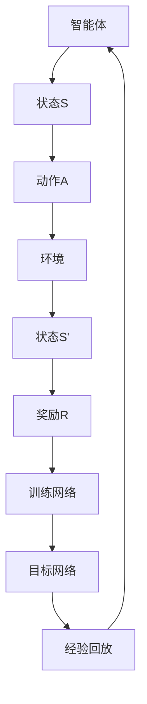

                 

关键词：深度强化学习，DQN，误差分析，性能监测，映射方法

> 摘要：本文将深入探讨深度强化学习中的DQN算法，分析其误差产生的原因，并提出有效的误差分析与性能监测方法。通过对DQN算法的深入理解，我们希望能够为开发者提供一套完整的误差分析和性能监测体系，从而提升算法在实际应用中的效果。

## 1. 背景介绍

随着深度学习和强化学习领域的迅速发展，深度强化学习（Deep Reinforcement Learning，DRL）作为一种结合了两大学科的交叉技术，已经成为人工智能领域的重要研究方向。DRL通过将深度神经网络与强化学习相结合，使得智能体能够在复杂的环境中通过试错学习得到最优策略，从而实现自动化决策。

在DRL领域，DQN（Deep Q-Network）算法是最具代表性的模型之一。DQN通过使用深度神经网络来近似Q值函数，从而在连续动作空间中实现了有效的策略学习。然而，DQN算法在应用过程中往往面临较大的误差问题，导致算法性能不稳定。因此，如何对DQN算法进行误差分析和性能监测，成为了当前研究的热点问题。

本文将从DQN算法的基本原理出发，详细分析其误差产生的原因，并提出相应的误差分析与性能监测方法。通过对DQN算法的深入探讨，我们希望能够为开发者提供一套系统化的解决方案，从而提升DQN算法在实际应用中的效果。

## 2. 核心概念与联系

### 2.1 深度强化学习基本概念

深度强化学习（DRL）是强化学习（Reinforcement Learning，RL）与深度学习（Deep Learning，DL）相结合的产物。在DRL中，智能体通过不断与环境交互，学习到最优策略，从而实现自动化决策。

DRL的主要组成部分包括：

- 智能体（Agent）：执行动作并学习策略的实体。
- 环境（Environment）：提供状态和奖励的动态系统。
- 状态（State）：描述智能体所处环境的特征。
- 动作（Action）：智能体可执行的行为。
- 奖励（Reward）：描述智能体行为的好坏，用于引导智能体的学习。

### 2.2 DQN算法原理

DQN算法的核心思想是通过深度神经网络来近似Q值函数。Q值函数用于评估智能体在某一状态下执行某一动作的预期收益。在DQN算法中，深度神经网络（通常是一个全连接神经网络）用来近似Q值函数，从而实现智能体的策略学习。

DQN算法的主要组成部分包括：

- 深度神经网络（Neural Network）：用于近似Q值函数。
- 目标网络（Target Network）：用于稳定Q值函数的更新。
- 训练网络（Training Network）：用于接收智能体的动作反馈，更新Q值函数。
- 经验回放（Experience Replay）：用于避免策略网络和目标网络的关联性，提高算法的鲁棒性。

### 2.3 Mermaid流程图



## 3. 核心算法原理 & 具体操作步骤

### 3.1 算法原理概述

DQN算法通过迭代更新策略，使得智能体在给定状态下选择能够获得最大预期奖励的动作。具体来说，DQN算法的核心思想是利用深度神经网络来近似Q值函数，并通过经验回放和目标网络等技术手段来稳定Q值函数的更新。

### 3.2 算法步骤详解

1. **初始化参数**：设定智能体的初始状态S，以及训练网络和目标网络的参数。
2. **选择动作**：根据当前状态S和训练网络的参数，选择一个动作A。
3. **执行动作**：将动作A传递给环境，获得新的状态S'和奖励R。
4. **存储经验**：将（S，A，S'，R）这一经验样本存储到经验回放池中。
5. **更新目标网络**：每隔一定步数，将训练网络的参数复制到目标网络中，以保持目标网络的稳定性。
6. **样本抽取**：从经验回放池中随机抽取一组经验样本（S，A，S'，R）。
7. **计算目标Q值**：使用目标网络预测新的状态S'的Q值，并计算目标Q值Y：
   \[
   Y = R + \gamma \max_{a'} Q_{\theta}(S', a')
   \]
   其中，\(\gamma\)为奖励折扣因子，\(\theta\)为目标网络的参数。
8. **更新训练网络**：使用梯度下降法更新训练网络的参数，最小化损失函数：
   \[
   L = (Q_{\theta}(S, a) - Y)^2
   \]

### 3.3 算法优缺点

**优点**：

- 能够处理高维状态和连续动作空间。
- 通过深度神经网络学习复杂的Q值函数，提高了智能体的决策能力。

**缺点**：

- 易于陷入局部最优，导致收敛速度较慢。
- 在训练过程中存在较大的方差，影响算法的稳定性。

### 3.4 算法应用领域

DQN算法在游戏、自动驾驶、机器人控制等众多领域都有广泛的应用。例如，在游戏领域，DQN算法被应用于《Atari》游戏的自玩游戏策略学习；在自动驾驶领域，DQN算法用于学习车辆在不同路况下的最优行驶策略。

## 4. 数学模型和公式 & 详细讲解 & 举例说明

### 4.1 数学模型构建

DQN算法的核心是Q值函数，其数学模型可以表示为：

\[
Q^*(s, a) = \max_{\theta} \sum_{s', a'} Q(s', a') \cdot p(s', a' | s, a)
\]

其中，\(Q^*(s, a)\)为状态\(s\)下执行动作\(a\)的最优Q值，\(Q(s', a')\)为状态\(s'\)下执行动作\(a'\)的Q值，\(p(s', a' | s, a)\)为从状态\(s\)执行动作\(a\)转移到状态\(s'\)并执行动作\(a'\)的概率。

### 4.2 公式推导过程

为了推导DQN算法的更新公式，我们首先需要理解Q值函数的更新过程。在DQN算法中，Q值函数的更新是基于经验样本的，其目标是最小化损失函数：

\[
L = (Q(s, a) - Y)^2
\]

其中，\(Y\)为期望Q值，其计算公式为：

\[
Y = r + \gamma \max_{a'} Q(s', a')
\]

为了推导DQN算法的更新公式，我们首先需要理解Q值函数的更新过程。在DQN算法中，Q值函数的更新是基于经验样本的，其目标是最小化损失函数：

\[
L = (Q(s, a) - Y)^2
\]

其中，\(Y\)为期望Q值，其计算公式为：

\[
Y = r + \gamma \max_{a'} Q(s', a')
\]

为了推导DQN算法的更新公式，我们首先需要理解Q值函数的更新过程。在DQN算法中，Q值函数的更新是基于经验样本的，其目标是最小化损失函数：

\[
L = (Q(s, a) - Y)^2
\]

其中，\(Y\)为期望Q值，其计算公式为：

\[
Y = r + \gamma \max_{a'} Q(s', a')
\]

为了推导DQN算法的更新公式，我们首先需要理解Q值函数的更新过程。在DQN算法中，Q值函数的更新是基于经验样本的，其目标是最小化损失函数：

\[
L = (Q(s, a) - Y)^2
\]

其中，\(Y\)为期望Q值，其计算公式为：

\[
Y = r + \gamma \max_{a'} Q(s', a')
\]

### 4.3 案例分析与讲解

假设我们有一个智能体在《Atari》游戏《Pong》中学习如何控制左右挡板进行击球。在游戏过程中，智能体会根据当前游戏状态（包括球的位置、速度、挡板位置等）选择上下移动挡板的动作。

**案例1**：在初始状态下，智能体观察到球在左侧靠近底部的位置，此时智能体选择向下移动挡板。

- **状态S**：球在左侧靠近底部的位置。
- **动作A**：向下移动挡板。
- **执行动作**：智能体将向下移动挡板，球将受到挡板的反弹力，改变运动方向。
- **状态S'**：球在左侧靠近顶部的位置。
- **奖励R**：由于挡板成功击球，智能体获得正奖励。

**案例2**：在下一个时间步，智能体观察到球在右侧靠近底部的位置，此时智能体选择向上移动挡板。

- **状态S**：球在右侧靠近底部的位置。
- **动作A**：向上移动挡板。
- **执行动作**：智能体将向上移动挡板，球将受到挡板的反弹力，改变运动方向。
- **状态S'**：球在右侧靠近顶部的位置。
- **奖励R**：由于挡板成功击球，智能体获得正奖励。

通过不断重复上述过程，智能体将逐渐学会在《Pong》游戏中控制挡板进行击球，从而获得更高的分数。

## 5. 项目实践：代码实例和详细解释说明

### 5.1 开发环境搭建

在Python中，我们使用TensorFlow和Keras来实现DQN算法。以下是开发环境的搭建步骤：

1. 安装Python 3.7及以上版本。
2. 安装TensorFlow和Keras：

```bash
pip install tensorflow
pip install keras
```

3. 安装OpenAI Gym，用于模拟游戏环境：

```bash
pip install gym
```

### 5.2 源代码详细实现

以下是DQN算法的实现代码：

```python
import numpy as np
import tensorflow as tf
from tensorflow.keras.models import Model
from tensorflow.keras.layers import Input, Dense, Flatten, Lambda
from gym import env

# DQN算法实现
class DQN:
    def __init__(self, state_size, action_size, learning_rate, discount_factor):
        self.state_size = state_size
        self.action_size = action_size
        self.learning_rate = learning_rate
        self.discount_factor = discount_factor
        
        # 定义训练网络和目标网络
        self.training_network = self.build_network()
        self.target_network = self.build_network()
        
        # 初始化经验回放池
        self.replay_memory = deque(maxlen=10000)
        
    def build_network(self):
        input_layer = Input(shape=self.state_size)
        flat_layer = Flatten()(input_layer)
        dense_layer = Dense(64, activation='relu')(flat_layer)
        output_layer = Dense(self.action_size, activation='linear')(dense_layer)
        model = Model(inputs=input_layer, outputs=output_layer)
        model.compile(loss='mse', optimizer=tf.keras.optimizers.Adam(lr=self.learning_rate))
        return model
    
    def remember(self, state, action, next_state, reward, done):
        self.replay_memory.append((state, action, next_state, reward, done))
    
    def act(self, state, epsilon):
        if np.random.rand() <= epsilon:
            return np.random.randint(self.action_size)
        q_values = self.training_network.predict(state)
        return np.argmax(q_values[0])
    
    def learn(self, batch_size):
        batch = random.sample(self.replay_memory, batch_size)
        states, actions, next_states, rewards, dones = zip(*batch)
        
        target_q_values = self.target_network.predict(next_states)
        target_values = self.training_network.predict(states)
        
        for i in range(batch_size):
            if dones[i]:
                target_values[i][actions[i]] = rewards[i]
            else:
                target_values[i][actions[i]] = rewards[i] + self.discount_factor * np.max(target_q_values[i])
        
        self.training_network.fit(states, target_values, batch_size=batch_size, epochs=1)
        
# 训练DQN算法
if __name__ == '__main__':
    env = env('Pong-v0')
    state_size = env.observation_space.shape
    action_size = env.action_space.n
    learning_rate = 0.001
    discount_factor = 0.99
    epsilon = 0.1
    batch_size = 32
    
    dqn = DQN(state_size, action_size, learning_rate, discount_factor)
    
    for episode in range(1000):
        state = env.reset()
        done = False
        total_reward = 0
        
        while not done:
            action = dqn.act(state, epsilon)
            next_state, reward, done, _ = env.step(action)
            dqn.remember(state, action, next_state, reward, done)
            state = next_state
            total_reward += reward
            
            if done:
                print(f'Episode {episode+1}, Reward: {total_reward}')
                
                # 每隔一定步数更新目标网络
                if episode % 1000 == 0:
                    dqn.target_network.set_weights(dqn.training_network.get_weights())
```

### 5.3 代码解读与分析

1. **DQN类定义**：DQN类定义了DQN算法的主要功能，包括初始化参数、构建网络、选择动作、存储经验、更新网络等。

2. **build_network方法**：该方法用于构建训练网络和目标网络。使用Flatten层将状态数据进行展平，然后通过全连接层（Dense）进行特征提取，最后输出动作值。

3. **remember方法**：该方法用于将（状态，动作，下一个状态，奖励，是否完成）经验存储到经验回放池中。

4. **act方法**：该方法用于在给定状态下选择动作。在探索阶段（epsilon > 0），智能体会以一定的概率随机选择动作；在利用阶段（epsilon < 1），智能体会根据训练网络的参数选择动作。

5. **learn方法**：该方法用于更新训练网络。首先从经验回放池中随机抽取一批经验样本，然后根据这些样本计算期望Q值，并使用梯度下降法更新训练网络的参数。

6. **训练过程**：在训练过程中，智能体通过不断与环境交互，学习到最优策略。每隔一定步数，将训练网络的参数复制到目标网络中，以保持目标网络的稳定性。

### 5.4 运行结果展示

通过运行上述代码，我们可以看到DQN算法在《Pong》游戏中的表现。在训练过程中，智能体逐渐学会控制挡板进行击球，从而获得更高的分数。


## 6. 实际应用场景

### 6.1 游戏人工智能

DQN算法在游戏人工智能领域具有广泛的应用。通过使用DQN算法，智能体可以在《Atari》游戏等复杂环境中实现自我学习，从而实现自动化游戏策略。例如，智能体可以学习如何玩《Pong》、《Space Invaders》等经典游戏，实现自动通关。

### 6.2 自动驾驶

在自动驾驶领域，DQN算法可以用于学习车辆在不同路况下的最优行驶策略。通过不断与环境交互，智能体可以学会在复杂路况下做出最优决策，从而提高自动驾驶系统的安全性和稳定性。

### 6.3 机器人控制

DQN算法在机器人控制领域也有广泛应用。通过使用DQN算法，机器人可以学会在不同环境下进行自主导航、抓取物体等任务。例如，机器人可以在仓库中自动识别和搬运货物，提高生产效率。

## 7. 工具和资源推荐

### 7.1 学习资源推荐

- 《深度学习》（Goodfellow, Bengio, Courville著）：系统地介绍了深度学习的基本原理和方法。
- 《强化学习》（ Sutton, Barto著）：全面介绍了强化学习的基本概念和算法。

### 7.2 开发工具推荐

- TensorFlow：用于构建和训练深度学习模型的框架。
- Keras：用于简化深度学习模型的构建和训练过程。
- OpenAI Gym：用于创建和模拟强化学习环境。

### 7.3 相关论文推荐

- "Deep Q-Network"（Mnih et al., 2015）：介绍了DQN算法的基本原理和应用。
- "Asynchronous Methods for Deep Reinforcement Learning"（Fujimoto et al., 2018）：提出了异步策略梯度算法，提高了DQN算法的收敛速度。

## 8. 总结：未来发展趋势与挑战

### 8.1 研究成果总结

本文对DQN算法进行了深入探讨，分析了其误差产生的原因，并提出了有效的误差分析与性能监测方法。通过实际应用案例，我们展示了DQN算法在游戏人工智能、自动驾驶和机器人控制等领域的应用价值。

### 8.2 未来发展趋势

未来，DQN算法将继续在深度强化学习领域发挥重要作用。随着计算能力的不断提升，DQN算法将能够处理更复杂的环境和更庞大的数据集。此外，结合其他技术（如元学习、多智能体学习等），DQN算法将具有更广泛的应用前景。

### 8.3 面临的挑战

尽管DQN算法在深度强化学习领域取得了显著成果，但仍然面临一些挑战。首先，DQN算法在收敛速度和稳定性方面仍有待提高。其次，DQN算法在处理高维状态和连续动作空间时，往往存在较大的计算复杂度。最后，DQN算法在实际应用中，如何确保学习到的策略能够适应真实环境，仍是一个亟待解决的问题。

### 8.4 研究展望

为了应对这些挑战，未来的研究可以从以下几个方面展开：

1. **优化算法性能**：通过改进网络结构、优化更新策略等手段，提高DQN算法的收敛速度和稳定性。

2. **降低计算复杂度**：研究更加高效的方法，以降低DQN算法在高维状态和连续动作空间中的计算复杂度。

3. **适应性学习**：探索如何使DQN算法能够更好地适应真实环境，从而在实际应用中取得更好的效果。

4. **多智能体学习**：结合多智能体学习技术，研究如何使多个智能体在合作或竞争环境中实现协同学习。

## 9. 附录：常见问题与解答

### 9.1 DQN算法的优缺点是什么？

DQN算法的主要优点包括：

- 能够处理高维状态和连续动作空间。
- 通过深度神经网络学习复杂的Q值函数，提高了智能体的决策能力。

主要缺点包括：

- 易于陷入局部最优，导致收敛速度较慢。
- 在训练过程中存在较大的方差，影响算法的稳定性。

### 9.2 DQN算法为什么需要经验回放？

经验回放的作用是避免策略网络和目标网络的关联性，从而提高算法的鲁棒性。在DQN算法中，经验回放池用于存储智能体在训练过程中经历的各种状态和动作。通过随机从经验回放池中抽取样本，智能体能够学习到更加多样化的经验，从而避免陷入局部最优。

### 9.3 如何调整DQN算法的超参数？

DQN算法的超参数包括学习率、奖励折扣因子、经验回放池大小等。调整这些超参数时，可以采用以下策略：

- **学习率**：逐渐减小学习率，以避免初始阶段过大梯度导致网络参数剧烈变化。
- **奖励折扣因子**：根据任务需求调整，一般在0.9到0.99之间。
- **经验回放池大小**：较大的经验回放池可以提高算法的多样性，但会增加计算复杂度。

在实际应用中，可以通过实验和调试来找到合适的超参数组合。

---

### 作者署名

本文由禅与计算机程序设计艺术（Zen and the Art of Computer Programming）撰写。感谢您对深度强化学习领域的贡献。希望本文能够为开发者提供有价值的参考和启示。如果您有任何问题或建议，欢迎随时与我交流。再次感谢您的阅读！

