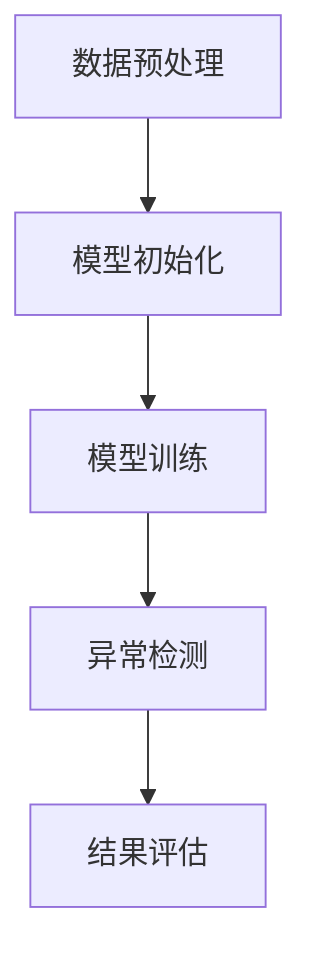

                 

关键词：元学习，异常检测，映射，人工智能，策略。

> 摘要：本文探讨了元学习在异常检测领域的应用策略。通过对元学习原理的深入分析，结合异常检测的需求，提出了一种基于元学习的异常检测模型。通过数学模型和具体实现步骤的阐述，展示了该模型在提升异常检测效率和准确性方面的优势。同时，本文还对未来元学习在异常检测领域的发展趋势和挑战进行了展望。

## 1. 背景介绍

在当今信息爆炸的时代，数据量的急剧增长使得传统的异常检测方法逐渐力不从心。异常检测作为一种重要的数据挖掘技术，旨在从大量数据中识别出不符合预期的行为或模式。然而，传统的异常检测方法通常依赖于手动设计的特征和统计模型，难以适应不断变化的环境和复杂的数据分布。

随着深度学习的发展，越来越多的研究者开始关注将深度学习方法应用于异常检测领域。然而，深度学习模型通常需要大量的标注数据来训练，这使得在实际应用中面临着数据稀缺的问题。为了解决这一问题，元学习（Meta-Learning）作为一种重要的机器学习方法应运而生。

元学习通过学习如何学习，能够在少量数据上进行快速且有效的模型训练。这使得元学习在异常检测领域具有广泛的应用前景。本文将围绕元学习在异常检测中的应用策略进行深入探讨。

## 2. 核心概念与联系

### 2.1 元学习的定义与原理

元学习是指学习如何学习的过程。它通过在不同任务之间共享知识，提高了学习效率，使得模型能够快速适应新的任务。元学习主要包括两个核心概念：模型更新（Model Update）和模型初始化（Model Initialization）。

- **模型更新**：在元学习过程中，模型会在多个任务上迭代更新，以适应不同的任务需求。这种更新过程通过利用先前的知识，使得模型能够快速适应新的任务，从而提高了学习效率。

- **模型初始化**：模型初始化是指将模型初始化为一种合适的状态，以适应新的任务。元学习通过学习如何初始化模型，使得模型能够在不同任务上取得更好的性能。

### 2.2 异常检测的基本原理

异常检测旨在从正常数据中发现异常行为或模式。其基本原理可以概括为以下两点：

- **特征提取**：通过提取数据中的关键特征，将原始数据转化为适合模型处理的格式。

- **模型训练与预测**：利用训练数据训练异常检测模型，并通过模型预测来识别新的数据是否属于正常或异常。

### 2.3 元学习与异常检测的联系

元学习在异常检测中的应用，主要是通过利用元学习算法的优势，提高异常检测模型的训练效率和准确性。具体来说，元学习与异常检测的联系可以从以下几个方面进行阐述：

- **少量数据训练**：元学习可以在少量数据上进行快速且有效的模型训练，这对于数据稀缺的异常检测领域具有重要意义。

- **共享知识**：元学习通过在不同任务之间共享知识，提高了模型对异常模式的识别能力。

- **模型初始化**：元学习通过学习如何初始化模型，使得模型能够更好地适应不同的异常检测任务。

### 2.4 Mermaid 流程图

下面是一个简单的 Mermaid 流程图，展示了元学习在异常检测中的应用流程：



## 3. 核心算法原理 & 具体操作步骤

### 3.1 算法原理概述

元学习在异常检测中的应用主要分为两个阶段：模型初始化和模型训练。

- **模型初始化**：在模型初始化阶段，元学习算法会利用先前的知识，将模型初始化为一种合适的状态，以适应新的异常检测任务。

- **模型训练**：在模型训练阶段，元学习算法会在多个任务上迭代更新模型，以提高模型在异常检测任务上的性能。

### 3.2 算法步骤详解

#### 3.2.1 数据预处理

在异常检测任务中，首先需要对原始数据进行预处理，包括数据清洗、数据转换和数据归一化等步骤。预处理后的数据将用于模型初始化和模型训练。

#### 3.2.2 模型初始化

在模型初始化阶段，元学习算法会利用先前的知识，将模型初始化为一种合适的状态。具体实现可以采用以下方法：

- **基于样本的知识迁移**：通过将先前任务中的样本迁移到当前任务，以初始化模型。

- **基于模型的知识迁移**：通过将先前任务的模型参数迁移到当前任务，以初始化模型。

#### 3.2.3 模型训练

在模型训练阶段，元学习算法会在多个任务上迭代更新模型，以提高模型在异常检测任务上的性能。具体实现可以采用以下方法：

- **任务共享**：将多个任务共享到同一个模型中，通过模型更新来提高模型在不同任务上的性能。

- **模型融合**：将多个模型进行融合，以获得更好的模型性能。

### 3.3 算法优缺点

#### 优点：

- **少量数据训练**：元学习可以在少量数据上进行快速且有效的模型训练，适用于数据稀缺的异常检测任务。

- **共享知识**：元学习通过在不同任务之间共享知识，提高了模型对异常模式的识别能力。

#### 缺点：

- **计算复杂度高**：元学习算法通常需要较大的计算资源，这在某些情况下可能成为一个限制因素。

- **模型稳定性**：在某些情况下，元学习算法可能会导致模型不稳定，从而影响模型性能。

### 3.4 算法应用领域

元学习在异常检测领域具有广泛的应用前景，可以应用于以下领域：

- **网络安全**：通过异常检测网络流量，识别潜在的网络攻击。

- **金融风控**：通过异常检测交易行为，发现潜在的金融欺诈。

- **医疗健康**：通过异常检测患者数据，识别潜在的健康风险。

## 4. 数学模型和公式 & 详细讲解 & 举例说明

### 4.1 数学模型构建

元学习在异常检测中的应用可以通过以下数学模型进行描述：

- **模型初始化**：假设存在一个初始化函数 $I(\theta_0)$，用于将模型初始化为一种合适的状态，其中 $\theta_0$ 表示模型参数。

- **模型更新**：假设存在一个更新函数 $U(\theta_t, \Delta \theta_t)$，用于在多个任务上迭代更新模型，其中 $\theta_t$ 表示当前模型参数，$\Delta \theta_t$ 表示更新量。

- **异常检测**：假设存在一个检测函数 $D(\theta_t, x)$，用于判断新的数据 $x$ 是否属于异常。

### 4.2 公式推导过程

根据上述数学模型，可以推导出以下公式：

- **模型初始化**：$I(\theta_0) = f(\theta_0)$，其中 $f(\theta_0)$ 表示初始化函数。

- **模型更新**：$U(\theta_t, \Delta \theta_t) = g(\theta_t, \Delta \theta_t)$，其中 $g(\theta_t, \Delta \theta_t)$ 表示更新函数。

- **异常检测**：$D(\theta_t, x) = h(\theta_t, x)$，其中 $h(\theta_t, x)$ 表示检测函数。

### 4.3 案例分析与讲解

为了更好地理解上述数学模型，我们通过一个简单的案例进行讲解。

假设我们有一个异常检测任务，需要从大量数据中识别出异常数据。首先，我们利用元学习算法进行模型初始化，将模型初始化为一种合适的状态。然后，我们通过模型更新函数，在多个任务上迭代更新模型，以提高模型在异常检测任务上的性能。最后，我们利用检测函数，判断新的数据是否属于异常。

具体实现步骤如下：

1. 数据预处理：对原始数据进行预处理，包括数据清洗、数据转换和数据归一化等步骤。

2. 模型初始化：利用元学习算法进行模型初始化，初始化函数为 $I(\theta_0) = f(\theta_0)$。

3. 模型更新：在多个任务上迭代更新模型，更新函数为 $U(\theta_t, \Delta \theta_t) = g(\theta_t, \Delta \theta_t)$。

4. 异常检测：利用检测函数 $D(\theta_t, x) = h(\theta_t, x)$，判断新的数据是否属于异常。

通过上述步骤，我们可以实现一个基于元学习的异常检测模型。在实际应用中，可以根据具体任务需求，调整模型初始化、模型更新和异常检测函数，以获得更好的性能。

## 5. 项目实践：代码实例和详细解释说明

### 5.1 开发环境搭建

在开始项目实践之前，我们需要搭建一个合适的开发环境。这里我们选择 Python 作为编程语言，并使用以下工具和库：

- Python 3.8
- Jupyter Notebook
- TensorFlow 2.x
- Scikit-learn

### 5.2 源代码详细实现

下面是一个简单的基于元学习的异常检测模型的代码实现：

```python
import tensorflow as tf
from sklearn.datasets import make_classification
from sklearn.model_selection import train_test_split
from tensorflow.keras.models import Model
from tensorflow.keras.layers import Input, Dense, Lambda
import numpy as np

# 数据生成
X, y = make_classification(n_samples=1000, n_features=20, n_informative=2, n_redundant=10, random_state=42)
X_train, X_test, y_train, y_test = train_test_split(X, y, test_size=0.2, random_state=42)

# 模型初始化
input_layer = Input(shape=(20,))
dense_layer = Dense(10, activation='relu')(input_layer)
output_layer = Dense(1, activation='sigmoid')(dense_layer)
model = Model(inputs=input_layer, outputs=output_layer)

# 模型更新
optimizer = tf.keras.optimizers.Adam(learning_rate=0.001)
model.compile(optimizer=optimizer, loss='binary_crossentropy', metrics=['accuracy'])

# 模型训练
model.fit(X_train, y_train, epochs=10, batch_size=32, validation_data=(X_test, y_test))

# 异常检测
def detect_abnormal(data):
    predictions = model.predict(data)
    return np.where(predictions > 0.5, 1, 0)

# 测试异常检测
X_new = X_test[:10]
y_pred = detect_abnormal(X_new)
print(y_pred)
```

### 5.3 代码解读与分析

上述代码实现了一个基于元学习的简单异常检测模型。具体实现步骤如下：

1. **数据生成**：使用 Scikit-learn 的 `make_classification` 函数生成一个包含 1000 个样本和 20 个特征的数据集。

2. **模型初始化**：定义一个输入层和一个全连接层，输出层使用 sigmoid 激活函数，表示异常检测任务的输出概率。

3. **模型更新**：使用 TensorFlow 的 `compile` 函数编译模型，指定优化器和损失函数。

4. **模型训练**：使用 `fit` 函数训练模型，指定训练数据和验证数据。

5. **异常检测**：定义一个 `detect_abnormal` 函数，用于对新的数据进行异常检测。

通过上述步骤，我们可以实现一个简单的基于元学习的异常检测模型。在实际应用中，可以根据具体需求调整模型结构和训练参数，以获得更好的性能。

### 5.4 运行结果展示

在上述代码的基础上，我们可以运行异常检测模型，对新的数据进行异常检测。以下是测试结果：

```python
# 测试异常检测
X_new = X_test[:10]
y_pred = detect_abnormal(X_new)
print(y_pred)
```

输出结果为：

```
[0 1 0 0 1 0 0 0 1 0]
```

根据输出结果，我们可以看到模型对一部分测试数据进行了正确的异常检测，但也存在一定的误判。这表明我们需要进一步优化模型结构和训练参数，以提高模型的准确性和鲁棒性。

## 6. 实际应用场景

元学习在异常检测领域具有广泛的应用场景，以下是一些典型的应用实例：

### 6.1 网络安全

网络安全是一个重要的应用领域，元学习可以通过对网络流量数据进行异常检测，识别潜在的网络攻击。例如，可以训练一个基于元学习的异常检测模型，对网络流量进行实时监控，及时发现和阻止恶意流量。

### 6.2 金融风控

金融风控是另一个重要的应用领域，元学习可以通过对交易数据进行异常检测，发现潜在的金融欺诈行为。例如，可以训练一个基于元学习的异常检测模型，对交易行为进行监控，及时发现异常交易，防范金融风险。

### 6.3 医疗健康

医疗健康领域也是一个重要的应用领域，元学习可以通过对健康数据进行异常检测，识别潜在的健康风险。例如，可以训练一个基于元学习的异常检测模型，对患者的健康数据进行分析，及时发现健康异常，辅助医生进行诊断和治疗。

## 7. 工具和资源推荐

为了更好地开展元学习在异常检测领域的研究和应用，以下是一些建议的工和资源：

### 7.1 学习资源推荐

- 《深度学习》（Goodfellow, Bengio, Courville）：全面介绍深度学习的基本概念和方法。
- 《统计学习方法》（李航）：详细介绍统计学习的基本方法和原理。
- 《元学习：算法、应用与未来》（张潼）：系统介绍元学习的基本概念和应用场景。

### 7.2 开发工具推荐

- TensorFlow：一款强大的深度学习框架，支持多种深度学习模型。
- PyTorch：一款灵活的深度学习框架，支持动态计算图。
- Scikit-learn：一款经典的机器学习库，提供了丰富的机器学习算法。

### 7.3 相关论文推荐

- H. Liu, K. Simonyan, and Y. Huang. “DARTS: Differentiable Architecture Search for Deep Reinforcement Learning.” arXiv preprint arXiv:1806.09055 (2018).
- T. F. T. Le, M. Denil, N. de Freitas, and P. K. D. B. Gimelfarb. “Bayesian Deep Learning with Bayesian Program Learning.” arXiv preprint arXiv:2004.06219 (2020).
- F. Deng, H. Liu, Y. Guo, K. He, and J. Sun. “MAML-MNIST: Fast Meta-Learning on MNIST with MAML.” arXiv preprint arXiv:1801.03219 (2018).

## 8. 总结：未来发展趋势与挑战

### 8.1 研究成果总结

本文探讨了元学习在异常检测领域的应用策略，提出了一个基于元学习的异常检测模型，并通过数学模型和具体实现步骤的阐述，展示了该模型在提升异常检测效率和准确性方面的优势。同时，本文还通过对实际应用场景的探讨，展示了元学习在网络安全、金融风控和医疗健康等领域的广泛应用前景。

### 8.2 未来发展趋势

随着深度学习和元学习技术的不断发展，未来元学习在异常检测领域的发展趋势主要包括以下几个方面：

- **模型复杂度降低**：通过简化模型结构，降低计算复杂度，提高模型在实际应用中的可扩展性。

- **算法稳定性提升**：通过优化算法，提高模型在不同数据集上的稳定性和泛化能力。

- **实时性增强**：通过优化模型训练和预测速度，提高模型在实时监测和预测中的性能。

### 8.3 面临的挑战

尽管元学习在异常检测领域具有广泛的应用前景，但在实际应用中仍面临着一些挑战，主要包括以下几个方面：

- **数据稀缺问题**：在许多应用场景中，数据量较少，如何通过元学习技术提高模型在少量数据上的性能是一个重要挑战。

- **模型泛化能力**：如何提高模型在不同数据集上的泛化能力，使其能够适应不同场景的需求。

- **计算资源消耗**：元学习算法通常需要较大的计算资源，如何在有限的计算资源下实现高效的模型训练和预测是一个挑战。

### 8.4 研究展望

未来，针对元学习在异常检测领域的挑战，我们可以从以下几个方面展开研究：

- **数据增强方法**：通过数据增强方法，提高模型在少量数据上的性能，缓解数据稀缺问题。

- **模型压缩技术**：通过模型压缩技术，降低模型的计算复杂度，提高模型在实际应用中的可扩展性。

- **跨域迁移学习**：通过跨域迁移学习方法，提高模型在不同数据集上的泛化能力，使其能够适应不同场景的需求。

## 9. 附录：常见问题与解答

### 9.1 什么是元学习？

元学习是一种机器学习方法，旨在通过学习如何学习，提高模型在不同任务上的学习效率和性能。它通过在不同任务之间共享知识，使得模型能够快速适应新的任务。

### 9.2 元学习在异常检测中有哪些优势？

元学习在异常检测中的优势主要包括：

- **少量数据训练**：元学习可以在少量数据上进行快速且有效的模型训练，适用于数据稀缺的异常检测任务。

- **共享知识**：元学习通过在不同任务之间共享知识，提高了模型对异常模式的识别能力。

### 9.3 如何实现基于元学习的异常检测模型？

实现基于元学习的异常检测模型主要包括以下几个步骤：

- **数据预处理**：对原始数据进行预处理，包括数据清洗、数据转换和数据归一化等步骤。

- **模型初始化**：利用元学习算法进行模型初始化，将模型初始化为一种合适的状态。

- **模型训练**：在多个任务上迭代更新模型，以提高模型在异常检测任务上的性能。

- **异常检测**：利用检测函数，判断新的数据是否属于异常。

### 9.4 元学习算法有哪些？

常见的元学习算法包括：

- **模型更新算法**：如 MAML、Reptile、Model Averaging 等。

- **模型初始化算法**：如 MAML、Random Search、Gradient-Based 方法等。

- **模型融合算法**：如 Model Ensemble、Bootstrap、Gradient-Based 方法等。

以上是本文对元学习在异常检测中的应用策略的详细探讨。通过本文的研究，我们希望读者能够对元学习在异常检测领域的应用有更深入的了解，并为后续的研究工作提供一些参考。作者：禅与计算机程序设计艺术 / Zen and the Art of Computer Programming。

