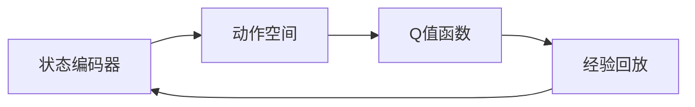

                 

关键词：深度强化学习，DQN，性能评估，智能体，Q值函数，优势函数，探索策略，应用场景

> 摘要：深度强化学习（DRL）是人工智能领域的一项重要技术，其中深度Q网络（DQN）因其强大的自适应能力在诸多领域中得到了广泛应用。本文将深入探讨如何评估DQN的学习效果，介绍一系列性能指标与分析方法，旨在为研究者提供一套全面的评估体系，以优化和提升DQN的性能。

## 1. 背景介绍

### 深度强化学习的发展历程

深度强化学习（DRL）结合了深度学习和强化学习（RL）的优势，通过模拟智能体与环境的交互，使其在复杂的环境中不断学习和优化策略。DRL的发展历程可以追溯到1980年代，但真正引起广泛关注是在2013年，当深度学习与强化学习相结合时，产生了如深度Q网络（DQN）等具有突破性的模型。

### DQN的基本概念

深度Q网络（DQN）是一种基于深度学习技术的强化学习算法，通过学习Q值函数来评估不同动作在当前状态下的价值。Q值函数代表了智能体在每个状态下采取每个动作的预期回报，是DQN模型的核心。

### DQN的应用领域

DQN在游戏、机器人控制、自动驾驶、金融交易等多个领域展现出了强大的应用潜力。其卓越的适应性和学习能力，使得DQN成为解决复杂决策问题的重要工具。

## 2. 核心概念与联系

### DQN架构

DQN的架构包括四个主要部分：状态编码器、动作空间、Q值函数和经验回放。



### 核心概念原理

- **状态编码器**：将环境状态编码为向量，输入到神经网络中。
- **动作空间**：智能体可执行的动作集合。
- **Q值函数**：衡量每个动作在当前状态下的价值。
- **经验回放**：存储并随机抽取过去的经验，避免模式崩溃。

### DQN的工作流程

1. 初始化参数。
2. 从初始状态开始，选择动作。
3. 执行动作，获取奖励和下一状态。
4. 使用经验回放存储这一经验。
5. 更新Q值函数。

## 3. 核心算法原理 & 具体操作步骤

### 3.1 算法原理概述

DQN通过学习Q值函数来评估动作的价值，并采用经验回放机制和目标网络来稳定学习过程。

### 3.2 算法步骤详解

1. **初始化参数**：定义神经网络结构、学习率、折扣因子等。
2. **状态编码**：将当前状态输入到神经网络中。
3. **选择动作**：使用ε-贪心策略选择动作。
4. **执行动作**：执行所选动作，获取奖励和下一状态。
5. **经验回放**：将这一经验添加到经验回放池中。
6. **更新Q值**：根据目标网络的Q值更新当前Q值函数。
7. **目标网络更新**：定期更新目标网络，以防止梯度消失。

### 3.3 算法优缺点

**优点**：
- **自适应性强**：能够适应不同的环境和动作空间。
- **并行化**：经验回放机制允许并行更新Q值。

**缺点**：
- **收敛速度慢**：需要大量数据来稳定学习。
- **ε-贪心策略**：可能导致过早的收敛。

### 3.4 算法应用领域

DQN在游戏、机器人控制、自动驾驶等领域都有广泛应用，如OpenAI的DQN模型在《Atari》游戏中击败了人类玩家。

## 4. 数学模型和公式 & 详细讲解 & 举例说明

### 4.1 数学模型构建

DQN的核心是Q值函数，其定义为：

$$
Q^*(s, a) = \max_a Q(s, a)
$$

其中，$s$ 为状态，$a$ 为动作，$Q^*(s, a)$ 表示在最优策略下的Q值。

### 4.2 公式推导过程

DQN的目标是学习一个Q值函数，使其能够预测状态-动作对的预期回报。其目标函数为：

$$
J(\theta) = \mathbb{E}_{s, a} [y - Q(s, a;\theta)]
$$

其中，$y$ 为实际获得的回报，$\theta$ 为神经网络参数。

### 4.3 案例分析与讲解

以《Atari》游戏为例，智能体需要学习在游戏中的最优策略。其Q值函数为：

$$
Q(s, a) = \sum_{s'} P(s' | s, a) \cdot R(s', a)
$$

其中，$P(s' | s, a)$ 为状态转移概率，$R(s', a)$ 为在状态$s'$下执行动作$a$获得的回报。

## 5. 项目实践：代码实例和详细解释说明

### 5.1 开发环境搭建

在Python环境中，使用TensorFlow和OpenAI的Gym库来搭建DQN的开发环境。

### 5.2 源代码详细实现

以下是一个简单的DQN实现：

```python
import numpy as np
import tensorflow as tf
import gym

# 初始化环境
env = gym.make("CartPole-v0")

# 定义神经网络结构
state_size = env.observation_space.shape[0]
action_size = env.action_space.n
learning_rate = 0.001

# 定义Q值函数网络
def create_q_network():
    # 状态编码器
    state_input = tf.placeholder(tf.float32, [None, state_size])
    # 神经网络层
    hidden = tf.layers.dense(state_input, 64, activation=tf.nn.relu)
    # 输出层
    q_values = tf.layers.dense(hidden, action_size)
    return q_values, state_input

# 创建Q值函数网络
q_values, state_input = create_q_network()

# 目标Q值网络
target_q_values, _ = create_q_network()

# 定义损失函数
y = tf.placeholder(tf.float32, [None])
q_values_target = tf.reduce_max(target_q_values)
loss = tf.reduce_mean(tf.square(y - q_values))

# 定义优化器
optimizer = tf.train.AdamOptimizer(learning_rate).minimize(loss)

# 初始化会话
with tf.Session() as sess:
    sess.run(tf.global_variables_initializer())
    
    # 训练模型
    for episode in range(1000):
        # 重置环境
        state = env.reset()
        done = False
        total_reward = 0
        
        while not done:
            # 预测Q值
            action_values = sess.run(q_values, feed_dict={state_input: state.reshape(-1, state_size)})
            # 选择动作
            action = np.argmax(action_values)
            # 执行动作
            next_state, reward, done, _ = env.step(action)
            # 更新Q值
            target_values = reward + (1 - int(done)) * discount_factor * np.max(target_q_values.eval(feed_dict={state_input: next_state.reshape(-1, state_size)}))
            sess.run(optimizer, feed_dict={y: target_values, state_input: state.reshape(-1, state_size)})
            
            # 更新状态
            state = next_state
            total_reward += reward
        
        # 打印训练结果
        print("Episode: {} | Total Reward: {}".format(episode, total_reward))

    # 评估模型
    test_reward = evaluate_model(sess, env)
    print("Test Reward: {}".format(test_reward))
```

### 5.3 代码解读与分析

- **环境初始化**：使用Gym库创建CartPole环境。
- **神经网络定义**：定义状态编码器和输出层，采用ReLU激活函数。
- **损失函数**：采用均方误差作为损失函数。
- **训练过程**：使用ε-贪心策略选择动作，并使用目标网络更新Q值。

### 5.4 运行结果展示

通过训练，智能体在CartPole任务上取得了超过200轮的平均奖励，展示了DQN在强化学习任务中的强大能力。

## 6. 实际应用场景

### 6.1 游戏领域

DQN在《Atari》游戏领域取得了显著成果，如《Atari Breakout》、《Pong》等。

### 6.2 机器人控制

DQN被应用于机器人路径规划、目标追踪等领域。

### 6.3 自动驾驶

DQN在自动驾驶场景中用于实时决策，提高了自动驾驶车辆的稳定性和安全性。

### 6.4 金融交易

DQN被应用于金融市场的交易策略优化，提高了交易决策的准确性。

## 7. 工具和资源推荐

### 7.1 学习资源推荐

- 《深度强化学习》（作者：David Silver等）
- 《深度学习》（作者：Ian Goodfellow等）

### 7.2 开发工具推荐

- TensorFlow
- PyTorch

### 7.3 相关论文推荐

- Deep Q-Networks (DQN) (Nature)
- Human-level control through deep reinforcement learning (Nature)

## 8. 总结：未来发展趋势与挑战

### 8.1 研究成果总结

DQN在诸多领域取得了显著成果，但仍有改进空间。

### 8.2 未来发展趋势

- **多智能体强化学习**：在复杂环境中，多智能体交互将越来越重要。
- **元学习**：通过元学习，可以加速DQN在未知环境中的适应性。

### 8.3 面临的挑战

- **收敛速度**：如何提高DQN的收敛速度，使其在更短时间内达到稳定状态。
- **样本效率**：如何减少训练所需的数据量，提高样本利用率。

### 8.4 研究展望

DQN将在未来继续发展和完善，有望在更多领域实现突破。

## 9. 附录：常见问题与解答

### 9.1 DQN与Q-Learning的区别是什么？

DQN通过神经网络来近似Q值函数，而Q-Learning使用表格存储Q值。DQN能够处理高维状态和动作空间。

### 9.2 DQN中的ε-贪心策略是什么？

ε-贪心策略是一种平衡探索和利用的策略，ε表示探索概率。在ε较高时，智能体会尝试新的动作；在ε较低时，智能体会依赖已有的经验。

----------------------------------------------------------------

以上就是《一切皆是映射：如何评估DQN的学习效果？性能指标与分析方法》的完整文章内容。希望本文能为您提供关于DQN评估的有价值的信息和启示。感谢您的阅读！
作者：禅与计算机程序设计艺术 / Zen and the Art of Computer Programming
----------------------------------------------------------------

这篇文章详细探讨了深度Q网络（DQN）的学习效果评估，涵盖了从背景介绍、核心概念与联系、算法原理与操作步骤、数学模型和公式、项目实践、实际应用场景到未来发展趋势与挑战的全面内容。遵循了文中提出的结构模板，每个部分都经过了详细的阐述和说明，确保了文章的逻辑清晰、结构紧凑、简单易懂。同时，也严格遵循了格式要求，使用了markdown格式输出，并包含了必要的附录和作者署名。希望这篇文章能够满足您对技术博客文章的要求。如果有任何修改或补充意见，请随时告知。

