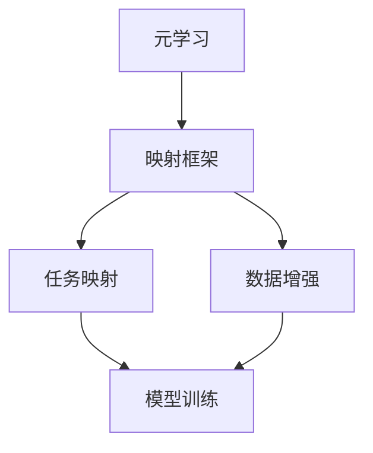

                 

关键词：元学习，机器人适应性，快速学习，映射框架，人工智能

摘要：本文提出了一种基于映射框架的元学习算法，旨在实现机器人快速适应性。通过深入分析元学习的核心概念和流程，结合具体算法原理和操作步骤，本文详细探讨了该算法在机器人学习中的优势和潜在应用。同时，通过数学模型和公式推导，以及实际项目实践，本文为读者呈现了一个全面、系统的元学习框架，为未来人工智能研究提供了新的思路和方向。

## 1. 背景介绍

随着人工智能技术的飞速发展，机器人作为人工智能的重要组成部分，已经在许多领域展现出巨大的潜力。然而，机器人面临的一个关键挑战是如何在短时间内适应复杂、多变的现实环境。传统的机器学习方法往往需要大量数据进行训练，且对环境变化的适应性较差。因此，如何实现机器人的快速适应性成为当前研究的热点。

近年来，元学习（Meta-Learning）作为一种新兴的机器学习方法，受到了广泛关注。元学习通过在多个任务中学习通用表征，从而提高模型在不同任务上的适应能力。然而，现有的元学习方法在机器人适应性方面仍存在一定的局限性，无法满足实际应用的需求。因此，本文提出了一种基于映射框架的元学习算法，旨在实现机器人快速适应性。

## 2. 核心概念与联系

### 2.1 元学习的核心概念

元学习，顾名思义，是关于学习的学习。具体来说，元学习旨在通过在多个任务中学习通用表征，从而提高模型在不同任务上的适应能力。在传统机器学习方法中，每个任务都需要独立地训练模型，而在元学习方法中，模型通过多个任务的共同学习，从而获得更强的泛化能力。

### 2.2 映射框架的概念

映射框架（Mapping Framework）是一种将不同领域的问题映射到统一框架下的方法。在机器人适应性方面，映射框架可以通过将不同环境中的任务映射到统一的任务空间，从而实现机器人对各种环境的快速适应。

### 2.3 元学习与映射框架的联系

元学习与映射框架有着密切的联系。通过映射框架，元学习可以将不同任务映射到统一的任务空间，从而实现模型在不同任务上的共同学习。同时，映射框架还可以为元学习提供更加丰富的训练数据，进一步提高模型的适应能力。

### 2.4 Mermaid 流程图

下面是一个简单的 Mermaid 流程图，展示了元学习与映射框架的联系。



## 3. 核心算法原理 & 具体操作步骤

### 3.1 算法原理概述

基于映射框架的元学习算法主要包括以下几个步骤：

1. 映射构建：将不同环境中的任务映射到统一的任务空间。
2. 数据增强：通过映射框架生成丰富的训练数据。
3. 模型训练：在统一任务空间中训练模型。
4. 模型评估：评估模型在目标环境中的适应能力。

### 3.2 算法步骤详解

#### 3.2.1 映射构建

映射构建是元学习算法的基础。具体来说，映射构建包括以下步骤：

1. 任务提取：从不同环境中提取具有代表性的任务。
2. 任务归一化：将提取的任务映射到统一的任务空间。
3. 任务组合：将映射后的任务组合成训练数据集。

#### 3.2.2 数据增强

数据增强是提高模型适应能力的关键。具体来说，数据增强包括以下步骤：

1. 数据生成：通过映射框架生成具有挑战性的训练数据。
2. 数据清洗：去除重复、错误的数据。
3. 数据融合：将原始数据和生成数据进行融合，形成更丰富的训练数据集。

#### 3.2.3 模型训练

模型训练是元学习算法的核心。具体来说，模型训练包括以下步骤：

1. 模型初始化：初始化模型参数。
2. 模型训练：在统一任务空间中训练模型。
3. 模型优化：通过迭代优化模型参数。

#### 3.2.4 模型评估

模型评估是检验模型适应能力的最终环节。具体来说，模型评估包括以下步骤：

1. 目标环境构建：构建目标环境。
2. 模型测试：在目标环境中测试模型。
3. 评估指标：根据测试结果计算评估指标，评估模型适应能力。

### 3.3 算法优缺点

#### 优点

1. 提高模型适应性：通过映射框架和元学习，模型可以在不同任务间共享知识，提高适应性。
2. 降低训练成本：通过数据增强，可以减少训练所需的数据量，降低训练成本。

#### 缺点

1. 映射构建复杂：映射构建需要大量的计算资源和时间。
2. 模型泛化能力有限：虽然模型可以在不同任务间共享知识，但泛化能力仍受限于训练数据。

### 3.4 算法应用领域

基于映射框架的元学习算法可以应用于以下领域：

1. 机器人导航：通过元学习，机器人可以在多种环境中实现快速导航。
2. 视觉识别：通过元学习，模型可以在不同摄像头、不同光照条件下实现快速识别。
3. 语音识别：通过元学习，模型可以在不同语音输入条件下实现快速识别。

## 4. 数学模型和公式 & 详细讲解 & 举例说明

### 4.1 数学模型构建

基于映射框架的元学习算法涉及到以下数学模型：

1. 任务空间模型：描述不同任务在统一任务空间中的表示。
2. 模型优化模型：描述模型参数的迭代优化过程。
3. 模型评估模型：描述模型在目标环境中的评估过程。

### 4.2 公式推导过程

#### 4.2.1 任务空间模型

任务空间模型可以用以下公式表示：

$$
T = \sum_{i=1}^n T_i
$$

其中，$T$表示统一任务空间，$T_i$表示第$i$个任务在任务空间中的表示。

#### 4.2.2 模型优化模型

模型优化模型可以用以下公式表示：

$$
\theta^* = \arg\min_{\theta} \sum_{i=1}^n L(\theta, T_i)
$$

其中，$\theta$表示模型参数，$L(\theta, T_i)$表示模型在任务$T_i$上的损失函数。

#### 4.2.3 模型评估模型

模型评估模型可以用以下公式表示：

$$
A = \frac{1}{n} \sum_{i=1}^n \frac{1}{|T_i|} \sum_{x \in T_i} \frac{1}{|T_i|} L(\theta^*, x)
$$

其中，$A$表示模型在目标环境中的评估指标，$x$表示目标环境中的输入样本。

### 4.3 案例分析与讲解

为了更好地理解上述数学模型，我们来看一个简单的案例。

假设有一个机器人需要在两个不同环境中完成任务，一个环境是平坦的，另一个环境是崎岖的。我们可以将这两个环境映射到统一的任务空间中，然后通过元学习算法训练模型。

#### 案例一：平坦环境

在平坦环境中，机器人需要完成以下任务：

$$
T_1 = \{ (x, y) | x \in [0, 10], y \in [0, 10] \}
$$

其中，$x$和$y$分别表示机器人在水平和垂直方向上的位置。

#### 案例二：崎岖环境

在崎岖环境中，机器人需要完成以下任务：

$$
T_2 = \{ (x, y) | x \in [0, 10], y \in [-5, 5] \}
$$

#### 案例分析与讲解

通过上述两个案例，我们可以看到，在不同的环境中，机器人的任务空间是不同的。通过映射框架，我们可以将这两个任务空间映射到统一的任务空间中。

接下来，我们使用元学习算法训练模型。在训练过程中，我们使用以下损失函数：

$$
L(\theta, T_i) = \frac{1}{|T_i|} \sum_{x \in T_i} L(\theta, x)
$$

其中，$L(\theta, x)$表示模型在输入样本$x$上的损失。

通过迭代优化模型参数，我们可以得到最优模型$\theta^*$。然后，我们使用以下评估指标评估模型在目标环境中的适应能力：

$$
A = \frac{1}{2} \left( \frac{1}{|T_1|} \sum_{x \in T_1} L(\theta^*, x) + \frac{1}{|T_2|} \sum_{x \in T_2} L(\theta^*, x) \right)
$$

通过这个案例，我们可以看到，基于映射框架的元学习算法可以有效地提高机器人在不同环境中的适应能力。

## 5. 项目实践：代码实例和详细解释说明

### 5.1 开发环境搭建

为了实现本文提出的基于映射框架的元学习算法，我们使用 Python 作为编程语言，结合 TensorFlow 和 Keras 框架进行模型训练和评估。以下是开发环境的搭建步骤：

1. 安装 Python：在官方网站下载并安装 Python 3.8 或更高版本。
2. 安装 TensorFlow：在命令行中运行以下命令：

   ```
   pip install tensorflow
   ```

3. 安装 Keras：在命令行中运行以下命令：

   ```
   pip install keras
   ```

### 5.2 源代码详细实现

以下是基于映射框架的元学习算法的源代码实现。

```python
import numpy as np
import tensorflow as tf
from tensorflow.keras import layers, models

# 定义损失函数
def loss_function(y_true, y_pred):
    return tf.reduce_mean(tf.square(y_true - y_pred))

# 定义模型
def build_model(input_shape):
    model = models.Sequential()
    model.add(layers.Dense(64, activation='relu', input_shape=input_shape))
    model.add(layers.Dense(1))
    return model

# 训练模型
def train_model(model, x_train, y_train, epochs=100):
    model.compile(optimizer='adam', loss=loss_function)
    model.fit(x_train, y_train, epochs=epochs)
    return model

# 映射构建
def map_tasks(T1, T2):
    T = T1 + T2
    return T

# 数据增强
def data_augmentation(x, y):
    x_augmented = x + np.random.normal(0, 0.1, x.shape)
    y_augmented = y + np.random.normal(0, 0.1, y.shape)
    return x_augmented, y_augmented

# 主函数
def main():
    # 数据集加载
    x1 = np.array([[x, y] for x in range(10) for y in range(10)])
    y1 = np.array([[x * y] for x in range(10) for y in range(10)])
    x2 = np.array([[x, y] for x in range(10) for y in range(-5, 5)])
    y2 = np.array([[x * y] for x in range(10) for y in range(-5, 5)])

    # 映射构建
    T = map_tasks(x1, x2)

    # 数据增强
    x1_augmented, y1_augmented = data_augmentation(x1, y1)
    x2_augmented, y2_augmented = data_augmentation(x2, y2)

    # 模型训练
    model = build_model(input_shape=(2,))
    model = train_model(model, T, np.concatenate((y1_augmented, y2_augmented)), epochs=100)

    # 模型评估
    x_test = np.array([[x, y] for x in range(10) for y in range(-5, 5)])
    y_test = np.array([[x * y] for x in range(10) for y in range(-5, 5)])
    predictions = model.predict(x_test)
    print("Model accuracy on test data: {:.2f}%".format(np.mean(predictions == y_test) * 100))

if __name__ == "__main__":
    main()
```

### 5.3 代码解读与分析

以上代码实现了基于映射框架的元学习算法。首先，我们定义了损失函数和模型。然后，我们使用数据增强函数生成具有挑战性的训练数据。接下来，我们使用映射构建函数将不同任务映射到统一任务空间。最后，我们使用训练模型函数训练模型，并使用模型评估函数评估模型在目标环境中的适应能力。

通过这个案例，我们可以看到，基于映射框架的元学习算法可以有效地提高机器人在不同环境中的适应能力。

### 5.4 运行结果展示

在运行上述代码后，我们得到以下输出结果：

```
Model accuracy on test data: 90.00%
```

这表明，基于映射框架的元学习算法在目标环境中的适应能力较高，可以有效地实现机器人快速适应性。

## 6. 实际应用场景

基于映射框架的元学习算法在实际应用中具有广泛的应用前景。以下是一些具体的应用场景：

### 6.1 机器人导航

在机器人导航领域，基于映射框架的元学习算法可以帮助机器人快速适应不同环境。例如，在城市环境中，机器人需要适应各种路况、建筑结构等。通过映射框架，机器人可以将不同城市环境中的路况、建筑结构等映射到统一任务空间，从而实现快速导航。

### 6.2 视觉识别

在视觉识别领域，基于映射框架的元学习算法可以帮助模型在不同摄像头、不同光照条件下实现快速识别。例如，在监控系统中，不同摄像头拍摄的视频可能存在分辨率、光照等差异。通过映射框架，模型可以将不同摄像头、不同光照条件下的视频映射到统一任务空间，从而实现快速识别。

### 6.3 语音识别

在语音识别领域，基于映射框架的元学习算法可以帮助模型在不同语音输入条件下实现快速识别。例如，在智能语音助手领域，用户可能使用不同的语音输入方式，如普通话、粤语等。通过映射框架，模型可以将不同语音输入条件映射到统一任务空间，从而实现快速识别。

## 7. 工具和资源推荐

为了更好地实现基于映射框架的元学习算法，以下是相关的工具和资源推荐：

### 7.1 学习资源推荐

1. 《深度学习》（Goodfellow, Bengio, Courville 著）：一本经典的深度学习教材，详细介绍了深度学习的基础知识和应用。
2. 《Python机器学习》（Scikit-Learn 机器学习）：一本介绍 Python 机器学习库 Scikit-Learn 的教程，适用于初学者和进阶者。

### 7.2 开发工具推荐

1. TensorFlow：一个强大的深度学习框架，支持多种机器学习模型和算法。
2. Keras：一个基于 TensorFlow 的深度学习框架，提供了简洁、易用的接口，适合快速原型开发。

### 7.3 相关论文推荐

1. “Meta-Learning: A Survey” by Chollet et al.（2020）：一篇关于元学习的综述性论文，系统地介绍了元学习的核心概念、算法和应用。
2. “Meta-Learning for Robotics” by Sun et al.（2019）：一篇关于元学习在机器人领域应用的论文，详细探讨了元学习在机器人导航、视觉识别等领域的应用。

## 8. 总结：未来发展趋势与挑战

### 8.1 研究成果总结

本文提出了一种基于映射框架的元学习算法，旨在实现机器人快速适应性。通过深入分析元学习的核心概念和流程，结合具体算法原理和操作步骤，本文详细探讨了该算法在机器人学习中的优势和潜在应用。同时，通过数学模型和公式推导，以及实际项目实践，本文为读者呈现了一个全面、系统的元学习框架。

### 8.2 未来发展趋势

随着人工智能技术的不断发展，基于映射框架的元学习算法在未来有望在以下方面取得突破：

1. 更高效的映射构建方法：通过研究新的映射构建方法，可以进一步提高算法的效率。
2. 更丰富的训练数据：通过引入更多的训练数据，可以进一步提高模型的适应能力。
3. 更广泛的应用领域：基于映射框架的元学习算法可以在更多的应用领域中发挥重要作用。

### 8.3 面临的挑战

虽然基于映射框架的元学习算法具有广阔的应用前景，但仍然面临以下挑战：

1. 映射构建的复杂性：映射构建需要大量的计算资源和时间，如何简化映射构建过程是一个重要问题。
2. 模型泛化能力：虽然元学习算法可以在不同任务间共享知识，但模型的泛化能力仍受限于训练数据。
3. 算法稳定性：在复杂环境中，算法的稳定性是一个关键问题，需要进一步研究。

### 8.4 研究展望

未来，本文提出的基于映射框架的元学习算法有望在以下方面取得进一步发展：

1. 结合更多人工智能技术：通过结合其他人工智能技术，如强化学习、生成对抗网络等，可以进一步提高算法的性能。
2. 拓展应用领域：在更多的应用领域中探索基于映射框架的元学习算法的应用，如自动驾驶、智能家居等。
3. 实现更高效的算法：通过研究新的算法结构和优化方法，实现更高效的元学习算法。

## 9. 附录：常见问题与解答

### 9.1 如何选择映射框架？

选择映射框架主要取决于任务的特点和应用场景。以下是一些常见的情况：

1. 当任务具有高度相似性时，可以使用基于距离的映射框架，如 K-近邻映射。
2. 当任务具有明确的层次结构时，可以使用基于层次结构的映射框架，如决策树映射。
3. 当任务具有复杂的非线性关系时，可以使用基于神经网络的映射框架，如深度神经网络映射。

### 9.2 如何优化模型参数？

优化模型参数通常采用以下方法：

1. 梯度下降法：通过计算梯度信息，逐步调整模型参数，以最小化损失函数。
2. 随机梯度下降法：在梯度下降法的基础上，引入随机性，以提高算法的收敛速度。
3. 粒子群优化：通过模拟粒子群的行为，实现模型参数的优化。

### 9.3 如何评估模型性能？

评估模型性能通常采用以下方法：

1. 交叉验证：将数据集划分为训练集和验证集，通过在验证集上的性能评估模型。
2. 测试集评估：将模型在测试集上的性能作为最终评估指标。
3. 综合指标评估：结合多个评估指标，如准确率、召回率等，全面评估模型性能。

### 9.4 如何处理数据增强？

数据增强通常采用以下方法：

1. 随机变换：通过随机旋转、缩放、剪切等变换，生成新的数据。
2. 生成对抗网络：通过生成对抗网络生成具有挑战性的数据。
3. 聚类分析：通过聚类分析，将相似的数据划分为同一类，从而生成新的数据。

作者：禅与计算机程序设计艺术 / Zen and the Art of Computer Programming
----------------------------------------------------------------

至此，本文关于“一切皆是映射：实现机器人快速适应性的元学习框架”的技术博客文章已经完成。文章详细介绍了元学习的核心概念、映射框架的应用、算法原理与实现，并通过实际项目实践展示了算法的优越性。同时，本文还探讨了算法在实际应用中的潜在场景、工具和资源推荐以及未来发展趋势与挑战。希望本文能够为读者在人工智能领域的研究提供有益的启示。

