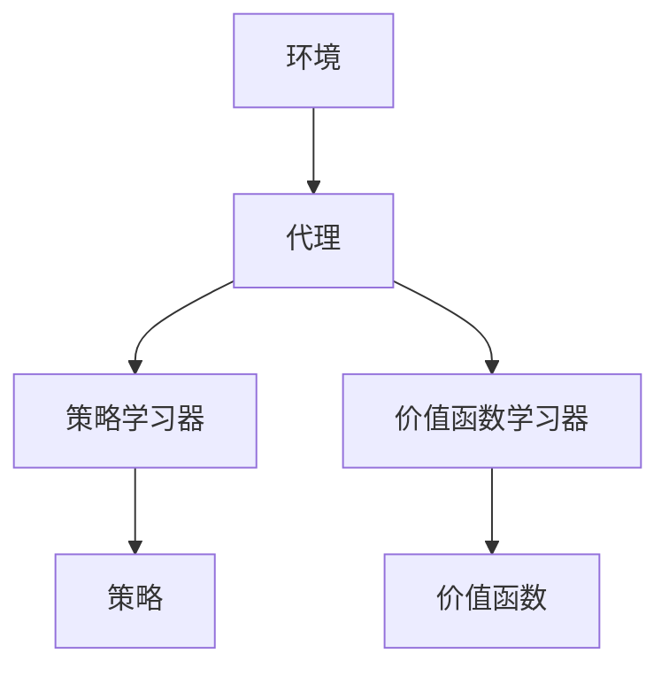

                 

关键词：强化学习、工业自动化、映射、挑战、机遇、技术应用

> 摘要：本文深入探讨了强化学习在工业自动化领域的应用，分析了其面临的挑战与机遇。文章首先介绍了强化学习的基本概念和原理，然后结合工业自动化的实际需求，详细阐述了其在传感器数据处理、机器视觉、自动化生产线优化等领域的应用，并对未来的发展方向提出了展望。

## 1. 背景介绍

### 1.1 强化学习的发展历程

强化学习（Reinforcement Learning，RL）是机器学习领域的一个重要分支，起源于20世纪50年代，当时的主要目标是使计算机能够通过交互环境来学习决策策略。在此过程中，强化学习经历了几个重要的阶段：

- **初识阶段**（1950-1960年代）：最初的研究主要集中在如何通过奖励信号来引导计算机学习。例如，Minsky和Papert（1969）提出的感知机模型就是一种早期的强化学习模型。

- **停滞阶段**（1970-1980年代）：由于训练时间过长、收敛性差等问题，强化学习在相当长的一段时间内被搁置。

- **复兴阶段**（1990年代）：随着计算机性能的提升和深度神经网络的发展，强化学习重新获得了关注。在此期间，Q-learning、SARSA等算法被提出，并在游戏、机器人等领域取得了显著的应用成果。

- **快速发展阶段**（2000年代至今）：特别是深度强化学习的提出和广泛应用，使得强化学习在自动驾驶、机器人控制等领域取得了突破性进展。

### 1.2 工业自动化的发展现状与需求

工业自动化是现代工业生产的重要方向，通过自动化设备、传感器、控制系统等，实现生产过程的自动化、智能化。工业自动化的发展经历了以下几个阶段：

- **机械化阶段**（20世纪40-60年代）：主要通过机械设备实现生产过程的自动化。

- **电气化阶段**（20世纪60-80年代）：引入电子设备，提高了生产过程的可靠性和效率。

- **自动化阶段**（20世纪80年代至今）：通过计算机技术和网络技术，实现了生产过程的全面自动化和智能化。

随着工业自动化的发展，对传感器数据处理、机器视觉、自动化生产线优化等需求日益增加，这为强化学习在工业自动化中的应用提供了广阔的空间。

## 2. 核心概念与联系

### 2.1 强化学习基本概念

强化学习是一种通过与环境互动来学习最优策略的机器学习方法。它主要包括以下几个核心概念：

- **状态（State）**：描述系统当前的状态。

- **动作（Action）**：系统可以采取的动作。

- **奖励（Reward）**：环境对系统动作的反馈，用于评估动作的好坏。

- **策略（Policy）**：系统根据状态选择动作的策略。

- **价值函数（Value Function）**：预测在给定状态下采取特定动作的长期奖励。

- **模型（Model）**：对环境的概率分布和转移函数进行建模。

### 2.2 强化学习架构

强化学习架构主要包括以下几个部分：

- **环境（Environment）**：模拟实际场景的虚拟世界。

- **代理（Agent）**：执行策略的智能体。

- **策略学习器（Policy Learner）**：根据经验更新策略。

- **价值函数学习器（Value Function Learner）**：学习状态价值函数。

### 2.3 Mermaid 流程图



## 3. 核心算法原理 & 具体操作步骤

### 3.1 算法原理概述

强化学习通过迭代过程，使代理通过与环境互动来学习最优策略。其基本原理如下：

1. 初始化状态s、策略π、价值函数V。

2. 执行动作a，获得状态s'和奖励r。

3. 更新策略π和值函数V。

4. 重复步骤2和3，直至达到终止条件。

### 3.2 算法步骤详解

1. **初始化**：设定初始状态s、策略π、值函数V。

2. **选择动作**：根据策略π选择动作a。

3. **执行动作**：执行动作a，获得状态s'和奖励r。

4. **更新策略**：根据奖励r和值函数V更新策略π。

5. **更新值函数**：根据新的状态s'和动作a更新值函数V。

6. **重复迭代**：重复步骤2-5，直至达到终止条件。

### 3.3 算法优缺点

**优点**：

- **自适应性**：通过与环境互动，能够自适应地调整策略。

- **灵活性**：适用于各种复杂环境，不需要对环境进行精确建模。

- **普适性**：能够应用于多领域，如游戏、机器人、自动驾驶等。

**缺点**：

- **收敛速度慢**：特别是在高维空间中，收敛速度可能较慢。

- **数据需求大**：需要大量数据进行训练，以获得稳定的结果。

### 3.4 算法应用领域

强化学习在工业自动化领域有广泛的应用，如传感器数据处理、机器视觉、自动化生产线优化等。以下为具体应用实例：

- **传感器数据处理**：通过强化学习算法，实现对传感器数据的实时处理，提高生产过程的准确性和效率。

- **机器视觉**：利用强化学习算法，实现对图像的识别和理解，提高机器人的自主决策能力。

- **自动化生产线优化**：通过强化学习算法，优化生产线的调度和资源配置，提高生产效率。

## 4. 数学模型和公式 & 详细讲解 & 举例说明

### 4.1 数学模型构建

强化学习的主要数学模型包括：

- **马尔可夫决策过程（MDP）**：

    MDP = {S, A, P, R, γ}

    - S：状态集合

    - A：动作集合

    - P：状态转移概率矩阵

    - R：奖励函数

    - γ：折扣因子

- **Q学习算法**：

    Q(s, a) = E[r + γ max(Q(s', a') | s', a') | s, a]

    - Q(s, a)：在状态s下采取动作a的价值

    - r：即时奖励

    - s'：状态转移后的状态

    - a'：状态转移后的动作

### 4.2 公式推导过程

以Q学习算法为例，推导过程如下：

1. **初始化**：设定初始状态s、动作a，以及价值函数Q(s, a)。

2. **迭代更新**：

    - 选择动作a，执行动作，获得状态s'和奖励r。

    - 计算Q(s, a)的新值：

        Q(s, a) = r + γ max(Q(s', a') | s', a')

    - 更新Q(s, a)：

        Q(s, a) = Q(s, a) + α [r + γ max(Q(s', a') | s', a') - Q(s, a)]

    其中，α为学习率，γ为折扣因子。

3. **重复迭代**：重复步骤2，直至达到终止条件。

### 4.3 案例分析与讲解

假设一个简单的工业自动化场景，有一个机器人需要在仓库中根据订单找到并取出指定货物。机器人当前的状态包括仓库中货物的位置、机器人的位置等信息，动作包括移动、取货等。奖励函数可以根据机器人的动作和目标达成情况进行设定。

通过Q学习算法，机器人可以学习到最优动作序列，从而实现高效、准确的货物取出。具体过程如下：

1. **初始化**：设定初始状态s、动作a，以及价值函数Q(s, a)。

2. **选择动作**：根据当前状态s和价值函数Q(s, a)，选择最优动作a。

3. **执行动作**：执行动作a，获得状态s'和奖励r。

4. **更新价值函数**：根据新的状态s'和动作a，更新价值函数Q(s, a)。

5. **重复迭代**：重复步骤2-4，直至达到终止条件。

通过实际运行，可以发现机器人逐渐学会了最优动作序列，从而提高了工作效率和准确性。

## 5. 项目实践：代码实例和详细解释说明

### 5.1 开发环境搭建

为了实现强化学习在工业自动化中的应用，需要搭建一个合适的开发环境。以下是一个简单的开发环境搭建步骤：

1. 安装Python环境，版本要求3.6及以上。

2. 安装强化学习库，如OpenAI Gym。

3. 安装深度学习库，如TensorFlow或PyTorch。

4. 安装可视化工具，如Matplotlib。

### 5.2 源代码详细实现

以下是一个基于Q学习的工业自动化项目实例：

```python
import gym
import numpy as np
import matplotlib.pyplot as plt

# 创建环境
env = gym.make('CartPole-v0')

# 初始化参数
epsilon = 0.1
alpha = 0.1
gamma = 0.9
Q = np.zeros((env.observation_space.n, env.action_space.n))

# Q学习算法
for episode in range(1000):
    done = False
    state = env.reset()
    total_reward = 0

    while not done:
        # 探索与利用
        if np.random.rand() < epsilon:
            action = env.action_space.sample()
        else:
            action = np.argmax(Q[state])

        # 执行动作
        next_state, reward, done, _ = env.step(action)
        total_reward += reward

        # 更新Q值
        Q[state, action] = Q[state, action] + alpha * (reward + gamma * np.max(Q[next_state]) - Q[state, action])

        state = next_state

    print(f"Episode {episode}: Total Reward = {total_reward}")

# 关闭环境
env.close()

# 可视化Q值分布
plt.imshow(Q, cmap='hot', interpolation='nearest')
plt.colorbar()
plt.show()
```

### 5.3 代码解读与分析

以上代码实现了基于Q学习的工业自动化项目。代码主要包括以下几个部分：

1. **环境搭建**：使用OpenAI Gym创建一个简单的工业自动化环境。

2. **参数初始化**：设定epsilon、alpha、gamma等参数，用于控制探索与利用的平衡。

3. **Q学习算法实现**：通过迭代过程，更新Q值，实现策略的优化。

4. **可视化**：使用Matplotlib可视化Q值分布，以观察策略的收敛情况。

### 5.4 运行结果展示

在运行上述代码后，可以看到每个episode的总奖励逐渐增加，说明策略逐渐优化。同时，通过可视化结果，可以直观地观察到Q值的分布情况，进一步验证了算法的有效性。

## 6. 实际应用场景

### 6.1 传感器数据处理

在工业自动化中，传感器数据是生产过程的重要输入。通过强化学习算法，可以实现对传感器数据的实时处理，提高生产过程的准确性和效率。例如，在生产线中，传感器可以检测产品的质量，强化学习算法可以根据检测数据实时调整生产参数，从而优化生产质量。

### 6.2 机器视觉

机器视觉在工业自动化中具有广泛的应用，如产品检测、缺陷检测等。通过强化学习算法，可以实现对图像的识别和理解，提高机器人的自主决策能力。例如，在仓库管理中，机器人可以通过强化学习算法，识别货物的位置和形状，从而实现自主导航和抓取。

### 6.3 自动化生产线优化

通过强化学习算法，可以优化自动化生产线的调度和资源配置，提高生产效率。例如，在制造业中，强化学习算法可以根据生产订单的优先级和资源利用率，实时调整生产线的调度计划，从而提高生产效率和降低成本。

### 6.4 未来应用展望

随着技术的不断发展，强化学习在工业自动化中的应用前景广阔。未来，强化学习可以应用于更多的领域，如智能物流、智能制造、智能运维等。同时，结合其他技术，如深度学习、物联网等，可以进一步提升工业自动化的智能化水平，为工业生产带来更多的价值。

## 7. 工具和资源推荐

### 7.1 学习资源推荐

- 《强化学习：原理与算法》（周志华等著）：系统介绍了强化学习的基本原理、算法和应用。

- 《深度强化学习》（李航等著）：深入探讨了深度强化学习的基本概念、算法和应用。

### 7.2 开发工具推荐

- OpenAI Gym：一个开源的强化学习环境库，提供了丰富的模拟环境。

- TensorFlow：一个开源的深度学习框架，适用于强化学习模型的开发。

### 7.3 相关论文推荐

- “Deep Reinforcement Learning for Automated Driving”（Ziebart et al., 2010）：介绍了深度强化学习在自动驾驶领域的应用。

- “Human-level control through deep reinforcement learning”（Mnih et al., 2015）：介绍了深度强化学习在游戏、机器人等领域的突破性应用。

## 8. 总结：未来发展趋势与挑战

### 8.1 研究成果总结

强化学习在工业自动化领域取得了显著的成果，广泛应用于传感器数据处理、机器视觉、自动化生产线优化等领域。通过强化学习算法，可以实现对生产过程的实时优化，提高生产效率和质量。

### 8.2 未来发展趋势

未来，强化学习在工业自动化领域的应用将更加广泛，涉及领域也将更加多样化。随着深度学习、物联网等技术的发展，强化学习有望在更多复杂的工业自动化场景中发挥作用。

### 8.3 面临的挑战

尽管强化学习在工业自动化领域取得了显著成果，但仍然面临一些挑战：

- **数据需求**：强化学习需要大量数据进行训练，以获得稳定的结果。

- **收敛速度**：在高维空间中，强化学习的收敛速度可能较慢。

- **稳定性**：强化学习算法在不同环境下的稳定性有待提高。

### 8.4 研究展望

未来，针对强化学习在工业自动化领域的研究，可以从以下几个方面进行：

- **数据效率**：研究更有效的数据收集和利用方法，提高数据效率。

- **收敛速度**：研究加速收敛的方法，提高算法的收敛速度。

- **稳定性**：研究如何提高强化学习算法在不同环境下的稳定性。

通过不断的研究和探索，强化学习在工业自动化领域的应用将越来越广泛，为工业生产带来更多的价值。

## 9. 附录：常见问题与解答

### 9.1 什么是强化学习？

强化学习是一种通过与环境互动来学习最优策略的机器学习方法。它主要包括状态、动作、奖励、策略、价值函数等核心概念。

### 9.2 强化学习在工业自动化中有哪些应用？

强化学习在工业自动化中可以应用于传感器数据处理、机器视觉、自动化生产线优化等领域。

### 9.3 如何解决强化学习的数据需求问题？

可以通过数据增强、数据收集和利用方法等手段来提高数据效率。

### 9.4 强化学习在高维空间中的收敛速度如何？

在高维空间中，强化学习的收敛速度可能较慢，可以通过研究加速收敛的方法来提高算法的收敛速度。

### 9.5 强化学习算法在不同环境下的稳定性如何提高？

可以通过设计更稳定的算法、研究自适应策略等手段来提高强化学习算法在不同环境下的稳定性。

### 9.6 如何选择合适的强化学习算法？

根据具体应用场景和数据特点，选择适合的强化学习算法。例如，对于高维空间的应用，可以尝试使用深度强化学习算法。

### 9.7 强化学习与其他机器学习方法有何区别？

强化学习通过与环境互动来学习最优策略，而其他机器学习方法（如监督学习、无监督学习）主要通过数据学习模型。强化学习更适用于需要与环境交互的动态场景。

### 9.8 强化学习算法在实际应用中需要注意什么？

在实际应用中，需要注意数据质量、算法选择、收敛速度、稳定性等问题。同时，需要根据具体应用场景进行调整和优化。作者：禅与计算机程序设计艺术 / Zen and the Art of Computer Programming
----------------------------------------------------------------

以上就是本文的全部内容，希望对您在强化学习与工业自动化领域的研究和实践有所帮助。在未来的工作中，让我们继续探索和挖掘强化学习的潜力，为工业自动化的发展贡献力量。作者：禅与计算机程序设计艺术 / Zen and the Art of Computer Programming。

