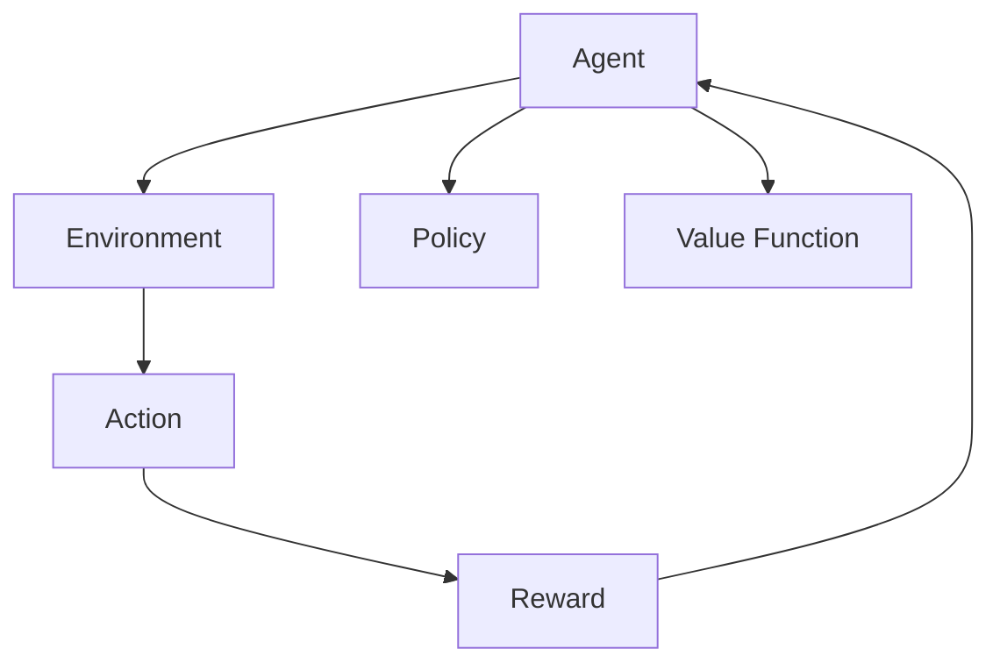

                 

在过去的几十年中，游戏行业经历了翻天覆地的变化，从最初的简单像素游戏到如今高度复杂且交互性强的虚拟世界。随着技术的进步，人工智能（AI）在游戏中的角色变得越来越重要。强化学习作为一种先进的机器学习技术，已经在游戏AI领域展现了其巨大的潜力。本文旨在探讨强化学习在游戏AI中的应用，通过具体案例和分析，展示其独特的优势与挑战。

## 关键词

- 强化学习
- 游戏AI
- 应用案例
- 模型分析
- 未来展望

## 摘要

本文首先介绍了强化学习的基本概念和历史背景，然后讨论了其在游戏AI中的具体应用，包括基于强化学习的游戏AI架构和算法。接着，通过具体案例分析，展示了强化学习在游戏AI中的实际应用效果。最后，对强化学习在游戏AI领域的未来发展趋势和潜在挑战进行了探讨。

## 1. 背景介绍

### 1.1 强化学习的起源与发展

强化学习（Reinforcement Learning，简称RL）是机器学习的一个重要分支，其核心思想是Agent通过与环境的交互，不断学习并获得奖励，从而改善其行为策略。强化学习的概念最早可以追溯到20世纪50年代，由心理学家和行为科学家提出。

1983年，理查德·萨顿（Richard Sutton）和安德鲁·巴托（Andrew Barto）的著作《强化学习：一种解释》奠定了强化学习理论的基础。随着深度学习技术的兴起，强化学习得到了新的发展，特别是在解决复杂任务方面表现出了强大的能力。

### 1.2 游戏AI的发展历程

游戏AI的起源可以追溯到20世纪70年代，当时计算机科学家开始尝试在游戏中引入简单的AI对手。这些早期AI主要基于规则系统，例如象棋和围棋中的策略树搜索。

随着计算机性能的提升和算法的改进，游戏AI逐渐变得更加复杂。20世纪90年代，游戏AI开始利用统计方法和模式识别技术，例如决策树和神经网络。这些方法在解决特定游戏任务时表现出了较好的效果。

进入21世纪，随着深度学习和强化学习的兴起，游戏AI进入了一个全新的发展阶段。强化学习通过学习玩家的行为模式，能够创造出更智能、更具挑战性的AI对手。

## 2. 核心概念与联系

### 2.1 强化学习的基本概念

强化学习由四个主要部分组成：Agent（智能体）、Environment（环境）、Action（动作）和Reward（奖励）。

- **Agent（智能体）**：执行动作的实体，可以是机器人、软件程序或者虚拟智能体。
- **Environment（环境）**：智能体执行动作的场所，可以是一个物理空间或者一个虚拟场景。
- **Action（动作）**：智能体可执行的行为。
- **Reward（奖励）**：智能体在执行动作后从环境中获得的反馈信号，用于评估动作的好坏。

### 2.2 强化学习的算法原理

强化学习算法的核心是价值函数（Value Function）和策略（Policy）。

- **价值函数（Value Function）**：用于评估智能体在某个状态下的期望奖励。
- **策略（Policy）**：智能体根据当前状态选择动作的规则。

### 2.3 游戏AI中的强化学习架构

在游戏AI中，强化学习架构通常包括以下几部分：

- **游戏引擎**：提供游戏世界的物理模拟和图形渲染。
- **智能体**：使用强化学习算法学习游戏策略。
- **环境**：模拟游戏场景，提供奖励信号。
- **评估系统**：用于评估智能体的表现。

### 2.4 核心概念与联系流程图



## 3. 核心算法原理 & 具体操作步骤

### 3.1 算法原理概述

强化学习算法通过迭代过程不断更新价值函数和策略，以最大化总奖励。核心算法包括以下几种：

- **价值迭代（Value Iteration）**：直接更新价值函数，直到收敛。
- **策略迭代（Policy Iteration）**：迭代更新策略，直到找到最优策略。
- **深度强化学习（Deep Reinforcement Learning，DRL）**：结合深度学习技术，用于处理高维状态空间和动作空间。

### 3.2 算法步骤详解

1. 初始化：设定智能体的初始状态和策略。
2. 执行动作：智能体根据当前策略选择动作。
3. 接收反馈：环境返回动作的结果，包括状态转移概率和奖励。
4. 更新策略：根据反馈更新价值函数或策略。
5. 重复执行：重复步骤2-4，直到满足收敛条件。

### 3.3 算法优缺点

**优点**：

- **自适应性强**：能够根据环境变化自适应调整策略。
- **灵活性高**：能够处理复杂的高维状态空间和动作空间。
- **泛化能力强**：能够将学习到的策略应用于类似环境。

**缺点**：

- **收敛速度慢**：在复杂环境中可能需要大量迭代才能收敛。
- **样本效率低**：需要大量样本数据进行训练。
- **计算资源消耗大**：特别是深度强化学习算法，对计算资源需求较高。

### 3.4 算法应用领域

强化学习在游戏AI中的应用非常广泛，包括但不限于：

- **游戏对手生成**：通过强化学习生成具有挑战性的游戏对手。
- **游戏行为预测**：预测玩家的行为模式，提高游戏体验。
- **游戏策略优化**：优化游戏策略，提高游戏AI的表现。

## 4. 数学模型和公式 & 详细讲解 & 举例说明

### 4.1 数学模型构建

强化学习中的核心数学模型包括：

- **马尔可夫决策过程（MDP）**：
  - **状态（State）**：\( S \)
  - **动作（Action）**：\( A \)
  - **状态转移概率（Transition Probability）**：\( P(S' | S, A) \)
  - **奖励（Reward）**：\( R(S, A) \)
  
- **价值函数（Value Function）**：
  - **状态价值函数（State-Value Function）**：\( V^*(s) \)
  - **动作价值函数（Action-Value Function）**：\( Q^*(s, a) \)

- **策略（Policy）**：
  - **最优策略（Optimal Policy）**：\( \pi^*(s) = \arg\max_a Q^*(s, a) \)

### 4.2 公式推导过程

强化学习中的主要目标是最小化期望损失，即最大化总奖励。具体公式如下：

\[ J(\theta) = \sum_{s \in S} \sum_{a \in A} \pi(\theta)(s) Q(s, a) - \alpha \sum_{s \in S} \sum_{a \in A} \pi(\theta)(s) Q(s, a) \]

其中，\( \theta \) 是模型参数，\( \alpha \) 是学习率。

### 4.3 案例分析与讲解

#### 案例：Atari游戏AI

在Atari游戏中，智能体需要通过观察屏幕像素、控制方向和跳跃等简单动作，学习如何玩游戏的策略。以下是一个简单的案例：

- **状态空间**：屏幕像素值
- **动作空间**：方向和跳跃
- **奖励信号**：得分

通过强化学习算法，智能体可以在数百万次试错中学习到最优策略，从而在Atari游戏中取得高分。

## 5. 项目实践：代码实例和详细解释说明

### 5.1 开发环境搭建

为了实现一个简单的强化学习游戏AI项目，我们可以使用Python语言和PyTorch框架。以下是一个简单的开发环境搭建步骤：

1. 安装Python（建议使用3.8及以上版本）
2. 安装PyTorch和相关依赖库
3. 安装Atari游戏库

```bash
pip install torch torchvision gym
```

### 5.2 源代码详细实现

以下是一个简单的基于深度强化学习的Atari游戏AI项目代码示例：

```python
import gym
import torch
import torch.nn as nn
import torch.optim as optim

# 定义DQN模型
class DQN(nn.Module):
    def __init__(self, input_size, hidden_size, output_size):
        super(DQN, self).__init__()
        self.fc1 = nn.Linear(input_size, hidden_size)
        self.fc2 = nn.Linear(hidden_size, output_size)

    def forward(self, x):
        x = torch.relu(self.fc1(x))
        x = self.fc2(x)
        return x

# 初始化环境、模型和优化器
env = gym.make('Breakout-v0')
input_size = env.observation_space.shape[0]
hidden_size = 128
output_size = env.action_space.n
model = DQN(input_size, hidden_size, output_size)
optimizer = optim.Adam(model.parameters(), lr=0.001)

# 训练模型
for episode in range(1000):
    state = env.reset()
    done = False
    total_reward = 0
    while not done:
        # 状态预处理
        state = preprocess(state)
        # 预测动作值
        with torch.no_grad():
            action_values = model(state)
        # 选择动作
        action = torch.argmax(action_values).item()
        # 执行动作
        next_state, reward, done, _ = env.step(action)
        # 更新奖励
        total_reward += reward
        # 计算损失
        target = torch.tensor([reward if done else reward + 0.99 * torch.max(model(next_state).detach())], dtype=torch.float32)
        loss = F.smooth_l1_loss(action_values, target)
        # 反向传播
        optimizer.zero_grad()
        loss.backward()
        optimizer.step()
        # 更新状态
        state = next_state
    print(f"Episode {episode}: Total Reward = {total_reward}")

# 预测游戏
state = env.reset()
done = False
while not done:
    state = preprocess(state)
    action_values = model(state)
    action = torch.argmax(action_values).item()
    state, reward, done, _ = env.step(action)
env.close()
```

### 5.3 代码解读与分析

以上代码实现了一个基于深度Q网络的Atari游戏AI。代码主要分为以下几个部分：

- **定义DQN模型**：使用PyTorch构建一个全连接神经网络模型，用于预测动作值。
- **初始化环境、模型和优化器**：初始化游戏环境、模型和优化器。
- **训练模型**：使用经验回放和目标网络更新策略。
- **预测游戏**：使用训练好的模型进行游戏预测。

### 5.4 运行结果展示

在运行以上代码后，我们可以在终端看到训练过程和每个回合的奖励。同时，在屏幕上我们可以看到AI在Atari游戏中的实时表现。通过不断训练和优化，AI的表现会逐渐提高，最终能够实现自我学习并取得较高的分数。

## 6. 实际应用场景

### 6.1 游戏对手生成

强化学习在游戏AI中最直接的应用是生成具有挑战性的游戏对手。通过训练智能体在不同游戏中的行为，我们可以创造出能够适应各种游戏策略的对手。这不仅提高了游戏的趣味性，也为玩家提供了更高的挑战。

### 6.2 游戏行为预测

强化学习还可以用于预测玩家的行为模式。通过分析玩家的历史行为数据，智能体可以预测玩家的下一步行动，从而提高游戏体验。例如，在多人在线游戏中，智能体可以预测其他玩家的行为，帮助玩家制定更好的策略。

### 6.3 游戏策略优化

强化学习可以用于优化游戏AI的策略，使其在游戏中表现更优秀。通过不断学习和调整策略，智能体可以在游戏中取得更高的分数。这对于游戏开发者来说是一个重要的工具，可以帮助他们优化游戏难度和平衡性。

## 6.4 未来应用展望

### 6.4.1 更高效的算法

随着深度学习和强化学习技术的不断发展，未来有望出现更高效的算法，使得智能体能够更快地学习并适应复杂环境。例如，基于注意力机制的强化学习算法、元学习（Meta-Learning）等都是潜在的研究方向。

### 6.4.2 跨领域应用

强化学习在游戏AI中的成功经验有望推广到其他领域，如机器人控制、自动驾驶等。通过跨领域的应用，强化学习可以解决更多复杂的现实问题。

### 6.4.3 人机交互的优化

随着强化学习技术的进步，未来游戏中的AI将更加智能化，能够更好地与玩家互动。通过学习玩家的行为和反馈，AI可以提供更加个性化的游戏体验。

## 7. 工具和资源推荐

### 7.1 学习资源推荐

- 《强化学习：原理与Python实现》
- 《深度强化学习》
- 《强化学习笔记》

### 7.2 开发工具推荐

- PyTorch
- TensorFlow
- OpenAI Gym

### 7.3 相关论文推荐

- “Deep Reinforcement Learning for Chess and Go”
- “Human-Level Control Through Deep Reinforcement Learning”
- “Policy Gradients for Continuous Action Spaces”

## 8. 总结：未来发展趋势与挑战

### 8.1 研究成果总结

强化学习在游戏AI领域取得了显著的成果，通过具体的案例和项目实践，展示了其在游戏对手生成、行为预测和策略优化等方面的应用。未来，随着算法的进步和计算资源的提升，强化学习在游戏AI领域有望取得更大的突破。

### 8.2 未来发展趋势

- 更高效的算法
- 跨领域应用
- 个性化游戏体验

### 8.3 面临的挑战

- 计算资源消耗
- 长时间训练
- 稳健性和泛化能力

### 8.4 研究展望

强化学习在游戏AI领域的未来充满机遇和挑战。通过不断的研究和创新，我们有理由相信，强化学习将为游戏行业带来更多惊喜。

## 9. 附录：常见问题与解答

### 9.1 如何优化强化学习模型的收敛速度？

- 使用更高效的算法，如基于注意力机制的模型。
- 增加并行计算资源，使用分布式训练。
- 优化数据预处理和状态表示。

### 9.2 如何提高强化学习模型的泛化能力？

- 使用更复杂的模型结构，如深度神经网络。
- 引入迁移学习技术，利用已有模型的经验。
- 增加训练数据量和多样性。

## 作者署名

作者：禅与计算机程序设计艺术 / Zen and the Art of Computer Programming
----------------------------------------------------------------

