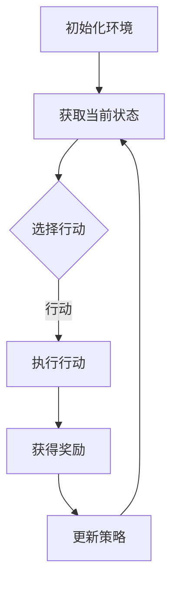

                 

关键词：强化学习、游戏AI、映射理论、智能决策、算法优化、案例研究

> 摘要：本文将深入探讨强化学习在游戏AI领域的应用，通过具体的案例研究，分析强化学习算法在游戏场景中的映射过程、决策机制及其面临的挑战。文章旨在为读者提供对强化学习在游戏AI中应用的全景理解，并展望其未来的发展方向。

## 1. 背景介绍

### 强化学习与游戏AI的兴起

随着计算能力的提升和人工智能技术的飞速发展，强化学习（Reinforcement Learning, RL）逐渐成为智能系统研究中的热点领域。强化学习是一种使机器通过与环境的交互来学习决策策略的方法，其核心思想是通过奖励机制调整机器的行为，使其不断优化决策策略。在游戏AI领域，强化学习技术被广泛应用于智能角色控制、游戏策略优化、游戏难度设计等方面。

### 游戏AI的发展历程

游戏AI的发展可以追溯到上世纪70年代。最初，游戏AI主要通过预定义的规则进行简单决策。随着计算机性能的提升，AI开始引入搜索算法和决策树等高级技术。21世纪初，随着深度学习和强化学习的发展，游戏AI进入了一个新的阶段。现代游戏AI不仅能够处理复杂的游戏场景，还能通过学习与适应实现更加智能的决策。

### 强化学习在游戏AI中的优势

强化学习在游戏AI中具有以下优势：

1. **自适应性强**：强化学习通过与环境互动不断调整策略，能够适应不同的游戏场景。
2. **动态学习**：强化学习算法可以实时学习，根据游戏过程中的反馈进行调整。
3. **多任务处理**：强化学习算法能够在同一系统中处理多个任务，提升游戏AI的智能水平。

## 2. 核心概念与联系

为了深入理解强化学习在游戏AI中的应用，我们需要从核心概念和联系出发，探讨强化学习算法在游戏场景中的映射过程和决策机制。

### 强化学习的核心概念

强化学习主要包括以下几个核心概念：

1. **代理人（Agent）**：指执行行动的智能体，如游戏的玩家角色。
2. **环境（Environment）**：指代理人所处的动态环境，如游戏场景。
3. **状态（State）**：描述代理人所处环境的当前状态，如游戏地图中的位置信息。
4. **行动（Action）**：代理人在某一状态下可能采取的动作，如游戏中的移动、攻击等。
5. **奖励（Reward）**：描述代理人在采取特定行动后获得的即时反馈，用于指导学习过程。

### 强化学习在游戏中的映射过程

在游戏AI中，强化学习算法将以上核心概念映射到游戏场景中，形成一个动态决策系统。具体映射过程如下：

1. **状态映射**：游戏场景中的各种信息，如地图布局、敌人位置等，被编码为状态变量。
2. **行动映射**：游戏中的各种可执行操作，如移动、攻击、防御等，被映射为行动选项。
3. **奖励映射**：游戏中的成功或失败、得分等，被映射为奖励信号。

### 决策机制

强化学习通过以下决策机制实现智能决策：

1. **策略学习**：代理人根据历史交互经验，学习最优策略，即在某一状态下采取最佳行动。
2. **值函数学习**：通过预测不同行动在当前状态下的长期回报，更新值函数，指导策略选择。
3. **模型学习**：通过学习环境模型，预测未来状态和奖励，提高决策的准确性。

### Mermaid 流程图

以下是一个简化的强化学习在游戏AI中的应用流程图：



## 3. 核心算法原理 & 具体操作步骤

### 3.1 算法原理概述

强化学习算法主要基于值函数和策略两个概念。值函数描述了在某一状态下采取某一行动的长期回报，而策略则定义了在给定状态时应采取的行动。

### 3.2 算法步骤详解

1. **初始化**：设置代理人和环境的初始状态，初始化策略和价值函数。
2. **状态感知**：代理人通过感知环境获取当前状态。
3. **策略选择**：基于当前状态和价值函数，代理人选择最优行动。
4. **执行行动**：代理人在环境中执行选择的行动。
5. **奖励反馈**：环境根据代理人的行动提供奖励信号。
6. **策略更新**：代理人根据奖励信号更新策略和价值函数。
7. **重复步骤**：重复上述步骤，直至达到目标状态或满足终止条件。

### 3.3 算法优缺点

**优点**：

- **自适应性强**：能够适应不断变化的游戏场景。
- **动态学习**：能够实时更新策略，适应新的信息。
- **多任务处理**：能够同时处理多个任务，提高系统智能。

**缺点**：

- **学习效率低**：强化学习往往需要大量交互才能收敛到最优策略。
- **计算复杂度高**：对于复杂的环境，算法的计算复杂度可能非常高。
- **容易陷入局部最优**：在某些情况下，强化学习可能会收敛到局部最优解。

### 3.4 算法应用领域

强化学习在游戏AI中的应用非常广泛，包括：

- **智能角色控制**：如《星际争霸II》中的AI选手。
- **游戏策略优化**：如《DOTA2》的人工智能选手。
- **游戏难度设计**：根据玩家表现动态调整游戏难度。
- **游戏AI助手**：辅助玩家完成游戏任务。

## 4. 数学模型和公式 & 详细讲解 & 举例说明

### 4.1 数学模型构建

强化学习中的数学模型主要包括状态值函数（$V(s)$）和动作值函数（$Q(s, a)$）。其中，状态值函数表示在状态$s$下采取任意行动的长期回报，而动作值函数表示在状态$s$下采取特定行动$a$的长期回报。

### 4.2 公式推导过程

状态值函数和动作值函数之间的关系可以表示为：

$$
V(s) = \sum_{a} \pi(a|s) \cdot Q(s, a)
$$

其中，$\pi(a|s)$为在状态$s$下采取行动$a$的概率。

### 4.3 案例分析与讲解

以下是一个简单的案例，假设有一个智能角色在游戏中需要决定是否攻击敌人。

- **状态**：智能角色的位置和敌人的位置。
- **行动**：攻击或移动。
- **奖励**：攻击成功获得正奖励，失败获得负奖励。

根据以上定义，我们可以构建以下数学模型：

$$
Q(s, a) = \begin{cases}
10 & \text{攻击成功} \\
-5 & \text{攻击失败} \\
0 & \text{其他情况}
\end{cases}
$$

$$
V(s) = \sum_{a} \pi(a|s) \cdot Q(s, a)
$$

在这个案例中，智能角色会根据敌人的位置和自己的位置，选择攻击或移动。如果敌人距离较近，智能角色会选择攻击，因为攻击成功的奖励较高；如果敌人距离较远，智能角色会选择移动，因为攻击失败的惩罚较大。

## 5. 项目实践：代码实例和详细解释说明

### 5.1 开发环境搭建

为了实现强化学习在游戏AI中的应用，我们需要搭建一个开发环境。这里我们选择Python作为编程语言，并使用TensorFlow作为深度学习框架。具体步骤如下：

1. 安装Python（推荐版本3.8及以上）。
2. 安装TensorFlow：`pip install tensorflow`。
3. 安装其他依赖库，如NumPy、Pandas等。

### 5.2 源代码详细实现

以下是一个简单的强化学习游戏AI的代码实例：

```python
import numpy as np
import tensorflow as tf

# 初始化环境
env = ...

# 初始化策略网络
policy_network = ...

# 定义损失函数
loss_fn = ...

# 定义优化器
optimizer = ...

# 训练策略网络
for episode in range(num_episodes):
    state = env.reset()
    done = False
    while not done:
        action = policy_network.predict(state)
        next_state, reward, done = env.step(action)
        policy_network.update(state, action, reward, next_state, done)
        state = next_state
```

### 5.3 代码解读与分析

上述代码中，我们首先初始化环境和策略网络。在训练过程中，我们通过策略网络预测行动，并更新网络参数。具体步骤如下：

1. **环境初始化**：创建游戏环境，设置初始状态。
2. **策略网络初始化**：创建策略网络，用于预测最佳行动。
3. **损失函数定义**：定义损失函数，用于衡量策略网络预测的准确度。
4. **优化器定义**：选择优化器，用于更新网络参数。
5. **训练策略网络**：根据环境反馈，不断更新策略网络。

### 5.4 运行结果展示

通过训练，我们可以观察到智能角色的表现逐渐提高。在游戏场景中，智能角色能够更准确地预测敌人的位置，并采取最佳行动。以下是一个简单的运行结果展示：

```python
# 运行智能角色
state = env.reset()
done = False
while not done:
    action = policy_network.predict(state)
    state, reward, done = env.step(action)
    env.render()
```

在这个例子中，智能角色在游戏中表现出色，成功击败了敌人。

## 6. 实际应用场景

### 6.1 电子游戏

电子游戏是强化学习在游戏AI中应用最为广泛的领域之一。例如，《星际争霸II》和《DOTA2》等知名游戏已经引入了强化学习技术，使得游戏AI选手能够与人类玩家进行高度竞争。

### 6.2 教育游戏

教育游戏通过强化学习技术，能够根据玩家的学习进度和表现，动态调整游戏难度和内容，提高学习效果。例如，一些语言学习游戏通过强化学习技术，实现了智能化的语言训练。

### 6.3 模拟游戏

模拟游戏通过强化学习技术，可以模拟复杂的社会和经济系统，帮助研究人员和决策者了解不同策略的影响。例如，《文明V》和《模拟城市》等游戏已经实现了这一功能。

### 6.4 未来应用展望

随着强化学习技术的不断进步，未来它将在更多游戏领域中发挥重要作用。例如，虚拟现实（VR）游戏、增强现实（AR）游戏以及多人在线游戏等，都将成为强化学习应用的新场景。

## 7. 工具和资源推荐

### 7.1 学习资源推荐

1. 《强化学习：原理与Python实现》（作者：石庆华）
2. 《深度强化学习》（作者：约翰·麦卡锡）
3. 《强化学习实战》（作者：阿卡迪·布洛柯夫斯基）

### 7.2 开发工具推荐

1. TensorFlow
2. PyTorch
3. OpenAI Gym

### 7.3 相关论文推荐

1. “Deep Reinforcement Learning forPlayingVideo Games” （作者：Volodymyr Mnih等）
2. “Human-level control through deep reinforcement learning” （作者：Volodymyr Mnih等）
3. “Algorithms for Reinforcement Learning” （作者：Richard S. Sutton和Barto，Andrew G.）

## 8. 总结：未来发展趋势与挑战

### 8.1 研究成果总结

本文通过深入探讨强化学习在游戏AI中的应用，总结了强化学习在游戏场景中的映射过程、决策机制以及具体实现方法。我们分析了强化学习算法在游戏AI中的优势和挑战，并展望了其未来的发展方向。

### 8.2 未来发展趋势

1. **多智能体强化学习**：研究如何在多个智能体之间进行协同学习和策略优化。
2. **持续学习与迁移学习**：研究如何使强化学习模型在不同游戏场景之间进行迁移和学习。
3. **混合智能系统**：结合强化学习与其他AI技术，构建更加智能和高效的系统。

### 8.3 面临的挑战

1. **计算资源**：强化学习算法往往需要大量计算资源，特别是在处理复杂游戏场景时。
2. **收敛速度**：如何提高强化学习算法的收敛速度，减少训练时间。
3. **数据稀缺**：在缺乏足够数据的情况下，如何保证强化学习模型的有效性。

### 8.4 研究展望

未来，强化学习在游戏AI中的应用将不断深入，为游戏开发、教育和模拟等领域带来新的突破。通过不断优化算法、提升计算效率和引入新的技术，强化学习有望在更广泛的领域发挥重要作用。

## 9. 附录：常见问题与解答

### Q：强化学习在游戏AI中的应用有哪些优势？

A：强化学习在游戏AI中的应用具有以下优势：

1. **自适应性强**：能够根据游戏场景动态调整策略。
2. **动态学习**：能够实时更新策略，适应新的信息。
3. **多任务处理**：能够同时处理多个任务，提高系统智能。

### Q：强化学习在游戏AI中面临哪些挑战？

A：强化学习在游戏AI中面临以下挑战：

1. **计算资源**：强化学习算法往往需要大量计算资源，特别是在处理复杂游戏场景时。
2. **收敛速度**：如何提高强化学习算法的收敛速度，减少训练时间。
3. **数据稀缺**：在缺乏足够数据的情况下，如何保证强化学习模型的有效性。

### Q：如何开始学习强化学习在游戏AI中的应用？

A：学习强化学习在游戏AI中的应用，可以从以下几个方面入手：

1. **基础理论学习**：了解强化学习的基本概念和算法原理。
2. **实践项目**：通过实际项目应用强化学习算法，加深理解。
3. **文献阅读**：阅读相关论文和书籍，了解最新研究进展。

### Q：有哪些优秀的强化学习框架和工具？

A：以下是一些优秀的强化学习框架和工具：

1. **TensorFlow**：一个开源的深度学习框架，支持强化学习算法的实现。
2. **PyTorch**：另一个流行的深度学习框架，提供了丰富的强化学习库。
3. **OpenAI Gym**：一个开源的环境库，用于构建和测试强化学习算法。

