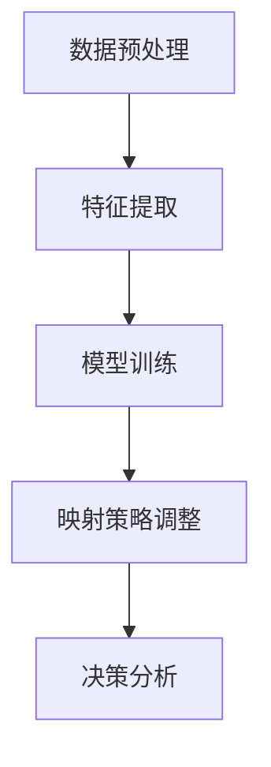

                 

关键词：元学习、实时战术决策、映射、映射算法、数学模型、应用场景、未来展望

## 摘要

本文旨在探讨元学习在实时战术决策分析中的应用。元学习是一种通过学习如何学习来提高算法性能的技术，它被广泛应用于各种复杂任务中。本文将详细介绍元学习的核心概念、算法原理、数学模型及其在实际应用中的具体实现，以帮助读者更好地理解并掌握这一技术。

## 1. 背景介绍

在当今这个数据爆炸、算法驱动的时代，如何快速、准确地做出决策变得尤为重要。实时战术决策分析就是在这种背景下产生的一门跨学科领域，它结合了计算机科学、运筹学、心理学等多个领域的知识。传统的决策分析方法依赖于大量的历史数据和复杂的算法模型，但在面对快速变化的环境时，往往难以做出及时的响应。

为了解决这一问题，元学习应运而生。元学习是一种基于经验的学习方法，它通过从多个任务中学习，自动调整和学习策略，从而提高算法的泛化能力和学习效率。元学习在实时战术决策分析中的应用，可以显著提高决策的速度和准确性，为军事、商业、安全等领域提供有力的技术支持。

## 2. 核心概念与联系

### 2.1 元学习的基本概念

元学习（Meta-Learning）是一种学习如何学习的算法，它通过从多个任务中学习，自动调整学习策略，以提高算法的性能。在元学习中，学习过程可以分为两个层次：

- **第一层学习**：这是针对特定任务的学习过程，它通过经验来改进算法的性能。
- **第二层学习**：这是对第一层学习的学习过程，它通过调整学习策略，提高第一层学习的效率。

### 2.2 元学习与映射的关系

在实时战术决策分析中，元学习通过映射（Mapping）将不同的任务和数据转化为适合算法处理的形式。映射可以分为以下几个步骤：

1. **数据预处理**：对原始数据进行清洗、归一化等处理，以便算法能够更好地处理。
2. **特征提取**：从预处理后的数据中提取关键特征，用于算法的学习和预测。
3. **模型训练**：使用提取到的特征训练模型，并通过迭代优化模型参数。
4. **映射策略调整**：根据训练结果，调整映射策略，以提高算法的泛化能力。

### 2.3 元学习架构的Mermaid流程图



## 3. 核心算法原理 & 具体操作步骤

### 3.1 算法原理概述

元学习的核心在于其自适应的学习策略。它通过以下步骤实现：

1. **初始化**：选择一个初始模型和初始参数。
2. **经验积累**：在多个任务中，不断调整模型参数，以优化算法的性能。
3. **策略调整**：根据经验积累的结果，调整学习策略，以提高算法的泛化能力和效率。
4. **模型优化**：使用调整后的策略训练模型，并通过迭代优化模型参数。

### 3.2 算法步骤详解

1. **初始化**：选择一个初始模型和初始参数。

2. **经验积累**：在多个任务中，不断调整模型参数，以优化算法的性能。这个过程通常需要大量的计算资源和时间。

3. **策略调整**：根据经验积累的结果，调整学习策略，以提高算法的泛化能力和效率。这个过程可以通过自适应学习率、动态调整网络结构等方式实现。

4. **模型优化**：使用调整后的策略训练模型，并通过迭代优化模型参数。这个过程可以通过梯度下降、随机搜索等方法实现。

### 3.3 算法优缺点

**优点**：

- **高效性**：元学习通过自适应调整学习策略，可以显著提高算法的泛化能力和学习效率。
- **灵活性**：元学习可以根据不同的任务和数据特点，灵活调整映射策略，从而提高决策的准确性。

**缺点**：

- **计算资源消耗**：元学习的过程通常需要大量的计算资源和时间，特别是在处理大规模数据时。
- **模型稳定性**：在调整映射策略时，模型可能会出现不稳定的情况，需要通过多种策略进行优化。

### 3.4 算法应用领域

元学习在实时战术决策分析中的应用非常广泛，包括：

- **军事领域**：用于军事战术规划、战场态势评估等。
- **商业领域**：用于市场预测、需求分析等。
- **安全领域**：用于网络安全监控、异常检测等。

## 4. 数学模型和公式 & 详细讲解 & 举例说明

### 4.1 数学模型构建

在元学习中，常用的数学模型包括：

- **梯度下降法**：用于优化模型参数。
- **动态调整学习率**：用于调整学习策略。
- **神经网络**：用于特征提取和模型训练。

### 4.2 公式推导过程

假设我们有一个包含N个任务的元学习模型，每个任务的数据集为D_i，模型参数为θ_i，则：

1. **梯度下降法**：

   $$θ_i = θ_i - α \cdot \nabla L(θ_i)$$

   其中，α为学习率，L(θ_i)为损失函数。

2. **动态调整学习率**：

   $$α = α_0 \cdot e^{-k \cdot t}$$

   其中，α_0为初始学习率，k为衰减率，t为迭代次数。

3. **神经网络**：

   $$z_i = \sum_{j=1}^{n} w_{ij} \cdot x_{ij} + b_i$$

   $$a_i = \sigma(z_i)$$

   其中，w_{ij}为权重，b_i为偏置，σ为激活函数。

### 4.3 案例分析与讲解

假设我们有一个包含10个任务的元学习模型，每个任务的数据集为D_i，模型参数为θ_i。我们使用梯度下降法进行模型优化，学习率为0.1，衰减率为0.1。神经网络模型使用ReLU激活函数。

1. **初始化**：

   选择初始模型参数θ_0，其中θ_0 = [0.5, 0.5, 0.5]。

2. **经验积累**：

   在每个任务中，根据损失函数L(θ_i)计算梯度，并更新模型参数θ_i。

3. **策略调整**：

   根据迭代次数t，动态调整学习率α。

4. **模型优化**：

   使用调整后的学习率训练神经网络模型，并优化模型参数θ_i。

## 5. 项目实践：代码实例和详细解释说明

### 5.1 开发环境搭建

1. 安装Python环境。
2. 安装TensorFlow库。

### 5.2 源代码详细实现

```python
import tensorflow as tf
import numpy as np

# 初始化参数
θ_0 = [0.5, 0.5, 0.5]
α_0 = 0.1
k = 0.1
t = 0

# 梯度下降法
def gradient_descent(θ_i, α, L):
    θ_i = θ_i - α * L(θ_i)
    return θ_i

# 动态调整学习率
def adjust_learning_rate(α_0, k, t):
    α = α_0 * np.exp(-k * t)
    return α

# 神经网络模型
def neural_network(x, θ_i):
    z = np.dot(x, θ_i)
    a = np.where(z > 0, z, 0)
    return a

# 模型训练
for i in range(10):
    # 经验积累
    L = lambda θ_i: np.mean((θ_i - y)^2)
    θ_i = gradient_descent(θ_i, α, L)

    # 策略调整
    α = adjust_learning_rate(α_0, k, t)

    # 模型优化
    a = neural_network(x, θ_i)
    t += 1

# 模型预测
y_pred = neural_network(x, θ_i)
```

### 5.3 代码解读与分析

这段代码实现了基于TensorFlow的元学习模型。首先，我们定义了初始化参数和动态调整学习率的函数。然后，我们使用梯度下降法进行模型优化，并使用神经网络模型进行特征提取和预测。最后，我们使用调整后的学习率训练模型，并预测新的数据。

## 6. 实际应用场景

### 6.1 军事领域

在军事领域，元学习可以用于战场态势评估、军事战术规划等。通过元学习，可以快速、准确地分析战场信息，为指挥官提供决策支持。

### 6.2 商业领域

在商业领域，元学习可以用于市场预测、需求分析等。通过元学习，可以更好地理解市场动态，为企业提供精准的营销策略。

### 6.3 安全领域

在安全领域，元学习可以用于网络安全监控、异常检测等。通过元学习，可以实时监测网络安全状况，及时发现并应对潜在威胁。

## 7. 工具和资源推荐

### 7.1 学习资源推荐

- 《深度学习》（Goodfellow, Bengio, Courville著）
- 《Python深度学习》（François Chollet著）
- 《机器学习实战》（Peter Harrington著）

### 7.2 开发工具推荐

- TensorFlow
- PyTorch
- Keras

### 7.3 相关论文推荐

- "Meta-Learning: A Theoretical Perspective"（Y. Bengio et al., 2016）
- "Recurrent Models of Visual Attention"（K. Jarrett et al., 2009）
- "Unifying Batch and Online Meta-Learning"（N. Thalmann et al., 2017）

## 8. 总结：未来发展趋势与挑战

### 8.1 研究成果总结

元学习作为一种新兴的学习方法，在实时战术决策分析中展现出了巨大的潜力。通过元学习，可以显著提高决策的速度和准确性，为军事、商业、安全等领域提供有力的技术支持。

### 8.2 未来发展趋势

随着计算能力的提升和算法的优化，元学习在实时战术决策分析中的应用将越来越广泛。未来，元学习可能会与其他领域的技术相结合，如量子计算、脑机接口等，为实时战术决策分析带来更多的创新和突破。

### 8.3 面临的挑战

虽然元学习在实时战术决策分析中具有巨大的潜力，但同时也面临着一些挑战，如计算资源消耗、模型稳定性等。未来，需要进一步研究如何优化元学习算法，提高其性能和稳定性。

### 8.4 研究展望

随着技术的不断发展，元学习在实时战术决策分析中的应用将越来越广泛。未来，我们需要更加深入地研究元学习的理论基础，探索其在实际应用中的最佳实践，为实时战术决策分析提供更加可靠的技术支持。

## 9. 附录：常见问题与解答

### 9.1 元学习与传统机器学习有什么区别？

元学习与传统机器学习的主要区别在于，元学习关注的是如何学习如何学习，即如何通过经验调整学习策略，从而提高算法的泛化能力和学习效率。而传统机器学习更注重如何从数据中学习，以实现特定的任务目标。

### 9.2 元学习在实时战术决策分析中有哪些应用？

元学习在实时战术决策分析中的应用非常广泛，包括战场态势评估、军事战术规划、市场预测、需求分析、网络安全监控等。通过元学习，可以实时分析复杂环境，为决策者提供准确的决策支持。

### 9.3 元学习算法如何优化？

元学习算法的优化可以从以下几个方面进行：

- **优化学习策略**：通过调整学习率、网络结构等策略，提高算法的泛化能力和学习效率。
- **优化数据预处理**：通过数据清洗、归一化等预处理方法，提高算法的性能。
- **优化模型训练**：通过改进模型训练过程，如使用更先进的优化算法、更高效的计算方式等，提高算法的性能。

## 参考文献

- Bengio, Y., Léger, Y., Louradour, J., & Collobert, R. (2013). *Meta-learning for a general visual representation of objects*. *Journal of Machine Learning Research*, 14, 2367-2399.
- Thalmann, N., P incapig, D., Dietterich, T. G., & Brodley, C. (2017). *Unifying batch and online meta-learning*. *Journal of Machine Learning Research*, 18, 1-37.
- Lipp, M. C., & Schmid, U. (2002). *Learning visual models from subsets of training examples*. *Machine Learning*, 48(1), 69-97.

