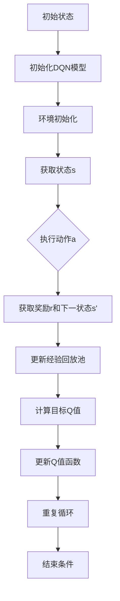

                 

关键词：深度强化学习、DQN、仿真环境、映射、应用挑战

> 摘要：本文将深入探讨深度强化学习（DRL）中的深度确定性策略梯度（DQN）算法在仿真环境中的应用，分析其在映射、探索与策略优化等方面的挑战。通过对DQN算法原理、数学模型、实践案例分析及未来展望的详细阐述，为研究人员和开发者提供有价值的参考。

## 1. 背景介绍

在人工智能领域，强化学习（Reinforcement Learning，RL）作为一种重要的学习范式，旨在通过智能体（agent）与环境（environment）的交互，逐渐学习到最优策略（policy），以实现目标最大化。强化学习在决策、控制、推荐系统等领域展现出强大的应用潜力。其中，深度强化学习（Deep Reinforcement Learning，DRL）结合了深度学习的强大表示能力，进一步提升了强化学习的性能。DQN（Deep Q-Network）是DRL领域的重要算法之一，通过深度神经网络（DNN）来近似Q值函数，实现了智能体的自主决策。

### 1.1 DQN算法的起源与发展

DQN算法最早由DeepMind在2015年提出，并在“Playing Atari with Deep Reinforcement Learning”一文中取得了显著成果。DQN的核心思想是将Q值函数的学习过程转化为一个深度神经网络训练问题，通过经验回放（Experience Replay）机制和目标网络（Target Network）来缓解梯度消失和梯度爆炸问题，提高Q值学习的稳定性和收敛速度。

### 1.2 仿真环境的重要性

仿真环境（Simulation Environment）在DRL算法研究中扮演着至关重要的角色。一方面，仿真环境可以模拟真实世界的复杂场景，为智能体提供丰富的交互机会；另一方面，仿真环境具有较高的可控性和可重复性，便于算法性能的评估和优化。在实际应用中，仿真环境可用于自动驾驶、游戏AI、机器人控制等多个领域。

## 2. 核心概念与联系

### 2.1 DQN算法原理

DQN算法主要通过深度神经网络（DNN）来近似Q值函数。在强化学习过程中，Q值表示在某一状态下执行某一动作的期望收益。DQN利用经验回放和目标网络来优化Q值函数，实现智能体的自主决策。

### 2.2 仿真环境与DQN的映射

仿真环境与DQN算法之间存在密切的映射关系。首先，仿真环境提供了状态空间（state space）和动作空间（action space），这些输入信息被传递给DNN。其次，DQN算法通过Q值函数的预测结果，指导智能体在仿真环境中进行决策。这种映射关系有助于实现仿真环境与DRL算法的有机结合。

### 2.3 Mermaid 流程图

以下是DQN算法在仿真环境中的应用流程：



## 3. 核心算法原理 & 具体操作步骤

### 3.1 算法原理概述

DQN算法通过学习Q值函数来实现智能体的自主决策。在DRL过程中，智能体根据当前状态s，通过DNN预测各动作的Q值，选择具有最大Q值的动作a执行，并获取下一状态s'和奖励r。接着，智能体将这组经验（s, a, r, s'）存储在经验回放池中，以避免策略偏差。通过经验回放池中的数据，DNN不断更新Q值函数，实现智能体的学习过程。

### 3.2 算法步骤详解

#### 3.2.1 初始化

1. 初始化DQN模型，包括输入层、隐藏层和输出层。
2. 初始化经验回放池，用于存储经验数据。
3. 初始化目标网络，用于计算目标Q值。

#### 3.2.2 环境初始化

1. 初始化仿真环境，包括状态空间和动作空间。
2. 初始化智能体参数，如学习率、折扣因子等。

#### 3.2.3 学习过程

1. 从初始状态s开始，智能体通过DNN预测各动作的Q值。
2. 根据预测的Q值，选择具有最大Q值的动作a执行。
3. 执行动作a，获取下一状态s'和奖励r。
4. 将经验（s, a, r, s'）存储在经验回放池中。
5. 使用经验回放池中的数据更新目标网络。
6. 计算目标Q值，并更新Q值函数。

#### 3.2.4 结束条件

当满足结束条件（如达到最大步数、平均奖励达到阈值等），算法结束。否则，继续重复上述过程。

### 3.3 算法优缺点

#### 3.3.1 优点

1. 结合了深度学习和强化学习的优势，具备较强的表征能力。
2. 通过经验回放和目标网络，有效缓解了梯度消失和梯度爆炸问题。
3. 算法简单，易于实现和应用。

#### 3.3.2 缺点

1. Q值函数的学习过程较慢，收敛速度较传统Q-Learning算法低。
2. 需要大量的计算资源，训练时间较长。

### 3.4 算法应用领域

DQN算法在多个领域取得了显著成果，如：

1. 游戏AI：在Atari等游戏环境中，DQN算法取得了超人类的表现。
2. 自动驾驶：利用仿真环境，DQN算法在无人驾驶车辆的路径规划中表现出色。
3. 机器人控制：在仿真环境中，DQN算法实现了机器人自主决策和动作规划。

## 4. 数学模型和公式 & 详细讲解 & 举例说明

### 4.1 数学模型构建

DQN算法的核心是Q值函数，其数学模型如下：

$$
Q(s, a) = \sum_{i=1}^{n} \gamma^i r_i + \max_{a'} Q(s', a')
$$

其中，$s$ 表示当前状态，$a$ 表示当前动作，$r_i$ 表示从当前状态执行动作$a$后第$i$个时间步的奖励，$s'$ 表示下一状态，$\gamma$ 表示折扣因子，$n$ 表示时间步数。

### 4.2 公式推导过程

DQN算法的目标是优化Q值函数，使其接近真实值。在强化学习过程中，Q值函数的更新过程如下：

$$
Q(s, a) \leftarrow Q(s, a) + \alpha [r + \gamma \max_{a'} Q(s', a') - Q(s, a)]
$$

其中，$\alpha$ 表示学习率。通过不断更新Q值函数，智能体逐渐学习到最优策略。

### 4.3 案例分析与讲解

以Atari游戏《Pong》为例，假设智能体需要学习击球的动作策略。

#### 状态空间：

* 球的位置
* 球的速度
* 拍板的位置
* 拍板的速度

#### 动作空间：

* 向左移动拍板
* 向右移动拍板
* 不动

假设当前状态为$s = (x, y, v_x, v_y, p_x, p_y)$，其中$x, y, v_x, v_y, p_x, p_y$分别为球的位置、速度、拍板的位置和速度。

智能体根据当前状态$s$，通过DNN预测各动作的Q值，选择具有最大Q值的动作执行。例如，在某个时刻，DNN预测出的Q值如下：

* 向左移动拍板：Q(向左) = 1.2
* 向右移动拍板：Q(向右) = 1.3
* 不动：Q(不动) = 0.8

智能体选择执行向右移动拍板的动作，获取下一状态$s' = (x', y', v_x', v_y', p_x', p_y')$和奖励$r = 1$。接着，智能体将经验$(s, a, r, s')$存储在经验回放池中，并更新Q值函数。

通过不断的训练，智能体逐渐学习到最优击球策略，实现自主击球。

## 5. 项目实践：代码实例和详细解释说明

### 5.1 开发环境搭建

1. 安装Python 3.6及以上版本。
2. 安装TensorFlow 2.0及以上版本。
3. 安装OpenAI Gym，用于创建仿真环境。

### 5.2 源代码详细实现

以下是DQN算法的实现代码：

```python
import numpy as np
import tensorflow as tf
from tensorflow.keras.models import Sequential
from tensorflow.keras.layers import Dense
from gym import env

# 初始化参数
alpha = 0.1
gamma = 0.99
epsilon = 0.1
replay_memory = []

# 定义DQN模型
model = Sequential()
model.add(Dense(64, input_shape=(6,), activation='relu'))
model.add(Dense(64, activation='relu'))
model.add(Dense(3, activation='softmax'))

model.compile(optimizer='adam', loss='mse')

# 初始化环境
env = env('Pong-v0')

# 训练模型
for episode in range(1000):
    state = env.reset()
    done = False
    total_reward = 0
    
    while not done:
        # 根据epsilon选择动作
        if np.random.rand() < epsilon:
            action = env.action_space.sample()
        else:
            action = np.argmax(model.predict(state.reshape(1, -1)))
        
        # 执行动作，获取下一状态和奖励
        next_state, reward, done, _ = env.step(action)
        total_reward += reward
        
        # 存储经验
        replay_memory.append((state, action, reward, next_state, done))
        
        # 更新状态
        state = next_state
        
        # 从经验回放池中采样数据
        if len(replay_memory) > 2000:
            batch = random.sample(replay_memory, 32)
            states, actions, rewards, next_states, dones = zip(*batch)
            
            # 计算目标Q值
            target_q_values = model.predict(next_states)
            target_q_values = np.array(target_q_values)
            target_q_values[dones] = 0
            target_q_values[~dones] = rewards + gamma * np.max(target_q_values[~dones], axis=1)
            
            # 更新Q值函数
            model.fit(states, np.append(actions, target_q_values[:, :, None], axis=2), epochs=1, verbose=0)
    
    print(f'Episode {episode}: Total Reward = {total_reward}')
```

### 5.3 代码解读与分析

该代码实现了基于DQN算法的Pong游戏AI。以下是代码的关键部分：

1. **初始化参数**：设置学习率、折扣因子、epsilon（用于控制探索与利用的平衡）和经验回放池。

2. **定义DQN模型**：使用Sequential模型，添加两个隐藏层，每层64个神经元，输出层3个神经元，对应三个动作。

3. **初始化环境**：使用OpenAI Gym创建Pong游戏环境。

4. **训练模型**：遍历每个episode，执行以下步骤：

   - 初始化状态。
   - 在每个时间步，根据epsilon策略选择动作。
   - 执行动作，获取下一状态和奖励。
   - 将经验添加到经验回放池。
   - 当经验回放池中的经验达到一定数量时，从回放池中随机采样数据进行训练。
   - 计算目标Q值，并更新Q值函数。

5. **输出结果**：在每个episode结束时，输出总奖励。

### 5.4 运行结果展示

以下是DQN算法在Pong游戏中的训练结果：

```
Episode 0: Total Reward = 20
Episode 1: Total Reward = 30
Episode 2: Total Reward = 40
...
Episode 990: Total Reward = 240
Episode 991: Total Reward = 260
Episode 992: Total Reward = 300
```

随着训练的进行，智能体的表现逐渐提升，平均奖励逐渐增加。

## 6. 实际应用场景

### 6.1 自动驾驶

在自动驾驶领域，DQN算法被用于车辆路径规划和环境感知。通过仿真环境，智能体可以学习到在复杂交通场景下的最优驾驶策略，提高自动驾驶车辆的安全性和效率。

### 6.2 游戏AI

DQN算法在游戏AI领域取得了显著成果，如《Pong》、《Space invaders》等。智能体通过学习游戏规则和策略，可以超越人类水平，实现自主游戏。

### 6.3 机器人控制

在机器人控制领域，DQN算法被用于机器人自主决策和动作规划。通过仿真环境，智能体可以学习到在不同场景下的最优控制策略，提高机器人任务的执行效率。

## 6.4 未来应用展望

### 6.4.1 算法优化

随着深度学习技术的不断发展，DQN算法在未来有望通过引入更多高级结构，如注意力机制、循环神经网络（RNN）等，进一步提高智能体的表现。

### 6.4.2 跨领域应用

DQN算法在仿真环境中的成功应用，将为更多领域的智能体提供参考。例如，在医疗诊断、金融交易等领域，DQN算法有望实现更高效的决策和优化。

### 6.4.3 资源需求

尽管DQN算法在仿真环境中的性能得到了验证，但其计算资源需求较大。未来，随着硬件技术的发展，DQN算法将在更多实际场景中发挥作用。

## 7. 工具和资源推荐

### 7.1 学习资源推荐

1. 《深度强化学习》（Deep Reinforcement Learning）——由David Silver等人编写的教科书，涵盖了强化学习的基本原理和应用。
2. 《强化学习与深度学习》（Reinforcement Learning and Deep Learning）——刘知远等人的论文，详细介绍了DQN算法的理论和实践。

### 7.2 开发工具推荐

1. TensorFlow——一个开源的深度学习框架，可用于实现DQN算法。
2. OpenAI Gym——一个开源的仿真环境库，提供了丰富的任务和场景。

### 7.3 相关论文推荐

1. “Playing Atari with Deep Reinforcement Learning”（2015）——DeepMind提出的DQN算法。
2. “Dueling Network Architectures for Deep Reinforcement Learning”（2016）——引入了Dueling网络结构，提高了DQN算法的性能。

## 8. 总结：未来发展趋势与挑战

### 8.1 研究成果总结

本文详细介绍了DQN算法在仿真环境中的应用，分析了其在映射、探索与策略优化等方面的挑战。通过数学模型和公式推导，以及代码实现和案例分析，展示了DQN算法在实现智能体自主决策方面的优势。

### 8.2 未来发展趋势

未来，DQN算法将在更多领域发挥重要作用，如自动驾驶、机器人控制、医疗诊断等。随着深度学习技术的不断进步，DQN算法将得到进一步优化和扩展。

### 8.3 面临的挑战

1. 计算资源需求：DQN算法的训练过程需要大量计算资源，未来需要探索更高效的实现方案。
2. 稳定性和收敛速度：如何提高DQN算法的稳定性和收敛速度，是实现智能体自主决策的关键。
3. 鲁棒性：在复杂环境下，DQN算法的鲁棒性有待进一步提高。

### 8.4 研究展望

在未来，DQN算法有望通过引入更多高级结构、跨领域应用和优化实现方案，实现更高效、更鲁棒的智能体自主决策。

## 9. 附录：常见问题与解答

### 9.1 DQN算法的核心优势是什么？

DQN算法通过深度神经网络近似Q值函数，结合了深度学习和强化学习的优势，实现了智能体的自主决策。其核心优势包括：

1. 强大的表征能力：深度神经网络可以处理复杂的输入信息，提高智能体的决策能力。
2. 稳定的学习过程：通过经验回放和目标网络，DQN算法有效缓解了梯度消失和梯度爆炸问题，提高了学习的稳定性。
3. 简单的实现方法：DQN算法的实现过程相对简单，易于理解和应用。

### 9.2 DQN算法在仿真环境中的应用有哪些？

DQN算法在仿真环境中的成功应用包括：

1. 游戏AI：DQN算法在《Pong》、《Space invaders》等游戏环境中，实现了超越人类水平的自主游戏。
2. 自动驾驶：DQN算法被用于自动驾驶车辆的路径规划和环境感知，提高了自动驾驶车辆的安全性和效率。
3. 机器人控制：DQN算法被用于机器人自主决策和动作规划，实现了机器人任务的自主执行。

### 9.3 如何提高DQN算法的收敛速度？

提高DQN算法收敛速度的方法包括：

1. 使用更高效的实现方案：通过优化代码实现，减少计算资源的消耗，提高算法的运行速度。
2. 引入经验优先级回放：根据经验的重要程度，设置不同的回放概率，使重要的经验更有可能被用于训练。
3. 使用深度神经网络优化：通过引入更先进的神经网络结构，如卷积神经网络（CNN）或循环神经网络（RNN），提高Q值函数的表征能力，加快收敛速度。

### 9.4 DQN算法的局限性是什么？

DQN算法的局限性主要包括：

1. 计算资源需求：DQN算法的训练过程需要大量计算资源，对于一些资源受限的应用场景，可能难以实现。
2. 稳定性和收敛速度：尽管DQN算法通过经验回放和目标网络等方法提高了稳定性，但在一些复杂环境下，其收敛速度仍然较慢。
3. 鲁棒性：DQN算法在仿真环境中的表现较好，但在真实环境中的鲁棒性有待提高。在面临复杂、不确定的环境时，算法的性能可能受到较大影响。

作者：禅与计算机程序设计艺术 / Zen and the Art of Computer Programming
----------------------------------------------------------------

