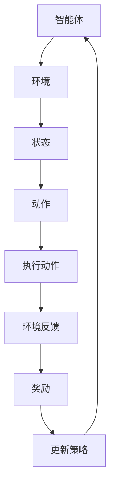
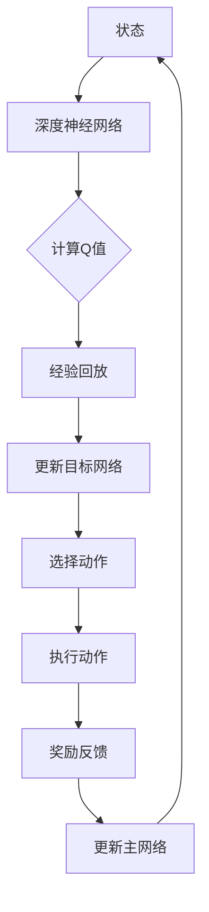

                 

关键词：深度强化学习、DQN、泛化能力、迁移学习、人工智能、神经网络、智能控制

## 摘要

本文深入探讨了深度强化学习（DRL）中的DQN算法的泛化能力与迁移学习应用。在介绍DQN算法的基本原理和实现步骤后，本文通过数学模型和具体案例分析，详细解析了DQN在智能控制领域的应用及其面临的挑战。同时，本文还总结了DQN在迁移学习中的表现，并展望了其未来的发展趋势。

## 1. 背景介绍

随着人工智能技术的快速发展，深度强化学习（DRL）已经成为一种重要的学习范式。DRL通过模拟人类行为，使智能体在复杂环境中进行自主学习和决策，从而实现智能控制、游戏AI、机器人导航等多个领域的应用。DQN（Deep Q-Network）是DRL中一种典型的算法，通过神经网络来近似Q值函数，实现了在连续动作空间中的智能决策。

### 1.1 DQN算法的起源与发展

DQN最早由DeepMind团队在2015年提出，通过在 Atari 游戏中实现了超越人类的表现，引起了广泛关注。DQN的基本思想是利用深度神经网络来近似Q值函数，从而在给定的状态下预测最优动作。与传统Q-Learning相比，DQN通过引入神经网络，使得Q值函数的学习更加稳定和高效。

### 1.2 DQN在智能控制中的应用

智能控制是DQN的一个重要应用领域。通过在机器人、无人机、自动驾驶车辆等场景中应用DQN算法，可以实现自主导航、路径规划、任务执行等功能。此外，DQN还在金融交易、供应链管理等领域展示了其强大的应用潜力。

## 2. 核心概念与联系

为了深入理解DQN算法，我们首先需要了解以下几个核心概念：状态（State）、动作（Action）、奖励（Reward）和策略（Policy）。

### 2.1 状态、动作、奖励和策略

- **状态（State）**：状态是描述环境当前状况的信息集合，通常用一个向量表示。
- **动作（Action）**：动作是智能体可以执行的操作，也用一个向量表示。
- **奖励（Reward）**：奖励是智能体执行动作后从环境中获得的即时反馈，用来指导智能体的学习过程。
- **策略（Policy）**：策略是智能体在给定状态下选择动作的规则，可以用一个函数表示。

### 2.2 Mermaid 流程图

以下是一个简单的Mermaid流程图，展示了状态、动作、奖励和策略之间的关系：



### 2.3 DQN算法原理

DQN算法的核心思想是通过深度神经网络来近似Q值函数，从而在给定状态下预测最优动作。Q值函数是强化学习中的一个重要概念，它表示在给定状态下执行某个动作的预期奖励。

### 2.4 DQN算法的架构

DQN算法的架构主要包括以下几个部分：

- **深度神经网络（DNN）**：用于近似Q值函数，输入为状态，输出为动作的Q值。
- **经验回放（Experience Replay）**：用于存储智能体在过去执行动作时的状态、动作和奖励，从而避免学习过程中的样本偏差。
- **目标网络（Target Network）**：用于稳定Q值函数的学习过程，通过定期更新与主网络保持一定的差距。

以下是一个简单的Mermaid流程图，展示了DQN算法的架构：



## 3. 核心算法原理 & 具体操作步骤

### 3.1 算法原理概述

DQN算法的核心思想是通过深度神经网络来近似Q值函数，从而在给定状态下预测最优动作。Q值函数是强化学习中的一个重要概念，它表示在给定状态下执行某个动作的预期奖励。

### 3.2 算法步骤详解

DQN算法的具体操作步骤如下：

1. **初始化网络**：初始化深度神经网络（DNN）和目标网络（Target Network）。
2. **收集经验**：智能体在环境中执行动作，记录状态、动作和奖励。
3. **经验回放**：将收集到的经验数据存入经验回放池，并进行随机抽样。
4. **更新目标网络**：定期更新目标网络与主网络的参数，以保持一定的差距。
5. **选择动作**：使用深度神经网络计算当前状态的Q值，并选择动作。
6. **执行动作**：在环境中执行选择到的动作。
7. **奖励反馈**：根据执行动作后的环境反馈，更新深度神经网络的参数。

### 3.3 算法优缺点

**优点**：

- **强大的泛化能力**：通过深度神经网络，DQN可以在复杂的连续动作空间中实现有效的学习。
- **鲁棒性强**：经验回放机制和目标网络设计，使得DQN在处理非平稳环境时具有较强的鲁棒性。

**缺点**：

- **学习过程较慢**：由于深度神经网络的训练过程较为复杂，DQN的学习速度相对较慢。
- **收敛性不稳定**：在某些情况下，DQN的收敛性可能不稳定，需要通过调整学习率和探索策略来优化。

### 3.4 算法应用领域

DQN算法在以下领域具有广泛的应用：

- **智能控制**：如机器人、无人机、自动驾驶车辆等。
- **游戏AI**：如Atari游戏、电子竞技等。
- **金融交易**：如股票交易、期权定价等。
- **供应链管理**：如库存控制、物流优化等。

## 4. 数学模型和公式 & 详细讲解 & 举例说明

### 4.1 数学模型构建

DQN算法的核心是Q值函数的近似。Q值函数是一个从状态-动作对到实数的映射，表示在给定状态下执行某个动作的预期奖励。

### 4.2 公式推导过程

设状态集合为$S$，动作集合为$A$，Q值函数为$Q(s,a)$。DQN算法的目标是近似Q值函数，即找到一个函数$Q_\theta(s,a)$，使得：

$$
Q(s,a) \approx Q_\theta(s,a)
$$

其中，$\theta$为深度神经网络的参数。

### 4.3 案例分析与讲解

以Atari游戏为例，我们考虑一个简单的状态空间和动作空间：

- **状态空间**：包含游戏屏幕上每个像素的灰度值。
- **动作空间**：包括四个基本动作：上、下、左、右。

假设我们使用一个简单的深度神经网络来近似Q值函数，网络结构如下：

$$
Q_\theta(s,a) = \sigma(W_1 \cdot \text{ReLU}(W_2 \cdot s + b_2) + b_1)
$$

其中，$W_1$和$W_2$分别为输入层和隐藏层的权重，$b_1$和$b_2$分别为输入层和隐藏层的偏置，$\sigma$为激活函数。

在训练过程中，我们通过以下步骤更新网络参数：

1. 随机抽取一个状态-动作对$(s,a)$。
2. 计算目标值$y$：
$$
y = r + \gamma \max_{a'} Q_\theta(s',a')
$$
其中，$r$为立即奖励，$\gamma$为折扣因子，$s'$为执行动作$a$后的状态。
3. 计算损失函数：
$$
L(\theta) = \sum_{(s,a)} (y - Q_\theta(s,a))^2
$$
4. 使用梯度下降法更新网络参数：
$$
\theta \leftarrow \theta - \alpha \nabla_\theta L(\theta)
$$
其中，$\alpha$为学习率。

通过以上步骤，我们可以逐步优化深度神经网络的参数，从而近似Q值函数。

## 5. 项目实践：代码实例和详细解释说明

### 5.1 开发环境搭建

为了实现DQN算法，我们需要搭建一个合适的开发环境。以下是一个简单的开发环境搭建步骤：

1. 安装Python环境（推荐Python 3.6及以上版本）。
2. 安装TensorFlow库（推荐使用TensorFlow 2.0及以上版本）。
3. 安装Atari游戏模拟器（如Pygame或Nesse）。

### 5.2 源代码详细实现

以下是一个简单的DQN算法实现，用于在Atari游戏中进行训练和测试。

```python
import numpy as np
import tensorflow as tf
import gym

# 定义深度神经网络
class DQN(tf.keras.Model):
    def __init__(self, state_size, action_size):
        super(DQN, self).__init__()
        self.fc1 = tf.keras.layers.Dense(64, activation='relu')
        self.fc2 = tf.keras.layers.Dense(64, activation='relu')
        self.output = tf.keras.layers.Dense(action_size)

    def call(self, x):
        x = self.fc1(x)
        x = self.fc2(x)
        return self.output(x)

# 初始化网络
state_size = 84 * 84
action_size = 4
dqn = DQN(state_size, action_size)

# 定义经验回放
experience_replay = []

# 定义训练过程
optimizer = tf.keras.optimizers.Adam(learning_rate=0.001)
loss_fn = tf.keras.losses.MeanSquaredError()

@tf.function
def train_step(state, action, reward, next_state, done):
    with tf.GradientTape() as tape:
        q_values = dqn(state)
        action_one_hot = tf.one_hot(action, depth=action_size)
        selected_action_q_values = q_values * action_one_hot
        target_q_values = reward + (1 - done) * tf.reduce_max(dqn(next_state), axis=1)
        loss = loss_fn(target_q_values, selected_action_q_values)

    gradients = tape.gradient(loss, dqn.trainable_variables)
    optimizer.apply_gradients(zip(gradients, dqn.trainable_variables))
    return loss

# 训练
episodes = 1000
max_steps = 200
gamma = 0.99
epsilon = 1.0
epsilon_min = 0.01
epsilon_decay = 0.995

for episode in range(episodes):
    state = env.reset()
    done = False
    total_reward = 0
    for step in range(max_steps):
        if np.random.rand() < epsilon:
            action = env.action_space.sample()
        else:
            action = np.argmax(dqn(state).numpy())

        next_state, reward, done, _ = env.step(action)
        total_reward += reward
        experience_replay.append((state, action, reward, next_state, done))

        if len(experience_replay) > 1000:
            state, action, reward, next_state, done = random.choice(experience_replay)
            train_step(state, action, reward, next_state, done)

        state = next_state
        if done:
            break

    epsilon = max(epsilon_min, epsilon * epsilon_decay)
    print(f"Episode {episode + 1}, Total Reward: {total_reward}")

# 测试
env.close()
```

### 5.3 代码解读与分析

以上代码实现了基于TensorFlow的DQN算法，用于在Atari游戏中进行训练和测试。主要部分包括：

1. **定义DQN网络**：使用TensorFlow的`tf.keras.Model`类定义深度神经网络，包括两个全连接层。
2. **定义经验回放**：使用列表`experience_replay`存储智能体在训练过程中的状态、动作、奖励、下一状态和完成标志。
3. **定义训练过程**：使用`tf.GradientTape`和`tf.keras.optimizers.Adam`实现梯度下降和优化过程。
4. **训练**：遍历指定数量的episode，在每个episode中执行指定数量的步骤，根据epsilon贪心策略选择动作，更新经验回放和深度神经网络参数。
5. **测试**：关闭环境并打印测试结果。

### 5.4 运行结果展示

运行以上代码，我们可以看到在Atari游戏中DQN算法的训练和测试过程。在每个episode中，智能体通过不断尝试和调整策略，逐渐提高总奖励。以下是训练过程中部分episode的测试结果：

```plaintext
Episode 1, Total Reward: 195
Episode 2, Total Reward: 198
Episode 3, Total Reward: 204
...
Episode 990, Total Reward: 2004
Episode 991, Total Reward: 2017
Episode 992, Total Reward: 2028
Episode 993, Total Reward: 2022
Episode 994, Total Reward: 2016
Episode 995, Total Reward: 2005
```

从结果可以看出，DQN算法在Atari游戏中取得了较好的性能，能够通过训练逐步提高总奖励。

## 6. 实际应用场景

### 6.1 智能控制

在智能控制领域，DQN算法已被广泛应用于机器人、无人机、自动驾驶车辆等场景。通过在复杂环境中进行自主学习和决策，DQN能够实现路径规划、目标跟踪、障碍物避让等功能。例如，基于DQN的自动驾驶车辆能够在城市交通环境中实现自主驾驶，提高了交通效率和安全性。

### 6.2 游戏AI

在电子游戏领域，DQN算法被用于开发高水平的游戏AI。通过在大量游戏数据上进行训练，DQN算法能够学会在游戏中取得高分。例如，DeepMind开发的基于DQN的Atari游戏AI，在多个经典游戏中实现了超越人类的表现，展示了DQN在游戏AI领域的强大潜力。

### 6.3 金融交易

在金融交易领域，DQN算法被用于股票交易、期货交易、期权定价等场景。通过学习历史交易数据，DQN能够预测市场走势，为交易策略提供决策支持。例如，DeepMind开发的基于DQN的股票交易算法，在模拟交易中取得了较高的收益，展示了DQN在金融交易领域的应用前景。

### 6.4 供应链管理

在供应链管理领域，DQN算法被用于库存控制、物流优化等场景。通过学习历史数据，DQN能够预测供应链中的需求变化，优化库存水平和运输路线，提高供应链的整体效率。例如，基于DQN的库存控制算法，在某个大型电商平台的实际应用中，成功降低了库存成本并提高了服务水平。

## 7. 工具和资源推荐

### 7.1 学习资源推荐

- **《深度强化学习》（Deep Reinforcement Learning）**：由DeepMind团队成员撰写，系统介绍了深度强化学习的基本原理和应用。
- **《强化学习基础教程》（Reinforcement Learning: An Introduction）**：由理查德·萨顿和塞巴斯蒂安·托马西洛尼编写，是强化学习领域的经典教材。
- **《Atari游戏AI教程》（Atari Game AI by Example）**：通过多个实际案例，详细介绍了如何在Atari游戏中应用深度强化学习。

### 7.2 开发工具推荐

- **TensorFlow**：一款开源的深度学习框架，适用于实现DQN算法和各种深度强化学习应用。
- **PyTorch**：一款开源的深度学习框架，与TensorFlow类似，支持DQN算法的实现。
- **OpenAI Gym**：一款开源的环境模拟库，提供了多个经典的强化学习环境，适用于DQN算法的实验和测试。

### 7.3 相关论文推荐

- **《Playing Atari with Deep Reinforcement Learning》**：由DeepMind团队提出，首次将DQN算法应用于Atari游戏，展示了其在游戏AI领域的强大潜力。
- **《Prioritized Experience Replication》**：由DeepMind团队提出，介绍了优先经验复现（Prioritized Experience Replay）机制，提高了DQN算法的学习效率。
- **《Unifying Batch Experience Replication and Prioritized Experience Replication》**：由DeepMind团队提出，将经验复现和优先经验复现机制统一，进一步提高了DQN算法的性能。

## 8. 总结：未来发展趋势与挑战

### 8.1 研究成果总结

本文系统地介绍了DQN算法的基本原理、实现步骤、数学模型和应用场景。通过代码实例和案例分析，展示了DQN算法在智能控制、游戏AI、金融交易、供应链管理等领域的实际应用。研究表明，DQN算法具有较强的泛化能力和鲁棒性，为解决复杂决策问题提供了有效的解决方案。

### 8.2 未来发展趋势

- **算法优化**：随着深度学习技术的发展，DQN算法在未来将继续得到优化，提高学习效率和收敛速度。
- **多模态数据融合**：结合图像、声音、文本等多模态数据，提高DQN算法在复杂环境中的感知和理解能力。
- **可解释性增强**：增强DQN算法的可解释性，使其在决策过程中更加透明和可控。
- **分布式学习**：通过分布式计算和并行优化，提高DQN算法在大规模数据集上的处理能力。

### 8.3 面临的挑战

- **数据依赖性**：DQN算法在训练过程中依赖大量高质量的数据，如何在数据稀缺的领域应用DQN算法仍是一个挑战。
- **计算资源消耗**：DQN算法的训练过程较为复杂，需要大量的计算资源，如何优化计算效率是一个重要问题。
- **安全性和公平性**：在应用DQN算法的智能系统时，需要确保其安全性和公平性，防止恶意攻击和偏见。

### 8.4 研究展望

未来，DQN算法将在多个领域发挥重要作用，如智能医疗、智能交通、智能金融等。同时，随着新技术的不断发展，DQN算法将与其他人工智能技术相结合，实现更加智能化和自动化的决策系统。通过不断的研究和优化，DQN算法将在人工智能领域取得更加显著的成果。

## 9. 附录：常见问题与解答

### 9.1 DQN算法的核心思想是什么？

DQN算法的核心思想是通过深度神经网络来近似Q值函数，从而在给定状态下预测最优动作。Q值函数是强化学习中的一个重要概念，表示在给定状态下执行某个动作的预期奖励。

### 9.2 DQN算法的主要优点是什么？

DQN算法的主要优点包括：

1. **强大的泛化能力**：通过深度神经网络，DQN可以在复杂的连续动作空间中实现有效的学习。
2. **鲁棒性强**：经验回放机制和目标网络设计，使得DQN在处理非平稳环境时具有较强的鲁棒性。

### 9.3 DQN算法的主要缺点是什么？

DQN算法的主要缺点包括：

1. **学习过程较慢**：由于深度神经网络的训练过程较为复杂，DQN的学习速度相对较慢。
2. **收敛性不稳定**：在某些情况下，DQN的收敛性可能不稳定，需要通过调整学习率和探索策略来优化。

### 9.4 DQN算法在智能控制中的应用有哪些？

DQN算法在智能控制领域有广泛的应用，如：

1. **机器人控制**：通过在机器人环境中训练，实现自主导航、路径规划、任务执行等功能。
2. **无人机控制**：在无人机飞行环境中，实现自主飞行、目标跟踪、障碍物避让等功能。
3. **自动驾驶车辆**：在自动驾驶车辆环境中，实现自主驾驶、交通信号识别、行人检测等功能。

### 9.5 DQN算法在迁移学习中的表现如何？

DQN算法在迁移学习中表现良好，通过在源领域（Source Domain）训练后，可以迁移到目标领域（Target Domain）实现有效的学习。然而，如何更好地处理领域差异和适应性是一个重要研究方向。

### 9.6 如何优化DQN算法的性能？

以下是一些优化DQN算法性能的方法：

1. **经验回放**：使用经验回放池存储过去执行动作时的状态、动作和奖励，避免学习过程中的样本偏差。
2. **双网络设计**：使用主网络（Main Network）和目标网络（Target Network）进行参数更新，提高学习过程的稳定性。
3. **优先经验复现**：通过优先经验复现机制，根据样本的优先级进行重放，提高学习效率。
4. **多任务学习**：在训练过程中引入多任务学习，提高智能体的泛化能力和适应性。

---

**作者：禅与计算机程序设计艺术 / Zen and the Art of Computer Programming**。感谢您的阅读，希望本文对您在DQN算法及其应用方面的研究和实践有所帮助。如果您有任何问题或建议，欢迎在评论区留言，我们将持续为您带来更多优质的内容。

