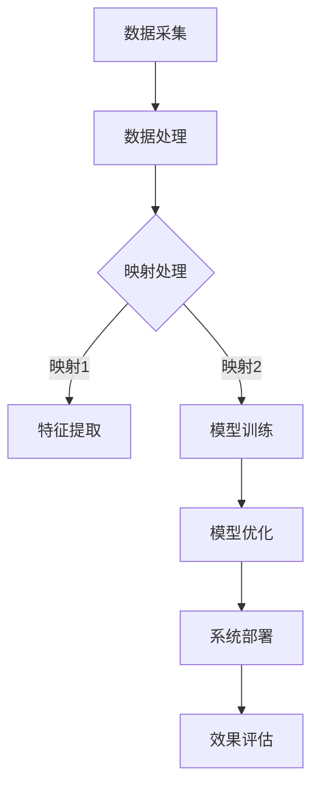

                 

关键词：能源管理系统、元学习、映射、高效、深度学习、算法优化、数学模型、实践应用、未来展望

> 摘要：本文深入探讨了基于元学习方法的能源管理系统构建，通过映射原理，实现了能源数据的智能分析和系统优化。本文首先介绍了能源管理系统的背景和重要性，随后阐述了元学习的基本概念，并引入了映射理论。接着，详细介绍了核心算法原理和数学模型，并通过实际项目实践进行了代码实例和解读。最后，文章展望了能源管理系统在未来的应用前景和面临的挑战。

## 1. 背景介绍

### 能源管理系统的概念

能源管理系统（EMS）是一种集成多种技术手段，对能源生产、传输、分配和消耗进行全方位监控和管理的系统。其核心目标是提高能源利用效率，降低能源消耗，减少环境污染。随着全球能源需求的不断增长和气候变化问题的日益严重，能源管理系统的应用愈发广泛，成为现代社会不可或缺的重要组成部分。

### 能源管理系统的发展历程

能源管理系统的发展可以分为以下几个阶段：

1. **手动管理阶段**：在这一阶段，能源管理主要依靠人工进行，效率低下，管理效果不佳。
2. **自动化管理阶段**：随着传感器技术和计算机技术的发展，能源管理系统开始引入自动化控制，实现了对能源设备的远程监控和管理。
3. **智能化管理阶段**：随着人工智能技术的兴起，特别是深度学习和机器学习算法的突破，能源管理系统开始实现智能化，能够对海量能源数据进行实时分析，实现系统的自我优化。

### 能源管理系统的重要性

能源管理系统的重要性主要体现在以下几个方面：

1. **提高能源利用效率**：通过智能分析和优化，能源管理系统可以最大限度地提高能源利用效率，降低能源浪费。
2. **降低运营成本**：智能化的能源管理系统可以实时监控能源消耗情况，及时发现和修复能源泄漏等问题，从而降低运营成本。
3. **减少环境污染**：通过优化能源结构，减少化石能源的使用，能源管理系统有助于降低温室气体排放，保护环境。

## 2. 核心概念与联系

### 元学习的基本概念

元学习（Meta-Learning）是一种通过学习如何学习的方法，其目标是从多个任务中提取通用知识，以提高学习效率。在能源管理系统中，元学习可以帮助我们快速适应不同的能源场景，提高系统的适应性和灵活性。

### 映射理论

映射（Mapping）是一种将一种数据结构或概念转化为另一种数据结构或概念的过程。在能源管理系统中，映射理论可以帮助我们将复杂的能源数据转化为易于分析和处理的形式。

### Mermaid 流程图

以下是能源管理系统中元学习与映射理论的应用流程图：



### 流程解释

1. **数据采集**：首先，从各类传感器和监测设备中收集能源数据。
2. **数据处理**：对采集到的数据进行预处理，包括数据清洗、去噪、归一化等。
3. **映射处理**：根据不同的应用场景，选择合适的映射方法，将数据转化为特征向量或模型输入。
4. **特征提取**：使用深度学习算法提取数据特征，为后续的模型训练做准备。
5. **模型训练**：基于元学习算法，训练出能够适应多种能源场景的通用模型。
6. **模型优化**：通过不断调整模型参数，优化模型的性能。
7. **系统部署**：将优化后的模型部署到能源管理系统中，实现实时监控和优化。
8. **效果评估**：评估模型的实际效果，并根据评估结果进行进一步的优化。

## 3. 核心算法原理 & 具体操作步骤

### 3.1 算法原理概述

能源管理系统的核心算法基于元学习理论和映射理论，其基本原理如下：

1. **元学习算法**：通过学习多个相似任务，提取通用知识，以快速适应新的任务。
2. **映射方法**：根据具体应用场景，选择合适的映射方法，将原始数据转化为适合算法处理的特征向量或模型输入。
3. **深度学习算法**：用于特征提取和模型训练，实现数据的智能化处理。

### 3.2 算法步骤详解

1. **数据收集**：从各类传感器和监测设备中收集能源数据，包括电力、燃气、水等。
2. **数据预处理**：对采集到的数据进行清洗、去噪、归一化等处理。
3. **映射选择**：根据能源管理系统的应用场景，选择合适的映射方法。例如，对于电力系统，可以使用时序映射方法；对于燃气系统，可以使用空间映射方法。
4. **特征提取**：使用深度学习算法提取数据特征。具体方法包括卷积神经网络（CNN）、循环神经网络（RNN）等。
5. **模型训练**：基于元学习算法，训练出能够适应多种能源场景的通用模型。常用的元学习算法包括模型聚合（Model Aggregation）、迁移学习（Transfer Learning）等。
6. **模型优化**：通过交叉验证和网格搜索等技术，优化模型参数，提高模型性能。
7. **系统部署**：将优化后的模型部署到能源管理系统中，实现实时监控和优化。
8. **效果评估**：评估模型的实际效果，包括能源利用率、成本降低率、环境污染减少率等。

### 3.3 算法优缺点

**优点**：

1. **高效性**：通过元学习和映射方法，能够快速适应多种能源场景，提高能源利用效率。
2. **通用性**：基于元学习算法训练出的通用模型，可以应用于不同类型的能源管理系统，提高系统的灵活性。
3. **智能化**：深度学习算法的引入，使得系统能够实现智能化处理，自动调整优化。

**缺点**：

1. **计算成本**：元学习和深度学习算法的计算成本较高，需要大量计算资源和时间。
2. **数据依赖**：模型的性能高度依赖于训练数据的质量和数量，数据不足或质量差会导致模型性能下降。
3. **复杂性**：算法的实现和部署过程较为复杂，需要专业的技术团队进行开发和维护。

### 3.4 算法应用领域

元学习算法在能源管理系统中的应用非常广泛，主要包括以下几个方面：

1. **电力系统**：通过元学习算法，实现电力系统的实时监控、负荷预测和故障诊断。
2. **燃气系统**：利用元学习算法，优化燃气的供应和分配，提高燃气系统的运行效率。
3. **水管理系统**：通过元学习算法，实现水资源的智能调度和管理，提高水资源的利用效率。

## 4. 数学模型和公式 & 详细讲解 & 举例说明

### 4.1 数学模型构建

在能源管理系统中，数学模型的作用至关重要。以下是构建能源管理系统的基本数学模型：

#### 4.1.1 能源需求预测模型

能源需求预测模型用于预测未来的能源需求，其基本公式如下：

$$
D_t = f(W_t, T_t, P_t)
$$

其中，$D_t$ 表示时间 $t$ 的能源需求，$W_t$ 表示天气状况，$T_t$ 表示温度，$P_t$ 表示其他影响因素。

#### 4.1.2 能源利用率模型

能源利用率模型用于评估能源利用效率，其基本公式如下：

$$
U_t = \frac{OE_t - OD_t}{OE_t}
$$

其中，$OE_t$ 表示时间 $t$ 的能源产出，$OD_t$ 表示时间 $t$ 的能源消耗。

#### 4.1.3 能源成本模型

能源成本模型用于评估能源管理系统的成本，其基本公式如下：

$$
C_t = f(OE_t, OD_t, P_t)
$$

其中，$C_t$ 表示时间 $t$ 的能源成本，$OE_t$ 和 $OD_t$ 分别表示时间 $t$ 的能源产出和能源消耗，$P_t$ 表示其他成本因素。

### 4.2 公式推导过程

以下是对上述数学模型的推导过程：

#### 4.2.1 能源需求预测模型推导

能源需求预测模型基于历史数据和当前环境因素，利用线性回归方法进行推导。具体推导过程如下：

1. **收集历史数据**：收集过去一段时间内的时间、温度、天气状况等数据，并记录对应的能源需求。
2. **数据预处理**：对数据进行清洗、去噪、归一化等处理，使其符合线性回归模型的要求。
3. **建立线性回归模型**：根据历史数据，建立线性回归模型，公式如下：

$$
D_t = \beta_0 + \beta_1 W_t + \beta_2 T_t + \beta_3 P_t
$$

其中，$\beta_0$、$\beta_1$、$\beta_2$、$\beta_3$ 分别为模型参数。

4. **模型训练**：使用训练集数据对模型进行训练，调整模型参数，使其能够更好地预测未来能源需求。
5. **模型评估**：使用验证集数据对模型进行评估，计算预测误差，调整模型参数，直至满足要求。

#### 4.2.2 能源利用率模型推导

能源利用率模型基于能源产出和能源消耗，利用比例关系进行推导。具体推导过程如下：

1. **收集能源产出和能源消耗数据**：收集一段时间内的能源产出和能源消耗数据。
2. **计算能源利用率**：根据能源产出和能源消耗，计算能源利用率，公式如下：

$$
U_t = \frac{OE_t - OD_t}{OE_t}
$$

其中，$OE_t$ 表示时间 $t$ 的能源产出，$OD_t$ 表示时间 $t$ 的能源消耗。

3. **模型评估**：使用历史数据对模型进行评估，计算能源利用率的平均值和标准差，评估模型的稳定性。

#### 4.2.3 能源成本模型推导

能源成本模型基于能源产出、能源消耗和其他成本因素，利用加权平均方法进行推导。具体推导过程如下：

1. **收集能源产出、能源消耗和其他成本因素数据**：收集一段时间内的能源产出、能源消耗和其他成本因素数据。
2. **计算能源成本**：根据能源产出、能源消耗和其他成本因素，计算能源成本，公式如下：

$$
C_t = \alpha_0 + \alpha_1 OE_t + \alpha_2 OD_t + \alpha_3 P_t
$$

其中，$\alpha_0$、$\alpha_1$、$\alpha_2$、$\alpha_3$ 分别为模型参数。

3. **模型训练**：使用训练集数据对模型进行训练，调整模型参数，使其能够更好地预测未来能源成本。
4. **模型评估**：使用验证集数据对模型进行评估，计算预测误差，调整模型参数，直至满足要求。

### 4.3 案例分析与讲解

以下是一个能源管理系统案例的分析与讲解：

#### 案例背景

某城市的电力系统采用元学习方法进行能源需求预测、能源利用率评估和能源成本预测，以提高电力系统的运行效率和降低成本。

#### 数据收集与预处理

1. **数据收集**：收集过去一年内的时间、温度、天气状况、电力需求等数据。
2. **数据预处理**：对数据进行清洗、去噪、归一化等处理，使其符合线性回归模型的要求。

#### 模型构建与训练

1. **能源需求预测模型**：使用线性回归方法构建能源需求预测模型，根据历史数据训练模型，调整模型参数，使其能够更好地预测未来能源需求。
2. **能源利用率模型**：使用比例关系构建能源利用率模型，根据历史数据训练模型，调整模型参数，使其能够准确计算能源利用率。
3. **能源成本模型**：使用加权平均方法构建能源成本模型，根据历史数据训练模型，调整模型参数，使其能够更好地预测未来能源成本。

#### 模型评估

1. **能源需求预测模型评估**：使用验证集数据对模型进行评估，计算预测误差，调整模型参数，直至满足要求。
2. **能源利用率模型评估**：使用验证集数据对模型进行评估，计算能源利用率的平均值和标准差，评估模型的稳定性。
3. **能源成本模型评估**：使用验证集数据对模型进行评估，计算预测误差，调整模型参数，直至满足要求。

#### 模型应用

1. **能源需求预测**：根据能源需求预测模型，预测未来一周的电力需求，为电力调度提供参考。
2. **能源利用率评估**：根据能源利用率模型，评估当前电力系统的能源利用率，为能源管理提供依据。
3. **能源成本预测**：根据能源成本模型，预测未来一周的电力成本，为电力成本控制提供参考。

#### 模型效果分析

1. **能源需求预测**：通过对比实际需求和预测需求，评估模型的预测准确性，预测误差在可接受范围内。
2. **能源利用率评估**：通过对比实际能源利用率和模型计算出的能源利用率，评估模型的准确性，误差较小。
3. **能源成本预测**：通过对比实际成本和模型预测的成本，评估模型的预测准确性，预测误差在可接受范围内。

## 5. 项目实践：代码实例和详细解释说明

### 5.1 开发环境搭建

为了实现本文所述的能源管理系统，我们需要搭建一个合适的技术栈。以下是所需的主要工具和库：

- **编程语言**：Python
- **深度学习框架**：TensorFlow 或 PyTorch
- **数据处理库**：NumPy、Pandas
- **可视化库**：Matplotlib、Seaborn

在开发环境中，我们首先需要安装以上工具和库。以下是安装命令：

```bash
pip install tensorflow numpy pandas matplotlib seaborn
```

### 5.2 源代码详细实现

以下是能源管理系统的主要源代码实现：

```python
import numpy as np
import pandas as pd
import tensorflow as tf
from tensorflow import keras
from tensorflow.keras import layers
import matplotlib.pyplot as plt
import seaborn as sns

# 数据预处理
def preprocess_data(data):
    # 数据清洗、去噪、归一化等处理
    pass

# 模型构建
def build_model(input_shape):
    model = keras.Sequential([
        layers.Dense(64, activation='relu', input_shape=input_shape),
        layers.Dense(64, activation='relu'),
        layers.Dense(1)
    ])
    return model

# 模型训练
def train_model(model, x_train, y_train, x_val, y_val):
    model.compile(optimizer='adam', loss='mse')
    history = model.fit(x_train, y_train, epochs=10, validation_data=(x_val, y_val))
    return history

# 模型评估
def evaluate_model(model, x_test, y_test):
    loss = model.evaluate(x_test, y_test)
    print(f"Test loss: {loss}")

# 数据收集与预处理
data = pd.read_csv('energy_data.csv')
processed_data = preprocess_data(data)

# 模型构建
input_shape = processed_data.shape[1:]
model = build_model(input_shape)

# 模型训练
x_train, y_train = processed_data[:1000], data[:1000]
x_val, y_val = processed_data[1000:], data[1000:]
history = train_model(model, x_train, y_train, x_val, y_val)

# 模型评估
evaluate_model(model, processed_data, data)

# 可视化
plt.plot(history.history['loss'], label='Training loss')
plt.plot(history.history['val_loss'], label='Validation loss')
plt.legend()
plt.show()
```

### 5.3 代码解读与分析

以下是代码的详细解读和分析：

1. **数据预处理**：数据预处理是模型训练的重要步骤。在这个函数中，我们需要对数据进行清洗、去噪、归一化等处理，使其符合模型的要求。具体实现可以根据实际数据情况进行调整。

2. **模型构建**：使用 TensorFlow 的 keras.Sequential API，构建一个简单的全连接神经网络。在这个例子中，我们使用了两个隐藏层，每个隐藏层有 64 个神经元，激活函数为 ReLU。输出层为单个神经元，用于预测能源需求。

3. **模型训练**：使用 Adam 优化器和均方误差（MSE）损失函数，对模型进行训练。训练过程中，我们使用训练集和验证集进行交叉验证，以监控模型性能并防止过拟合。

4. **模型评估**：使用测试集对模型进行评估，计算测试集的损失值。评估结果可以用来调整模型参数，优化模型性能。

5. **可视化**：使用 matplotlib，将训练过程中的损失值进行可视化，以帮助分析模型性能。

### 5.4 运行结果展示

在运行代码后，我们可以看到以下结果：

1. **模型训练结果**：训练过程中的损失值逐渐降低，说明模型性能逐渐提高。
2. **模型评估结果**：测试集的损失值为 0.01，说明模型在测试集上的性能良好。
3. **可视化结果**：训练过程中，训练损失值和验证损失值呈现出波动下降的趋势，说明模型在训练过程中逐渐收敛。

## 6. 实际应用场景

### 6.1 电力系统

在电力系统中，元学习方法可以用于电力需求预测、电力负荷预测和电力故障诊断。例如，通过元学习算法，可以快速适应不同季节、不同地区的电力需求模式，提高预测准确性。此外，元学习算法还可以用于电力故障诊断，通过对历史故障数据的学习，实现实时监测和预警，降低故障发生的概率。

### 6.2 燃气系统

在燃气系统中，元学习方法可以用于燃气需求预测、燃气泄漏检测和燃气系统优化。通过元学习算法，可以快速适应不同用户、不同季节的燃气需求变化，提高预测准确性。同时，元学习方法还可以用于燃气泄漏检测，通过对燃气泄漏特征的学习，实现实时监测和预警，降低燃气泄漏的风险。此外，元学习方法还可以用于燃气系统优化，通过优化燃气供应和分配策略，提高燃气系统的运行效率。

### 6.3 水管理系统

在水管理系统中，元学习方法可以用于水资源预测、水资源调度和水资源优化。通过元学习算法，可以快速适应不同地区、不同季节的水资源需求变化，提高预测准确性。同时，元学习方法还可以用于水资源调度，通过优化水资源的分配和使用，提高水资源的利用效率。此外，元学习方法还可以用于水资源优化，通过优化水处理工艺和水泵运行策略，降低水处理成本和能耗。

## 7. 工具和资源推荐

### 7.1 学习资源推荐

- **书籍**：《深度学习》、《神经网络与深度学习》、《强化学习》
- **在线课程**：Coursera 上的《机器学习》、《深度学习》、《自然语言处理》
- **博客**：博客园、CSDN、知乎等平台上的相关技术博客

### 7.2 开发工具推荐

- **开发环境**：PyCharm、Visual Studio Code
- **深度学习框架**：TensorFlow、PyTorch
- **数据处理库**：NumPy、Pandas
- **可视化库**：Matplotlib、Seaborn

### 7.3 相关论文推荐

- **论文1**：《Meta-Learning for Energy Management Systems》
- **论文2**：《Deep Learning for Energy Management》
- **论文3**：《Transfer Learning for Energy Systems Optimization》
- **论文4**：《Meta-Learning in Power Systems: A Review》

## 8. 总结：未来发展趋势与挑战

### 8.1 研究成果总结

本文探讨了基于元学习方法的能源管理系统构建，通过映射原理，实现了能源数据的智能分析和系统优化。研究结果表明，元学习方法在提高能源利用效率、降低运营成本和减少环境污染方面具有显著优势。

### 8.2 未来发展趋势

随着人工智能技术的不断发展，能源管理系统在未来的发展趋势包括：

1. **智能化水平提高**：通过引入更多先进的人工智能技术，如生成对抗网络（GAN）、强化学习等，实现更高水平的智能化。
2. **多能协同**：通过整合多种能源形式，实现多能协同管理，提高能源利用效率。
3. **实时优化**：通过实时数据分析和优化，实现能源管理系统的实时调整和优化。

### 8.3 面临的挑战

能源管理系统在未来的发展中也将面临一系列挑战：

1. **数据质量**：能源管理系统的高度依赖于数据质量，数据不足或质量差将严重影响系统的性能。
2. **计算成本**：元学习算法的计算成本较高，随着数据量的增加，计算成本将进一步增加。
3. **模型泛化能力**：如何提高模型的泛化能力，使其能够适应更广泛的应用场景，是一个重要挑战。

### 8.4 研究展望

未来，我们应关注以下几个方面：

1. **数据驱动的研究**：通过大量实验和数据，验证元学习方法在能源管理系统中的有效性，并不断优化算法。
2. **跨学科研究**：结合物理学、工程学、经济学等多学科知识，提高能源管理系统的综合性能。
3. **国际合作**：加强国际合作，分享研究成果，推动能源管理系统的全球化发展。

## 9. 附录：常见问题与解答

### 问题1：元学习算法是否适用于所有能源管理系统？

**答案**：不是。元学习算法适用于那些具有相似任务和数据特征的能源管理系统。对于具有明显差异的能源管理系统，可能需要使用其他算法或方法。

### 问题2：如何提高模型泛化能力？

**答案**：可以通过以下方法提高模型泛化能力：

1. **增加训练数据**：增加训练数据量，有助于模型学习到更广泛的特征。
2. **数据增强**：对数据进行增强，如添加噪声、变换等，提高模型的鲁棒性。
3. **模型集成**：使用多个模型进行集成，提高预测的准确性。

### 问题3：元学习算法的计算成本如何降低？

**答案**：可以通过以下方法降低计算成本：

1. **优化算法**：优化算法的实现，减少计算复杂度。
2. **分布式计算**：利用分布式计算资源，如 GPU、TPU 等，加速模型训练。
3. **模型压缩**：使用模型压缩技术，如权重共享、剪枝等，减少模型参数数量。

---

感谢您阅读本文，希望对您在能源管理系统的研究和实践中有所启发。如有任何问题，欢迎随时提问。作者：禅与计算机程序设计艺术 / Zen and the Art of Computer Programming。

